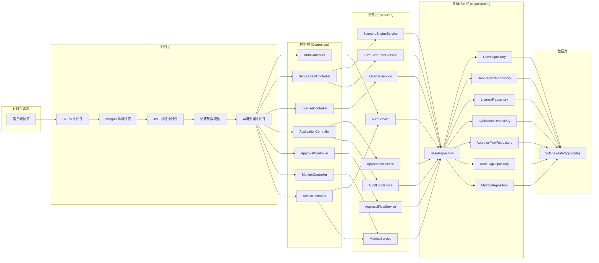
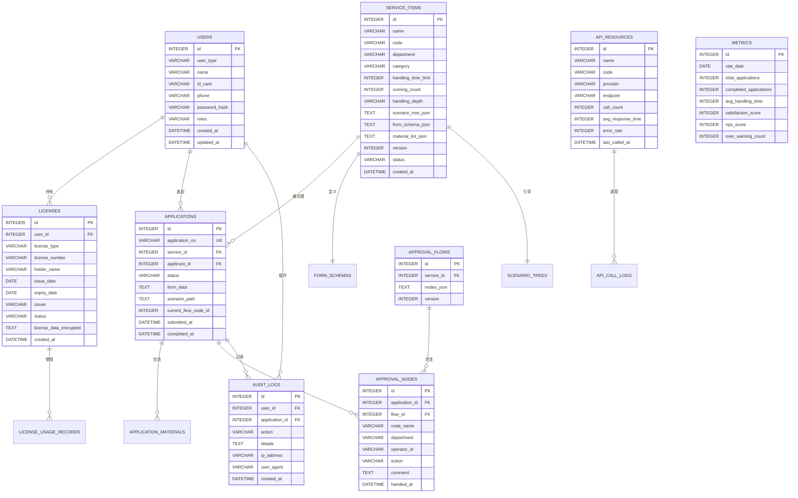

## 1. 架构设计

```mermaid
graph TB
    subgraph "前端层 (React 18 + Vite)"
        A1["省级工作台首页"]
        A2["事项中心"]
        A3["在线申报系统"]
        A4["电子证照中心"]
        A5["办件进度查询"]
        A6["效能监测平台"]
        A7["事项管理后台"]
        A8["数据资源目录"]
    end

    subgraph "网关层 (Vite Proxy / CORS)"
        B["API 网关 / 跨域代理"]
    end

    subgraph "后端服务层 (Express 4 + TypeScript)"
        C1["用户身份认证模块"]
        C2["智能情形引导引擎"]
        C3["政务服务事项模块"]
        C4["极简表单生成器"]
        C5["电子证照管理模块"]
        C6["并联审批流引擎"]
        C7["办件过程留痕模块"]
        C8["服务效能监测模块"]
        C9["数据资源目录模块"]
    end

    subgraph "数据层 (SQLite)"
        D1["用户表 (users)"]
        D2["证照表 (licenses)"]
        D3["事项表 (service_items)"]
        D4["情形引导表 (scenario_trees)"]
        D5["表单定义表 (form_schemas)"]
        D6["办件表 (applications)"]
        D7["审批流表 (approval_flows)"]
        D8["操作日志表 (audit_logs)"]
        D9["效能数据表 (metrics)"]
        D10["接口资源表 (api_resources)"]
    end

    subgraph "外部依赖 (本地模拟)"
        E1["电子证照库对接 (模拟)"]
        E2["卫健/社保/公安数据共享 (模拟)"]
        E3["OCR识别服务 (模拟)"]
        E4["电子签名服务 (模拟)"]
    end

    A1 & A2 & A3 & A4 & A5 & A6 & A7 & A8 --> B
    B --> C1 & C2 & C3 & C4 & C5 & C6 & C7 & C8 & C9
    C1 & C2 & C3 & C4 & C5 & C6 & C7 & C8 & C9 --> D1 & D2 & D3 & D4 & D5 & D6 & D7 & D8 & D9 & D10
    C5 --> E1
    C6 --> E2
    C4 --> E3
    C7 --> E4
```



## 2. 技术描述

### 2.1 前端技术栈
- **框架**: React@18.2.0 + TypeScript@5
- **构建工具**: Vite@5
- **路由**: react-router-dom@6
- **状态管理**: zustand@4
- **UI框架**: tailwindcss@3 + @tailwindcss/forms
- **图标库**: lucide-react
- **图表**: recharts@2
- **二维码**: qrcode.react@3
- **日期处理**: dayjs@1
- **HTTP客户端**: axios@1

### 2.2 后端技术栈
- **框架**: Express@4 + TypeScript@5
- **运行时**: Node.js@18+
- **数据库驱动**: better-sqlite3@9
- **类型安全**: @types/express, @types/better-sqlite3
- **中间件**: cors, morgan, express-async-errors
- **密码加密**: bcryptjs
- **Token认证**: jsonwebtoken
- **文件上传**: multer

### 2.3 数据库
- **数据库**: SQLite 3 (文件存储: data/app.sqlite)
- **连接池**: better-sqlite3 内置
- **数据加密**: 敏感字段 AES 加密存储
- **备份策略**: 每日自动备份至 data/backup/

### 2.4 端口配置
- 项目目录: may-89021
- tail4 = 9021 (89021 后四位)
- **FRONTEND_PORT**: 40000 + 9021 = 49021
- **BACKEND_PORT**: 50000 + 9021 = 59021
- **备用槽位1**: 41000+9021=50021 / 51000+9021=60021
- **备用槽位2**: 42000+9021=51021 / 52000+9021=61021
- **备用槽位3**: 43000+9021=52021 / 53000+9021=62021
- **备用槽位4**: 44000+9021=53021 / 54000+9021=63021
- **备用槽位5**: 45000+9021=54021 / 55000+9021=64021

## 3. 路由定义

| 路由路径 | 页面组件 | 权限要求 | 功能描述 |
|----------|----------|----------|----------|
| `/login` | LoginPage | 公开 | 用户登录页 |
| `/` | DashboardPage | 已登录 | 省级工作台首页 |
| `/services` | ServiceListPage | 已登录 | 政务服务事项列表 |
| `/services/:id` | ServiceDetailPage | 已登录 | 事项详情 + 情形引导 |
| `/apply/:serviceId` | ApplyPage | 已登录 | 在线申报（动态表单） |
| `/licenses` | LicenseCenterPage | 已登录 | 电子证照中心 |
| `/licenses/:id/qr` | LicenseQrPage | 已登录 | 证照二维码亮证 |
| `/applications` | ApplicationListPage | 已登录 | 办件列表 |
| `/applications/:id` | ApplicationDetailPage | 已登录 | 办件进度详情 |
| `/monitor` | MonitorDashboardPage | 运营管理员 | 服务效能监测平台 |
| `/admin/services` | ServiceAdminPage | 运营管理员 | 事项生命周期管理 |
| `/admin/catalog` | DataCatalogPage | 运营管理员 | 政务数据资源目录 |
| `/admin/users` | UserAdminPage | 系统管理员 | 用户权限管理 |

## 4. API 定义

### 4.1 认证接口
```typescript
// POST /api/auth/login
interface LoginRequest {
  idCard: string;
  password: string;
  userType: 'natural' | 'legal' | 'staff';
}
interface LoginResponse {
  token: string;
  user: UserInfo;
}

// GET /api/auth/me
interface UserInfo {
  id: number;
  userType: 'natural' | 'legal' | 'staff' | 'admin';
  name: string;
  idCard: string;
  phone: string;
  roles: string[];
  avatar?: string;
}
```

### 4.2 政务服务事项接口
```typescript
// GET /api/services?keyword=&category=&page=&size=
interface ServiceItem {
  id: number;
  name: string;
  code: string;
  department: string;
  category: string;
  handlingTimeLimit: number;
  runningCount: number;
  handlingDepth: string;
  onlineAvailable: boolean;
  materials: MaterialItem[];
  scenarioTree: ScenarioNode;
  formSchema: FormSchema;
}

// GET /api/services/:id/scenario?answers=
interface ScenarioGuideResponse {
  currentNode: ScenarioNode;
  matchedPath: number[];
  recommendedMaterials: string[];
  estimatedTime: number;
}
```

### 4.3 电子证照接口
```typescript
// GET /api/licenses
interface License {
  id: number;
  userId: number;
  licenseType: string;
  licenseNumber: string;
  holderName: string;
  issueDate: string;
  expiryDate: string;
  issuer: string;
  status: 'valid' | 'expired' | 'revoked';
  qrCodeToken?: string;
  usageRecords: LicenseUsageRecord[];
}

// POST /api/licenses/:id/qrcode
interface QrCodeResponse {
  token: string;
  qrDataUrl: string;
  expiresAt: number;
}

// GET /api/licenses/:id/usage-records
interface LicenseUsageRecord {
  id: number;
  usedAt: string;
  usedBy: string;
  purpose: string;
  location: string;
}
```

### 4.4 办件接口
```typescript
// POST /api/applications
interface CreateApplicationRequest {
  serviceId: number;
  scenarioPath: number[];
  formData: Record<string, any>;
  materials: ApplicationMaterial[];
  signature: string;
}

interface Application {
  id: number;
  applicationNo: string;
  serviceId: number;
  serviceName: string;
  applicantId: number;
  status: 'draft' | 'submitted' | 'reviewing' | 'approved' | 'rejected' | 'completed';
  currentNode: string;
  timeline: ApplicationTimelineItem[];
  createdAt: string;
}

// GET /api/applications/:id/timeline
interface ApplicationTimelineItem {
  nodeName: string;
  operator: string;
  action: string;
  comment?: string;
  timestamp: string;
}
```

### 4.5 效能监测接口
```typescript
// GET /api/metrics/overview
interface MetricsOverview {
  totalApplications: number;
  completionRate: number;
  averageHandlingTime: number;
  satisfactionScore: number;
  npsScore: number;
  overWarningCount: number;
  bottleneckNodes: BottleneckNode[];
}

// GET /api/metrics/bottlenecks
interface BottleneckNode {
  nodeName: string;
  department: string;
  avgWaitTime: number;
  pendingCount: number;
  severity: 'low' | 'medium' | 'high';
}
```

## 5. 服务器架构图



## 6. 数据模型

### 6.1 数据模型 ER 图



### 6.2 数据定义语言 (DDL)

```sql
-- 用户表
CREATE TABLE users (
    id INTEGER PRIMARY KEY AUTOINCREMENT,
    user_type VARCHAR(20) NOT NULL CHECK(user_type IN ('natural', 'legal', 'staff', 'admin')),
    name VARCHAR(100) NOT NULL,
    id_card VARCHAR(50) UNIQUE NOT NULL,
    phone VARCHAR(20),
    password_hash VARCHAR(255) NOT NULL,
    roles TEXT,
    avatar VARCHAR(255),
    created_at DATETIME DEFAULT CURRENT_TIMESTAMP,
    updated_at DATETIME DEFAULT CURRENT_TIMESTAMP
);

-- 电子证照表
CREATE TABLE licenses (
    id INTEGER PRIMARY KEY AUTOINCREMENT,
    user_id INTEGER NOT NULL,
    license_type VARCHAR(50) NOT NULL,
    license_number VARCHAR(100) NOT NULL,
    holder_name VARCHAR(100) NOT NULL,
    issue_date DATE,
    expiry_date DATE,
    issuer VARCHAR(100),
    status VARCHAR(20) DEFAULT 'valid',
    license_data_encrypted TEXT,
    created_at DATETIME DEFAULT CURRENT_TIMESTAMP,
    FOREIGN KEY (user_id) REFERENCES users(id)
);

-- 证照使用记录表
CREATE TABLE license_usage_records (
    id INTEGER PRIMARY KEY AUTOINCREMENT,
    license_id INTEGER NOT NULL,
    used_at DATETIME DEFAULT CURRENT_TIMESTAMP,
    used_by VARCHAR(100),
    purpose VARCHAR(255),
    location VARCHAR(100),
    FOREIGN KEY (license_id) REFERENCES licenses(id)
);

-- 政务服务事项表
CREATE TABLE service_items (
    id INTEGER PRIMARY KEY AUTOINCREMENT,
    name VARCHAR(255) NOT NULL,
    code VARCHAR(50) UNIQUE NOT NULL,
    department VARCHAR(100),
    category VARCHAR(50),
    handling_time_limit INTEGER DEFAULT 20,
    running_count INTEGER DEFAULT 0,
    handling_depth VARCHAR(50),
    scenario_tree_json TEXT,
    form_schema_json TEXT,
    material_list_json TEXT,
    version INTEGER DEFAULT 1,
    status VARCHAR(20) DEFAULT 'online',
    created_at DATETIME DEFAULT CURRENT_TIMESTAMP,
    updated_at DATETIME DEFAULT CURRENT_TIMESTAMP
);

-- 办件表
CREATE TABLE applications (
    id INTEGER PRIMARY KEY AUTOINCREMENT,
    application_no VARCHAR(50) UNIQUE NOT NULL,
    service_id INTEGER NOT NULL,
    applicant_id INTEGER NOT NULL,
    status VARCHAR(20) DEFAULT 'draft',
    form_data TEXT,
    scenario_path TEXT,
    material_hash_list TEXT,
    current_flow_node_id INTEGER,
    submitted_at DATETIME,
    completed_at DATETIME,
    created_at DATETIME DEFAULT CURRENT_TIMESTAMP,
    FOREIGN KEY (service_id) REFERENCES service_items(id),
    FOREIGN KEY (applicant_id) REFERENCES users(id)
);

-- 办件材料表
CREATE TABLE application_materials (
    id INTEGER PRIMARY KEY AUTOINCREMENT,
    application_id INTEGER NOT NULL,
    material_name VARCHAR(255),
    material_type VARCHAR(50),
    file_hash VARCHAR(64),
    file_path VARCHAR(255),
    is_from_license BOOLEAN DEFAULT 0,
    license_id INTEGER,
    created_at DATETIME DEFAULT CURRENT_TIMESTAMP,
    FOREIGN KEY (application_id) REFERENCES applications(id)
);

-- 审批流表
CREATE TABLE approval_flows (
    id INTEGER PRIMARY KEY AUTOINCREMENT,
    service_id INTEGER NOT NULL,
    nodes_json TEXT,
    version INTEGER DEFAULT 1,
    created_at DATETIME DEFAULT CURRENT_TIMESTAMP,
    FOREIGN KEY (service_id) REFERENCES service_items(id)
);

-- 审批节点表
CREATE TABLE approval_nodes (
    id INTEGER PRIMARY KEY AUTOINCREMENT,
    application_id INTEGER NOT NULL,
    flow_id INTEGER NOT NULL,
    node_name VARCHAR(100),
    department VARCHAR(100),
    operator_id INTEGER,
    action VARCHAR(20),
    comment TEXT,
    handled_at DATETIME,
    created_at DATETIME DEFAULT CURRENT_TIMESTAMP,
    FOREIGN KEY (application_id) REFERENCES applications(id),
    FOREIGN KEY (flow_id) REFERENCES approval_flows(id)
);

-- 操作审计日志表
CREATE TABLE audit_logs (
    id INTEGER PRIMARY KEY AUTOINCREMENT,
    user_id INTEGER,
    application_id INTEGER,
    action VARCHAR(100),
    details TEXT,
    ip_address VARCHAR(45),
    user_agent TEXT,
    created_at DATETIME DEFAULT CURRENT_TIMESTAMP
);

-- 效能统计表
CREATE TABLE metrics (
    id INTEGER PRIMARY KEY AUTOINCREMENT,
    stat_date DATE UNIQUE,
    total_applications INTEGER DEFAULT 0,
    completed_applications INTEGER DEFAULT 0,
    avg_handling_time INTEGER DEFAULT 0,
    satisfaction_score INTEGER DEFAULT 0,
    nps_score INTEGER DEFAULT 0,
    over_warning_count INTEGER DEFAULT 0
);

-- 数据资源目录表
CREATE TABLE api_resources (
    id INTEGER PRIMARY KEY AUTOINCREMENT,
    name VARCHAR(255),
    code VARCHAR(50) UNIQUE,
    provider VARCHAR(100),
    endpoint VARCHAR(255),
    call_count INTEGER DEFAULT 0,
    avg_response_time INTEGER DEFAULT 0,
    error_rate INTEGER DEFAULT 0,
    last_called_at DATETIME
);

-- 接口调用日志表
CREATE TABLE api_call_logs (
    id INTEGER PRIMARY KEY AUTOINCREMENT,
    api_resource_id INTEGER,
    request_time DATETIME DEFAULT CURRENT_TIMESTAMP,
    response_time INTEGER,
    status_code INTEGER,
    error_message TEXT,
    FOREIGN KEY (api_resource_id) REFERENCES api_resources(id)
);

-- 创建索引
CREATE INDEX idx_applications_applicant ON applications(applicant_id);
CREATE INDEX idx_applications_status ON applications(status);
CREATE INDEX idx_audit_logs_user ON audit_logs(user_id);
CREATE INDEX idx_audit_logs_application ON audit_logs(application_id);
CREATE INDEX idx_licenses_user ON licenses(user_id);
CREATE INDEX idx_service_items_category ON service_items(category);
CREATE INDEX idx_approval_nodes_application ON approval_nodes(application_id);
```

### 6.3 初始化数据

```sql
-- 插入测试用户
INSERT INTO users (user_type, name, id_card, phone, password_hash, roles) VALUES
('natural', '张三', '340101199001011234', '13800138001', '$2a$10$N9qo8uLOickgx2ZMRZoMyeIjZAgcfl7p92ldGxad68LJZdL17lhWy', 'user'),
('natural', '李四', '340101199202022345', '13800138002', '$2a$10$N9qo8uLOickgx2ZMRZoMyeIjZAgcfl7p92ldGxad68LJZdL17lhWy', 'user'),
('legal', '安徽某某科技有限公司', '91340100MA2MQ12345', '13900139001', '$2a$10$N9qo8uLOickgx2ZMRZoMyeIjZAgcfl7p92ldGxad68LJZdL17lhWy', 'legal_user'),
('staff', '王审批', '340101198803033456', '13700137001', '$2a$10$N9qo8uLOickgx2ZMRZoMyeIjZAgcfl7p92ldGxad68LJZdL17lhWy', 'approver'),
('admin', '系统管理员', '340101198505055678', '13600136001', '$2a$10$N9qo8uLOickgx2ZMRZoMyeIjZAgcfl7p92ldGxad68LJZdL17lhWy', 'admin,operator');

-- 插入电子证照数据
INSERT INTO licenses (user_id, license_type, license_number, holder_name, issue_date, expiry_date, issuer, status) VALUES
(1, '身份证', '340101199001011234', '张三', '2018-05-01', '2038-05-01', '合肥市公安局', 'valid'),
(1, '户口簿', '34010119900101001X', '张三', '2018-05-01', '2099-12-31', '合肥市公安局', 'valid'),
(1, '社会保障卡', 'A12345678', '张三', '2020-03-15', '2030-03-15', '安徽省人力资源和社会保障厅', 'valid'),
(1, '不动产权证', '皖(2021)合肥市不动产权第0012345号', '张三', '2021-06-20', '2091-06-19', '合肥市自然资源和规划局', 'valid'),
(3, '营业执照', '91340100MA2MQ12345', '安徽某某科技有限公司', '2020-01-01', '2099-12-31', '合肥市市场监督管理局', 'valid');

-- 插入高频服务事项
INSERT INTO service_items (name, code, department, category, handling_time_limit, running_count, handling_depth, status, form_schema_json, material_list_json, scenario_tree_json) VALUES
('居民身份证办理', 'GG001', '安徽省公安厅', '户籍证件', 20, 0, '四级全程网办', 'online', '{}', '[]', '{}'),
('社会保障卡申领', 'GG002', '安徽省人力资源和社会保障厅', '社会保障', 15, 0, '四级全程网办', 'online', '{}', '[]', '{}'),
('不动产登记查询', 'GG003', '安徽省自然资源厅', '住房不动产', 3, 0, '四级全程网办', 'online', '{}', '[]', '{}'),
('企业开办一窗通', 'GG004', '安徽省市场监督管理局', '企业开办', 3, 0, '四级全程网办', 'online', '{}', '[]', '{}'),
('驾驶证补换证', 'GG005', '安徽省公安厅', '交通出行', 10, 0, '四级全程网办', 'online', '{}', '[]', '{}'),
('医保报销申请', 'GG006', '安徽省医疗保障局', '医疗卫生', 20, 0, '四级全程网办', 'online', '{}', '[]', '{}'),
('公积金提取', 'GG007', '安徽省住房和城乡建设厅', '住房公积金', 5, 0, '四级全程网办', 'online', '{}', '[]', '{}'),
('个体工商户注册', 'GG008', '安徽省市场监督管理局', '企业开办', 5, 0, '四级全程网办', 'online', '{}', '[]', '{}');

-- 插入数据资源目录
INSERT INTO api_resources (name, code, provider, endpoint, call_count, avg_response_time, error_rate) VALUES
('自然人身份核验接口', 'API001', '安徽省公安厅', '/api/external/police/identity-verify', 15234, 120, 0.1),
('企业工商信息查询', 'API002', '安徽省市场监督管理局', '/api/external/gsj/enterprise-query', 8956, 200, 0.3),
('社保缴费信息查询', 'API003', '安徽省人力资源和社会保障厅', '/api/external/rst/social-insurance-query', 12456, 150, 0.2),
('医保信息查询', 'API004', '安徽省医疗保障局', '/api/external/ybj/medical-insurance-query', 7890, 180, 0.15),
('不动产信息查询', 'API005', '安徽省自然资源厅', '/api/external/zrzyt/real-estate-query', 5678, 250, 0.4),
('电子证照获取接口', 'API006', '安徽省数据资源管理局', '/api/external/sjzyj/license-get', 23456, 100, 0.05),
('电子签章服务', 'API007', '安徽省数据资源管理局', '/api/external/sjzyj/esign', 34567, 80, 0.08),
('OCR文字识别', 'API008', '安徽省数据资源管理局', '/api/external/sjzyj/ocr', 18765, 300, 0.5);
```
