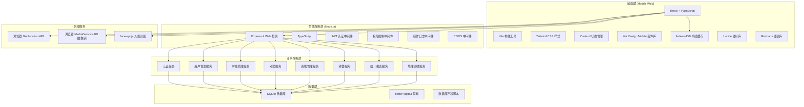
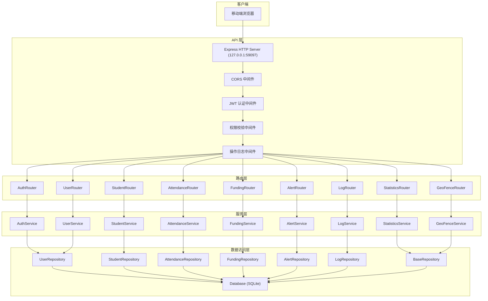

# 河南省中职学生资助监管服务平台 - 技术架构文档

## 1. 架构设计



## 2. 技术描述

### 2.1 前端技术栈
- **框架**: React 18 + TypeScript
- **构建工具**: Vite 5
- **样式方案**: Tailwind CSS 3
- **状态管理**: Zustand 4
- **UI 组件库**: Ant Design Mobile 5
- **图表库**: Recharts 2
- **图标库**: Lucide React
- **人脸识别**: face-api.js
- **离线缓存**: IndexedDB + localForage
- **路由**: React Router DOM 6
- **HTTP 客户端**: Axios
- **端口**: 49097 (绑定 127.0.0.1)

### 2.2 后端技术栈
- **运行环境**: Node.js 18+
- **Web 框架**: Express 4
- **语言**: TypeScript
- **数据库**: SQLite 3 (data/app.sqlite)
- **数据库驱动**: better-sqlite3
- **认证**: JWT (jsonwebtoken)
- **密码加密**: bcryptjs
- **日期处理**: dayjs
- **CORS**: cors 中间件
- **端口**: 59097 (绑定 127.0.0.1)

### 2.3 初始化方式
- 使用 `vite-init` 模板 `react-express-ts` 初始化项目
- 前后端分离架构，前端代码在 `src/`，后端代码在 `api/`
- 共享类型定义在 `shared/` 目录

## 3. 路由定义

### 3.1 前端路由

| 路由路径 | 页面组件 | 权限要求 | 说明 |
|----------|----------|----------|------|
| `/login` | `Login` | 公开 | 登录页面 |
| `/` | `Home` | 已登录 | 首页 - 数据概览 |
| `/attendance` | `Attendance` | 已登录 | 考勤管理 |
| `/attendance/checkin` | `CheckIn` | 已登录 | 人脸打卡页面 |
| `/attendance/records` | `AttendanceRecords` | 已登录 | 考勤记录 |
| `/students` | `Students` | 已登录 | 学生管理 |
| `/students/:id` | `StudentDetail` | 已登录 | 学生详情 |
| `/students/geofence` | `GeoFence` | 已登录 | 地理围栏设置 |
| `/funding` | `Funding` | 已登录 | 资助管理 |
| `/funding/compare` | `FundingCompare` | 已登录 | 资助名单比对 |
| `/funding/distribution` | `FundingDistribution` | 已登录 | 发放进度追踪 |
| `/funding/voucher` | `FundingVoucher` | 已登录 | 电子签收凭证 |
| `/statistics` | `Statistics` | 已登录 | 统计报表 |
| `/alerts` | `Alerts` | 已登录 | 预警中心 |
| `/alerts/:id` | `AlertDetail` | 已登录 | 预警详情 |
| `/profile` | `Profile` | 已登录 | 个人中心 |
| `/profile/logs` | `OperationLogs` | 已登录 | 操作日志 |
| `/profile/offline` | `OfflineSync` | 已登录 | 离线同步 |

### 3.2 后端 API 路由

| 方法 | 路由路径 | 说明 | 权限 |
|------|----------|------|------|
| POST | `/api/auth/login` | 用户登录 | 公开 |
| POST | `/api/auth/logout` | 用户登出 | 已登录 |
| GET | `/api/auth/profile` | 获取当前用户信息 | 已登录 |
| PUT | `/api/auth/password` | 修改密码 | 已登录 |
| GET | `/api/users` | 获取用户列表 | 市级管理员 |
| POST | `/api/users` | 创建用户 | 市级管理员 |
| PUT | `/api/users/:id` | 更新用户 | 市级管理员 |
| DELETE | `/api/users/:id` | 删除用户 | 市级管理员 |
| GET | `/api/students` | 获取学生列表 | 已登录 |
| POST | `/api/students` | 创建学生 | 学校管理员 |
| PUT | `/api/students/:id` | 更新学生 | 学校管理员 |
| DELETE | `/api/students/:id` | 删除学生 | 学校管理员 |
| POST | `/api/students/:id/face` | 上传学生人脸照片 | 学校管理员 |
| GET | `/api/attendance` | 获取考勤记录 | 已登录 |
| POST | `/api/attendance/checkin` | 考勤打卡 | 已登录 |
| GET | `/api/attendance/statistics` | 考勤统计 | 已登录 |
| GET | `/api/funding` | 获取资助名单 | 已登录 |
| POST | `/api/funding/compare` | 资助名单比对 | 已登录 |
| GET | `/api/funding/distribution` | 获取发放进度 | 已登录 |
| PUT | `/api/funding/distribution/:id` | 更新发放状态 | 已登录 |
| GET | `/api/funding/voucher/:id` | 生成电子凭证 | 已登录 |
| GET | `/api/alerts` | 获取预警列表 | 已登录 |
| PUT | `/api/alerts/:id/process` | 处理预警 | 已登录 |
| GET | `/api/statistics/attendance` | 考勤统计报表 | 已登录 |
| GET | `/api/statistics/funding` | 资助统计报表 | 已登录 |
| GET | `/api/geofence` | 获取地理围栏配置 | 已登录 |
| PUT | `/api/geofence` | 更新地理围栏配置 | 学校管理员 |
| GET | `/api/logs` | 获取操作日志 | 已登录 |
| GET | `/api/health` | 健康检查 | 公开 |

## 4. API 定义

### 4.1 通用响应结构

```typescript
interface ApiResponse<T> {
  code: number;
  message: string;
  data: T;
  timestamp: number;
}

interface PageResponse<T> {
  list: T[];
  total: number;
  page: number;
  pageSize: number;
}
```

### 4.2 数据类型定义

```typescript
// 用户类型
interface User {
  id: number;
  username: string;
  name: string;
  role: 'school_admin' | 'city_admin';
  schoolId?: number;
  phone?: string;
  avatar?: string;
  status: 'active' | 'disabled';
  createdAt: string;
  updatedAt: string;
}

// 学校类型
interface School {
  id: number;
  name: string;
  address: string;
  city: string;
  district: string;
  geoFence?: GeoFenceConfig;
  createdAt: string;
}

// 地理围栏配置
interface GeoFenceConfig {
  centerLat: number;
  centerLng: number;
  radius: number;
  polygon?: Array<{ lat: number; lng: number }>;
}

// 学生类型
interface Student {
  id: number;
  studentNo: string;
  name: string;
  gender: 'male' | 'female';
  grade: string;
  className: string;
  schoolId: number;
  idCard: string;
  phone?: string;
  faceData?: string;
  isPoverty: boolean;
  isFundingEligible: boolean;
  status: 'active' | 'graduated' | 'suspended';
  createdAt: string;
  updatedAt: string;
}

// 考勤记录
interface AttendanceRecord {
  id: number;
  studentId: number;
  studentName: string;
  schoolId: number;
  checkInTime: string;
  checkInType: 'face' | 'manual';
  locationLat: number;
  locationLng: number;
  locationAccuracy: number;
  isInFence: boolean;
  faceMatchScore: number;
  status: 'normal' | 'late' | 'absent' | 'exception';
  remark?: string;
}

// 资助记录
interface FundingRecord {
  id: number;
  studentId: number;
  studentName: string;
  schoolId: number;
  fundingType: string;
  amount: number;
  batchNo: string;
  status: 'pending' | 'approved' | 'distributed' | 'received';
  applyTime: string;
  approveTime?: string;
  distributeTime?: string;
  receiveTime?: string;
  voucherCode?: string;
}

// 预警记录
interface AlertRecord {
  id: number;
  schoolId: number;
  type: 'abnormal_leave' | 'absent' | 'funding_exception';
  level: 'low' | 'medium' | 'high';
  studentId?: number;
  studentName?: string;
  title: string;
  description: string;
  status: 'pending' | 'processing' | 'resolved';
  handlerId?: number;
  handlerName?: string;
  handleTime?: string;
  handleRemark?: string;
  createdAt: string;
}

// 操作日志
interface OperationLog {
  id: number;
  userId: number;
  userName: string;
  operation: string;
  module: string;
  ip: string;
  userAgent: string;
  detail?: string;
  createdAt: string;
}

// 统计数据
interface AttendanceStats {
  date: string;
  schoolId: number;
  totalStudents: number;
  checkedIn: number;
  absent: number;
  late: number;
  exception: number;
  attendanceRate: number;
}
```

## 5. 服务端架构图



## 6. 数据模型

### 6.1 ER 图


### 6.2 DDL 语句

```sql
-- 学校表
CREATE TABLE IF NOT EXISTS schools (
  id INTEGER PRIMARY KEY AUTOINCREMENT,
  name VARCHAR(255) NOT NULL,
  address VARCHAR(500),
  city VARCHAR(100),
  district VARCHAR(100),
  created_at DATETIME DEFAULT CURRENT_TIMESTAMP
);

-- 地理围栏表
CREATE TABLE IF NOT EXISTS geo_fences (
  id INTEGER PRIMARY KEY AUTOINCREMENT,
  school_id INTEGER NOT NULL UNIQUE,
  center_lat REAL NOT NULL,
  center_lng REAL NOT NULL,
  radius REAL NOT NULL DEFAULT 500,
  polygon TEXT,
  created_at DATETIME DEFAULT CURRENT_TIMESTAMP,
  updated_at DATETIME DEFAULT CURRENT_TIMESTAMP,
  FOREIGN KEY (school_id) REFERENCES schools(id)
);

-- 用户表
CREATE TABLE IF NOT EXISTS users (
  id INTEGER PRIMARY KEY AUTOINCREMENT,
  username VARCHAR(50) NOT NULL UNIQUE,
  password_hash VARCHAR(255) NOT NULL,
  name VARCHAR(100) NOT NULL,
  role VARCHAR(20) NOT NULL CHECK (role IN ('school_admin', 'city_admin')),
  school_id INTEGER,
  phone VARCHAR(20),
  avatar VARCHAR(500),
  status VARCHAR(20) NOT NULL DEFAULT 'active' CHECK (status IN ('active', 'disabled')),
  created_at DATETIME DEFAULT CURRENT_TIMESTAMP,
  updated_at DATETIME DEFAULT CURRENT_TIMESTAMP,
  FOREIGN KEY (school_id) REFERENCES schools(id)
);

-- 学生表
CREATE TABLE IF NOT EXISTS students (
  id INTEGER PRIMARY KEY AUTOINCREMENT,
  student_no VARCHAR(50) NOT NULL UNIQUE,
  name VARCHAR(100) NOT NULL,
  gender VARCHAR(10) NOT NULL CHECK (gender IN ('male', 'female')),
  grade VARCHAR(50) NOT NULL,
  class VARCHAR(50) NOT NULL,
  school_id INTEGER NOT NULL,
  id_card VARCHAR(18) NOT NULL UNIQUE,
  phone VARCHAR(20),
  face_data TEXT,
  is_poverty BOOLEAN NOT NULL DEFAULT 0,
  is_funding_eligible BOOLEAN NOT NULL DEFAULT 1,
  status VARCHAR(20) NOT NULL DEFAULT 'active' CHECK (status IN ('active', 'graduated', 'suspended')),
  created_at DATETIME DEFAULT CURRENT_TIMESTAMP,
  updated_at DATETIME DEFAULT CURRENT_TIMESTAMP,
  FOREIGN KEY (school_id) REFERENCES schools(id)
);

-- 考勤记录表
CREATE TABLE IF NOT EXISTS attendance_records (
  id INTEGER PRIMARY KEY AUTOINCREMENT,
  student_id INTEGER NOT NULL,
  student_name VARCHAR(100) NOT NULL,
  school_id INTEGER NOT NULL,
  check_in_time DATETIME NOT NULL,
  check_in_type VARCHAR(20) NOT NULL DEFAULT 'face' CHECK (check_in_type IN ('face', 'manual')),
  location_lat REAL,
  location_lng REAL,
  location_accuracy REAL,
  is_in_fence BOOLEAN NOT NULL DEFAULT 0,
  face_match_score REAL,
  status VARCHAR(20) NOT NULL DEFAULT 'normal' CHECK (status IN ('normal', 'late', 'absent', 'exception')),
  remark TEXT,
  created_at DATETIME DEFAULT CURRENT_TIMESTAMP,
  FOREIGN KEY (student_id) REFERENCES students(id),
  FOREIGN KEY (school_id) REFERENCES schools(id)
);

-- 资助记录表
CREATE TABLE IF NOT EXISTS funding_records (
  id INTEGER PRIMARY KEY AUTOINCREMENT,
  student_id INTEGER NOT NULL,
  student_name VARCHAR(100) NOT NULL,
  school_id INTEGER NOT NULL,
  funding_type VARCHAR(100) NOT NULL,
  amount DECIMAL(10,2) NOT NULL,
  batch_no VARCHAR(50),
  status VARCHAR(20) NOT NULL DEFAULT 'pending' CHECK (status IN ('pending', 'approved', 'distributed', 'received')),
  apply_time DATETIME DEFAULT CURRENT_TIMESTAMP,
  approve_time DATETIME,
  distribute_time DATETIME,
  receive_time DATETIME,
  voucher_code VARCHAR(100),
  created_at DATETIME DEFAULT CURRENT_TIMESTAMP,
  updated_at DATETIME DEFAULT CURRENT_TIMESTAMP,
  FOREIGN KEY (student_id) REFERENCES students(id),
  FOREIGN KEY (school_id) REFERENCES schools(id)
);

-- 预警记录表
CREATE TABLE IF NOT EXISTS alert_records (
  id INTEGER PRIMARY KEY AUTOINCREMENT,
  school_id INTEGER NOT NULL,
  type VARCHAR(50) NOT NULL CHECK (type IN ('abnormal_leave', 'absent', 'funding_exception')),
  level VARCHAR(20) NOT NULL CHECK (level IN ('low', 'medium', 'high')),
  student_id INTEGER,
  student_name VARCHAR(100),
  title VARCHAR(255) NOT NULL,
  description TEXT,
  status VARCHAR(20) NOT NULL DEFAULT 'pending' CHECK (status IN ('pending', 'processing', 'resolved')),
  handler_id INTEGER,
  handler_name VARCHAR(100),
  handle_time DATETIME,
  handle_remark TEXT,
  created_at DATETIME DEFAULT CURRENT_TIMESTAMP,
  FOREIGN KEY (school_id) REFERENCES schools(id),
  FOREIGN KEY (student_id) REFERENCES students(id),
  FOREIGN KEY (handler_id) REFERENCES users(id)
);

-- 操作日志表
CREATE TABLE IF NOT EXISTS operation_logs (
  id INTEGER PRIMARY KEY AUTOINCREMENT,
  user_id INTEGER NOT NULL,
  user_name VARCHAR(100) NOT NULL,
  operation VARCHAR(255) NOT NULL,
  module VARCHAR(100) NOT NULL,
  ip VARCHAR(50),
  user_agent VARCHAR(500),
  detail TEXT,
  created_at DATETIME DEFAULT CURRENT_TIMESTAMP,
  FOREIGN KEY (user_id) REFERENCES users(id)
);

-- 索引
CREATE INDEX IF NOT EXISTS idx_attendance_student ON attendance_records(student_id);
CREATE INDEX IF NOT EXISTS idx_attendance_school ON attendance_records(school_id);
CREATE INDEX IF NOT EXISTS idx_attendance_time ON attendance_records(check_in_time);
CREATE INDEX IF NOT EXISTS idx_funding_student ON funding_records(student_id);
CREATE INDEX IF NOT EXISTS idx_funding_school ON funding_records(school_id);
CREATE INDEX IF NOT EXISTS idx_funding_batch ON funding_records(batch_no);
CREATE INDEX IF NOT EXISTS idx_alert_school ON alert_records(school_id);
CREATE INDEX IF NOT EXISTS idx_alert_status ON alert_records(status);
CREATE INDEX IF NOT EXISTS idx_alert_created ON alert_records(created_at);
CREATE INDEX IF NOT EXISTS idx_log_user ON operation_logs(user_id);
CREATE INDEX IF NOT EXISTS idx_log_created ON operation_logs(created_at);
CREATE INDEX IF NOT EXISTS idx_student_school ON students(school_id);
CREATE INDEX IF NOT EXISTS idx_student_class ON students(grade, class);
```

### 6.3 初始数据

```sql
-- 插入示例学校
INSERT INTO schools (id, name, address, city, district) VALUES
(1, '河南省第一中等职业学校', '郑州市金水区文化路100号', '郑州市', '金水区'),
(2, '郑州市职业教育中心', '郑州市中原区中原路200号', '郑州市', '中原区');

-- 插入地理围栏
INSERT INTO geo_fences (school_id, center_lat, center_lng, radius) VALUES
(1, 34.7586, 113.6632, 500),
(2, 34.7466, 113.6254, 500);

-- 插入示例用户 (密码: 123456)
INSERT INTO users (id, username, password_hash, name, role, school_id, phone, status) VALUES
(1, 'admin', '$2a$10$N9qo8uLOickgx2ZMRZoMyeIjZAgcfl7p92ldGxad68LJZdL17lhWy', '市级管理员', 'city_admin', NULL, '13800138000', 'active'),
(2, 'school1', '$2a$10$N9qo8uLOickgx2ZMRZoMyeIjZAgcfl7p92ldGxad68LJZdL17lhWy', '张校长', 'school_admin', 1, '13800138001', 'active'),
(3, 'school2', '$2a$10$N9qo8uLOickgx2ZMRZoMyeIjZAgcfl7p92ldGxad68LJZdL17lhWy', '李校长', 'school_admin', 2, '13800138002', 'active');

-- 插入示例学生
INSERT INTO students (student_no, name, gender, grade, class, school_id, id_card, is_poverty, is_funding_eligible, status) VALUES
('2024001', '张三', 'male', '2024级', '计算机1班', 1, '410101200801010001', 1, 1, 'active'),
('2024002', '李四', 'female', '2024级', '计算机1班', 1, '410101200801010002', 0, 1, 'active'),
('2024003', '王五', 'male', '2024级', '计算机2班', 1, '410101200801010003', 1, 1, 'active'),
('2024004', '赵六', 'female', '2024级', '计算机2班', 1, '410101200801010004', 1, 0, 'active'),
('2024005', '孙七', 'male', '2024级', '机电1班', 2, '410102200801010005', 0, 1, 'active'),
('2024006', '周八', 'female', '2024级', '机电1班', 2, '410102200801010006', 1, 1, 'active');
```
