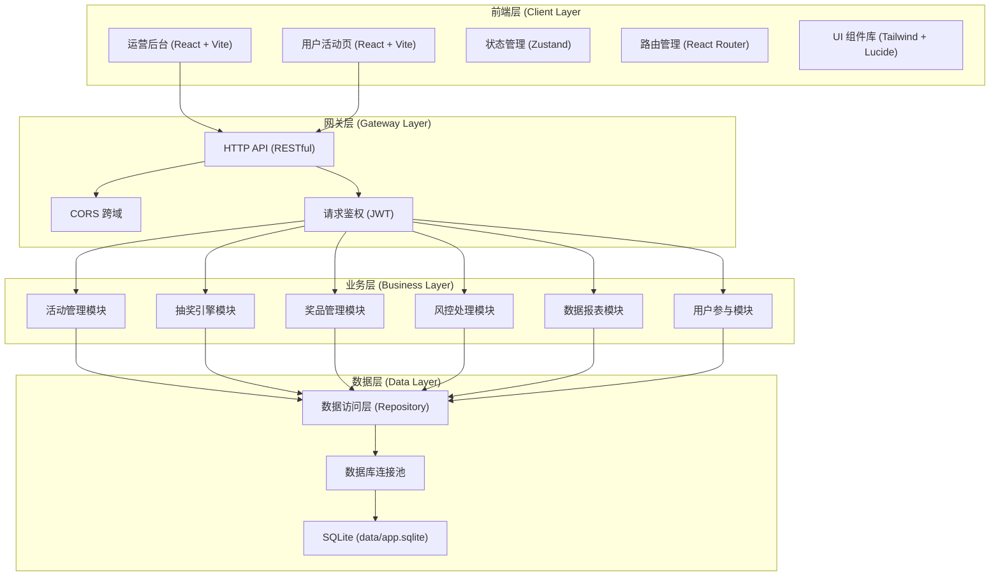
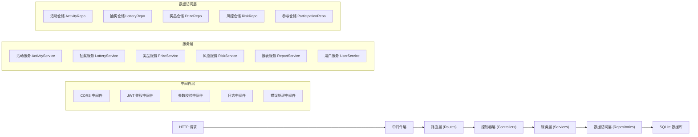
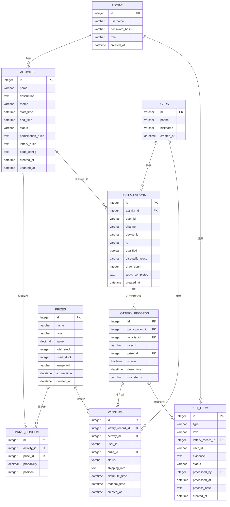

## 1. 架构设计



## 2. 技术描述

### 2.1 技术栈选型

- **前端**：React@18 + TypeScript + Vite@5 + TailwindCSS@3 + Zustand@4 + React Router@6
- **后端**：Express@4 + TypeScript + better-sqlite3
- **数据库**：SQLite 3 (文件数据库 `data/app.sqlite)
- **其他依赖**：
  - lucide-react (图标)
  - dayjs (日期处理)
  - jsonwebtoken (鉴权)
  - bcryptjs (密码加密)
  - zod (参数校验)
  - recharts (图表)
  - clsx + tailwind-merge (样式工具)

### 2.2 项目初始化

使用 `react-express-ts` 模板初始化项目，包含前后端一体化结构。

- **项目根目录**：`/Users/chen/Documents/trae_projects/local_projects/may-63481`
- **前端源码**：`src/`
- **后端源码**：`api/`
- **数据库文件**：`data/app.sqlite`
- **共享类型**：`shared/types.ts`

### 2.3 端口配置

- **项目标识**：may-63481 → N=63481 → tail4=3481
- **前端端口**：FRONTEND_PORT = 40000 + 3481 = **43481**
- **后端端口**：BACKEND_PORT = 50000 + 3481 = **53481**
- **备用槽位**：41000/51000 → 42000/52000 → 43000/53000 → 44000/54000 → 45000/55000
- **监听地址**：127.0.0.1（仅本地访问）
- **端口检查**：启动前执行 `lsof -ti tcp:$PORT 检查占用

## 3. 路由定义

### 3.1 前端路由

| 路由路径 | 页面组件 | 权限 | 说明 |
|------------|----------|------|------|
| `/login` | LoginPage | 公开 | 运营后台登录 |
| `/admin/dashboard` | DashboardPage | 运营/财务/风控 | 数据仪表盘 |
| `/admin/activities` | ActivityListPage | 运营 | 活动列表 |
| `/admin/activities/new` | ActivityEditPage | 运营 | 新建活动 |
| `/admin/activities/:id` | ActivityDetailPage | 运营 | 活动详情 |
| `/admin/activities/:id/edit` | ActivityEditPage | 运营 | 编辑活动 |
| `/admin/prizes` | PrizeListPage | 运营/财务 | 奖品列表 |
| `/admin/prizes/new` | PrizeEditPage | 运营 | 新建奖品 |
| `/admin/prizes/:id/edit` | PrizeEditPage | 运营 | 编辑奖品 |
| `/admin/distributions` | DistributionPage | 运营/客服 | 奖品发放 |
| `/admin/risk` | RiskQueuePage | 风控 | 风控队列 |
| `/admin/risk/:id` | RiskEvidencePage | 风控 | 风控证据详情 |
| `/admin/reports` | ReportPage | 运营/财务 | 数据报表 |
| `/activity/:id` | UserActivityPage | 公开/用户 | 用户活动页 |
| `/my-prizes` | MyPrizesPage | 用户 | 我的奖品 |

### 3.2 后端 API 路由

| 方法 | 路径 | 模块 | 说明 |
|------|------|------|------|
| POST | `/api/auth/login` | 鉴权 | 运营登录 |
| GET | `/api/health` | 系统 | 健康检查 |
| GET | `/api/activities` | 活动 | 活动列表 |
| GET | `/api/activities/:id` | 活动 | 活动详情 |
| POST | `/api/activities` | 活动 | 创建活动 |
| PUT | `/api/activities/:id` | 活动 | 更新活动 |
| PATCH | `/api/activities/:id/status` | 活动 | 活动上下架 |
| GET | `/api/prizes` | 奖品 | 奖品列表 |
| GET | `/api/prizes/:id` | 奖品 | 奖品详情 |
| POST | `/api/prizes` | 奖品 | 创建奖品 |
| PUT | `/api/prizes/:id` | 奖品 | 更新奖品 |
| GET | `/api/participations` | 参与 | 参与记录列表 |
| POST | `/api/participations/qualify` | 参与 | 资格校验 |
| POST | `/api/participations/task/:taskId` | 参与 | 完成任务 |
| POST | `/api/lottery/draw` | 抽奖 | 执行抽奖 |
| GET | `/api/lottery/records` | 抽奖 | 抽奖记录 |
| GET | `/api/winners` | 中奖 | 中奖记录 |
| POST | `/api/winners/:id/distribute` | 发放 | 发放奖品 |
| POST | `/api/winners/:id/ship` | 发放 | 录入物流 |
| POST | `/api/winners/:id/redeem` | 发放 | 核销奖品 |
| POST | `/api/winners/:id/reissue` | 发放 | 申请补发 |
| GET | `/api/risk/queue` | 风控 | 风控队列 |
| POST | `/api/risk/:id/process` | 风控 | 处理风控项 |
| GET | `/api/risk/:id/evidence` | 风控 | 风控证据 |
| GET | `/api/reports/summary` | 报表 | 报表汇总 |
| GET | `/api/reports/export` | 报表 | 导出报表 |
| GET | `/api/user/activities/:id` | 用户端 | 获取活动配置 |
| POST | `/api/user/participate` | 用户端 | 用户参与 |
| GET | `/api/user/winners` | 用户端 | 用户中奖记录 |

## 4. API 定义

### 4.1 核心类型定义

```typescript
// shared/types.ts

export interface Activity {
  id: number;
  name: string;
  description: string;
  theme: ActivityTheme;
  startTime: Date;
  endTime: Date;
  status: 'draft' | 'published' | 'ended';
  participationRules: ParticipationRules;
  lotteryRules: LotteryRules;
  prizes: PrizeConfig[];
  pageConfig: PageConfig;
  createdAt: Date;
  updatedAt: Date;
}

export interface ParticipationRules {
  requireLogin: boolean;
  dailyLimit: number;
  totalLimit: number;
  requiredTasks: TaskConfig[];
  eligibleUserGroups: string[];
}

export interface LotteryRules {
  type: 'wheel' | 'grid' | 'slot';
  probabilityMode: 'equal' | 'weighted' | 'custom';
  probabilities: PrizeProbability[];
  winLimit: number;
  preventDuplicateWin: boolean;
}

export interface Prize {
  id: number;
  name: string;
  type: 'physical' | 'coupon' | 'points' | 'virtual';
  value: number;
  totalStock: number;
  usedStock: number;
  imageUrl: string;
  expireTime?: Date;
  createdAt: Date;
}

export interface Participation {
  id: number;
  activityId: number;
  userId: string;
  channel: string;
  deviceId: string;
  ip: string;
  qualified: boolean;
  disqualifyReason?: string;
  drawCount: number;
  tasksCompleted: number[];
  createdAt: Date;
}

export interface LotteryRecord {
  id: number;
  participationId: number;
  activityId: number;
  userId: string;
  prizeId?: number;
  isWin: boolean;
  drawTime: Date;
  riskStatus: 'normal' | 'pending' | 'rejected' | 'approved';
}

export interface Winner {
  id: number;
  lotteryRecordId: number;
  activityId: number;
  userId: string;
  prizeId: number;
  status: 'pending' | 'distributed' | 'shipped' | 'delivered' | 'redeemed' | 'cancelled';
  shippingInfo?: ShippingInfo;
  distributeTime?: Date;
  redeemTime?: Date;
  createdAt: Date;
}

export interface RiskItem {
  id: number;
  type: 'abnormal_account' | 'device_fraud' | 'address_cluster' | 'high_frequency';
  level: 'low' | 'medium' | 'high';
  lotteryRecordId?: number;
  userId?: string;
  evidence: RiskEvidence;
  status: 'pending' | 'processed' | 'dismissed';
  processedBy?: number;
  processedAt?: Date;
  processNote?: string;
  createdAt: Date;
}

export interface ReportSummary {
  activityId: number;
  totalParticipants: number;
  uniqueUsers: number;
  drawCount: number;
  conversionRate: number;
  totalWinCount: number;
  winRate: number;
  totalCost: number;
  distributionRate: number;
  complaintCount: number;
}
```

### 4.2 请求响应规范

```typescript
// 统一响应结构
interface ApiResponse<T> {
  code: number;
  message: string;
  data: T;
  timestamp: number;
}

// 分页响应
interface PaginatedResponse<T> {
  items: T[];
  total: number;
  page: number;
  pageSize: number;
  totalPages: number;
}

// 抽奖请求
interface DrawRequest {
  activityId: number;
  userId: string;
  deviceId: string;
  channel: string;
}

// 抽奖响应
interface DrawResponse {
  isWin: boolean;
  prize?: Prize;
  lotteryRecordId: number;
  nextDrawAvailableAt?: Date;
}
```

## 5. 服务端架构



## 6. 数据模型

### 6.1 ER 图



### 6.2 DDL 语句

```sql
-- 管理员表
CREATE TABLE IF NOT EXISTS admins (
  id INTEGER PRIMARY KEY AUTOINCREMENT,
  username VARCHAR(50) NOT NULL UNIQUE,
  password_hash VARCHAR(255) NOT NULL,
  role VARCHAR(20) NOT NULL DEFAULT 'operator',
  created_at DATETIME NOT NULL DEFAULT CURRENT_TIMESTAMP
);

-- 活动表
CREATE TABLE IF NOT EXISTS activities (
  id INTEGER PRIMARY KEY AUTOINCREMENT,
  name VARCHAR(200) NOT NULL,
  description TEXT,
  theme VARCHAR(100) NOT NULL DEFAULT 'default',
  start_time DATETIME NOT NULL,
  end_time DATETIME NOT NULL,
  status VARCHAR(20) NOT NULL DEFAULT 'draft',
  participation_rules TEXT NOT NULL,
  lottery_rules TEXT NOT NULL,
  page_config TEXT,
  created_at DATETIME NOT NULL DEFAULT CURRENT_TIMESTAMP,
  updated_at DATETIME NOT NULL DEFAULT CURRENT_TIMESTAMP
);

-- 奖品表
CREATE TABLE IF NOT EXISTS prizes (
  id INTEGER PRIMARY KEY AUTOINCREMENT,
  name VARCHAR(200) NOT NULL,
  type VARCHAR(20) NOT NULL,
  value DECIMAL(10,2) NOT NULL DEFAULT 0,
  total_stock INTEGER NOT NULL DEFAULT 0,
  used_stock INTEGER NOT NULL DEFAULT 0,
  image_url VARCHAR(500),
  expire_time DATETIME,
  created_at DATETIME NOT NULL DEFAULT CURRENT_TIMESTAMP
);

-- 活动奖品配置表
CREATE TABLE IF NOT EXISTS prize_configs (
  id INTEGER PRIMARY KEY AUTOINCREMENT,
  activity_id INTEGER NOT NULL,
  prize_id INTEGER NOT NULL,
  probability DECIMAL(5,4) NOT NULL DEFAULT 0,
  position INTEGER NOT NULL DEFAULT 0,
  FOREIGN KEY (activity_id) REFERENCES activities(id),
  FOREIGN KEY (prize_id) REFERENCES prizes(id)
);

-- 用户参与表
CREATE TABLE IF NOT EXISTS users (
  id VARCHAR(64) PRIMARY KEY,
  phone VARCHAR(20),
  nickname VARCHAR(100),
  created_at DATETIME NOT NULL DEFAULT CURRENT_TIMESTAMP
);

-- 参与记录表
CREATE TABLE IF NOT EXISTS participations (
  id INTEGER PRIMARY KEY AUTOINCREMENT,
  activity_id INTEGER NOT NULL,
  user_id VARCHAR(64) NOT NULL,
  channel VARCHAR(50) NOT NULL DEFAULT 'direct',
  device_id VARCHAR(100),
  ip VARCHAR(45),
  qualified BOOLEAN NOT NULL DEFAULT 1,
  disqualify_reason VARCHAR(500),
  draw_count INTEGER NOT NULL DEFAULT 0,
  tasks_completed TEXT,
  created_at DATETIME NOT NULL DEFAULT CURRENT_TIMESTAMP,
  FOREIGN KEY (activity_id) REFERENCES activities(id),
  FOREIGN KEY (user_id) REFERENCES users(id)
);

-- 抽奖记录表
CREATE TABLE IF NOT EXISTS lottery_records (
  id INTEGER PRIMARY KEY AUTOINCREMENT,
  participation_id INTEGER NOT NULL,
  activity_id INTEGER NOT NULL,
  user_id VARCHAR(64) NOT NULL,
  prize_id INTEGER,
  is_win BOOLEAN NOT NULL DEFAULT 0,
  draw_time DATETIME NOT NULL DEFAULT CURRENT_TIMESTAMP,
  risk_status VARCHAR(20) NOT NULL DEFAULT 'normal',
  FOREIGN KEY (participation_id) REFERENCES participations(id),
  FOREIGN KEY (activity_id) REFERENCES activities(id),
  FOREIGN KEY (user_id) REFERENCES users(id),
  FOREIGN KEY (prize_id) REFERENCES prizes(id)
);

-- 中奖表
CREATE TABLE IF NOT EXISTS winners (
  id INTEGER PRIMARY KEY AUTOINCREMENT,
  lottery_record_id INTEGER NOT NULL,
  activity_id INTEGER NOT NULL,
  user_id VARCHAR(64) NOT NULL,
  prize_id INTEGER NOT NULL,
  status VARCHAR(20) NOT NULL DEFAULT 'pending',
  shipping_info TEXT,
  distribute_time DATETIME,
  redeem_time DATETIME,
  created_at DATETIME NOT NULL DEFAULT CURRENT_TIMESTAMP,
  FOREIGN KEY (lottery_record_id) REFERENCES lottery_records(id),
  FOREIGN KEY (activity_id) REFERENCES activities(id),
  FOREIGN KEY (user_id) REFERENCES users(id),
  FOREIGN KEY (prize_id) REFERENCES prizes(id)
);

-- 风控表
CREATE TABLE IF NOT EXISTS risk_items (
  id INTEGER PRIMARY KEY AUTOINCREMENT,
  type VARCHAR(30) NOT NULL,
  level VARCHAR(10) NOT NULL DEFAULT 'medium',
  lottery_record_id INTEGER,
  user_id VARCHAR(64),
  evidence TEXT NOT NULL,
  status VARCHAR(20) NOT NULL DEFAULT 'pending',
  processed_by INTEGER,
  processed_at DATETIME,
  process_note TEXT,
  created_at DATETIME NOT NULL DEFAULT CURRENT_TIMESTAMP,
  FOREIGN KEY (lottery_record_id) REFERENCES lottery_records(id),
  FOREIGN KEY (user_id) REFERENCES users(id),
  FOREIGN KEY (processed_by) REFERENCES admins(id)
);

-- 索引
CREATE INDEX IF NOT EXISTS idx_activities_status ON activities(status);
CREATE INDEX IF NOT EXISTS idx_participations_activity_user ON participations(activity_id, user_id);
CREATE INDEX IF NOT EXISTS idx_lottery_records_activity ON lottery_records(activity_id);
CREATE INDEX IF NOT EXISTS idx_winners_status ON winners(status);
CREATE INDEX IF NOT EXISTS idx_risk_items_status ON risk_items(status);
```

### 6.3 初始化数据

```sql
-- 初始化管理员账号 (密码: admin123)
INSERT INTO admins (username, password_hash, role) VALUES 
('admin', '$2a$10$N9qo8uLOickgx2ZMRZoMyeIjZAgcfl7p92ldGxad68LJZdL17lhWy', 'admin'),
('operator', '$2a$10$N9qo8uLOickgx2ZMRZoMyeIjZAgcfl7p92ldGxad68LJZdL17lhWy', 'operator'),
('risk', '$2a$10$N9qo8uLOickgx2ZMRZoMyeIjZAgcfl7p92ldGxad68LJZdL17lhWy', 'risk'),
('finance', '$2a$10$N9qo8uLOickgx2ZMRZoMyeIjZAgcfl7p92ldGxad68LJZdL17lhWy', 'finance');

-- 示例奖品
INSERT INTO prizes (name, type, value, total_stock, used_stock) VALUES 
('iPhone 15 Pro', 'physical', 7999.00, 10, 0),
('100元优惠券', 'coupon', 100.00, 1000, 0),
('1000积分', 'points', 10.00, 5000, 0),
('VIP会员月卡', 'virtual', 30.00, 500, 0),
('谢谢参与', 'virtual', 0.00, 99999, 0);
```
