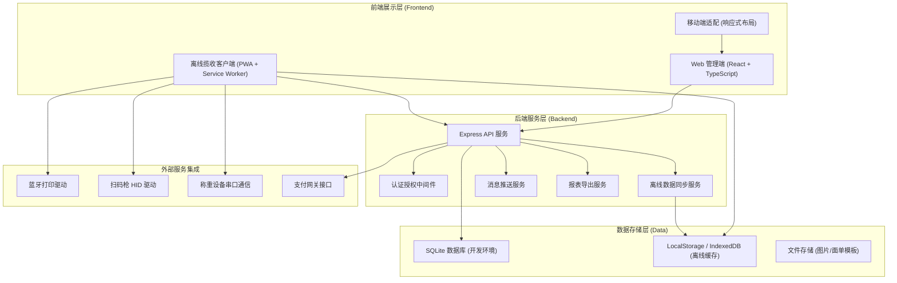
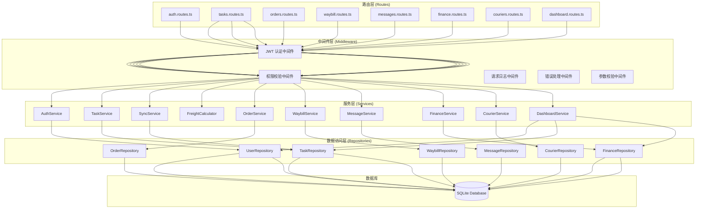
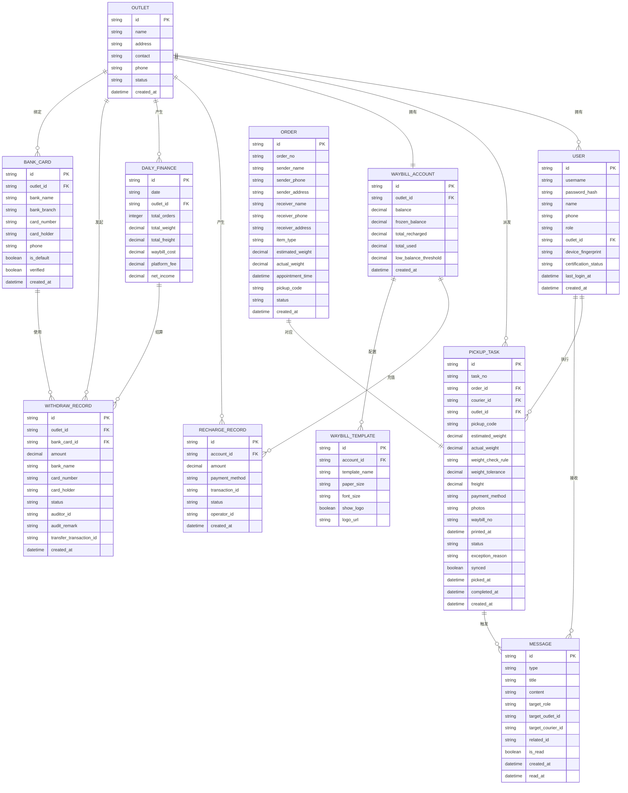

## 1. 系统架构设计



---

## 2. 技术选型说明

### 2.1 前端技术栈

| 技术 | 版本 | 用途说明 |
|------|------|----------|
| React | ^18.2.0 | 核心UI框架，采用函数式组件+Hooks |
| TypeScript | ^5.3.0 | 类型安全，提升代码可维护性 |
| Vite | ^5.0.0 | 构建工具，提供快速的开发体验 |
| React Router | ^6.20.0 | 单页路由管理，支持嵌套路由与权限控制 |
| Tailwind CSS | ^3.3.5 | 原子化CSS框架，快速构建UI |
| Zustand | ^4.4.7 | 状态管理，轻量高效，支持中间件 |
| Lucide React | ^0.294.0 | 图标库，统一风格的线框图标 |
| Recharts | ^2.10.0 | 图表组件库，用于数据可视化 |
| Day.js | ^1.11.10 | 日期时间处理库，轻量且API友好 |
| clsx | ^2.0.0 | 条件类名拼接工具 |

### 2.2 后端技术栈

| 技术 | 版本 | 用途说明 |
|------|------|----------|
| Express | ^4.18.2 | Node.js Web框架，提供RESTful API |
| TypeScript | ^5.3.0 | 后端类型安全 |
| SQLite3 | ^5.1.6 | 关系型数据库，开发环境使用 |
| better-sqlite3 | ^9.2.2 | 高性能SQLite驱动 |
| jsonwebtoken | ^9.0.2 | JWT身份认证 |
| bcrypt | ^5.1.1 | 密码哈希加密 |
| cors | ^2.8.5 | 跨域资源共享 |
| multer | ^1.4.5-lts.1 | 文件上传处理 |

### 2.3 项目初始化

- **初始化工具**：`vite-init` 脚手架
- **项目模板**：`react-express-ts`（React + TypeScript + Express 全栈）
- **包管理器**：优先使用 `pnpm`，若不可用则使用 `npm`
- **代码规范**：ESLint + Prettier，统一代码风格

---

## 3. 路由定义

### 3.1 前端路由（React Router）

| 路由路径 | 页面组件 | 权限要求 | 说明 |
|----------|----------|----------|------|
| `/login` | `Login` | 公开 | 登录页面，角色身份认证 |
| `/` | `Dashboard` | 已登录 | 工作台总览，数据概览 |
| `/tasks` | `TaskList` | 已登录 | 揽收任务列表 |
| `/tasks/:id` | `TaskDetail` | 已登录 | 揽收任务详情 |
| `/tasks/offline` | `OfflinePickup` | 快递员/管理员 | 离线揽收作业页面 |
| `/orders` | `OrderList` | 管理员/运营 | 寄件订单列表 |
| `/orders/:id` | `OrderDetail` | 管理员/运营 | 寄件订单详情 |
| `/waybill` | `WaybillAccount` | 管理员/运营 | 电子面单账户管理 |
| `/waybill/recharge` | `WaybillRecharge` | 管理员 | 面单充值记录 |
| `/waybill/template` | `WaybillTemplate` | 管理员 | 面单模板配置 |
| `/messages` | `MessageCenter` | 已登录 | 消息中心 |
| `/finance` | `FinanceCenter` | 管理员/运营 | 财务对账中心 |
| `/finance/withdraw` | `WithdrawRecord` | 管理员 | 提现流水记录 |
| `/finance/bankcard` | `BankCardManage` | 管理员 | 银行卡管理 |
| `/couriers` | `CourierList` | 管理员/运营 | 快递员管理 |
| `/couriers/:id` | `CourierDetail` | 管理员/运营 | 快递员详情 |
| `/dashboard/global` | `GlobalDashboard` | 平台运营 | 全局数据看板 |
| `/profile` | `UserProfile` | 已登录 | 个人中心/设置 |
| `*` | `NotFound` | 公开 | 404 页面 |

### 3.2 后端 API 路由

| 方法 | 路径 | 模块 | 说明 |
|------|------|------|------|
| POST | `/api/auth/login` | 认证 | 用户登录 |
| POST | `/api/auth/logout` | 认证 | 用户登出 |
| GET | `/api/auth/me` | 认证 | 获取当前用户信息 |
| GET | `/api/tasks` | 任务 | 获取揽收任务列表 |
| GET | `/api/tasks/:id` | 任务 | 获取任务详情 |
| PUT | `/api/tasks/:id` | 任务 | 更新任务状态 |
| POST | `/api/tasks/:id/verify` | 任务 | 取件码核验 |
| POST | `/api/tasks/:id/weigh` | 任务 | 提交称重数据 |
| POST | `/api/tasks/:id/calculate` | 任务 | 计算运费 |
| POST | `/api/tasks/:id/print` | 任务 | 面单打印记录 |
| POST | `/api/tasks/sync` | 任务 | 离线数据批量同步 |
| GET | `/api/orders` | 订单 | 获取寄件订单列表 |
| GET | `/api/orders/:id` | 订单 | 获取订单详情 |
| GET | `/api/waybill/account` | 面单 | 获取面单账户信息 |
| POST | `/api/waybill/recharge` | 面单 | 面单充值 |
| GET | `/api/waybill/recharge-records` | 面单 | 充值记录查询 |
| GET | `/api/messages` | 消息 | 获取消息列表 |
| PUT | `/api/messages/:id/read` | 消息 | 标记消息已读 |
| GET | `/api/finance/daily` | 财务 | 按日收入明细 |
| POST | `/api/finance/withdraw` | 财务 | 提交提现申请 |
| GET | `/api/finance/withdraw-records` | 财务 | 提现流水查询 |
| GET | `/api/couriers` | 快递员 | 快递员列表 |
| POST | `/api/couriers` | 快递员 | 新增快递员 |
| PUT | `/api/couriers/:id` | 快递员 | 更新快递员信息 |
| GET | `/api/dashboard/overview` | 看板 | 工作台数据概览 |
| GET | `/api/dashboard/global` | 看板 | 全局运营数据 |

---

## 4. API 类型定义

```typescript
// 共享类型定义 - shared/types/index.ts

export type UserRole = 'courier' | 'admin' | 'operator';

export type TaskStatus = 'pending' | 'assigned' | 'picked' | 'in_transit' | 'completed' | 'exception' | 'cancelled';

export type OrderStatus = 'created' | 'assigned' | 'picked' | 'printed' | 'shipped' | 'completed' | 'cancelled';

export type MessageType = 'pickup_reminder' | 'balance_alert' | 'suspension_notice' | 'system_announcement' | 'exception_alert';

export type PaymentMethod = 'wechat' | 'alipay' | 'cash' | 'account';

export type WithdrawStatus = 'pending' | 'approved' | 'rejected' | 'transferred' | 'failed';

// 用户信息
export interface User {
  id: string;
  username: string;
  name: string;
  role: UserRole;
  phone: string;
  avatar?: string;
  outletId?: string;
  outletName?: string;
  deviceFingerprint?: string;
  certificationStatus: 'pending' | 'approved' | 'rejected';
  createdAt: string;
  lastLoginAt?: string;
}

// 寄件订单
export interface Order {
  id: string;
  orderNo: string;
  sender: {
    name: string;
    phone: string;
    province: string;
    city: string;
    district: string;
    address: string;
    fullAddress: string;
  };
  receiver: {
    name: string;
    phone: string;
    province: string;
    city: string;
    district: string;
    address: string;
    fullAddress: string;
  };
  itemType: string;
  estimatedWeight: number;
  actualWeight?: number;
  appointmentTime: string;
  pickupCode: string;
  status: OrderStatus;
  remark?: string;
  createdAt: string;
  updatedAt: string;
}

// 揽收任务
export interface PickupTask {
  id: string;
  taskNo: string;
  orderId: string;
  orderNo: string;
  courierId?: string;
  courierName?: string;
  outletId: string;
  pickupCode: string;
  senderAddress: string;
  senderPhone: string;
  itemType: string;
  estimatedWeight: number;
  actualWeight?: number;
  appointmentTime: string;
  status: TaskStatus;
  freight?: number;
  paymentMethod?: PaymentMethod;
  weightCheckRule: 'strict' | 'tolerance' | 'none';
  weightTolerance?: number;
  photos?: string[];
  waybillNo?: string;
  printedAt?: string;
  exceptionReason?: string;
  createdAt: string;
  pickedAt?: string;
  completedAt?: string;
  synced: boolean;
}

// 电子面单账户
export interface WaybillAccount {
  id: string;
  outletId: string;
  outletName: string;
  balance: number;
  frozenBalance: number;
  totalRecharged: number;
  totalUsed: number;
  templateConfig: {
    templateId: string;
    templateName: string;
    paperSize: '100x150' | '100x180' | '80x150';
    fontSize: 'small' | 'medium' | 'large';
    showLogo: boolean;
    logoUrl?: string;
  };
  lowBalanceThreshold: number;
  createdAt: string;
  updatedAt: string;
}

// 充值记录
export interface RechargeRecord {
  id: string;
  accountId: string;
  amount: number;
  paymentMethod: string;
  transactionId?: string;
  status: 'pending' | 'success' | 'failed';
  operatorId?: string;
  operatorName?: string;
  remark?: string;
  createdAt: string;
  completedAt?: string;
}

// 消息
export interface Message {
  id: string;
  type: MessageType;
  title: string;
  content: string;
  targetRole?: UserRole;
  targetOutletId?: string;
  targetCourierId?: string;
  relatedId?: string;
  relatedType?: string;
  isRead: boolean;
  createdAt: string;
  readAt?: string;
}

// 财务日结
export interface DailyFinance {
  date: string;
  outletId: string;
  outletName: string;
  totalOrders: number;
  totalWeight: number;
  totalFreight: number;
  waybillCost: number;
  platformFee: number;
  netIncome: number;
  detail: Array<{
    taskId: string;
    orderNo: string;
    weight: number;
    freight: number;
    waybillCost: number;
    platformFee: number;
  }>;
}

// 提现记录
export interface WithdrawRecord {
  id: string;
  outletId: string;
  amount: number;
  bankCardId: string;
  bankName: string;
  cardNumber: string;
  cardHolder: string;
  status: WithdrawStatus;
  auditorId?: string;
  auditorName?: string;
  auditRemark?: string;
  transferTransactionId?: string;
  applicantId: string;
  applicantName: string;
  createdAt: string;
  auditedAt?: string;
  transferredAt?: string;
}

// 银行卡
export interface BankCard {
  id: string;
  outletId: string;
  bankName: string;
  bankBranch: string;
  cardNumber: string;
  cardHolder: string;
  phone: string;
  isDefault: boolean;
  verified: boolean;
  createdAt: string;
}

// 全局看板数据
export interface GlobalDashboardData {
  totalOutlets: number;
  totalCouriers: number;
  totalTasksToday: number;
  completedTasksToday: number;
  pendingTasks: number;
  exceptionTasks: number;
  totalRevenueToday: number;
  averagePickupTime: number;
  outletRankings: Array<{
    outletId: string;
    outletName: string;
    completedTasks: number;
    totalRevenue: number;
  }>;
  hourlyTrend: Array<{
    hour: string;
    tasks: number;
  }>;
  recentExceptions: Array<{
    taskId: string;
    orderNo: string;
    reason: string;
    createdAt: string;
  }>;
}

// API 响应基础结构
export interface ApiResponse<T = any> {
  code: number;
  message: string;
  data: T;
}

export interface PaginatedResponse<T = any> {
  code: number;
  message: string;
  data: {
    list: T[];
    total: number;
    page: number;
    pageSize: number;
  };
}
```

---

## 5. 后端服务架构



### 目录结构

```
api/                          # 后端代码
├── src/
│   ├── config/              # 配置文件
│   │   ├── database.ts      # 数据库配置
│   │   ├── jwt.ts           # JWT 配置
│   │   └── index.ts         # 环境配置
│   ├── middleware/          # 中间件
│   │   ├── auth.ts          # 认证中间件
│   │   ├── permission.ts    # 权限中间件
│   │   ├── logger.ts        # 日志中间件
│   │   └── error.ts         # 错误处理中间件
│   ├── routes/              # 路由定义
│   │   ├── auth.routes.ts
│   │   ├── tasks.routes.ts
│   │   ├── orders.routes.ts
│   │   ├── waybill.routes.ts
│   │   ├── messages.routes.ts
│   │   ├── finance.routes.ts
│   │   ├── couriers.routes.ts
│   │   ├── dashboard.routes.ts
│   │   └── index.ts
│   ├── services/            # 业务逻辑层
│   │   ├── auth.service.ts
│   │   ├── task.service.ts
│   │   ├── order.service.ts
│   │   ├── waybill.service.ts
│   │   ├── message.service.ts
│   │   ├── finance.service.ts
│   │   ├── courier.service.ts
│   │   ├── dashboard.service.ts
│   │   ├── sync.service.ts
│   │   └── freight-calculator.ts
│   ├── repositories/        # 数据访问层
│   │   ├── user.repository.ts
│   │   ├── task.repository.ts
│   │   ├── order.repository.ts
│   │   ├── waybill.repository.ts
│   │   ├── message.repository.ts
│   │   ├── finance.repository.ts
│   │   └── courier.repository.ts
│   ├── models/              # 数据模型
│   │   ├── user.model.ts
│   │   ├── task.model.ts
│   │   ├── order.model.ts
│   │   └── index.ts
│   ├── utils/               # 工具函数
│   │   ├── password.ts      # 密码加密
│   │   ├── token.ts         # Token 管理
│   │   ├── validator.ts     # 参数校验
│   │   └── logger.ts        # 日志工具
│   ├── database/            # 数据库相关
│   │   ├── schema.sql       # 建表SQL
│   │   ├── seed.ts          # 初始化数据
│   │   └── connection.ts    # 数据库连接
│   └── index.ts             # 服务入口
├── package.json
└── tsconfig.json
```

---

## 6. 数据模型设计

### 6.1 ER 图



### 6.2 数据库 DDL

```sql
-- 网点表
CREATE TABLE IF NOT EXISTS outlets (
  id TEXT PRIMARY KEY,
  name TEXT NOT NULL,
  address TEXT,
  contact TEXT,
  phone TEXT,
  status TEXT NOT NULL DEFAULT 'active',
  created_at DATETIME NOT NULL DEFAULT CURRENT_TIMESTAMP
);

-- 用户表（快递员、网点管理员、平台运营）
CREATE TABLE IF NOT EXISTS users (
  id TEXT PRIMARY KEY,
  username TEXT UNIQUE NOT NULL,
  password_hash TEXT NOT NULL,
  name TEXT NOT NULL,
  phone TEXT NOT NULL,
  role TEXT NOT NULL CHECK (role IN ('courier', 'admin', 'operator')),
  outlet_id TEXT REFERENCES outlets(id),
  device_fingerprint TEXT,
  certification_status TEXT NOT NULL DEFAULT 'pending',
  avatar_url TEXT,
  last_login_at DATETIME,
  created_at DATETIME NOT NULL DEFAULT CURRENT_TIMESTAMP
);

-- 寄件订单表
CREATE TABLE IF NOT EXISTS orders (
  id TEXT PRIMARY KEY,
  order_no TEXT UNIQUE NOT NULL,
  sender_name TEXT NOT NULL,
  sender_phone TEXT NOT NULL,
  sender_province TEXT,
  sender_city TEXT,
  sender_district TEXT,
  sender_address TEXT NOT NULL,
  receiver_name TEXT NOT NULL,
  receiver_phone TEXT NOT NULL,
  receiver_province TEXT,
  receiver_city TEXT,
  receiver_district TEXT,
  receiver_address TEXT NOT NULL,
  item_type TEXT NOT NULL,
  estimated_weight DECIMAL(10,2) NOT NULL,
  actual_weight DECIMAL(10,2),
  appointment_time DATETIME NOT NULL,
  pickup_code TEXT NOT NULL,
  remark TEXT,
  status TEXT NOT NULL DEFAULT 'created',
  created_at DATETIME NOT NULL DEFAULT CURRENT_TIMESTAMP,
  updated_at DATETIME NOT NULL DEFAULT CURRENT_TIMESTAMP
);

-- 揽收任务表
CREATE TABLE IF NOT EXISTS pickup_tasks (
  id TEXT PRIMARY KEY,
  task_no TEXT UNIQUE NOT NULL,
  order_id TEXT NOT NULL REFERENCES orders(id),
  order_no TEXT NOT NULL,
  courier_id TEXT REFERENCES users(id),
  outlet_id TEXT NOT NULL REFERENCES outlets(id),
  pickup_code TEXT NOT NULL,
  sender_address TEXT NOT NULL,
  sender_phone TEXT NOT NULL,
  item_type TEXT NOT NULL,
  estimated_weight DECIMAL(10,2) NOT NULL,
  actual_weight DECIMAL(10,2),
  appointment_time DATETIME NOT NULL,
  weight_check_rule TEXT NOT NULL DEFAULT 'tolerance',
  weight_tolerance DECIMAL(5,2) DEFAULT 0.5,
  freight DECIMAL(10,2),
  payment_method TEXT CHECK (payment_method IN ('wechat', 'alipay', 'cash', 'account')),
  photos TEXT,
  waybill_no TEXT,
  printed_at DATETIME,
  status TEXT NOT NULL DEFAULT 'pending',
  exception_reason TEXT,
  synced BOOLEAN NOT NULL DEFAULT 1,
  picked_at DATETIME,
  completed_at DATETIME,
  created_at DATETIME NOT NULL DEFAULT CURRENT_TIMESTAMP,
  updated_at DATETIME NOT NULL DEFAULT CURRENT_TIMESTAMP
);

-- 电子面单账户表
CREATE TABLE IF NOT EXISTS waybill_accounts (
  id TEXT PRIMARY KEY,
  outlet_id TEXT UNIQUE NOT NULL REFERENCES outlets(id),
  outlet_name TEXT NOT NULL,
  balance DECIMAL(12,2) NOT NULL DEFAULT 0,
  frozen_balance DECIMAL(12,2) NOT NULL DEFAULT 0,
  total_recharged DECIMAL(12,2) NOT NULL DEFAULT 0,
  total_used DECIMAL(12,2) NOT NULL DEFAULT 0,
  template_id TEXT,
  template_name TEXT,
  paper_size TEXT DEFAULT '100x150',
  font_size TEXT DEFAULT 'medium',
  show_logo BOOLEAN NOT NULL DEFAULT 1,
  logo_url TEXT,
  low_balance_threshold DECIMAL(12,2) NOT NULL DEFAULT 100,
  created_at DATETIME NOT NULL DEFAULT CURRENT_TIMESTAMP,
  updated_at DATETIME NOT NULL DEFAULT CURRENT_TIMESTAMP
);

-- 充值记录表
CREATE TABLE IF NOT EXISTS recharge_records (
  id TEXT PRIMARY KEY,
  account_id TEXT NOT NULL REFERENCES waybill_accounts(id),
  amount DECIMAL(12,2) NOT NULL,
  payment_method TEXT NOT NULL,
  transaction_id TEXT,
  status TEXT NOT NULL DEFAULT 'pending',
  operator_id TEXT REFERENCES users(id),
  operator_name TEXT,
  remark TEXT,
  created_at DATETIME NOT NULL DEFAULT CURRENT_TIMESTAMP,
  completed_at DATETIME
);

-- 消息表
CREATE TABLE IF NOT EXISTS messages (
  id TEXT PRIMARY KEY,
  type TEXT NOT NULL,
  title TEXT NOT NULL,
  content TEXT NOT NULL,
  target_role TEXT,
  target_outlet_id TEXT REFERENCES outlets(id),
  target_courier_id TEXT REFERENCES users(id),
  related_id TEXT,
  related_type TEXT,
  is_read BOOLEAN NOT NULL DEFAULT 0,
  created_at DATETIME NOT NULL DEFAULT CURRENT_TIMESTAMP,
  read_at DATETIME
);

-- 财务日结表
CREATE TABLE IF NOT EXISTS daily_finances (
  id TEXT PRIMARY KEY,
  date TEXT NOT NULL,
  outlet_id TEXT NOT NULL REFERENCES outlets(id),
  outlet_name TEXT NOT NULL,
  total_orders INTEGER NOT NULL DEFAULT 0,
  total_weight DECIMAL(12,2) NOT NULL DEFAULT 0,
  total_freight DECIMAL(12,2) NOT NULL DEFAULT 0,
  waybill_cost DECIMAL(12,2) NOT NULL DEFAULT 0,
  platform_fee DECIMAL(12,2) NOT NULL DEFAULT 0,
  net_income DECIMAL(12,2) NOT NULL DEFAULT 0,
  detail TEXT,
  UNIQUE(date, outlet_id)
);

-- 银行卡表
CREATE TABLE IF NOT EXISTS bank_cards (
  id TEXT PRIMARY KEY,
  outlet_id TEXT NOT NULL REFERENCES outlets(id),
  bank_name TEXT NOT NULL,
  bank_branch TEXT,
  card_number TEXT NOT NULL,
  card_holder TEXT NOT NULL,
  phone TEXT NOT NULL,
  is_default BOOLEAN NOT NULL DEFAULT 0,
  verified BOOLEAN NOT NULL DEFAULT 0,
  created_at DATETIME NOT NULL DEFAULT CURRENT_TIMESTAMP
);

-- 提现记录表
CREATE TABLE IF NOT EXISTS withdraw_records (
  id TEXT PRIMARY KEY,
  outlet_id TEXT NOT NULL REFERENCES outlets(id),
  bank_card_id TEXT NOT NULL REFERENCES bank_cards(id),
  amount DECIMAL(12,2) NOT NULL,
  bank_name TEXT NOT NULL,
  card_number TEXT NOT NULL,
  card_holder TEXT NOT NULL,
  status TEXT NOT NULL DEFAULT 'pending',
  auditor_id TEXT REFERENCES users(id),
  auditor_name TEXT,
  audit_remark TEXT,
  transfer_transaction_id TEXT,
  applicant_id TEXT NOT NULL REFERENCES users(id),
  applicant_name TEXT NOT NULL,
  created_at DATETIME NOT NULL DEFAULT CURRENT_TIMESTAMP,
  audited_at DATETIME,
  transferred_at DATETIME
);

-- 面单打印日志表
CREATE TABLE IF NOT EXISTS print_logs (
  id TEXT PRIMARY KEY,
  task_id TEXT NOT NULL REFERENCES pickup_tasks(id),
  waybill_no TEXT NOT NULL,
  printer_name TEXT,
  paper_size TEXT,
  printed_by TEXT NOT NULL REFERENCES users(id),
  created_at DATETIME NOT NULL DEFAULT CURRENT_TIMESTAMP
);

-- 创建索引
CREATE INDEX IF NOT EXISTS idx_tasks_courier ON pickup_tasks(courier_id);
CREATE INDEX IF NOT EXISTS idx_tasks_outlet ON pickup_tasks(outlet_id);
CREATE INDEX IF NOT EXISTS idx_tasks_status ON pickup_tasks(status);
CREATE INDEX IF NOT EXISTS idx_tasks_synced ON pickup_tasks(synced);
CREATE INDEX IF NOT EXISTS idx_orders_pickup_code ON orders(pickup_code);
CREATE INDEX IF NOT EXISTS idx_messages_target ON messages(target_courier_id, target_outlet_id);
CREATE INDEX IF NOT EXISTS idx_messages_read ON messages(is_read);
CREATE INDEX IF NOT EXISTS idx_finance_date ON daily_finances(date);
```
