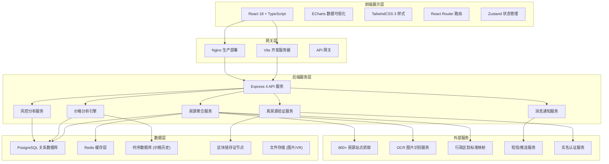
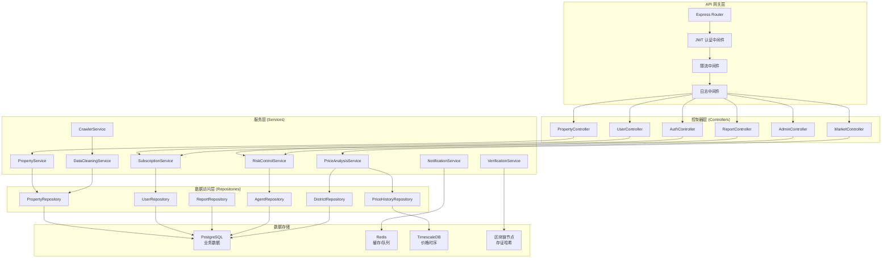
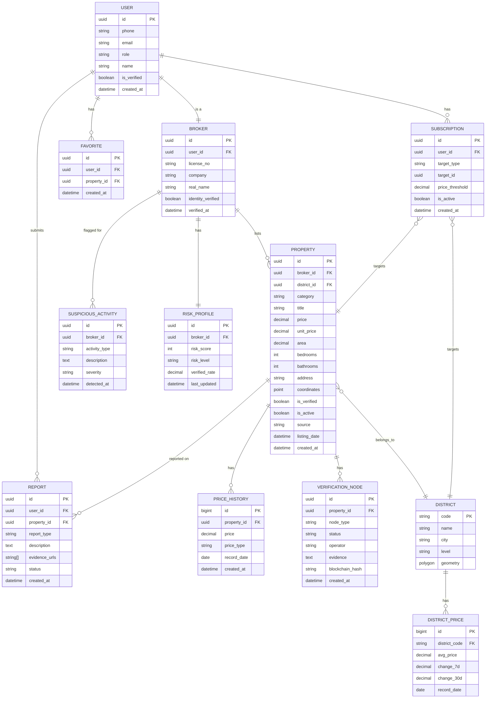

## 1. 架构设计



## 2. 技术选型说明

### 2.1 前端技术栈
- **框架**: React 18 + TypeScript 5
- **构建工具**: Vite 5
- **样式方案**: TailwindCSS 3 + CSS Variables
- **路由管理**: React Router 6
- **状态管理**: Zustand 4（轻量、高性能）
- **数据可视化**: ECharts 5 + echarts-for-react
- **地图组件**: 百度地图 API / 高德地图 API
- **HTTP 客户端**: Axios 1.6
- **UI 组件库**: 自定义组件（避免通用 AI 风格）+ Headless UI
- **动画库**: Framer Motion
- **表单处理**: React Hook Form + Zod

### 2.2 后端技术栈
- **运行时**: Node.js 20 LTS
- **Web 框架**: Express 4.18
- **数据库驱动**: pg (PostgreSQL) + prisma ORM
- **缓存**: ioredis (Redis 客户端)
- **任务调度**: node-cron + Bull (队列)
- **数据校验**: Zod
- **日志**: winston
- **认证**: JWT + bcrypt

### 2.3 数据库设计
- **PostgreSQL 16**: 主业务数据库（房源、用户、交易、风控）
- **Redis 7**: 缓存层 + 消息队列 + 会话存储
- **时序数据**: PostgreSQL TimescaleDB 扩展（价格历史存储）
- **区块链**: 以太坊测试网 / 联盟链节点（存证哈希）

### 2.4 数据处理
- **爬虫框架**: Puppeteer + Cheerio（分布式抓取）
- **OCR**: Tesseract.js（图片文字识别）
- **图片比对**: d3-image-hash（感知哈希算法）

## 3. 路由定义

| 路由路径 | 页面/组件 | 功能描述 |
|----------|-----------|----------|
| `/` | 首页大屏 | 市场概览、房类切换、涨跌热力图 |
| `/list/:category` | 房源列表页 | 二手房/新房/租赁/海外/旅居列表 |
| `/property/:id` | 房源详情页 | 房源信息、价格走势、真房源验证 |
| `/analysis` | 价格分析中心 | 热力图、时序对比、偏离度预警、竞品矩阵 |
| `/timemachine` | 房价时光机 | 历史价格回溯、时间轴导航 |
| `/user/center` | 用户中心 | 订阅管理、收藏、降价提醒 |
| `/report` | 举报中心 | 虚假房源举报、进度查询 |
| `/admin/dashboard` | 运营后台首页 | 风控仪表盘、市场健康度 |
| `/admin/reports` | 举报管理 | 举报列表、处理流程 |
| `/admin/agents` | 经纪人管理 | 风控模型、行为监测 |
| `/login` | 登录页 | 用户/经纪人/管理员登录 |

## 4. API 接口定义

### 4.1 TypeScript 类型定义

```typescript
// 房源基础类型
interface Property {
  id: string;
  category: 'secondhand' | 'new' | 'rental' | 'overseas' | 'vacation';
  title: string;
  price: number;
  unitPrice: number;
  area: number;
  bedrooms: number;
  bathrooms: number;
  floor: string;
  orientation: string;
  decoration: string;
  address: string;
  district: string;
  city: string;
  coordinates: { lat: number; lng: number };
  images: string[];
  vrUrl?: string;
  description: string;
  isVerified: boolean;
  verificationChain?: VerificationNode[];
  priceHistory: PricePoint[];
  listingDate: string;
  source: string;
}

// 真房源验证节点
interface VerificationNode {
  type: 'broker' | 'owner' | 'vr' | 'chain';
  status: 'verified' | 'pending' | 'rejected';
  timestamp: string;
  operator: string;
  evidence?: string;
  hash?: string;
}

// 价格历史点
interface PricePoint {
  date: string;
  price: number;
  type: 'listing' | 'transaction' | 'average';
}

// 片区价格数据
interface DistrictPrice {
  districtCode: string;
  districtName: string;
  avgPrice: number;
  change7d: number;
  change30d: number;
  totalListings: number;
  coordinates: number[][];
}

// 预警信息
interface PriceAlert {
  id: string;
  propertyId: string;
  type: 'overpriced' | 'underpriced' | 'sudden_drop' | 'sudden_rise';
  deviation: number;
  threshold: number;
  createdAt: string;
}

// 经纪人风控数据
interface AgentRiskProfile {
  agentId: string;
  agentName: string;
  riskScore: number;
  riskLevel: 'low' | 'medium' | 'high';
  suspiciousActivities: SuspiciousActivity[];
  totalListings: number;
  verifiedRate: number;
}

// 异常行为
interface SuspiciousActivity {
  id: string;
  type: 'mass_delisting' | 'price_manipulation' | 'duplicate_listing' | 'fake_info';
  description: string;
  timestamp: string;
  severity: 'warning' | 'danger';
}

// 市场健康度
interface MarketHealth {
  city: string;
  supplyDemandRatio: number;
  inventoryCycle: number;
  priceVolatility: number;
  transactionActivity: number;
  healthScore: number;
  healthLevel: 'healthy' | 'caution' | 'warning';
}
```

### 4.2 API 接口列表

| 方法 | 路径 | 描述 | 请求参数 | 返回类型 |
|------|------|------|----------|----------|
| GET | `/api/properties` | 获取房源列表 | `category`, `page`, `pageSize`, `filters` | `{ data: Property[], total: number }` |
| GET | `/api/properties/:id` | 获取房源详情 | `id` | `Property` |
| GET | `/api/properties/:id/price-history` | 价格历史 | `id`, `range` | `PricePoint[]` |
| GET | `/api/market/overview` | 市场概览 | `city`, `category` | `MarketOverview` |
| GET | `/api/market/district-prices` | 片区价格热力图 | `city`, `category`, `timeRange` | `DistrictPrice[]` |
| GET | `/api/market/comparison` | 同户型对比 | `propertyId`, `range` | `Property[]` |
| GET | `/api/market/deviation` | 价格偏离度预警 | `district`, `threshold` | `PriceAlert[]` |
| GET | `/api/market/competitor-matrix` | 竞品报价矩阵 | `propertyId`, `radius` | `CompetitorItem[]` |
| GET | `/api/timemachine/snapshot` | 历史价格快照 | `date`, `district` | `SnapshotData` |
| POST | `/api/subscriptions` | 创建订阅 | `{ targetId, type, threshold }` | `Subscription` |
| GET | `/api/subscriptions` | 获取订阅列表 | - | `Subscription[]` |
| DELETE | `/api/subscriptions/:id` | 取消订阅 | `id` | `boolean` |
| POST | `/api/reports` | 提交举报 | `{ propertyId, type, evidence, description }` | `Report` |
| GET | `/api/reports/:id` | 举报进度 | `id` | `Report` |
| GET | `/api/admin/dashboard` | 运营仪表盘 | - | `AdminDashboardData` |
| GET | `/api/admin/agents/risk` | 经纪人风控列表 | - | `AgentRiskProfile[]` |
| GET | `/api/admin/market/health` | 市场健康度 | `city` | `MarketHealth` |
| POST | `/api/auth/login` | 登录 | `{ username, password, role }` | `{ token, user }` |

## 5. 服务端架构图



## 6. 数据模型设计

### 6.1 ER 图



### 6.2 DDL 语句

```sql
-- 启用 TimescaleDB 扩展
CREATE EXTENSION IF NOT EXISTS timescaledb;
CREATE EXTENSION IF NOT EXISTS postgis;

-- 用户表
CREATE TABLE users (
    id UUID PRIMARY KEY DEFAULT gen_random_uuid(),
    phone VARCHAR(20) UNIQUE NOT NULL,
    email VARCHAR(100) UNIQUE,
    role VARCHAR(20) NOT NULL CHECK (role IN ('user', 'broker', 'owner', 'admin', 'regulator')),
    name VARCHAR(50),
    password_hash VARCHAR(255) NOT NULL,
    is_verified BOOLEAN DEFAULT false,
    created_at TIMESTAMP WITH TIME ZONE DEFAULT CURRENT_TIMESTAMP
);

-- 经纪人表
CREATE TABLE brokers (
    id UUID PRIMARY KEY DEFAULT gen_random_uuid(),
    user_id UUID UNIQUE REFERENCES users(id),
    license_no VARCHAR(50) UNIQUE NOT NULL,
    company VARCHAR(100),
    real_name VARCHAR(50) NOT NULL,
    identity_verified BOOLEAN DEFAULT false,
    verified_at TIMESTAMP WITH TIME ZONE,
    created_at TIMESTAMP WITH TIME ZONE DEFAULT CURRENT_TIMESTAMP
);

-- 片区表
CREATE TABLE districts (
    code VARCHAR(20) PRIMARY KEY,
    name VARCHAR(50) NOT NULL,
    city VARCHAR(50) NOT NULL,
    level VARCHAR(20) NOT NULL CHECK (level IN ('city', 'district', 'block')),
    geometry GEOMETRY(POLYGON, 4326),
    parent_code VARCHAR(20) REFERENCES districts(code)
);

-- 房源表
CREATE TABLE properties (
    id UUID PRIMARY KEY DEFAULT gen_random_uuid(),
    broker_id UUID REFERENCES brokers(id),
    district_code VARCHAR(20) REFERENCES districts(code),
    category VARCHAR(20) NOT NULL CHECK (category IN ('secondhand', 'new', 'rental', 'overseas', 'vacation')),
    title VARCHAR(200) NOT NULL,
    price DECIMAL(15, 2) NOT NULL,
    unit_price DECIMAL(15, 2) NOT NULL,
    area DECIMAL(10, 2) NOT NULL,
    bedrooms INT,
    bathrooms INT,
    floor VARCHAR(50),
    orientation VARCHAR(20),
    decoration VARCHAR(50),
    address VARCHAR(200) NOT NULL,
    coordinates GEOMETRY(POINT, 4326),
    images TEXT[],
    vr_url VARCHAR(500),
    description TEXT,
    is_verified BOOLEAN DEFAULT false,
    is_active BOOLEAN DEFAULT true,
    source VARCHAR(100),
    listing_date DATE,
    created_at TIMESTAMP WITH TIME ZONE DEFAULT CURRENT_TIMESTAMP,
    updated_at TIMESTAMP WITH TIME ZONE DEFAULT CURRENT_TIMESTAMP
);

CREATE INDEX idx_properties_category ON properties(category);
CREATE INDEX idx_properties_district ON properties(district_code);
CREATE INDEX idx_properties_price ON properties(price);
CREATE INDEX idx_properties_active ON properties(is_active) WHERE is_active = true;

-- 价格历史表 (时序表)
CREATE TABLE price_history (
    id BIGSERIAL,
    property_id UUID NOT NULL REFERENCES properties(id),
    price DECIMAL(15, 2) NOT NULL,
    price_type VARCHAR(20) NOT NULL CHECK (price_type IN ('listing', 'transaction', 'average')),
    record_date DATE NOT NULL,
    created_at TIMESTAMP WITH TIME ZONE DEFAULT CURRENT_TIMESTAMP
);

SELECT create_hypertable('price_history', 'record_date');
CREATE INDEX idx_price_history_property ON price_history(property_id, record_date DESC);

-- 真房源验证节点
CREATE TABLE verification_nodes (
    id UUID PRIMARY KEY DEFAULT gen_random_uuid(),
    property_id UUID NOT NULL REFERENCES properties(id),
    node_type VARCHAR(20) NOT NULL CHECK (node_type IN ('broker', 'owner', 'vr', 'chain')),
    status VARCHAR(20) NOT NULL CHECK (status IN ('verified', 'pending', 'rejected')),
    operator VARCHAR(100),
    evidence TEXT,
    blockchain_hash VARCHAR(100),
    created_at TIMESTAMP WITH TIME ZONE DEFAULT CURRENT_TIMESTAMP
);

-- 片区价格统计表
CREATE TABLE district_prices (
    id BIGSERIAL,
    district_code VARCHAR(20) NOT NULL REFERENCES districts(code),
    avg_price DECIMAL(15, 2) NOT NULL,
    change_7d DECIMAL(8, 4),
    change_30d DECIMAL(8, 4),
    total_listings INT,
    record_date DATE NOT NULL,
    created_at TIMESTAMP WITH TIME ZONE DEFAULT CURRENT_TIMESTAMP
);

SELECT create_hypertable('district_prices', 'record_date');

-- 订阅表
CREATE TABLE subscriptions (
    id UUID PRIMARY KEY DEFAULT gen_random_uuid(),
    user_id UUID NOT NULL REFERENCES users(id),
    target_type VARCHAR(20) NOT NULL CHECK (target_type IN ('property', 'district', 'community')),
    target_id UUID NOT NULL,
    price_threshold DECIMAL(8, 4),
    is_active BOOLEAN DEFAULT true,
    created_at TIMESTAMP WITH TIME ZONE DEFAULT CURRENT_TIMESTAMP
);

-- 举报表
CREATE TABLE reports (
    id UUID PRIMARY KEY DEFAULT gen_random_uuid(),
    user_id UUID NOT NULL REFERENCES users(id),
    property_id UUID NOT NULL REFERENCES properties(id),
    report_type VARCHAR(50) NOT NULL,
    description TEXT,
    evidence_urls TEXT[],
    status VARCHAR(20) NOT NULL DEFAULT 'pending' CHECK (status IN ('pending', 'reviewing', 'resolved', 'rejected')),
    resolution TEXT,
    created_at TIMESTAMP WITH TIME ZONE DEFAULT CURRENT_TIMESTAMP,
    updated_at TIMESTAMP WITH TIME ZONE DEFAULT CURRENT_TIMESTAMP
);

-- 经纪人风控画像
CREATE TABLE risk_profiles (
    id UUID PRIMARY KEY DEFAULT gen_random_uuid(),
    broker_id UUID UNIQUE NOT NULL REFERENCES brokers(id),
    risk_score INT NOT NULL DEFAULT 0,
    risk_level VARCHAR(20) NOT NULL DEFAULT 'low' CHECK (risk_level IN ('low', 'medium', 'high')),
    verified_rate DECIMAL(5, 4),
    last_updated TIMESTAMP WITH TIME ZONE DEFAULT CURRENT_TIMESTAMP
);

-- 异常行为记录表
CREATE TABLE suspicious_activities (
    id UUID PRIMARY KEY DEFAULT gen_random_uuid(),
    broker_id UUID NOT NULL REFERENCES brokers(id),
    activity_type VARCHAR(50) NOT NULL,
    description TEXT,
    severity VARCHAR(20) NOT NULL CHECK (severity IN ('warning', 'danger')),
    detected_at TIMESTAMP WITH TIME ZONE DEFAULT CURRENT_TIMESTAMP,
    metadata JSONB
);

-- 收藏表
CREATE TABLE favorites (
    id UUID PRIMARY KEY DEFAULT gen_random_uuid(),
    user_id UUID NOT NULL REFERENCES users(id),
    property_id UUID NOT NULL REFERENCES properties(id),
    created_at TIMESTAMP WITH TIME ZONE DEFAULT CURRENT_TIMESTAMP,
    UNIQUE(user_id, property_id)
);

-- 初始化行政区划数据 (示例)
INSERT INTO districts (code, name, city, level) VALUES
('110000', '北京市', '北京市', 'city'),
('110101', '东城区', '北京市', 'district'),
('110102', '西城区', '北京市', 'district'),
('110105', '朝阳区', '北京市', 'district'),
('110106', '丰台区', '北京市', 'district'),
('110108', '海淀区', '北京市', 'district');
```

## 7. Mock 数据生成策略

### 7.1 数据规模
- 房源数据：5,000+ 条（覆盖五大房类）
- 价格历史：每条房源 30-180 天历史数据
- 片区数据：覆盖北京 16 个区 + 50 个重点板块
- 用户数据：1,000+ 用户、100+ 经纪人
- 举报数据：50+ 条模拟举报记录

### 7.2 生成工具
- 使用 `@faker-js/faker` 生成基础数据
- 价格数据使用正态分布模拟真实市场波动
- 坐标数据基于真实片区边界随机生成
- 涨跌数据遵循真实房产市场波动规律（±5% 以内为主）

### 7.3 数据真实性保障
- 价格区间符合真实市场水平
- 户型配比符合市场结构
- 区域差异体现在均价水平上
- 价格历史包含合理的季节性波动
