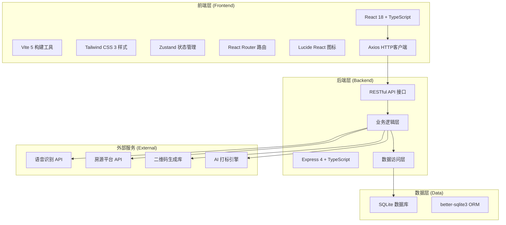
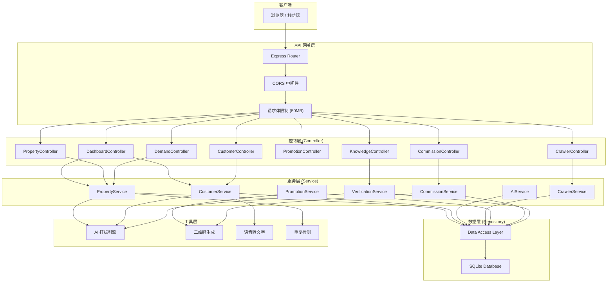

## 1. 架构设计



## 2. 技术描述

### 2.1 前端技术栈
- **框架**：React@18.2.0 + TypeScript@5.3.3
- **构建工具**：Vite@5.0.12
- **样式方案**：Tailwind CSS@3.4.0
- **状态管理**：Zustand@4.5.0
- **路由管理**：react-router-dom@6.21.3
- **UI组件**：Ant Design@5.13.2（配合Tailwind自定义主题）
- **图标库**：lucide-react@0.344.0
- **HTTP客户端**：axios@1.6.5
- **图表库**：echarts@5.4.3 + echarts-for-react@3.0.2
- **日期处理**：dayjs@1.11.10

### 2.2 后端技术栈
- **框架**：Express@4.18.2 + TypeScript@5.3.3
- **数据库**：SQLite + better-sqlite3@11.0.0
- **中间件**：cors@2.8.5、multer@1.4.5-lts.1
- **工具库**：uuid@9.0.1
- **运行环境**：Node.js >= 16

### 2.3 项目结构
```
may-89260/
├── frontend/                    # 前端项目
│   ├── src/
│   │   ├── components/          # 公共组件
│   │   │   ├── Layout/         # 布局组件
│   │   │   ├── PropertyCard/   # 房源卡片
│   │   │   ├── CustomerCard/   # 客源卡片
│   │   │   ├── AITagBadge/     # AI标签组件
│   │   │   ├── VoiceInput/     # 语音录入组件
│   │   │   └── QRCodeModal/    # 二维码弹窗
│   │   ├── pages/              # 页面组件
│   │   │   ├── Dashboard/      # 工作台
│   │   │   ├── Properties/     # 房源管理
│   │   │   ├── Customers/      # 客源管理
│   │   │   ├── Crawler/        # 房源抓取
│   │   │   ├── Promotion/      # 推广中心
│   │   │   ├── DemandHall/     # 抢单大厅
│   │   │   ├── Commission/     # 佣金结算
│   │   │   ├── Knowledge/      # 知识社区
│   │   │   └── Profile/        # 个人中心
│   │   ├── hooks/              # 自定义Hooks
│   │   │   ├── useVoiceRecognition.ts
│   │   │   ├── useDuplicateCheck.ts
│   │   │   └── useAI.ts
│   │   ├── store/              # Zustand状态
│   │   │   ├── usePropertyStore.ts
│   │   │   ├── useCustomerStore.ts
│   │   │   └── useAuthStore.ts
│   │   ├── utils/              # 工具函数
│   │   │   ├── request.ts      # Axios封装
│   │   │   ├── ai.ts           # AI打标逻辑
│   │   │   └── format.ts       # 格式化函数
│   │   ├── types/              # 类型定义
│   │   │   ├── property.ts
│   │   │   ├── customer.ts
│   │   │   └── index.ts
│   │   ├── App.tsx
│   │   └── main.tsx
│   ├── package.json
│   ├── tsconfig.json
│   ├── vite.config.ts
│   └── tailwind.config.js
├── backend/                     # 后端项目
│   ├── src/
│   │   ├── index.ts            # 入口文件
│   │   ├── database.ts         # 数据库连接
│   │   ├── routes/             # 路由层
│   │   │   ├── dashboard.ts
│   │   │   ├── properties.ts
│   │   │   ├── customers.ts
│   │   │   ├── crawler.ts
│   │   │   ├── promotions.ts
│   │   │   ├── demands.ts
│   │   │   ├── commissions.ts
│   │   │   └── knowledge.ts
│   │   ├── services/           # 业务逻辑层
│   │   │   ├── propertyService.ts
│   │   │   ├── customerService.ts
│   │   │   ├── aiService.ts
│   │   │   ├── crawlerService.ts
│   │   │   └── commissionService.ts
│   │   ├── utils/              # 工具函数
│   │   │   ├── ai.ts           # AI打标引擎
│   │   │   ├── qrcode.ts       # 二维码生成
│   │   │   ├── commission.ts   # 佣金计算
│   │   │   └── response.ts     # 统一响应
│   │   └── types/              # 类型定义
│   ├── data/                   # 数据库文件
│   │   └── real_estate.db
│   └── package.json
├── .trae/
│   └── documents/              # 项目文档
└── package.json                # 根package (workspace)
```

## 3. 路由定义

| 前端路由 | 页面名称 | 后端API前缀 |
|---------|---------|------------|
| / | 工作台 | /api/dashboard |
| /properties | 房源列表 | /api/properties |
| /properties/new | 房源录入 | /api/properties |
| /properties/:id | 房源详情 | /api/properties/:id |
| /customers | 客源列表 | /api/customers |
| /customers/new | 客源录入 | /api/customers |
| /customers/:id | 客源详情 | /api/customers/:id |
| /crawler | 房源抓取 | /api/crawler |
| /crawler/review | 审核入库 | /api/crawler/review |
| /promotion | 推广列表 | /api/promotions |
| /promotion/brochure/:id | H5楼书 | /api/promotions/brochure |
| /demands | 抢单大厅 | /api/demands |
| /demands/mine | 我的抢单 | /api/demands/mine |
| /commissions | 佣金列表 | /api/commissions |
| /commissions/voucher/:id | 支付凭证 | /api/commissions/voucher |
| /knowledge | 知识社区 | /api/knowledge |
| /knowledge/:id | 内容详情 | /api/knowledge/:id |
| /knowledge/new | 发布内容 | /api/knowledge |
| /profile | 个人中心 | /api/agents |
| /login | 登录页 | /api/auth/login |

## 4. API 类型定义

### 4.1 统一响应格式

```typescript
interface ApiResponse<T> {
  code: number;      // 0: 成功, -1: 失败
  message: string;   // 消息描述
  data: T;          // 返回数据
}
```

### 4.2 房源相关类型

```typescript
interface Property {
  id: number;
  title: string;
  type: 'sale' | 'rent';
  price: number;
  area: number;
  rooms: string;
  floor: string;
  address: string;
  district: string;
  community: string;
  orientation: string;
  decoration: string;
  year_built: number;
  description: string;
  owner_name: string;
  owner_phone: string;
  phone_verified: number;
  image_duplicate_rate: number;
  publish_date: string;
  authenticity_score: number;
  source_platform: string;
  ai_tags: string[];
  status: 'active' | 'inactive' | 'pending' | 'duplicate';
  similarity_warning?: SimilarProperty[];
  created_at: string;
  updated_at: string;
}

interface SimilarProperty {
  id: number;
  title: string;
  similarity: number;
  reason: string;
}

interface PropertyCreateRequest {
  title: string;
  type: 'sale' | 'rent';
  price: number;
  area: number;
  rooms: string;
  floor: string;
  address: string;
  district: string;
  community: string;
  orientation: string;
  decoration: string;
  year_built: number;
  description: string;
  owner_name: string;
  owner_phone: string;
  voice_text?: string;
}

interface AITagResponse {
  tags: string[];
  confidence: number;
}

interface DuplicateCheckResponse {
  isDuplicate: boolean;
  similarItems: SimilarProperty[];
  suggestion: string;
}
```

### 4.3 客源相关类型

```typescript
interface Customer {
  id: number;
  name: string;
  phone: string;
  type: 'buyer' | 'seller' | 'tenant' | 'landlord';
  budget_min: number;
  budget_max: number;
  area_pref: string;
  rooms_pref: string;
  ai_tags: string[];
  source: string;
  remarks: string;
  voice_text?: string;
  agent_id: number;
  follow_up_records: FollowUpRecord[];
  status: 'active' | 'inactive' | 'deal';
  created_at: string;
}

interface FollowUpRecord {
  id: number;
  customer_id: number;
  content: string;
  created_at: string;
}
```

### 4.4 抢单与佣金类型

```typescript
interface Demand {
  id: number;
  title: string;
  type: 'buy' | 'rent';
  budget_min: number;
  budget_max: number;
  area: string;
  rooms: string;
  district: string;
  description: string;
  match_score: number;
  expires_at: string;
  status: 'open' | 'taken' | 'deal' | 'expired';
  created_at: string;
}

interface Commission {
  id: number;
  demand_id: number;
  property_id: number;
  agent_id: number;
  deal_amount: number;
  commission_rate: number;
  commission_amount: number;
  tier_level: number;
  tier_description: string;
  status: 'pending' | 'approved' | 'paid';
  voucher_url?: string;
  created_at: string;
  paid_at?: string;
}

interface CommissionTier {
  level: number;
  min_amount: number;
  max_amount: number;
  rate: number;
  description: string;
}

interface PaymentVoucher {
  id: string;
  commission_id: number;
  agent_name: string;
  amount: number;
  date: string;
  qr_code: string;
  serial_number: string;
}
```

### 4.5 知识社区类型

```typescript
interface KnowledgeContent {
  id: number;
  type: 'question' | 'article' | 'resource';
  title: string;
  content: string;
  category: string;
  author_id: number;
  author_name: string;
  points: number;
  views: number;
  likes: number;
  is_answered?: boolean;
  accepted_answer_id?: number;
  audit_status: 'pending' | 'approved' | 'rejected';
  audit_reason?: string;
  created_at: string;
}

interface AgentQualification {
  agent_id: number;
  license_number: string;
  license_type: string;
  issue_date: string;
  expiry_date: string;
  verified: boolean;
  verified_at?: string;
}
```

## 5. 服务器架构图



## 6. 数据模型

### 6.1 ER 图

```mermaid
erDiagram
    AGENTS ||--o{ PROPERTIES : "录入"
    AGENTS ||--o{ CUSTOMERS : "维护"
    AGENTS ||--o{ DEMANDS_TAKEN : "抢单"
    AGENTS ||--o{ COMMISSIONS : "获取"
    AGENTS ||--o{ KNOWLEDGE_CONTENTS : "发布"
    AGENTS ||--|| AGENT_QUALIFICATIONS : "资质"
    PROPERTIES ||--o{ PROMOTIONS : "推广"
    PROPERTIES ||--o{ COMMISSIONS : "成交"
    CUSTOMERS ||--o{ FOLLOW_UP_RECORDS : "跟进"
    DEMANDS ||--o{ DEMANDS_TAKEN : "被抢"
    DEMANDS ||--o{ COMMISSIONS : "成交"
    KNOWLEDGE_CONTENTS ||--o{ KNOWLEDGE_LIKES : "点赞"
    KNOWLEDGE_CONTENTS ||--o{ KNOWLEDGE_COMMENTS : "评论"

    AGENTS {
        INTEGER id PK
        VARCHAR name
        VARCHAR phone UNIQUE
        VARCHAR password
        VARCHAR avatar
        INTEGER store_id
        VARCHAR role
        INTEGER points
        DATETIME created_at
    }

    PROPERTIES {
        INTEGER id PK
        VARCHAR title
        VARCHAR type
        INTEGER price
        INTEGER area
        VARCHAR rooms
        VARCHAR floor
        VARCHAR address
        VARCHAR district
        VARCHAR community
        VARCHAR orientation
        VARCHAR decoration
        INTEGER year_built
        TEXT description
        VARCHAR owner_name
        VARCHAR owner_phone
        INTEGER phone_verified
        REAL image_duplicate_rate
        DATE publish_date
        INTEGER authenticity_score
        VARCHAR source_platform
        TEXT ai_tags
        VARCHAR status
        INTEGER agent_id FK
        DATETIME created_at
    }

    CUSTOMERS {
        INTEGER id PK
        VARCHAR name
        VARCHAR phone
        VARCHAR type
        INTEGER budget_min
        INTEGER budget_max
        VARCHAR area_pref
        VARCHAR rooms_pref
        TEXT ai_tags
        VARCHAR source
        TEXT remarks
        TEXT voice_text
        INTEGER agent_id FK
        VARCHAR status
        DATETIME created_at
    }

    DEMANDS {
        INTEGER id PK
        VARCHAR title
        VARCHAR type
        INTEGER budget_min
        INTEGER budget_max
        VARCHAR area
        VARCHAR rooms
        VARCHAR district
        TEXT description
        INTEGER match_score
        DATETIME expires_at
        VARCHAR status
        DATETIME created_at
    }

    DEMANDS_TAKEN {
        INTEGER id PK
        INTEGER demand_id FK
        INTEGER agent_id FK
        DATETIME taken_at
        VARCHAR status
    }

    COMMISSIONS {
        INTEGER id PK
        INTEGER demand_id FK
        INTEGER property_id FK
        INTEGER agent_id FK
        INTEGER deal_amount
        REAL commission_rate
        INTEGER commission_amount
        INTEGER tier_level
        VARCHAR tier_description
        VARCHAR status
        TEXT voucher_url
        DATETIME created_at
        DATETIME paid_at
    }

    KNOWLEDGE_CONTENTS {
        INTEGER id PK
        VARCHAR type
        VARCHAR title
        TEXT content
        VARCHAR category
        INTEGER author_id FK
        INTEGER points
        INTEGER views
        INTEGER likes
        INTEGER is_answered
        INTEGER accepted_answer_id
        VARCHAR audit_status
        TEXT audit_reason
        DATETIME created_at
    }

    AGENT_QUALIFICATIONS {
        INTEGER id PK
        INTEGER agent_id FK
        VARCHAR license_number
        VARCHAR license_type
        DATE issue_date
        DATE expiry_date
        INTEGER verified
        DATETIME verified_at
    }

    FOLLOW_UP_RECORDS {
        INTEGER id PK
        INTEGER customer_id FK
        TEXT content
        DATETIME created_at
    }

    PROMOTIONS {
        INTEGER id PK
        INTEGER property_id FK
        VARCHAR channel
        VARCHAR status
        TEXT qr_code
        TEXT brochure_url
        DATETIME promoted_at
    }
```

### 6.2 DDL 语句

```sql
-- 经纪人表
CREATE TABLE IF NOT EXISTS agents (
  id INTEGER PRIMARY KEY AUTOINCREMENT,
  name VARCHAR(50) NOT NULL,
  phone VARCHAR(20) UNIQUE NOT NULL,
  password VARCHAR(255) NOT NULL,
  avatar VARCHAR(255),
  store_id INTEGER,
  role VARCHAR(20) DEFAULT 'agent',
  points INTEGER DEFAULT 0,
  created_at DATETIME DEFAULT CURRENT_TIMESTAMP
);

-- 房源表
CREATE TABLE IF NOT EXISTS properties (
  id INTEGER PRIMARY KEY AUTOINCREMENT,
  title VARCHAR(200) NOT NULL,
  type VARCHAR(10) NOT NULL,
  price INTEGER NOT NULL,
  area INTEGER NOT NULL,
  rooms VARCHAR(20) NOT NULL,
  floor VARCHAR(20),
  address VARCHAR(200),
  district VARCHAR(50),
  community VARCHAR(100),
  orientation VARCHAR(20),
  decoration VARCHAR(20),
  year_built INTEGER,
  description TEXT,
  owner_name VARCHAR(50),
  owner_phone VARCHAR(20),
  phone_verified INTEGER DEFAULT 0,
  image_duplicate_rate REAL DEFAULT 0,
  publish_date DATE,
  authenticity_score INTEGER DEFAULT 0,
  source_platform VARCHAR(50) DEFAULT 'manual',
  ai_tags TEXT,
  status VARCHAR(20) DEFAULT 'active',
  agent_id INTEGER,
  created_at DATETIME DEFAULT CURRENT_TIMESTAMP,
  updated_at DATETIME DEFAULT CURRENT_TIMESTAMP
);

-- 客源表
CREATE TABLE IF NOT EXISTS customers (
  id INTEGER PRIMARY KEY AUTOINCREMENT,
  name VARCHAR(50) NOT NULL,
  phone VARCHAR(20) NOT NULL,
  type VARCHAR(20) NOT NULL,
  budget_min INTEGER,
  budget_max INTEGER,
  area_pref VARCHAR(100),
  rooms_pref VARCHAR(20),
  ai_tags TEXT,
  source VARCHAR(50),
  remarks TEXT,
  voice_text TEXT,
  agent_id INTEGER,
  status VARCHAR(20) DEFAULT 'active',
  created_at DATETIME DEFAULT CURRENT_TIMESTAMP
);

-- 需求表
CREATE TABLE IF NOT EXISTS demands (
  id INTEGER PRIMARY KEY AUTOINCREMENT,
  title VARCHAR(200) NOT NULL,
  type VARCHAR(10) NOT NULL,
  budget_min INTEGER NOT NULL,
  budget_max INTEGER NOT NULL,
  area VARCHAR(100),
  rooms VARCHAR(20),
  district VARCHAR(50),
  description TEXT,
  match_score INTEGER DEFAULT 0,
  expires_at DATETIME,
  status VARCHAR(20) DEFAULT 'open',
  created_at DATETIME DEFAULT CURRENT_TIMESTAMP
);

-- 抢单记录表
CREATE TABLE IF NOT EXISTS demands_taken (
  id INTEGER PRIMARY KEY AUTOINCREMENT,
  demand_id INTEGER NOT NULL,
  agent_id INTEGER NOT NULL,
  taken_at DATETIME DEFAULT CURRENT_TIMESTAMP,
  status VARCHAR(20) DEFAULT 'active',
  UNIQUE(demand_id, agent_id)
);

-- 佣金表
CREATE TABLE IF NOT EXISTS commissions (
  id INTEGER PRIMARY KEY AUTOINCREMENT,
  demand_id INTEGER,
  property_id INTEGER,
  agent_id INTEGER NOT NULL,
  deal_amount INTEGER NOT NULL,
  commission_rate REAL NOT NULL,
  commission_amount INTEGER NOT NULL,
  tier_level INTEGER DEFAULT 1,
  tier_description VARCHAR(100),
  status VARCHAR(20) DEFAULT 'pending',
  voucher_url TEXT,
  created_at DATETIME DEFAULT CURRENT_TIMESTAMP,
  paid_at DATETIME
);

-- 知识内容表
CREATE TABLE IF NOT EXISTS knowledge_contents (
  id INTEGER PRIMARY KEY AUTOINCREMENT,
  type VARCHAR(20) NOT NULL,
  title VARCHAR(200) NOT NULL,
  content TEXT NOT NULL,
  category VARCHAR(50),
  author_id INTEGER NOT NULL,
  points INTEGER DEFAULT 0,
  views INTEGER DEFAULT 0,
  likes INTEGER DEFAULT 0,
  is_answered INTEGER DEFAULT 0,
  accepted_answer_id INTEGER,
  audit_status VARCHAR(20) DEFAULT 'pending',
  audit_reason TEXT,
  created_at DATETIME DEFAULT CURRENT_TIMESTAMP
);

-- 经纪人资质表
CREATE TABLE IF NOT EXISTS agent_qualifications (
  id INTEGER PRIMARY KEY AUTOINCREMENT,
  agent_id INTEGER NOT NULL UNIQUE,
  license_number VARCHAR(50) NOT NULL,
  license_type VARCHAR(50),
  issue_date DATE,
  expiry_date DATE,
  verified INTEGER DEFAULT 0,
  verified_at DATETIME
);

-- 跟进记录表
CREATE TABLE IF NOT EXISTS follow_up_records (
  id INTEGER PRIMARY KEY AUTOINCREMENT,
  customer_id INTEGER NOT NULL,
  content TEXT NOT NULL,
  created_at DATETIME DEFAULT CURRENT_TIMESTAMP
);

-- 推广记录表
CREATE TABLE IF NOT EXISTS promotions (
  id INTEGER PRIMARY KEY AUTOINCREMENT,
  property_id INTEGER NOT NULL,
  channel VARCHAR(50) NOT NULL,
  status VARCHAR(20) DEFAULT 'pending',
  qr_code TEXT,
  brochure_url TEXT,
  promoted_at DATETIME DEFAULT CURRENT_TIMESTAMP
);

-- 索引
CREATE INDEX IF NOT EXISTS idx_properties_district ON properties(district);
CREATE INDEX IF NOT EXISTS idx_properties_type ON properties(type);
CREATE INDEX IF NOT EXISTS idx_properties_status ON properties(status);
CREATE INDEX IF NOT EXISTS idx_properties_authenticity ON properties(authenticity_score);
CREATE INDEX IF NOT EXISTS idx_customers_type ON customers(type);
CREATE INDEX IF NOT EXISTS idx_customers_agent ON customers(agent_id);
CREATE INDEX IF NOT EXISTS idx_demands_status ON demands(status);
CREATE INDEX IF NOT EXISTS idx_demands_district ON demands(district);
CREATE INDEX IF NOT EXISTS idx_commissions_agent ON commissions(agent_id);
CREATE INDEX IF NOT EXISTS idx_commissions_status ON commissions(status);
CREATE INDEX IF NOT EXISTS idx_knowledge_audit ON knowledge_contents(audit_status);
CREATE INDEX IF NOT EXISTS idx_knowledge_author ON knowledge_contents(author_id);
```

### 6.3 初始数据

```sql
-- 默认经纪人账号
INSERT OR IGNORE INTO agents (name, phone, password, role, points) VALUES
('张经理', '13800138000', 'e10adc3949ba59abbe56e057f20f883e', 'admin', 1000),
('李经纪人', '13800138001', 'e10adc3949ba59abbe56e057f20f883e', 'agent', 500),
('王经纪人', '13800138002', 'e10adc3949ba59abbe56e057f20f883e', 'agent', 300),
('赵经纪人', '13800138003', 'e10adc3949ba59abbe56e057f20f883e', 'agent', 800);

-- 佣金阶梯配置
INSERT OR IGNORE INTO commission_tiers (level, min_amount, max_amount, rate, description) VALUES
(1, 0, 100000, 0.015, '普通级：10万以下 1.5%'),
(2, 100000, 500000, 0.02, '青铜级：10-50万 2%'),
(3, 500000, 1000000, 0.025, '白银级：50-100万 2.5%'),
(4, 1000000, 5000000, 0.03, '黄金级：100-500万 3%'),
(5, 5000000, 999999999, 0.035, '钻石级：500万以上 3.5%');

-- 知识社区分类
INSERT OR IGNORE INTO knowledge_categories (name, type) VALUES
('开单话术', 'article'),
('合同范本', 'resource'),
('谈判技巧', 'article'),
('政策解读', 'article'),
('常见问题', 'question'),
('培训资料', 'resource');
```
