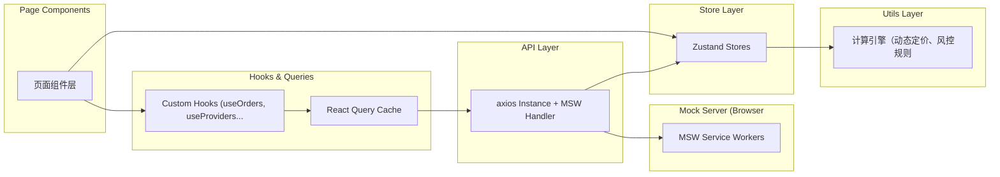
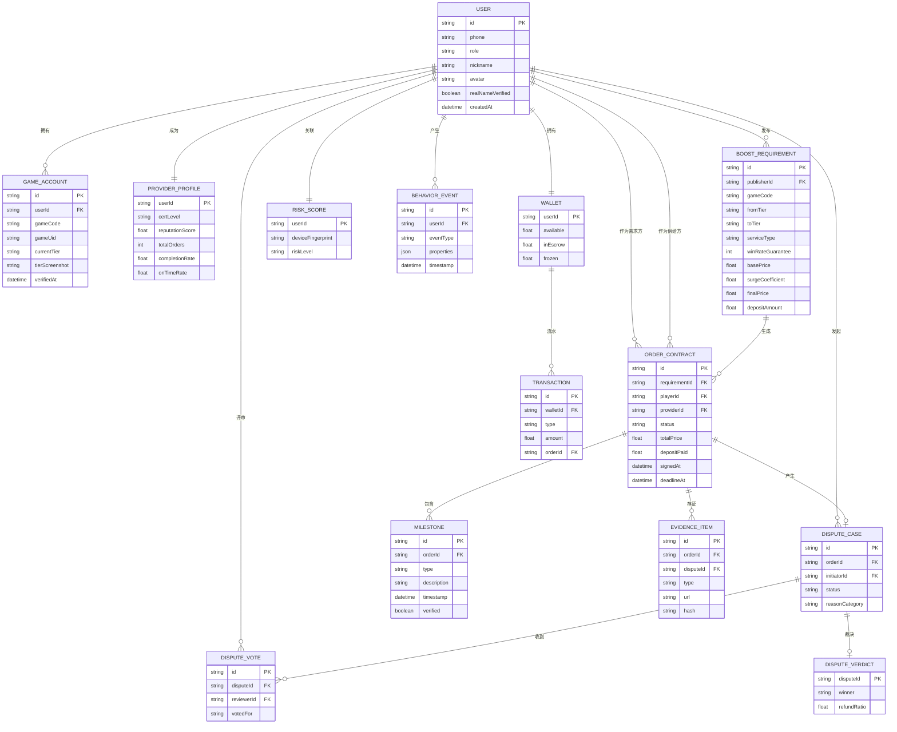

## 1. 架构设计

```mermaid
graph TB
    subgraph "用户接入层"
        A1["Web前端 React 18 + Vite"]
        A2["移动端 H5/小程序"]
    end
    subgraph "前端分层"
        B1["UI组件层 (shadcn/ui + TailwindCSS 3"]
        B2["状态管理层 (Zustand + React Query)"]
        B3["可视化层 (Recharts + Three.js)"]
        B4["3D渲染层 (@react-three/fiber + drei)"]
    end
    subgraph "API & 业务服务层（Mock API"]
        C1["用户认证服务"]
        C2["撮合匹配服务"]
        C3["订单合约服务"]
        C4["履约监控服务"]
        C5["争议仲裁服务"]
        C6["风控引擎服务"]
        C7["资金担保服务"]
    end
    subgraph "数据存储层（Mock Data + localStorage"]
        D1["用户与账号数据"]
        D2["订单与合约数据"]
        D3["服务商档案数据"]
        D4["证据链存证数据"]
        D5["风控行为数据"]
    end
    subgraph "外部服务（模拟）"]
        E1["游戏厂商开放平台API（模拟）"]
        E2["OCR图像识别（模拟）"]
        E3["支付担保通道（模拟）"]
    end
    A1 --> B1 & B2 & B3 & B4
    A2 --> B1 & B2
    B2 --> C1 & C2 & C3 & C4 & C5 & C6 & C7
    C1 --> D1
    C2 --> D1 & D3
    C3 --> D2 & D3
    C4 --> D2 & D4
    C5 --> D2 & D4
    C6 --> D5 & D1
    C7 --> D2
    C1 --> E1
    C4 --> E2
    C7 --> E3
```

## 2. 技术栈说明

- **前端框架**：React 18 + TypeScript 5 + Vite 6
- **UI组件库**：shadcn/ui（深度定制电竞主题 + TailwindCSS 3
- **状态管理**：Zustand（全局状态 + @tanstack/react-query（服务端状态 + SWR式缓存
- **路由**：React Router v6（嵌套路由 + 懒加载
- **可视化图表**：Recharts + 雷达图/折线图/面积图
- **3D渲染**：@react-three/fiber 8 + @react-three/drei 9 + @react-three/postprocessing
- **表单处理**：React Hook Form 7 + Zod Schema校验
- **动画库**：Framer Motion 11
- **图标**：Lucide React（线性图标）+ 自定义SVG段位徽章
- **工具库**：date-fns（日期）+ clsx + tailwind-merge（样式合并）
- **后端**：无真实后端，使用MSW + Mock Service Worker模拟API
- **数据持久化**：localStorage + IndexedDB（录屏/证据链大文件）
- **代码规范**：ESLint + Prettier + Husky + lint-staged

## 3. 路由定义

| 路由路径 | 页面名称 | 说明 |
|----------|----------|------|
| / | 首页大厅 | 服务展示、推荐、实时数据看板 |
| /publish | 需求发布 | 选择游戏、配置需求、动态定价预览 |
| /providers | 服务商广场 | 浏览/筛选/搜索服务商 |
| /provider/:id | 服务商详情 | 信誉档案、历史战绩、服务报价 |
| /account/games | 游戏账号管理 | 绑定、核验、段位信息 |
| /orders | 订单列表 | 全部/进行中/已完成/有争议 |
| /order/:id | 订单合约详情 | 合约信息、履约进度、证据链 |
| /order/:id/monitor | 履约监控台 | 录屏、关键节点、完成度 |
| /dispute/:id | 争议仲裁工作台 | 证据对比、三方评审、裁决 |
| /arbitration | 我的争议 | 发起/参与的争议列表 |
| /wallet | 资金钱包 | 余额、流水、提现、退款 |
| /risk | 风控中心 | 风险概览、行为分析（运营视图 |
| /profile | 个人中心 | 资料设置、认证、消息通知 |
| /auth/login | 登录注册 | 手机号+验证码登录 |
| /auth/verify | 实名认证 | 身份信息、游戏ID核验 |

## 4. API接口定义（Mock）

```typescript
// ========== 通用类型 ==========
type UserRole = 'player' | 'booster' | 'admin' | 'reviewer';
type GameCode = 'LOL' | 'VALORANT' | 'CSGO' | 'DOTA2' | 'OW';
type TierRank = 'Iron | 'Bronze' | 'Silver' | 'Gold' | 'Platinum' | 'Diamond' | 'Master' | 'Challenger';
type CertLevel = 'None' | 'Silver' | 'Gold' | 'Diamond';
type OrderStatus = 'Pending' | 'Matched' | 'InProgress' | 'Checking' | 'Completed' | 'Disputed' | 'Refunded';
type DisputeStatus = 'Submitted' | 'EvidenceGathering' | 'Reviewing' | 'Resolved' | 'Appealed';

// ========== 用户与认证 ==========
interface User { id: string; phone: string; role: UserRole; nickname: string; avatar: string; realNameVerified: boolean; }
interface GameAccount { id: string; userId: string; gameCode: GameCode; gameUid: string; currentTier: TierRank; tierScreenshot: string; verifiedAt: Date; }
interface ProviderProfile { userId: string; certLevel: CertLevel; reputationScore: number; totalOrders: number; completionRate: number; onTimeRate: number; }

// ========== 需求与订单 ==========
interface BoostRequirement {
  id: string; publisherId: string; gameCode: GameCode; fromTier: TierRank; toTier: TierRank; serviceType: 'Ranked' | 'Placement' | 'Coaching' | 'HeroMastery';
  expectedWins?: number; durationHours?: number; winRateGuarantee: number; heroPool?: string[]; premiumHours?: string[];
  basePrice: number; surgeCoefficient: number; finalPrice: number; depositAmount: number;
}

interface OrderContract {
  id: string; requirementId: string; providerId: string; playerId: string;
  status: OrderStatus; totalPrice: number; depositPaid: number; platformFee: number;
  guaranteeClauses: string[]; signedAt: Date; deadlineAt: Date;
  milestones: Milestone[];
  evidence: EvidenceItem[];
}

interface Milestone { id: string; orderId: string; type: 'GameStart' | 'Win' | 'RankUp' | 'TierComplete' | 'AllComplete'; description: string; timestamp: Date; verified: boolean; proofUrl?: string; }
interface EvidenceItem { id: string; orderId: string; type: 'ScreenRecording' | 'Screenshot' | 'SDKLog' | 'ManualUpload'; url: string; hash: string; uploadedBy: string; uploadedAt: Date; }

// ========== 争议仲裁 ==========
interface DisputeCase {
  id: string; orderId: string; initiatorId: string; respondentId: string;
  status: DisputeStatus; reasonCategory: string; description: string;
  plaintiffEvidence: EvidenceItem[]; defendantEvidence: EvidenceItem[];
  reviewers: string[]; votes: DisputeVote[]; verdict?: DisputeVerdict;
}
interface DisputeVote { reviewerId: string; votedFor: 'plaintiff' | 'defendant' | 'split'; reason: string; votedAt: Date; }
interface DisputeVerdict { winner: 'plaintiff' | 'defendant' | 'split'; refundRatio: number; reason: string; decidedAt: Date; }

// ========== 风控 ==========
interface RiskScore { userId: string; deviceFingerprint: string; loginLocations: string[]; anomalyFlags: string[]; riskLevel: 'Low' | 'Medium' | 'High'; }
interface BehaviorEvent { userId: string; eventType: string; properties: Record<string, unknown>; timestamp: Date; sessionId: string; }

// ========== API 响应格式 ==========
interface ApiResponse<T> { code: number; message: string; data: T; }
interface PagedResult<T> { items: T[]; total: number; page: number; pageSize: number; }

// ========== 核心接口列表 ==========
// POST   /api/auth/login            登录
// POST   /api/auth/verify-realname  实名认证
// POST   /api/game-accounts     绑定游戏账号
// GET    /api/game-accounts/:id/verify  触发游戏ID核验
// POST   /api/requirements       发布需求
// GET    /api/requirements       需求列表/搜索
// GET    /api/providers         服务商列表
// GET    /api/providers/:id     服务商详情
// POST   /api/orders          创建订单
// GET    /api/orders/:id   订单详情
// POST   /api/orders/:id/accept  服务商接单
// POST   /api/orders/:id/milestones  提交履约节点
// POST   /api/orders/:id/evidence  上传证据
// POST   /api/disputes    发起争议
// POST   /api/disputes/:id/vote  评审投票
// GET    /api/wallet/balance  钱包余额
// GET    /api/risk/scores  风控评分
```

## 5. 前端分层调用链



## 6. 数据模型ER图



## 7. 初始化数据（Mock）

```sql
-- 初始用户（包含各类角色
INSERT INTO USER (id, phone, role, nickname, avatar, realNameVerified) VALUES
('u001', '13800000001', 'player', '上分小哥哥', 'https://api.dicebear.com/7.x/avataaars/svg?seed=Felix', true),
('u002', '13800000002', 'booster', '钻石手速流', 'https://api.dicebear.com/7.x/avataaars/svg?seed=Aneka', true),
('u003', '13800000003', 'booster', '王者代打导师', 'https://api.dicebear.com/7.x/avataaars/svg?seed=Milo', true),
('u004', '13800000004', 'admin', '平台仲裁官', 'https://api.dicebear.com/7.x/avataaars/svg?seed=Luna', true),
('u005', '13800000005', 'reviewer', '公正评审01', 'https://api.dicebear.com/7.x/avataaars/svg?seed=Zara', true);

-- 游戏账号
INSERT INTO GAME_ACCOUNT (id, userId, gameCode, gameUid, currentTier, tierScreenshot, verifiedAt) VALUES
('g001', 'u001', 'LOL', '召唤师峡谷·', 'Silver', 'data:image/png;base64,...', '2026-06-01 10:00:00'),
('g002', 'u002', 'LOL', '暗裔剑魔OvO', 'Diamond', 'data:image/png;base64,...', '2026-05-15 14:30:00'),
('g003', 'u003', 'VALORANT', '爆头王', 'Immortal', 'data:image/png;base64,...', '2026-04-20 09:15:00');

-- 服务商档案
INSERT INTO PROVIDER_PROFILE (userId, certLevel, reputationScore, totalOrders, completionRate, onTimeRate) VALUES
('u002', 'Diamond', 4.9, 328, 98.5, 96.2),
('u003', 'Gold', 4.7, 156, 95.3, 92.8);

-- 示例需求
INSERT INTO BOOST_REQUIREMENT (id, publisherId, gameCode, fromTier, toTier, serviceType, winRateGuarantee, basePrice, surgeCoefficient, finalPrice, depositAmount) VALUES
('r001', 'u001', 'LOL', 'Silver', 'Gold', 'Ranked', 70, 180.0, 1.15, 207.0, 62.1);

-- 示例订单
INSERT INTO ORDER_CONTRACT (id, requirementId, playerId, providerId, status, totalPrice, depositPaid, signedAt, deadlineAt) VALUES
('o001', 'r001', 'u001', 'u002', 'InProgress', 207.0, 62.1, '2026-06-20 18:00:00', '2026-06-23 18:00:00');

-- 履约节点
INSERT INTO MILESTONE (id, orderId, type, description, timestamp, verified) VALUES
('m001', 'o001', 'GameStart', '代练开始，账号已登录', '2026-06-20 18:05:00', true),
('m002', 'o001', 'Win', '第1局胜利，MVP', '2026-06-20 18:28:00', true),
('m003', 'o001', 'Win', '第2局胜利，段位提升至Silver I', '2026-06-20 18:52:00', true);
```
