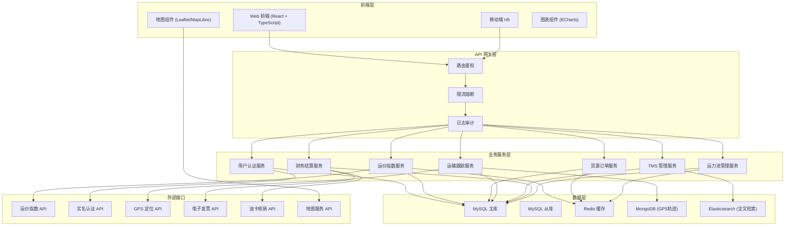
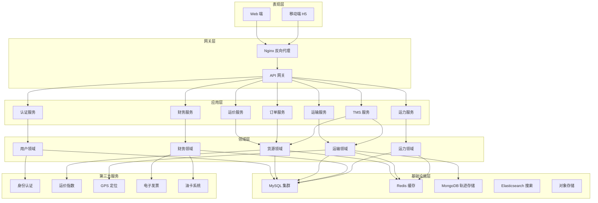

## 1. 架构设计



## 2. 技术描述

### 2.1 技术栈选型

| 层级 | 技术选型 | 版本 | 说明 |
|------|----------|------|------|
| **前端框架** | React | 18.x | 函数式组件 + Hooks |
| **开发语言** | TypeScript | 5.x | 类型安全 |
| **构建工具** | Vite | 5.x | 快速开发构建 |
| **UI 组件库** | Ant Design | 5.x | 企业级组件库 |
| **状态管理** | Zustand | 4.x | 轻量级状态管理 |
| **路由管理** | React Router | 6.x | 声明式路由 |
| **HTTP 客户端** | Axios | 1.x | 请求拦截与响应处理 |
| **地图组件** | MapLibre GL | 3.x | 开源地图引擎 |
| **图表组件** | ECharts | 5.x | 数据可视化 |
| **样式方案** | TailwindCSS | 3.x | 原子化 CSS |
| **动画库** | Framer Motion | 11.x | 流畅动画效果 |
| **Mock 服务** | MSW | 2.x | 接口 Mock |
| **代码规范** | ESLint + Prettier | - | 代码质量保障 |

### 2.2 后端技术栈（可选扩展）
- Node.js + Express / NestJS
- 数据库：MySQL 8.0 + Redis 7
- ORM：Prisma / TypeORM
- 认证：JWT + RBAC

---

## 3. 路由定义

| 路由路径 | 页面名称 | 权限角色 | 说明 |
|---------|----------|----------|------|
| `/login` | 登录页 | 公开 | 账号登录、角色选择 |
| `/` | 首页仪表盘 | 所有角色 | 数据概览、快捷入口 |
| `/price-query` | 运价查询 | 货主/运营 | 线路价格查询、运价指数 |
| `/cargo/publish` | 发布货源 | 货主 | 货源信息录入发布 |
| `/cargo/list` | 货源列表 | 货主/司机/车队/运营 | 货源列表管理 |
| `/cargo/:id` | 货源详情 | 货主/司机/车队/运营 | 货源详情与操作 |
| `/orders` | 订单中心 | 货主/车队/运营 | 订单列表管理 |
| `/orders/:id` | 订单详情 | 货主/车队/运营 | 订单详情查看 |
| `/waybills` | 运单中心 | 所有角色 | 运单列表管理 |
| `/waybills/:id` | 运单详情 | 所有角色 | 运单详情与跟踪 |
| `/tracking` | 在途监控 | 货主/车队/运营 | 地图可视化监控 |
| `/bills` | 账单中心 | 货主/车队/运营 | 账单列表与对账 |
| `/settlement` | 结算管理 | 财务/运营 | 结算与发票管理 |
| `/capacity` | 运力池管理 | 货主/运营 | 承运商白名单管理 |
| `/capacity/drivers` | 司机管理 | 车队/运营 | 司机库管理 |
| `/capacity/vehicles` | 车辆管理 | 车队/运营 | 车辆库管理 |
| `/auth` | 认证中心 | 所有角色 | 实名认证与资质审核 |
| `/settings` | 系统设置 | 管理员/运营 | 系统配置与权限管理 |
| `/settings/users` | 用户管理 | 管理员 | 用户账号管理 |
| `/settings/roles` | 角色权限 | 管理员 | 角色与权限配置 |

---

## 4. API 定义

### 4.1 通用响应结构

```typescript
interface ApiResponse<T> {
  code: number;
  message: string;
  data: T;
  timestamp: number;
}

interface PageResult<T> {
  list: T[];
  total: number;
  page: number;
  pageSize: number;
}
```

### 4.2 核心数据类型定义

```typescript
// 用户角色
type UserRole = 'owner' | 'fleet' | 'driver' | 'operator' | 'admin';

// 用户信息
interface User {
  id: string;
  username: string;
  role: UserRole;
  companyName?: string;
  phone: string;
  avatar?: string;
  authStatus: 'pending' | 'approved' | 'rejected';
  createdAt: string;
}

// 货源信息
interface Cargo {
  id: string;
  orderNo: string;
  ownerId: string;
  cargoName: string;
  cargoType: 'LTL' | 'FTL'; // 零担/整车
  weight: number;
  volume: number;
  quantity: number;
  packageType: string;
  startCity: string;
  endCity: string;
  startAddress: string;
  endAddress: string;
  pickupTime: string;
  deliveryTime: string;
  temperatureRequirement?: {
    min: number;
    max: number;
    unit: 'celsius' | 'fahrenheit';
  };
  insurance?: {
    enabled: boolean;
    type: string;
    amount: number;
    premium: number;
  };
  vehicleRequirement: {
    vehicleType: string;
    vehicleLength: number;
  };
  expectedPrice: number;
  status: 'draft' | 'published' | 'bidding' | 'assigned' | 'in_transit' | 'completed' | 'cancelled';
  createdAt: string;
}

// 运单信息
interface Waybill {
  id: string;
  waybillNo: string;
  cargoId: string;
  driverId: string;
  vehicleId: string;
  fleetId?: string;
  actualPrice: number;
  status: 'pending' | 'loading' | 'in_transit' | 'unloading' | 'completed' | 'exception';
  startTime?: string;
  endTime?: string;
  currentLocation?: {
    lat: number;
    lng: number;
    timestamp: string;
  };
  exceptionRecords?: ExceptionRecord[];
}

// GPS 轨迹点
interface GpsPoint {
  waybillId: string;
  lat: number;
  lng: number;
  speed: number;
  direction: number;
  timestamp: string;
  ignition: boolean;
}

// 异常记录
interface ExceptionRecord {
  id: string;
  waybillId: string;
  type: 'parking_timeout' | 'route_deviation' | 'temperature_abnormal' | 'delay';
  level: 'warning' | 'danger';
  location: { lat: number; lng: number };
  timestamp: string;
  description: string;
  handled: boolean;
  handledBy?: string;
  handledAt?: string;
  handleRemark?: string;
}

// 账单信息
interface Bill {
  id: string;
  billNo: string;
  orderId: string;
  waybillId: string;
  amount: number;
  type: 'receivable' | 'payable';
  status: 'unpaid' | 'partial' | 'paid';
  invoiceStatus: 'not_applied' | 'applied' | 'invoiced';
  createdAt: string;
  paidAt?: string;
}

// 发票信息
interface Invoice {
  id: string;
  invoiceNo: string;
  billId: string;
  type: 'vat_special' | 'vat_normal';
  amount: number;
  taxAmount: number;
  totalAmount: number;
  buyerInfo: {
    companyName: string;
    taxNumber: string;
    address?: string;
    phone?: string;
    bank?: string;
    bankAccount?: string;
  };
  status: 'draft' | 'issued' | 'voided';
  issuedAt?: string;
  pdfUrl?: string;
}

// 电子油卡
interface FuelCard {
  id: string;
  cardNo: string;
  driverId: string;
  balance: number;
  status: 'active' | 'frozen' | 'cancelled';
  transactions: FuelCardTransaction[];
}

interface FuelCardTransaction {
  id: string;
  cardId: string;
  amount: number;
  type: 'recharge' | 'consume' | 'refund';
  waybillId?: string;
  stationName?: string;
  timestamp: string;
}

// 运价指数
interface FreightRate {
  id: string;
  startCity: string;
  endCity: string;
  vehicleType: string;
  currentPrice: number;
  historicalPrices: { date: string; price: number }[];
  trend: 'up' | 'down' | 'stable';
  changePercent: number;
  updateTime: string;
}

// 司机信息
interface Driver {
  id: string;
  name: string;
  phone: string;
  idCard: string;
  driverLicense: string;
  driverLicenseType: string;
  qualificationCertificate?: string;
  avatar?: string;
  authStatus: 'pending' | 'approved' | 'rejected';
  rating: number;
  totalOrders: number;
  fleetId?: string;
}

// 车辆信息
interface Vehicle {
  id: string;
  plateNo: string;
  vehicleType: string;
  vehicleLength: number;
  maxLoad: number;
  maxVolume: number;
  color: string;
 行驶证: string;
  roadTransportPermit?: string;
  insuranceExpireDate?: string;
  annualInspectionDate?: string;
  authStatus: 'pending' | 'approved' | 'rejected';
  fleetId?: string;
  currentDriverId?: string;
}

// 承运商信息
interface Carrier {
  id: string;
  companyName: string;
  businessLicense: string;
  roadTransportPermit: string;
  contactName: string;
  contactPhone: string;
  rating: number;
  whitelist: boolean;
  authStatus: 'pending' | 'approved' | 'rejected';
}
```

### 4.3 核心 API 列表

| 接口路径 | 方法 | 说明 | 请求参数 | 响应类型 |
|---------|------|------|----------|----------|
| `/api/auth/login` | POST | 用户登录 | `{ username, password, role }` | `{ token, user }` |
| `/api/auth/current` | GET | 获取当前用户 | - | `User` |
| `/api/freight-rates` | GET | 查询运价指数 | `{ startCity, endCity, vehicleType }` | `FreightRate[]` |
| `/api/cargo` | POST | 发布货源 | `CargoCreateRequest` | `Cargo` |
| `/api/cargo` | GET | 获取货源列表 | `{ page, pageSize, status }` | `PageResult<Cargo>` |
| `/api/cargo/:id` | GET | 获取货源详情 | - | `Cargo` |
| `/api/cargo/:id/assign` | POST | 派单给司机/车队 | `{ driverId, fleetId, price }` | `Waybill` |
| `/api/waybills` | GET | 获取运单列表 | `{ page, pageSize, status }` | `PageResult<Waybill>` |
| `/api/waybills/:id` | GET | 获取运单详情 | - | `Waybill` |
| `/api/waybills/:id/gps` | GET | 获取运单轨迹 | `{ startTime, endTime }` | `GpsPoint[]` |
| `/api/waybills/:id/gps` | POST | 上报GPS位置 | `GpsPoint` | `void` |
| `/api/tracking/active` | GET | 获取活跃运单位置 | - | `Waybill[]` |
| `/api/orders` | GET | 获取订单列表 | `{ page, pageSize }` | `PageResult<Cargo>` |
| `/api/bills` | GET | 获取账单列表 | `{ page, pageSize, status }` | `PageResult<Bill>` |
| `/api/bills/:id/invoice` | POST | 申请开票 | `{ type, buyerInfo }` | `Invoice` |
| `/api/settlement/fuel-card/verify` | POST | 油卡核销 | `{ cardNo, amount, waybillId }` | `FuelCardTransaction` |
| `/api/capacity/carriers` | GET | 获取承运商列表 | `{ whitelist, page, pageSize }` | `PageResult<Carrier>` |
| `/api/capacity/drivers` | GET | 获取司机列表 | `{ page, pageSize, status }` | `PageResult<Driver>` |
| `/api/capacity/vehicles` | GET | 获取车辆列表 | `{ page, pageSize }` | `PageResult<Vehicle>` |
| `/api/auth/driver` | POST | 司机实名认证 | `DriverAuthRequest` | `Driver` |
| `/api/auth/vehicle` | POST | 车辆认证 | `VehicleAuthRequest` | `Vehicle` |

---

## 5. 服务架构图



---

## 6. 数据模型

### 6.1 ER 图


### 6.2 DDL 语句

```sql
-- 用户表
CREATE TABLE users (
    id VARCHAR(32) PRIMARY KEY COMMENT '用户ID',
    username VARCHAR(64) NOT NULL UNIQUE COMMENT '用户名',
    password_hash VARCHAR(255) NOT NULL COMMENT '密码哈希',
    role ENUM('owner', 'fleet', 'driver', 'operator', 'admin') NOT NULL COMMENT '角色',
    phone VARCHAR(20) NOT NULL COMMENT '手机号',
    company_name VARCHAR(128) COMMENT '公司名称',
    avatar VARCHAR(255) COMMENT '头像URL',
    auth_status ENUM('pending', 'approved', 'rejected') DEFAULT 'pending' COMMENT '认证状态',
    created_at DATETIME DEFAULT CURRENT_TIMESTAMP COMMENT '创建时间',
    updated_at DATETIME DEFAULT CURRENT_TIMESTAMP ON UPDATE CURRENT_TIMESTAMP COMMENT '更新时间',
    INDEX idx_role (role),
    INDEX idx_phone (phone)
) ENGINE=InnoDB DEFAULT CHARSET=utf8mb4 COMMENT='用户表';

-- 货源表
CREATE TABLE cargo (
    id VARCHAR(32) PRIMARY KEY COMMENT '货源ID',
    order_no VARCHAR(32) NOT NULL UNIQUE COMMENT '订单号',
    owner_id VARCHAR(32) NOT NULL COMMENT '货主ID',
    cargo_name VARCHAR(128) NOT NULL COMMENT '货物名称',
    cargo_type ENUM('LTL', 'FTL') NOT NULL COMMENT '零担/整车',
    weight DECIMAL(10,2) NOT NULL COMMENT '重量(吨)',
    volume DECIMAL(10,2) COMMENT '体积(立方米)',
    quantity INT COMMENT '件数',
    package_type VARCHAR(32) COMMENT '包装类型',
    start_city VARCHAR(64) NOT NULL COMMENT '出发城市',
    end_city VARCHAR(64) NOT NULL COMMENT '目的城市',
    start_address VARCHAR(255) NOT NULL COMMENT '装货地址',
    end_address VARCHAR(255) NOT NULL COMMENT '卸货地址',
    pickup_time DATETIME NOT NULL COMMENT '装货时间',
    delivery_time DATETIME COMMENT '要求送达时间',
    temperature_req JSON COMMENT '温控要求',
    insurance JSON COMMENT '保险信息',
    vehicle_req JSON NOT NULL COMMENT '车辆要求',
    expected_price DECIMAL(12,2) NOT NULL COMMENT '期望运费',
    status ENUM('draft', 'published', 'bidding', 'assigned', 'in_transit', 'completed', 'cancelled') DEFAULT 'draft' COMMENT '状态',
    created_at DATETIME DEFAULT CURRENT_TIMESTAMP COMMENT '创建时间',
    updated_at DATETIME DEFAULT CURRENT_TIMESTAMP ON UPDATE CURRENT_TIMESTAMP COMMENT '更新时间',
    INDEX idx_owner_id (owner_id),
    INDEX idx_status (status),
    INDEX idx_route (start_city, end_city),
    INDEX idx_created_at (created_at)
) ENGINE=InnoDB DEFAULT CHARSET=utf8mb4 COMMENT='货源表';

-- 运单表
CREATE TABLE waybills (
    id VARCHAR(32) PRIMARY KEY COMMENT '运单ID',
    waybill_no VARCHAR(32) NOT NULL UNIQUE COMMENT '运单号',
    cargo_id VARCHAR(32) NOT NULL COMMENT '货源ID',
    driver_id VARCHAR(32) NOT NULL COMMENT '司机ID',
    vehicle_id VARCHAR(32) NOT NULL COMMENT '车辆ID',
    fleet_id VARCHAR(32) COMMENT '车队ID',
    actual_price DECIMAL(12,2) NOT NULL COMMENT '实际运费',
    status ENUM('pending', 'loading', 'in_transit', 'unloading', 'completed', 'exception') DEFAULT 'pending' COMMENT '运单状态',
    start_time DATETIME COMMENT '发车时间',
    end_time DATETIME COMMENT '送达时间',
    current_location JSON COMMENT '当前位置',
    created_at DATETIME DEFAULT CURRENT_TIMESTAMP COMMENT '创建时间',
    updated_at DATETIME DEFAULT CURRENT_TIMESTAMP ON UPDATE CURRENT_TIMESTAMP COMMENT '更新时间',
    INDEX idx_cargo_id (cargo_id),
    INDEX idx_driver_id (driver_id),
    INDEX idx_status (status),
    INDEX idx_created_at (created_at)
) ENGINE=InnoDB DEFAULT CHARSET=utf8mb4 COMMENT='运单表';

-- 司机表
CREATE TABLE drivers (
    id VARCHAR(32) PRIMARY KEY COMMENT '司机ID',
    user_id VARCHAR(32) NOT NULL UNIQUE COMMENT '关联用户ID',
    name VARCHAR(32) NOT NULL COMMENT '姓名',
    phone VARCHAR(20) NOT NULL COMMENT '手机号',
    id_card VARCHAR(18) NOT NULL UNIQUE COMMENT '身份证号',
    driver_license VARCHAR(32) NOT NULL COMMENT '驾驶证号',
    driver_license_type VARCHAR(8) NOT NULL COMMENT '驾驶证类型',
    qualification_certificate VARCHAR(32) COMMENT '从业资格证',
    avatar VARCHAR(255) COMMENT '头像',
    auth_status ENUM('pending', 'approved', 'rejected') DEFAULT 'pending' COMMENT '认证状态',
    rating DECIMAL(3,2) DEFAULT 5.0 COMMENT '评分',
    total_orders INT DEFAULT 0 COMMENT '完成订单数',
    fleet_id VARCHAR(32) COMMENT '所属车队ID',
    created_at DATETIME DEFAULT CURRENT_TIMESTAMP COMMENT '创建时间',
    updated_at DATETIME DEFAULT CURRENT_TIMESTAMP ON UPDATE CURRENT_TIMESTAMP COMMENT '更新时间',
    INDEX idx_fleet_id (fleet_id),
    INDEX idx_auth_status (auth_status)
) ENGINE=InnoDB DEFAULT CHARSET=utf8mb4 COMMENT='司机表';

-- 车辆表
CREATE TABLE vehicles (
    id VARCHAR(32) PRIMARY KEY COMMENT '车辆ID',
    plate_no VARCHAR(16) NOT NULL UNIQUE COMMENT '车牌号',
    vehicle_type VARCHAR(32) NOT NULL COMMENT '车辆类型',
    vehicle_length DECIMAL(4,1) NOT NULL COMMENT '车长(米)',
    max_load DECIMAL(10,2) NOT NULL COMMENT '最大载重(吨)',
    max_volume DECIMAL(10,2) COMMENT '最大容积(立方米)',
    color VARCHAR(16) COMMENT '车身颜色',
    driving_license VARCHAR(32) NOT NULL COMMENT '行驶证号',
    road_transport_permit VARCHAR(32) COMMENT '道路运输证',
    insurance_expire_date DATE COMMENT '保险到期日',
    annual_inspection_date DATE COMMENT '年检日期',
    auth_status ENUM('pending', 'approved', 'rejected') DEFAULT 'pending' COMMENT '认证状态',
    fleet_id VARCHAR(32) COMMENT '所属车队ID',
    current_driver_id VARCHAR(32) COMMENT '当前司机ID',
    created_at DATETIME DEFAULT CURRENT_TIMESTAMP COMMENT '创建时间',
    updated_at DATETIME DEFAULT CURRENT_TIMESTAMP ON UPDATE CURRENT_TIMESTAMP COMMENT '更新时间',
    INDEX idx_fleet_id (fleet_id),
    INDEX idx_plate_no (plate_no)
) ENGINE=InnoDB DEFAULT CHARSET=utf8mb4 COMMENT='车辆表';

-- 承运商表
CREATE TABLE carriers (
    id VARCHAR(32) PRIMARY KEY COMMENT '承运商ID',
    company_name VARCHAR(128) NOT NULL COMMENT '公司名称',
    business_license VARCHAR(32) NOT NULL UNIQUE COMMENT '营业执照号',
    road_transport_permit VARCHAR(32) COMMENT '道路运输许可证',
    contact_name VARCHAR(32) NOT NULL COMMENT '联系人',
    contact_phone VARCHAR(20) NOT NULL COMMENT '联系电话',
    rating DECIMAL(3,2) DEFAULT 5.0 COMMENT '评分',
    whitelist TINYINT(1) DEFAULT 0 COMMENT '是否白名单',
    auth_status ENUM('pending', 'approved', 'rejected') DEFAULT 'pending' COMMENT '认证状态',
    created_at DATETIME DEFAULT CURRENT_TIMESTAMP COMMENT '创建时间',
    updated_at DATETIME DEFAULT CURRENT_TIMESTAMP ON UPDATE CURRENT_TIMESTAMP COMMENT '更新时间',
    INDEX idx_whitelist (whitelist),
    INDEX idx_auth_status (auth_status)
) ENGINE=InnoDB DEFAULT CHARSET=utf8mb4 COMMENT='承运商表';

-- 账单表
CREATE TABLE bills (
    id VARCHAR(32) PRIMARY KEY COMMENT '账单ID',
    bill_no VARCHAR(32) NOT NULL UNIQUE COMMENT '账单号',
    order_id VARCHAR(32) NOT NULL COMMENT '订单ID',
    waybill_id VARCHAR(32) NOT NULL COMMENT '运单ID',
    amount DECIMAL(12,2) NOT NULL COMMENT '金额',
    type ENUM('receivable', 'payable') NOT NULL COMMENT '应收/应付',
    status ENUM('unpaid', 'partial', 'paid') DEFAULT 'unpaid' COMMENT '支付状态',
    invoice_status ENUM('not_applied', 'applied', 'invoiced') DEFAULT 'not_applied' COMMENT '开票状态',
    created_at DATETIME DEFAULT CURRENT_TIMESTAMP COMMENT '创建时间',
    paid_at DATETIME COMMENT '支付时间',
    INDEX idx_order_id (order_id),
    INDEX idx_status (status),
    INDEX idx_type (type)
) ENGINE=InnoDB DEFAULT CHARSET=utf8mb4 COMMENT='账单表';

-- 发票表
CREATE TABLE invoices (
    id VARCHAR(32) PRIMARY KEY COMMENT '发票ID',
    invoice_no VARCHAR(32) NOT NULL UNIQUE COMMENT '发票号码',
    bill_id VARCHAR(32) NOT NULL COMMENT '账单ID',
    type ENUM('vat_special', 'vat_normal') NOT NULL COMMENT '发票类型',
    amount DECIMAL(12,2) NOT NULL COMMENT '不含税金额',
    tax_amount DECIMAL(12,2) NOT NULL COMMENT '税额',
    total_amount DECIMAL(12,2) NOT NULL COMMENT '价税合计',
    buyer_info JSON NOT NULL COMMENT '购方信息',
    status ENUM('draft', 'issued', 'voided') DEFAULT 'draft' COMMENT '发票状态',
    issued_at DATETIME COMMENT '开票时间',
    pdf_url VARCHAR(255) COMMENT 'PDF下载地址',
    created_at DATETIME DEFAULT CURRENT_TIMESTAMP COMMENT '创建时间',
    INDEX idx_bill_id (bill_id),
    INDEX idx_status (status)
) ENGINE=InnoDB DEFAULT CHARSET=utf8mb4 COMMENT='发票表';

-- 运价指数表
CREATE TABLE freight_rates (
    id VARCHAR(32) PRIMARY KEY COMMENT '运价ID',
    start_city VARCHAR(64) NOT NULL COMMENT '出发城市',
    end_city VARCHAR(64) NOT NULL COMMENT '目的城市',
    vehicle_type VARCHAR(32) NOT NULL COMMENT '车辆类型',
    current_price DECIMAL(10,2) NOT NULL COMMENT '当前价格',
    historical_prices JSON COMMENT '历史价格',
    trend ENUM('up', 'down', 'stable') DEFAULT 'stable' COMMENT '走势',
    change_percent DECIMAL(5,2) DEFAULT 0 COMMENT '涨跌幅',
    update_time DATETIME DEFAULT CURRENT_TIMESTAMP ON UPDATE CURRENT_TIMESTAMP COMMENT '更新时间',
    UNIQUE KEY idx_route_vehicle (start_city, end_city, vehicle_type)
) ENGINE=InnoDB DEFAULT CHARSET=utf8mb4 COMMENT='运价指数表';

-- 异常记录表
CREATE TABLE exception_records (
    id VARCHAR(32) PRIMARY KEY COMMENT '异常ID',
    waybill_id VARCHAR(32) NOT NULL COMMENT '运单ID',
    type ENUM('parking_timeout', 'route_deviation', 'temperature_abnormal', 'delay') NOT NULL COMMENT '异常类型',
    level ENUM('warning', 'danger') NOT NULL COMMENT '异常等级',
    location JSON NOT NULL COMMENT '异常位置',
    timestamp DATETIME NOT NULL COMMENT '异常时间',
    description VARCHAR(512) COMMENT '异常描述',
    handled TINYINT(1) DEFAULT 0 COMMENT '是否已处理',
    handled_by VARCHAR(32) COMMENT '处理人',
    handled_at DATETIME COMMENT '处理时间',
    handle_remark VARCHAR(512) COMMENT '处理备注',
    INDEX idx_waybill_id (waybill_id),
    INDEX idx_handled (handled),
    INDEX idx_timestamp (timestamp)
) ENGINE=InnoDB DEFAULT CHARSET=utf8mb4 COMMENT='异常记录表';

-- 油卡表
CREATE TABLE fuel_cards (
    id VARCHAR(32) PRIMARY KEY COMMENT '油卡ID',
    card_no VARCHAR(32) NOT NULL UNIQUE COMMENT '油卡号',
    driver_id VARCHAR(32) NOT NULL COMMENT '司机ID',
    balance DECIMAL(12,2) DEFAULT 0 COMMENT '余额',
    status ENUM('active', 'frozen', 'cancelled') DEFAULT 'active' COMMENT '状态',
    created_at DATETIME DEFAULT CURRENT_TIMESTAMP COMMENT '创建时间',
    INDEX idx_driver_id (driver_id),
    INDEX idx_card_no (card_no)
) ENGINE=InnoDB DEFAULT CHARSET=utf8mb4 COMMENT='油卡表';

-- 油卡交易表
CREATE TABLE fuel_transactions (
    id VARCHAR(32) PRIMARY KEY COMMENT '交易ID',
    card_id VARCHAR(32) NOT NULL COMMENT '油卡ID',
    amount DECIMAL(12,2) NOT NULL COMMENT '交易金额',
    type ENUM('recharge', 'consume', 'refund') NOT NULL COMMENT '交易类型',
    waybill_id VARCHAR(32) COMMENT '关联运单',
    station_name VARCHAR(128) COMMENT '加油站名称',
    timestamp DATETIME DEFAULT CURRENT_TIMESTAMP COMMENT '交易时间',
    INDEX idx_card_id (card_id),
    INDEX idx_waybill_id (waybill_id),
    INDEX idx_timestamp (timestamp)
) ENGINE=InnoDB DEFAULT CHARSET=utf8mb4 COMMENT='油卡交易表';

-- GPS轨迹表 (MongoDB)
CREATE TABLE gps_points (
    id VARCHAR(32) PRIMARY KEY,
    waybill_id VARCHAR(32) NOT NULL,
    lat DECIMAL(10,8) NOT NULL,
    lng DECIMAL(11,8) NOT NULL,
    speed DECIMAL(6,2) COMMENT '速度 km/h',
    direction INT COMMENT '方向 0-360',
    ignition TINYINT(1) COMMENT '是否点火',
    timestamp DATETIME NOT NULL,
    INDEX idx_waybill_time (waybill_id, timestamp),
    INDEX idx_timestamp (timestamp)
) ENGINE=InnoDB DEFAULT CHARSET=utf8mb4 COMMENT='GPS轨迹表';
```

### 6.3 初始化数据

```sql
-- 插入默认管理员账号 (密码: admin123, 实际使用bcrypt加密)
INSERT INTO users (id, username, password_hash, role, phone, auth_status) VALUES
('admin001', 'admin', '$2b$10$...', 'admin', '13800000000', 'approved');

-- 插入运价指数示例数据
INSERT INTO freight_rates (id, start_city, end_city, vehicle_type, current_price, trend, change_percent) VALUES
('rate001', '上海', '北京', '9.6米厢车', 4500.00, 'up', 2.5),
('rate002', '上海', '广州', '9.6米厢车', 5200.00, 'down', -1.2),
('rate003', '上海', '深圳', '13米高栏', 6800.00, 'stable', 0),
('rate004', '北京', '上海', '9.6米厢车', 4300.00, 'up', 3.1),
('rate005', '广州', '上海', '17.5米平板', 7500.00, 'down', -0.8);

-- 插入示例承运商
INSERT INTO carriers (id, company_name, business_license, contact_name, contact_phone, whitelist, auth_status) VALUES
('carrier001', '顺风物流有限公司', '91310000MA12345678', '张经理', '13900000001', 1, 'approved'),
('carrier002', '快捷运输有限公司', '91310000MA87654321', '李经理', '13900000002', 1, 'approved');
```
