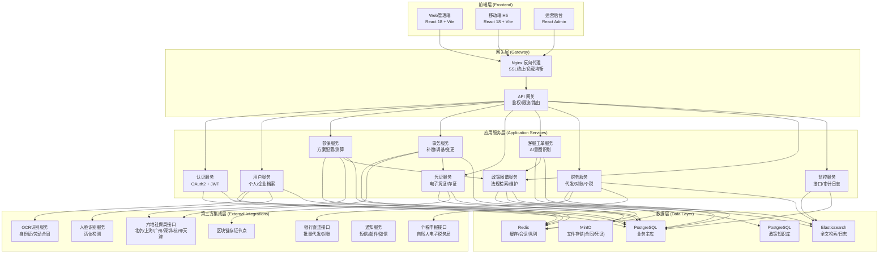
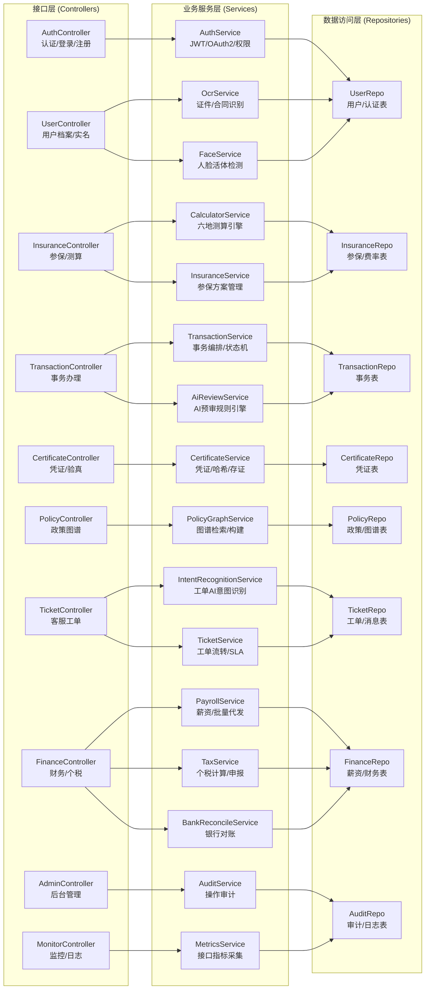
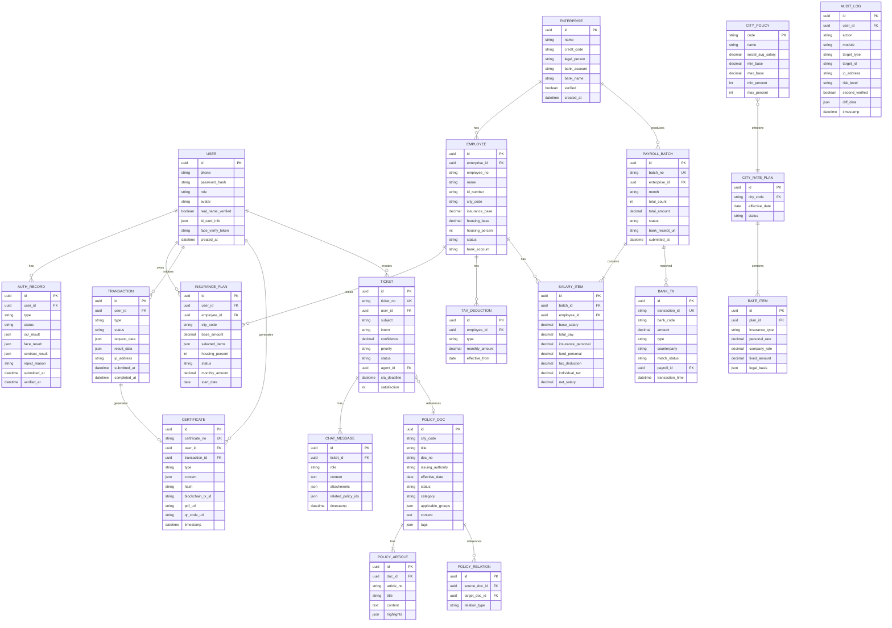

## 1. 架构设计



## 2. 技术说明

- **前端**: React@18 + TypeScript + Vite + tailwindcss@3 + React Router@6 + Zustand + ECharts@5 + Ant Design@5
- **初始化工具**: vite (React TypeScript 模板)
- **后端**: Node.js + Express@4 + TypeScript + TypeORM (因项目规模采用Node全栈，便于快速迭代)
- **数据库**: PostgreSQL@15 (业务主库 + 政策知识库分库)，Redis@7 (缓存/分布式锁/消息队列)，Elasticsearch@8 (全文检索/日志)
- **文件存储**: MinIO (私有化对象存储，存放合同/凭证/PDF)
- **Mock策略**: 由于社保局/银行等真实接口需要资质，全部第三方接口使用Mock适配器，可配置切换真实接口
- **部署**: Docker Compose 本地开发环境

## 3. 路由定义

| 路由 | 用途 | 权限角色 |
|------|------|----------|
| / | 首页/登录入口 | 公开 |
| /login | 登录/注册页 | 公开 |
| /dashboard | 个人控制台首页 | 个人/企业/客服/管理员 |
| /auth | 实名认证中心 | 个人 |
| /insurance | 参保方案配置 | 个人/企业HR |
| /calculator | 智能测算中心 | 个人/企业HR |
| /transaction | 事务办理大厅 | 个人/企业HR |
| /certificates | 电子凭证库 | 个人/企业HR/财务/客服 |
| /policy | 政策知识图谱 | 全员可访问 |
| /support | 客服工单系统 | 个人/企业/客服/管理员 |
| /finance | 企业财务控制台 | 企业HR/财务 |
| /admin | 运营管理后台 | 管理员 |
| /admin/policy | 政策数据维护 | 管理员 |
| /admin/monitor | 接口监控仪表盘 | 管理员 |
| /admin/audit | 审计日志 | 管理员 |

## 4. API 定义

```typescript
// ============ 通用类型 ============
interface ApiResponse<T> {
  code: number;
  message: string;
  data: T;
  timestamp: string;
  requestId: string;
}

interface PageResult<T> {
  list: T[];
  total: number;
  page: number;
  pageSize: number;
}

interface PaginationParams {
  page?: number;
  pageSize?: number;
}

// ============ 认证模块 ============
interface LoginRequest {
  phone: string;
  smsCode?: string;
  password?: string;
  captcha?: string;
}

interface LoginResponse {
  accessToken: string;
  refreshToken: string;
  expiresIn: number;
  user: UserInfo;
}

interface UserInfo {
  id: string;
  phone: string;
  role: 'PERSONAL' | 'ENTERPRISE_HR' | 'FINANCE' | 'CS_AGENT' | 'ADMIN';
  realNameVerified: boolean;
  enterpriseVerified?: boolean;
  avatar?: string;
  nickname?: string;
}

// ============ 实名认证模块 ============
interface IdCardOcrRequest {
  frontImage: string;  // base64
  backImage: string;
}

interface IdCardOcrResult {
  name: string;
  idNumber: string;
  gender: '男' | '女';
  ethnicity: string;
  birthDate: string;
  address: string;
  issuingAuthority: string;
  validFrom: string;
  validTo: string;
  confidence: number;
}

interface FaceVerifyRequest {
  video?: string;      // 活体检测视频 base64
  image?: string;      // 静态图片
}

interface FaceVerifyResult {
  passed: boolean;
  similarity: number;
  livenessScore: number;
}

interface ContractOcrRequest {
  file: string;        // base64 (支持PDF/JPG/PNG)
  fileName: string;
}

interface ContractOcrResult {
  contractNo: string;
  employeeName: string;
  employeeId: string;
  employerName: string;
  employerCreditCode: string;
  position: string;
  salary: number;
  startDate: string;
  endDate: string;
  probation?: {
    months: number;
    salary: number;
  };
  extractedFields: Record<string, string>;
  confidence: number;
  reviewRequired: boolean;
}

interface AuthStatus {
  userId: string;
  idCardVerified: boolean;
  faceVerified: boolean;
  contractVerified: boolean;
  overallStatus: 'PENDING' | 'VERIFIED' | 'REJECTED';
  idCardInfo?: IdCardOcrResult;
  contractInfo?: ContractOcrResult;
  rejectReason?: string;
  submitTime: string;
  verifyTime?: string;
}

// ============ 参保与测算模块 ============
type CityCode = 'BJ' | 'SH' | 'GZ' | 'SZ' | 'HZ' | 'TJ';

interface CityPolicy {
  code: CityCode;
  name: string;
  socialAvgSalary: number;        // 社平工资
  minBase: number;                 // 最低缴费基数
  maxBase: number;                 // 最高缴费基数
  baseRangeMinPercent: number;     // 基数下限百分比 (如 60)
  baseRangeMaxPercent: number;     // 基数上限百分比 (如 300)
  highlights: string[];            // 政策亮点
}

type InsuranceType = 'PENSION' | 'MEDICAL' | 'UNEMPLOYMENT' | 'INJURY' | 'MATERNITY' | 'HOUSING_FUND';

interface RateItem {
  type: InsuranceType;
  name: string;
  personalRate: number;     // 个人缴费比例
  companyRate: number;      // 企业缴费比例
  fixedAmount?: number;     // 固定金额（如大病统筹）
  enabled: boolean;
  legalBasis: {
    title: string;
    docNo: string;
    effectiveDate: string;
    article: string;
    url: string;
  };
}

interface CityRatePlan {
  cityCode: CityCode;
  cityName: string;
  effectiveDate: string;
  items: RateItem[];
}

interface CalculatorRequest {
  cityCode: CityCode;
  baseAmount: number;
  selectedItems: InsuranceType[];
  housingFundPercent?: number;    // 公积金比例 5-12
  isCompanyPay?: boolean;         // 是否计算企业承担部分
}

interface CalculatorResultItem {
  type: InsuranceType;
  name: string;
  base: number;
  personalRate: number;
  companyRate: number;
  personalAmount: number;
  companyAmount: number;
  totalAmount: number;
  legalBasis: RateItem['legalBasis'];
}

interface CalculatorResult {
  cityCode: CityCode;
  cityName: string;
  baseAmount: number;
  items: CalculatorResultItem[];
  personalTotal: number;
  companyTotal: number;
  grandTotal: number;
  compareWithAvg?: {
    personalDiff: number;
    companyDiff: number;
    cityAvgPersonal: number;
    cityAvgCompany: number;
  };
}

interface CompareRequest {
  baseAmount: number;
  selectedItems: InsuranceType[];
  housingFundPercent?: number;
  cities: CityCode[];
}

interface CompareResult {
  results: Record<CityCode, CalculatorResult>;
  summary: {
    cheapestCity: CityCode;
    mostExpensiveCity: CityCode;
    maxDiffPersonal: number;
    maxDiffCompany: number;
  };
}

interface InsurancePlan {
  id: string;
  name: string;
  userId: string;
  cityCode: CityCode;
  baseAmount: number;
  selectedItems: InsuranceType[];
  housingFundPercent: number;
  startDate: string;
  status: 'DRAFT' | 'ACTIVE' | 'SUSPENDED' | 'TERMINATED';
  monthlyAmount: number;
  createdAt: string;
}

// ============ 事务办理模块 ============
type TransactionType = 'SUPPLEMENTARY_PAY' | 'BASE_ADJUSTMENT' | 'HOSPITAL_CHANGE' | 'TRANSFER' | 'INFO_MODIFY';

type TransactionStatus = 'SUBMITTED' | 'AI_REVIEWING' | 'AI_REJECTED' | 'MANUAL_REVIEWING' | 'MANUAL_REJECTED' | 'PROCESSING' | 'SUCCESS' | 'FAILED';

interface Hospital {
  id: string;
  cityCode: CityCode;
  name: string;
  level: '三甲' | '三乙' | '二甲' | '二乙' | '一甲' | '社区';
  address: string;
  isDesignated: boolean;
}

interface SupplementaryPayRequest {
  months: string[];               // yyyy-MM 格式，最多24个月
  baseAmount: number;
  items: InsuranceType[];
  reason: string;
  attachments: string[];          // 文件URL
}

interface SupplementaryPayResult {
  months: string[];
  principal: number;              // 本金
  lateFee: number;                // 滞纳金
  total: number;
  lateFeeRule: string;            // 滞纳金计算规则说明
}

interface BaseAdjustmentRequest {
  effectiveMonth: string;
  newBase: number;
  reason: string;
}

interface BaseAdjustmentResult {
  oldBase: number;
  newBase: number;
  effectiveMonth: string;
  retroMonths: string[];          // 需补退月份
  personalDifference: number;     // 个人差额 (+补缴 / -退还)
  companyDifference: number;      // 企业差额
  totalDifference: number;
}

interface HospitalChangeRequest {
  addHospitalIds: string[];
  removeHospitalIds: string[];
}

interface TransferRequest {
  fromCity: CityCode;
  toCity: CityCode;
  transferTypes: InsuranceType[];
  reason: string;
}

interface Transaction {
  id: string;
  userId: string;
  type: TransactionType;
  title: string;
  status: TransactionStatus;
  requestData: any;
  resultData?: any;
  aiReviewComment?: string;
  manualReviewComment?: string;
  receipt?: any;                   // 社保局回执
  ipAddress: string;
  submittedAt: string;
  updatedAt: string;
  completedAt?: string;
  timeline: {
    status: TransactionStatus;
    time: string;
    operator: string;
    comment?: string;
  }[];
}

// ============ 电子凭证模块 ============
type CertificateType = 'INSURANCE_APPLY' | 'SUPPLEMENTARY_PAY' | 'BASE_ADJUSTMENT' | 'HOSPITAL_CHANGE' | 'TRANSFER' | 'PAYMENT';

interface Certificate {
  id: string;
  certificateNo: string;          // 凭证编号
  type: CertificateType;
  userId: string;
  transactionId?: string;
  title: string;
  content: Record<string, any>;
  timestamp: string;
  ipAddress: string;
  userAgent: string;
  operatorName: string;
  hash: string;                    // 内容哈希
  blockchainTxId?: string;         // 区块链存证交易ID
  eSealImageUrl: string;           // 电子签章图片
  pdfUrl: string;
  qrCodeUrl: string;               // 验真二维码
  verifyUrl: string;               // 在线验真链接
  createdAt: string;
}

interface VerifyCertificateRequest {
  certificateNo: string;
  hash?: string;
}

interface VerifyCertificateResult {
  valid: boolean;
  certificate?: Certificate;
  reason?: string;
}

// ============ 政策知识图谱模块 ============
interface PolicyDocument {
  id: string;
  cityCode: CityCode | 'NATIONAL';
  cityName: string;
  title: string;
  docNo: string;                  // 文号
  issuingAuthority: string;       // 发文机关
  issueDate: string;
  effectiveDate: string;
  expiryDate?: string;
  status: 'EFFECTIVE' | 'DRAFT' | 'EXPIRED';
  category: string;               // 分类:养老保险/医疗保险/...
  applicableGroups: string[];     // 适用人群
  content: string;                // HTML正文
  articles: PolicyArticle[];
  tags: string[];
  relatedDocIds: string[];
  sourceUrl: string;
  version: number;
  lastUpdated: string;
}

interface PolicyArticle {
  id: string;
  articleNo: string;              // 条款号：第一条、第二条...
  title: string;
  content: string;
  highlights: string[];           // 高亮关键词
  relatedInsuranceTypes: InsuranceType[];
}

interface PolicySearchParams extends PaginationParams {
  keyword?: string;
  cityCode?: CityCode | 'NATIONAL';
  category?: string;
  insuranceType?: InsuranceType;
  applicableGroup?: string;
  status?: 'EFFECTIVE' | 'EXPIRED';
  effectiveFrom?: string;
  effectiveTo?: string;
}

interface PolicyGraphNode {
  id: string;
  label: string;
  type: 'DOC' | 'ARTICLE' | 'CITY' | 'INSURANCE' | 'GROUP' | 'AGENCY';
  metadata?: Record<string, any>;
}

interface PolicyGraphEdge {
  source: string;
  target: string;
  label: string;
  type: 'REFERENCES' | 'APPLIES_TO' | 'ISSUED_BY' | 'BELONGS_TO' | 'RELATED_TO';
}

interface PolicyGraph {
  nodes: PolicyGraphNode[];
  edges: PolicyGraphEdge[];
}

// ============ 客服工单模块 ============
type TicketIntent = 'PAYMENT_INTERRUPT' | 'TRANSFER' | 'PENSION_CALCULATE' | 'REIMBURSEMENT' | 'BASE_QUESTION' | 'POLICY_CONSULT' | 'REFUND' | 'OTHER';

type TicketPriority = 'LOW' | 'MEDIUM' | 'HIGH' | 'URGENT';

type TicketStatus = 'NEW' | 'AI_PROCESSING' | 'AI_RESOLVED' | 'PENDING_AGENT' | 'ASSIGNED' | 'PROCESSING' | 'PENDING_USER' | 'RESOLVED' | 'CLOSED';

interface AIIntentResult {
  intent: TicketIntent;
  confidence: number;
  extractedEntities: Record<string, string>;
  suggestedPolicyIds: string[];
  suggestedReplies: string[];
  needsHuman: boolean;
}

interface ChatMessage {
  id: string;
  role: 'USER' | 'AI' | 'AGENT' | 'SYSTEM';
  content: string;
  timestamp: string;
  attachments?: string[];
  relatedPolicyIds?: string[];
}

interface Ticket {
  id: string;
  ticketNo: string;
  userId: string;
  subject: string;
  intent: TicketIntent;
  confidence: number;
  priority: TicketPriority;
  status: TicketStatus;
  cityCode?: CityCode;
  agentId?: string;
  assignedGroup?: string;
  slaDeadline?: string;
  satisfaction?: 1 | 2 | 3 | 4 | 5;
  aiSuggestedPolicies?: string[];
  messages: ChatMessage[];
  createdAt: string;
  updatedAt: string;
  resolvedAt?: string;
}

interface CreateTicketRequest {
  subject: string;
  content: string;
  cityCode?: CityCode;
  attachments?: string[];
}

// ============ 财务模块 ============
interface Employee {
  id: string;
  enterpriseId: string;
  employeeNo: string;
  name: string;
  idNumber: string;
  phone: string;
  department: string;
  position: string;
  cityCode: CityCode;
  insuranceBase: number;
  housingFundBase: number;
  housingFundPercent: number;
  selectedItems: InsuranceType[];
  status: 'ONBOARD' | 'INSURED' | 'SUSPENDED' | 'OFFBOARD';
  bankAccount: string;
  bankName: string;
  entryDate: string;
  taxDeductions: TaxDeduction[];
}

interface TaxDeduction {
  type: 'CHILD_EDUCATION' | 'CONTINUING_EDUCATION' | 'HOUSING_LOAN' | 'HOUSING_RENT' | 'ELDERLY_SUPPORT' | 'INFANT_CARE';
  name: string;
  monthlyAmount: number;
  effectiveFrom: string;
  effectiveTo?: string;
}

interface SalaryItem {
  employeeId: string;
  employeeNo: string;
  name: string;
  baseSalary: number;
  bonus: number;
  allowance: number;
  overtimePay: number;
  otherPay: number;
  totalPay: number;
  personalInsurance: number;       // 社保个人部分
  personalHousingFund: number;     // 公积金个人部分
  taxDeductionTotal: number;       // 专项附加扣除合计
  taxableIncome: number;           // 应纳税所得额
  individualTax: number;           // 个人所得税
  netSalary: number;               // 实发工资
}

interface PayrollBatch {
  id: string;
  batchNo: string;
  enterpriseId: string;
  month: string;                   // yyyy-MM
  items: SalaryItem[];
  totalCount: number;
  totalAmount: number;
  bankName: string;
  bankAccount: string;
  status: 'DRAFT' | 'SUBMITTED' | 'BANK_PROCESSING' | 'PARTIAL_SUCCESS' | 'SUCCESS' | 'FAILED';
  bankReceiptUrl?: string;
  submittedAt?: string;
  processedAt?: string;
  failedItems?: Array<{
    employeeId: string;
    reason: string;
  }>;
  createdAt: string;
}

interface TaxDeclaration {
  id: string;
  declarationNo: string;
  enterpriseId: string;
  month: string;
  employees: Array<{
    employeeId: string;
    name: string;
    idNumber: string;
    cumulativeIncome: number;
    cumulativeDeductions: number;
    cumulativeTax: number;
    thisMonthTax: number;
  }>;
  totalTax: number;
  declarationFileUrl: string;
  status: 'DRAFT' | 'GENERATED' | 'SUBMITTED' | 'ACCEPTED' | 'REJECTED';
  taxBureauReceipt?: string;
  createdAt: string;
}

interface BankTransaction {
  id: string;
  transactionId: string;
  bankCode: string;
  amount: number;
  type: 'IN' | 'OUT';
  counterparty: string;
  counterpartyAccount: string;
  summary: string;
  transactionTime: string;
  matchedPayrollId?: string;
  matchStatus: 'UNMATCHED' | 'MATCHED' | 'PENDING';
  mismatchReason?: string;
}

// ============ 管理监控模块 ============
interface ApiMetrics {
  endpoint: string;
  serviceName: string;
  totalCalls: number;
  successCount: number;
  failCount: number;
  successRate: number;
  avgResponseTime: number;
  p95ResponseTime: number;
  p99ResponseTime: number;
  periodStart: string;
  periodEnd: string;
}

interface AuditLog {
  id: string;
  userId: string;
  userName: string;
  role: string;
  action: string;
  module: string;
  targetType: string;
  targetId: string;
  ipAddress: string;
  userAgent: string;
  requestParams?: Record<string, any>;
  responseData?: Record<string, any>;
  diffData?: {
    before?: any;
    after?: any;
  };
  riskLevel: 'LOW' | 'MEDIUM' | 'HIGH' | 'CRITICAL';
  secondVerified: boolean;
  secondVerifiedBy?: string;
  timestamp: string;
}
```

## 5. 服务端架构图



## 6. 数据模型

### 6.1 数据模型ER图



### 6.2 初始化数据 (六地政策基数与费率 Mock)

```sql
-- 城市基础政策
INSERT INTO city_policy (code, name, social_avg_salary, min_base, max_base, min_percent, max_percent) VALUES
('BJ', '北京', 13730, 6326, 33891, 60, 300),
('SH', '上海', 12183, 7310, 36549, 60, 300),
('GZ', '广州', 12613, 4588, 37839, 60, 300),
('SZ', '深圳', 13730, 23608, 37839, 60, 300),
('HZ', '杭州', 12231, 4927, 36675, 60, 300),
('TJ', '天津', 9835, 4920, 29493, 60, 300);

-- 北京费率方案示例
INSERT INTO city_rate_plan (id, city_code, effective_date, status) VALUES
(gen_random_uuid(), 'BJ', '2025-01-01', 'EFFECTIVE');

-- 费率项（北京）
INSERT INTO rate_item (id, plan_id, insurance_type, personal_rate, company_rate, fixed_amount, legal_basis) VALUES
(gen_random_uuid(), (SELECT id FROM city_rate_plan WHERE city_code='BJ' AND effective_date='2025-01-01'),
 'PENSION', 8.00, 16.00, NULL, '{"title":"北京市基本养老保险规定","docNo":"市政府令第183号","effectiveDate":"2007-01-01","article":"第十二条","url":"http://rsj.beijing.gov.cn/zhengce/zhengcefagui/200701/t20070101_281.html"}'),
(gen_random_uuid(), (SELECT id FROM city_rate_plan WHERE city_code='BJ' AND effective_date='2025-01-01'),
 'MEDICAL', 2.00, 9.80, 3, '{"title":"北京市基本医疗保险规定","docNo":"市政府令第158号","effectiveDate":"2005-06-06","article":"第十一条","url":"http://ybj.beijing.gov.cn/zwgk/2040/zcwj/200506/t20050606_1001.html"}'),
(gen_random_uuid(), (SELECT id FROM city_rate_plan WHERE city_code='BJ' AND effective_date='2025-01-01'),
 'UNEMPLOYMENT', 0.50, 0.50, NULL, '{"title":"北京市失业保险规定","docNo":"市政府令第38号","effectiveDate":"1999-11-01","article":"第七条","url":"http://rsj.beijing.gov.cn/zhengce/zhengcefagui/199911/t19991101_285.html"}'),
(gen_random_uuid(), (SELECT id FROM city_rate_plan WHERE city_code='BJ' AND effective_date='2025-01-01'),
 'INJURY', 0.00, 0.40, NULL, '{"title":"北京市实施《工伤保险条例》办法","docNo":"市政府令第140号","effectiveDate":"2004-01-01","article":"第八条","url":"http://rsj.beijing.gov.cn/zhengce/zhengcefagui/200401/t20040101_283.html"}'),
(gen_random_uuid(), (SELECT id FROM city_rate_plan WHERE city_code='BJ' AND effective_date='2025-01-01'),
 'MATERNITY', 0.00, 0.80, NULL, '{"title":"北京市企业职工生育保险规定","docNo":"市政府令第154号","effectiveDate":"2005-07-01","article":"第七条","url":"http://ybj.beijing.gov.cn/zwgk/2040/zcwj/200507/t20050701_1002.html"}'),
(gen_random_uuid(), (SELECT id FROM city_rate_plan WHERE city_code='BJ' AND effective_date='2025-01-01'),
 'HOUSING_FUND', 12.00, 12.00, NULL, '{"title":"北京住房公积金缴存管理办法","docNo":"京房公积金管委会〔2006〕2号","effectiveDate":"2006-03-01","article":"第五条","url":"http://gjj.beijing.gov.cn/web/zcwj/zcfg/362792/index.html"}');
```
