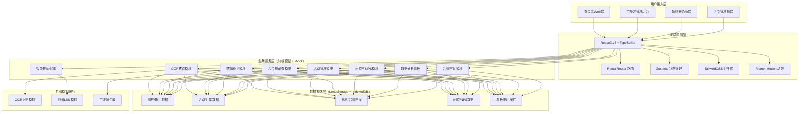
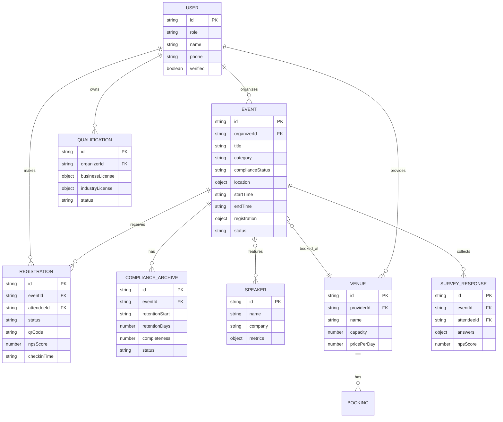

## 1. 架构设计



## 2. 技术说明

- **前端框架**：React@18 + TypeScript + Vite@5
- **状态管理**：Zustand（轻量，跨组件共享活动/用户/看板状态）
- **路由方案**：React Router DOM@6（嵌套路由 + 角色权限守卫）
- **样式方案**：TailwindCSS@3 + CSS变量（设计系统主题）
- **图表可视化**：Recharts（ROI漏斗/趋势线）+ D3（讲师力导向图谱）
- **动效方案**：Framer Motion（页面切换/卡片浮起/图谱节点）
- **二维码**：qrcode.react（电子票生成）
- **Mock方案**：MSW（Service Worker拦截请求）+ 静态JSON fixture
- **数据持久化**：IndexedDB（大容量档案）+ LocalStorage（会话/偏好）
- **后端模拟**：纯前端架构，通过Mock Service Worker模拟所有API响应
- **代码规范**：ESLint + Prettier + TypeScript Strict

## 3. 路由定义

| 路由路径 | 页面用途 | 访问角色 |
|----------|----------|----------|
| `/login` | 登录注册 + 角色选择 | 未登录用户 |
| `/verify` | 主办方资质OCR核验 | 主办方 |
| `/dashboard` | 主办方工作台总览 | 主办方 |
| `/events/create` | 创建活动（多步骤） | 主办方 |
| `/events/:id` | 活动详情（编辑/预览） | 主办方/参会者 |
| `/events/:id/settings` | 报名规则/付费/直播设置 | 主办方 |
| `/events/:id/checkin` | 扫码核销管理 | 主办方 |
| `/events/:id/survey` | 问卷管理与NPS报告 | 主办方 |
| `/analytics/roi` | ROI数据看板 | 主办方/管理员 |
| `/analytics/influencers` | 讲师影响力图谱 | 主办方/管理员 |
| `/analytics/trends` | 行业热词趋势监测 | 管理员 |
| `/compliance/archive` | 合规档案留存管理 | 管理员 |
| `/home` | 参会者首页（LBS推荐） | 参会者 |
| `/discover` | 活动发现（标签筛选） | 参会者 |
| `/my-tickets` | 我的电子票包 | 参会者 |
| `/venues` | 场地服务商首页 | 服务商 |
| `/venues/manage` | 场地档期与订单管理 | 服务商 |
| `/admin` | 平台管理员首页 | 管理员 |

## 4. API 定义（Mock TypeScript 接口）

```typescript
// 用户与角色
interface User {
  id: string;
  role: 'organizer' | 'attendee' | 'venue' | 'admin';
  name: string;
  phone: string;
  avatar?: string;
  verified: boolean;
  createdAt: string;
}

// 主办方资质
interface Qualification {
  organizerId: string;
  businessLicense: {
    imageUrl: string;
    ocrResult: OcrBusinessLicense;
    status: 'pending' | 'approved' | 'rejected';
  };
  industryLicense: {
    imageUrl: string;
    ocrResult: OcrIndustryLicense;
    status: 'pending' | 'approved' | 'rejected';
  };
  reviewNote?: string;
  verifiedAt?: string;
}

interface OcrBusinessLicense {
  companyName: string;
  creditCode: string;
  legalPerson: string;
  registeredCapital: string;
  establishmentDate: string;
  businessScope: string;
  confidence: number;
}

// 活动
interface Event {
  id: string;
  organizerId: string;
  title: string;
  description: string;
  coverImage: string;
  category: 'tech' | 'finance' | 'medical' | 'culture' | 'other';
  tags: string[];
  complianceStatus: 'pending' | 'passed' | 'blocked' | 'filed';
  complianceFlags: string[];
  location: {
    address: string;
    lat: number;
    lng: number;
    venueId?: string;
  };
  startTime: string;
  endTime: string;
  registration: {
    mode: 'open' | 'review' | 'paid';
    capacity: number;
    price?: number;
    tieredPrices?: { name: string; price: number; quota: number }[];
    requireApproval: boolean;
    livestreamEnabled: boolean;
    livestreamWhitelist: string[];
  };
  speakers: Speaker[];
  status: 'draft' | 'published' | 'ongoing' | 'ended' | 'archived';
  statistics: EventStats;
  createdAt: string;
}

interface EventStats {
  views: number;
  registrations: number;
  approvals: number;
  checkins: number;
  completionRate: number;
  leadsCount: number;
  revenue: number;
  npsScore: number;
}

// 报名记录
interface Registration {
  id: string;
  eventId: string;
  attendeeId: string;
  ticketTier?: string;
  status: 'pending_review' | 'approved' | 'rejected' | 'paid' | 'refunded' | 'checked_in';
  checkinTime?: string;
  qrCode: string;
  questionnaireData?: Record<string, any>;
  npsScore?: number;
  createdAt: string;
}

// 讲师
interface Speaker {
  id: string;
  name: string;
  title: string;
  avatar: string;
  company: string;
  bio: string;
  socialLinks: { platform: string; url: string }[];
  metrics: {
    totalSessions: number;
    avgRating: number;
    repurchaseRate: number;
  };
}

// 场地
interface Venue {
  id: string;
  providerId: string;
  name: string;
  address: string;
  lat: number;
  lng: number;
  capacity: number;
  images: string[];
  pricePerDay: number;
  calendar: { date: string; available: boolean }[];
  rating: number;
}

// 合规档案
interface ComplianceArchive {
  id: string;
  eventId: string;
  retentionStart: string;
  retentionDays: number;
  retentionEnd: string;
  dataHash: string;
  auditLogs: AuditLog[];
  completeness: number;
  status: 'retaining' | 'expiring_soon' | 'expired';
}

interface AuditLog {
  timestamp: string;
  action: string;
  operatorId: string;
  detail: string;
}

// 看板数据
interface ROIDashboard {
  timeRange: { start: string; end: string };
  kpis: {
    totalEvents: number;
    totalRegistrations: number;
    avgConversionRate: number;
    avgCompletionRate: number;
    totalLeads: number;
    totalRevenue: number;
    avgCac: number;
    totalNps: number;
  };
  conversionFunnel: { stage: string; value: number; rate: number }[];
  completionTrend: { date: string; rate: number }[];
  leadsBreakdown: { source: string; count: number }[];
}

interface TrendData {
  words: { word: string; count: number; trend: number; category: string }[];
  timeline: { date: string; [category: string]: number }[];
  hotCategories: { name: string; value: number; delta: number }[];
}
```

## 5. 前端分层架构

```mermaid
graph TD
    subgraph "页面层 Pages"
        P1["登录注册页"]
        P2["主办方工作台"]
        P3["活动创建/详情页"]
        P4["核销管理页"]
        P5["ROI看板页"]
        P6["讲师图谱页"]
        P7["热词趋势页"]
        P8["合规档案页"]
        P9["参会者首页"]
        P10["场地管理页"]
    end

    subgraph "组件层 Components"
        C1["角色选择卡片"]
        C2["OCR上传组件"]
        C3["多步骤表单"]
        C4["合规检查清单"]
        C5["KPI数据卡片"]
        C6["报名审核开关组"]
        C7["扫码框组件"]
        C8["活动气泡地图"]
        C9["力导向图谱"]
        C10["热词云组件"]
        C11["留存进度条"]
        C12["电子票二维码"]
    end

    subgraph "业务Hooks层"
        H1["useAuth 权限守卫"]
        H2["useOCR 识别流程"]
        H3["useCompliance 合规审查"]
        H4["useRecommend 推荐排序"]
        H5["useCheckin 核销逻辑"]
        H6["useNPS 问卷计算"]
        H7["useAnalytics 看板聚合"]
    end

    subgraph "数据层 Store / API"
        S1["Zustand: UserStore"]
        S2["Zustand: EventStore"]
        S3["Zustand: AnalyticsStore"]
        S4["Zustand: ComplianceStore"]
        A1["MSW Mock API Handlers"]
        A2["IndexedDB 档案层"]
    end

    P1 & P2 & P3 & P4 & P5 & P6 & P7 & P8 & P9 & P10 --> C1 & C2 & C3 & C4 & C5 & C6 & C7 & C8 & C9 & C10 & C11 & C12
    C1 & C2 & C3 & C4 & C5 & C6 & C7 & C8 & C9 & C10 & C11 & C12 --> H1 & H2 & H3 & H4 & H5 & H6 & H7
    H1 & H2 & H3 & H4 & H5 & H6 & H7 --> S1 & S2 & S3 & S4
    S1 & S2 & S3 & S4 --> A1 & A2
```



## 6. 数据模型

### 6.1 ER 图



### 6.2 Mock 种子数据要点

- **主办方**：3家（科技峰会、医疗论坛、金融沙龙各1），其中1家资质待审核
- **参会者**：15名，覆盖不同兴趣标签（AIGC/Web3/医疗AI/金融科技）
- **活动**：12场（覆盖tech/medical/finance/culture，含3场历史、6场在办、3场草稿）
- **讲师**：8位（其中3位跨多场活动，用于影响力图谱）
- **场地**：5处（含大型会议厅、沙龙空间、报告厅）
- **报名记录**：每条活动15-80条，含审核通过/待审核/已核销/已填问卷多状态
- **合规档案**：已结束活动全量归档，保留到期日梯度分布（60/120/180天）
- **热词数据**：AIGC大语言模型/Web3区块链/医疗大模型/数字人民币等15个标签，6个月月度数据
