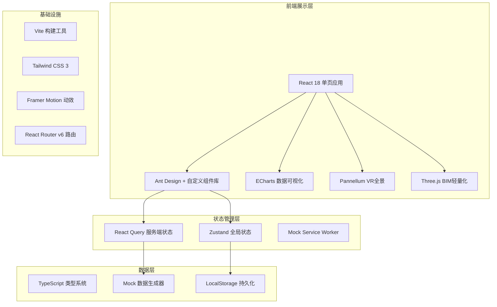
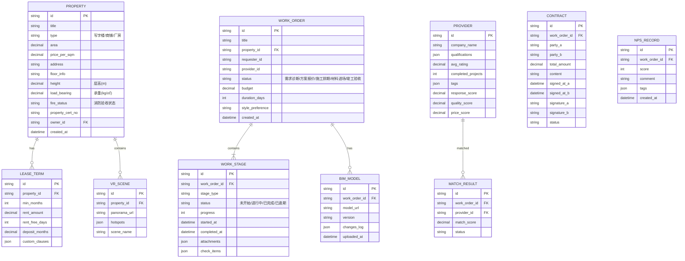

## 1. 架构设计



## 2. 技术说明

- **前端框架**：React 18.2 + TypeScript 5.0
- **构建工具**：Vite 5.0（极速热更新 + 按需编译）
- **样式方案**：Tailwind CSS 3.4 + CSS Variables 主题系统
- **UI组件库**：Ant Design 5.12 + 业务定制组件
- **路由方案**：React Router v6（嵌套路由 + 懒加载）
- **状态管理**：Zustand 4.4（轻量全局状态）+ React Query 5.12（异步状态缓存）
- **数据可视化**：ECharts 5.4（图表）+ 纯CSS进度组件
- **VR全景**：Pannellum 2.5（开源全景查看器 + 热点标记）
- **BIM模型**：Three.js r160 + GLTFLoader（轻量化模型渲染）
- **动效库**：Framer Motion 10.16（页面过渡 + 微交互）
- **表单方案**：React Hook Form + Zod 校验
- **模拟数据**：Mock Service Worker + Faker.js
- **代码规范**：ESLint + Prettier + Husky + lint-staged

## 3. 路由定义

| 路由路径 | 页面名称 | 核心功能 |
|----------|----------|----------|
| `/` | 首页仪表盘 | 数据概览、KPI卡片、趋势图表、快捷操作 |
| `/properties` | 房源列表 | 多维度筛选、房源卡片网格、VR标识展示 |
| `/properties/:id` | 房源详情 | VR全景查看、产权信息、租赁条款配置 |
| `/properties/new` | 发布房源 | VR上传、产权表单录入、条款模板选择 |
| `/workorders` | 工单列表 | 全状态工单、时间线进度、筛选搜索 |
| `/workorders/:id` | 工单详情 | 5大节点跟踪、BIM模型、变更留痕、材料进场 |
| `/workorders/new` | 发起工单 | 需求诊断问卷、参数录入、风格选择 |
| `/matching` | 智能匹配 | 需求参数配置、匹配结果列表、匹配度评分 |
| `/negotiation/:id` | 在线议价 | 报价轨迹、还价消息、达成共识 |
| `/contract/:id` | 合同签署 | 合同预览、手写签名、电子证书、时间戳 |
| `/admin/dashboard` | POS服务看板 | 耗时统计热力图、NPS仪表盘、供应商评分雷达 |
| `/admin/providers` | 供应商管理 | 供应商列表、评级历史、资质审核 |

## 4. 数据模型

### 4.1 ER图



### 4.2 核心类型定义

```typescript
// 房源相关
type PropertyType = 'office' | 'shop' | 'factory';
type FireStatus = 'passed' | 'pending' | 'not_required';

interface Property {
  id: string;
  title: string;
  type: PropertyType;
  area: number;
  pricePerSqm: number;
  address: string;
  floorInfo: string;
  height: number;
  loadBearing: number;
  fireStatus: FireStatus;
  propertyCertNo: string;
  ownerId: string;
  coverImage: string;
  hasVR: boolean;
  createdAt: string;
}

// 工单相关
type WorkOrderStage = 'diagnosis' | 'quotation' | 'schedule' | 'material' | 'acceptance';
type StageStatus = 'pending' | 'in_progress' | 'completed' | 'delayed';

interface WorkOrder {
  id: string;
  title: string;
  propertyId: string;
  requesterId: string;
  providerId: string;
  currentStage: WorkOrderStage;
  budget: number;
  durationDays: number;
  stylePreference: string[];
  stages: WorkStage[];
  createdAt: string;
}

interface WorkStage {
  id: string;
  type: WorkOrderStage;
  status: StageStatus;
  progress: number;
  startedAt?: string;
  completedAt?: string;
  assignee: string;
  checkItems: CheckItem[];
  attachments: Attachment[];
}

// 匹配&供应商
interface Provider {
  id: string;
  companyName: string;
  qualifications: string[];
  avgRating: number;
  completedProjects: number;
  tags: string[];
  qualityScore: number;
  responseScore: number;
  priceScore: number;
  logo: string;
}

interface MatchResult {
  id: string;
  provider: Provider;
  matchScore: number;
  dimensions: {
    area: number;
    budget: number;
    duration: number;
    style: number;
  };
}
```

## 5. 目录结构

```
src/
├── assets/              # 静态资源
│   ├── images/
│   ├── fonts/
│   └── styles/
├── components/          # 通用组件
│   ├── layout/          # 布局组件（Sidebar、Header、Breadcrumb）
│   ├── charts/          # 图表组件
│   ├── vr/              # VR全景组件
│   ├── bim/             # BIM模型组件
│   └── common/          # 通用业务组件
├── pages/               # 页面组件
│   ├── Dashboard/
│   ├── Properties/
│   ├── WorkOrders/
│   ├── Matching/
│   ├── Negotiation/
│   ├── Contract/
│   └── Admin/
├── store/               # Zustand状态
├── hooks/               # 自定义Hooks
├── services/            # API服务层
├── mock/                # Mock数据
├── types/               # TS类型定义
├── utils/               # 工具函数
├── router/              # 路由配置
└── App.tsx
```
