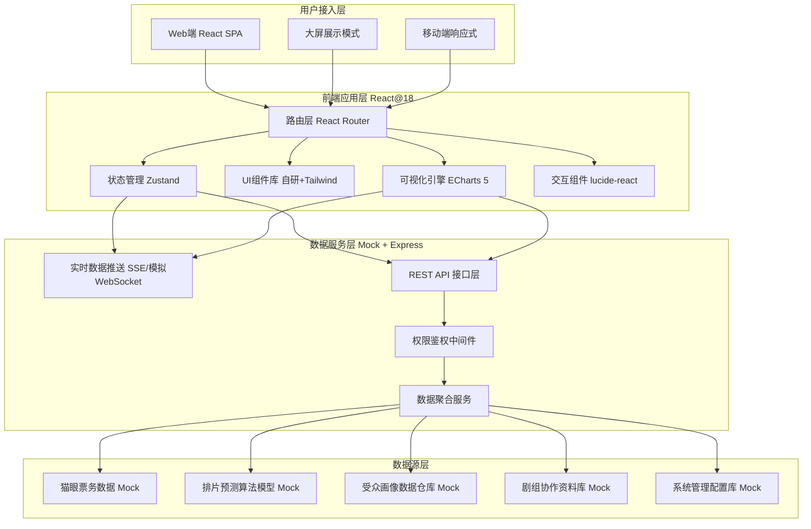
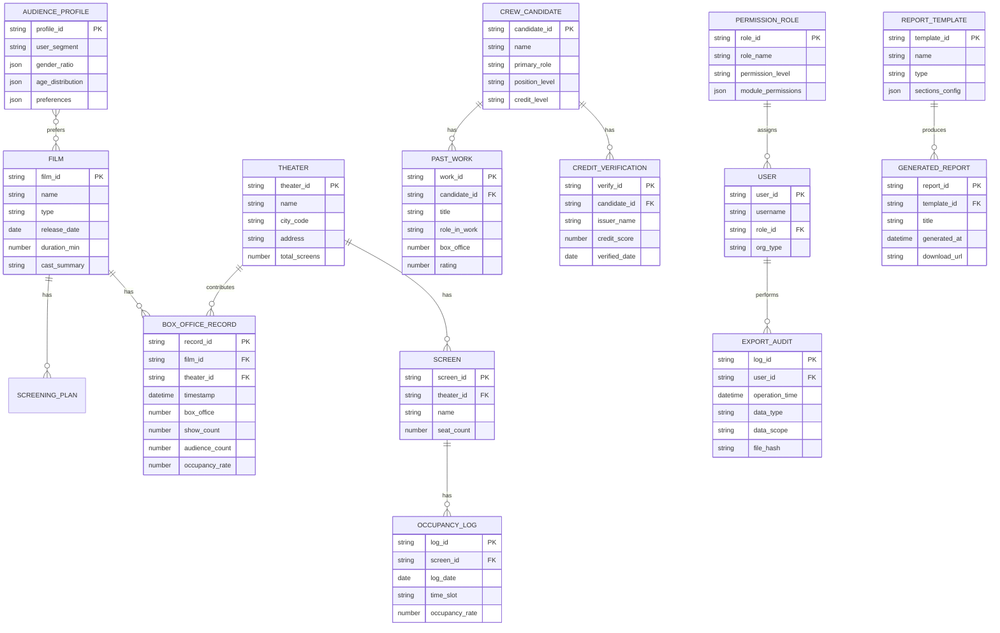

## 1. 架构设计



## 2. 技术说明

- **前端框架**：React@18 + TypeScript@5 + Vite@5
- **路由管理**：react-router-dom@6（静态路由配置+懒加载）
- **状态管理**：zustand@4（轻量全局状态，按领域拆分store）
- **UI样式**：tailwindcss@3 + 自定义设计令牌（CSS Variables）
- **图表可视化**：echarts@5 + echarts-for-react（地图、热力图、桑基图、雷达图等）
- **图标系统**：lucide-react@latest（统一线性图标库）
- **后端服务**：Express@4 + TypeScript（Mock数据服务、模拟API接口）
- **数据方案**：Mock数据服务（本地JSON + 算法模拟生成），无需真实数据库
- **实时通信**：Server-Sent Events（SSE）模拟秒级票房数据推送
- **构建工具**：Vite@5（快速冷启动+HMR热更新）

## 3. 路由定义

| 路由路径 | 页面名称 | 权限要求 | 模块说明 |
|----------|----------|----------|----------|
| `/` | 数据大屏Dashboard | 登录用户 | 实时票房总览、KPI矩阵、趋势图、榜单 |
| `/screening` | 排片预测中心 | 发行/制片方 | 档期热度、竞品对比、排片模拟、收益预测 |
| `/heatmap` | 上座率热力图 | 院线/发行方 | 全国地图、影院下钻、影厅时段矩阵 |
| `/audience` | 受众分析中心 | 制片/发行方 | 多维筛选、画像雷达、人群迁移桑基图 |
| `/crew` | 剧组协作中心 | 全角色 | 匹配矩阵、可信认证、加密协商通道 |
| `/admin` | 后台管理首页 | 管理员 | 数据总览、快捷入口、系统状态 |
| `/admin/permissions` | 权限分级管理 | 管理员 | 三级权限配置、角色矩阵、API密钥 |
| `/admin/audit` | 导出审计日志 | 管理员 | 操作追溯、筛选搜索、时间轴视图 |
| `/admin/reports` | 报告生成中心 | 管理员 | 模板配置、自动化任务、报告预览下载 |
| `/login` | 登录认证页 | 公开 | 企业/个人/管理员三种登录入口 |

## 4. API 定义

```typescript
// ============ 通用响应类型 ============
interface ApiResponse<T> {
  code: number;
  message: string;
  data: T;
  timestamp: number;
}

// ============ 票房数据接口 ============

// GET /api/boxoffice/realtime
interface RealtimeBoxOffice {
  totalBoxOffice: number;        // 当日实时票房（万元）
  totalShowCount: number;        // 当日总场次
  totalAudience: number;         // 当日观影人次
  avgOccupancy: number;          // 平均上座率（%）
  avgTicketPrice: number;        // 平均票价（元）
  perShowAudience: number;       // 场均人次
  updateTime: string;            // 数据更新时间
  boxOfficeChange: number;       // 环比变化（%）
}

// GET /api/boxoffice/trend?period=24h
interface TrendPoint {
  time: string;                  // 时间点 HH:mm
  boxOffice: number;             // 票房
  samePeriodLastYear: number;    // 影史同期
  samePeriodLastMonth: number;   // 上月同期
}
type BoxOfficeTrend = TrendPoint[];

// GET /api/boxoffice/ranking?limit=10
interface FilmRankItem {
  rank: number;
  filmId: string;
  filmName: string;
  poster: string;
  boxOffice: number;             // 当日票房
  totalBoxOffice: number;        // 累计票房
  boxOfficeRatio: number;        // 票房占比（%）
  showCountRatio: number;        // 排片占比（%）
  occupancy: number;             // 上座率（%）
  changeIndicator: 'up' | 'down' | 'flat';
  changeValue: number;           // 排名变化值
}

// ============ 排片预测接口 ============

// POST /api/prediction/schedule
interface SchedulePredictionReq {
  filmId: string;
  schedulePlan: {
    theaterId: string;
    screenCount: number;
    showTimes: string[];
  }[];
  startDate: string;
  endDate: string;
}

interface SchedulePredictionRes {
  expectedTotalBoxOffice: number;    // 预测总票房
  confidenceInterval: [number, number]; // 置信区间
  perTheaterPrediction: {
    theaterId: string;
    theaterName: string;
    expectedBoxOffice: number;
    expectedOccupancy: number;
    suggestion: string;
  }[];
}

// GET /api/prediction/competitor?date=2026-06-20
interface CompetitorInfo {
  filmId: string;
  filmName: string;
  type: string;                     // 类型
  castLevel: 'S' | 'A' | 'B' | 'C';  // 阵容级别
  marketingBudget: number;           // 宣发投入指数
  expectedOpening: number;           // 预期首周票房
  radarScores: {
    story: number;       // 剧本
    cast: number;        // 阵容
    marketing: number;   // 宣发
    schedule: number;    // 档期
    wordOfMouth: number; // 口碑预期
  };
}

// ============ 上座率热力图接口 ============

// GET /api/heatmap/cities
interface CityHeatmapItem {
  cityCode: string;
  cityName: string;
  province: string;
  occupancy: number;          // 上座率
  boxOffice: number;          // 票房贡献
  lat: number;
  lng: number;
}

// GET /api/heatmap/theaters?cityCode=110000
interface TheaterHeatmapItem {
  theaterId: string;
  theaterName: string;
  address: string;
  totalScreens: number;
  avgOccupancy: number;
  totalBoxOffice: number;
  rankInCity: number;
  hourlyOccupancy: Record<string, number>;  // 每小时上座率
}

// GET /api/heatmap/screen?theaterId=T001
interface ScreenHeatmap {
  screenId: string;
  screenName: string;
  seatCount: number;
  timeMatrix: {
    timeSlot: string;        // 时段 如 "10:00-12:00"
    weekdayOccupancy: number;
    weekendOccupancy: number;
  }[];
  goldenShows: string[];     // 黄金场次
}

// ============ 受众分析接口 ============

// POST /api/audience/filter
interface AudienceFilterReq {
  gender?: ('male' | 'female')[];
  ageRange?: [number, number];
  regions?: string[];
  frequency?: ('low' | 'medium' | 'high' | 'extreme')[];
  preferredTypes?: string[];
}

interface AudienceProfile {
  totalUsers: number;
  genderRatio: { male: number; female: number };
  ageDistribution: { range: string; ratio: number }[];
  regionTop10: { region: string; ratio: number }[];
  frequencyDistribution: { level: string; ratio: number; avgTimes: number }[];
  preferredTypes: { type: string; score: number }[];
  radarProfile: {
    consumption: number;    // 消费力
    frequency: number;      // 频次
    diversity: number;      // 偏好广度
    social: number;         // 社交度
    loyalty: number;        // 忠诚度
    decisionCycle: number;  // 决策周期
  };
}

// GET /api/audience/migration?filmIds=A,B,C
interface MigrationNode {
  id: string;
  name: string;
  value: number;            // 人群规模
  category: 'source' | 'target';
}
interface MigrationLink {
  source: string;
  target: string;
  value: number;            // 迁移人数
  overlapRatio: number;     // 重叠度
}
interface AudienceMigration {
  nodes: MigrationNode[];
  links: MigrationLink[];
}

// ============ 剧组协作接口 ============

// GET /api/crew/match?role=导演&schedule=2026Q3
interface MatchMatrixItem {
  candidateId: string;
  candidateName: string;
  avatar: string;
  role: string;
  position: string;
  matchScore: number;       // 综合匹配度 0-100
  dimensionScores: {
    roleFit: number;        // 角色适配
    positionFit: number;    // 职位匹配
    scheduleFit: number;    // 档期合适
    creditLevel: number;    // 资信等级
  };
  credits: string[];        // 代表作品
  verifiedBadges: string[]; // 认证徽章
}

// GET /api/crew/certificate?candidateId=C001
interface CertificateInfo {
  candidateId: string;
  realNameVerified: boolean;
  issuerVerifications: {
    issuerName: string;
    issuerLogo: string;
    cooperationCount: number;
    creditScore: number;
    verifiedDate: string;
  }[];
  pastWorks: {
    title: string;
    role: string;
    releaseYear: number;
    boxOffice: number;
    rating: number;
  }[];
  overallCreditLevel: 'AAA' | 'AA' | 'A' | 'BBB';
}

// ============ 后台管理接口 ============

// GET /api/admin/permissions
interface PermissionLevel {
  level: 'public' | 'subscription' | 'custom';
  name: string;
  description: string;
  modules: string[];
  apiQuota: string;
  exportLimit: string;
  price: string;
}
interface RolePermission {
  roleId: string;
  roleName: string;
  permissionLevel: string;
  customPermissions: Record<string, boolean>;
}

// GET /api/admin/audit/export
interface ExportAuditLog {
  logId: string;
  userId: string;
  userName: string;
  userRole: string;
  operationTime: string;
  dataType: string;
  dataScope: string;
  purpose: string;
  format: 'Excel' | 'PDF' | 'CSV' | 'API';
  status: 'approved' | 'pending' | 'rejected';
  fileHash: string;
}

// POST /api/admin/reports/generate
interface ReportGenerateReq {
  reportType: 'weekly' | 'monthly' | 'special';
  templateId: string;
  period: { start: string; end: string };
  deliveryMethod: ('email' | 'download' | 'sms')[];
  recipients: string[];
}
interface ReportInfo {
  reportId: string;
  reportType: string;
  title: string;
  generatedAt: string;
  downloadUrl: string;
  status: 'generating' | 'ready' | 'failed';
  fileSize: string;
}

// ============ Webhook 管道监控 ============

// GET /api/pipeline/status
interface PipelineStatus {
  webhookName: string;
  source: string;               // 来源：猫眼/淘票票等
  status: 'online' | 'offline' | 'degraded';
  latencyMs: number;            // 延迟（毫秒）
  eventsPerSecond: number;      // 吞吐（事件/秒）
  lastEventTime: string;
  errorCount24h: number;
}
```

## 5. 数据模型

### 6.1 数据模型定义



### 6.2 Mock数据说明

由于项目使用Mock数据服务，所有数据接口将通过Express后端基于以下策略生成模拟数据：

1. **票房数据**：使用正弦函数+随机扰动模拟24小时分时曲线，工作日/周末差异系数，节日档期放大系数
2. **排片预测**：基于历史均值+正态分布随机数生成置信区间，按维度加权计算匹配分数
3. **热力图数据**：按城市GDP/人口规模加权生成上座率，影厅按时段黄金时段配置高上座率区间
4. **受众画像**：基于Beta分布生成年龄/性别/频次分布数据，偏好类型按电影真实受众比例配置
5. **剧组匹配**：使用加权算法（角色权重0.3+职位权重0.25+档期权重0.25+资信权重0.2）生成匹配度分数
