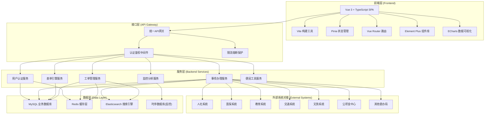

## 1. 架构设计



## 2. 技术选型

- **前端框架**：Vue 3 + TypeScript + Composition API
- **构建工具**：Vite 5.x
- **路由管理**：Vue Router 4.x
- **状态管理**：Pinia 2.x
- **UI组件库**：Element Plus（政务风格定制主题）
- **数据可视化**：ECharts 5.x + Vue-ECharts
- **HTTP客户端**：Axios（统一封装请求拦截、错误处理）
- **表单引擎**：基于 JSON Schema 的动态表单渲染器
- **工具库**：Lodash、Day.js、Numeral.js
- **Mock数据**：MSW (Mock Service Worker)
- **代码规范**：ESLint + Prettier + Husky + lint-staged
- **CSS方案**：TailwindCSS 3.x + SCSS 变量
- **数据存储**：Mock数据 + LocalStorage模拟持久化

## 3. 路由定义

### 3.1 前台市民端

| 路由路径 | 页面名称 | 权限要求 | 说明 |
|----------|----------|----------|------|
| /login | 统一登录页 | 公开 | 多种登录方式 |
| / | 门户首页 | 公开 | 城市概览、快捷服务 |
| /services | 服务大厅 | 公开 | 服务分类、搜索 |
| /services/:id | 服务详情 | 公开 | 办事指南、材料清单 |
| /apply/:serviceId | 事项办理 | 已登录 | 表单填写、材料上传 |
| /my-applications | 我的办件 | 已登录 | 办件列表、进度追踪 |
| /profile | 个人中心 | 已登录 | 个人信息聚合视图 |
| /profile/licenses | 我的证照 | 已登录 | 电子证照管理 |
| /tools | 便民工具 | 公开 | 工具集首页 |
| /tools/calculator | 公积金计算器 | 公开 | 贷款/缴费计算 |
| /tools/violation | 违章查询 | 已登录 | 交通违章查询 |
| /tools/venue | 场馆预约 | 公开 | 文体场馆预约 |
| /tools/policy-match | 政策匹配 | 公开 | 智能政策匹配测试 |
| /complaints | 诉求中心 | 已登录 | 诉求提交与查询 |
| /complaints/new | 提交诉求 | 已登录 | 诉求表单 |

### 3.2 后台管理端

| 路由路径 | 页面名称 | 角色要求 | 说明 |
|----------|----------|----------|------|
| /admin | 管理驾驶舱 | 管理员 | 效能总览、实时监控 |
| /admin/services | 事项管理 | 委办局/平台管理员 | 事项配置、步骤拆解 |
| /admin/services/:id/steps | 办事步骤管理 | 委办局/平台管理员 | 颗粒度步骤管理 |
| /admin/forms | 表单引擎管理 | 平台管理员 | 表单模板配置 |
| /admin/monitor | 服务健康监控 | 平台管理员 | 接口监控、告警管理 |
| /admin/tickets | 工单管理 | 委办局/平台管理员 | 工单分拨、处理 |
| /admin/evaluations | 评价管理 | 平台管理员 | 满意度统计、整改跟踪 |
| /admin/reports | 效能报告 | 平台管理员 | 月度报告生成与导出 |
| /admin/users | 用户管理 | 平台管理员 | 用户、角色、权限管理 |

## 4. 核心数据结构（TypeScript类型定义）

```typescript
// 用户相关
interface User {
  id: string;
  realName: string;
  idCard: string;
  phone: string;
  avatar?: string;
  authLevel: 'L1' | 'L2' | 'L3'; // 实名认证等级
  userType: 'citizen' | 'enterprise' | 'admin';
  department?: string;
  roles: string[];
}

// 聚合个人数据
interface PersonalProfile {
  basicInfo: User;
  socialInsurance: {
    status: 'normal' | 'paused' | 'terminated';
    months: number;
    monthlyAmount: number;
    totalAmount: number;
    records: InsuranceRecord[];
  };
  medicalInsurance: {
    status: 'normal' | 'paused';
    personalBalance: number;
    overallBalance: number;
    reimbursementRecords: ReimbursementRecord[];
  };
  education: {
    studentStatus: 'in_school' | 'graduated' | 'suspended';
    school: string;
    major: string;
    grade: string;
    enrollmentDate: string;
  };
  housingFund: {
    balance: number;
    monthlyDeposit: number;
    depositMonths: number;
    lastDepositDate: string;
  };
}

// 服务事项
interface ServiceItem {
  id: string;
  name: string;
  department: string;
  departmentId: string;
  category: string;
  subCategory: string;
  description: string;
  serviceType: 'online' | 'offline' | 'hybrid';
  handlingTime: string;
  fee: string;
  popularity: number;
  satisfaction: number;
  totalApplications: number;
  guide: ServiceGuide;
  steps: ServiceStep[];
  formSchema: FormSchema;
  materials: MaterialItem[];
  isHot: boolean;
  isRecommended: boolean;
}

// 办事步骤（颗粒度管理）
interface ServiceStep {
  id: string;
  serviceId: string;
  stepNumber: number;
  title: string;
  description: string;
  estimatedTime: number; // 分钟
  responsibleRole: string;
  checkItems: string[];
  outputs: string[];
  isEditable: boolean;
}

// 办件
interface Application {
  id: string;
  serviceId: string;
  serviceName: string;
  applicantId: string;
  applicantName: string;
  status: 'draft' | 'submitted' | 'accepting' | 'reviewing' | 'supplement' | 'approved' | 'rejected' | 'completed';
  currentStep: number;
  formData: Record<string, any>;
  materials: UploadedMaterial[];
  submittedAt: string;
  acceptAt?: string;
  completedAt?: string;
  timeline: ApplicationTimelineItem[];
  result?: ApplicationResult;
}

// 工单
interface Ticket {
  id: string;
  title: string;
  category: string;
  content: string;
  images?: string[];
  location?: string;
  reporterId: string;
  reporterName: string;
  anonymous: boolean;
  departmentId: string;
  departmentName: string;
  assigneeId?: string;
  assigneeName?: string;
  status: 'pending' | 'assigned' | 'processing' | 'replied' | 'closed';
  slaDeadline: string;
  createdAt: string;
  priority: 'low' | 'medium' | 'high' | 'urgent';
  replies: TicketReply[];
  evaluation?: TicketEvaluation;
}

// 评价
interface Evaluation {
  id: string;
  applicationId?: string;
  ticketId?: string;
  type: 'application' | 'ticket';
  rating: 1 | 2 | 3 | 4 | 5;
  tags: string[];
  content: string;
  createdAt: string;
  isRectified?: boolean;
  rectification?: RectificationRecord;
}

// 服务监控指标
interface ServiceMonitor {
  serviceName: string;
  systemName: string;
  availability: number; // 百分比
  avgResponseTime: number; // ms
  errorRate: number; // 百分比
  requestsToday: number;
  status: 'healthy' | 'warning' | 'critical' | 'offline';
  lastCheckTime: string;
  alerts: AlertRecord[];
}

// 月度效能报告
interface MonthlyReport {
  id: string;
  year: number;
  month: number;
  summary: ReportSummary;
  departmentRankings: DepartmentRanking[];
  serviceAnalysis: ServiceAnalysis[];
  complaintAnalysis: ComplaintAnalysis;
  satisfactionTrend: SatisfactionTrend[];
  suggestions: string[];
  generatedAt: string;
  status: 'draft' | 'published';
}
```

## 5. 前端项目结构

```
src/
├── assets/              # 静态资源
│   ├── images/          # 图片
│   ├── icons/           # 图标
│   └── styles/          # 全局样式
├── components/          # 通用组件
│   ├── common/          # 基础组件（按钮、卡片等）
│   ├── business/        # 业务组件（服务卡片、进度条等）
│   ├── charts/          # 图表组件
│   └── form-engine/     # 表单引擎组件
├── layouts/             # 布局组件
│   ├── FrontendLayout.vue
│   ├── AdminLayout.vue
│   └── components/      # 布局子组件（Header、Sidebar等）
├── views/               # 页面视图
│   ├── auth/            # 登录认证
│   ├── home/            # 门户首页
│   ├── services/        # 服务大厅
│   ├── apply/           # 事项办理
│   ├── profile/         # 个人中心
│   ├── tools/           # 便民工具
│   ├── complaints/      # 诉求中心
│   └── admin/           # 后台管理
├── router/              # 路由配置
├── stores/              # Pinia状态管理
│   ├── user.ts
│   ├── application.ts
│   └── admin.ts
├── api/                 # API接口封装
│   ├── request.ts       # Axios封装
│   ├── user.ts
│   ├── services.ts
│   ├── application.ts
│   ├── tickets.ts
│   └── admin.ts
├── mock/                # Mock数据
│   ├── handlers.ts
│   ├── data/
│   └── browser.ts
├── utils/               # 工具函数
│   ├── auth.ts
│   ├── storage.ts
│   ├── format.ts
│   └── validator.ts
├── types/               # TypeScript类型定义
│   ├── index.ts
│   ├── user.ts
│   ├── service.ts
│   └── admin.ts
├── composables/         # 组合式函数
│   ├── usePagination.ts
│   ├── useFormEngine.ts
│   └── useChart.ts
├── App.vue
└── main.ts
```

## 6. 关键技术实现方案

### 6.1 统一认证与单点登录
- 基于 Token (JWT) 的认证机制
- 刷新 Token 自动续期
- 第三方系统 SSO 对接模拟
- 多因素认证（短信验证码、人脸识别模拟）

### 6.2 电子表单引擎
- JSON Schema 驱动的动态表单渲染
- 支持表单分组、条件显示、联动计算
- 材料上传组件（支持拖拽、预览、格式校验）
- 智能预填：根据用户数据自动填充表单字段

### 6.3 数据可视化大屏
- ECharts 封装多种图表组件
- 实时数据更新与动画过渡
- 响应式布局适配不同屏幕
- 深色主题监控大屏

### 6.4 工单智能分拨
- 基于关键词匹配的自动分类算法
- 部门路由规则配置
- SLA 倒计时与超时预警
- 工单流转时间轴展示

### 6.5 效能分析报告
- 多维度数据统计与聚合
- 趋势分析图表（折线图、柱状图、雷达图）
- 部门排名与对比
- 报告导出功能（PDF格式模拟）
