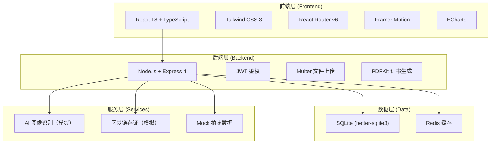
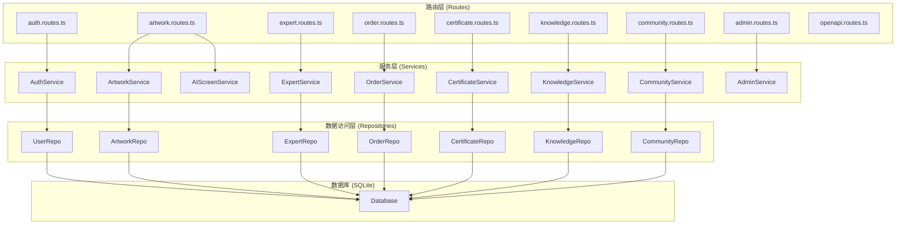
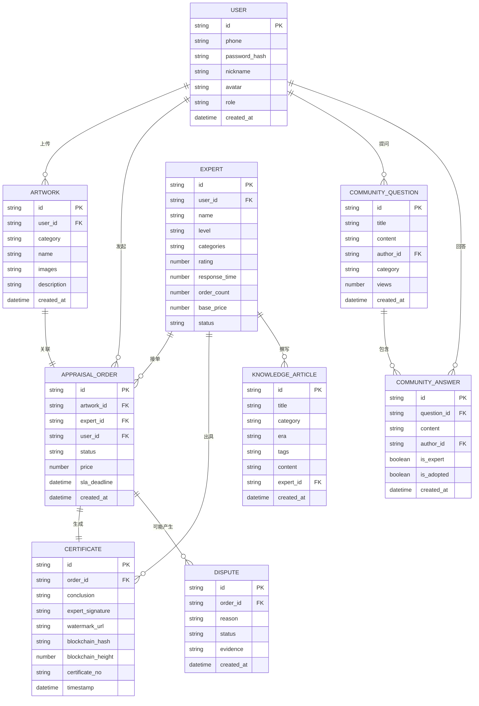

## 1. 架构设计



## 2. 技术选型

- **前端框架**: React@18 + TypeScript + Vite
- **UI框架**: Tailwind CSS@3
- **路由**: React Router v6
- **状态管理**: Zustand
- **动画**: Framer Motion
- **图表**: ECharts
- **后端**: Express@4
- **数据库**: SQLite (better-sqlite3)
- **认证**: JWT (jsonwebtoken)
- **文件上传**: Multer
- **PDF生成**: PDFKit
- **HTTP客户端**: Axios
- **图标**: Lucide React
- **初始化工具**: create-vite

## 3. 路由定义

| 路由 | 用途 |
|------|------|
| / | 首页（平台介绍、快速入口） |
| /appraise | 藏品鉴定（上传+AI初筛+专家竞价） |
| /certificate/:id | 鉴定证书展示 |
| /knowledge | 行家知识库列表 |
| /knowledge/:id | 知识库文章详情 |
| /valuation | 藏品价值评估 |
| /community | 社区问答 |
| /community/:id | 问题详情 |
| /user/profile | 用户中心-个人中心 |
| /user/orders | 用户中心-我的订单 |
| /user/collections | 用户中心-我的藏品 |
| /expert/dashboard | 专家工作台-数据概览 |
| /expert/tasks | 专家工作台-任务大厅 |
| /admin/dashboard | 管理后台-数据看板 |
| /admin/experts | 管理后台-专家认证 |
| /admin/disputes | 管理后台-纠纷仲裁 |
| /admin/templates | 管理后台-模板配置 |
| /openapi | API开放平台首页 |
| /login | 登录页 |
| /register | 注册页 |

## 4. API定义

```typescript
// 藏品相关接口
interface Artwork {
  id: string;
  userId: string;
  category: string;
  name: string;
  images: string[];
  description: string;
  createdAt: string;
}

// AI初筛结果
interface AIScreenResult {
  category: string;
  categoryConfidence: number;
  era: string;
  eraConfidence: number;
  authenticity: 'genuine' | 'suspicious' | 'fake';
  authenticityConfidence: number;
  features: string[];
  suggestedExperts: string[];
}

// 专家信息
interface Expert {
  id: string;
  name: string;
  avatar: string;
  level: 'national' | 'provincial' | 'senior';
  categories: string[];
  rating: number;
  responseTime: number;
  orderCount: number;
  basePrice: number;
}

// 鉴定订单
interface AppraisalOrder {
  id: string;
  artworkId: string;
  expertId: string;
  userId: string;
  status: 'pending' | 'accepted' | 'appraising' | 'completed' | 'disputed';
  price: number;
  slaDeadline: string;
  createdAt: string;
}

// 鉴定证书
interface Certificate {
  id: string;
  orderId: string;
  conclusion: string;
  expertSignature: string;
  watermark: string;
  blockchainHash: string;
  blockchainHeight: number;
  timestamp: string;
  certificateNo: string;
}

// 知识库文章
interface KnowledgeArticle {
  id: string;
  title: string;
  category: string;
  era: string;
  tags: string[];
  content: string;
  author: string;
  createdAt: string;
}

// 社区问题
interface CommunityQuestion {
  id: string;
  title: string;
  content: string;
  authorId: string;
  category: string;
  answers: CommunityAnswer[];
  views: number;
  createdAt: string;
}

interface CommunityAnswer {
  id: string;
  content: string;
  authorId: string;
  isExpert: boolean;
  isAdopted: boolean;
  createdAt: string;
}

// API接口列表
// POST   /api/auth/login
// POST   /api/auth/register
// GET    /api/artworks
// POST   /api/artworks/upload
// POST   /api/ai/screen
// GET    /api/experts
// GET    /api/experts/:id
// POST   /api/orders
// GET    /api/orders
// GET    /api/orders/:id
// POST   /api/orders/:id/accept
// POST   /api/orders/:id/complete
// GET    /api/certificates/:id
// GET    /api/certificates/:id/verify
// GET    /api/knowledge
// GET    /api/knowledge/:id
// POST   /api/valuation/calculate
// GET    /api/community/questions
// POST   /api/community/questions
// POST   /api/community/questions/:id/answers
// GET    /api/admin/experts/pending
// POST   /api/admin/experts/:id/approve
// GET    /api/admin/disputes
// POST   /api/admin/disputes/:id/resolve
// GET    /api/admin/templates
// PUT   /api/admin/templates/:id
```

## 5. 服务端架构图



## 6. 数据模型

### 6.1 实体关系图



### 6.2 DDL语句

```sql
-- 用户表
CREATE TABLE users (
  id TEXT PRIMARY KEY,
  phone TEXT UNIQUE NOT NULL,
  password_hash TEXT NOT NULL,
  nickname TEXT,
  avatar TEXT,
  role TEXT DEFAULT 'user',
  created_at DATETIME DEFAULT CURRENT_TIMESTAMP
);

-- 专家表
CREATE TABLE experts (
  id TEXT PRIMARY KEY,
  user_id TEXT UNIQUE NOT NULL,
  name TEXT NOT NULL,
  avatar TEXT,
  level TEXT NOT NULL,
  categories TEXT NOT NULL,
  rating REAL DEFAULT 5.0,
  response_time INTEGER DEFAULT 15,
  order_count INTEGER DEFAULT 0,
  base_price REAL DEFAULT 200,
  status TEXT DEFAULT 'pending',
  FOREIGN KEY (user_id) REFERENCES users(id)
);

-- 藏品表
CREATE TABLE artworks (
  id TEXT PRIMARY KEY,
  user_id TEXT NOT NULL,
  category TEXT,
  name TEXT,
  images TEXT NOT NULL,
  description TEXT,
  created_at DATETIME DEFAULT CURRENT_TIMESTAMP,
  FOREIGN KEY (user_id) REFERENCES users(id)
);

-- 鉴定订单表
CREATE TABLE appraisal_orders (
  id TEXT PRIMARY KEY,
  artwork_id TEXT NOT NULL,
  expert_id TEXT NOT NULL,
  user_id TEXT NOT NULL,
  status TEXT DEFAULT 'pending',
  price REAL NOT NULL,
  sla_deadline DATETIME,
  created_at DATETIME DEFAULT CURRENT_TIMESTAMP,
  FOREIGN KEY (artwork_id) REFERENCES artworks(id),
  FOREIGN KEY (expert_id) REFERENCES experts(id),
  FOREIGN KEY (user_id) REFERENCES users(id)
);

-- 鉴定证书表
CREATE TABLE certificates (
  id TEXT PRIMARY KEY,
  order_id TEXT UNIQUE NOT NULL,
  conclusion TEXT NOT NULL,
  expert_signature TEXT,
  watermark_url TEXT,
  blockchain_hash TEXT,
  blockchain_height INTEGER,
  certificate_no TEXT UNIQUE,
  timestamp DATETIME DEFAULT CURRENT_TIMESTAMP,
  FOREIGN KEY (order_id) REFERENCES appraisal_orders(id)
);

-- 纠纷表
CREATE TABLE disputes (
  id TEXT PRIMARY KEY,
  order_id TEXT NOT NULL,
  reason TEXT NOT NULL,
  evidence TEXT,
  status TEXT DEFAULT 'pending',
  resolution TEXT,
  created_at DATETIME DEFAULT CURRENT_TIMESTAMP,
  FOREIGN KEY (order_id) REFERENCES appraisal_orders(id)
);

-- 知识库文章表
CREATE TABLE knowledge_articles (
  id TEXT PRIMARY KEY,
  title TEXT NOT NULL,
  category TEXT,
  era TEXT,
  tags TEXT,
  content TEXT NOT NULL,
  expert_id TEXT,
  created_at DATETIME DEFAULT CURRENT_TIMESTAMP
);

-- 社区问题表
CREATE TABLE community_questions (
  id TEXT PRIMARY KEY,
  title TEXT NOT NULL,
  content TEXT NOT NULL,
  author_id TEXT NOT NULL,
  category TEXT,
  views INTEGER DEFAULT 0,
  created_at DATETIME DEFAULT CURRENT_TIMESTAMP,
  FOREIGN KEY (author_id) REFERENCES users(id)
);

-- 社区回答表
CREATE TABLE community_answers (
  id TEXT PRIMARY KEY,
  question_id TEXT NOT NULL,
  content TEXT NOT NULL,
  author_id TEXT NOT NULL,
  is_expert INTEGER DEFAULT 0,
  is_adopted INTEGER DEFAULT 0,
  created_at DATETIME DEFAULT CURRENT_TIMESTAMP,
  FOREIGN KEY (question_id) REFERENCES community_questions(id),
  FOREIGN KEY (author_id) REFERENCES users(id)
);

-- 索引
CREATE INDEX idx_artworks_user ON artworks(user_id);
CREATE INDEX idx_orders_expert ON appraisal_orders(expert_id);
CREATE INDEX idx_orders_user ON appraisal_orders(user_id);
CREATE INDEX idx_orders_status ON appraisal_orders(status);
CREATE INDEX idx_knowledge_category ON knowledge_articles(category);
CREATE INDEX idx_community_category ON community_questions(category);
```
