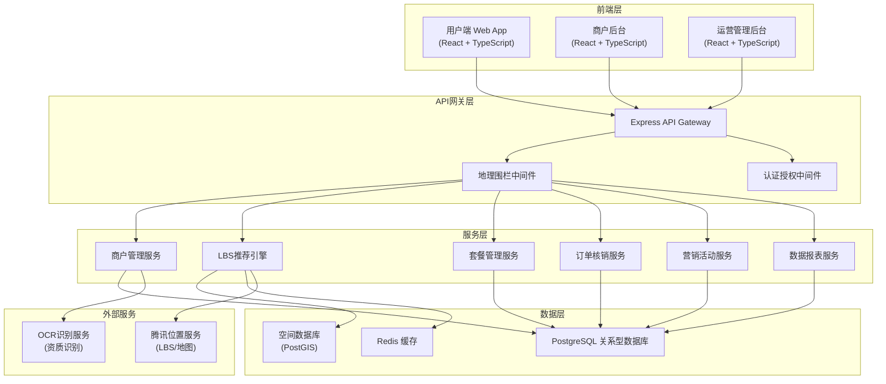
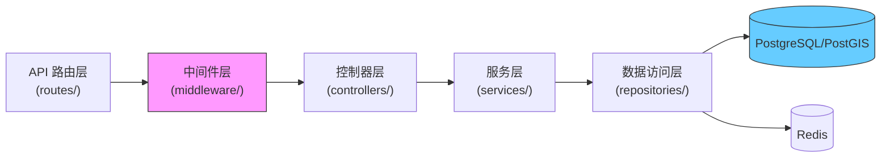

## 1. 架构设计



## 2. 技术选型说明

### 2.1 技术栈

| 层级 | 技术选型 | 版本 | 说明 |
|--------|----------|------|------|
| 前端框架 | React | 18.x | 组件化开发，生态成熟 |
| 开发语言 | TypeScript | 5.x | 类型安全，提升代码质量 |
| 构建工具 | Vite | 5.x | 快速开发，热更新 |
| 样式方案 | Tailwind CSS | 3.x | 原子化CSS，快速构建UI |
| 状态管理 | Zustand | 4.x | 轻量级状态管理 |
| 路由管理 | React Router | 6.x | 单页应用路由 |
| 后端框架 | Express | 4.x | Node.js Web框架 |
| 数据库 | PostgreSQL | 15.x | 支持PostGIS空间扩展 |
| 空间扩展 | PostGIS | 3.x | 地理空间数据处理 |
| 缓存 | Redis | 7.x | 热点数据缓存、会话管理 |
| 图表库 | Recharts | 2.x | React图表组件 |
| HTTP客户端 | Axios | 1.x | API请求库 |
| 图标库 | Lucide React | 0.x | 统一图标组件 |

### 2.2 关键技术决策

1. **地理围栏强制校验**：在API网关层统一实现松江区地理围栏校验中间件，所有接口必须通过校验才能访问业务服务
2. **空间数据存储**：使用PostGIS扩展存储地理空间数据，支持高效的空间查询和距离计算
3. **LBS推荐引擎**：基于用户GPS/基站定位，结合商圈热力图数据，实现个性化推荐
4. **前后端分离**：用户端、商户端、运营端独立部署，共享后端服务
5. **数据Mock**：使用本地Mock数据支撑前端开发，内置完整的业务数据模拟

## 3. 路由定义

| 路由路径 | 页面名称 | 所属端 |
|----------|----------|--------|
| / | 用户端首页 | 用户端 |
| /category/:type | 分类商户列表 | 用户端 |
| /merchant/:id | 商户详情页 | 用户端 |
| /package/:id | 套餐详情页 | 用户端 |
| /orders | 订单列表 | 用户端 |
| /verify/:orderId | 核销页 | 用户端 |
| /merchant/register | 商户入驻 | 商户端 |
| /merchant/login | 商户登录 | 商户端 |
| /merchant/dashboard | 商户工作台 | 商户端 |
| /merchant/packages | 套餐管理 | 商户端 |
| /merchant/orders | 订单管理 | 商户端 |
| /merchant/verify | 扫码核销 | 商户端 |
| /admin/login | 运营登录 | 运营端 |
| /admin/dashboard | 数据看板 | 运营端 |
| /admin/merchants | 商户管理 | 运营端 |
| /admin/merchants/:id/audit | 商户审核 | 运营端 |
| /admin/activities | 营销活动 | 运营端 |
| /admin/reports | 消费报告 | 运营端 |
| /admin/geofence | 地理围栏配置 | 运营端 |

## 4. API 定义

### 4.1 通用响应结构

```typescript
interface ApiResponse<T> {
  code: number;
  message: string;
  data: T;
}
```

### 4.2 核心接口定义

```typescript
// 地理围栏校验
interface GeofenceCheckRequest {
  longitude: number;
  latitude: number;
}

interface GeofenceCheckResponse {
  inRange: boolean;
  district: string;
  distanceToBorder: number;
}

// 商户入驻
interface MerchantRegisterRequest {
  name: string;
  category: string;
  subdistrict: string;
  address: string;
  longitude: number;
  latitude: number;
  businessLicense: string;
  permitImage: string;
  facadeImage: string;
  legalPerson: {
    name: string;
    idCard: string;
    idCardFront: string;
    idCardBack: string;
  };
  businessHours: BusinessHour[];
  tags: string[];
}

interface BusinessHour {
  day: number;
  openTime: string;
  closeTime: string;
}

// LBS推荐
interface LbsRecommendRequest {
  longitude: number;
  latitude: number;
  category?: string;
  page: number;
  pageSize: number;
}

interface Merchant {
  id: string;
  name: string;
  category: string;
  subdistrict: string;
  address: string;
  distance: number;
  rating: number;
  sales: number;
  facadeImage: string;
  tags: string[];
  heatScore: number;
}

// 套餐发布
interface PackageCreateRequest {
  merchantId: string;
  name: string;
  description: string;
  originalPrice: number;
  discountPrice: number;
  stock: number;
  startTime: string;
  endTime: string;
  applicableTime: string[];
  type: 'discount' | 'group' | 'timeslot';
}

// 订单核销
interface OrderVerifyRequest {
  orderId: string;
  verifyCode: string;
  verifyType: 'qrcode' | 'dynamic';
  longitude?: number;
  latitude?: number;
}

interface OrderVerifyResponse {
  success: boolean;
  orderNo: string;
  packageName: string;
  verifyTime: string;
}

// 营销活动
interface ActivityCreateRequest {
  name: string;
  description: string;
  startTime: string;
  endTime: string;
  subdistrict?: string;
  merchantIds: string[];
  discountRule: {
    type: 'percentage' | 'amount';
    value: number;
    threshold?: number;
  };
}

// 消费报告
interface ConsumptionReportResponse {
  topCategories: {
    category: string;
    sales: number;
    orderCount: number;
  }[];
  repurchaseRate: number;
  couponVerificationRate: number;
  dailySales: {
    date: string;
    amount: number;
  }[];
}
```

## 5. 服务端架构



### 5.1 目录结构

```
api/
├── src/
│   ├── middleware/
│   │   ├── geofence.ts      # 地理围栏校验中间件
│   │   ├── auth.ts           # 认证中间件
│   │   └── validator.ts      # 参数校验中间件
│   ├── controllers/
│   │   ├── merchant.ts
│   │   ├── lbs.ts
│   │   ├── package.ts
│   │   ├── order.ts
│   │   ├── activity.ts
│   │   └── report.ts
│   ├── services/
│   │   ├── merchant.service.ts
│   │   ├── lbs.service.ts
│   │   ├── package.service.ts
│   │   ├── order.service.ts
│   │   ├── activity.service.ts
│   │   └── report.service.ts
│   ├── repositories/
│   │   ├── merchant.repo.ts
│   │   ├── package.repo.ts
│   │   └── base.repo.ts
│   ├── models/
│   │   ├── index.ts
│   │   ├── merchant.ts
│   │   ├── package.ts
│   │   ├── order.ts
│   │   └── activity.ts
│   ├── utils/
│   │   ├── geofence.ts        # 地理围栏计算
│   │   └── mock.ts           # Mock数据生成
│   ├── config/
│   │   ├── database.ts
│   │   └── geofence.config.ts  # 松江区边界坐标
│   └── index.ts
```

## 6. 数据模型

### 6.1 ER 图

```mermaid
erDiagram
    MERCHANT ||--o{ PACKAGE : "发布"
    MERCHANT ||--o{ ORDER : "接收"
    USER ||--o{ ORDER : "下单"
    PACKAGE ||--o{ ORDER : "包含"
    ACTIVITY ||--o{ PACKAGE : "关联"
    MERCHANT }o--o{ ACTIVITY