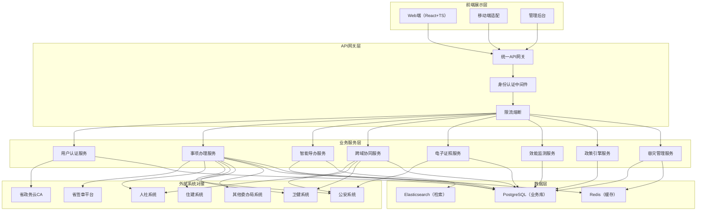
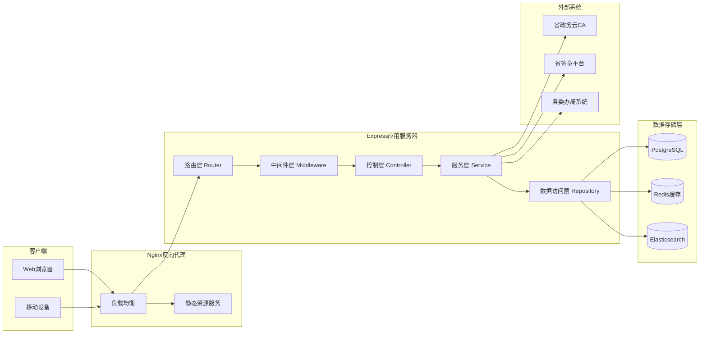
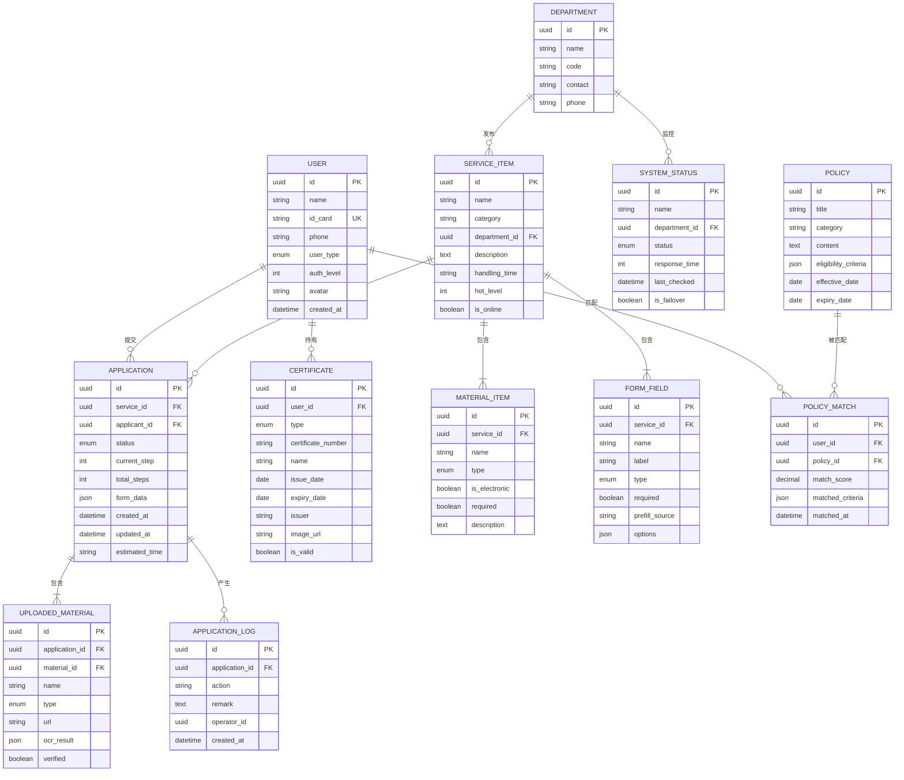

## 1. 架构设计

本项目采用前后端分离的微服务架构设计，前端使用React+TypeScript构建单页应用，后端使用Express.js提供RESTful API服务，通过统一API网关对接各委办局业务系统。数据层采用关系型数据库存储业务数据，Redis作为缓存层提升访问性能，Elasticsearch提供全文检索能力。



## 2. 技术描述

- **前端框架**：React@18 + TypeScript@5 + Vite@5
- **状态管理**：Zustand@4（轻量级状态管理）
- **路由管理**：React Router DOM@6
- **UI组件库**：Ant Design@5 + Tailwind CSS@3
- **图表库**：ECharts@5
- **图标库**：Lucide React@0.294
- **HTTP客户端**：Axios@1.6
- **后端框架**：Express@4 + TypeScript@5
- **数据库**：PostgreSQL@15（主库）+ Redis@7（缓存）
- **ORM**：Prisma@5
- **认证方案**：JWT + 省政务云CA对接
- **初始化工具**：vite-init（react-express-ts模板）
- **开发工具**：ESLint + Prettier + Husky

## 3. 路由定义

| 路由路径 | 页面名称 | 权限要求 |
|---------|---------|---------|
| `/` | 首页仪表盘 | 已登录用户 |
| `/login` | 登录页 | 公开 |
| `/services` | 掌上办事中心-事项列表 | 已登录用户 |
| `/services/:id` | 掌上办事中心-事项详情 | 已登录用户 |
| `/services/:id/apply` | 掌上办事中心-表单办理 | 已登录用户 |
| `/guide` | 智能导办助手 | 已登录用户 |
| `/collaboration` | 跨域协同中心 | 已登录用户 |
| `/collaboration/enterprise` | 企业开办一网通办 | 企业法人 |
| `/collaboration/newborn` | 新生儿出生一件事 | 已登录用户 |
| `/certificates` | 电子证照中心 | 已登录用户 |
| `/my-applications` | 我的办件 | 已登录用户 |
| `/admin/dashboard` | 后台管理-效能监测 | 政务工作人员 |
| `/admin/policy` | 后台管理-政策适配引擎 | 政务工作人员 |
| `/admin/disaster-recovery` | 后台管理-容灾切换中心 | 系统管理员 |
| `/admin/system` | 后台管理-系统设置 | 系统管理员 |
| `*` | 404页面 | 公开 |

## 4. API 定义

### 4.1 TypeScript 类型定义

```typescript
// 用户相关类型
interface User {
  id: string;
  name: string;
  idCard: string;
  phone: string;
  userType: 'citizen' | 'enterprise' | 'staff' | 'admin';
  authLevel: number;
  avatar?: string;
  createdAt: Date;
}

interface LoginRequest {
  username: string;
  password: string;
  caCertificate?: string;
}

interface LoginResponse {
  token: string;
  user: User;
  expiresAt: number;
}

// 事项相关类型
interface ServiceItem {
  id: string;
  name: string;
  category: string;
  department: string;
  description: string;
  handlingTime: string;
  requiredMaterials: MaterialItem[];
  formFields: FormField[];
  hotLevel: number;
  isOnline: boolean;
}

interface MaterialItem {
  id: string;
  name: string;
  type: 'id_card' | 'household' | 'social_security' | 'marriage' | 'other';
  isElectronic: boolean;
  required: boolean;
  description: string;
}

interface FormField {
  id: string;
  name: string;
  label: string;
  type: 'text' | 'number' | 'date' | 'select' | 'textarea' | 'upload';
  required: boolean;
  prefillSource?: string;
  options?: { label: string; value: string }[];
}

// 办件相关类型
interface Application {
  id: string;
  serviceId: string;
  serviceName: string;
  applicantId: string;
  status: 'draft' | 'submitted' | 'reviewing' | 'supplement' | 'approved' | 'rejected';
  formData: Record<string, any>;
  materials: UploadedMaterial[];
  currentStep: number;
  totalSteps: number;
  createdAt: Date;
  updatedAt: Date;
  estimatedTime: string;
}

interface UploadedMaterial {
  id: string;
  materialId: string;
  name: string;
  type: 'ocr' | 'upload' | 'electronic';
  url: string;
  ocrResult?: Record<string, any>;
  verified: boolean;
}

// 导办相关类型
interface GuideQuery {
  query: string;
  context?: string;
}

interface GuideResponse {
  intent: string;
  matchedServices: ServiceItem[];
  handlingPath: GuideStep[];
  materialList: MaterialItem[];
  estimatedTime: string;
}

interface GuideStep {
  step: number;
  title: string;
  description: string;
  department: string;
  duration: string;
}

// 效能监测类型
interface PerformanceData {
  date: string;
  totalApplications: number;
  completedCount: number;
  completionRate: number;
  averageHandlingTime: number;
  rejectionCount: number;
  rejectionReasons: { reason: string; count: number }[];
}

// 系统状态类型
interface SystemStatus {
  id: string;
  name: string;
  department: string;
  status: 'normal' | 'warning' | 'error';
  responseTime: number;
  lastChecked: Date;
  isFailover: boolean;
}
```

### 4.2 API 接口列表

| 方法 | 路径 | 描述 | 请求参数 | 返回数据 |
|------|------|------|---------|---------|
| POST | `/api/auth/login` | 用户登录 | `LoginRequest` | `LoginResponse` |
| GET | `/api/auth/userinfo` | 获取当前用户信息 | - | `User` |
| GET | `/api/services` | 获取事项列表 | `category?, keyword?, page?, pageSize?` | `{ list: ServiceItem[], total: number }` |
| GET | `/api/services/:id` | 获取事项详情 | - | `ServiceItem` |
| GET | `/api/services/hot` | 获取热门事项 | `limit?` | `ServiceItem[]` |
| POST | `/api/applications` | 创建办件申请 | `{ serviceId: string, formData: any }` | `Application` |
| GET | `/api/applications` | 获取我的办件列表 | `status?, page?, pageSize?` | `{ list: Application[], total: number }` |
| GET | `/api/applications/:id` | 获取办件详情 | - | `Application` |
| PUT | `/api/applications/:id` | 更新办件信息 | `{ formData?: any, materials?: any }` | `Application` |
| POST | `/api/applications/:id/submit` | 提交办件 | - | `Application` |
| POST | `/api/guide/query` | 智能导办问答 | `GuideQuery` | `GuideResponse` |
| POST | `/api/ocr/recognize` | OCR材料识别 | `FormData` | `{ result: Record<string, any>, confidence: number }` |
| POST | `/api/signature/sign` | 电子签名 | `{ applicationId: string, signatureData: string }` | `{ signedUrl: string }` |
| GET | `/api/certificates` | 获取电子证照列表 | - | `Certificate[]` |
| GET | `/api/admin/performance` | 获取效能监测数据 | `startDate?, endDate?, department?` | `PerformanceData[]` |
| GET | `/api/admin/systems` | 获取系统状态列表 | - | `SystemStatus[]` |
| POST | `/api/admin/systems/:id/failover` | 切换容灾模式 | `{ enable: boolean }` | `SystemStatus` |
| GET | `/api/admin/policy/match` | 政策匹配 | `{ userId: string }` | `PolicyMatch[]` |

## 5. 服务端架构图



## 6. 数据模型

### 6.1 数据模型ER图



### 6.2 数据定义语言（DDL）

```sql
-- 用户表
CREATE TABLE "user" (
    id UUID PRIMARY KEY DEFAULT gen_random_uuid(),
    name VARCHAR(100) NOT NULL,
    id_card VARCHAR(18) UNIQUE NOT NULL,
    phone VARCHAR(20) NOT NULL,
    user_type VARCHAR(20) NOT NULL CHECK (user_type IN ('citizen', 'enterprise', 'staff', 'admin')),
    auth_level INTEGER DEFAULT 1,
    avatar VARCHAR(255),
    created_at TIMESTAMP DEFAULT CURRENT_TIMESTAMP
);

-- 部门表
CREATE TABLE department (
    id UUID PRIMARY KEY DEFAULT gen_random_uuid(),
    name VARCHAR(100) NOT NULL,
    code VARCHAR(50) UNIQUE NOT NULL,
    contact VARCHAR(50),
    phone VARCHAR(20)
);

-- 事项表
CREATE TABLE service_item (
    id UUID PRIMARY KEY DEFAULT gen_random_uuid(),
    name VARCHAR(200) NOT NULL,
    category VARCHAR(100) NOT NULL,
    department_id UUID REFERENCES department(id),
    description TEXT,
    handling_time VARCHAR(50),
    hot_level INTEGER DEFAULT 0,
    is_online BOOLEAN DEFAULT true,
    created_at TIMESTAMP DEFAULT CURRENT_TIMESTAMP,
    updated_at TIMESTAMP DEFAULT CURRENT_TIMESTAMP
);

-- 材料项表
CREATE TABLE material_item (
    id UUID PRIMARY KEY DEFAULT gen_random_uuid(),
    service_id UUID REFERENCES service_item(id) ON DELETE CASCADE,
    name VARCHAR(200) NOT NULL,
    type VARCHAR(50) NOT NULL,
    is_electronic BOOLEAN DEFAULT false,
    required BOOLEAN DEFAULT true,
    description TEXT
);

-- 表单字段表
CREATE TABLE form_field (
    id UUID PRIMARY KEY DEFAULT gen_random_uuid(),
    service_id UUID REFERENCES service_item(id) ON DELETE CASCADE,
    name VARCHAR(100) NOT NULL,
    label VARCHAR(100) NOT NULL,
    type VARCHAR(20) NOT NULL,
    required BOOLEAN DEFAULT true,
    prefill_source VARCHAR(100),
    options JSONB
);

-- 办件表
CREATE TABLE application (
    id UUID PRIMARY KEY DEFAULT gen_random_uuid(),
    service_id UUID REFERENCES service_item(id),
    applicant_id UUID REFERENCES "user"(id),
    status VARCHAR(20) NOT NULL DEFAULT 'draft' CHECK (status IN ('draft', 'submitted', 'reviewing', 'supplement', 'approved', 'rejected')),
    current_step INTEGER DEFAULT 1,
    total_steps INTEGER DEFAULT 1,
    form_data JSONB,
    created_at TIMESTAMP DEFAULT CURRENT_TIMESTAMP,
    updated_at TIMESTAMP DEFAULT CURRENT_TIMESTAMP,
    estimated_time VARCHAR(50)
);

-- 上传材料表
CREATE TABLE uploaded_material (
    id UUID PRIMARY KEY DEFAULT gen_random_uuid(),
    application_id UUID REFERENCES application(id) ON DELETE CASCADE,
    material_id UUID REFERENCES material_item(id),
    name VARCHAR(200) NOT NULL,
    type VARCHAR(20) NOT NULL,
    url VARCHAR(255) NOT NULL,
    ocr_result JSONB,
    verified BOOLEAN DEFAULT false,
    created_at TIMESTAMP DEFAULT CURRENT_TIMESTAMP
);

-- 办件日志表
CREATE TABLE application_log (
    id UUID PRIMARY KEY DEFAULT gen_random_uuid(),
    application_id UUID REFERENCES application(id) ON DELETE CASCADE,
    action VARCHAR(50) NOT NULL,
    remark TEXT,
    operator_id UUID REFERENCES "user"(id),
    created_at TIMESTAMP DEFAULT CURRENT_TIMESTAMP
);

-- 电子证拍照
CREATE TABLE certificate (
    id UUID PRIMARY KEY DEFAULT gen_random_uuid(),
    user_id UUID REFERENCES "user"(id),
    type VARCHAR(50) NOT NULL,
    certificate_number VARCHAR(100) NOT NULL,
    name VARCHAR(200) NOT NULL,
    issue_date DATE,
    expiry_date DATE,
    issuer VARCHAR(200),
    image_url VARCHAR(255),
    is_valid BOOLEAN DEFAULT true,
    created_at TIMESTAMP DEFAULT CURRENT_TIMESTAMP
);

-- 系统状态表
CREATE TABLE system_status (
    id UUID PRIMARY KEY DEFAULT gen_random_uuid(),
    name VARCHAR(100) NOT NULL,
    department_id UUID REFERENCES department(id),
    status VARCHAR(20) NOT NULL DEFAULT 'normal' CHECK (status IN ('normal', 'warning', 'error')),
    response_time INTEGER DEFAULT 0,
    last_checked TIMESTAMP DEFAULT CURRENT_TIMESTAMP,
    is_failover BOOLEAN DEFAULT false
);

-- 政策表
CREATE TABLE policy (
    id UUID PRIMARY KEY DEFAULT gen_random_uuid(),
    title VARCHAR(200) NOT NULL,
    category VARCHAR(100),
    content TEXT,
    eligibility_criteria JSONB,
    effective_date DATE,
    expiry_date DATE,
    created_at TIMESTAMP DEFAULT CURRENT_TIMESTAMP
);

-- 政策匹配表
CREATE TABLE policy_match (
    id UUID PRIMARY KEY DEFAULT gen_random_uuid(),
    user_id UUID REFERENCES "user"(id),
    policy_id UUID REFERENCES policy(id),
    match_score DECIMAL(5,2),
    matched_criteria JSONB,
    matched_at TIMESTAMP DEFAULT CURRENT_TIMESTAMP
);

-- 创建索引
CREATE INDEX idx_application_applicant ON application(applicant_id);
CREATE INDEX idx_application_status ON application(status);
CREATE INDEX idx_application_created ON application(created_at DESC);
CREATE INDEX idx_service_category ON service_item(category);
CREATE INDEX idx_service_hot ON service_item(hot_level DESC);
CREATE INDEX idx_certificate_user ON certificate(user_id);
```

### 6.3 初始数据

```sql
-- 插入初始部门数据
INSERT INTO department (name, code, contact, phone) VALUES
('人力资源和社会保障厅', 'RS001', '张主任', '12333'),
('公安厅', 'GA001', '李主任', '110'),
('卫生健康委员会', 'WJ001', '王主任', '12320'),
('住房和城乡建设厅', 'ZJ001', '赵主任', '12319'),
('市场监督管理局', 'SC001', '孙主任', '12315'),
('税务局', 'SW001', '周主任', '12366'),
('民政局', 'MZ001', '吴主任', '12349'),
('自然资源厅', 'ZR001', '郑主任', '12336');

-- 插入初始用户数据（测试用）
INSERT INTO "user" (name, id_card, phone, user_type, auth_level) VALUES
('张三', '110101199001011234', '13800138001', 'citizen', 2),
('李四', '110101199002022345', '13800138002', 'citizen', 1),
('王管理员', '110101198501013456', '13900139001', 'admin', 3),
('赵审核员', '110101198502024567', '13900139002', 'staff', 2);

-- 插入初始事项数据
INSERT INTO service_item (name, category, department_id, description, handling_time, hot_level) VALUES
('社保卡申领', '社会保障', (SELECT id FROM department WHERE code = 'RS001'), '首次申领社会保障卡', '5个工作日', 985),
('户口迁移', '户籍管理', (SELECT id FROM department WHERE code = 'GA001'), '市内户口迁移办理', '3个工作日', 876),
('出生医学证明办理', '医疗卫生', (SELECT id FROM department WHERE code = 'WJ001'), '新生儿出生医学证明签发', '1个工作日', 765),
('不动产登记', '住房建设', (SELECT id FROM department WHERE code = 'ZJ001'), '房屋所有权首次登记', '7个工作日', 654),
('企业开办', '市场监管', (SELECT id FROM department WHERE code = 'SC001'), '内资有限责任公司设立登记', '1个工作日', 932),
('社保缴费查询', '社会保障', (SELECT id FROM department WHERE code = 'RS001'), '个人社会保险缴费记录查询', '实时', 999),
('公积金提取', '住房建设', (SELECT id FROM department WHERE code = 'ZJ001'), '购买自住住房提取公积金', '3个工作日', 888),
('结婚证办理', '民政服务', (SELECT id FROM department WHERE code = 'MZ001'), '内地居民结婚登记', '即时办理', 777);

-- 插入初始系统状态数据
INSERT INTO system_status (name, department_id, status, response_time, is_failover) VALUES
('人社业务系统', (SELECT id FROM department WHERE code = 'RS001'), 'normal', 45, false),
('公安户籍系统', (SELECT id FROM department WHERE code = 'GA001'), 'normal', 38, false),
('卫健业务系统', (SELECT id FROM department WHERE code = 'WJ001'), 'warning', 120, false),
('住建业务系统', (SELECT id FROM department WHERE code = 'ZJ001'), 'normal', 52, false),
('市监业务系统', (SELECT id FROM department WHERE code = 'SC001'), 'normal', 41, false);

-- 插入初始政策数据
INSERT INTO policy (title, category, content, eligibility_criteria, effective_date, expiry_date) VALUES
('高校毕业生就业补贴', '就业创业', '对符合条件的高校毕业生给予一次性就业补贴', '{"age": {"$lte": 35}, "education": ["本科", "硕士", "博士"], "employment_status": "employed"}', '2024-01-01', '2025-12-31'),
('小微企业税收优惠', '企业扶持', '对小型微利企业减免企业所得税', '{"enterprise_type": "small_micro", "annual_profit": {"$lte": 3000000}}', '2024-01-01', '2025-12-31'),
('独生子女父母奖励', '计划生育', '对独生子女父母发放奖励金', '{"has_only_child": true, "age": {"$gte": 60}}', '2024-01-01', '9999-12-31');
```
