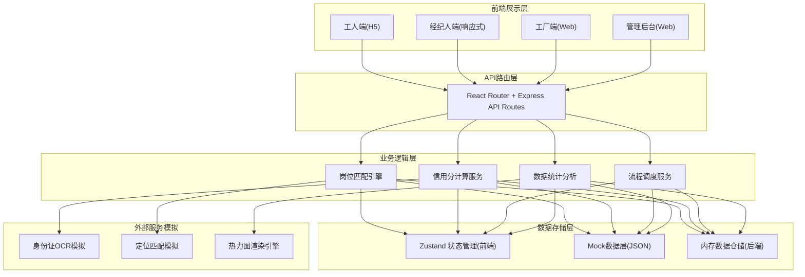
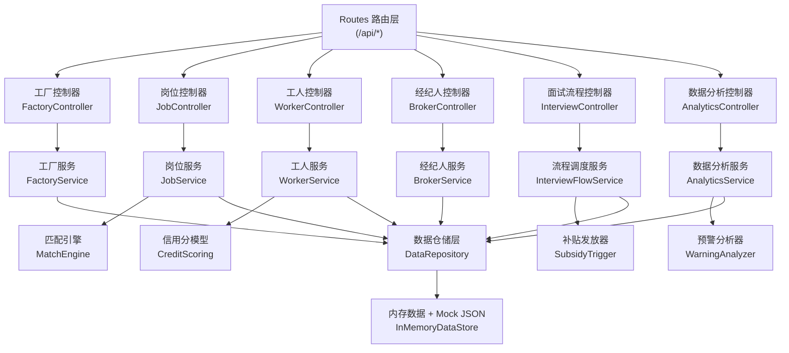
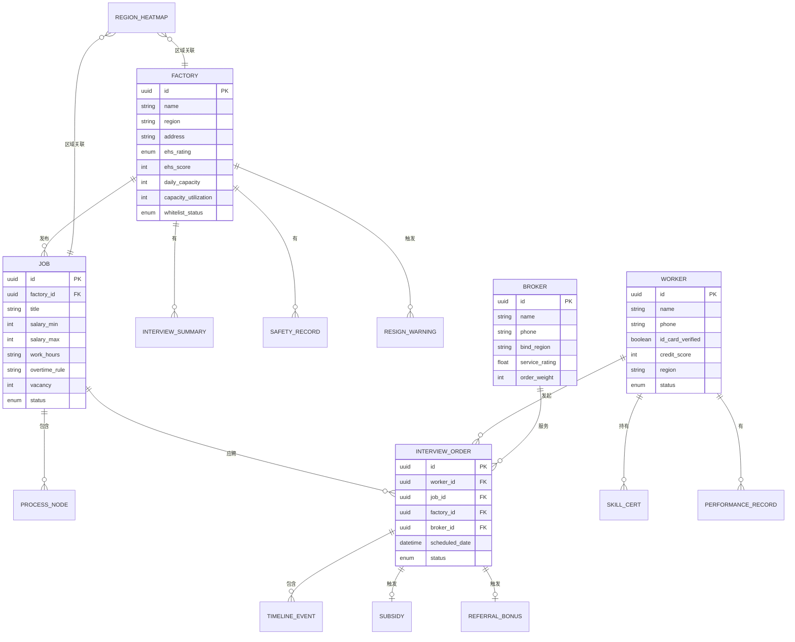

# 蓝领普工就业服务协同平台 技术架构文档

## 1. 架构设计



## 2. 技术选型

- **前端框架**: React@18 + TypeScript
- **构建工具**: Vite@5
- **样式方案**: TailwindCSS@3
- **状态管理**: Zustand
- **路由管理**: React Router DOM@6
- **图表可视化**: Recharts（折线图、柱状图、饼图）
- **图标库**: Lucide React
- **后端框架**: Express@4 + TypeScript (ESM)
- **数据层**: 内存数据仓储 + Mock JSON 数据（演示用）
- **初始化工具**: vite-init（react-express-ts 模板）

## 3. 路由定义

| 路由路径 | 页面用途 | 角色访问 |
|----------|----------|----------|
| `/` | 平台首页（角色选择入口） | 所有用户 |
| `/worker` | 工人端首页 - 岗位推荐与定位匹配 | 工人 |
| `/worker/jobs/:id` | 岗位详情页 | 工人 |
| `/worker/factory/:id` | 工厂详情页 | 工人 |
| `/worker/interview` | 面试/入职进度跟踪 | 工人 |
| `/worker/onboarding` | 入职签到与补贴 | 工人 |
| `/worker/profile` | 工人个人中心（信用分/简历） | 工人 |
| `/broker` | 经纪人工作台 | 经纪人 |
| `/broker/schedule` | 经纪人调度中心 | 经纪人 |
| `/broker/orders` | 经纪人订单记录 | 经纪人 |
| `/factory` | 工厂端首页（岗位发布） | 工厂 |
| `/factory/jobs` | 工厂岗位管理 | 工厂 |
| `/factory/applicants` | 应聘者管理 | 工厂 |
| `/admin` | 管理后台仪表盘 | 管理员 |
| `/admin/whitelist` | 工厂白名单管理 | 管理员 |
| `/admin/credit` | 工人信用分管理 | 管理员 |
| `/admin/warning` | 异常离职预警 | 管理员 |
| `/admin/heatmap` | 区域用工热力图 | 管理员 |
| `/login` | 统一登录页 | 所有角色 |

## 4. API 接口定义

```typescript
// 工厂实体
interface Factory {
  id: string;
  name: string;
  logo: string;
  region: string; // 长三角区县
  address: string;
  ehsRating: 'A' | 'B' | 'C' | 'D';
  ehsScore: number; // 0-100
  dailyCapacity: number; // 日均产量
  capacityUtilization: number; // 产能利用率 0-100%
  seasonNote: string;
  interviewSummaries: InterviewSummary[];
  safetyRecords: SafetyRecord[];
  whitelistStatus: 'whitelist' | 'graylist' | 'blacklist';
  createdAt: string;
}

// 员工访谈摘要
interface InterviewSummary {
  id: string;
  keywords: string[];
  satisfaction: 1 | 2 | 3 | 4 | 5;
  summary: string;
  recordedAt: string;
}

// 岗位实体
interface Job {
  id: string;
  factoryId: string;
  title: string;
  salaryRange: { min: number; max: number }; // 月薪范围
  workHours: string; // 如 "8:00-20:00 两班倒"
  overtimeRule: string; // 加班规则
  overtimeRate: { weekday: number; weekend: number; holiday: number }; // 倍率
  board: { provided: boolean; costPerMonth?: number }; // 食宿
  lodging: { provided: boolean; costPerMonth?: number; roomType?: string };
  processNodes: ProcessNode[]; // 进厂流程
  requirements: string[];
  benefits: string[];
  status: 'draft' | 'reviewing' | 'published' | 'closed';
  vacancy: number;
  distanceKm?: number; // 匹配时的距离
  createdAt: string;
}

// 流程节点
interface ProcessNode {
  step: number;
  name: string;
  description: string;
  duration: string;
}

// 工人实体
interface Worker {
  id: string;
  name: string;
  phone: string;
  idCardVerified: boolean;
  idCardOcrData?: { name: string; idNumber: string; address: string };
  skills: SkillCert[];
  performanceHistory: PerformanceRecord[];
  creditScore: number; // 350-950
  currentLocation: { lat: number; lng: number; region: string };
  status: 'idle' | 'interviewing' | 'onboarding' | 'employed' | 'resigned';
  createdAt: string;
}

// 技能认证
interface SkillCert {
  name: string;
  issuer: string;
  certifiedAt: string;
}

// 履约记录
interface PerformanceRecord {
  factoryId: string;
  jobId: string;
  startDate: string;
  endDate?: string;
  daysWorked: number;
  leaveType?: 'normal' | 'abnormal' | 'fired';
  leaveReason?: string;
}

// 经纪人实体
interface Broker {
  id: string;
  name: string;
  phone: string;
  bindRegion: string;
  serviceRating: number; // 1-5
  orderWeight: number; // 接单权重 0-100
  totalOrders: number;
  completedOrders: number;
}

// 面试/入职订单
interface InterviewOrder {
  id: string;
  workerId: string;
  jobId: string;
  factoryId: string;
  brokerId: string;
  scheduledDate: string;
  status: 'pending' | 'broker_assigned' | 'pickup_scheduled' | 'arrived' | 'documents_copied' | 'training_done' | 'interviewing' | 'passed' | 'failed' | 'employed';
  pickupInfo?: { carPlate: string; driverName: string; driverPhone: string; pickupTime: string };
  timeline: TimelineEvent[];
  subsidy?: { triggered: boolean; amount: number; paidAt?: string };
  referralBonus?: { triggered: boolean; amount: number; referrerId?: string; paidAt?: string };
}

// 时间线事件
interface TimelineEvent {
  time: string;
  type: string;
  description: string;
  operator?: string;
}

// 离职预警
interface ResignWarning {
  id: string;
  factoryId: string;
  factoryName: string;
  riskLevel: 'high' | 'medium' | 'low';
  riskScore: number;
  recentResignCount: number;
  resignRate: number;
  trend: 'up' | 'down' | 'stable';
  topReasons: { reason: string; count: number }[];
  keywords: string[];
}

// 区域用工饱和度
interface RegionHeatmap {
  regionCode: string;
  regionName: string;
  saturation: number; // 0-100 百分比
  vacancyCount: number;
  jobSeekerCount: number;
  avgSalary: number;
}
```

### 4.1 主要 API 端点

| 方法 | 路径 | 用途 |
|------|------|------|
| GET | `/api/factories` | 获取工厂列表（支持白名单状态筛选） |
| GET | `/api/factories/:id` | 获取工厂详情（含EHS、产能、访谈） |
| POST | `/api/factories/:id/whitelist-status` | 更新工厂白名单状态 |
| GET | `/api/jobs` | 获取岗位列表（支持定位/距离/薪资筛选） |
| GET | `/api/jobs/:id` | 获取岗位详情 |
| POST | `/api/jobs` | 发布新岗位（工厂端） |
| GET | `/api/jobs/match?lat=&lng=&radius=` | 定位匹配周边岗位 |
| GET | `/api/workers/:id` | 获取工人信息（含信用分、履约记录） |
| POST | `/api/workers/:id/verify-idcard` | 模拟身份证OCR核验 |
| PATCH | `/api/workers/:id/credit-score` | 调整工人信用分 |
| GET | `/api/workers/credit-distribution` | 信用分分布统计 |
| GET | `/api/brokers` | 获取区域经纪人列表 |
| GET | `/api/brokers/:id/orders` | 获取经纪人订单 |
| POST | `/api/interviews` | 创建面试预约 |
| GET | `/api/interviews/:id` | 获取面试订单详情 |
| PATCH | `/api/interviews/:id/status` | 更新面试/入职状态 |
| POST | `/api/interviews/:id/assign-broker` | 指派经纪人 |
| POST | `/api/interviews/:id/schedule-pickup` | 安排车接信息 |
| POST | `/api/interviews/:id/check-document` | 确认证件复印 |
| POST | `/api/interviews/:id/sign-training` | 培训签到 |
| POST | `/api/interviews/:id/result` | 提交面试结果 |
| GET | `/api/warnings/resign` | 获取异常离职预警列表 |
| GET | `/api/heatmap/regions` | 获取区域用工饱和度数据 |
| POST | `/api/auth/login` | 模拟登录（返回角色+token） |

## 5. 服务端架构图



## 6. 数据模型

### 6.1 ER 关系图



### 6.2 初始化数据说明

系统将预置以下 Mock 数据（全部内存仓储，启动即加载）：

- **工厂数据**：15家长三角代表性制造企业（苏州工业园、昆山、吴江、嘉兴、宁波北仑、上海松江等），覆盖电子、机械、汽车零部件、食品加工行业，EHS评级分布 A(3)/B(7)/C(4)/D(1)
- **岗位数据**：40+岗位，含普工、QC质检、仓管、叉车工、焊工等，薪资范围5000-9500，食宿条件差异化配置
- **工人数据**：100+虚拟工人，覆盖不同技能等级、信用分层（350-950七档分布）、履约记录完整性不同
- **经纪人数据**：8位经纪人，按区域绑定（苏州/昆山/吴江/嘉兴/宁波/上海各1-2人），服务评分4.2-4.9，权重差异化
- **面试订单**：30+模拟订单，覆盖全流程各状态节点
- **热力图数据**：长三角24个区县的用工饱和度数据（饱和度30%-95%）
- **离职预警数据**：8条工厂级预警记录，风险分布高中低档
