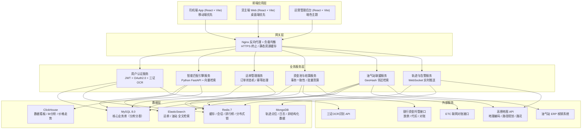
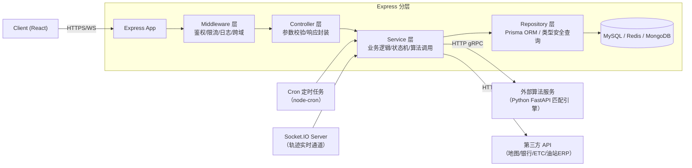
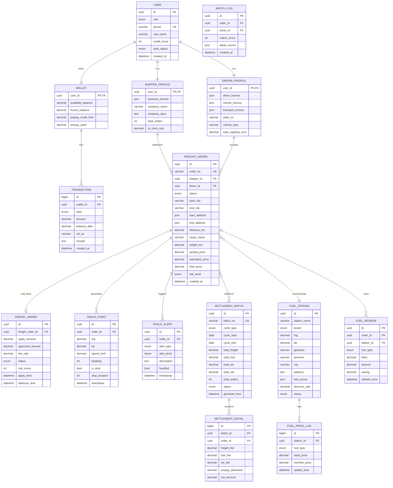

# 货运撮合与运力金融服务平台 技术架构文档

## 1. 架构设计



---

## 2. 技术描述

| 层级 | 技术选型 | 版本 | 说明 |
|------|----------|------|------|
| **前端框架** | React | 18.3.1 | Hooks + Context + Redux Toolkit 状态管理 |
| **构建工具** | Vite | 5.4.0 | 极速HMR，按需编译，生产Rollup打包 |
| **样式方案** | TailwindCSS | 3.4.10 | 原子化CSS + 自定义设计令牌 |
| **UI组件库** | Ant Design | 5.20.0 | 货主端/运营端基础组件 |
| **移动端UI** | Ant Design Mobile | 5.36.0 | 司机端移动端组件 |
| **图表可视化** | ECharts | 5.5.1 | 价格趋势、KPI看板、轨迹热力图 |
| **地图组件** | 高德地图 JS API | 2.0 | 路径规划、油站标记、轨迹绘制 |
| **后端主服务** | Node.js + Express | 4.19.2 | API网关聚合层，业务逻辑编排 |
| **匹配引擎** | Python + FastAPI | 0.115.0 | AI算法服务，独立部署 |
| **实时通信** | Socket.io | 4.7.5 | 轨迹实时上报、消息推送 |
| **数据库** | MySQL | 8.0 | 核心业务数据，InnoDB引擎 |
| **缓存** | Redis | 7.2 | 分布式缓存 + Redlock |
| **文档数据库** | MongoDB | 7.0 | 轨迹点位存储（时序集合） |
| **任务调度** | node-cron | 3.0.3 | 1/11/21日批量清算、风控定时任务 |
| **ORM** | Prisma | 5.19.0 | 类型安全的数据库访问 |
| **接口文档** | Swagger/OpenAPI | 3.0 | Express-swagger 自动生成 |
| **代码规范** | ESLint + Prettier | - | 统一代码风格，Git hooks校验 |
| **单元测试** | Jest + Supertest | 29.7.0 | 核心逻辑覆盖率 ≥ 80% |
| **容器化** | Docker + Docker Compose | - | 本地开发环境一键启动 |

---

## 3. 路由定义

### 3.1 司机端（/driver/*）

| 路由 | 页面 | 功能 |
|------|------|------|
| /driver/home | 司机工作台首页 | 推荐运单+资金概览+附近油站 |
| /driver/orders | 运单列表 | 全部/待接单/运输中/已完成/异常 |
| /driver/orders/:id | 运单详情 | 装卸信息+预支申请+轨迹上报 |
| /driver/wallet | 资金钱包 | 余额/提现/预支额度/资金流水 |
| /driver/stations | 油气站网络 | 地图搜索/优惠列表/加油核销 |
| /driver/track | 轨迹记录 | 历史行程/异常告警/里程统计 |
| /driver/profile | 个人中心 | 三证认证/车辆管理/设置 |

### 3.2 货主端（/shipper/*）

| 路由 | 页面 | 功能 |
|------|------|------|
| /shipper/home | 货主工作台 | 运单看板+匹配推荐+信用评分 |
| /shipper/orders/create | 发布运单 | 线路货物信息+定价参考+发布 |
| /shipper/orders | 运单管理 | 列表筛选/批量操作/状态追踪 |
| /shipper/orders/:id | 运单详情 | 司机信息+在途追踪+签收确认 |
| /shipper/settlement | 结算中心 | 周期对账单/合并对账/资金流水 |
| /shipper/credit | 信用看板 | 信用分/评价/历史交易统计 |

### 3.3 运营管理端（/admin/*）

| 路由 | 页面 | 功能 |
|------|------|------|
| /admin/dashboard | 数据驾驶舱 | GMV/空驶率/KPI大屏 |
| /admin/risk | 风控审核台 | 用户认证审核/预支复核/黑名单 |
| /admin/fund | 资金监控 | 资金池余额/放款流水/异常预警 |
| /admin/stations | 油站管理 | 站点CRUD/价格维护/核销统计 |
| /admin/matching | 引擎配置 | 匹配算法参数/权重调整/AB实验 |
| /admin/users | 用户管理 | 司机/货主列表/封禁/数据修正 |

---

## 4. API 定义

### 4.1 TypeScript 核心类型

```typescript
// 用户模块
interface User {
  id: string;
  role: 'driver' | 'shipper' | 'admin';
  phone: string;
  realName: string;
  idCardEncrypted: string;
  creditScore: number; // 300-900 信用分
  authStatus: 'pending' | 'approved' | 'rejected';
  authDocuments?: DriverAuthDocs | ShipperAuthDocs;
  createdAt: number;
}

interface DriverAuthDocs {
  driverLicense: { no: string; imageUrl: string; expireAt: number };
  vehicleLicense: { plateNo: string; imageUrl: string; vehicleType: string };
  transportLicense: { no: string; imageUrl: string; expireAt: number };
}

interface ShipperAuthDocs {
  businessLicense: { no: string; imageUrl: string; companyName: string };
  legalPersonIdCard: { name: string; no: string; imageUrl: string };
}

// 运单模块
interface FreightOrder {
  id: string;
  orderNo: string;
  shipperId: string;
  driverId?: string;
  status: 'draft' | 'published' | 'matched' | 'loading' | 'in_transit' | 'unloading' | 'completed' | 'abnormal' | 'cancelled';
  // 线路
  startCity: string;
  endCity: string;
  startAddress: AddressPoint;
  endAddress: AddressPoint;
  distanceKm: number;
  // 货物
  cargoName: string;
  cargoType: string;
  weightTon: number;
  volumeCbm: number;
  // 时间
  loadingTimeWindow: [number, number];
  unloadingTimeWindow: [number, number];
  publishTime: number;
  // 价格
  quotedPrice: number; // 货主报价 元
  estimatedMarketPrice: number; // 系统预估市场价
  finalPrice?: number; // 成交价
  prepayRatio?: number; // 预付比例 0-0.5
  prepayAmount?: number; // 预付金额
  // 风控
  riskLevel: 'low' | 'medium' | 'high';
  // 资质要求
  requiredVehicleTypes: string[];
  requiredMinCreditScore: number;
  // 时间戳
  createdAt: number;
  updatedAt: number;
}

interface AddressPoint {
  province: string;
  city: string;
  district: string;
  detail: string;
  lng: number;
  lat: number;
  contactName: string;
  contactPhone: string;
}

// 匹配结果
interface MatchResult {
  orderId: string;
  driverId: string;
  matchScore: number; // 0-100 综合匹配分
  priceScore: number;
  creditScore: number;
  qualificationScore: number;
  routeScore: number;
  recommendedPrice: number;
}

// 资金模块
interface Wallet {
  userId: string;
  role: 'driver' | 'shipper';
  availableBalance: number; // 可用余额
  frozenBalance: number; // 冻结金额
  prepayCreditLimit: number; // 预支额度
  prepayUsed: number; // 已用预支
  totalIncome: number;
  totalExpense: number;
}

interface PrepayOrder {
  id: string;
  freightOrderId: string;
  driverId: string;
  shipperId: string;
  applyAmount: number; // 申请金额
  approvedAmount: number; // 批准金额
  feeRate: number; // 手续费率
  feeAmount: number; // 手续费
  status: 'applying' | 'approved' | 'rejected' | 'repaid' | 'overdue';
  riskScore: number;
  applyTime: number;
  approveTime?: number;
  disburseTime?: number;
  repayTime?: number;
}

interface SettlementBatch {
  id: string;
  batchNo: string;
  cycleType: 'monthly_1' | 'monthly_11' | 'monthly_21'; // 1/11/21日批次
  cycleStartDate: string;
  cycleEndDate: string;
  totalFreightFee: number;
  totalFuelFee: number;
  totalEtcFee: number;
  totalPrepayDeduction: number;
  totalNetPayable: number;
  totalOrders: number;
  status: 'generating' | 'pending_confirm' | 'paid' | 'failed';
  generateTime: number;
  payTime?: number;
}

// 油气站模块
interface FuelStation {
  id: string;
  stationName: string;
  brand: 'sinopec' | 'petrochina' | 'shell' | 'cnooc' | 'private';
  lng: number;
  lat: number;
  geohash: string;
  province: string;
  city: string;
  address: string;
  phone: string;
  fuelPrices: FuelPrice[];
  services: string[]; // ['24h', 'WC', 'restaurant', 'hotel', 'repair']
  discountRate: number; // 会员折扣 0-1
  status: 'active' | 'inactive' | 'maintenance';
  verifiedAt: number;
}

interface FuelPrice {
  fuelType: '92#' | '95#' | '98#' | '0#' | '-10#' | '-35#';
  retailPrice: number; // 挂牌价 元/升
  memberPrice: number; // 会员价
  updateTime: number;
}

// 轨迹模块
interface TrackPoint {
  id: string;
  orderId: string;
  driverId: string;
  vehiclePlate: string;
  lng: number;
  lat: number;
  speedKmh: number;
  heading: number; // 方向角 0-360
  altitude: number;
  timestamp: number;
  isStop: boolean;
  stopDuration?: number; // 停留秒数
}

interface TrackAlert {
  id: string;
  orderId: string;
  driverId: string;
  alertType: 'abnormal_stop' | 'route_deviation' | 'over_speed' | 'sudden_brake' | 'sudden_accel';
  alertLevel: 'info' | 'warning' | 'danger';
  description: string;
  lng?: number;
  lat?: number;
  timestamp: number;
  handled: boolean;
  handledBy?: string;
  handledAt?: number;
}
```

### 4.2 核心 RESTful API

| Method | 路径 | 描述 | 请求/响应示例 |
|--------|------|------|------|
| POST | /api/v1/auth/login | 手机号登录 | {phone, code} → {token, user} |
| POST | /api/v1/auth/driver/auth | 司机三证认证上传 | {driverLicense, vehicleLicense, transportLicense} → {authId, status} |
| POST | /api/v1/orders | 货主发布运单 | FreightOrder → {orderId, orderNo} |
| GET | /api/v1/matching/recommend/orders | 司机获取推荐运单 | ?lng=&lat=&page= → {list: MatchResult[], total} |
| GET | /api/v1/matching/recommend/drivers/:orderId | 货主获取匹配司机 | → {list: MatchResult[]} |
| POST | /api/v1/orders/:id/accept | 司机接单 | → {status: 'matched'} |
| POST | /api/v1/orders/:id/loading-confirm | 装车确认并触发预支 | {photos: string[]} → {prepayOrderId} |
| POST | /api/v1/prepay/:id/approve | 预支审批（自动/人工） | {approved, amount} → {disburseTime} |
| POST | /api/v1/track/report | 司机上报轨迹点 | TrackPoint[] → {ok: true} |
| GET | /api/v1/track/:orderId/realtime | 实时轨迹流 | WebSocket 升级握手 |
| GET | /api/v1/stations/nearby | 附近油站查询 | ?lng=&lat=&radiusKm=&fuelType= → {list: FuelStation[]} |
| GET | /api/v1/stations/recommend-for-order | 运单最优加油推荐 | ?orderId= → {plan: {stationId, liters, saving, segment}} |
| POST | /api/v1/settlement/batch/generate | 触发批量结算（1/11/21） | {cycleType} → {batchId, totalOrders} |
| GET | /api/v1/settlement/batch/:id/detail | 批次对账单详情 | → SettlementBatch + 明细列表 |
| GET | /api/v1/admin/dashboard/kpi | 运营驾驶舱KPI | ?range=7d → {gmv, emptyRate, avgSettlementDays, fuelSaving} |

---

## 5. 服务器分层架构



---

## 6. 数据模型

### 6.1 ER 图



### 6.2 DDL 语句（MySQL 核心表）

```sql
-- 分库策略：按 user_id 哈希分库，orders 按创建时间按月分表

CREATE TABLE `user` (
  `id` binary(16) NOT NULL COMMENT 'UUID主键',
  `role` enum('driver','shipper','admin') NOT NULL,
  `phone` varchar(20) NOT NULL COMMENT '手机号',
  `real_name` varchar(50) DEFAULT NULL,
  `id_card_encrypted` varchar(255) DEFAULT NULL COMMENT '身份证号AES加密',
  `password_hash` varchar(255) DEFAULT NULL,
  `credit_score` int NOT NULL DEFAULT 650 COMMENT '300-900信用分',
  `auth_status` enum('pending','approved','rejected') NOT NULL DEFAULT 'pending',
  `created_at` datetime NOT NULL DEFAULT CURRENT_TIMESTAMP,
  `updated_at` datetime NOT NULL DEFAULT CURRENT_TIMESTAMP ON UPDATE CURRENT_TIMESTAMP,
  PRIMARY KEY (`id`),
  UNIQUE KEY `uk_phone_role` (`phone`,`role`),
  KEY `idx_credit_score` (`credit_score`)
) ENGINE=InnoDB DEFAULT CHARSET=utf8mb4 COMMENT='用户主表';

CREATE TABLE `freight_order` (
  `id` binary(16) NOT NULL,
  `order_no` varchar(32) NOT NULL COMMENT '业务单号 OR202506200001',
  `shipper_id` binary(16) NOT NULL,
  `driver_id` binary(16) DEFAULT NULL,
  `status` enum('draft','published','matched','loading','in_transit','unloading','completed','abnormal','cancelled') NOT NULL DEFAULT 'draft',
  `start_city` varchar(20) NOT NULL,
  `end_city` varchar(20) NOT NULL,
  `start_address` json NOT NULL COMMENT '装货地址含经纬度',
  `end_address` json NOT NULL COMMENT '卸货地址含经纬度',
  `distance_km` decimal(8,2) NOT NULL,
  `cargo_name` varchar(100) NOT NULL,
  `cargo_type` varchar(50) DEFAULT NULL,
  `weight_ton` decimal(8,2) NOT NULL,
  `volume_cbm` decimal(8,2) DEFAULT NULL,
  `quoted_price` decimal(12,2) NOT NULL COMMENT '货主报价',
  `estimated_price` decimal(12,2) NOT NULL COMMENT '系统预估市场价',
  `final_price` decimal(12,2) DEFAULT NULL COMMENT '成交价',
  `risk_level` enum('low','medium','high') NOT NULL DEFAULT 'low',
  `required_vehicle_types` json DEFAULT NULL,
  `required_min_credit_score` int NOT NULL DEFAULT 600,
  `loading_start_at` datetime DEFAULT NULL,
  `unloading_confirm_at` datetime DEFAULT NULL,
  `created_at` datetime NOT NULL DEFAULT CURRENT_TIMESTAMP,
  `updated_at` datetime NOT NULL DEFAULT CURRENT_TIMESTAMP ON UPDATE CURRENT_TIMESTAMP,
  PRIMARY KEY (`id`),
  UNIQUE KEY `uk_order_no` (`order_no`),
  KEY `idx_shipper_status` (`shipper_id`,`status`),
  KEY `idx_driver_status` (`driver_id`,`status`),
  KEY `idx_route_status` (`start_city`,`end_city`,`status`),
  KEY `idx_created` (`created_at`)
) ENGINE=InnoDB DEFAULT CHARSET=utf8mb4 COMMENT='运单主表'
PARTITION BY RANGE (TO_DAYS(`created_at`)) (
  PARTITION p202506 VALUES LESS THAN (TO_DAYS('2025-07-01')),
  PARTITION p202507 VALUES LESS THAN (TO_DAYS('2025-08-01')),
  PARTITION p_future VALUES LESS THAN MAXVALUE
);

CREATE TABLE `prepay_order` (
  `id` binary(16) NOT NULL,
  `freight_order_id` binary(16) NOT NULL,
  `driver_id` binary(16) NOT NULL,
  `shipper_id` binary(16) NOT NULL,
  `apply_amount` decimal(12,2) NOT NULL,
  `approved_amount` decimal(12,2) DEFAULT NULL,
  `fee_rate` decimal(5,4) NOT NULL DEFAULT 0.003 COMMENT '日利率0.3%',
  `fee_amount` decimal(12,2) DEFAULT NULL,
  `status` enum('applying','approved','rejected','repaid','overdue') NOT NULL DEFAULT 'applying',
  `risk_score` int NOT NULL COMMENT '0-100风控评分',
  `apply_time` datetime NOT NULL,
  `approve_time` datetime DEFAULT NULL,
  `disburse_time` datetime DEFAULT NULL COMMENT '实际放款时间',
  `disburse_tx_no` varchar(64) DEFAULT NULL COMMENT '银行放款流水号',
  `repay_time` datetime DEFAULT NULL,
  `created_at` datetime NOT NULL DEFAULT CURRENT_TIMESTAMP,
  PRIMARY KEY (`id`),
  KEY `idx_order_status` (`freight_order_id`,`status`),
  KEY `idx_driver_status` (`driver_id`,`status`)
) ENGINE=InnoDB DEFAULT CHARSET=utf8mb4 COMMENT='装车预支订单';

CREATE TABLE `settlement_batch` (
  `id` binary(16) NOT NULL,
  `batch_no` varchar(32) NOT NULL COMMENT 'SB2025-06-001',
  `cycle_type` enum('monthly_1','monthly_11','monthly_21') NOT NULL,
  `cycle_start_date` date NOT NULL,
  `cycle_end_date` date NOT NULL,
  `total_orders` int NOT NULL DEFAULT 0,
  `total_freight_fee` decimal(14,2) NOT NULL DEFAULT 0,
  `total_fuel_fee` decimal(14,2) NOT NULL DEFAULT 0,
  `total_etc_fee` decimal(14,2) NOT NULL DEFAULT 0,
  `total_prepay_deduction` decimal(14,2) NOT NULL DEFAULT 0,
  `total_net_payable` decimal(14,2) NOT NULL DEFAULT 0,
  `status` enum('generating','pending_confirm','paid','failed') NOT NULL DEFAULT 'generating',
  `generate_time` datetime NOT NULL,
  `pay_time` datetime DEFAULT NULL,
  `created_at` datetime NOT NULL DEFAULT CURRENT_TIMESTAMP,
  PRIMARY KEY (`id`),
  UNIQUE KEY `uk_batch_no` (`batch_no`),
  KEY `idx_cycle` (`cycle_type`,`cycle_start_date`)
) ENGINE=InnoDB DEFAULT CHARSET=utf8mb4 COMMENT='结算批次表';

CREATE TABLE `settlement_detail` (
  `id` bigint NOT NULL AUTO_INCREMENT,
  `batch_id` binary(16) NOT NULL,
  `order_id` binary(16) NOT NULL,
  `driver_id` binary(16) NOT NULL,
  `shipper_id` binary(16) NOT NULL,
  `freight_fee` decimal(12,2) NOT NULL,
  `fuel_fee` decimal(12,2) NOT NULL DEFAULT 0,
  `etc_fee` decimal(12,2) NOT NULL DEFAULT 0,
  `prepay_deduction` decimal(12,2) NOT NULL DEFAULT 0,
  `prepay_fee_deduction` decimal(12,2) NOT NULL DEFAULT 0,
  `net_amount` decimal(12,2) NOT NULL COMMENT '本次实付=运费-油费-ETC-预支本金-手续费',
  PRIMARY KEY (`id`),
  KEY `idx_batch` (`batch_id`),
  KEY `idx_order` (`order_id`),
  KEY `idx_driver` (`driver_id`)
) ENGINE=InnoDB DEFAULT CHARSET=utf8mb4 COMMENT='结算明细表';

CREATE TABLE `fuel_station` (
  `id` binary(16) NOT NULL,
  `station_name` varchar(100) NOT NULL,
  `brand` enum('sinopec','petrochina','shell','cnooc','private') NOT NULL,
  `lng` decimal(10,6) NOT NULL,
  `lat` decimal(10,6) NOT NULL,
  `geohash` varchar(12) NOT NULL COMMENT 'GeoHash编码用于邻近查询',
  `province` varchar(20) NOT NULL,
  `city` varchar(20) NOT NULL,
  `address` varchar(255) NOT NULL,
  `phone` varchar(20) DEFAULT NULL,
  `fuel_prices` json NOT NULL COMMENT '当前各油品价格数组',
  `services` json DEFAULT NULL,
  `discount_rate` decimal(5,4) NOT NULL DEFAULT 1.0000,
  `status` enum('active','inactive','maintenance') NOT NULL DEFAULT 'active',
  `verified_at` datetime DEFAULT NULL,
  `created_at` datetime NOT NULL DEFAULT CURRENT_TIMESTAMP,
  `updated_at` datetime NOT NULL DEFAULT CURRENT_TIMESTAMP ON UPDATE CURRENT_TIMESTAMP,
  PRIMARY KEY (`id`),
  KEY `idx_geohash` (`geohash`),
  KEY `idx_city_status` (`city`,`status`)
) ENGINE=InnoDB DEFAULT CHARSET=utf8mb4 COMMENT='油气站主表';

-- Mongo 轨迹点表（时序集合）
-- db.createCollection("track_point", { timeseries: { timeField: "timestamp", metaField: "meta" } });
-- meta = { orderId, driverId, plateNo }
```

---

## 7. 关键算法说明

### 7.1 智能匹配引擎打分公式

```
综合匹配分 S = 0.35×价格分 + 0.25×信用分 + 0.25×资质分 + 0.15×线路分

价格分 = 100 × exp(-|司机报价 - 货主报价| / 货主报价 × 3)
信用分 = 标准化(信用分300-900 → 0-100) × [历史按时送达率 + 好评率]/2
资质分 = 车辆类型匹配 ? 100 : 0  +  货物运输资质匹配 ? 50 : 0
线路分 = 100 × (1 - |线路偏离度|)，偏离度=1 - 预计空驶里程/运输里程
```

### 7.2 装车预支风控评分卡

```
风控评分 = 40×司机信用 + 30×历史完成率 + 20×运单金额风险 + 10×货主信用

≥80分 → 自动50%预付
60-79分 → 人工复核最高30%预付
<60分 → 拒绝
```

### 7.3 最优加油点推荐（动态规划）

```
状态定义：dp[i][j] = 到达第i个分段终点时，在第j个加油站加油的最小成本
转移方程：dp[i][j] = min(dp[i-1][k] + 本段油耗 × price_j)  ∀k≠j
目标：整条线路总成本最低 + 偏离路径最短
```
