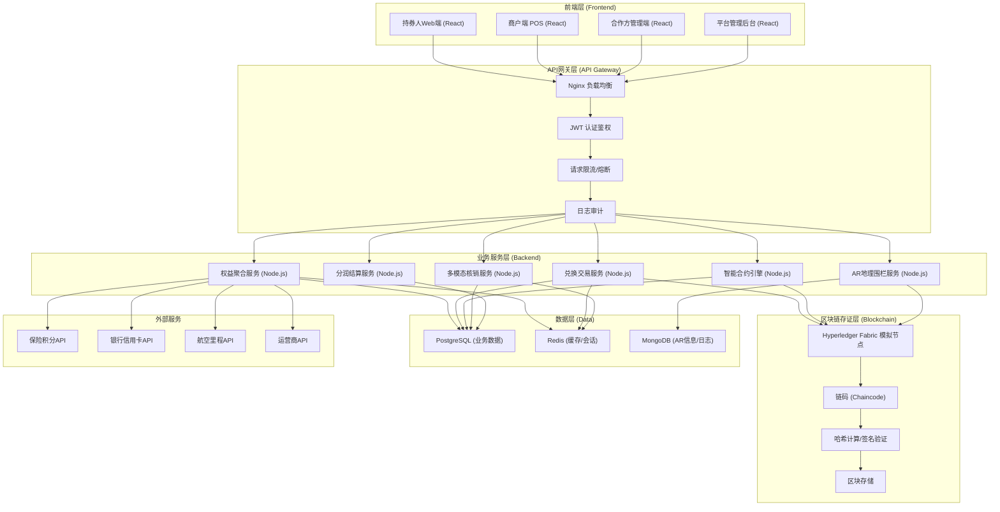
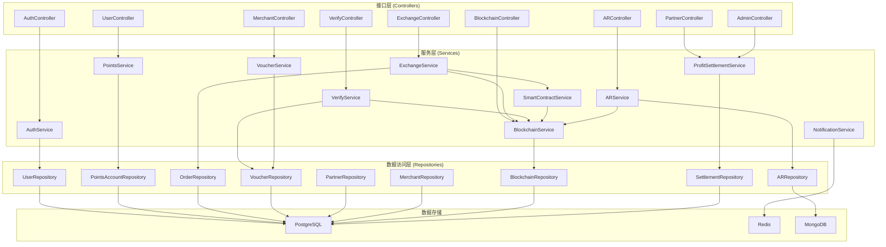
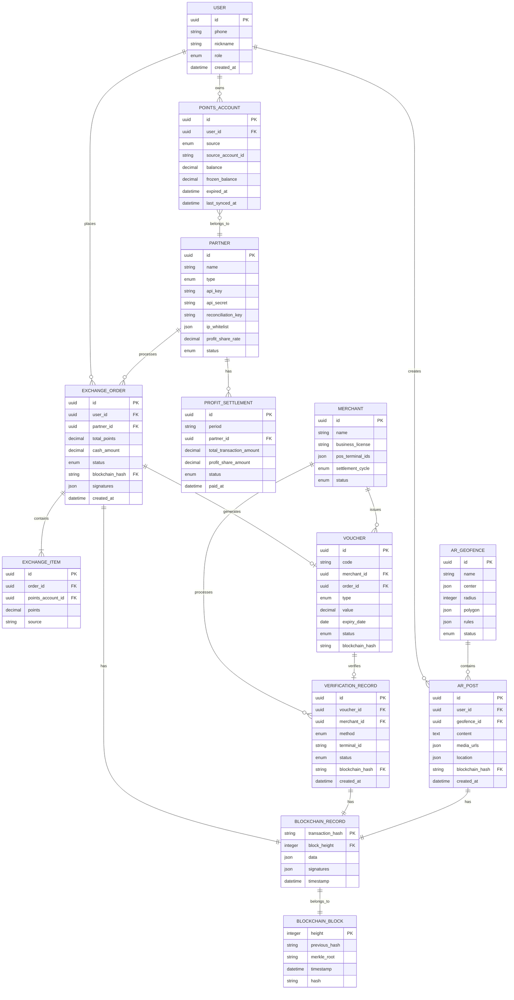

## 1. 架构设计



---

## 2. 技术选型说明

### 2.1 前端技术栈
- **框架**: React 18 + TypeScript
- **构建工具**: Vite 5
- **路由**: React Router v6
- **状态管理**: Zustand
- **UI组件库**: shadcn/ui + TailwindCSS 3
- **图表可视化**: Recharts + D3.js
- **地图/AR**: Leaflet (地理围栏) + Three.js (AR效果)
- **动画**: Framer Motion
- **HTTP客户端**: Axios + React Query

### 2.2 后端技术栈
- **运行时**: Node.js 20
- **框架**: Express 4
- **类型安全**: TypeScript
- **ORM**: Prisma
- **认证**: JWT + bcrypt
- **API文档**: Swagger / OpenAPI 3.0

### 2.3 数据存储
- **关系型数据库**: PostgreSQL 16 (业务主数据)
- **缓存**: Redis 7 (会话、热点数据、分布式锁)
- **文档数据库**: MongoDB 6 (AR信息、日志、非结构化数据)

### 2.4 区块链层
- **Hyperledger Fabric 模拟实现**: 简化版链上存证，包含Merkle树、区块结构、签名验证
- **加密算法**: SHA-256哈希、ECDSA签名、AES-256加密

---

## 3. 路由定义

### 3.1 持券人端路由
| 路由 | 页面 | 权限 |
|------|------|------|
| /user/dashboard | 积分聚合仪表盘 | 持券人 |
| /user/market | 权益兑换商城 | 持券人 |
| /user/ar-community | AR互助社区 | 持券人 |
| /user/assets | 我的资产 | 持券人 |
| /user/orders | 兑换记录 | 持券人 |
| /user/profile | 个人中心 | 持券人 |

### 3.2 商户端路由
| 路由 | 页面 | 权限 |
|------|------|------|
| /merchant/pos | POS核销工作台 | 商户 |
| /merchant/vouchers | 券码管理 | 商户 |
| /merchant/transactions | 交易记录 | 商户 |
| /merchant/settlement | 结算管理 | 商户 |
| /merchant/stores | 门店管理 | 商户 |

### 3.3 合作方端路由
| 路由 | 页面 | 权限 |
|------|------|------|
| /partner/api-config | API接入配置 | 合作方 |
| /partner/keys | 对账密钥管理 | 合作方 |
| /partner/reports | 数据报表 | 合作方 |
| /partner/profit | 分润明细 | 合作方 |

### 3.4 管理后台路由
| 路由 | 页面 | 权限 |
|------|------|------|
| /admin/dashboard | 权益健康度监控 | 管理员 |
| /admin/settlement | 分润结算管理 | 管理员 |
| /admin/geofence | AR地理围栏管理 | 管理员 |
| /admin/blockchain | 区块链浏览器 | 管理员 |
| /admin/partners | 合作方管理 | 管理员 |
| /admin/merchants | 商户管理 | 管理员 |
| /admin/settings | 系统设置 | 管理员 |

---

## 4. API 接口定义

### 4.1 TypeScript 类型定义

```typescript
// 核心实体类型
interface User {
  id: string;
  phone: string;
  nickname: string;
  avatar?: string;
  role: 'user' | 'merchant' | 'partner' | 'admin';
  createdAt: Date;
}

interface PointsAccount {
  id: string;
  userId: string;
  source: 'insurance' | 'bank' | 'airline' | 'telecom';
  sourceAccountId: string;
  balance: number;
  frozenBalance: number;
  expiredAt?: Date;
  lastSyncedAt: Date;
}

interface Partner {
  id: string;
  name: string;
  type: 'insurance' | 'bank' | 'airline' | 'telecom';
  apiKey: string;
  apiSecret: string;
  reconciliationKey: string;
  ipWhitelist: string[];
  profitShareRate: number;
  status: 'active' | 'inactive';
}

interface Merchant {
  id: string;
  name: string;
  businessLicense: string;
  posTerminalIds: string[];
  settlementCycle: 'daily' | 'weekly' | 'monthly';
  status: 'active' | 'inactive';
}

interface Voucher {
  id: string;
  code: string;
  type: 'coupon' | 'product' | 'service';
  value: number;
  merchantId: string;
  expiryDate: Date;
  status: 'active' | 'used' | 'expired' | 'revoked';
  blockchainHash?: string;
}

interface ExchangeOrder {
  id: string;
  userId: string;
  items: ExchangeItem[];
  totalPoints: number;
  cashAmount: number;
  status: 'pending' | 'confirmed' | 'completed' | 'cancelled';
  blockchainHash?: string;
  signatures: Signature[];
  createdAt: Date;
}

interface ExchangeItem {
  pointsAccountId: string;
  points: number;
  source: string;
}

interface BlockchainRecord {
  blockHeight: number;
  previousHash: string;
  transactionHash: string;
  timestamp: number;
  data: any;
  signatures: Signature[];
  merkleRoot: string;
}

interface Signature {
  party: string;
  publicKey: string;
  signature: string;
  signedAt: number;
}

interface ARGeofence {
  id: string;
  name: string;
  center: { lat: number; lng: number };
  radius: number;
  polygon?: { lat: number; lng: number }[];
  rules: GeofenceRule[];
  status: 'active' | 'inactive';
}

interface GeofenceRule {
  action: 'allow_post' | 'allow_view' | 'notify';
  userRole: string[];
  maxPostsPerDay: number;
}

interface ARPost {
  id: string;
  userId: string;
  geofenceId: string;
  content: string;
  mediaUrls?: string[];
  location: { lat: number; lng: number };
  blockchainHash?: string;
  createdAt: Date;
  expiresAt?: Date;
}

interface ProfitSettlement {
  id: string;
  period: string;
  partnerId: string;
  totalTransactionAmount: number;
  profitShareAmount: number;
  status: 'pending' | 'approved' | 'paid';
  paidAt?: Date;
}

interface VerificationRecord {
  id: string;
  orderId?: string;
  voucherId?: string;
  method: 'qrcode' | 'nfc' | 'bluetooth';
  merchantId: string;
  terminalId: string;
  status: 'success' | 'failed';
  blockchainHash?: string;
  createdAt: Date;
}
```

### 4.2 主要API端点

| 方法 | 路径 | 描述 | 鉴权 |
|------|------|------|------|
| POST | /api/auth/login | 用户登录 | 否 |
| GET | /api/user/points-accounts | 获取积分账户列表 | 持券人 |
| POST | /api/exchange/calculate | 计算兑换方案 | 持券人 |
| POST | /api/exchange/confirm | 确认兑换 | 持券人 |
| POST | /api/verify/qrcode | 扫码核销 | 商户 |
| POST | /api/verify/nfc | NFC核销 | 商户 |
| POST | /api/merchant/vouchers/generate | 批量生成券码 | 商户 |
| GET | /api/partner/reports/transactions | 交易报表 | 合作方 |
| GET | /api/admin/dashboard/metrics | 仪表盘指标 | 管理员 |
| GET | /api/blockchain/records | 区块链记录查询 | 管理员 |
| POST | /api/ar/posts | 发布AR互助信息 | 持券人 |
| GET | /api/ar/geofences | 获取地理围栏列表 | 管理员 |

---

## 5. 后端分层架构



---

## 6. 数据模型

### 6.1 ER图



### 6.2 DDL 语句

```sql
-- 创建扩展
CREATE EXTENSION IF NOT EXISTS "uuid-ossp";
CREATE EXTENSION IF NOT EXISTS "pgcrypto";

-- 用户表
CREATE TABLE users (
    id UUID PRIMARY KEY DEFAULT uuid_generate_v4(),
    phone VARCHAR(20) UNIQUE NOT NULL,
    nickname VARCHAR(50),
    avatar_url VARCHAR(255),
    role VARCHAR(20) NOT NULL CHECK (role IN ('user', 'merchant', 'partner', 'admin')),
    password_hash VARCHAR(255) NOT NULL,
    created_at TIMESTAMP NOT NULL DEFAULT CURRENT_TIMESTAMP,
    updated_at TIMESTAMP NOT NULL DEFAULT CURRENT_TIMESTAMP
);

-- 积分账户表
CREATE TABLE points_accounts (
    id UUID PRIMARY KEY DEFAULT uuid_generate_v4(),
    user_id UUID NOT NULL REFERENCES users(id),
    source VARCHAR(20) NOT NULL CHECK (source IN ('insurance', 'bank', 'airline', 'telecom')),
    source_account_id VARCHAR(100) NOT NULL,
    balance DECIMAL(15, 2) NOT NULL DEFAULT 0,
    frozen_balance DECIMAL(15, 2) NOT NULL DEFAULT 0,
    expired_at DATE,
    last_synced_at TIMESTAMP NOT NULL DEFAULT CURRENT_TIMESTAMP,
    created_at TIMESTAMP NOT NULL DEFAULT CURRENT_TIMESTAMP,
    updated_at TIMESTAMP NOT NULL DEFAULT CURRENT_TIMESTAMP,
    UNIQUE(user_id, source, source_account_id)
);

-- 合作方表
CREATE TABLE partners (
    id UUID PRIMARY KEY DEFAULT uuid_generate_v4(),
    name VARCHAR(100) NOT NULL,
    type VARCHAR(20) NOT NULL CHECK (type IN ('insurance', 'bank', 'airline', 'telecom')),
    api_key VARCHAR(64) UNIQUE NOT NULL,
    api_secret VARCHAR(255) NOT NULL,
    reconciliation_key VARCHAR(255) NOT NULL,
    ip_whitelist JSONB DEFAULT '[]',
    profit_share_rate DECIMAL(5, 4) NOT NULL DEFAULT 0.05,
    status VARCHAR(20) NOT NULL DEFAULT 'active' CHECK (status IN ('active', 'inactive')),
    created_at TIMESTAMP NOT NULL DEFAULT CURRENT_TIMESTAMP,
    updated_at TIMESTAMP NOT NULL DEFAULT CURRENT_TIMESTAMP
);

-- 商户表
CREATE TABLE merchants (
    id UUID PRIMARY KEY DEFAULT uuid_generate_v4(),
    name VARCHAR(100) NOT NULL,
    business_license VARCHAR(50) UNIQUE NOT NULL,
    pos_terminal_ids JSONB DEFAULT '[]',
    settlement_cycle VARCHAR(20) NOT NULL DEFAULT 'monthly' CHECK (settlement_cycle IN ('daily', 'weekly', 'monthly')),
    status VARCHAR(20) NOT NULL DEFAULT 'active' CHECK (status IN ('active', 'inactive')),
    created_at TIMESTAMP NOT NULL DEFAULT CURRENT_TIMESTAMP,
    updated_at TIMESTAMP NOT NULL DEFAULT CURRENT_TIMESTAMP
);

-- 区块表
CREATE TABLE blockchain_blocks (
    height INTEGER PRIMARY KEY,
    previous_hash VARCHAR(64) NOT NULL,
    merkle_root VARCHAR(64) NOT NULL,
    timestamp BIGINT NOT NULL,
    hash VARCHAR(64) UNIQUE NOT NULL
);

-- 区块链记录表
CREATE TABLE blockchain_records (
    transaction_hash VARCHAR(64) PRIMARY KEY,
    block_height INTEGER NOT NULL REFERENCES blockchain_blocks(height),
    data JSONB NOT NULL,
    signatures JSONB NOT NULL DEFAULT '[]',
    timestamp BIGINT NOT NULL
);

-- 兑换订单表
CREATE TABLE exchange_orders (
    id UUID PRIMARY KEY DEFAULT uuid_generate_v4(),
    user_id UUID NOT NULL REFERENCES users(id),
    partner_id UUID NOT NULL REFERENCES partners(id),
    total_points DECIMAL(15, 2) NOT NULL,
    cash_amount DECIMAL(15, 2) NOT NULL DEFAULT 0,
    status VARCHAR(20) NOT NULL DEFAULT 'pending' CHECK (status IN ('pending', 'confirmed', 'completed', 'cancelled')),
    blockchain_hash VARCHAR(64) REFERENCES blockchain_records(transaction_hash),
    signatures JSONB NOT NULL DEFAULT '[]',
    created_at TIMESTAMP NOT NULL DEFAULT CURRENT_TIMESTAMP,
    updated_at TIMESTAMP NOT NULL DEFAULT CURRENT_TIMESTAMP
);

-- 兑换明细表
CREATE TABLE exchange_items (
    id UUID PRIMARY KEY DEFAULT uuid_generate_v4(),
    order_id UUID NOT NULL REFERENCES exchange_orders(id) ON DELETE CASCADE,
    points_account_id UUID NOT NULL REFERENCES points_accounts(id),
    points DECIMAL(15, 2) NOT NULL,
    source VARCHAR(20) NOT NULL,
    created_at TIMESTAMP NOT NULL DEFAULT CURRENT_TIMESTAMP
);

-- 券码表
CREATE TABLE vouchers (
    id UUID PRIMARY KEY DEFAULT uuid_generate_v4(),
    code VARCHAR(50) UNIQUE NOT NULL,
    merchant_id UUID NOT NULL REFERENCES merchants(id),
    order_id UUID REFERENCES exchange_orders(id),
    type VARCHAR(20) NOT NULL CHECK (type IN ('coupon', 'product', 'service')),
    value DECIMAL(15, 2) NOT NULL,
    expiry_date DATE NOT NULL,
    status VARCHAR(20) NOT NULL DEFAULT 'active' CHECK (status IN ('active', 'used', 'expired', 'revoked')),
    blockchain_hash VARCHAR(64),
    created_at TIMESTAMP NOT NULL DEFAULT CURRENT_TIMESTAMP,
    updated_at TIMESTAMP NOT NULL DEFAULT CURRENT_TIMESTAMP
);

-- 核销记录表
CREATE TABLE verification_records (
    id UUID PRIMARY KEY DEFAULT uuid_generate_v4(),
    voucher_id UUID REFERENCES vouchers(id),
    merchant_id UUID NOT NULL REFERENCES merchants(id),
    method VARCHAR(20) NOT NULL CHECK (method IN ('qrcode', 'nfc', 'bluetooth')),
    terminal_id VARCHAR(50) NOT NULL,
    status VARCHAR(20) NOT NULL CHECK (status IN ('success', 'failed')),
    failure_reason VARCHAR(255),
    blockchain_hash VARCHAR(64) REFERENCES blockchain_records(transaction_hash),
    created_at TIMESTAMP NOT NULL DEFAULT CURRENT_TIMESTAMP
);

-- AR地理围栏表
CREATE TABLE ar_geofences (
    id UUID PRIMARY KEY DEFAULT uuid_generate_v4(),
    name VARCHAR(100) NOT NULL,
    center JSONB NOT NULL,
    radius INTEGER NOT NULL,
    polygon JSONB,
    rules JSONB NOT NULL DEFAULT '[]',
    status VARCHAR(20) NOT NULL DEFAULT 'active' CHECK (status IN ('active', 'inactive')),
    created_at TIMESTAMP NOT NULL DEFAULT CURRENT_TIMESTAMP,
    updated_at TIMESTAMP NOT NULL DEFAULT CURRENT_TIMESTAMP
);

-- AR互助信息表 (MongoDB，此处为关系型映射)
CREATE TABLE ar_posts (
    id UUID PRIMARY KEY DEFAULT uuid_generate_v4(),
    user_id UUID NOT NULL REFERENCES users(id),
    geofence_id UUID NOT NULL REFERENCES ar_geofences(id),
    content TEXT NOT NULL,
    media_urls JSONB,
    location JSONB NOT NULL,
    blockchain_hash VARCHAR(64) REFERENCES blockchain_records(transaction_hash),
    created_at TIMESTAMP NOT NULL DEFAULT CURRENT_TIMESTAMP,
    expires_at TIMESTAMP
);

-- 分润结算表
CREATE TABLE profit_settlements (
    id UUID PRIMARY KEY DEFAULT uuid_generate_v4(),
    period VARCHAR(20) NOT NULL,
    partner_id UUID NOT NULL REFERENCES partners(id),
    total_transaction_amount DECIMAL(15, 2) NOT NULL,
    profit_share_amount DECIMAL(15, 2) NOT NULL,
    status VARCHAR(20) NOT NULL DEFAULT 'pending' CHECK (status IN ('pending', 'approved', 'paid')),
    paid_at TIMESTAMP,
    created_at TIMESTAMP NOT NULL DEFAULT CURRENT_TIMESTAMP,
    updated_at TIMESTAMP NOT NULL DEFAULT CURRENT_TIMESTAMP,
    UNIQUE(period, partner_id)
);

-- 创建索引
CREATE INDEX idx_points_accounts_user_id ON points_accounts(user_id);
CREATE INDEX idx_exchange_orders_user_id ON exchange_orders(user_id);
CREATE INDEX idx_exchange_orders_status ON exchange_orders(status);
CREATE INDEX idx_vouchers_code ON vouchers(code);
CREATE INDEX idx_vouchers_merchant_id ON vouchers(merchant_id);
CREATE INDEX idx_verification_records_voucher_id ON verification_records(voucher_id);
CREATE INDEX idx_verification_records_merchant_id ON verification_records(merchant_id);
CREATE INDEX idx_verification_records_created_at ON verification_records(created_at);
CREATE INDEX idx_ar_posts_geofence_id ON ar_posts(geofence_id);
CREATE INDEX idx_ar_posts_created_at ON ar_posts(created_at);
CREATE INDEX idx_blockchain_records_block_height ON blockchain_records(block_height);
CREATE INDEX idx_profit_settlements_partner_id ON profit_settlements(partner_id);
CREATE INDEX idx_profit_settlements_period ON profit_settlements(period);
```
