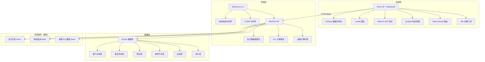
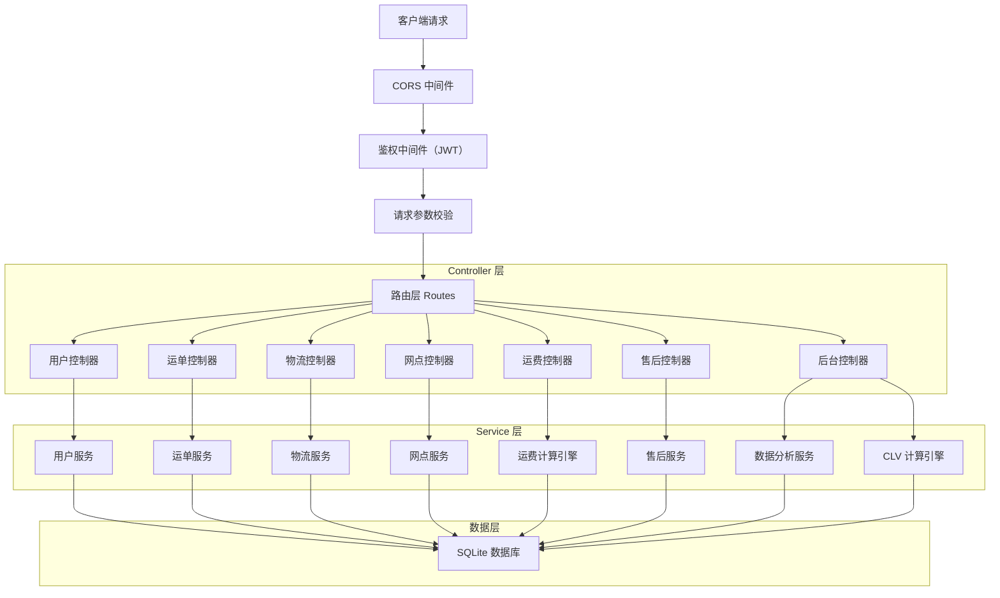

# 中通快递统一业务中枢系统 - 技术架构文档

## 1. 架构设计



## 2. 技术描述

- **前端**：React@18 + TypeScript + Vite@5 + Tailwind CSS@3 + Zustand@4 + React Router@6 + ECharts@5 + Lucide React
- **初始化工具**：vite-init（react-express-ts 全栈模板）
- **后端**：Express.js@4 + TypeScript + ts-node
- **数据库**：SQLite（better-sqlite3），无需外部服务，单文件部署，含完整 Mock 数据
- **状态管理**：Zustand 管理全局状态（用户登录、购物车、订单等）
- **数据可视化**：ECharts 5 实现热力图、趋势图、仪表盘

## 3. 路由定义

| 路由路径 | 页面 | 用途 |
|----------|------|------|
| `/` | 首页 | 功能导航、运费预估、热门服务 |
| `/order` | 自助下单 | 寄件下单全流程 |
| `/order/:id/waybill` | 电子运单 | 运单预览与打印 |
| `/track` | 物流查询 | 单号查询、批量查询 |
| `/track/history` | 历史记录 | 账号绑定后半年内记录 |
| `/outlets` | 网点检索 | 地图 POI、筛选、网点详情 |
| `/after-sale` | 售后中心 | 申诉列表、进度跟踪 |
| `/after-sale/new` | 发起申诉 | 申诉提交、证据上传 |
| `/admin` | 管理后台首页 | Dashboard 概览 |
| `/admin/heatmap` | 网点效能热力图 | 多维度热力图展示 |
| `/admin/clv` | CLV 分析 | 客户生命周期价值模型 |
| `/login` | 用户登录 | 账号登录 |

## 4. API 定义

```typescript
// 用户相关
interface User {
  id: number;
  phone: string;
  nickname: string;
  avatar?: string;
  role: 'sender' | 'receiver' | 'admin';
  createdAt: string;
}

// 运单相关
interface Waybill {
  id: string;
  trackingNo: string;
  senderName: string;
  senderPhone: string;
  senderAddress: string;
  receiverName: string;
  receiverPhone: string;
  receiverAddress: string;
  itemType: string;
  weight: number;
  volume?: number;
  isSpecial: boolean;
  specialDesc?: string;
  serviceLevel: 'standard' | 'nextday' | 'secondDay';
  pickupTime: string;
  freight: number;
  status: 'pending' | 'picked' | 'inTransit' | 'delivering' | 'signed' | 'exception';
  createdAt: string;
}

// 物流节点
interface TrackingEvent {
  id: number;
  waybillId: string;
  status: string;
  location: string;
  description: string;
  timestamp: string;
}

// 网点
interface Outlet {
  id: number;
  name: string;
  address: string;
  lng: number;
  lat: number;
  phone: string;
  businessHours: string;
  serviceTags: string[];
  avgResponseTime: number;
  complaintRate: number;
  onTimeRate: number;
  rating: number;
}

// 售后申诉
interface AfterSaleClaim {
  id: string;
  waybillId: string;
  type: 'damage' | 'lost';
  amount: number;
  description: string;
  images: string[];
  status: 'pending' | 'reviewing' | 'approved' | 'paid' | 'rejected';
  createdAt: string;
  updatedAt: string;
}

// CLV 数据
interface CLVData {
  customerId: number;
  totalOrders: number;
  totalAmount: number;
  orderFrequency: number;
  avgOrderValue: number;
  churnRisk: number;
  clvScore: number;
  tier: 'low' | 'medium' | 'high' | 'premium';
}
```

### API 端点列表

| 方法 | 路径 | 说明 |
|------|------|------|
| POST | `/api/auth/login` | 用户登录 |
| GET | `/api/auth/profile` | 获取当前用户信息 |
| POST | `/api/orders` | 创建运单（下单） |
| GET | `/api/orders/:id` | 获取运单详情 |
| GET | `/api/orders/:id/waybill` | 获取电子运单数据 |
| GET | `/api/track/:trackingNo` | 查询物流轨迹 |
| GET | `/api/track/batch` | 批量查询物流 |
| GET | `/api/track/history` | 获取半年历史记录 |
| GET | `/api/outlets` | 网点列表（支持筛选） |
| GET | `/api/outlets/:id` | 网点详情 |
| POST | `/api/freight/calculate` | 运费时效预估计算 |
| GET | `/api/after-sale` | 售后申诉列表 |
| POST | `/api/after-sale` | 提交售后申诉 |
| POST | `/api/after-sale/:id/upload` | 上传证据图片 |
| GET | `/api/after-sale/:id` | 申诉详情与进度 |
| GET | `/api/admin/dashboard` | 后台概览数据 |
| GET | `/api/admin/heatmap` | 热力图数据 |
| GET | `/api/admin/clv` | CLV 分析数据 |

## 5. 服务端架构图



## 6. 数据模型

### 6.1 ER 图


### 6.2 DDL 语句

```sql
-- 用户表
CREATE TABLE IF NOT EXISTS users (
  id INTEGER PRIMARY KEY AUTOINCREMENT,
  phone VARCHAR(20) UNIQUE NOT NULL,
  nickname VARCHAR(50) NOT NULL,
  password_hash VARCHAR(255) NOT NULL,
  role VARCHAR(20) NOT NULL DEFAULT 'sender',
  created_at DATETIME DEFAULT CURRENT_TIMESTAMP
);

-- 运单表
CREATE TABLE IF NOT EXISTS waybills (
  id VARCHAR(32) PRIMARY KEY,
  tracking_no VARCHAR(20) UNIQUE NOT NULL,
  user_id INTEGER REFERENCES users(id),
  sender_name VARCHAR(50) NOT NULL,
  sender_phone VARCHAR(20) NOT NULL,
  sender_address VARCHAR(255) NOT NULL,
  receiver_name VARCHAR(50) NOT NULL,
  receiver_phone VARCHAR(20) NOT NULL,
  receiver_address VARCHAR(255) NOT NULL,
  item_type VARCHAR(50) NOT NULL,
  weight DECIMAL(10,2) NOT NULL,
  volume DECIMAL(10,2),
  is_special BOOLEAN DEFAULT 0,
  special_desc TEXT,
  service_level VARCHAR(20) NOT NULL DEFAULT 'standard',
  pickup_time DATETIME NOT NULL,
  freight DECIMAL(10,2) NOT NULL,
  status VARCHAR(20) NOT NULL DEFAULT 'pending',
  outlet_id INTEGER REFERENCES outlets(id),
  created_at DATETIME DEFAULT CURRENT_TIMESTAMP
);

-- 物流节点表
CREATE TABLE IF NOT EXISTS tracking_events (
  id INTEGER PRIMARY KEY AUTOINCREMENT,
  waybill_id VARCHAR(32) REFERENCES waybills(id),
  status VARCHAR(50) NOT NULL,
  location VARCHAR(255) NOT NULL,
  description TEXT,
  timestamp DATETIME DEFAULT CURRENT_TIMESTAMP
);

-- 网点表
CREATE TABLE IF NOT EXISTS outlets (
  id INTEGER PRIMARY KEY AUTOINCREMENT,
  name VARCHAR(100) NOT NULL,
  address VARCHAR(255) NOT NULL,
  lng DECIMAL(10,6) NOT NULL,
  lat DECIMAL(10,6) NOT NULL,
  phone VARCHAR(20) NOT NULL,
  business_hours VARCHAR(100) NOT NULL,
  service_tags TEXT,
  avg_response_time DECIMAL(10,2) DEFAULT 0,
  complaint_rate DECIMAL(5,4) DEFAULT 0,
  on_time_rate DECIMAL(5,4) DEFAULT 0,
  rating DECIMAL(2,1) DEFAULT 5.0
);

-- 售后申诉表
CREATE TABLE IF NOT EXISTS after_sale_claims (
  id VARCHAR(32) PRIMARY KEY,
  waybill_id VARCHAR(32) REFERENCES waybills(id),
  user_id INTEGER REFERENCES users(id),
  type VARCHAR(20) NOT NULL,
  amount DECIMAL(10,2) NOT NULL,
  description TEXT,
  images TEXT,
  status VARCHAR(20) NOT NULL DEFAULT 'pending',
  created_at DATETIME DEFAULT CURRENT_TIMESTAMP,
  updated_at DATETIME DEFAULT CURRENT_TIMESTAMP
);

-- CLV 数据表
CREATE TABLE IF NOT EXISTS clv_data (
  id INTEGER PRIMARY KEY AUTOINCREMENT,
  customer_id INTEGER REFERENCES users(id) UNIQUE,
  total_orders INTEGER DEFAULT 0,
  total_amount DECIMAL(12,2) DEFAULT 0,
  order_frequency DECIMAL(10,2) DEFAULT 0,
  avg_order_value DECIMAL(10,2) DEFAULT 0,
  churn_risk DECIMAL(5,4) DEFAULT 0,
  clv_score DECIMAL(12,2) DEFAULT 0,
  tier VARCHAR(20) DEFAULT 'low',
  updated_at DATETIME DEFAULT CURRENT_TIMESTAMP
);

-- 索引
CREATE INDEX IF NOT EXISTS idx_waybills_user_id ON waybills(user_id);
CREATE INDEX IF NOT EXISTS idx_waybills_tracking_no ON waybills(tracking_no);
CREATE INDEX IF NOT EXISTS idx_tracking_events_waybill_id ON tracking_events(waybill_id);
CREATE INDEX IF NOT EXISTS idx_claims_user_id ON after_sale_claims(user_id);
CREATE INDEX IF NOT EXISTS idx_claims_waybill_id ON after_sale_claims(waybill_id);
CREATE INDEX IF NOT EXISTS idx_outlets_lng_lat ON outlets(lng, lat);
```
