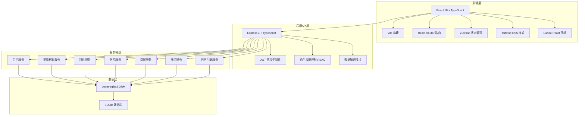
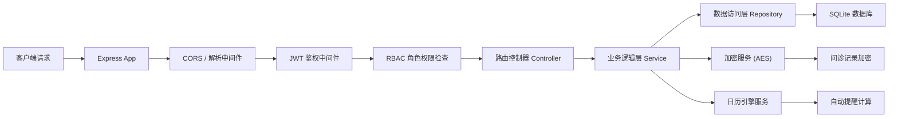
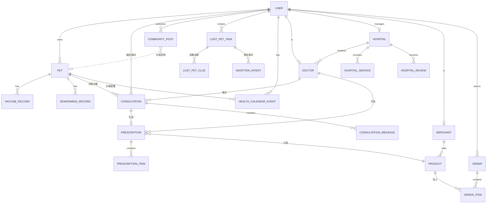

## 1. 架构设计



## 2. 技术栈说明

- **前端框架**: React 18 + TypeScript
- **构建工具**: Vite 5
- **路由管理**: React Router DOM 6
- **状态管理**: Zustand 4
- **样式方案**: Tailwind CSS 3
- **图标库**: Lucide React
- **后端框架**: Express 4 + TypeScript
- **数据库**: SQLite (通过 better-sqlite3 驱动)
- **鉴权方案**: JWT (jsonwebtoken) + bcryptjs 密码加密
- **数据加密**: AES-256 加密敏感医疗数据

## 3. 路由定义

| 路由路径 | 页面/用途 | 权限角色 |
|---------|---------|---------|
| / | 首页仪表盘 | 宠主 |
| /login | 登录页 | 公开 |
| /register | 注册页（角色选择） | 公开 |
| /pets | 宠物档案列表 | 宠主 |
| /pets/:id | 宠物健康详情 | 宠主 |
| /pets/new | 添加新宠物 | 宠主 |
| /consultation | 问诊列表 | 宠主/医生 |
| /consultation/:id | 问诊详情（图文/音视频） | 宠主/医生 |
| /consultation/new | 发起新问诊 | 宠主 |
| /hospitals | 医院列表（地图/列表） | 宠主 |
| /hospitals/:id | 医院详情 | 宠主 |
| /shop | 商城首页 | 宠主 |
| /shop/category/:categoryId | 商品分类列表 | 宠主 |
| /shop/product/:productId | 商品详情 | 宠主 |
| /shop/cart | 购物车 | 宠主 |
| /shop/checkout | 结算页（含处方药验证） | 宠主 |
| /shop/orders | 订单列表 | 宠主/商家 |
| /community | 社区首页 | 宠主 |
| /community/post/:postId | 帖子详情 | 宠主 |
| /community/publish | 发布内容 | 宠主 |
| /community/lost-pet | 寻宠公益列表 | 宠主 |
| /community/lost-pet/:taskId | 寻宠任务详情 | 宠主 |
| /calendar | 健康日历 | 宠主 |
| /doctor/dashboard | 医生工作台首页 | 医生 |
| /doctor/schedule | 排班管理 | 医生 |
| /doctor/patients | 患者管理 | 医生 |
| /doctor/records | 问诊记录（加密） | 医生 |
| /hospital/dashboard | 医院管理首页 | 医院 |
| /hospital/info | POI信息管理 | 医院 |
| /hospital/services | 服务项目定价 | 医院 |
| /hospital/reviews | 评价管理 | 医院 |
| /hospital/doctors | 医生管理 | 医院 |
| /merchant/dashboard | 商家管理首页 | 商家 |
| /merchant/products | SKU商品管理 | 商家 |
| /merchant/qualifications | 资质备案 | 商家 |
| /merchant/orders | 订单处理 | 商家 |

## 4. API 接口定义

### 4.1 类型定义

```typescript
// 共享类型定义 (shared/types.ts)

export type UserRole = 'owner' | 'doctor' | 'hospital' | 'merchant';

export interface User {
  id: string;
  role: UserRole;
  phone: string;
  nickname: string;
  avatar?: string;
  createdAt: string;
}

export interface Pet {
  id: string;
  ownerId: string;
  name: string;
  species: 'dog' | 'cat' | 'rabbit' | 'bird' | 'other';
  breed: string;
  gender: 'male' | 'female';
  birthday: string;
  weight: number;
  avatar?: string;
  healthStatus: 'healthy' | 'sick' | 'chronic';
  vaccineRecords: VaccineRecord[];
  dewormingRecords: DewormingRecord[];
}

export interface VaccineRecord {
  id: string;
  petId: string;
  vaccineName: string;
  date: string;
  nextDate: string;
  hospitalId?: string;
}

export interface DewormingRecord {
  id: string;
  petId: string;
  type: 'internal' | 'external';
  productName: string;
  date: string;
  nextDate: string;
}

export interface Doctor {
  id: string;
  userId: string;
  hospitalId: string;
  name: string;
  title: string;
  department: string;
  licenseNumber: string;
  licenseVerified: boolean;
  rating: number;
  consultationCount: number;
  isOnline: boolean;
}

export interface Consultation {
  id: string;
  ownerId: string;
  doctorId: string;
  petId: string;
  type: 'text' | 'video' | 'audio';
  status: 'pending' | 'ongoing' | 'completed' | 'cancelled';
  symptoms: string;
  diagnosis?: string;
  prescriptionId?: string;
  createdAt: string;
  completedAt?: string;
}

export interface Prescription {
  id: string;
  consultationId: string;
  doctorId: string;
  ownerId: string;
  petId: string;
  medicines: PrescriptionItem[];
  doctorSignature: string;
  ownerAcknowledged: boolean;
  createdAt: string;
}

export interface PrescriptionItem {
  productId: string;
  productName: string;
  dosage: string;
  frequency: string;
  duration: string;
  isPrescription: boolean;
}

export interface Hospital {
  id: string;
  userId: string;
  name: string;
  address: string;
  latitude: number;
  longitude: number;
  phone: string;
  businessHours: string;
  rating: number;
  reviewCount: number;
  services: HospitalService[];
  verified: boolean;
}

export interface HospitalService {
  id: string;
  hospitalId: string;
  name: string;
  description: string;
  price: number;
  duration: number;
}

export interface Product {
  id: string;
  merchantId: string;
  name: string;
  category: string;
  species: string[];
  ageRange: string;
  healthCondition: string[];
  price: number;
  stock: number;
  isPrescription: boolean;
  images: string[];
  description: string;
}

export interface CommunityPost {
  id: string;
  ownerId: string;
  petId?: string;
  content: string;
  images: string[];
  tags: string[];
  vaccineTag?: string;
  dewormingTag?: string;
  likes: number;
  comments: number;
  createdAt: string;
}

export interface LostPetTask {
  id: string;
  ownerId: string;
  petName: string;
  species: string;
  description: string;
  lastSeenLocation: { lat: number; lng: number; address: string };
  lastSeenTime: string;
  reward: number;
  status: 'searching' | 'found' | 'closed';
  clues: LostPetClue[];
  adoptionIntents: AdoptionIntent[];
  createdAt: string;
}

export interface HealthCalendarEvent {
  id: string;
  ownerId: string;
  petId: string;
  type: 'vaccine' | 'deworming' | 'checkup' | 'consultation' | 'custom';
  title: string;
  date: string;
  reminderDays: number;
  completed: boolean;
  relatedId?: string;
}
```

### 4.2 接口列表

| Method | Path | 描述 | 权限 |
|--------|------|------|------|
| POST | /api/auth/login | 用户登录 | 公开 |
| POST | /api/auth/register | 用户注册 | 公开 |
| GET | /api/auth/me | 获取当前用户 | 已登录 |
| GET | /api/pets | 获取宠主宠物列表 | 宠主 |
| POST | /api/pets | 创建宠物档案 | 宠主 |
| GET | /api/pets/:id | 获取宠物详情 | 宠主 |
| PUT | /api/pets/:id | 更新宠物档案 | 宠主 |
| POST | /api/pets/:id/vaccine | 添加疫苗记录 | 宠主/医生 |
| POST | /api/pets/:id/deworming | 添加驱虫记录 | 宠主/医生 |
| GET | /api/doctors | 获取医生列表 | 宠主 |
| GET | /api/doctors/:id | 获取医生详情 | 宠主 |
| GET | /api/consultations | 获取问诊列表 | 宠主/医生 |
| POST | /api/consultations | 发起问诊 | 宠主 |
| GET | /api/consultations/:id | 获取问诊详情 | 宠主/医生 |
| POST | /api/consultations/:id/messages | 发送问诊消息 | 宠主/医生 |
| POST | /api/consultations/:id/prescription | 开具处方 | 医生 |
| POST | /api/consultations/:id/complete | 完成问诊 | 医生 |
| GET | /api/hospitals | 获取医院列表 | 宠主 |
| GET | /api/hospitals/:id | 获取医院详情 | 宠主 |
| GET | /api/hospitals/:id/reviews | 获取医院评价 | 宠主 |
| POST | /api/hospitals/:id/reviews | 提交评价 | 宠主 |
| GET | /api/products | 商品搜索列表 | 宠主 |
| GET | /api/products/:id | 商品详情 | 宠主 |
| POST | /api/orders | 创建订单 | 宠主 |
| POST | /api/orders/:id/verify-prescription | 处方药双签验证 | 宠主 |
| GET | /api/orders | 订单列表 | 宠主/商家 |
| GET | /api/community/posts | 社区帖子列表 | 宠主 |
| POST | /api/community/posts | 发布帖子 | 宠主 |
| GET | /api/community/lost-pets | 寻宠任务列表 | 宠主 |
| POST | /api/community/lost-pets | 发布寻宠任务 | 宠主 |
| POST | /api/community/lost-pets/:id/clues | 提交线索 | 宠主 |
| GET | /api/calendar/events | 健康日历事件 | 宠主 |
| POST | /api/calendar/events | 创建日历事件 | 宠主 |
| PUT | /api/calendar/events/:id/complete | 标记完成 | 宠主 |

## 5. 服务器架构



## 6. 数据模型

### 6.1 ER图



### 6.2 DDL 语句

```sql
-- 用户表
CREATE TABLE users (
  id TEXT PRIMARY KEY,
  role TEXT NOT NULL CHECK (role IN ('owner', 'doctor', 'hospital', 'merchant')),
  phone TEXT UNIQUE NOT NULL,
  password_hash TEXT NOT NULL,
  nickname TEXT NOT NULL,
  avatar TEXT,
  created_at TEXT NOT NULL DEFAULT (datetime('now'))
);

-- 宠物表
CREATE TABLE pets (
  id TEXT PRIMARY KEY,
  owner_id TEXT NOT NULL REFERENCES users(id),
  name TEXT NOT NULL,
  species TEXT NOT NULL,
  breed TEXT,
  gender TEXT NOT NULL,
  birthday TEXT,
  weight REAL,
  avatar TEXT,
  health_status TEXT DEFAULT 'healthy',
  created_at TEXT NOT NULL DEFAULT (datetime('now'))
);

-- 疫苗记录表
CREATE TABLE vaccine_records (
  id TEXT PRIMARY KEY,
  pet_id TEXT NOT NULL REFERENCES pets(id),
  vaccine_name TEXT NOT NULL,
  date TEXT NOT NULL,
  next_date TEXT,
  hospital_id TEXT REFERENCES users(id)
);

-- 驱虫记录表
CREATE TABLE deworming_records (
  id TEXT PRIMARY KEY,
  pet_id TEXT NOT NULL REFERENCES pets(id),
  type TEXT NOT NULL CHECK (type IN ('internal', 'external')),
  product_name TEXT NOT NULL,
  date TEXT NOT NULL,
  next_date TEXT
);

-- 医生表
CREATE TABLE doctors (
  id TEXT PRIMARY KEY,
  user_id TEXT NOT NULL REFERENCES users(id),
  hospital_id TEXT REFERENCES users(id),
  name TEXT NOT NULL,
  title TEXT,
  department TEXT,
  license_number TEXT UNIQUE NOT NULL,
  license_verified INTEGER DEFAULT 0,
  rating REAL DEFAULT 5.0,
  consultation_count INTEGER DEFAULT 0,
  is_online INTEGER DEFAULT 0
);

-- 问诊表
CREATE TABLE consultations (
  id TEXT PRIMARY KEY,
  owner_id TEXT NOT NULL REFERENCES users(id),
  doctor_id TEXT NOT NULL REFERENCES users(id),
  pet_id TEXT NOT NULL REFERENCES pets(id),
  type TEXT NOT NULL CHECK (type IN ('text', 'video', 'audio')),
  status TEXT NOT NULL DEFAULT 'pending',
  symptoms TEXT,
  diagnosis TEXT,
  prescription_id TEXT,
  created_at TEXT NOT NULL DEFAULT (datetime('now')),
  completed_at TEXT
);

-- 问诊消息表（内容加密存储）
CREATE TABLE consultation_messages (
  id TEXT PRIMARY KEY,
  consultation_id TEXT NOT NULL REFERENCES consultations(id),
  sender_id TEXT NOT NULL REFERENCES users(id),
  content_encrypted TEXT NOT NULL,
  message_type TEXT NOT NULL DEFAULT 'text',
  created_at TEXT NOT NULL DEFAULT (datetime('now'))
);

-- 处方表
CREATE TABLE prescriptions (
  id TEXT PRIMARY KEY,
  consultation_id TEXT NOT NULL REFERENCES consultations(id),
  doctor_id TEXT NOT NULL REFERENCES users(id),
  owner_id TEXT NOT NULL REFERENCES users(id),
  pet_id TEXT NOT NULL REFERENCES pets(id),
  doctor_signature TEXT NOT NULL,
  owner_acknowledged INTEGER DEFAULT 0,
  created_at TEXT NOT NULL DEFAULT (datetime('now'))
);

-- 处方项目表
CREATE TABLE prescription_items (
  id TEXT PRIMARY KEY,
  prescription_id TEXT NOT NULL REFERENCES prescriptions(id),
  product_id TEXT REFERENCES products(id),
  product_name TEXT NOT NULL,
  dosage TEXT NOT NULL,
  frequency TEXT NOT NULL,
  duration TEXT NOT NULL,
  is_prescription INTEGER DEFAULT 0
);

-- 医院表
CREATE TABLE hospitals (
  id TEXT PRIMARY KEY,
  user_id TEXT NOT NULL REFERENCES users(id),
  name TEXT NOT NULL,
  address TEXT NOT NULL,
  latitude REAL NOT NULL,
  longitude REAL NOT NULL,
  phone TEXT,
  business_hours TEXT,
  rating REAL DEFAULT 5.0,
  review_count INTEGER DEFAULT 0,
  verified INTEGER DEFAULT 0
);

-- 医院服务项目表
CREATE TABLE hospital_services (
  id TEXT PRIMARY KEY,
  hospital_id TEXT NOT NULL REFERENCES users(id),
  name TEXT NOT NULL,
  description TEXT,
  price REAL NOT NULL,
  duration INTEGER
);

-- 医院评价表
CREATE TABLE hospital_reviews (
  id TEXT PRIMARY KEY,
  hospital_id TEXT NOT NULL REFERENCES users(id),
  owner_id TEXT NOT NULL REFERENCES users(id),
  rating INTEGER NOT NULL CHECK (rating >= 1 AND rating <= 5),
  content TEXT,
  is_verified INTEGER DEFAULT 0,
  anti_fraud_score REAL DEFAULT 1.0,
  created_at TEXT NOT NULL DEFAULT (datetime('now'))
);

-- 商家表
CREATE TABLE merchants (
  id TEXT PRIMARY KEY,
  user_id TEXT NOT NULL REFERENCES users(id),
  company_name TEXT NOT NULL,
  business_license TEXT UNIQUE NOT NULL,
  verified INTEGER DEFAULT 0
);

-- 商品表
CREATE TABLE products (
  id TEXT PRIMARY KEY,
  merchant_id TEXT NOT NULL REFERENCES users(id),
  name TEXT NOT NULL,
  category TEXT NOT NULL,
  species TEXT NOT NULL,
  age_range TEXT,
  health_condition TEXT,
  price REAL NOT NULL,
  stock INTEGER NOT NULL DEFAULT 0,
  is_prescription INTEGER DEFAULT 0,
  images TEXT,
  description TEXT
);

-- 订单表
CREATE TABLE orders (
  id TEXT PRIMARY KEY,
  owner_id TEXT NOT NULL REFERENCES users(id),
  prescription_id TEXT REFERENCES prescriptions(id),
  total_amount REAL NOT NULL,
  status TEXT NOT NULL DEFAULT 'pending',
  owner_signature TEXT,
  created_at TEXT NOT NULL DEFAULT (datetime('now'))
);

-- 订单项表
CREATE TABLE order_items (
  id TEXT PRIMARY KEY,
  order_id TEXT NOT NULL REFERENCES orders(id),
  product_id TEXT NOT NULL REFERENCES products(id),
  quantity INTEGER NOT NULL,
  price REAL NOT NULL
);

-- 社区帖子表
CREATE TABLE community_posts (
  id TEXT PRIMARY KEY,
  owner_id TEXT NOT NULL REFERENCES users(id),
  pet_id TEXT REFERENCES pets(id),
  content TEXT NOT NULL,
  images TEXT,
  tags TEXT,
  vaccine_tag TEXT,
  deworming_tag TEXT,
  likes INTEGER DEFAULT 0,
  comments INTEGER DEFAULT 0,
  created_at TEXT NOT NULL DEFAULT (datetime('now'))
);

-- 寻宠任务表
CREATE TABLE lost_pet_tasks (
  id TEXT PRIMARY KEY,
  owner_id TEXT NOT NULL REFERENCES users(id),
  pet_name TEXT NOT NULL,
  species TEXT NOT NULL,
  description TEXT NOT NULL,
  last_seen_lat REAL NOT NULL,
  last_seen_lng REAL NOT NULL,
  last_seen_address TEXT,
  last_seen_time TEXT NOT NULL,
  reward REAL DEFAULT 0,
  status TEXT NOT NULL DEFAULT 'searching',
  created_at TEXT NOT NULL DEFAULT (datetime('now'))
);

-- 寻宠线索表
CREATE TABLE lost_pet_clues (
  id TEXT PRIMARY KEY,
  task_id TEXT NOT NULL REFERENCES lost_pet_tasks(id),
  reporter_id TEXT NOT NULL REFERENCES users(id),
  content TEXT NOT NULL,
  location_lat REAL,
  location_lng REAL,
  verified INTEGER DEFAULT 0,
  created_at TEXT NOT NULL DEFAULT (datetime('now'))
);

-- 领养意向表
CREATE TABLE adoption_intents (
  id TEXT PRIMARY KEY,
  task_id TEXT NOT NULL REFERENCES lost_pet_tasks(id),
  applicant_id TEXT NOT NULL REFERENCES users(id),
  message TEXT,
  level TEXT DEFAULT 'pending' CHECK (level IN ('pending', 'interested', 'verified', 'approved')),
  created_at TEXT NOT NULL DEFAULT (datetime('now'))
);

-- 健康日历事件表
CREATE TABLE health_calendar_events (
  id TEXT PRIMARY KEY,
  owner_id TEXT NOT NULL REFERENCES users(id),
  pet_id TEXT NOT NULL REFERENCES pets(id),
  type TEXT NOT NULL,
  title TEXT NOT NULL,
  date TEXT NOT NULL,
  reminder_days INTEGER DEFAULT 3,
  completed INTEGER DEFAULT 0,
  related_id TEXT,
  created_at TEXT NOT NULL DEFAULT (datetime('now'))
);
```
