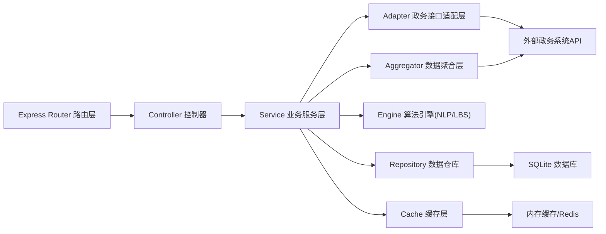
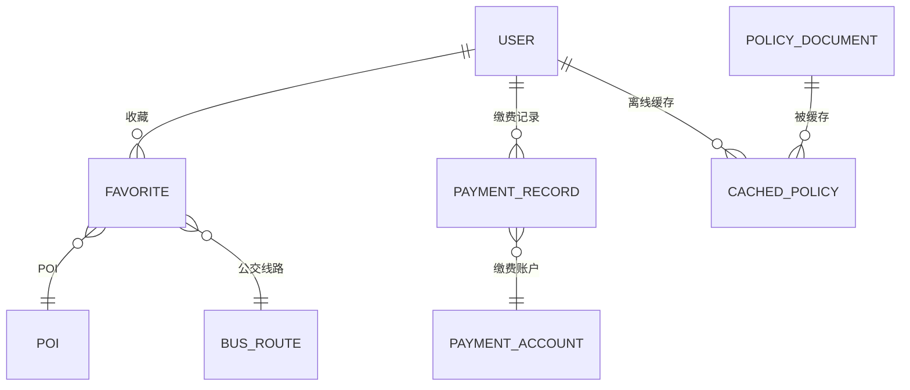

## 1. 架构设计

```mermaid
graph TB
    subgraph "前端展示层"
        A1["React + TypeScript"]
        A2["Tailwind CSS 样式系统"]
        A3["Zustand 状态管理"]
        A4["React Router 路由"]
        A5["Service Worker 离线缓存"]
        A6["Leaflet 地图组件"]
        A7["Recharts 图表库"]
    end

    subgraph "后端服务层 (Express)"
        B1["政务接口适配层"]
        B2["数据聚合编排层"]
        B3["NLP情感分析引擎"]
        B4["LBS智能排序引擎"]
        B5["缓存管理层(Redis/Memory)"]
        B6["电子凭证生成器"]
    end

    subgraph "外部政务系统"
        C1["山东省人社厅 (公积金/社保)"]
        C2["青岛交警支队 (事故快报)"]
        C3["青岛地铁 (运营数据)"]
        C4["青岛公交 (到站预测)"]
        C5["各区缴费系统 (水电气暖宽带)"]
        C6["青青岛社区 (热帖数据)"]
        C7["青岛文旅局 (A级景区)"]
        C8["青岛市场监管局 (餐饮评级)"]
        C9["青岛卫健委 (医疗机构)"]
    end

    subgraph "数据存储层"
        D1["SQLite (业务数据)"]
        D2["IndexedDB (前端离线缓存)"]
        D3["LocalStorage (用户偏好)"]
    end

    A1 --> B1
    A1 --> B2
    A1 --> B4
    A5 --> D2
    B1 --> C1
    B1 --> C5
    B2 --> C2
    B2 --> C3
    B2 --> C4
    B2 --> C7
    B2 --> C8
    B2 --> C9
    B3 --> C6
    B5 --> D1
    B6 --> B1
```



## 2. 技术栈说明

- **前端**：React@18 + TypeScript + TailwindCSS@3 + Vite
- **初始化工具**：vite-init (react-express-ts 模板)
- **后端**：Express@4 + TypeScript (ESM 格式)
- **数据库**：SQLite（本地开发）+ 前端 IndexedDB（离线缓存）
- **状态管理**：Zustand
- **路由**：React Router DOM
- **图表**：Recharts
- **地图**：Leaflet + React-Leaflet
- **图标**：lucide-react
- **离线能力**：Service Worker + Workbox
- **NLP情感分析**：内置中文情感词典 + 简单规则引擎（Mock实现）
- **电子凭证**：PDFKit 生成带签章PDF

## 3. 路由定义

| 路由路径 | 页面组件 | 用途 |
|----------|----------|------|
| / | HomePage | 首页聚合门户，LBS排序服务入口 |
| /social-security | SocialSecurityPage | 公积金/社保查询与电子凭证 |
| /traffic | TrafficPage | 交通事件融合推送 |
| /payment | PaymentPage | 便民缴费网关 |
| /community | CommunityPage | 社区舆情中心 |
| /poi | PoiPage | 本地生活POI图谱 |
| /policies | PoliciesPage | 政策中心与离线阅读 |
| /policies/:id | PolicyDetailPage | 政策详情页 |
| /profile | ProfilePage | 个人中心 |

## 4. API 接口定义

### 4.1 类型定义

```typescript
// 公积金/社保
interface SocialSecurityAccount {
  id: string;
  name: string;
  idCard: string;
  housingFund: {
    balance: number;
    monthlyContribution: number;
    lastDepositDate: string;
    status: 'normal' | 'suspended';
  };
  socialInsurance: {
    pension: { months: number; status: string };
    medical: { months: number; status: string };
    unemployment: { months: number; status: string };
    workInjury: { months: number; status: string };
    maternity: { months: number; status: string };
  };
  contributionHistory: Array<{
    month: string;
    housingFund: number;
    pension: number;
    medical: number;
  }>;
}

// 交通事件
interface TrafficEvent {
  id: string;
  type: 'accident' | 'metro_delay' | 'bus_abnormal' | 'road_condition';
  source: string;
  title: string;
  description: string;
  location: { lat: number; lng: number; address: string };
  severity: 'info' | 'warning' | 'danger';
  timestamp: string;
  expiresAt?: string;
}

// 公交到站预测
interface BusPrediction {
  routeId: string;
  routeName: string;
  stopName: string;
  predictions: Array<{ plateNumber: string; minutes: number; distance: string }>;
}

// 缴费项目
interface PaymentItem {
  id: string;
  category: 'water' | 'electric' | 'gas' | 'heating' | 'broadband';
  categoryName: string;
  district: string;
  accountNumber: string;
  accountName: string;
  amountDue: number;
  dueDate: string;
  status: 'unpaid' | 'paid' | 'overdue';
}

// 社区热帖
interface CommunityPost {
  id: string;
  title: string;
  author: string;
  content: string;
  board: string;
  viewCount: number;
  replyCount: number;
  likeCount: number;
  sentiment: 'positive' | 'neutral' | 'negative';
  sentimentScore: number;
  opinionLevel: 1 | 2 | 3 | 4 | 5;
  keywords: string[];
  publishedAt: string;
}

// POI
interface PointOfInterest {
  id: string;
  type: 'scenic' | 'restaurant' | 'medical';
  name: string;
  rating: string;
  level?: string;
  address: string;
  lat: number;
  lng: number;
  phone?: string;
  source: string;
  tags: string[];
}

// 政策
interface PolicyDocument {
  id: string;
  title: string;
  department: string;
  category: string;
  summary: string;
  content: string;
  publishedAt: string;
  effectiveFrom: string;
  cached: boolean;
}

// 用户位置
interface UserLocation {
  lat: number;
  lng: number;
  district: string;
  address: string;
  accuracy: number;
}
```

### 4.2 后端API端点

| 方法 | 路径 | 描述 |
|------|------|------|
| GET | /api/social-security/:idCard | 查询公积金社保账户信息 |
| GET | /api/social-security/:idCard/history | 缴费历史明细 |
| POST | /api/social-security/:idCard/certificate | 生成电子凭证PDF |
| GET | /api/traffic/events | 获取交通事件列表（融合多源） |
| GET | /api/traffic/bus/:routeId/stop/:stopId | 公交到站预测 |
| GET | /api/payment/accounts?keyword= | 户号模糊搜索 |
| GET | /api/payment/accounts/:accountId | 缴费账单查询 |
| POST | /api/payment/pay | 创建缴费订单 |
| GET | /api/community/posts?sort= | 社区热帖列表 |
| GET | /api/community/dashboard | 舆情看板数据 |
| GET | /api/poi?type=&keyword= | POI列表查询 |
| GET | /api/poi/:id | POI详情 |
| GET | /api/policies | 政策列表 |
| GET | /api/policies/:id | 政策详情 |
| POST | /api/services/rank | 基于LBS的服务排序 |
| GET | /api/weather | 实时天气（首页概览） |
| GET | /api/user/profile | 用户信息 |

## 5. 服务端架构分层



### 5.1 模块分层职责

- **Router**：路由定义、参数校验、鉴权中间件
- **Controller**：请求解析、响应格式化、错误处理
- **Service**：核心业务逻辑、事务编排、数据校验
- **Adapter**：各政务系统API协议转换、签名、重试
- **Aggregator**：多源数据融合、字段映射、去重合并
- **Engine**：NLP情感分析、LBS距离计算与排序算法
- **Repository**：数据库CRUD封装、SQLite操作
- **Cache**：热点数据缓存、TTL管理、缓存失效

## 6. 数据模型

### 6.1 ER图



### 6.2 数据表DDL

```sql
-- 用户表
CREATE TABLE users (
  id INTEGER PRIMARY KEY AUTOINCREMENT,
  phone TEXT UNIQUE NOT NULL,
  name TEXT,
  id_card TEXT UNIQUE,
  verified INTEGER DEFAULT 0,
  district TEXT,
  created_at TEXT DEFAULT CURRENT_TIMESTAMP
);

-- 缴费账户表
CREATE TABLE payment_accounts (
  id INTEGER PRIMARY KEY AUTOINCREMENT,
  user_id INTEGER REFERENCES users(id),
  category TEXT NOT NULL,
  district TEXT NOT NULL,
  account_number TEXT NOT NULL,
  account_name TEXT,
  is_default INTEGER DEFAULT 0,
  created_at TEXT DEFAULT CURRENT_TIMESTAMP,
  UNIQUE(category, account_number)
);

-- 缴费记录表
CREATE TABLE payment_records (
  id INTEGER PRIMARY KEY AUTOINCREMENT,
  user_id INTEGER REFERENCES users(id),
  account_id INTEGER REFERENCES payment_accounts(id),
  amount REAL NOT NULL,
  status TEXT NOT NULL,
  order_no TEXT UNIQUE,
  paid_at TEXT,
  created_at TEXT DEFAULT CURRENT_TIMESTAMP
);

-- 收藏表
CREATE TABLE favorites (
  id INTEGER PRIMARY KEY AUTOINCREMENT,
  user_id INTEGER REFERENCES users(id),
  target_type TEXT NOT NULL,
  target_id TEXT NOT NULL,
  target_data TEXT,
  created_at TEXT DEFAULT CURRENT_TIMESTAMP,
  UNIQUE(user_id, target_type, target_id)
);

-- 政策缓存表
CREATE TABLE cached_policies (
  id INTEGER PRIMARY KEY AUTOINCREMENT,
  user_id INTEGER REFERENCES users(id),
  policy_id TEXT UNIQUE NOT NULL,
  policy_data TEXT NOT NULL,
  cached_at TEXT DEFAULT CURRENT_TIMESTAMP,
  expires_at TEXT
);

-- 创建索引
CREATE INDEX idx_payment_accounts_user ON payment_accounts(user_id);
CREATE INDEX idx_payment_records_user ON payment_records(user_id);
CREATE INDEX idx_favorites_user ON favorites(user_id);
CREATE INDEX idx_cached_policies_user ON cached_policies(user_id);
```
