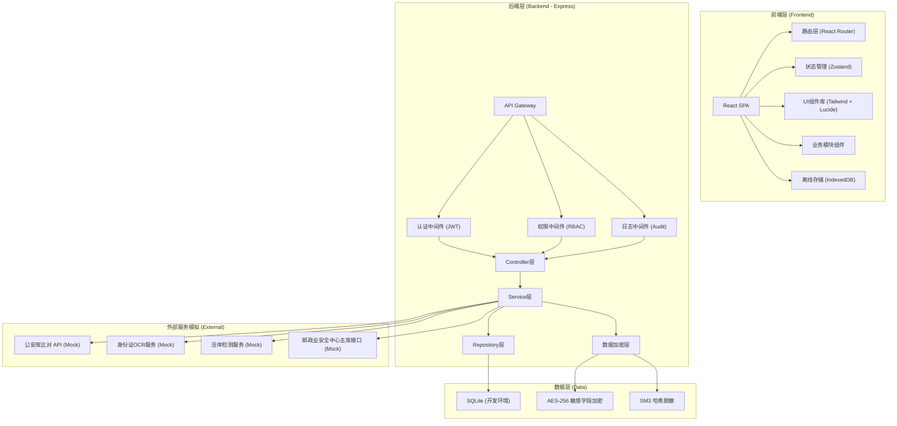
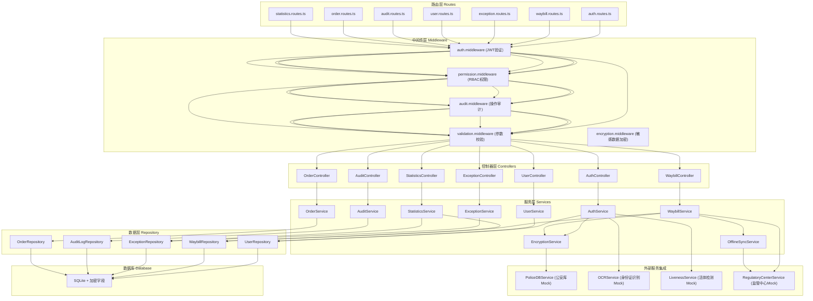
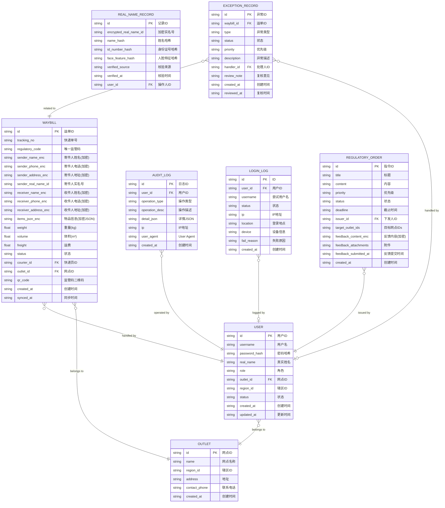

# 国家邮政业实名寄递数字监管平台 - 收寄端系统 技术架构文档

## 1. 架构设计



## 2. 技术说明

- **前端框架**：React@18 + TypeScript@5 + Vite@5
- **后端框架**：Express@4 + TypeScript@5
- **初始化工具**：vite-init (react-express-ts 模板)
- **样式方案**：Tailwind CSS@3 + CSS Variables
- **状态管理**：Zustand (轻量级状态管理)
- **路由方案**：React Router DOM@6
- **图标库**：Lucide React
- **数据库**：SQLite (开发环境，Mock数据)
- **图表库**：Recharts (数据可视化)
- **二维码生成**：qrcode.react
- **离线存储**：localStorage + IndexedDB (模拟离线作业)
- **HTTP客户端**：Axios
- **加密方案**：crypto-js (AES-256加密敏感字段)
- **数据校验**：Zod

## 3. 路由定义

| 路由路径 | 页面用途 | 访问角色 |
|----------|----------|----------|
| /login | 登录认证页 | 所有角色（公开） |
| /dashboard | 首页仪表盘 | 快递员、网点管理员、区域监管员、总部审计员 |
| /authentication | 实名认证页 | 快递员、网点管理员 |
| /waybill/new | 新建运单页 | 快递员 |
| /waybill/list | 运单列表页 | 所有角色 |
| /waybill/:id | 电子运单详情页 | 所有角色 |
| /exception/list | 异常件列表页 | 网点管理员、区域监管员 |
| /exception/review | 异常件人工复核页 | 网点管理员、区域监管员 |
| /admin/users | 人员权限管理页 | 区域监管员、总部审计员 |
| /admin/audit/logs | 操作日志审计页 | 区域监管员、总部审计员 |
| /admin/audit/login | 登录日志审计页 | 区域监管员、总部审计员 |
| /admin/orders | 监管指令管理页 | 所有角色 |
| /admin/statistics | 数据统计报表页 | 网点管理员、区域监管员、总部审计员 |
| /profile | 个人中心 | 所有角色 |

## 4. API 定义

### 4.1 认证相关

```typescript
// POST /api/auth/login
interface LoginRequest {
  username: string;
  password: string;
  captcha: string;
}

interface LoginResponse {
  token: string;
  user: {
    id: string;
    username: string;
    realName: string;
    role: 'courier' | 'outlet_admin' | 'regional_supervisor' | 'head_auditor';
    outletId?: string;
    regionId?: string;
  };
}

// POST /api/auth/logout
interface LogoutResponse {
  success: boolean;
}
```

### 4.2 实名认证相关

```typescript
// POST /api/auth/idcard/ocr
interface OcrRequest {
  imageBase64: string;
  side: 'front' | 'back';
}

interface OcrResponse {
  name: string;
  idNumber: string;
  gender: string;
  ethnicity: string;
  birthDate: string;
  address: string;
  issuingAuthority: string;
  validPeriod: string;
  confidence: number;
}

// POST /api/auth/liveness
interface LivenessRequest {
  videoFrames: string[];
  actionSequence: string[];
}

interface LivenessResponse {
  passed: boolean;
  livenessScore: number;
  faceFeatureHash: string;
}

// POST /api/auth/verify
interface VerifyRequest {
  ocrData: OcrResponse;
  livenessToken: string;
}

interface VerifyResponse {
  verified: boolean;
  encryptedRealNameId: string;
  verifyTime: string;
  source: 'police_db' | 'local_cache';
}
```

### 4.3 运单相关

```typescript
// POST /api/waybill
interface CreateWaybillRequest {
  sender: {
    name: string;
    phone: string;
    address: string;
    realNameId?: string;
  };
  receiver: {
    name: string;
    phone: string;
    address: string;
  };
  items: {
    category: string;
    name: string;
    quantity: number;
    declaredValue: number;
    isProhibited: boolean;
    prohibitedNote?: string;
  }[];
  weight: number;
  volume?: number;
  freight: number;
}

interface WaybillResponse {
  id: string;
  trackingNo: string;
  regulatoryCode: string;
  qrCodeUrl: string;
  status: 'created' | 'synced' | 'pending_sync';
  createdAt: string;
  encryptedData: string;
}

// GET /api/waybill
interface ListWaybillRequest {
  page: number;
  pageSize: number;
  status?: string;
  startDate?: string;
  endDate?: string;
  keyword?: string;
}

interface ListWaybillResponse {
  list: WaybillResponse[];
  total: number;
  page: number;
  pageSize: number;
}

// POST /api/waybill/batch-sync
interface BatchSyncRequest {
  waybillIds: string[];
}

interface BatchSyncResponse {
  successCount: number;
  failedCount: number;
  failedItems: { id: string; reason: string }[];
}
```

### 4.4 异常件相关

```typescript
// GET /api/exceptions
interface ListExceptionRequest {
  page: number;
  pageSize: number;
  type?: 'id_suspicious' | 'address_ambiguous' | 'prohibited_item' | 'liveness_failed';
  status?: 'pending' | 'reviewing' | 'resolved' | 'rejected';
  priority?: 'high' | 'medium' | 'low';
}

interface ExceptionItem {
  id: string;
  waybillId: string;
  type: string;
  status: string;
  priority: string;
  description: string;
  createdAt: string;
  handlerId?: string;
  reviewNote?: string;
}

// POST /api/exceptions/:id/review
interface ReviewExceptionRequest {
  action: 'approve' | 'reject' | 'escalate';
  note: string;
}

interface ReviewExceptionResponse {
  id: string;
  status: string;
  reviewedAt: string;
  reviewedBy: string;
}
```

### 4.5 人员权限相关

```typescript
// GET /api/users
interface ListUserRequest {
  page: number;
  pageSize: number;
  role?: string;
  outletId?: string;
  status?: 'active' | 'disabled';
}

interface User {
  id: string;
  username: string;
  realName: string;
  role: string;
  roleName: string;
  outletId?: string;
  outletName?: string;
  regionId?: string;
  status: string;
  createdAt: string;
}

// POST /api/users
interface CreateUserRequest {
  username: string;
  password: string;
  realName: string;
  role: string;
  outletId?: string;
  regionId?: string;
}

// PUT /api/users/:id/permissions
interface UpdatePermissionsRequest {
  menuPermissions: string[];
  dataScope: 'all' | 'region' | 'outlet' | 'self';
}
```

### 4.6 日志审计相关

```typescript
// GET /api/audit/logs
interface ListAuditLogRequest {
  page: number;
  pageSize: number;
  operationType?: string;
  userId?: string;
  startDate?: string;
  endDate?: string;
  keyword?: string;
}

interface AuditLog {
  id: string;
  userId: string;
  userName: string;
  operationType: string;
  operationDesc: string;
  ip: string;
  userAgent: string;
  createdAt: string;
  detail: Record<string, unknown>;
}

// GET /api/audit/login-logs
interface ListLoginLogRequest {
  page: number;
  pageSize: number;
  userId?: string;
  status?: 'success' | 'failed';
  startDate?: string;
  endDate?: string;
}

interface LoginLog {
  id: string;
  userId?: string;
  username: string;
  status: string;
  ip: string;
  location: string;
  device: string;
  createdAt: string;
  failReason?: string;
}
```

### 4.7 监管指令相关

```typescript
// GET /api/orders
interface ListRegulatoryOrderRequest {
  page: number;
  pageSize: number;
  status?: 'pending' | 'executing' | 'submitted' | 'approved' | 'rejected';
  priority?: 'urgent' | 'normal' | 'low';
  issuerId?: string;
}

interface RegulatoryOrder {
  id: string;
  title: string;
  content: string;
  priority: string;
  status: string;
  deadline: string;
  issuerId: string;
  issuerName: string;
  targetOutletIds: string[];
  createdAt: string;
  feedback?: {
    content: string;
    attachments: string[];
    submittedAt: string;
  };
}

// POST /api/orders/:id/feedback
interface OrderFeedbackRequest {
  content: string;
  attachments: string[];
}
```

### 4.8 统计相关

```typescript
// GET /api/statistics/overview
interface OverviewStatistics {
  todayShipments: number;
  todayShipmentsTrend: number;
  authPassRate: number;
  authPassRateTrend: number;
  exceptionCount: number;
  exceptionCountTrend: number;
  pendingSyncCount: number;
}

// GET /api/statistics/shipment-trend
interface ShipmentTrendResponse {
  dates: string[];
  counts: number[];
  authCounts: number[];
}

// GET /api/statistics/exception-distribution
interface ExceptionDistributionResponse {
  types: { name: string; value: number; color: string }[];
}
```

## 5. 服务端架构图



## 6. 数据模型

### 6.1 实体关系图



### 6.2 数据库初始化 SQL

```sql
-- 网点表
CREATE TABLE IF NOT EXISTS outlets (
  id TEXT PRIMARY KEY,
  name TEXT NOT NULL,
  region_id TEXT NOT NULL,
  address TEXT,
  contact_phone TEXT,
  created_at TEXT NOT NULL DEFAULT (datetime('now'))
);

-- 用户表
CREATE TABLE IF NOT EXISTS users (
  id TEXT PRIMARY KEY,
  username TEXT UNIQUE NOT NULL,
  password_hash TEXT NOT NULL,
  real_name TEXT NOT NULL,
  role TEXT NOT NULL CHECK (role IN ('courier', 'outlet_admin', 'regional_supervisor', 'head_auditor')),
  outlet_id TEXT REFERENCES outlets(id),
  region_id TEXT,
  status TEXT NOT NULL DEFAULT 'active' CHECK (status IN ('active', 'disabled')),
  created_at TEXT NOT NULL DEFAULT (datetime('now')),
  updated_at TEXT NOT NULL DEFAULT (datetime('now'))
);

-- 运单表
CREATE TABLE IF NOT EXISTS waybills (
  id TEXT PRIMARY KEY,
  tracking_no TEXT UNIQUE NOT NULL,
  regulatory_code TEXT UNIQUE NOT NULL,
  sender_name_enc TEXT NOT NULL,
  sender_phone_enc TEXT NOT NULL,
  sender_address_enc TEXT NOT NULL,
  sender_real_name_id TEXT,
  receiver_name_enc TEXT NOT NULL,
  receiver_phone_enc TEXT NOT NULL,
  receiver_address_enc TEXT NOT NULL,
  items_json_enc TEXT NOT NULL,
  weight REAL NOT NULL,
  volume REAL,
  freight REAL NOT NULL,
  status TEXT NOT NULL DEFAULT 'created' CHECK (status IN ('created', 'synced', 'pending_sync')),
  courier_id TEXT REFERENCES users(id),
  outlet_id TEXT REFERENCES outlets(id),
  qr_code TEXT,
  created_at TEXT NOT NULL DEFAULT (datetime('now')),
  synced_at TEXT
);

-- 实名认证记录表
CREATE TABLE IF NOT EXISTS real_name_records (
  id TEXT PRIMARY KEY,
  encrypted_real_name_id TEXT UNIQUE NOT NULL,
  name_hash TEXT NOT NULL,
  id_number_hash TEXT NOT NULL,
  face_feature_hash TEXT,
  verified_source TEXT NOT NULL,
  verified_at TEXT NOT NULL DEFAULT (datetime('now')),
  user_id TEXT REFERENCES users(id)
);

-- 异常件表
CREATE TABLE IF NOT EXISTS exception_records (
  id TEXT PRIMARY KEY,
  waybill_id TEXT REFERENCES waybills(id),
  type TEXT NOT NULL CHECK (type IN ('id_suspicious', 'address_ambiguous', 'prohibited_item', 'liveness_failed')),
  status TEXT NOT NULL DEFAULT 'pending' CHECK (status IN ('pending', 'reviewing', 'resolved', 'rejected')),
  priority TEXT NOT NULL DEFAULT 'medium' CHECK (priority IN ('high', 'medium', 'low')),
  description TEXT,
  handler_id TEXT REFERENCES users(id),
  review_note TEXT,
  created_at TEXT NOT NULL DEFAULT (datetime('now')),
  reviewed_at TEXT
);

-- 操作审计日志表
CREATE TABLE IF NOT EXISTS audit_logs (
  id TEXT PRIMARY KEY,
  user_id TEXT REFERENCES users(id),
  operation_type TEXT NOT NULL,
  operation_desc TEXT NOT NULL,
  detail_json TEXT,
  ip TEXT,
  user_agent TEXT,
  created_at TEXT NOT NULL DEFAULT (datetime('now'))
);

-- 登录日志表
CREATE TABLE IF NOT EXISTS login_logs (
  id TEXT PRIMARY KEY,
  user_id TEXT REFERENCES users(id),
  username TEXT NOT NULL,
  status TEXT NOT NULL CHECK (status IN ('success', 'failed')),
  ip TEXT,
  location TEXT,
  device TEXT,
  fail_reason TEXT,
  created_at TEXT NOT NULL DEFAULT (datetime('now'))
);

-- 监管指令表
CREATE TABLE IF NOT EXISTS regulatory_orders (
  id TEXT PRIMARY KEY,
  title TEXT NOT NULL,
  content TEXT NOT NULL,
  priority TEXT NOT NULL DEFAULT 'normal' CHECK (priority IN ('urgent', 'normal', 'low')),
  status TEXT NOT NULL DEFAULT 'pending' CHECK (status IN ('pending', 'executing', 'submitted', 'approved', 'rejected')),
  deadline TEXT NOT NULL,
  issuer_id TEXT REFERENCES users(id),
  target_outlet_ids TEXT NOT NULL,
  feedback_content_enc TEXT,
  feedback_attachments TEXT,
  feedback_submitted_at TEXT,
  created_at TEXT NOT NULL DEFAULT (datetime('now'))
);

-- 创建索引
CREATE INDEX IF NOT EXISTS idx_waybills_courier ON waybills(courier_id);
CREATE INDEX IF NOT EXISTS idx_waybills_outlet ON waybills(outlet_id);
CREATE INDEX IF NOT EXISTS idx_waybills_status ON waybills(status);
CREATE INDEX IF NOT EXISTS idx_waybills_created ON waybills(created_at);
CREATE INDEX IF NOT EXISTS idx_exceptions_status ON exception_records(status);
CREATE INDEX IF NOT EXISTS idx_exceptions_type ON exception_records(type);
CREATE INDEX IF NOT EXISTS idx_exceptions_priority ON exception_records(priority);
CREATE INDEX IF NOT EXISTS idx_audit_logs_user ON audit_logs(user_id);
CREATE INDEX IF NOT EXISTS idx_audit_logs_type ON audit_logs(operation_type);
CREATE INDEX IF NOT EXISTS idx_audit_logs_created ON audit_logs(created_at);
CREATE INDEX IF NOT EXISTS idx_login_logs_user ON login_logs(user_id);
CREATE INDEX IF NOT EXISTS idx_login_logs_status ON login_logs(status);
CREATE INDEX IF NOT EXISTS idx_users_role ON users(role);
CREATE INDEX IF NOT EXISTS idx_users_outlet ON users(outlet_id);
CREATE INDEX IF NOT EXISTS idx_orders_status ON regulatory_orders(status);
CREATE INDEX IF NOT EXISTS idx_orders_priority ON regulatory_orders(priority);
```
