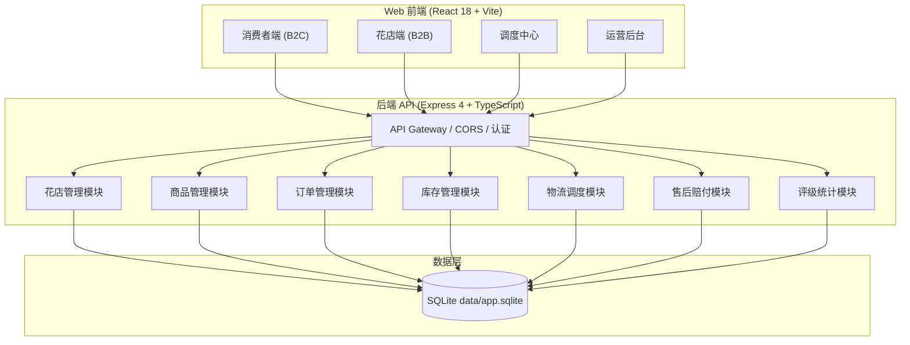
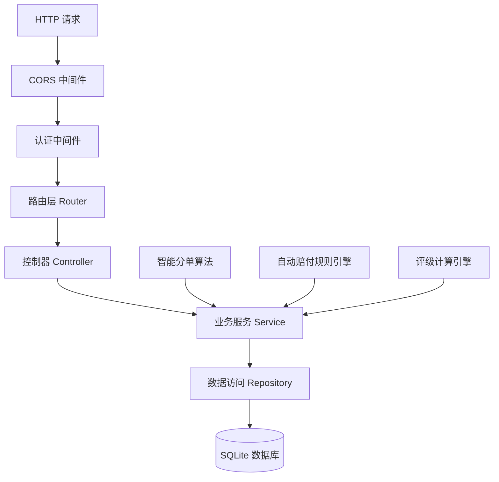
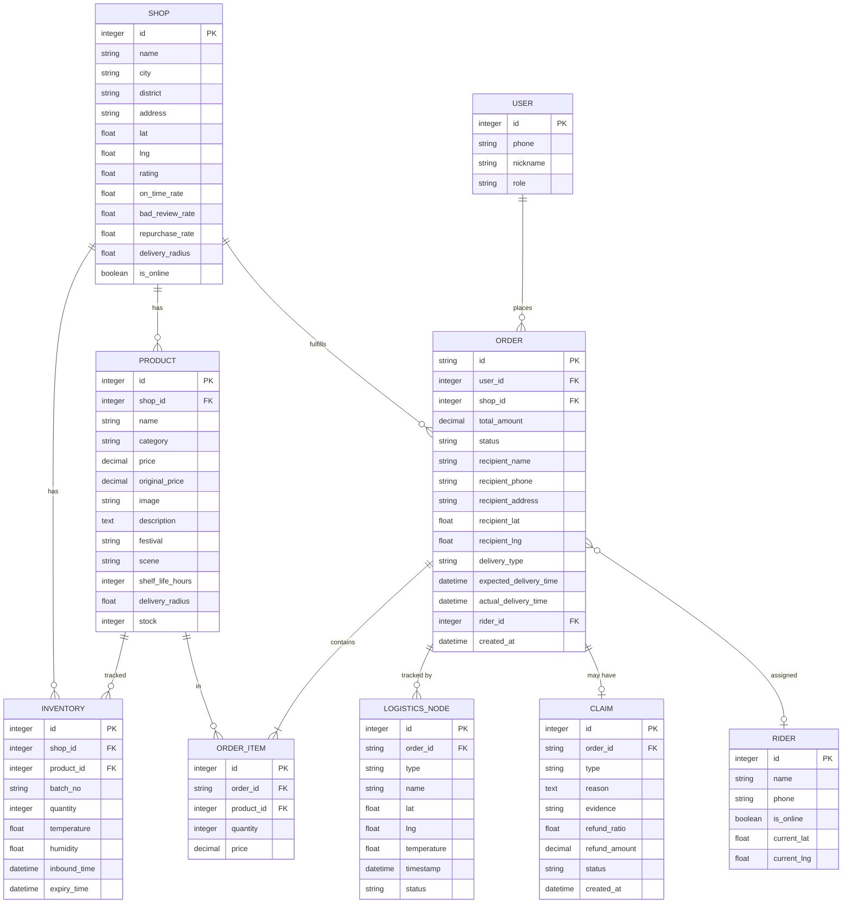

## 1. 架构设计



## 2. 技术描述
- 前端：React 18 + TypeScript + Vite 5 + TailwindCSS 3 + React Router 6 + Zustand + lucide-react
- 初始化工具：vite-init react-express-ts 模板
- 后端：Express 4 + TypeScript + better-sqlite3
- 数据库：SQLite 3 (data/app.sqlite)，无需额外服务
- 端口配置：
  - tail4 = 9057（项目目录 may-89057 后四位
  - FRONTEND_PORT = 49057（40000 + 9057
  - BACKEND_PORT = 59057（50000 + 9057
  - 备用槽位：41000/51000、42000/52000、43000/53000、44000/54000、45000/55000 加 9057

## 3. 路由定义
| 前端路由 | 页面 | 说明 |
|-------|------|------|
| / | 消费者首页 | 商品列表、筛选 |
| /product/:id | 商品详情页 | 商品信息、养护指南 |
| /checkout | 下单页 | 地址、配送时间 |
| /orders | 订单列表 | 我的订单 |
| /orders/:id | 订单详情 | 物流追踪 |
| /shop | 花店工作台 | 订单管理、打印 |
| /shop/inventory | 库存管理 | 损耗登记 |
| /shop/exception | 异常上报 | 凭证上传 |
| /dispatch | 调度中心 | 智能分单、温控监控 |
| /dispatch/claims | 售后赔付 | 赔付规则 |
| /admin | 运营后台 | 花店评级、热销榜 |

| 后端 API 路由 | 方法 | 说明 |
|-------|------|------|
| /api/health | GET | 健康检查 |
| /api/shops | GET | 花店列表（支持按位置筛选） |
| /api/shops/:id | GET | 花店详情 |
| /api/products | GET | 商品列表（支持节日/场景/价格带筛选） |
| /api/products/:id | GET | 商品详情 |
| /api/inventory | GET | 实时库存查询 |
| /api/orders | GET/POST | 订单列表/创建订单 |
| /api/orders/:id | GET/PUT | 订单详情/状态更新 |
| /api/orders/:id/tracking | GET | 物流追踪 |
| /api/dispatch/assign | POST | 智能分单 |
| /api/dispatch/temperature | GET | 温控数据 |
| /api/claims | GET/POST | 售后赔付 |
| /api/admin/ratings | GET | 花店评级 |
| /api/admin/hot-sales | GET | 区域热销榜 |

## 4. API 类型定义

```typescript
// 花店
interface Shop {
  id: number;
  name: string;
  city: string;
  district: string;
  address: string;
  lat: number;
  lng: number;
  rating: number;
  onTimeRate: number;
  badReviewRate: number;
  repurchaseRate: number;
  deliveryRadius: number; // km
  isOnline: boolean;
}

// 商品
interface Product {
  id: number;
  shopId: number;
  name: string;
  category: 'flower' | 'cake' | 'gift';
  price: number;
  originalPrice: number;
  image: string;
  description: string;
  festival: string[]; // 情人节/母亲节等
  scene: string[]; // 生日/告白等
  shelfLifeHours: number; // 保鲜期（小时）
  deliveryRadius: number;
  stock: number;
}

// 订单
interface Order {
  id: string;
  userId: number;
  shopId: number;
  productId: number;
  quantity: number;
  totalAmount: number;
  status: 'pending' | 'paid' | 'accepted' | 'preparing' | 'picked' | 'delivering' | 'completed' | 'cancelled' | 'refunded';
  recipientName: string;
  recipientPhone: string;
  recipientAddress: string;
  recipientLat: number;
  recipientLng: number;
  deliveryType: 'instant' | 'next-day';
  expectedDeliveryTime: Date;
  actualDeliveryTime?: Date;
  riderId?: number;
  createdAt: Date;
}

// 库存
interface Inventory {
  id: number;
  shopId: number;
  productId: number;
  batchNo: string;
  quantity: number;
  temperature: number; // 冷藏温度
  humidity: number; // 湿度
  inboundTime: Date;
  expiryTime: Date;
}

// 物流节点
interface LogisticsNode {
  id: number;
  orderId: string;
  type: 'sorting' | 'rider' | 'cold-chain';
  name: string;
  lat: number;
  lng: number;
  temperature?: number;
  timestamp: Date;
  status: string;
}

// 售后赔付
interface Claim {
  id: number;
  orderId: string;
  type: 'timeout' | 'damaged' | 'rejected';
  reason: string;
  evidence?: string;
  refundRatio: number; // 0-1
  refundAmount: number;
  status: 'pending' | 'approved' | 'rejected';
  createdAt: Date;
}
```

## 5. 服务器架构



## 6. 数据模型

### 6.1 ER 图



### 6.2 DDL 语句

```sql
-- 花店表
CREATE TABLE shops (
  id INTEGER PRIMARY KEY AUTOINCREMENT,
  name TEXT NOT NULL,
  city TEXT NOT NULL,
  district TEXT NOT NULL,
  address TEXT NOT NULL,
  lat REAL NOT NULL,
  lng REAL NOT NULL,
  rating REAL DEFAULT 5.0,
  on_time_rate REAL DEFAULT 0.95,
  bad_review_rate REAL DEFAULT 0.02,
  repurchase_rate REAL DEFAULT 0.3,
  delivery_radius REAL DEFAULT 5.0,
  is_online INTEGER DEFAULT 1,
  created_at DATETIME DEFAULT CURRENT_TIMESTAMP
);

-- 商品表
CREATE TABLE products (
  id INTEGER PRIMARY KEY AUTOINCREMENT,
  shop_id INTEGER NOT NULL,
  name TEXT NOT NULL,
  category TEXT NOT NULL CHECK (category IN ('flower', 'cake', 'gift')),
  price REAL NOT NULL,
  original_price REAL NOT NULL,
  image TEXT NOT NULL,
  description TEXT,
  festival TEXT, -- JSON array
  scene TEXT, -- JSON array
  shelf_life_hours INTEGER NOT NULL,
  delivery_radius REAL NOT NULL,
  stock INTEGER NOT NULL DEFAULT 0,
  created_at DATETIME DEFAULT CURRENT_TIMESTAMP,
  FOREIGN KEY (shop_id) REFERENCES shops(id)
);

-- 库存表
CREATE TABLE inventory (
  id INTEGER PRIMARY KEY AUTOINCREMENT,
  shop_id INTEGER NOT NULL,
  product_id INTEGER NOT NULL,
  batch_no TEXT NOT NULL,
  quantity INTEGER NOT NULL,
  temperature REAL NOT NULL,
  humidity REAL NOT NULL,
  inbound_time DATETIME NOT NULL,
  expiry_time DATETIME NOT NULL,
  FOREIGN KEY (shop_id) REFERENCES shops(id),
  FOREIGN KEY (product_id) REFERENCES products(id)
);

-- 用户表
CREATE TABLE users (
  id INTEGER PRIMARY KEY AUTOINCREMENT,
  phone TEXT UNIQUE NOT NULL,
  nickname TEXT,
  role TEXT NOT NULL DEFAULT 'customer',
  password_hash TEXT,
  created_at DATETIME DEFAULT CURRENT_TIMESTAMP
);

-- 订单表
CREATE TABLE orders (
  id TEXT PRIMARY KEY,
  user_id INTEGER NOT NULL,
  shop_id INTEGER NOT NULL,
  total_amount REAL NOT NULL,
  status TEXT NOT NULL DEFAULT 'pending',
  recipient_name TEXT NOT NULL,
  recipient_phone TEXT NOT NULL,
  recipient_address TEXT NOT NULL,
  recipient_lat REAL NOT NULL,
  recipient_lng REAL NOT NULL,
  delivery_type TEXT NOT NULL CHECK (delivery_type IN ('instant', 'next-day')),
  expected_delivery_time DATETIME NOT NULL,
  actual_delivery_time DATETIME,
  rider_id INTEGER,
  created_at DATETIME DEFAULT CURRENT_TIMESTAMP,
  FOREIGN KEY (user_id) REFERENCES users(id),
  FOREIGN KEY (shop_id) REFERENCES shops(id)
);

-- 订单项表
CREATE TABLE order_items (
  id INTEGER PRIMARY KEY AUTOINCREMENT,
  order_id TEXT NOT NULL,
  product_id INTEGER NOT NULL,
  quantity INTEGER NOT NULL,
  price REAL NOT NULL,
  FOREIGN KEY (order_id) REFERENCES orders(id),
  FOREIGN KEY (product_id) REFERENCES products(id)
);

-- 物流节点表
CREATE TABLE logistics_nodes (
  id INTEGER PRIMARY KEY AUTOINCREMENT,
  order_id TEXT NOT NULL,
  type TEXT NOT NULL CHECK (type IN ('sorting', 'rider', 'cold-chain')),
  name TEXT NOT NULL,
  lat REAL NOT NULL,
  lng REAL NOT NULL,
  temperature REAL,
  timestamp DATETIME NOT NULL,
  status TEXT NOT NULL,
  FOREIGN KEY (order_id) REFERENCES orders(id)
);

-- 售后赔付表
CREATE TABLE claims (
  id INTEGER PRIMARY KEY AUTOINCREMENT,
  order_id TEXT NOT NULL,
  type TEXT NOT NULL CHECK (type IN ('timeout', 'damaged', 'rejected')),
  reason TEXT NOT NULL,
  evidence TEXT,
  refund_ratio REAL NOT NULL,
  refund_amount REAL NOT NULL,
  status TEXT NOT NULL DEFAULT 'pending',
  created_at DATETIME DEFAULT CURRENT_TIMESTAMP,
  FOREIGN KEY (order_id) REFERENCES orders(id)
);

-- 骑手表
CREATE TABLE riders (
  id INTEGER PRIMARY KEY AUTOINCREMENT,
  name TEXT NOT NULL,
  phone TEXT NOT NULL,
  is_online INTEGER DEFAULT 1,
  current_lat REAL,
  current_lng REAL,
  created_at DATETIME DEFAULT CURRENT_TIMESTAMP
);

-- 花材损耗表
CREATE TABLE wastage (
  id INTEGER PRIMARY KEY AUTOINCREMENT,
  shop_id INTEGER NOT NULL,
  product_id INTEGER NOT NULL,
  batch_no TEXT NOT NULL,
  quantity INTEGER NOT NULL,
  reason TEXT NOT NULL,
  recorded_at DATETIME DEFAULT CURRENT_TIMESTAMP,
  FOREIGN KEY (shop_id) REFERENCES shops(id),
  FOREIGN KEY (product_id) REFERENCES products(id)
);

-- 配送异常表
CREATE TABLE exceptions (
  id INTEGER PRIMARY KEY AUTOINCREMENT,
  order_id TEXT NOT NULL,
  type TEXT NOT NULL,
  description TEXT NOT NULL,
  evidence TEXT,
  reported_by INTEGER NOT NULL,
  reported_at DATETIME DEFAULT CURRENT_TIMESTAMP,
  FOREIGN KEY (order_id) REFERENCES orders(id)
);

-- 索引
CREATE INDEX idx_orders_shop_id ON orders(shop_id);
CREATE INDEX idx_orders_user_id ON orders(user_id);
CREATE INDEX idx_orders_status ON orders(status);
CREATE INDEX idx_products_shop_id ON products(shop_id);
CREATE INDEX idx_products_category ON products(category);
CREATE INDEX idx_logistics_order_id ON logistics_nodes(order_id);
```
