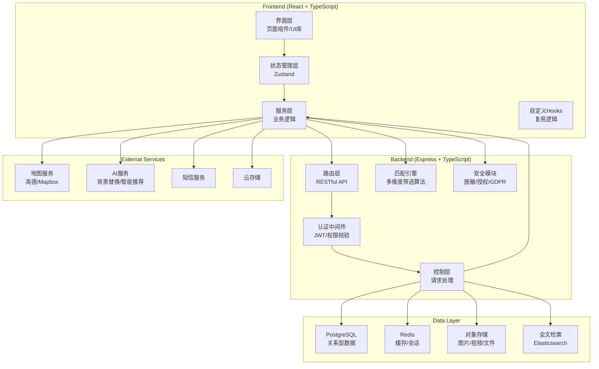

## 1. 架构设计



## 2. 技术栈描述

### 2.1 前端技术
- **框架**: React 18 + TypeScript 5
- **构建工具**: Vite 5
- **路由**: React Router DOM 6
- **状态管理**: Zustand 4
- **样式**: Tailwind CSS 3 + SCSS
- **UI组件**: Radix UI (基础组件) + 自定义业务组件
- **图标**: Lucide React
- **拖拽**: @dnd-kit/core + @dnd-kit/sortable
- **地图**: @vis.gl/react-google-maps
- **富文本**: @tiptap/react
- **日期**: date-fns + react-day-picker
- **图表**: Recharts
- **表单**: react-hook-form + zod

### 2.2 后端技术
- **框架**: Express 4 + TypeScript
- **ORM**: Prisma 5
- **数据库**: PostgreSQL 16
- **缓存**: Redis 7
- **认证**: jsonwebtoken + bcrypt
- **文件上传**: multer
- **校验**: zod
- **日志**: winston
- **安全**: helmet + cors + rate-limit

### 2.3 开发工具
- **包管理器**: pnpm
- **代码规范**: ESLint + Prettier
- **Git Hooks**: husky + lint-staged
- **测试**: Vitest + Supertest

## 3. 路由定义

| 路由路径 | 页面组件 | 功能说明 |
|----------|----------|----------|
| `/` | Dashboard | 首页仪表盘 |
| `/login` | Login | 登录页 |
| `/register` | Register | 注册页 |
| `/artists` | ArtistList | 艺人列表/人才库 |
| `/artists/:id` | ArtistDetail | 艺人档案详情 |
| `/artists/:id/edit` | ArtistEdit | 艺人档案编辑 |
| `/profile` | ArtistProfile | 个人档案管理 |
| `/profile/schedule` | ScheduleCalendar | 档期日历管理 |
| `/model-cards` | ModelCardList | 模卡模板库 |
| `/model-cards/create` | ModelCardEditor | 模卡编辑器 |
| `/model-cards/:id` | ModelCardPreview | 模卡预览 |
| `/castings` | CastingList | 通告列表 |
| `/castings/create` | CastingCreate | 发布通告 |
| `/castings/:id` | CastingDetail | 通告详情 |
| `/castings/:id/applications` | ApplicationList | 申请管理 |
| `/search` | TalentSearch | 人才搜索 |
| `/agency` | AgencyDashboard | 机构后台首页 |
| `/agency/artists` | AgencyArtistList | 签约艺人管理 |
| `/agency/team` | AgencyTeam | 团队成员/权限管理 |
| `/agency/contacts` | ContactRecords | 联系记录归档 |
| `/security` | SecurityCenter | 数据安全中心 |
| `/security/authorizations` | AuthorizationList | 授权管理 |
| `/settings` | Settings | 系统设置 |

### 3.1 API 路由定义

| 方法 | 路径 | 功能 | 权限 |
|------|------|------|------|
| POST | `/api/auth/login` | 登录 | 公开 |
| POST | `/api/auth/register` | 注册 | 公开 |
| GET | `/api/auth/profile` | 获取当前用户 | 已登录 |
| GET | `/api/artists` | 获取艺人列表 | 已登录 |
| GET | `/api/artists/:id` | 获取艺人详情 | 已登录 |
| POST | `/api/artists` | 创建艺人档案 | 艺人/机构 |
| PUT | `/api/artists/:id` | 更新艺人档案 | 本人/机构 |
| DELETE | `/api/artists/:id` | 删除艺人档案 | 本人/管理员 |
| GET | `/api/artists/:id/schedule` | 获取档期 | 已登录（需授权） |
| POST | `/api/model-cards` | 创建模卡 | 艺人/机构 |
| GET | `/api/model-cards/templates` | 获取模板列表 | 已登录 |
| POST | `/api/model-cards/generate` | 生成模卡 | 艺人/机构 |
| POST | `/api/model-cards/remove-bg` | AI背景替换 | 艺人/机构 |
| GET | `/api/castings` | 获取通告列表 | 已登录 |
| POST | `/api/castings` | 发布通告 | 企业/机构 |
| POST | `/api/castings/:id/apply` | 申请通告 | 艺人 |
| GET | `/api/castings/:id/applications` | 获取申请列表 | 发布方 |
| POST | `/api/search/match` | 人才匹配 | 企业/机构 |
| GET | `/api/security/authorizations` | 获取授权列表 | 本人 |
| POST | `/api/security/authorize` | 授权数据访问 | 本人 |
| DELETE | `/api/security/authorize/:id` | 撤销授权 | 本人 |

## 4. 数据模型

### 4.1 ER 图

```mermaid
erDiagram
    USER ||--o| ARTIST_PROFILE : "has"
    USER ||--o| AGENCY : "owns"
    USER ||--o{ AUTHORIZATION : "grants"
    USER ||--o{ CONTACT_RECORD : "creates"
    
    ARTIST_PROFILE ||--o{ MEDIA_ASSET : "contains"
    ARTIST_PROFILE ||--o{ TALENT_TAG : "tagged with"
    ARTIST_PROFILE ||--o{ SCHEDULE : "has"
    ARTIST_PROFILE ||--o{ MODEL_CARD : "generates"
    ARTIST_PROFILE ||--o{ CASTING_APPLICATION : "submits"
    
    AGENCY ||--o{ ARTIST_PROFILE : "manages"
    AGENCY ||--o{ TEAM_MEMBER : "has"
    AGENCY ||--o{ CASTING : "publishes"
    
    CASTING ||--o{ CASTING_APPLICATION : "receives"
    CASTING ||--o{ CASTING_REQUIREMENT : "has"
    CASTING ||--o| CONTRACT_ATTACHMENT : "attaches"
    
    MODEL_CARD_TEMPLATE ||--o{ MODEL_CARD : "used by"
    
    AUTHORIZATION }o--|| DATA_CONSENT : "based on"
    
    USER {
        uuid id PK
        string email UK
        string phone UK
        string password_hash
        string role
        boolean is_verified
        datetime created_at
        datetime updated_at
    }
    
    ARTIST_PROFILE {
        uuid id PK
        uuid user_id FK
        string real_name
        string stage_name
        int age
        string gender
        decimal height
        decimal weight
        decimal bust
        decimal waist
        decimal hips
        string eye_color
        string hair_color
        string[] languages
        string[] skills
        string location
        decimal latitude
        decimal longitude
        string contract_status
        uuid agency_id FK
        datetime created_at
        datetime updated_at
    }
    
    MEDIA_ASSET {
        uuid id PK
        uuid artist_profile_id FK
        string type
        string url
        int order
        boolean is_primary
        string metadata
        datetime created_at
    }
    
    TALENT_TAG {
        uuid id PK
        uuid artist_profile_id FK
        string tag
        string category
        int weight
    }
    
    SCHEDULE {
        uuid id PK
        uuid artist_profile_id FK
        date date
        string status
        string description
        uuid casting_id FK
        datetime created_at
    }
    
    MODEL_CARD_TEMPLATE {
        uuid id PK
        string name
        string category
        string platform
        json layout
        string thumbnail_url
        int width
        int height
        boolean is_premium
    }
    
    MODEL_CARD {
        uuid id PK
        uuid artist_profile_id FK
        uuid template_id FK
        string name
        json customizations
        string exported_url
        string[] exported_sizes
        datetime created_at
    }
    
    AGENCY {
        uuid id PK
        uuid owner_id FK
        string name
        string business_license
        string contact_person
        string contact_phone
        string address
        boolean is_verified
        datetime created_at
    }
    
    TEAM_MEMBER {
        uuid id PK
        uuid agency_id FK
        uuid user_id FK
        string role
        json permissions
        datetime invited_at
        datetime joined_at
    }
    
    CASTING {
        uuid id PK
        uuid agency_id FK
        string title
        string description
        string category
        decimal budget_min
        decimal budget_max
        string location
        date start_date
        date end_date
        string status
        json requirements
        datetime created_at
    }
    
    CASTING_APPLICATION {
        uuid id PK
        uuid casting_id FK
        uuid artist_profile_id FK
        string status
        text cover_letter
        datetime applied_at
        datetime reviewed_at
    }
    
    AUTHORIZATION {
        uuid id PK
        uuid grantor_id FK
        uuid grantee_id FK
        string data_scope
        datetime expires_at
        boolean is_revoked
        datetime created_at
    }
    
    DATA_CONSENT {
        uuid id PK
        uuid user_id FK
        string consent_type
        boolean is_granted
        text consent_text
        datetime granted_at
        datetime revoked_at
    }
    
    CONTACT_RECORD {
        uuid id PK
        uuid creator_id FK
        uuid target_artist_id FK
        string contact_type
        text content
        datetime contact_time
        datetime created_at
    }
```



### 4.2 核心数据结构定义

```typescript
// 共享类型定义
export type UserRole = 'artist' | 'agency_admin' | 'company_hr' | 'admin';
export type ContractStatus = 'available' | 'signed' | 'exclusive' | 'unavailable';
export type ScheduleStatus = 'available' | 'booked' | 'pending' | 'unavailable';
export type CastingStatus = 'draft' | 'published' | 'closed' | 'completed';
export type ApplicationStatus = 'pending' | 'shortlisted' | 'interview' | 'hired' | 'rejected';

export interface User {
  id: string;
  email: string;
  phone: string;
  role: UserRole;
  isVerified: boolean;
  createdAt: Date;
}

export interface ArtistProfile {
  id: string;
  userId: string;
  realName: string;
  stageName: string;
  age: number;
  gender: 'male' | 'female' | 'other';
  height: number;
  weight: number;
  bust: number;
  waist: number;
  hips: number;
  eyeColor: string;
  hairColor: string;
  languages: string[];
  skills: string[];
  location: string;
  latitude: number;
  longitude: number;
  contractStatus: ContractStatus;
  agencyId?: string;
  mediaAssets: MediaAsset[];
  tags: TalentTag[];
}

export interface MediaAsset {
  id: string;
  type: 'photo' | 'video' | 'three_view';
  url: string;
  isPrimary: boolean;
  order: number;
  metadata: Record<string, any>;
}

export interface TalentTag {
  id: string;
  tag: string;
  category: 'appearance' | 'skill' | 'language' | 'experience';
  weight: number;
}

export interface Schedule {
  id: string;
  date: Date;
  status: ScheduleStatus;
  description?: string;
  castingId?: string;
}

export interface ModelCardTemplate {
  id: string;
  name: string;
  category: string;
  platform: string;
  layout: Record<string, any>;
  thumbnailUrl: string;
  width: number;
  height: number;
  isPremium: boolean;
}

export interface ModelCard {
  id: string;
  artistProfileId: string;
  templateId: string;
  name: string;
  customizations: Record<string, any>;
  exportedUrl?: string;
  exportedSizes: string[];
}

export interface Casting {
  id: string;
  agencyId: string;
  title: string;
  description: string;
  category: string;
  budgetMin: number;
  budgetMax: number;
  location: string;
  startDate: Date;
  endDate: Date;
  status: CastingStatus;
  requirements: CastingRequirement[];
  createdAt: Date;
}

export interface CastingRequirement {
  field: string;
  operator: 'eq' | 'gte' | 'lte' | 'in' | 'between';
  value: any;
}

export interface CastingApplication {
  id: string;
  castingId: string;
  artistProfileId: string;
  status: ApplicationStatus;
  coverLetter?: string;
  appliedAt: Date;
}

export interface SearchCriteria {
  gender?: string;
  ageMin?: number;
  ageMax?: number;
  heightMin?: number;
  heightMax?: number;
  weightMin?: number;
  weightMax?: number;
  location?: string;
  radius?: number;
  skills?: string[];
  languages?: string[];
  contractStatus?: string;
  availableFrom?: Date;
  availableTo?: Date;
  tags?: string[];
}

export interface Authorization {
  id: string;
  grantorId: string;
  granteeId: string;
  dataScope: string[];
  expiresAt?: Date;
  isRevoked: boolean;
  createdAt: Date;
}

export interface MatchResult {
  artist: ArtistProfile;
  score: number;
  matchReasons: string[];
  conflicts: ScheduleConflict[];
}

export interface ScheduleConflict {
  date: Date;
  type: 'schedule_booked' | 'location_mismatch' | 'contract_restriction';
  description: string;
}
```

## 5. 核心模块设计

### 5.1 匹配引擎算法

```typescript
// 人才匹配核心算法
class TalentMatchingEngine {
  calculateMatchScore(
    artist: ArtistProfile,
    requirements: CastingRequirement[],
    filters: SearchCriteria
  ): MatchResult {
    let score = 0;
    const matchReasons: string[] = [];
    const conflicts: ScheduleConflict[] = [];

    // 1. 基础条件匹配 (硬条件)
    for (const req of requirements) {
      const fieldScore = this.matchField(artist, req);
      if (fieldScore === 0) {
        return { artist, score: 0, matchReasons: [], conflicts: [] };
      }
      score += fieldScore;
      matchReasons.push(`满足${req.field}要求`);
    }

    // 2. 地理位置匹配
    if (filters.location && filters.radius) {
      const distance = this.calculateDistance(
        artist.latitude, artist.longitude,
        filters.location.lat, filters.location.lng
      );
      if (distance <= filters.radius) {
        const locationScore = Math.max(0, 100 - distance * 2);
        score += locationScore;
        matchReasons.push(`距离${distance.toFixed(1)}km，在${filters.radius}km范围内`);
      } else {
        conflicts.push({
          date: new Date(),
          type: 'location_mismatch',
          description: `距离${distance.toFixed(1)}km，超出${filters.radius}km范围`
        });
      }
    }

    // 3. 标签匹配
    if (filters.tags?.length) {
      const matchedTags = artist.tags.filter(t => filters.tags!.includes(t.tag));
      const tagScore = matchedTags.length * 10;
      score += tagScore;
      if (matchedTags.length > 0) {
        matchReasons.push(`匹配标签: ${matchedTags.map(t => t.tag).join(', ')}`);
      }
    }

    // 4. 档期冲突检测
    if (filters.availableFrom && filters.availableTo) {
      const scheduleConflicts = this.checkScheduleConflicts(
        artist.id, filters.availableFrom, filters.availableTo
      );
      conflicts.push(...scheduleConflicts);
    }

    return { artist, score, matchReasons, conflicts };
  }

  private matchField(artist: ArtistProfile, req: CastingRequirement): number {
    // 字段匹配逻辑...
    return 0;
  }

  private calculateDistance(
    lat1: number, lng1: number, lat2: number, lng2: number
  ): number {
    // Haversine公式计算距离...
    return 0;
  }

  private checkScheduleConflicts(
    artistId: string, from: Date, to: Date
  ): ScheduleConflict[] {
    // 档期冲突检测...
    return [];
  }
}
```

### 5.2 敏感数据脱敏

```typescript
// 数据脱敏与GDPR合规模块
class DataSecurityService {
  private readonly SENSITIVE_FIELDS = [
    'realName', 'phone', 'email', 'idCard',
    'bankAccount', 'address', 'emergencyContact'
  ];

  maskData<T>(data: T, authorization: Authorization): Partial<T> {
    const result = { ...data } as any;
    
    for (const field of this.SENSITIVE_FIELDS) {
      if (!authorization.dataScope.includes(field)) {
        result[field] = this.maskValue(field, result[field]);
      }
    }
    
    return result as Partial<T>;
  }

  private maskValue(field: string, value: string): string {
    if (!value) return value;
    
    switch (field) {
      case 'phone':
        return value.replace(/(\d{3})\d{4}(\d{4})/, '$1****$2');
      case 'email':
        const [name, domain] = value.split('@');
        return `${name[0]}***@${domain}`;
      case 'realName':
        return value[0] + '*'.repeat(value.length - 1);
      case 'idCard':
        return value.replace(/(\d{6})\d{8}(\d{4})/, '$1********$2');
      default:
        return '*'.repeat(value.length);
    }
  }

  async logDataAccess(
    userId: string, targetId: string,
    dataFields: string[], accessType: string
  ): Promise<void> {
    // 记录数据访问日志用于审计...
  }
}
```

### 5.3 项目结构

```
may-89269/
├── src/                          # 前端源码
│   ├── components/               # 通用组件
│   │   ├── ui/                   # 基础UI组件
│   │   ├── layout/               # 布局组件
│   │   ├── media/                # 媒体相关组件
│   │   ├── form/                 # 表单组件
│   │   └── cards/                # 卡片组件
│   ├── pages/                    # 页面组件
│   │   ├── auth/                 # 认证页面
│   │   ├── dashboard/            # 仪表盘
│   │   ├── artists/              # 艺人档案
│   │   ├── model-cards/          # 模卡相关
│   │   ├── castings/             # 通告相关
│   │   ├── search/               # 搜索匹配
│   │   ├── agency/               # 机构后台
│   │   └── security/             # 安全中心
│   ├── hooks/                    # 自定义Hooks
│   ├── store/                    # Zustand状态管理
│   ├── services/                 # API服务层
│   ├── utils/                    # 工具函数
│   │   ├── matching.ts           # 匹配算法
│   │   ├── security.ts           # 安全工具
│   │   ├── geolocation.ts        # 地理位置工具
│   │   └── export.ts             # 导出工具
│   ├── types/                    # TypeScript类型定义
│   ├── assets/                   # 静态资源
│   └── App.tsx                   # 应用入口
├── api/                          # 后端源码
│   ├── src/
│   │   ├── controllers/          # 控制层
│   │   ├── services/             # 业务逻辑层
│   │   │   ├── MatchingService.ts
│   │   │   ├── SecurityService.ts
│   │   │   └── ModelCardService.ts
│   │   ├── routes/               # 路由定义
│   │   ├── middleware/           # 中间件
│   │   ├── schemas/              # 数据校验
│   │   └── index.ts              # 服务入口
│   └── prisma/                   # 数据库模型
│       └── schema.prisma
├── shared/                       # 共享类型定义
│   └── types.ts
├── public/                       # 公共资源
├── .trae/                        # TRAE配置
│   └── documents/                # 项目文档
│       ├── PRD.md
│       └── TECH_ARCH.md
├── vite.config.ts                # Vite配置
├── tailwind.config.js            # Tailwind配置
├── tsconfig.json                 # TypeScript配置
├── package.json                  # 项目依赖
└── README.md                     # 项目说明
```

### 5.4 环境变量

```env
# .env
# 服务配置
PORT=3000
API_PORT=3001
VITE_API_BASE_URL=http://localhost:3001

# 数据库
DATABASE_URL=postgresql://localhost:5432/talent_platform

# Redis
REDIS_URL=redis://localhost:6379

# JWT
JWT_SECRET=your_jwt_secret_key_here
JWT_EXPIRES_IN=7d

# 云存储
OSS_ACCESS_KEY=your_access_key
OSS_SECRET_KEY=your_secret_key
OSS_BUCKET=talent-platform

# AI服务
AI_API_KEY=your_ai_api_key
AI_REMOVE_BG_ENDPOINT=https://api.remove.bg/v1.0/removebg

# 地图服务
MAP_API_KEY=your_map_api_key
```
