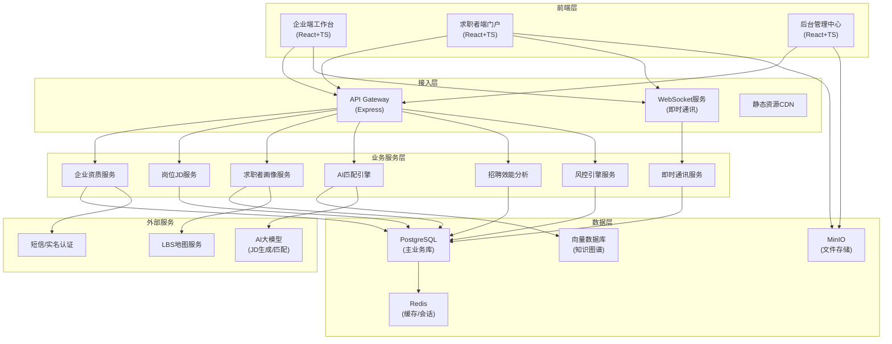
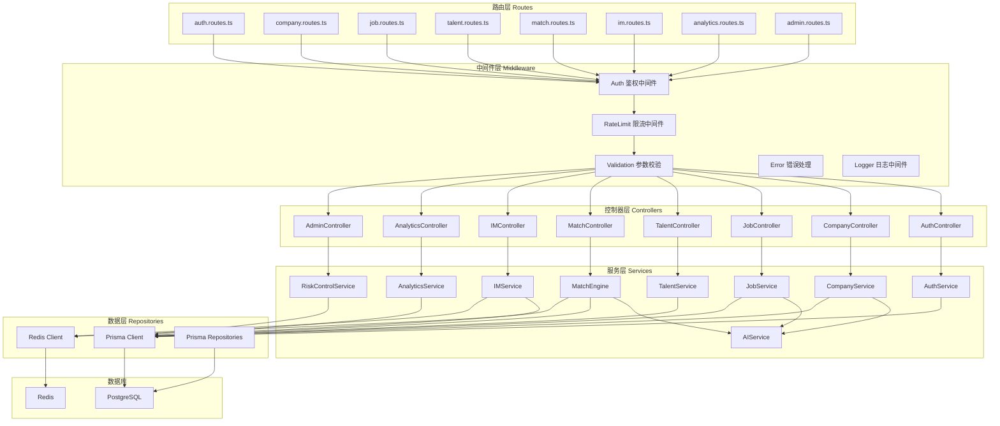
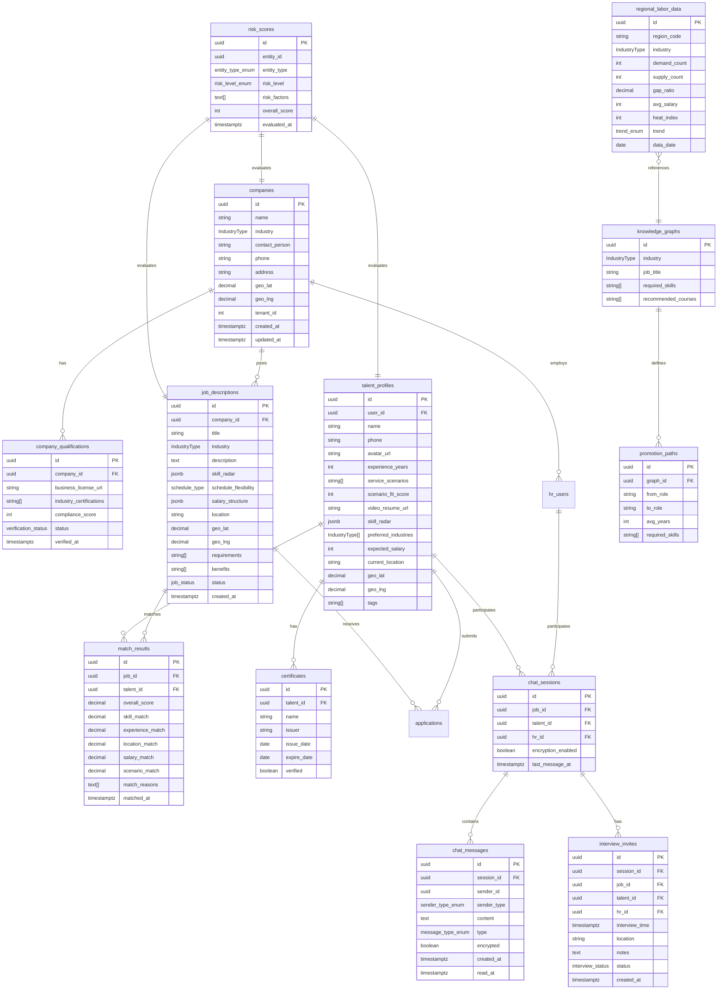

# 垂直服务业智能人才匹配中台 - 技术架构文档

## 1. 架构设计



## 2. 技术描述

### 2.1 技术栈选型

| 层级 | 技术选型 | 版本 | 说明 |
|------|----------|------|------|
| 前端框架 | React | 18.x | 函数式组件 + Hooks |
| 前端语言 | TypeScript | 5.x | 类型安全 |
| 构建工具 | Vite | 5.x | 极速开发体验 |
| 状态管理 | Zustand | 4.x | 轻量级状态管理 |
| 路由 | React Router Dom | 6.x | 声明式路由 |
| UI框架 | TailwindCSS | 3.x | 原子化CSS |
| 图表库 | Recharts | 2.x | React图表组件 |
| 图标库 | Lucide React | 0.x | 线性图标 |
| 后端框架 | Express | 4.x | 轻量级Node服务 |
| 后端语言 | TypeScript | 5.x | ESM模块 |
| 数据库 | PostgreSQL | 15.x | 关系型数据库 |
| 缓存 | Redis | 7.x | 数据缓存 + 会话管理 |
| ORM | Prisma | 5.x | 类型安全ORM |
| WebSocket | Socket.IO | 4.x | 实时通讯 |

### 2.2 项目初始化

- **模板选择**：`react-express-ts`（React + Express + TypeScript 全栈模板）
- **初始化命令**：`npm init vite-init@latest -y . -- --template react-express-ts --force`
- **包管理器**：npm

## 3. 路由定义

### 3.1 前端路由

| 路由路径 | 页面组件 | 权限控制 | 说明 |
|----------|----------|----------|------|
| `/` | DashboardHome | 企业HR | 企业端首页-数据概览 |
| `/jd/create` | JdCreator | 企业HR | JD智能生成器 |
| `/candidates` | CandidatePool | 企业HR | 候选人才池 |
| `/im` | IMClient | 全员 | 即时通讯中心 |
| `/analytics` | AnalyticsBoard | 企业HR | 招聘效能看板 |
| `/jobs` | JobFeed | 求职者 | 实时职位流 |
| `/profile` | TalentProfile | 求职者 | 能力画像中心 |
| `/job/:id` | JobDetail | 求职者 | 职位详情 |
| `/admin/companies` | AdminCompanyReview | 管理员 | 企业入驻审核 |
| `/admin/risk` | AdminRiskControl | 管理员 | 风控中心 |
| `/admin/heatmap` | AdminHeatmap | 管理员 | 区域用工预警 |
| `/login` | Login | 公开 | 登录页 |
| `/register` | Register | 公开 | 注册页 |

### 3.2 API 路由

| 方法 | 路由前缀 | 模块 | 说明 |
|------|----------|------|------|
| ANY | `/api/auth/*` | 认证模块 | 登录注册、权限校验 |
| ANY | `/api/company/*` | 企业模块 | 企业资质、信息管理 |
| ANY | `/api/job/*` | 岗位模块 | JD生成、岗位管理 |
| ANY | `/api/talent/*` | 人才模块 | 求职者画像、简历 |
| ANY | `/api/match/*` | 匹配模块 | AI匹配、候选池推荐 |
| ANY | `/api/im/*` | 通讯模块 | 消息、会话管理 |
| ANY | `/api/analytics/*` | 分析模块 | 效能看板数据 |
| ANY | `/api/admin/*` | 管理模块 | 审核、风控、预警 |

## 4. API 类型定义

```typescript
// 共享类型定义 - shared/types/index.ts

// 业态类型
export type IndustryType = 'hotel' | 'restaurant' | 'beauty' | 'healthcare' | 'retail' | 'ecommerce';

// 企业资质
export interface CompanyQualification {
  id: string;
  companyId: string;
  businessLicense: string;
  industryCertification: string[];
  complianceScore: number;
  verifiedAt: Date;
  status: 'pending' | 'approved' | 'rejected';
}

// 技能雷达图维度
export interface SkillRadar {
  professional: number;     // 专业技能
  communication: number;    // 沟通能力
  service: number;          // 服务意识
  teamwork: number;         // 团队协作
  stress: number;           // 抗压能力
  learning: number;         // 学习能力
}

// 薪资结构
export interface SalaryStructure {
  base: number;
  performance: number;
  commission: number;
  benefits: string[];
  currency: string;
}

// 岗位JD
export interface JobDescription {
  id: string;
  companyId: string;
  title: string;
  industry: IndustryType;
  description: string;
  skillRadar: SkillRadar;
  scheduleFlexibility: 'fixed' | 'flexible' | 'shift';
  salary: SalaryStructure;
  location: string;
  geoLat: number;
  geoLng: number;
  requirements: string[];
  benefits: string[];
  matchScore: number;
  createdAt: Date;
  status: 'draft' | 'published' | 'closed';
}

// 求职者能力画像
export interface TalentProfile {
  id: string;
  userId: string;
  name: string;
  phone: string;
  avatar: string;
  certificates: Certificate[];
  experienceYears: number;
  serviceScenarios: string[];
  scenarioFitScore: number;
  videoResumeUrl: string;
  skillRadar: SkillRadar;
  preferredIndustries: IndustryType[];
  expectedSalary: number;
  currentLocation: string;
  geoLat: number;
  geoLng: number;
  tags: string[];
}

// 证书信息
export interface Certificate {
  id: string;
  name: string;
  issuer: string;
  issueDate: Date;
  expireDate: Date;
  verified: boolean;
}

// 行业知识图谱 - 岗位-技能关联
export interface KnowledgeGraph {
  id: string;
  industry: IndustryType;
  jobTitle: string;
  requiredSkills: string[];
  recommendedCourses: string[];
  promotionPaths: PromotionPath[];
}

// 晋升路径
export interface PromotionPath {
  from: string;
  to: string;
  avgYears: number;
  requiredSkills: string[];
}

// 匹配结果
export interface MatchResult {
  jobId: string;
  talentId: string;
  overallScore: number;
  skillMatch: number;
  experienceMatch: number;
  locationMatch: number;
  salaryMatch: number;
  scenarioMatch: number;
  reasons: string[];
}

// IM消息
export interface ChatMessage {
  id: string;
  sessionId: string;
  senderId: string;
  senderType: 'hr' | 'talent';
  content: string;
  type: 'text' | 'image' | 'interview_invite' | 'system';
  encrypted: boolean;
  createdAt: Date;
  readAt: Date | null;
}

// 面试邀约
export interface InterviewInvite {
  id: string;
  sessionId: string;
  jobId: string;
  talentId: string;
  hrId: string;
  interviewTime: Date;
  location: string;
  notes: string;
  status: 'pending' | 'accepted' | 'rejected' | 'completed' | 'no_show';
  createdAt: Date;
}

// 招聘效能数据
export interface RecruitmentMetrics {
  avgFillDays: number;
  channelFunnel: ChannelFunnel[];
  retentionRate: number;
  costPerHire: number;
  timeToHireByRole: Record<string, number>;
}

// 渠道转化漏斗
export interface ChannelFunnel {
  channel: string;
  views: number;
  applications: number;
  interviews: number;
  hires: number;
}

// 风控评分
export interface RiskScore {
  entityId: string;
  entityType: 'company' | 'talent' | 'job';
  riskLevel: 'low' | 'medium' | 'high';
  riskFactors: string[];
  overallScore: number;
  evaluatedAt: Date;
}

// 区域用工数据
export interface RegionalLaborData {
  region: string;
  industry: IndustryType;
  demandCount: number;
  supplyCount: number;
  gapRatio: number;
  avgSalary: number;
  heatIndex: number;
  trend: 'rising' | 'stable' | 'falling';
}
```

## 5. 服务端架构



## 6. 数据模型

### 6.1 ER 图



### 6.2 数据库初始化脚本

```sql
-- 启用UUID扩展
CREATE EXTENSION IF NOT EXISTS "uuid-ossp";

-- 创建枚举类型
CREATE TYPE industry_type AS ENUM ('hotel', 'restaurant', 'beauty', 'healthcare', 'retail', 'ecommerce');
CREATE TYPE verification_status AS ENUM ('pending', 'approved', 'rejected');
CREATE TYPE schedule_type AS ENUM ('fixed', 'flexible', 'shift');
CREATE TYPE job_status AS ENUM ('draft', 'published', 'closed');
CREATE TYPE sender_type_enum AS ENUM ('hr', 'talent');
CREATE TYPE message_type_enum AS ENUM ('text', 'image', 'interview_invite', 'system');
CREATE TYPE interview_status AS ENUM ('pending', 'accepted', 'rejected', 'completed', 'no_show');
CREATE TYPE entity_type_enum AS ENUM ('company', 'talent', 'job');
CREATE TYPE risk_level_enum AS ENUM ('low', 'medium', 'high');
CREATE TYPE trend_enum AS ENUM ('rising', 'stable', 'falling');
CREATE TYPE user_role_enum AS ENUM ('hr', 'talent', 'admin', 'store_manager');

-- 企业表
CREATE TABLE companies (
    id UUID PRIMARY KEY DEFAULT uuid_generate_v4(),
    name VARCHAR(255) NOT NULL,
    industry industry_type NOT NULL,
    contact_person VARCHAR(100) NOT NULL,
    phone VARCHAR(20) NOT NULL,
    address TEXT,
    geo_lat DECIMAL(10, 8),
    geo_lng DECIMAL(11, 8),
    tenant_id INTEGER NOT NULL,
    created_at TIMESTAMPTZ DEFAULT CURRENT_TIMESTAMP,
    updated_at TIMESTAMPTZ DEFAULT CURRENT_TIMESTAMP
);

CREATE INDEX idx_companies_industry ON companies(industry);
CREATE INDEX idx_companies_tenant ON companies(tenant_id);
CREATE INDEX idx_companies_location ON companies(geo_lat, geo_lng);

-- 企业资质表
CREATE TABLE company_qualifications (
    id UUID PRIMARY KEY DEFAULT uuid_generate_v4(),
    company_id UUID REFERENCES companies(id) ON DELETE CASCADE,
    business_license_url VARCHAR(500) NOT NULL,
    industry_certifications VARCHAR(500)[],
    compliance_score INTEGER DEFAULT 0,
    status verification_status DEFAULT 'pending',
    verified_at TIMESTAMPTZ,
    created_at TIMESTAMPTZ DEFAULT CURRENT_TIMESTAMP,
    updated_at TIMESTAMPTZ DEFAULT CURRENT_TIMESTAMP
);

CREATE INDEX idx_qualifications_company ON company_qualifications(company_id);
CREATE INDEX idx_qualifications_status ON company_qualifications(status);

-- 岗位JD表
CREATE TABLE job_descriptions (
    id UUID PRIMARY KEY DEFAULT uuid_generate_v4(),
    company_id UUID REFERENCES companies(id) ON DELETE CASCADE,
    title VARCHAR(200) NOT NULL,
    industry industry_type NOT NULL,
    description TEXT NOT NULL,
    skill_radar JSONB NOT NULL,
    schedule_flexibility schedule_type DEFAULT 'fixed',
    salary_structure JSONB NOT NULL,
    location VARCHAR(500),
    geo_lat DECIMAL(10, 8),
    geo_lng DECIMAL(11, 8),
    requirements TEXT[],
    benefits TEXT[],
    status job_status DEFAULT 'draft',
    created_at TIMESTAMPTZ DEFAULT CURRENT_TIMESTAMP,
    updated_at TIMESTAMPTZ DEFAULT CURRENT_TIMESTAMP
);

CREATE INDEX idx_jobs_company ON job_descriptions(company_id);
CREATE INDEX idx_jobs_industry ON job_descriptions(industry);
CREATE INDEX idx_jobs_status ON job_descriptions(status);
CREATE INDEX idx_jobs_location ON job_descriptions(geo_lat, geo_lng);

-- 求职者画像表
CREATE TABLE talent_profiles (
    id UUID PRIMARY KEY DEFAULT uuid_generate_v4(),
    user_id UUID NOT NULL,
    name VARCHAR(100) NOT NULL,
    phone VARCHAR(20) NOT NULL,
    avatar_url VARCHAR(500),
    experience_years INTEGER DEFAULT 0,
    service_scenarios VARCHAR(200)[],
    scenario_fit_score INTEGER DEFAULT 0,
    video_resume_url VARCHAR(500),
    skill_radar JSONB NOT NULL,
    preferred_industries industry_type[],
    expected_salary INTEGER,
    current_location VARCHAR(500),
    geo_lat DECIMAL(10, 8),
    geo_lng DECIMAL(11, 8),
    tags VARCHAR(100)[],
    created_at TIMESTAMPTZ DEFAULT CURRENT_TIMESTAMP,
    updated_at TIMESTAMPTZ DEFAULT CURRENT_TIMESTAMP
);

CREATE INDEX idx_talent_industries ON talent_profiles USING GIN (preferred_industries);
CREATE INDEX idx_talent_location ON talent_profiles(geo_lat, geo_lng);
CREATE INDEX idx_talent_experience ON talent_profiles(experience_years);

-- 证书表
CREATE TABLE certificates (
    id UUID PRIMARY KEY DEFAULT uuid_generate_v4(),
    talent_id UUID REFERENCES talent_profiles(id) ON DELETE CASCADE,
    name VARCHAR(200) NOT NULL,
    issuer VARCHAR(200) NOT NULL,
    issue_date DATE NOT NULL,
    expire_date DATE,
    verified BOOLEAN DEFAULT FALSE,
    created_at TIMESTAMPTZ DEFAULT CURRENT_TIMESTAMP
);

CREATE INDEX idx_certificates_talent ON certificates(talent_id);

-- 匹配结果表
CREATE TABLE match_results (
    id UUID PRIMARY KEY DEFAULT uuid_generate_v4(),
    job_id UUID REFERENCES job_descriptions(id) ON DELETE CASCADE,
    talent_id UUID REFERENCES talent_profiles(id) ON DELETE CASCADE,
    overall_score DECIMAL(5, 2) NOT NULL,
    skill_match DECIMAL(5, 2) NOT NULL,
    experience_match DECIMAL(5, 2) NOT NULL,
    location_match DECIMAL(5, 2) NOT NULL,
    salary_match DECIMAL(5, 2) NOT NULL,
    scenario_match DECIMAL(5, 2) NOT NULL,
    match_reasons TEXT[],
    matched_at TIMESTAMPTZ DEFAULT CURRENT_TIMESTAMP,
    UNIQUE(job_id, talent_id)
);

CREATE INDEX idx_match_job ON match_results(job_id);
CREATE INDEX idx_match_talent ON match_results(talent_id);
CREATE INDEX idx_match_score ON match_results(overall_score DESC);

-- 聊天会话表
CREATE TABLE chat_sessions (
    id UUID PRIMARY KEY DEFAULT uuid_generate_v4(),
    job_id UUID REFERENCES job_descriptions(id) ON DELETE CASCADE,
    talent_id UUID REFERENCES talent_profiles(id) ON DELETE CASCADE,
    hr_id UUID NOT NULL,
    encryption_enabled BOOLEAN DEFAULT TRUE,
    last_message_at TIMESTAMPTZ,
    created_at TIMESTAMPTZ DEFAULT CURRENT_TIMESTAMP,
    UNIQUE(job_id, talent_id, hr_id)
);

CREATE INDEX idx_sessions_hr ON chat_sessions(hr_id);
CREATE INDEX idx_sessions_talent ON chat_sessions(talent_id);

-- 聊天消息表
CREATE TABLE chat_messages (
    id UUID PRIMARY KEY DEFAULT uuid_generate_v4(),
    session_id UUID REFERENCES chat_sessions(id) ON DELETE CASCADE,
    sender_id UUID NOT NULL,
    sender_type sender_type_enum NOT NULL,
    content TEXT NOT NULL,
    type message_type_enum DEFAULT 'text',
    encrypted BOOLEAN DEFAULT TRUE,
    created_at TIMESTAMPTZ DEFAULT CURRENT_TIMESTAMP,
    read_at TIMESTAMPTZ
);

CREATE INDEX idx_messages_session ON chat_messages(session_id);
CREATE INDEX idx_messages_created ON chat_messages(created_at);

-- 面试邀约表
CREATE TABLE interview_invites (
    id UUID PRIMARY KEY DEFAULT uuid_generate_v4(),
    session_id UUID REFERENCES chat_sessions(id) ON DELETE CASCADE,
    job_id UUID REFERENCES job_descriptions(id) ON DELETE CASCADE,
    talent_id UUID REFERENCES talent_profiles(id) ON DELETE CASCADE,
    hr_id UUID NOT NULL,
    interview_time TIMESTAMPTZ NOT NULL,
    location VARCHAR(500) NOT NULL,
    notes TEXT,
    status interview_status DEFAULT 'pending',
    created_at TIMESTAMPTZ DEFAULT CURRENT_TIMESTAMP
);

CREATE INDEX idx_invites_hr ON interview_invites(hr_id);
CREATE INDEX idx_invites_talent ON interview_invites(talent_id);
CREATE INDEX idx_invites_status ON interview_invites(status);
CREATE INDEX idx_invites_time ON interview_invites(interview_time);

-- 知识图谱表
CREATE TABLE knowledge_graphs (
    id UUID PRIMARY KEY DEFAULT uuid_generate_v4(),
    industry industry_type NOT NULL,
    job_title VARCHAR(200) NOT NULL,
    required_skills VARCHAR(200)[],
    recommended_courses VARCHAR(500)[],
    created_at TIMESTAMPTZ DEFAULT CURRENT_TIMESTAMP
);

CREATE INDEX idx_graph_industry ON knowledge_graphs(industry);
CREATE INDEX idx_graph_job ON knowledge_graphs(job_title);

-- 晋升路径表
CREATE TABLE promotion_paths (
    id UUID PRIMARY KEY DEFAULT uuid_generate_v4(),
    graph_id UUID REFERENCES knowledge_graphs(id) ON DELETE CASCADE,
    from_role VARCHAR(200) NOT NULL,
    to_role VARCHAR(200) NOT NULL,
    avg_years INTEGER NOT NULL,
    required_skills VARCHAR(200)[],
    created_at TIMESTAMPTZ DEFAULT CURRENT_TIMESTAMP
);

-- 风控评分表
CREATE TABLE risk_scores (
    id UUID PRIMARY KEY DEFAULT uuid_generate_v4(),
    entity_id UUID NOT NULL,
    entity_type entity_type_enum NOT NULL,
    risk_level risk_level_enum DEFAULT 'low',
    risk_factors TEXT[],
    overall_score INTEGER DEFAULT 100,
    evaluated_at TIMESTAMPTZ DEFAULT CURRENT_TIMESTAMP
);

CREATE INDEX idx_risk_entity ON risk_scores(entity_id, entity_type);
CREATE INDEX idx_risk_level ON risk_scores(risk_level);

-- 区域用工数据表
CREATE TABLE regional_labor_data (
    id UUID PRIMARY KEY DEFAULT uuid_generate_v4(),
    region_code VARCHAR(20) NOT NULL,
    industry industry_type NOT NULL,
    demand_count INTEGER DEFAULT 0,
    supply_count INTEGER DEFAULT 0,
    gap_ratio DECIMAL(5, 2) DEFAULT 0,
    avg_salary INTEGER DEFAULT 0,
    heat_index INTEGER DEFAULT 0,
    trend trend_enum DEFAULT 'stable',
    data_date DATE NOT NULL,
    created_at TIMESTAMPTZ DEFAULT CURRENT_TIMESTAMP,
    UNIQUE(region_code, industry, data_date)
);

CREATE INDEX idx_labor_region ON regional_labor_data(region_code);
CREATE INDEX idx_labor_industry ON regional_labor_data(industry);
CREATE INDEX idx_labor_date ON regional_labor_data(data_date);
```
