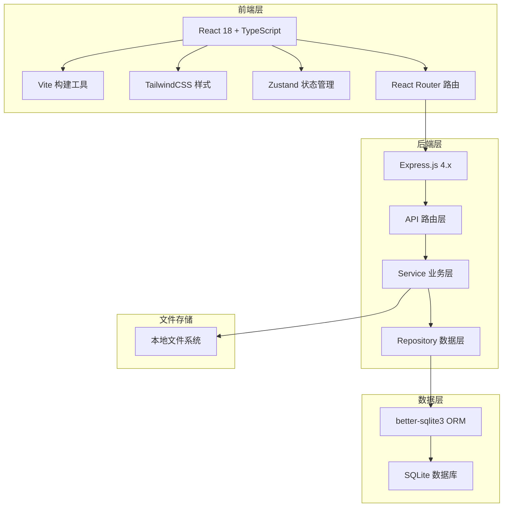
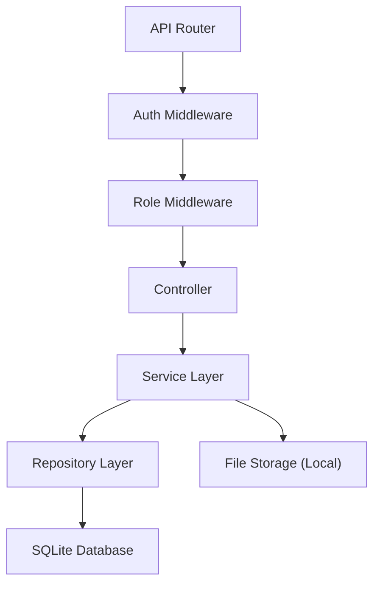

## 1. 架构设计



## 2. 技术描述

- **前端**：React@18 + TypeScript + Vite + TailwindCSS@3 + Zustand + React Router@6
- **初始化工具**：vite-init react-express-ts 模板
- **后端**：Express@4 + TypeScript + ESM
- **数据库**：SQLite (data/app.sqlite) + better-sqlite3
- **文件存储**：本地文件系统 (uploads 目录)
- **认证**：JWT Token + Cookie

## 3. 端口配置

根据项目目录 `may-68884`，tail4 = 68884 后四位 = 8884（补零后）

| 服务 | 端口公式 | 默认端口 | 备用槽位1 | 备用槽位2 | 备用槽位3 |
|------|---------|----------|-----------|-----------|-----------|
| 前端 | 40000 + tail4 | 48884 | 49884 | 50884 | 51884 |
| 后端 | 50000 + tail4 | 58884 | 59884 | 60884 | 61884 |

## 4. 路由定义

| 路由 | 页面 | 权限 |
|-------|---------|------|
| /login | 登录页 | 公开 |
| /dashboard | 工作台首页 | 登录用户 |
| /experiments | 实验任务列表 | 所有角色 |
| /experiments/:id | 实验详情/提交页 | 学生 |
| /experiments/manage | 实验管理 | 教师/管理员 |
| /grading | 批改工作台 | 助教/教师 |
| /grading/:submissionId | 批改详情 | 助教/教师 |
| /grades | 成绩管理 | 教师/管理员 |
| /admin/users | 用户管理 | 管理员 |
| /admin/courses | 课程班级管理 | 管理员 |

## 5. API 定义

### 5.1 类型定义

```typescript
// 用户类型
type UserRole = 'student' | 'ta' | 'teacher' | 'admin';

interface User {
  id: number;
  username: string;
  name: string;
  role: UserRole;
  email?: string;
  studentId?: string;
  createdAt: string;
}

// 实验任务
interface Experiment {
  id: number;
  title: string;
  description: string;
  objectives: string;
  template?: string;
  courseId: number;
  deadline: string;
  lateDeadline?: string;
  status: 'draft' | 'published' | 'closed';
  version: number;
  createdBy: number;
  createdAt: string;
  updatedAt: string;
}

// 评分项
interface RubricItem {
  id: number;
  experimentId: number;
  name: string;
  description: string;
  maxScore: number;
  weight: number;
  sortOrder: number;
}

// 提交记录
interface Submission {
  id: number;
  experimentId: number;
  studentId: number;
  status: 'draft' | 'submitted' | 'late' | 'resubmitted' | 'returned' | 'graded';
  submittedAt?: string;
  gradedAt?: string;
  gradedBy?: number;
  totalScore?: number;
  version: number;
}

// 评分记录
interface Grade {
  id: number;
  submissionId: number;
  rubricItemId: number;
  score: number;
  comment?: string;
  gradedBy: number;
  createdAt: string;
}

// 批注
interface Annotation {
  id: number;
  submissionId: number;
  content: string;
  createdBy: number;
  createdAt: string;
  resolved: boolean;
}

// 成绩归档
interface GradeArchive {
  id: number;
  submissionId: number;
  courseId: number;
  classId: number;
  experimentId: number;
  studentId: number;
  totalScore: number;
  gradingVersion: number;
  archivedBy: number;
  archivedAt: string;
  adjustmentReason?: string;
}
```

### 5.2 API 端点

| 方法 | 路径 | 描述 |
|------|------|------|
| POST | /api/auth/login | 用户登录 |
| GET | /api/auth/me | 获取当前用户 |
| POST | /api/auth/logout | 退出登录 |
| GET | /api/experiments | 获取实验列表 |
| GET | /api/experiments/:id | 获取实验详情 |
| POST | /api/experiments | 创建实验 |
| PUT | /api/experiments/:id | 更新实验 |
| GET | /api/experiments/:id/versions | 获取实验版本历史 |
| GET | /api/submissions | 获取提交列表 |
| GET | /api/submissions/:id | 获取提交详情 |
| POST | /api/submissions | 创建提交 |
| PUT | /api/submissions/:id/submit | 提交报告 |
| POST | /api/submissions/:id/resubmit | 撤回重交 |
| GET | /api/grading/pending | 待批改列表 |
| POST | /api/grading/:submissionId/grade | 提交评分 |
| POST | /api/grading/:submissionId/return | 退回修改 |
| GET | /api/grades | 成绩列表 |
| POST | /api/grades/export | 导出成绩 |
| POST | /api/grades/:id/adjust | 调整成绩 |
| GET | /api/admin/users | 用户列表 |
| POST | /api/admin/users | 创建用户 |
| PUT | /api/admin/users/:id | 更新用户 |

## 6. 服务器架构



## 7. 数据模型

### 7.1 ER 图

```mermaid
erDiagram
    USER ||--o{ EXPERIMENT : creates
    USER ||--o{ SUBMISSION : submits
    USER ||--o{ GRADE : grades
    USER ||--o{ ANNOTATION : creates
    USER ||--o{ GRADE_ARCHIVE : archives
    COURSE ||--o{ EXPERIMENT : contains
    COURSE ||--o{ CLASS : has
    CLASS ||--o{ USER : enrolls
    EXPERIMENT ||--|{ RUBRIC_ITEM : has
    EXPERIMENT ||--o{ EXPERIMENT_VERSION : versions
    EXPERIMENT ||--o{ SUBMISSION : has
    SUBMISSION ||--o{ SUBMISSION_FILE : has
    SUBMISSION ||--o{ GRADE : has
    SUBMISSION ||--o{ ANNOTATION : has
    SUBMISSION ||--o{ GRADE_ARCHIVE : archived
    
    USER {
        int id PK
        string username
        string password_hash
        string name
        string role
        string email
        string student_id
        datetime created_at
    }
    
    COURSE {
        int id PK
        string name
        string code
        int teacher_id FK
        datetime created_at
    }
    
    CLASS {
        int id PK
        string name
        int course_id FK
        datetime created_at
    }
    
    EXPERIMENT {
        int id PK
        string title
        text description
        text objectives
        int course_id FK
        datetime deadline
        datetime late_deadline
        string status
        int version
        int created_by FK
        datetime created_at
        datetime updated_at
    }
    
    RUBRIC_ITEM {
        int id PK
        int experiment_id FK
        string name
        text description
        float max_score
        float weight
        int sort_order
    }
    
    SUBMISSION {
        int id PK
        int experiment_id FK
        int student_id FK
        string status
        datetime submitted_at
        datetime graded_at
        int graded_by FK
        float total_score
        int version
        datetime created_at
    }
    
    SUBMISSION_FILE {
        int id PK
        int submission_id FK
        string filename
        string original_name
        string file_type
        int file_size
        datetime created_at
    }
    
    GRADE {
        int id PK
        int submission_id FK
        int rubric_item_id FK
        float score
        text comment
        int graded_by FK
        datetime created_at
    }
    
    ANNOTATION {
        int id PK
        int submission_id FK
        text content
        int created_by FK
        datetime created_at
        boolean resolved
    }
    
    GRADE_ARCHIVE {
        int id PK
        int submission_id FK
        int course_id FK
        int class_id FK
        int experiment_id FK
        int student_id FK
        float total_score
        int grading_version
        int archived_by FK
        datetime archived_at
        text adjustment_reason
    }
```

### 7.2 DDL 语句

```sql
-- 用户表
CREATE TABLE users (
    id INTEGER PRIMARY KEY AUTOINCREMENT,
    username VARCHAR(50) UNIQUE NOT NULL,
    password_hash VARCHAR(255) NOT NULL,
    name VARCHAR(100) NOT NULL,
    role VARCHAR(20) NOT NULL CHECK (role IN ('student', 'ta', 'teacher', 'admin')),
    email VARCHAR(100),
    student_id VARCHAR(50),
    created_at DATETIME DEFAULT CURRENT_TIMESTAMP
);

-- 课程表
CREATE TABLE courses (
    id INTEGER PRIMARY KEY AUTOINCREMENT,
    name VARCHAR(100) NOT NULL,
    code VARCHAR(50) UNIQUE NOT NULL,
    teacher_id INTEGER REFERENCES users(id),
    created_at DATETIME DEFAULT CURRENT_TIMESTAMP
);

-- 班级表
CREATE TABLE classes (
    id INTEGER PRIMARY KEY AUTOINCREMENT,
    name VARCHAR(50) NOT NULL,
    course_id INTEGER REFERENCES courses(id),
    created_at DATETIME DEFAULT CURRENT_TIMESTAMP
);

-- 班级学生关联表
CREATE TABLE class_students (
    class_id INTEGER REFERENCES classes(id),
    student_id INTEGER REFERENCES users(id),
    PRIMARY KEY (class_id, student_id)
);

-- 实验任务表
CREATE TABLE experiments (
    id INTEGER PRIMARY KEY AUTOINCREMENT,
    title VARCHAR(200) NOT NULL,
    description TEXT,
    objectives TEXT,
    template TEXT,
    course_id INTEGER REFERENCES courses(id),
    deadline DATETIME NOT NULL,
    late_deadline DATETIME,
    status VARCHAR(20) NOT NULL DEFAULT 'draft' CHECK (status IN ('draft', 'published', 'closed')),
    version INTEGER NOT NULL DEFAULT 1,
    created_by INTEGER REFERENCES users(id),
    created_at DATETIME DEFAULT CURRENT_TIMESTAMP,
    updated_at DATETIME DEFAULT CURRENT_TIMESTAMP
);

-- 评分项表
CREATE TABLE rubric_items (
    id INTEGER PRIMARY KEY AUTOINCREMENT,
    experiment_id INTEGER REFERENCES experiments(id),
    name VARCHAR(100) NOT NULL,
    description TEXT,
    max_score REAL NOT NULL DEFAULT 100,
    weight REAL NOT NULL DEFAULT 1,
    sort_order INTEGER NOT NULL DEFAULT 0
);

-- 实验版本历史表
CREATE TABLE experiment_versions (
    id INTEGER PRIMARY KEY AUTOINCREMENT,
    experiment_id INTEGER REFERENCES experiments(id),
    version INTEGER NOT NULL,
    title VARCHAR(200) NOT NULL,
    description TEXT,
    objectives TEXT,
    deadline DATETIME,
    changed_by INTEGER REFERENCES users(id),
    created_at DATETIME DEFAULT CURRENT_TIMESTAMP
);

-- 提交记录表
CREATE TABLE submissions (
    id INTEGER PRIMARY KEY AUTOINCREMENT,
    experiment_id INTEGER REFERENCES experiments(id),
    student_id INTEGER REFERENCES users(id),
    status VARCHAR(20) NOT NULL DEFAULT 'draft' CHECK (status IN ('draft', 'submitted', 'late', 'resubmitted', 'returned', 'graded')),
    submitted_at DATETIME,
    graded_at DATETIME,
    graded_by INTEGER REFERENCES users(id),
    total_score REAL,
    version INTEGER NOT NULL DEFAULT 1,
    created_at DATETIME DEFAULT CURRENT_TIMESTAMP,
    UNIQUE(experiment_id, student_id)
);

-- 提交文件表
CREATE TABLE submission_files (
    id INTEGER PRIMARY KEY AUTOINCREMENT,
    submission_id INTEGER REFERENCES submissions(id),
    filename VARCHAR(255) NOT NULL,
    original_name VARCHAR(255) NOT NULL,
    file_type VARCHAR(50) NOT NULL,
    file_size INTEGER NOT NULL,
    created_at DATETIME DEFAULT CURRENT_TIMESTAMP
);

-- 提交操作历史表
CREATE TABLE submission_history (
    id INTEGER PRIMARY KEY AUTOINCREMENT,
    submission_id INTEGER REFERENCES submissions(id),
    action VARCHAR(50) NOT NULL,
    status_before VARCHAR(20),
    status_after VARCHAR(20),
    performed_by INTEGER REFERENCES users(id),
    reason TEXT,
    created_at DATETIME DEFAULT CURRENT_TIMESTAMP
);

-- 评分表
CREATE TABLE grades (
    id INTEGER PRIMARY KEY AUTOINCREMENT,
    submission_id INTEGER REFERENCES submissions(id),
    rubric_item_id INTEGER REFERENCES rubric_items(id),
    score REAL NOT NULL,
    comment TEXT,
    graded_by INTEGER REFERENCES users(id),
    created_at DATETIME DEFAULT CURRENT_TIMESTAMP
);

-- 批注表
CREATE TABLE annotations (
    id INTEGER PRIMARY KEY AUTOINCREMENT,
    submission_id INTEGER REFERENCES submissions(id),
    content TEXT NOT NULL,
    created_by INTEGER REFERENCES users(id),
    created_at DATETIME DEFAULT CURRENT_TIMESTAMP,
    resolved BOOLEAN DEFAULT 0
);

-- 成绩归档表
CREATE TABLE grade_archives (
    id INTEGER PRIMARY KEY AUTOINCREMENT,
    submission_id INTEGER REFERENCES submissions(id),
    course_id INTEGER REFERENCES courses(id),
    class_id INTEGER REFERENCES classes(id),
    experiment_id INTEGER REFERENCES experiments(id),
    student_id INTEGER REFERENCES users(id),
    total_score REAL NOT NULL,
    grading_version INTEGER NOT NULL,
    archived_by INTEGER REFERENCES users(id),
    archived_at DATETIME DEFAULT CURRENT_TIMESTAMP,
    adjustment_reason TEXT
);

-- 索引
CREATE INDEX idx_experiments_course ON experiments(course_id);
CREATE INDEX idx_submissions_experiment ON submissions(experiment_id);
CREATE INDEX idx_submissions_student ON submissions(student_id);
CREATE INDEX idx_grades_submission ON grades(submission_id);
CREATE INDEX idx_annotations_submission ON annotations(submission_id);
CREATE INDEX idx_grade_archives_course ON grade_archives(course_id);
```
