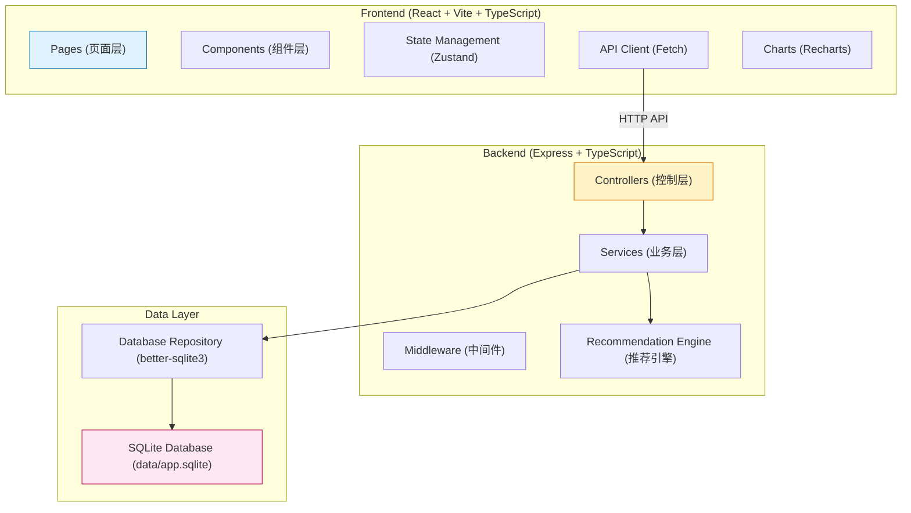
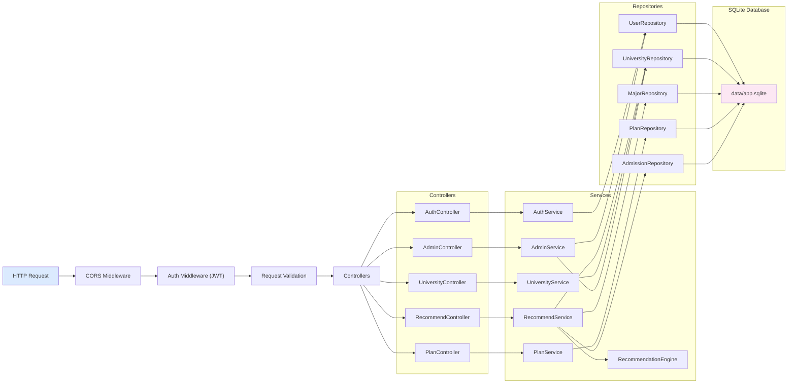
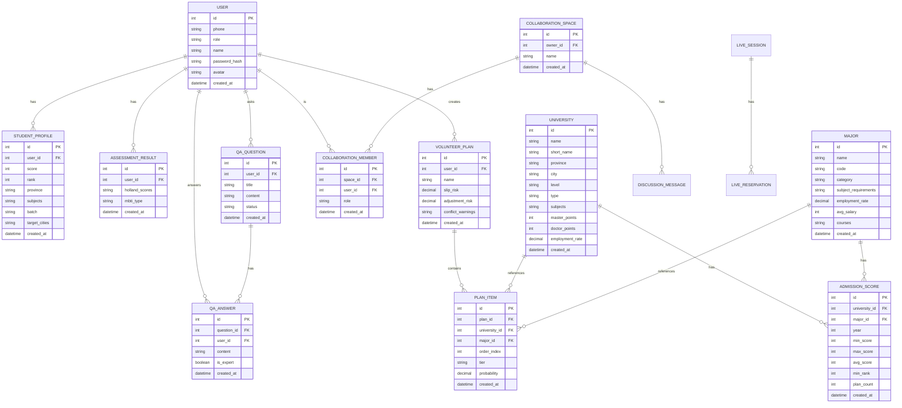

## 1. 架构设计

整体采用前后端分离的 B/S 架构，前端负责交互与展示，后端负责业务逻辑与数据持久化，SQLite 作为本地数据库存储。



## 2. 技术选型说明

| 层级 | 技术栈 | 版本 | 说明 |
|------|--------|------|------|
| 前端框架 | React | ^18.2.0 | 组件化开发，生态成熟 |
| 前端构建 | Vite | ^5.0.0 | 热更新快，开发体验好 |
| 语言 | TypeScript | ^5.3.0 | 类型安全，减少运行时错误 |
| 路由 | react-router-dom | ^6.20.0 | 声明式路由，支持嵌套 |
| 状态管理 | zustand | ^4.4.0 | 轻量易用，API 简洁 |
| 样式 | tailwindcss | ^3.3.0 | 原子化 CSS，开发效率高 |
| UI 组件 | lucide-react | ^0.294.0 | 统一图标库 |
| 图表 | recharts | ^2.10.0 | React 图表库，支持各种可视化 |
| 后端框架 | Express | ^4.18.0 | 轻量 Node.js Web 框架 |
| 数据库 | SQLite | 3.x | 本地文件数据库，无需额外服务 |
| 数据库驱动 | better-sqlite3 | ^9.2.0 | 同步 API，性能优异 |
| 密码加密 | bcryptjs | ^2.4.0 | 用户密码哈希存储 |
| 身份认证 | jsonwebtoken | ^9.0.0 | JWT 无状态认证 |
| PDF 导出 | jspdf | ^2.5.0 | 客户端生成 PDF 报告 |

### 2.1 端口配置

- 项目目录：may-89073
- tail4 = 9073（取目录名数字后四位，补零至4位）
- FRONTEND_PORT = 40000 + 9073 = **49073**
- BACKEND_PORT = 50000 + 9073 = **59073**
- 所有服务只监听 127.0.0.1

### 2.2 目录结构

```
may-89073/
├── .env                          # 环境变量（端口、数据库路径等）
├── .trae/documents/              # 项目文档
├── data/
│   └── app.sqlite                # SQLite 数据库文件
├── migrations/                   # 数据库迁移 SQL
├── shared/                       # 前后端共享类型定义
├── src/                          # 前端源码
│   ├── components/               # 可复用组件
│   ├── pages/                    # 页面组件
│   ├── hooks/                    # 自定义 React Hooks
│   ├── store/                    # Zustand 状态管理
│   ├── utils/                    # 工具函数
│   ├── api/                      # API 请求封装
│   ├── types/                    # 前端类型定义
│   ├── App.tsx                   # 根组件
│   ├── main.tsx                  # 入口文件
│   └── index.css                 # 全局样式
├── api/                          # 后端源码
│   ├── controllers/              # 控制器层
│   ├── services/                 # 业务逻辑层
│   ├── repositories/             # 数据访问层
│   ├── middleware/               # Express 中间件
│   ├── engine/                   # 推荐引擎
│   ├── config/                   # 配置文件
│   ├── types/                    # 后端类型定义
│   └── server.ts                 # 后端入口
├── vite.config.ts                # Vite 配置
├── tailwind.config.js            # Tailwind 配置
├── tsconfig.json                 # TypeScript 配置
├── package.json                  # 项目依赖
├── frontend.log                  # 前端日志
└── backend.log                   # 后端日志
```

## 3. 路由定义

### 3.1 前端路由

| 路由路径 | 页面组件 | 说明 |
|----------|----------|------|
| / | Home | 首页 |
| /profile | Profile | 考生信息采集 |
| /assessment | Assessment | 兴趣测评 |
| /recommend | Recommend | 智能推荐 |
| /plan | Plan | 志愿方案 |
| /universities | UniversityList | 院校库 |
| /university/:id | UniversityDetail | 院校详情 |
| /majors | MajorList | 专业库 |
| /major/:id | MajorDetail | 专业详情 |
| /compare | Compare | 对比分析 |
| /collaboration | Collaboration | 协作空间 |
| /qa | QaList | 问答社区 |
| /live | LiveList | 直播答疑 |
| /report | Report | 报告导出 |
| /admin | AdminDashboard | 管理后台首页 |
| /admin/review | AdminReview | 内容审核 |
| /admin/heatmap | AdminHeatmap | 热力图分析 |
| /login | Login | 登录页 |
| /register | Register | 注册页 |

### 3.2 后端 API 路由

| 路由前缀 | 说明 |
|----------|------|
| /api/auth | 用户认证相关 |
| /api/user | 用户信息管理 |
| /api/profile | 考生信息管理 |
| /api/assessment | 兴趣测评 |
| /api/recommend | 推荐引擎 |
| /api/university | 院校查询 |
| /api/major | 专业查询 |
| /api/plan | 志愿方案 |
| /api/compare | 对比分析 |
| /api/collaboration | 协作空间 |
| /api/qa | 问答社区 |
| /api/live | 直播答疑 |
| /api/report | 报告导出 |
| /api/admin | 管理后台 |
| /api/health | 健康检查 |

## 4. API 定义

### 4.1 核心类型定义

```typescript
// shared/types.ts

export interface User {
  id: number;
  phone: string;
  role: 'student' | 'parent' | 'teacher' | 'expert' | 'admin';
  name: string;
  avatar?: string;
  createdAt: string;
}

export interface StudentProfile {
  id: number;
  userId: number;
  score: number;
  rank: number;
  province: string;
  subjects: string[]; // 选科组合 ['物理', '化学', '生物']
  batch: string; // 本科批/专科批
  targetCities: string[];
  createdAt: string;
}

export interface AssessmentResult {
  id: number;
  userId: number;
  holland: { R: number; I: number; A: number; S: number; E: number; C: number };
  mbti: string; // 'INTJ' | 'ENFP' | ...
  createdAt: string;
}

export interface University {
  id: number;
  name: string;
  shortName: string;
  province: string;
  city: string;
  level: string; // 985/211/双一流/普通本科
  type: string; // 综合/理工/师范/...
  subjects: string[]; // 学科评估结果
  masterPoints: number;
  doctorPoints: number;
  employmentRate: number;
  createdAt: string;
}

export interface Major {
  id: number;
  name: string;
  code: string;
  category: string; // 学科门类
  subjectRequirements: string[]; // 选科要求
  employmentRate: number;
  avgSalary: number;
  courses: string[];
  createdAt: string;
}

export interface AdmissionScore {
  id: number;
  universityId: number;
  majorId: number;
  year: number;
  minScore: number;
  maxScore: number;
  avgScore: number;
  minRank: number;
  planCount: number;
  createdAt: string;
}

export interface RecommendItem {
  id: number;
  universityId: number;
  majorId: number;
  probability: number; // 录取概率 0-100
  tier: 'reach' | 'stable' | 'safe'; // 冲/稳/保
  score: number; // 综合推荐评分
  matchReasons: string[];
  createdAt: string;
}

export interface VolunteerPlan {
  id: number;
  userId: number;
  name: string;
  items: PlanItem[];
  riskLevel: 'low' | 'medium' | 'high';
  conflictWarnings: string[];
  createdAt: string;
}
```

### 4.2 关键 API 请求响应

```typescript
// POST /api/recommend/generate
export interface GenerateRecommendRequest {
  profile: StudentProfile;
  assessment: AssessmentResult;
  preferences: {
    universityWeight: number; // 0-100
    majorWeight: number;
    cityWeight: number;
    employmentWeight: number;
    familyWishes?: string;
  };
}

export interface GenerateRecommendResponse {
  success: boolean;
  data: {
    reach: RecommendItem[];
    stable: RecommendItem[];
    safe: RecommendItem[];
    conflictWarnings: string[];
  };
}

// GET /api/university/:id/admission-scores
export interface GetAdmissionScoresResponse {
  success: boolean;
  data: {
    university: University;
    scores: Array<{
      year: number;
      major: Major;
      minScore: number;
      minRank: number;
    }>;
  };
}

// POST /api/plan/analyze
export interface AnalyzePlanRequest {
  planItems: Array<{
    universityId: number;
    majorId: number;
    order: number;
  }>;
  studentProfile: StudentProfile;
}

export interface AnalyzePlanResponse {
  success: boolean;
  data: {
    overallProbability: number;
    slipRisk: number; // 滑档风险系数 0-100
    adjustmentRisk: number; // 调剂风险系数
    conflicts: string[];
    suggestions: string[];
  };
}
```

## 5. 服务器架构图



## 6. 数据模型

### 6.1 ER 图



### 6.2 DDL 语句

```sql
-- migrations/001_init.sql

CREATE TABLE IF NOT EXISTS users (
  id INTEGER PRIMARY KEY AUTOINCREMENT,
  phone VARCHAR(20) UNIQUE NOT NULL,
  role VARCHAR(20) NOT NULL DEFAULT 'student',
  name VARCHAR(50) NOT NULL,
  password_hash VARCHAR(255) NOT NULL,
  avatar VARCHAR(255),
  school_name VARCHAR(100),
  expert_certified BOOLEAN DEFAULT 0,
  created_at DATETIME DEFAULT CURRENT_TIMESTAMP
);

CREATE TABLE IF NOT EXISTS student_profiles (
  id INTEGER PRIMARY KEY AUTOINCREMENT,
  user_id INTEGER NOT NULL,
  score INTEGER NOT NULL,
  rank INTEGER NOT NULL,
  province VARCHAR(50) NOT NULL,
  subjects TEXT NOT NULL,
  batch VARCHAR(50) NOT NULL,
  target_cities TEXT,
  created_at DATETIME DEFAULT CURRENT_TIMESTAMP,
  FOREIGN KEY (user_id) REFERENCES users(id)
);

CREATE TABLE IF NOT EXISTS assessment_results (
  id INTEGER PRIMARY KEY AUTOINCREMENT,
  user_id INTEGER NOT NULL,
  holland_scores TEXT NOT NULL,
  mbti_type VARCHAR(10),
  created_at DATETIME DEFAULT CURRENT_TIMESTAMP,
  FOREIGN KEY (user_id) REFERENCES users(id)
);

CREATE TABLE IF NOT EXISTS universities (
  id INTEGER PRIMARY KEY AUTOINCREMENT,
  name VARCHAR(100) UNIQUE NOT NULL,
  short_name VARCHAR(50),
  province VARCHAR(50) NOT NULL,
  city VARCHAR(50) NOT NULL,
  level VARCHAR(50),
  type VARCHAR(50),
  subjects TEXT,
  master_points INTEGER DEFAULT 0,
  doctor_points INTEGER DEFAULT 0,
  employment_rate DECIMAL(5,2),
  logo_url VARCHAR(255),
  description TEXT,
  created_at DATETIME DEFAULT CURRENT_TIMESTAMP
);

CREATE TABLE IF NOT EXISTS majors (
  id INTEGER PRIMARY KEY AUTOINCREMENT,
  name VARCHAR(100) NOT NULL,
  code VARCHAR(20) UNIQUE NOT NULL,
  category VARCHAR(50),
  subject_requirements TEXT,
  employment_rate DECIMAL(5,2),
  avg_salary INTEGER,
  courses TEXT,
  description TEXT,
  created_at DATETIME DEFAULT CURRENT_TIMESTAMP
);

CREATE TABLE IF NOT EXISTS admission_scores (
  id INTEGER PRIMARY KEY AUTOINCREMENT,
  university_id INTEGER NOT NULL,
  major_id INTEGER NOT NULL,
  year INTEGER NOT NULL,
  province VARCHAR(50) NOT NULL,
  min_score INTEGER NOT NULL,
  max_score INTEGER,
  avg_score INTEGER,
  min_rank INTEGER,
  plan_count INTEGER,
  created_at DATETIME DEFAULT CURRENT_TIMESTAMP,
  FOREIGN KEY (university_id) REFERENCES universities(id),
  FOREIGN KEY (major_id) REFERENCES majors(id),
  UNIQUE(university_id, major_id, year, province)
);

CREATE TABLE IF NOT EXISTS volunteer_plans (
  id INTEGER PRIMARY KEY AUTOINCREMENT,
  user_id INTEGER NOT NULL,
  name VARCHAR(100) NOT NULL,
  slip_risk DECIMAL(5,2),
  adjustment_risk DECIMAL(5,2),
  conflict_warnings TEXT,
  created_at DATETIME DEFAULT CURRENT_TIMESTAMP,
  FOREIGN KEY (user_id) REFERENCES users(id)
);

CREATE TABLE IF NOT EXISTS plan_items (
  id INTEGER PRIMARY KEY AUTOINCREMENT,
  plan_id INTEGER NOT NULL,
  university_id INTEGER NOT NULL,
  major_id INTEGER NOT NULL,
  order_index INTEGER NOT NULL,
  tier VARCHAR(20) NOT NULL,
  probability DECIMAL(5,2) NOT NULL,
  match_reasons TEXT,
  created_at DATETIME DEFAULT CURRENT_TIMESTAMP,
  FOREIGN KEY (plan_id) REFERENCES volunteer_plans(id),
  FOREIGN KEY (university_id) REFERENCES universities(id),
  FOREIGN KEY (major_id) REFERENCES majors(id)
);

CREATE TABLE IF NOT EXISTS collaboration_spaces (
  id INTEGER PRIMARY KEY AUTOINCREMENT,
  owner_id INTEGER NOT NULL,
  name VARCHAR(100) NOT NULL,
  plan_id INTEGER,
  created_at DATETIME DEFAULT CURRENT_TIMESTAMP,
  FOREIGN KEY (owner_id) REFERENCES users(id)
);

CREATE TABLE IF NOT EXISTS collaboration_members (
  id INTEGER PRIMARY KEY AUTOINCREMENT,
  space_id INTEGER NOT NULL,
  user_id INTEGER NOT NULL,
  role VARCHAR(20) NOT NULL,
  created_at DATETIME DEFAULT CURRENT_TIMESTAMP,
  FOREIGN KEY (space_id) REFERENCES collaboration_spaces(id),
  FOREIGN KEY (user_id) REFERENCES users(id),
  UNIQUE(space_id, user_id)
);

CREATE TABLE IF NOT EXISTS discussion_messages (
  id INTEGER PRIMARY KEY AUTOINCREMENT,
  space_id INTEGER NOT NULL,
  user_id INTEGER NOT NULL,
  content TEXT NOT NULL,
  item_id INTEGER,
  created_at DATETIME DEFAULT CURRENT_TIMESTAMP,
  FOREIGN KEY (space_id) REFERENCES collaboration_spaces(id),
  FOREIGN KEY (user_id) REFERENCES users(id)
);

CREATE TABLE IF NOT EXISTS qa_questions (
  id INTEGER PRIMARY KEY AUTOINCREMENT,
  user_id INTEGER NOT NULL,
  title VARCHAR(200) NOT NULL,
  content TEXT NOT NULL,
  category VARCHAR(50),
  status VARCHAR(20) DEFAULT 'pending',
  view_count INTEGER DEFAULT 0,
  created_at DATETIME DEFAULT CURRENT_TIMESTAMP,
  FOREIGN KEY (user_id) REFERENCES users(id)
);

CREATE TABLE IF NOT EXISTS qa_answers (
  id INTEGER PRIMARY KEY AUTOINCREMENT,
  question_id INTEGER NOT NULL,
  user_id INTEGER NOT NULL,
  content TEXT NOT NULL,
  is_expert BOOLEAN DEFAULT 0,
  like_count INTEGER DEFAULT 0,
  created_at DATETIME DEFAULT CURRENT_TIMESTAMP,
  FOREIGN KEY (question_id) REFERENCES qa_questions(id),
  FOREIGN KEY (user_id) REFERENCES users(id)
);

CREATE TABLE IF NOT EXISTS live_sessions (
  id INTEGER PRIMARY KEY AUTOINCREMENT,
  expert_id INTEGER NOT NULL,
  title VARCHAR(200) NOT NULL,
  description TEXT,
  scheduled_at DATETIME NOT NULL,
  duration INTEGER DEFAULT 60,
  status VARCHAR(20) DEFAULT 'scheduled',
  stream_url VARCHAR(255),
  playback_url VARCHAR(255),
  created_at DATETIME DEFAULT CURRENT_TIMESTAMP,
  FOREIGN KEY (expert_id) REFERENCES users(id)
);

CREATE TABLE IF NOT EXISTS live_reservations (
  id INTEGER PRIMARY KEY AUTOINCREMENT,
  session_id INTEGER NOT NULL,
  user_id INTEGER NOT NULL,
  created_at DATETIME DEFAULT CURRENT_TIMESTAMP,
  FOREIGN KEY (session_id) REFERENCES live_sessions(id),
  FOREIGN KEY (user_id) REFERENCES users(id),
  UNIQUE(session_id, user_id)
);

CREATE TABLE IF NOT EXISTS province_heatmap (
  id INTEGER PRIMARY KEY AUTOINCREMENT,
  province VARCHAR(50) NOT NULL,
  university_id INTEGER,
  search_count INTEGER DEFAULT 0,
  application_count INTEGER DEFAULT 0,
  date DATE NOT NULL,
  created_at DATETIME DEFAULT CURRENT_TIMESTAMP,
  UNIQUE(province, university_id, date)
);

-- 索引
CREATE INDEX IF NOT EXISTS idx_admission_scores_university ON admission_scores(university_id);
CREATE INDEX IF NOT EXISTS idx_admission_scores_major ON admission_scores(major_id);
CREATE INDEX IF NOT EXISTS idx_admission_scores_year ON admission_scores(year);
CREATE INDEX IF NOT EXISTS idx_admission_scores_province ON admission_scores(province);
CREATE INDEX IF NOT EXISTS idx_universities_province ON universities(province);
CREATE INDEX IF NOT EXISTS idx_universities_level ON universities(level);
CREATE INDEX IF NOT EXISTS idx_majors_category ON majors(category);
```
