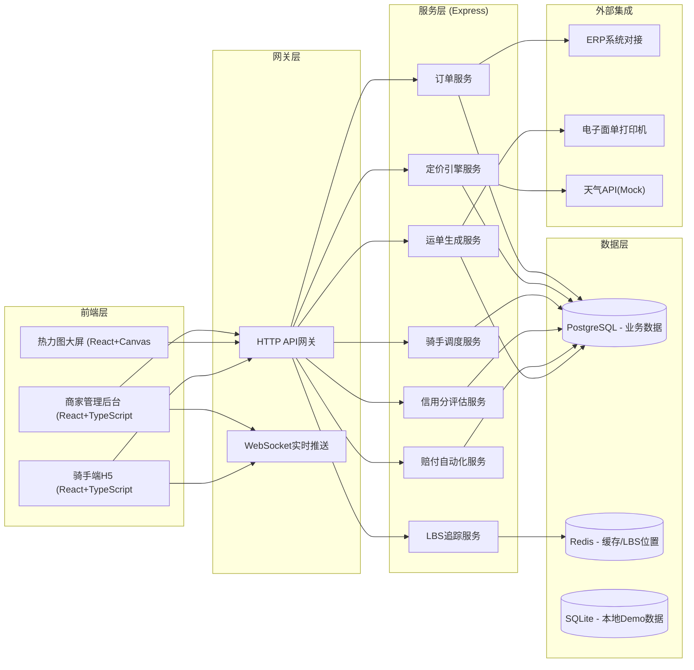
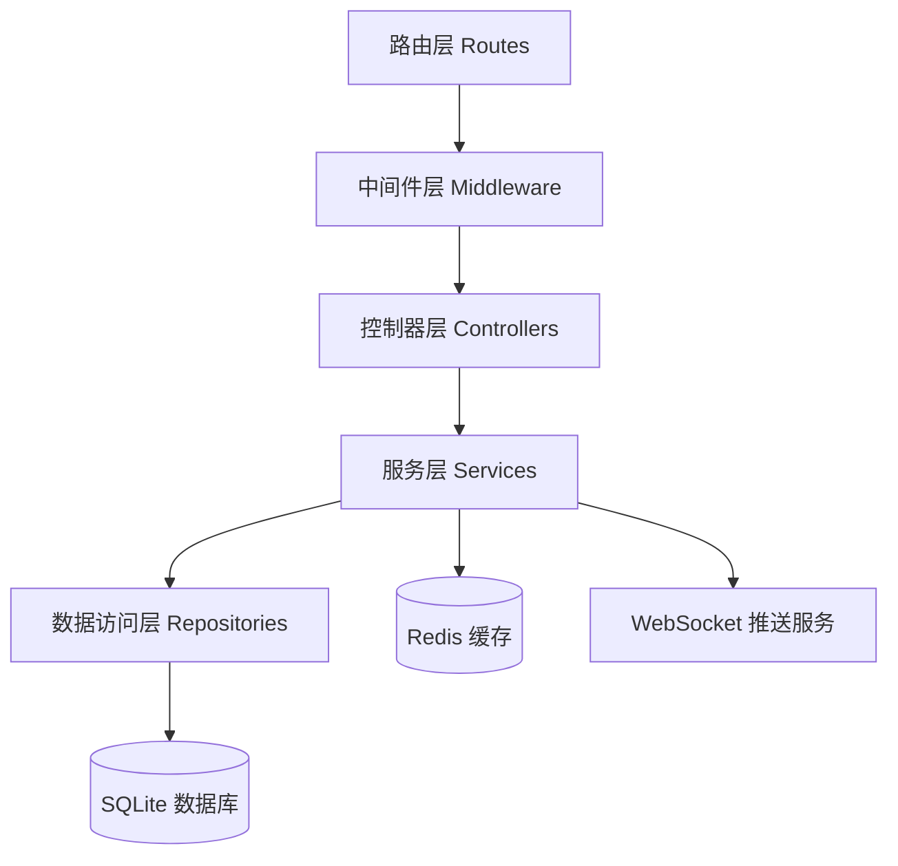
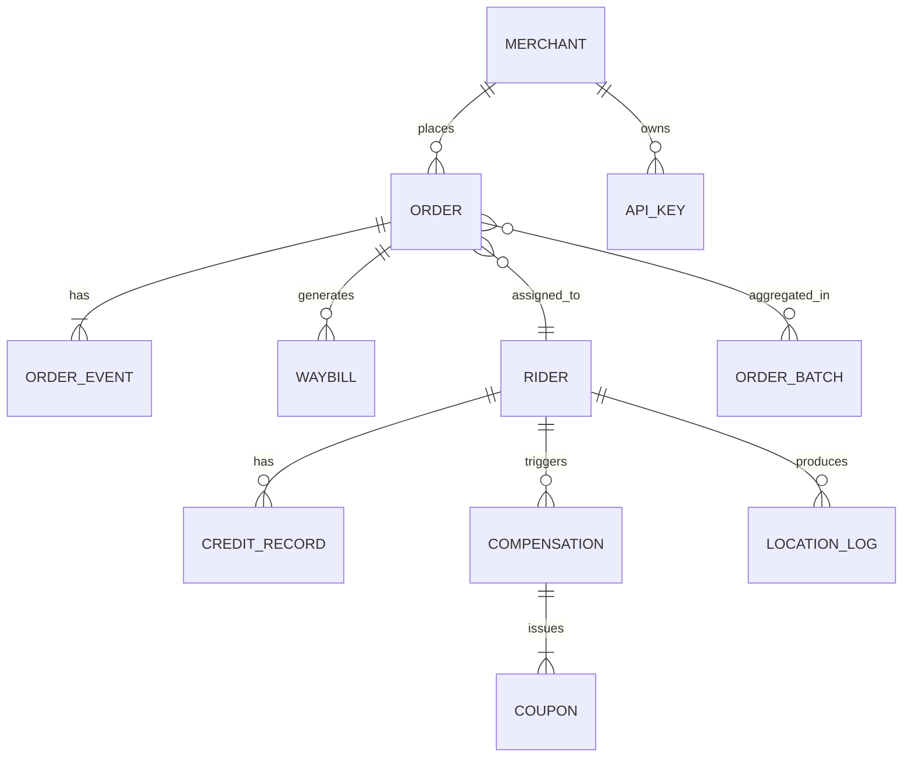

## 1. 架构设计



## 2. 技术选型说明

- **前端框架**: React@18 + TypeScript + Vite
- **状态管理**: Zustand
- **样式方案**: TailwindCSS@3
- **路由**: React Router DOM@6
- **UI组件**: Lucide React图标库
- **图表可视化**: 自实现Canvas热力图 + SVG路径渲染
- **后端框架**: Express@4 + TypeScript
- **实时通信**: Socket.IO (WebSocket)
- **数据存储**: SQLite（Demo数据 + Redis缓存（Mock实现）**
- **HTTP客户端**: Axios

## 3. 路由定义

### 3.1 前端路由

| 路由路径 | 页面名称 | 说明 |
|----------|----------|------|
| / | 商家仪表盘 | 实时数据概览与订单流 |
| /orders | 订单管理 | 订单列表与智能聚合 |
| /orders/abnormal | 异常订单池 | 异常订单处理 |
| /pricing | 动态定价 | 定价规则配置 |
| /riders | 骑手管理 | 骑手列表与LBS追踪 |
| /riders/credit | 信用分体系 | 骑手信用分管理 |
| /heatmap | 热力图大屏 | 运力与订单热力图 |
| /compensation | 赔付管理 | 赔付规则与记录 |
| /waybills | 电子运单 | 运单列表与导出 |
| /api-integration | API集成 | ERP对接与接口文档 |

### 3.2 后端API路由

| 方法 | 路径 | 说明 |
|------|------|------|
| GET | /api/orders | 获取订单列表 |
| POST | /api/orders | 创建订单 |
| GET | /api/orders/:id | 获取订单详情 |
| PUT | /api/orders/:id/status | 更新订单状态 |
| GET | /api/orders/aggregate | 智能聚合调度 |
| GET | /api/orders/abnormal | 异常订单列表 |
| POST | /api/pricing/calculate | 动态定价计算 |
| GET | /api/pricing/rules | 获取定价规则 |
| PUT | /api/pricing/rules | 更新定价规则 |
| GET | /api/riders | 获取骑手列表 |
| GET | /api/riders/:id/location | 获取骑手实时位置 |
| GET | /api/riders/credit | 获取骑手信用分 |
| GET | /api/heatmap/capacity | 运力热力图数据 |
| GET | /api/heatmap/orders | 订单热力图数据 |
| GET | /api/compensation/rules | 赔付规则 |
| GET | /api/compensation/records | 赔付记录 |
| POST | /api/compensation/trigger | 触发赔付 |
| GET | /api/waybills | 电子运单列表 |
| POST | /api/waybills/export | 批量导出运单 |
| GET | /api/api/keys | API密钥列表 |
| POST | /api/api/webhook/test | 测试Webhook |
| GET | /api/dashboard/stats | 仪表盘统计数据 |
| GET | /api/dashboard/realtime | 实时订单流 |

## 4. WebSocket事件定义

| 事件名 | 方向 | 说明 |
|--------|------|------|
| order:status | 服务端→客户端 | 订单状态变更推送 |
| rider:location | 服务端→客户端 | 骑手位置更新推送 |
| order:new | 服务端→客户端 | 新订单创建推送 |
| order:alert | 服务端→客户端 | 异常订单告警推送 |
| rider:location | 客户端→服务端 | 骑手上报位置 |
| dashboard:subscribe | 客户端→服务端 | 订阅仪表盘数据 |

## 5. 服务端架构



目录结构：
- `api/routes/` - API路由定义
- `api/middleware/` - 中间件（鉴权、日志、错误处理）
- `api/controllers/` - 请求处理控制器
- `api/services/` - 业务逻辑服务
- `api/repositories/` - 数据访问层
- `api/models/` - 数据模型定义
- `api/ws/` - WebSocket服务
- `api/utils/` - 工具函数
- `shared/types/` - 共享类型定义

## 6. 数据模型

### 6.1 ER图



### 6.2 核心实体定义

**订单(ORDER**
- id: string (主键)
- order_no: string
- merchant_id: string
- rider_id: string (可空)
- status: enum (pending/assigned/picked/delivered/completed/cancelled/exception)
- pickup_address: string
- pickup_lat: number
- pickup_lng: number
- delivery_address: string
- delivery_lat: number
- delivery_lng: number
- goods_type: string
- goods_weight: number
- distance_km: number
- estimated_price: number
- actual_price: number
- estimated_delivery_time: Date
- actual_delivery_time: Date
- created_at: Date
- updated_at: Date
- exception_type: string (可空)
- is_abnormal: boolean

**骑手RIDER**
- id: string (主键)
- name: string
- phone: string
- status: enum (online/offline/busy)
- credit_score: number
- credit_level: string
- current_lat: number
- current_lng: number
- on_time_rate: number
- complaint_rate: number
- equipment_compliant: boolean
- created_at: Date

**订单事件ORDER_EVENT**
- id: string
- order_id: string
- event_type: string
- event_data: json
- created_at: Date

**信用分记录CREDIT_RECORD**
- id: string
- rider_id: string
- score_change: number
- reason: string
- reason_type: enum (on_time/complaint/equipment)
- created_at: Date

**赔付记录COMPENSATION**
- id: string
- order_id: string
- rider_id: string
- type: enum (timeout/lost/damaged)
- amount: number
- status: enum (pending/approved/rejected)
- coupon_id: string
- created_at: Date

**电子运单WAYBILL**
- id: string
- order_id: string
- waybill_no: string
- tax_amount: number
- tax_rate: number
- pdf_url: string
- status: enum (generated/printed/voided)
- created_at: Date

## 7. 前端项目结构

```
src/
├── components/        # 公共组件
│   ├── layout/   # 布局组件
│   ├── ui/       # 基础UI组件
│   ├── charts/   # 图表组件
│   └── common/   # 业务组件
├── pages/         # 页面组件
├── hooks/         # 自定义Hooks
├── stores/        # Zustand状态管理
├── utils/         # 工具函数
├── services/      # API请求封装
├── types/         # TypeScript类型
└── assets/        # 静态资源
└── App.tsx        # 路由入口
```
