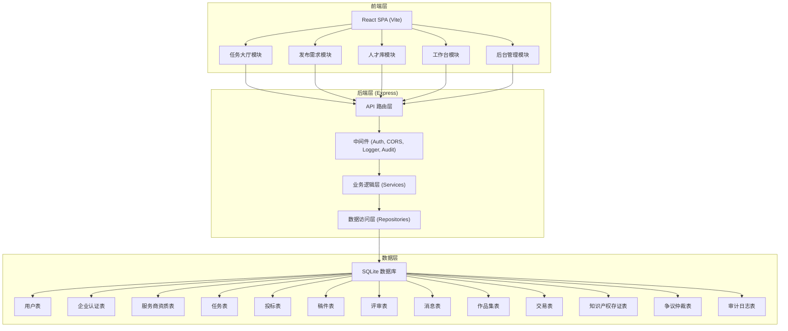
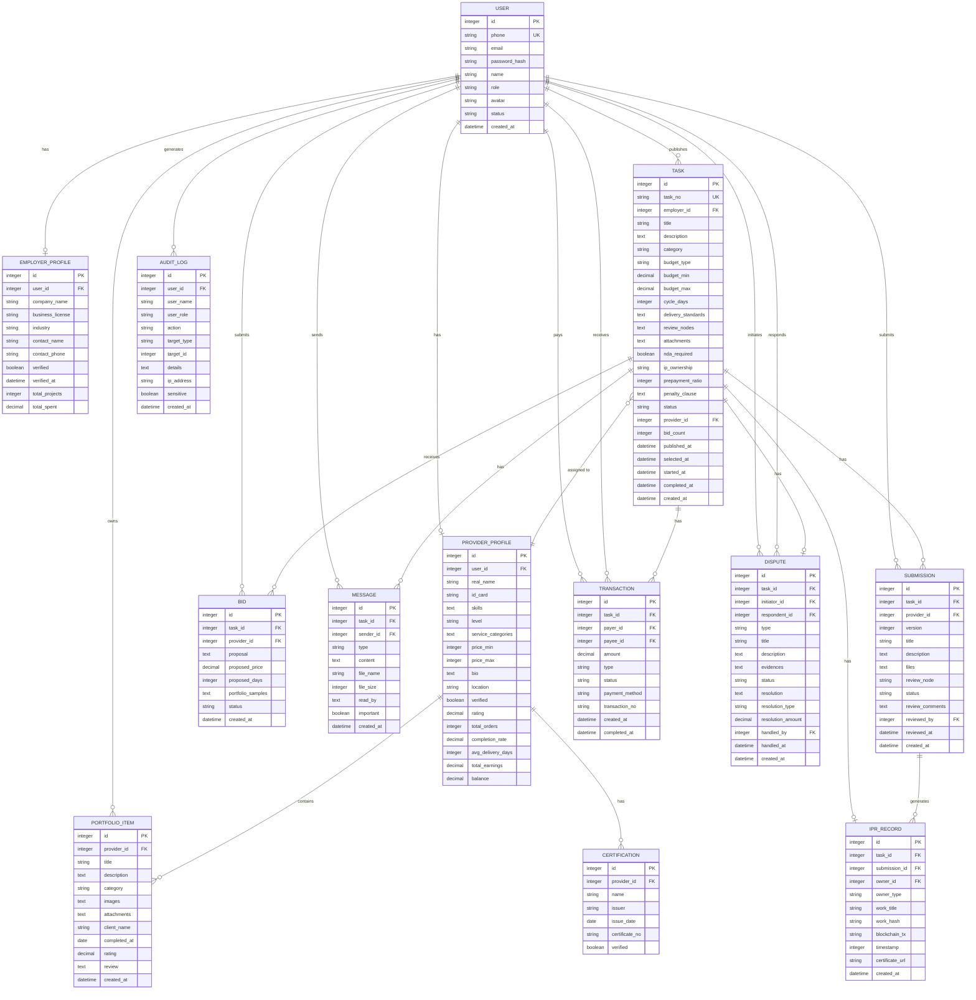

# 创意服务众包平台 - 技术架构文档

## 1. 架构设计



## 2. 技术选型

- **前端**：React 18 + TypeScript + Vite 5 + Tailwind CSS 3 + React Router 6 + Axios + Lucide React
- **后端**：Express 4 + TypeScript + better-sqlite3 + JWT + bcryptjs + multer
- **数据库**：SQLite 3 (data/app.sqlite)
- **文件存储**：本地文件系统 (uploads/)
- **实时通信**：HTTP 轮询（简化实现，无需 WebSocket）

## 3. 路由定义

### 前端路由

| 路由 | 页面 | 权限 |
|------|------|------|
| `/` | 首页（任务大厅） | 公开 |
| `/tasks` | 任务大厅 | 公开 |
| `/tasks/:id` | 任务详情 | 登录用户 |
| `/publish` | 发布需求 | 企业雇主 |
| `/talents` | 人才库 | 公开 |
| `/talents/:id` | 服务商详情 | 登录用户 |
| `/workspace` | 工作台 | 登录用户 |
| `/workspace/tasks/:id` | 工作台 - 任务详情 | 任务相关方 |
| `/workspace/messages` | 工作台 - 消息 | 登录用户 |
| `/admin` | 后台管理 - 任务看板 | 管理员 |
| `/admin/dashboard` | 任务状态看板 | 管理员 |
| `/admin/providers` | 服务商分级管理 | 管理员 |
| `/admin/ipr` | 知识产权存证 | 管理员 |
| `/admin/disputes` | 争议仲裁 | 管理员 |
| `/admin/audit` | 合规审计日志 | 管理员 |
| `/login` | 登录页 | 公开 |
| `/register` | 注册页 | 公开 |
| `/register/employer` | 企业注册 | 公开 |
| `/register/provider` | 服务商注册 | 公开 |

### 后端 API 路由

| 方法 | 路由 | 说明 |
|------|------|------|
| POST | `/api/auth/login` | 用户登录 |
| POST | `/api/auth/register/employer` | 企业雇主注册 |
| POST | `/api/auth/register/provider` | 服务商注册 |
| GET | `/api/auth/me` | 获取当前用户信息 |
| GET | `/api/tasks` | 获取任务列表（支持筛选） |
| GET | `/api/tasks/:id` | 获取任务详情 |
| POST | `/api/tasks` | 发布任务 |
| PUT | `/api/tasks/:id` | 更新任务 |
| GET | `/api/tasks/:id/bids` | 获取任务投标列表 |
| POST | `/api/tasks/:id/bids` | 提交投标 |
| POST | `/api/tasks/:id/select` | 选中服务商 |
| GET | `/api/providers` | 获取服务商列表 |
| GET | `/api/providers/:id` | 获取服务商详情 |
| GET | `/api/providers/:id/portfolio` | 获取服务商作品集 |
| GET | `/api/workspace/tasks` | 获取我的任务列表 |
| GET | `/api/workspace/tasks/:id` | 获取工作台任务详情 |
| GET | `/api/workspace/tasks/:id/messages` | 获取任务消息 |
| POST | `/api/workspace/tasks/:id/messages` | 发送消息 |
| GET | `/api/workspace/tasks/:id/submissions` | 获取稿件列表 |
| POST | `/api/workspace/tasks/:id/submissions` | 提交稿件 |
| PUT | `/api/workspace/submissions/:id` | 更新稿件 |
| POST | `/api/workspace/submissions/:id/review` | 提交评审意见 |
| POST | `/api/workspace/tasks/:id/accept` | 确认验收 |
| POST | `/api/workspace/tasks/:id/pay` | 支付 |
| POST | `/api/workspace/tasks/:id/dispute` | 发起争议 |
| GET | `/api/admin/dashboard/stats` | 获取看板统计数据 |
| GET | `/api/admin/providers` | 服务商列表 |
| POST | `/api/admin/providers/:id/grade` | 设置服务商等级 |
| GET | `/api/admin/ipr` | 知识产权存证列表 |
| GET | `/api/admin/disputes` | 争议列表 |
| POST | `/api/admin/disputes/:id/resolve` | 处理争议 |
| GET | `/api/admin/audit-logs` | 审计日志 |
| GET | `/api/health` | 健康检查 |

## 4. API 类型定义

```typescript
interface User {
  id: number;
  phone: string;
  email?: string;
  name: string;
  role: 'employer' | 'provider' | 'admin';
  avatar?: string;
  status: 'active' | 'suspended' | 'pending';
  createdAt: string;
}

interface EmployerProfile {
  id: number;
  userId: number;
  companyName: string;
  businessLicense: string;
  industry: string;
  contactName: string;
  contactPhone: string;
  verified: boolean;
  verifiedAt?: string;
  totalProjects: number;
  totalSpent: number;
}

interface ProviderProfile {
  id: number;
  userId: number;
  realName: string;
  idCard: string;
  skills: string[];
  certifications: Certification[];
  level: 'normal' | 'silver' | 'gold';
  serviceCategories: string[];
  priceRange: { min: number; max: number };
  bio: string;
  location: string;
  verified: boolean;
  rating: number;
  totalOrders: number;
  completionRate: number;
  avgDeliveryDays: number;
  totalEarnings: number;
  balance: number;
}

interface Certification {
  name: string;
  issuer: string;
  issueDate: string;
  certificateNo: string;
  verified: boolean;
}

interface Task {
  id: number;
  taskNo: string;
  employerId: number;
  employerName: string;
  title: string;
  description: string;
  category: 'ui_design' | 'industrial_design' | 'animation_design' | 'software_development' | 'trademark' | 'copywriting';
  budgetType: 'fixed' | 'range';
  budgetMin: number;
  budgetMax: number;
  cycleDays: number;
  deliveryStandards: string;
  reviewNodes: ReviewNode[];
  attachments: string[];
  ndaRequired: boolean;
  ipOwnership: 'employer' | 'shared' | 'provider';
  prepaymentRatio: number;
  penaltyClause: string;
  status: 'draft' | 'published' | 'bidding' | 'selected' | 'in_progress' | 'reviewing' | 'completed' | 'cancelled' | 'disputed';
  providerId?: number;
  providerName?: string;
  bidCount: number;
  publishedAt?: string;
  selectedAt?: string;
  startedAt?: string;
  completedAt?: string;
  createdAt: string;
}

interface ReviewNode {
  name: string;
  description: string;
  deadlineDays: number;
  passed: boolean;
  passedAt?: string;
}

interface Bid {
  id: number;
  taskId: number;
  providerId: number;
  providerName: string;
  providerAvatar?: string;
  providerLevel: string;
  providerRating: number;
  proposal: string;
  proposedPrice: number;
  proposedDays: number;
  portfolioSamples: number[];
  status: 'pending' | 'shortlisted' | 'selected' | 'rejected';
  createdAt: string;
}

interface Submission {
  id: number;
  taskId: number;
  providerId: number;
  version: number;
  title: string;
  description: string;
  files: string[];
  reviewNode: string;
  status: 'submitted' | 'reviewing' | 'approved' | 'revision_requested' | 'rejected';
  reviewComments?: string;
  reviewedBy?: number;
  reviewedAt?: string;
  createdAt: string;
}

interface Message {
  id: number;
  taskId: number;
  senderId: number;
  senderName: string;
  senderAvatar?: string;
  type: 'text' | 'file' | 'image' | 'system';
  content: string;
  fileName?: string;
  fileSize?: number;
  readBy: number[];
  important: boolean;
  createdAt: string;
}

interface PortfolioItem {
  id: number;
  providerId: number;
  title: string;
  description: string;
  category: string;
  images: string[];
  attachments?: string[];
  clientName?: string;
  completedAt?: string;
  rating?: number;
  review?: string;
  createdAt: string;
}

interface Transaction {
  id: number;
  taskId: number;
  payerId: number;
  payeeId: number;
  amount: number;
  type: 'prepayment' | 'final_payment' | 'refund' | 'dispute';
  status: 'pending' | 'completed' | 'failed';
  paymentMethod: string;
  transactionNo: string;
  createdAt: string;
  completedAt?: string;
}

interface IPRRecord {
  id: number;
  taskId: number;
  submissionId: number;
  ownerId: number;
  ownerType: 'employer' | 'provider' | 'shared';
  workTitle: string;
  workHash: string;
  blockchainTx?: string;
  timestamp: number;
  certificateUrl?: string;
  createdAt: string;
}

interface Dispute {
  id: number;
  taskId: number;
  initiatorId: number;
  respondentId: number;
  type: 'quality' | 'delivery' | 'payment' | 'other';
  title: string;
  description: string;
  evidences: string[];
  status: 'pending' | 'reviewing' | 'resolved' | 'closed';
  resolution?: string;
  resolutionType?: 'refund' | 'partial_payment' | 'complete_payment' | 'cancel';
  resolutionAmount?: number;
  handledBy?: number;
  handledAt?: string;
  createdAt: string;
}

interface AuditLog {
  id: number;
  userId: number;
  userName: string;
  userRole: string;
  action: string;
  targetType: string;
  targetId: number;
  details: string;
  ipAddress: string;
  sensitive: boolean;
  createdAt: string;
}

interface DashboardStats {
  totalTasks: number;
  tasksToday: number;
  activeTasks: number;
  completedTasks: number;
  disputedTasks: number;
  totalProviders: number;
  verifiedProviders: number;
  totalVolume: number;
  volumeToday: number;
  taskTrend: { date: string; count: number; volume: number }[];
  categoryDistribution: { category: string; count: number }[];
  recentTasks: Task[];
  activeDisputes: Dispute[];
}
```

## 5. 数据模型

### 5.1 ER 图



### 5.2 DDL 语句

```sql
-- 用户表
CREATE TABLE users (
    id INTEGER PRIMARY KEY AUTOINCREMENT,
    phone VARCHAR(20) UNIQUE NOT NULL,
    email VARCHAR(100),
    password_hash VARCHAR(255) NOT NULL,
    name VARCHAR(100) NOT NULL,
    role VARCHAR(20) NOT NULL,
    avatar VARCHAR(255),
    status VARCHAR(20) DEFAULT 'active',
    created_at DATETIME DEFAULT CURRENT_TIMESTAMP
);

-- 企业雇主资料表
CREATE TABLE employer_profiles (
    id INTEGER PRIMARY KEY AUTOINCREMENT,
    user_id INTEGER UNIQUE NOT NULL,
    company_name VARCHAR(200) NOT NULL,
    business_license VARCHAR(50),
    industry VARCHAR(100),
    contact_name VARCHAR(50),
    contact_phone VARCHAR(20),
    verified BOOLEAN DEFAULT 0,
    verified_at DATETIME,
    total_projects INTEGER DEFAULT 0,
    total_spent DECIMAL(12,2) DEFAULT 0,
    FOREIGN KEY (user_id) REFERENCES users(id)
);

-- 服务商资料表
CREATE TABLE provider_profiles (
    id INTEGER PRIMARY KEY AUTOINCREMENT,
    user_id INTEGER UNIQUE NOT NULL,
    real_name VARCHAR(50) NOT NULL,
    id_card VARCHAR(20) NOT NULL,
    skills TEXT,
    level VARCHAR(20) DEFAULT 'normal',
    service_categories TEXT,
    price_min INTEGER DEFAULT 0,
    price_max INTEGER DEFAULT 0,
    bio TEXT,
    location VARCHAR(100),
    verified BOOLEAN DEFAULT 0,
    rating DECIMAL(3,2) DEFAULT 5.0,
    total_orders INTEGER DEFAULT 0,
    completion_rate DECIMAL(5,2) DEFAULT 100.0,
    avg_delivery_days INTEGER DEFAULT 0,
    total_earnings DECIMAL(12,2) DEFAULT 0,
    balance DECIMAL(12,2) DEFAULT 0,
    FOREIGN KEY (user_id) REFERENCES users(id)
);

-- 资质证书表
CREATE TABLE certifications (
    id INTEGER PRIMARY KEY AUTOINCREMENT,
    provider_id INTEGER NOT NULL,
    name VARCHAR(100) NOT NULL,
    issuer VARCHAR(100),
    issue_date DATE,
    certificate_no VARCHAR(100),
    verified BOOLEAN DEFAULT 0,
    FOREIGN KEY (provider_id) REFERENCES provider_profiles(id)
);

-- 任务表
CREATE TABLE tasks (
    id INTEGER PRIMARY KEY AUTOINCREMENT,
    task_no VARCHAR(32) UNIQUE NOT NULL,
    employer_id INTEGER NOT NULL,
    title VARCHAR(200) NOT NULL,
    description TEXT NOT NULL,
    category VARCHAR(50) NOT NULL,
    budget_type VARCHAR(20) DEFAULT 'fixed',
    budget_min DECIMAL(12,2) NOT NULL,
    budget_max DECIMAL(12,2) NOT NULL,
    cycle_days INTEGER NOT NULL,
    delivery_standards TEXT,
    review_nodes TEXT,
    attachments TEXT,
    nda_required BOOLEAN DEFAULT 0,
    ip_ownership VARCHAR(20) DEFAULT 'employer',
    prepayment_ratio INTEGER DEFAULT 50,
    penalty_clause TEXT,
    status VARCHAR(20) DEFAULT 'draft',
    provider_id INTEGER,
    bid_count INTEGER DEFAULT 0,
    published_at DATETIME,
    selected_at DATETIME,
    started_at DATETIME,
    completed_at DATETIME,
    created_at DATETIME DEFAULT CURRENT_TIMESTAMP,
    FOREIGN KEY (employer_id) REFERENCES users(id),
    FOREIGN KEY (provider_id) REFERENCES users(id)
);

-- 投标表
CREATE TABLE bids (
    id INTEGER PRIMARY KEY AUTOINCREMENT,
    task_id INTEGER NOT NULL,
    provider_id INTEGER NOT NULL,
    proposal TEXT NOT NULL,
    proposed_price DECIMAL(12,2) NOT NULL,
    proposed_days INTEGER NOT NULL,
    portfolio_samples TEXT,
    status VARCHAR(20) DEFAULT 'pending',
    created_at DATETIME DEFAULT CURRENT_TIMESTAMP,
    FOREIGN KEY (task_id) REFERENCES tasks(id),
    FOREIGN KEY (provider_id) REFERENCES users(id)
);

-- 稿件提交表
CREATE TABLE submissions (
    id INTEGER PRIMARY KEY AUTOINCREMENT,
    task_id INTEGER NOT NULL,
    provider_id INTEGER NOT NULL,
    version INTEGER NOT NULL DEFAULT 1,
    title VARCHAR(200) NOT NULL,
    description TEXT,
    files TEXT,
    review_node VARCHAR(100),
    status VARCHAR(20) DEFAULT 'submitted',
    review_comments TEXT,
    reviewed_by INTEGER,
    reviewed_at DATETIME,
    created_at DATETIME DEFAULT CURRENT_TIMESTAMP,
    FOREIGN KEY (task_id) REFERENCES tasks(id),
    FOREIGN KEY (provider_id) REFERENCES users(id),
    FOREIGN KEY (reviewed_by) REFERENCES users(id)
);

-- 消息表
CREATE TABLE messages (
    id INTEGER PRIMARY KEY AUTOINCREMENT,
    task_id INTEGER NOT NULL,
    sender_id INTEGER NOT NULL,
    type VARCHAR(20) DEFAULT 'text',
    content TEXT NOT NULL,
    file_name VARCHAR(255),
    file_size INTEGER,
    read_by TEXT DEFAULT '[]',
    important BOOLEAN DEFAULT 0,
    created_at DATETIME DEFAULT CURRENT_TIMESTAMP,
    FOREIGN KEY (task_id) REFERENCES tasks(id),
    FOREIGN KEY (sender_id) REFERENCES users(id)
);

-- 作品集表
CREATE TABLE portfolio_items (
    id INTEGER PRIMARY KEY AUTOINCREMENT,
    provider_id INTEGER NOT NULL,
    title VARCHAR(200) NOT NULL,
    description TEXT,
    category VARCHAR(50),
    images TEXT,
    attachments TEXT,
    client_name VARCHAR(100),
    completed_at DATE,
    rating DECIMAL(3,2),
    review TEXT,
    created_at DATETIME DEFAULT CURRENT_TIMESTAMP,
    FOREIGN KEY (provider_id) REFERENCES provider_profiles(id)
);

-- 交易表
CREATE TABLE transactions (
    id INTEGER PRIMARY KEY AUTOINCREMENT,
    task_id INTEGER NOT NULL,
    payer_id INTEGER NOT NULL,
    payee_id INTEGER NOT NULL,
    amount DECIMAL(12,2) NOT NULL,
    type VARCHAR(20) NOT NULL,
    status VARCHAR(20) DEFAULT 'pending',
    payment_method VARCHAR(50),
    transaction_no VARCHAR(64) UNIQUE NOT NULL,
    created_at DATETIME DEFAULT CURRENT_TIMESTAMP,
    completed_at DATETIME,
    FOREIGN KEY (task_id) REFERENCES tasks(id),
    FOREIGN KEY (payer_id) REFERENCES users(id),
    FOREIGN KEY (payee_id) REFERENCES users(id)
);

-- 知识产权存证表
CREATE TABLE ipr_records (
    id INTEGER PRIMARY KEY AUTOINCREMENT,
    task_id INTEGER NOT NULL,
    submission_id INTEGER NOT NULL,
    owner_id INTEGER NOT NULL,
    owner_type VARCHAR(20) NOT NULL,
    work_title VARCHAR(200) NOT NULL,
    work_hash VARCHAR(64) NOT NULL,
    blockchain_tx VARCHAR(255),
    timestamp INTEGER NOT NULL,
    certificate_url VARCHAR(255),
    created_at DATETIME DEFAULT CURRENT_TIMESTAMP,
    FOREIGN KEY (task_id) REFERENCES tasks(id),
    FOREIGN KEY (submission_id) REFERENCES submissions(id),
    FOREIGN KEY (owner_id) REFERENCES users(id)
);

-- 争议仲裁表
CREATE TABLE disputes (
    id INTEGER PRIMARY KEY AUTOINCREMENT,
    task_id INTEGER NOT NULL,
    initiator_id INTEGER NOT NULL,
    respondent_id INTEGER NOT NULL,
    type VARCHAR(20) NOT NULL,
    title VARCHAR(200) NOT NULL,
    description TEXT NOT NULL,
    evidences TEXT,
    status VARCHAR(20) DEFAULT 'pending',
    resolution TEXT,
    resolution_type VARCHAR(20),
    resolution_amount DECIMAL(12,2),
    handled_by INTEGER,
    handled_at DATETIME,
    created_at DATETIME DEFAULT CURRENT_TIMESTAMP,
    FOREIGN KEY (task_id) REFERENCES tasks(id),
    FOREIGN KEY (initiator_id) REFERENCES users(id),
    FOREIGN KEY (respondent_id) REFERENCES users(id),
    FOREIGN KEY (handled_by) REFERENCES users(id)
);

-- 审计日志表
CREATE TABLE audit_logs (
    id INTEGER PRIMARY KEY AUTOINCREMENT,
    user_id INTEGER NOT NULL,
    user_name VARCHAR(100) NOT NULL,
    user_role VARCHAR(20) NOT NULL,
    action VARCHAR(100) NOT NULL,
    target_type VARCHAR(50),
    target_id INTEGER,
    details TEXT,
    ip_address VARCHAR(50),
    sensitive BOOLEAN DEFAULT 0,
    created_at DATETIME DEFAULT CURRENT_TIMESTAMP,
    FOREIGN KEY (user_id) REFERENCES users(id)
);

-- 索引
CREATE INDEX idx_tasks_employer_id ON tasks(employer_id);
CREATE INDEX idx_tasks_status ON tasks(status);
CREATE INDEX idx_tasks_category ON tasks(category);
CREATE INDEX idx_tasks_provider_id ON tasks(provider_id);
CREATE INDEX idx_bids_task_id ON bids(task_id);
CREATE INDEX idx_bids_provider_id ON bids(provider_id);
CREATE INDEX idx_submissions_task_id ON submissions(task_id);
CREATE INDEX idx_messages_task_id ON messages(task_id);
CREATE INDEX idx_portfolio_provider_id ON portfolio_items(provider_id);
CREATE INDEX idx_transactions_task_id ON transactions(task_id);
CREATE INDEX idx_audit_logs_created_at ON audit_logs(created_at);
CREATE INDEX idx_audit_logs_user_id ON audit_logs(user_id);
CREATE INDEX idx_disputes_status ON disputes(status);
```

## 6. 项目目录结构

```
may-89103/
├── backend/
│   ├── src/
│   │   ├── config/
│   │   ├── controllers/
│   │   ├── middleware/
│   │   ├── models/
│   │   ├── repositories/
│   │   ├── routes/
│   │   ├── services/
│   │   ├── types/
│   │   ├── utils/
│   │   └── index.ts
│   ├── uploads/
│   ├── package.json
│   └── tsconfig.json
├── frontend/
│   ├── src/
│   │   ├── components/
│   │   ├── pages/
│   │   ├── hooks/
│   │   ├── context/
│   │   ├── services/
│   │   ├── types/
│   │   ├── utils/
│   │   ├── App.tsx
│   │   └── main.tsx
│   ├── public/
│   ├── package.json
│   ├── tsconfig.json
│   ├── vite.config.ts
│   └── tailwind.config.js
├── data/
├── logs/
├── uploads/
├── .env
├── start.sh
├── stop.sh
├── restart.sh
└── check.sh
```
