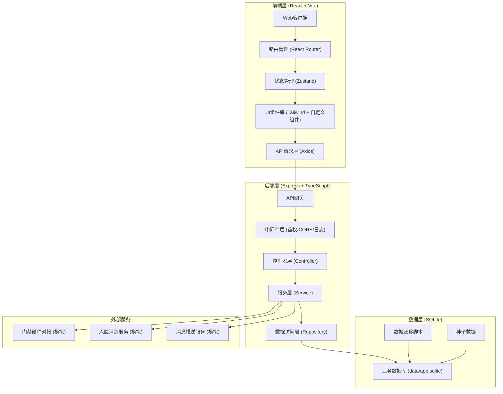
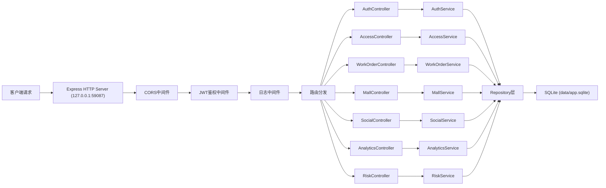
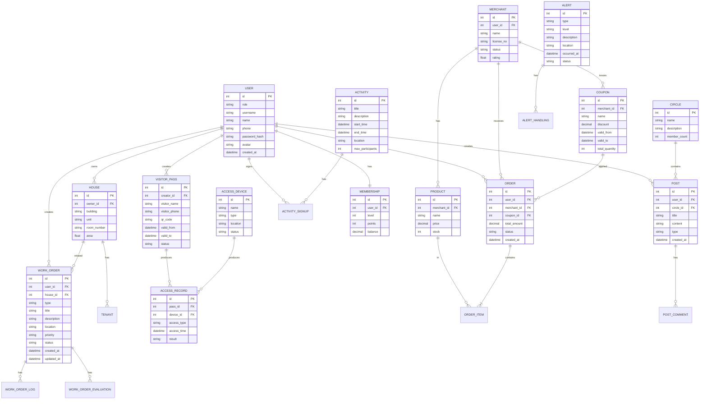

## 1. 架构设计



## 2. 技术栈说明

### 2.1 前端技术栈
- **框架**: React 18 + TypeScript
- **构建工具**: Vite 5
- **路由**: React Router v6
- **状态管理**: Zustand
- **UI框架**: Tailwind CSS 3
- **图标库**: Lucide React
- **HTTP客户端**: Axios
- **图表库**: Recharts (数据可视化)
- **二维码生成**: qrcode.react

### 2.2 后端技术栈
- **框架**: Express 4 + TypeScript
- **运行时**: Node.js 18+
- **ORM**: Better-SQLite3 (同步SQLite驱动)
- **数据库**: SQLite 3 (data/app.sqlite)
- **认证**: JWT (jsonwebtoken)
- **密码加密**: bcryptjs
- **CORS**: cors中间件
- **日志**: winston

### 2.3 项目初始化工具
- 使用 `vite-init` 模板: **react-express-ts** (React + TypeScript + Express全栈模板)

## 3. 端口配置

根据项目目录 `may-89087` 计算:
- N = 89087
- tail4 = 9087 (后四位)
- **FRONTEND_PORT = 49087**
- **BACKEND_PORT = 59087**

所有服务绑定地址: 127.0.0.1

## 4. 目录结构

```
may-89087/
├── .env                           # 环境变量配置
├── .trae/
│   └── documents/
│       ├── PRD.md                # 产品需求文档
│       └── TECH_ARCHITECTURE.md  # 技术架构文档
├── data/
│   └── app.sqlite                # SQLite数据库文件
├── migrations/                    # 数据库迁移脚本
│   └── 001_initial_schema.sql
├── shared/                        # 前后端共享类型定义
│   └── types.ts
├── src/                           # 前端源码
│   ├── components/               # 可复用组件
│   │   ├── layout/
│   │   ├── common/
│   │   └── charts/
│   ├── pages/                    # 页面组件
│   │   ├── Login.tsx
│   │   ├── Dashboard.tsx
│   │   ├── AccessControl.tsx
│   │   ├── WorkOrder.tsx
│   │   ├── Mall.tsx
│   │   ├── Social.tsx
│   │   ├── PropertyDashboard.tsx
│   │   ├── MerchantDashboard.tsx
│   │   ├── RiskWarning.tsx
│   │   └── Profile.tsx
│   ├── hooks/                    # 自定义Hooks
│   ├── store/                    # Zustand状态管理
│   ├── utils/                    # 工具函数
│   ├── api/                      # API请求封装
│   ├── App.tsx
│   ├── main.tsx
│   └── index.css
├── api/                           # 后端源码
│   ├── src/
│   │   ├── config/              # 配置文件
│   │   ├── middleware/          # 中间件
│   │   ├── controllers/         # 控制器
│   │   │   ├── auth.controller.ts
│   │   │   ├── access.controller.ts
│   │   │   ├── workorder.controller.ts
│   │   │   ├── mall.controller.ts
│   │   │   ├── social.controller.ts
│   │   │   ├── analytics.controller.ts
│   │   │   └── risk.controller.ts
│   │   ├── services/            # 业务逻辑层
│   │   ├── repositories/        # 数据访问层
│   │   ├── models/              # 数据模型
│   │   ├── routes/              # 路由定义
│   │   ├── database/            # 数据库连接
│   │   └── index.ts             # 服务入口
│   └── tsconfig.json
├── frontend.log                  # 前端运行日志
├── backend.log                   # 后端运行日志
├── package.json
├── tsconfig.json
├── vite.config.ts
├── tailwind.config.js
└── postcss.config.js
```

## 5. 路由定义

### 5.1 前端路由

| 路由路径 | 页面名称 | 访问角色 |
|----------|----------|----------|
| /login | 登录页 | 所有 |
| /dashboard | 首页工作台 | 业主/租户/物业/商户 |
| /access | 通行管理 | 业主/租户/物业 |
| /workorder | 工单中心 | 业主/租户/物业 |
| /mall | 商圈首页 | 业主/租户/访客 |
| /social | 邻里社交 | 业主/租户 |
| /property/dashboard | 物业驾驶舱 | 物业管理员 |
| /merchant/dashboard | 商户后台 | 商户 |
| /risk | 风险预警 | 物业管理员 |
| /profile | 个人中心 | 所有登录用户 |

### 5.2 后端API路由

| 路由前缀 | 模块 | 说明 |
|----------|------|------|
| /api/auth | 认证模块 | 登录、注册、权限验证 |
| /api/access | 通行模块 | 门禁、访客、通行记录 |
| /api/workorder | 工单模块 | 报事报修、派单、评价 |
| /api/mall | 商圈模块 | 商户、商品、优惠券、订单 |
| /api/social | 社交模块 | 楼栋群、圈子、闲置、活动 |
| /api/analytics | 分析模块 | KPI、经营数据、报表 |
| /api/risk | 风险模块 | 告警、预警、处置 |
| /api/health | 健康检查 | 服务健康状态 |

## 6. API定义

### 6.1 认证接口

```typescript
// 登录请求
interface LoginRequest {
  role: 'owner' | 'tenant' | 'visitor' | 'property' | 'merchant';
  username: string;
  password: string;
}

// 登录响应
interface LoginResponse {
  token: string;
  user: {
    id: number;
    role: string;
    name: string;
    avatar?: string;
    permissions: string[];
  };
}
```

### 6.2 工单接口

```typescript
// 创建工单
interface CreateWorkOrderRequest {
  type: 'repair' | 'complaint' | 'suggestion' | 'consultation';
  title: string;
  description: string;
  location: string;
  images?: string[];
  priority: 'low' | 'medium' | 'high' | 'urgent';
}

// 工单状态流转
interface UpdateWorkOrderStatusRequest {
  status: 'pending' | 'assigned' | 'processing' | 'completed' | 'closed';
  remark?: string;
}
```

### 6.3 访客邀请接口

```typescript
interface CreateVisitorRequest {
  visitorName: string;
  visitorPhone: string;
  visitorIdCard?: string;
  validFrom: string;
  validTo: string;
  accessAreas: string[];
}

interface VisitorPassResponse {
  id: number;
  qrCode: string;
  validFrom: string;
  validTo: string;
  status: 'active' | 'expired' | 'used';
}
```

## 7. 服务器架构



## 8. 数据模型

### 8.1 ER图



### 8.2 DDL语句

```sql
-- 用户表
CREATE TABLE users (
    id INTEGER PRIMARY KEY AUTOINCREMENT,
    role VARCHAR(20) NOT NULL,
    username VARCHAR(50) UNIQUE NOT NULL,
    name VARCHAR(100) NOT NULL,
    phone VARCHAR(20) UNIQUE,
    password_hash VARCHAR(255) NOT NULL,
    avatar VARCHAR(500),
    created_at DATETIME DEFAULT CURRENT_TIMESTAMP
);

-- 房屋表
CREATE TABLE houses (
    id INTEGER PRIMARY KEY AUTOINCREMENT,
    owner_id INTEGER REFERENCES users(id),
    building VARCHAR(20) NOT NULL,
    unit VARCHAR(20) NOT NULL,
    room_number VARCHAR(20) NOT NULL,
    area DECIMAL(10,2),
    created_at DATETIME DEFAULT CURRENT_TIMESTAMP
);

-- 工单表
CREATE TABLE work_orders (
    id INTEGER PRIMARY KEY AUTOINCREMENT,
    user_id INTEGER REFERENCES users(id),
    house_id INTEGER REFERENCES houses(id),
    type VARCHAR(50) NOT NULL,
    title VARCHAR(200) NOT NULL,
    description TEXT,
    location VARCHAR(200),
    priority VARCHAR(20) DEFAULT 'medium',
    status VARCHAR(20) DEFAULT 'pending',
    assignee_id INTEGER REFERENCES users(id),
    created_at DATETIME DEFAULT CURRENT_TIMESTAMP,
    updated_at DATETIME DEFAULT CURRENT_TIMESTAMP
);

-- 访客通行证表
CREATE TABLE visitor_passes (
    id INTEGER PRIMARY KEY AUTOINCREMENT,
    creator_id INTEGER REFERENCES users(id),
    visitor_name VARCHAR(100) NOT NULL,
    visitor_phone VARCHAR(20) NOT NULL,
    visitor_id_card VARCHAR(20),
    qr_code VARCHAR(500) UNIQUE NOT NULL,
    access_areas TEXT,
    valid_from DATETIME NOT NULL,
    valid_to DATETIME NOT NULL,
    status VARCHAR(20) DEFAULT 'active',
    created_at DATETIME DEFAULT CURRENT_TIMESTAMP
);

-- 商户表
CREATE TABLE merchants (
    id INTEGER PRIMARY KEY AUTOINCREMENT,
    user_id INTEGER REFERENCES users(id),
    name VARCHAR(200) NOT NULL,
    license_no VARCHAR(100),
    description TEXT,
    logo_url VARCHAR(500),
    status VARCHAR(20) DEFAULT 'pending',
    rating DECIMAL(3,2) DEFAULT 5.0,
    created_at DATETIME DEFAULT CURRENT_TIMESTAMP
);

-- 商品表
CREATE TABLE products (
    id INTEGER PRIMARY KEY AUTOINCREMENT,
    merchant_id INTEGER REFERENCES merchants(id),
    name VARCHAR(200) NOT NULL,
    description TEXT,
    price DECIMAL(10,2) NOT NULL,
    stock INTEGER DEFAULT 0,
    image_url VARCHAR(500),
    category VARCHAR(50),
    status VARCHAR(20) DEFAULT 'active',
    created_at DATETIME DEFAULT CURRENT_TIMESTAMP
);

-- 优惠券表
CREATE TABLE coupons (
    id INTEGER PRIMARY KEY AUTOINCREMENT,
    merchant_id INTEGER REFERENCES merchants(id),
    name VARCHAR(200) NOT NULL,
    discount_type VARCHAR(20) NOT NULL,
    discount_value DECIMAL(10,2) NOT NULL,
    min_amount DECIMAL(10,2) DEFAULT 0,
    total_quantity INTEGER DEFAULT 0,
    used_quantity INTEGER DEFAULT 0,
    valid_from DATETIME NOT NULL,
    valid_to DATETIME NOT NULL,
    created_at DATETIME DEFAULT CURRENT_TIMESTAMP
);

-- 订单表
CREATE TABLE orders (
    id INTEGER PRIMARY KEY AUTOINCREMENT,
    user_id INTEGER REFERENCES users(id),
    merchant_id INTEGER REFERENCES merchants(id),
    coupon_id INTEGER REFERENCES coupons(id),
    total_amount DECIMAL(10,2) NOT NULL,
    discount_amount DECIMAL(10,2) DEFAULT 0,
    pay_amount DECIMAL(10,2) NOT NULL,
    status VARCHAR(20) DEFAULT 'pending',
    created_at DATETIME DEFAULT CURRENT_TIMESTAMP
);

-- 帖子表
CREATE TABLE posts (
    id INTEGER PRIMARY KEY AUTOINCREMENT,
    user_id INTEGER REFERENCES users(id),
    circle_id INTEGER REFERENCES circles(id),
    title VARCHAR(200) NOT NULL,
    content TEXT,
    type VARCHAR(20) DEFAULT 'normal',
    images TEXT,
    like_count INTEGER DEFAULT 0,
    comment_count INTEGER DEFAULT 0,
    created_at DATETIME DEFAULT CURRENT_TIMESTAMP
);

-- 活动表
CREATE TABLE activities (
    id INTEGER PRIMARY KEY AUTOINCREMENT,
    title VARCHAR(200) NOT NULL,
    description TEXT,
    start_time DATETIME NOT NULL,
    end_time DATETIME NOT NULL,
    location VARCHAR(200),
    max_participants INTEGER,
    participant_count INTEGER DEFAULT 0,
    organizer_id INTEGER REFERENCES users(id),
    status VARCHAR(20) DEFAULT 'active',
    created_at DATETIME DEFAULT CURRENT_TIMESTAMP
);

-- 告警表
CREATE TABLE alerts (
    id INTEGER PRIMARY KEY AUTOINCREMENT,
    type VARCHAR(50) NOT NULL,
    level VARCHAR(20) NOT NULL,
    title VARCHAR(200) NOT NULL,
    description TEXT,
    location VARCHAR(200),
    image_url VARCHAR(500),
    status VARCHAR(20) DEFAULT 'pending',
    handler_id INTEGER REFERENCES users(id),
    occurred_at DATETIME DEFAULT CURRENT_TIMESTAMP,
    handled_at DATETIME
);

-- 会员表
CREATE TABLE memberships (
    id INTEGER PRIMARY KEY AUTOINCREMENT,
    user_id INTEGER UNIQUE REFERENCES users(id),
    level INTEGER DEFAULT 1,
    points INTEGER DEFAULT 0,
    balance DECIMAL(10,2) DEFAULT 0,
    total_spent DECIMAL(10,2) DEFAULT 0,
    updated_at DATETIME DEFAULT CURRENT_TIMESTAMP,
    created_at DATETIME DEFAULT CURRENT_TIMESTAMP
);

-- 创建索引
CREATE INDEX idx_work_orders_user_id ON work_orders(user_id);
CREATE INDEX idx_work_orders_status ON work_orders(status);
CREATE INDEX idx_visitor_passes_qr_code ON visitor_passes(qr_code);
CREATE INDEX idx_visitor_passes_status ON visitor_passes(status);
CREATE INDEX idx_orders_user_id ON orders(user_id);
CREATE INDEX idx_orders_merchant_id ON orders(merchant_id);
CREATE INDEX idx_alerts_status ON alerts(status);
CREATE INDEX idx_alerts_level ON alerts(level);
```

## 9. 启动脚本配置

### 9.1 package.json scripts

```json
{
  "scripts": {
    "dev:frontend": "vite --host 127.0.0.1 --port 49087 --strictPort",
    "dev:backend": "tsx watch api/src/index.ts",
    "dev": "concurrently -k \"npm:dev:frontend\" \"npm:dev:backend\"",
    "build": "tsc -b && vite build",
    "start:frontend": "vite --host 127.0.0.1 --port 49087 --strictPort > frontend.log 2>&1 &",
    "start:backend": "tsx api/src/index.ts > backend.log 2>&1 &",
    "start": "npm run start:backend && sleep 2 && npm run start:frontend",
    "db:init": "tsx api/src/database/init.ts",
    "db:seed": "tsx api/src/database/seed.ts"
  }
}
```

### 9.2 Vite配置 (vite.config.ts)

```typescript
import { defineConfig, loadEnv } from 'vite';
import react from '@vitejs/plugin-react';
import path from 'path';

export default defineConfig(({ mode }) => {
  const env = loadEnv(mode, process.cwd(), '');
  return {
    plugins: [react()],
    server: {
      host: '127.0.0.1',
      port: parseInt(env.FRONTEND_PORT || '49087'),
      strictPort: true,
      proxy: {
        '/api': {
          target: `http://127.0.0.1:${env.BACKEND_PORT || '59087'}`,
          changeOrigin: true
        }
      }
    },
    resolve: {
      alias: {
        '@': path.resolve(__dirname, './src')
      }
    }
  };
});
```

## 10. 环境变量 (.env)

```dotenv
# 端口配置
FRONTEND_PORT=49087
BACKEND_PORT=59087

# 地址配置
FRONTEND_URL=http://127.0.0.1:49087
BACKEND_URL=http://127.0.0.1:59087
VITE_API_URL=http://127.0.0.1:59087/api

# 数据库配置
DATABASE_PATH=./data/app.sqlite

# JWT配置
JWT_SECRET=smart_community_2024_secret_key
JWT_EXPIRES_IN=24h

# CORS配置
CORS_ORIGIN=http://127.0.0.1:49087
```
