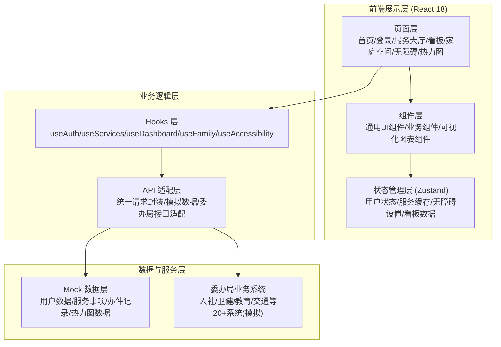

## 1. 架构设计



## 2. 技术描述

- **前端框架**: React 18.3 + TypeScript 5.8
- **构建工具**: Vite 6.3
- **样式方案**: Tailwind CSS 3.4 + CSS 变量主题系统
- **路由管理**: React Router DOM 7.3
- **状态管理**: Zustand 5.0
- **图标库**: Lucide React 0.511
- **可视化**: 纯 SVG + CSS 实现热力图、折线图、柱状图、饼图（不引入额外图表库）
- **语音合成**: 浏览器原生 Web Speech API
- **后端**: 无后端，使用 Mock 数据模拟委办局接口响应
- **数据存储**: LocalStorage 持久化用户登录状态、无障碍设置、家庭绑定关系

## 3. 路由定义

| 路由路径 | 页面名称 | 用途 |
|----------|----------|------|
| `/login` | 统一身份认证登录页 | 身份证/社保卡/电子医保凭证三合一登录 |
| `/` | 首页 | 四地切换、服务导航、热门推荐、个人入口 |
| `/services` | 服务大厅 | 服务事项列表、分类筛选、搜索 |
| `/services/:id` | 服务详情页 | 服务指南、材料清单、在线办理表单 |
| `/dashboard` | 服务状态实时看板 | 办件统计、超期预警、情感分析、委办局状态 |
| `/family` | 家庭空间 | 亲属管理、代办服务中心 |
| `/accessibility` | 无障碍设置 | 语音导航、字体大小、高对比度、读屏模式 |
| `/heatmap` | 服务热力图 | 行政区/年龄/时段三维度热力分析 |
| `/profile` | 个人中心 | 个人信息、办件记录、收藏服务 |

## 4. 数据模型

### 4.1 核心类型定义

```typescript
// 用户与认证
interface User {
  id: string;
  name: string;
  idCardNumber: string; // 脱敏后
  socialSecurityNumber: string;
  medicalInsuranceNumber: string;
  phone: string;
  city: 'chengdu' | 'deyang' | 'meishan' | 'ziyang';
  avatar?: string;
}

type AuthMethod = 'idcard' | 'socialcard' | 'medicalcard';

// 服务事项
interface ServiceItem {
  id: string;
  name: string;
  category: string; // 人社/卫健/教育/交通等
  bureau: string; // 所属委办局
  city: string[]; // 支持的城市
  description: string;
  requiredMaterials: string[];
  processingTime: number; // 承诺工作日
  averageProcessingTime: number; // 实际平均时长（小时）
  status: 'active' | 'maintenance';
  isHot: boolean;
  steps: ServiceStep[];
}

interface ServiceStep {
  id: number;
  name: string;
  description: string;
  requiredFields?: FormField[];
}

// 办件记录
interface ServiceRecord {
  id: string;
  serviceId: string;
  serviceName: string;
  userId: string;
  applicantName: string;
  status: 'pending' | 'processing' | 'completed' | 'overdue' | 'rejected';
  submitTime: string;
  estimatedCompleteTime: string;
  actualCompleteTime?: string;
  currentStep: number;
  rating?: number;
  review?: string;
  sentiment?: 'positive' | 'neutral' | 'negative';
  bureau: string;
  city: string;
}

// 亲属关系
interface FamilyMember {
  id: string;
  name: string;
  relation: 'parent' | 'spouse' | 'child' | 'other';
  idCardNumber: string;
  phone: string;
  authorized: boolean; // 是否授权代办
  avatar?: string;
}

// 无障碍设置
interface AccessibilitySettings {
  voiceNavigation: boolean;
  highContrast: boolean;
  fontSize: 'normal' | 'large' | 'xlarge';
  screenReader: boolean;
}

// 热力图数据
interface HeatmapData {
  byDistrict: DistrictHeat[];
  byAge: AgeHeat[];
  byTimeSlot: TimeSlotHeat[];
  topServices: TopService[];
}

interface DistrictHeat {
  name: string; // 行政区名
  city: string;
  count: number;
}

interface AgeHeat {
  ageGroup: string; // '0-18', '19-35', '36-50', '51-65', '65+'
  count: number;
  topService: string;
}

interface TimeSlotHeat {
  hour: number; // 0-23
  count: number;
}

interface TopService {
  serviceId: string;
  serviceName: string;
  count: number;
  category: string;
}

// 看板数据
interface DashboardData {
  todayCount: number;
  avgProcessingHours: number;
  onTimeRate: number;
  positiveRate: number;
  processingTrend: TrendPoint[];
  overdueByBureau: BureauOverdue[];
  sentimentDistribution: SentimentStat[];
  bureauStatuses: BureauStatus[];
  recentLowReviews: LowReview[];
}

interface TrendPoint {
  date: string;
  avgHours: number;
}

interface BureauOverdue {
  bureau: string;
  overdueCount: number;
  totalCount: number;
}

interface SentimentStat {
  sentiment: 'positive' | 'neutral' | 'negative';
  count: number;
  percentage: number;
}

interface BureauStatus {
  bureau: string;
  status: 'normal' | 'warning' | 'maintenance';
  lastSync: string;
  responseTime: number;
}

interface LowReview {
  id: string;
  serviceName: string;
  rating: number;
  review: string;
  submitTime: string;
  sentiment: 'negative' | 'neutral';
}
```

### 4.2 Mock 数据规划

- 用户数据：3 个示例账号，分属四地不同城市
- 服务事项：50+ 个服务，覆盖人社、卫健、教育、交通、公安、民政、公积金等 10+ 委办局
- 办件记录：100+ 条历史办件，覆盖各状态与各城市
- 亲属关系：每个示例用户 2-3 位亲属
- 热力图数据：四地各行政区、5 个年龄段、24 小时时段的访问统计
- 看板数据：实时统计指标、趋势、预警、评价情感分析数据
