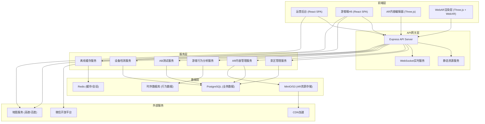
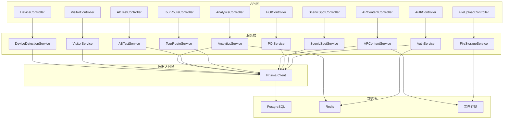
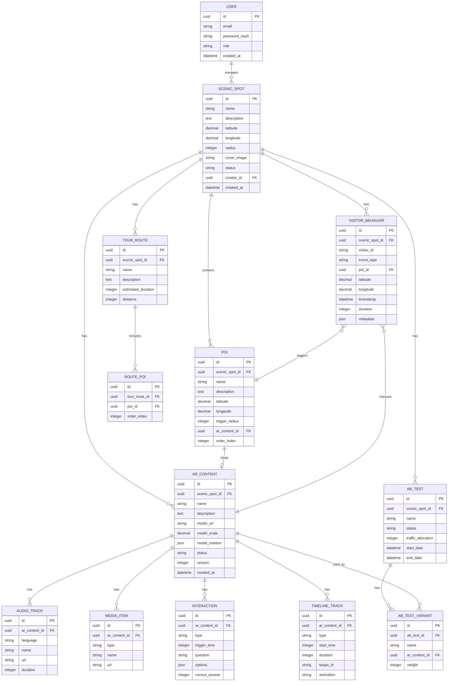

## 1. 架构设计

系统采用前后端分离架构，前端包含运营后台管理系统和游客端H5两套应用，后端提供统一的API服务。数据层采用关系型数据库存储业务数据，对象存储管理AR资源文件。



## 2. 技术描述

### 2.1 技术栈选型

- **前端框架**：React@18 + TypeScript
- **构建工具**：Vite@5
- **样式方案**：TailwindCSS@3 + CSS Variables
- **状态管理**：Zustand
- **路由管理**：React Router@6
- **3D渲染**：Three.js@0.160 + @react-three/fiber + @react-three/drei
- **WebAR**：WebXR API + AR.js（降级方案）
- **地图组件**：@react-google-maps/api 或 高德地图JS API
- **图表可视化**：ECharts@5
- **UI组件库**：Radix UI Primitives + shadcn/ui
- **图标库**：Lucide React
- **动画库**：Framer Motion
- **后端框架**：Express@4 + TypeScript
- **ORM**：Prisma@5
- **数据库**：PostgreSQL@15（开发环境使用SQLite）
- **缓存**：Redis@7（开发环境使用ioredis-mock）
- **文件存储**：本地文件系统（开发环境）/ MinIO（生产环境）
- **认证**：JWT + bcryptjs
- **实时通信**：Socket.io
- **测试框架**：Vitest（单元测试）+ Playwright（E2E）

### 2.2 项目初始化

使用 `react-express-ts` 模板初始化项目，支持前后端同仓开发。

## 3. 路由定义

### 3.1 运营后台路由

| 路由 | 页面 | 权限要求 |
|------|------|----------|
| `/login` | 登录页 | 公开 |
| `/dashboard` | 控制台概览 | 需要登录 |
| `/scenic-spots` | 景区列表 | 需要登录 |
| `/scenic-spots/:id` | 景区详情/编辑 | 需要登录 |
| `/scenic-spots/:id/pois` | POI点位管理 | 需要登录 |
| `/ar-contents` | AR内容包列表 | 需要登录 |
| `/ar-contents/:id` | AR内容详情 | 需要登录 |
| `/ar-editor/:contentId` | AR内容编辑器 | 需要登录 |
| `/routes` | 导览动线配置 | 需要登录 |
| `/ab-testing` | AB测试管理 | 需要登录 |
| `/analytics/heatmap` | 热力图分析 | 需要登录 |
| `/analytics/behavior` | 行为分析报表 | 需要登录 |
| `/device-compatibility` | 设备兼容性检测 | 需要登录 |
| `/settings` | 系统设置 | 需要登录 |

### 3.2 游客端H5路由

| 路由 | 页面 | 说明 |
|------|------|------|
| `/visitor/:scenicSpotId` | 景区首页 | 微信扫码入口 |
| `/visitor/:scenicSpotId/ar` | AR导览体验 | 相机AR模式 |
| `/visitor/:scenicSpotId/guide` | 图文导览 | 降级模式 |
| `/visitor/:scenicSpotId/offline` | 离线缓存管理 | 内容下载管理 |

## 4. API 定义

### 4.1 类型定义

```typescript
// 景区
interface ScenicSpot {
  id: string;
  name: string;
  description: string;
  latitude: number;
  longitude: number;
  radius: number;
  coverImage: string;
  status: 'draft' | 'published' | 'archived';
  createdAt: Date;
  updatedAt: Date;
}

// POI点位
interface POI {
  id: string;
  scenicSpotId: string;
  name: string;
  description: string;
  latitude: number;
  longitude: number;
  triggerRadius: number;
  arContentId?: string;
  orderIndex: number;
}

// AR内容包
interface ARContent {
  id: string;
  name: string;
  description: string;
  scenicSpotId: string;
  modelUrl: string;
  modelScale: number;
  modelRotation: { x: number; y: number; z: number };
  audioTracks: AudioTrack[];
  images: MediaItem[];
  videos: MediaItem[];
  interactions: Interaction[];
  timeline: TimelineTrack[];
  status: 'draft' | 'published';
  version: number;
}

// 音轨
interface AudioTrack {
  id: string;
  language: string;
  name: string;
  url: string;
  duration: number;
}

// 互动问答
interface Interaction {
  id: string;
  type: 'qa' | 'quiz' | 'poll';
  triggerTime: number;
  question: string;
  options: string[];
  correctAnswer?: number;
}

// 时间轴轨道
interface TimelineTrack {
  id: string;
  type: 'model' | 'audio' | 'image' | 'interaction';
  startTime: number;
  duration: number;
  targetId: string;
  animation?: string;
}

// 游客行为
interface VisitorBehavior {
  id: string;
  scenicSpotId: string;
  visitorId: string;
  eventType: 'enter' | 'poi_trigger' | 'interaction' | 'share' | 'exit';
  poiId?: string;
  latitude?: number;
  longitude?: number;
  timestamp: Date;
  duration?: number;
  metadata?: Record<string, unknown>;
}

// 导览动线
interface TourRoute {
  id: string;
  scenicSpotId: string;
  name: string;
  description: string;
  poiIds: string[];
  estimatedDuration: number;
  distance: number;
}

// AB测试
interface ABTest {
  id: string;
  name: string;
  scenicSpotId: string;
  status: 'running' | 'paused' | 'ended';
  variants: ABTestVariant[];
  trafficAllocation: number;
  startDate: Date;
  endDate?: Date;
}

interface ABTestVariant {
  id: string;
  name: string;
  arContentId: string;
  weight: number;
}
```

### 4.2 API 接口列表

| 方法 | 路径 | 描述 |
|------|------|------|
| POST | `/api/auth/login` | 运营者登录 |
| GET | `/api/auth/me` | 获取当前用户信息 |
| GET | `/api/scenic-spots` | 获取景区列表 |
| POST | `/api/scenic-spots` | 创建景区 |
| GET | `/api/scenic-spots/:id` | 获取景区详情 |
| PUT | `/api/scenic-spots/:id` | 更新景区 |
| DELETE | `/api/scenic-spots/:id` | 删除景区 |
| GET | `/api/scenic-spots/:id/pois` | 获取景区POI列表 |
| POST | `/api/scenic-spots/:id/pois` | 创建POI |
| PUT | `/api/pois/:id` | 更新POI |
| DELETE | `/api/pois/:id` | 删除POI |
| GET | `/api/ar-contents` | 获取AR内容包列表 |
| POST | `/api/ar-contents` | 创建AR内容包 |
| GET | `/api/ar-contents/:id` | 获取AR内容包详情 |
| PUT | `/api/ar-contents/:id` | 更新AR内容包 |
| POST | `/api/ar-contents/:id/publish` | 发布AR内容包 |
| POST | `/api/upload` | 文件上传（模型/音频/图片） |
| GET | `/api/tour-routes` | 获取导览动线列表 |
| POST | `/api/tour-routes` | 创建导览动线 |
| GET | `/api/ab-tests` | 获取AB测试列表 |
| POST | `/api/ab-tests` | 创建AB测试 |
| GET | `/api/analytics/heatmap/:scenicSpotId` | 获取热力图数据 |
| GET | `/api/analytics/behavior/:scenicSpotId` | 获取行为分析数据 |
| GET | `/api/visitor/scenic-spots/:id` | 游客端获取景区信息 |
| GET | `/api/visitor/ar-contents/:id` | 游客端获取AR内容 |
| POST | `/api/visitor/behaviors` | 上报游客行为 |
| POST | `/api/device/check` | 设备WebAR能力检测 |

## 5. 服务端架构图



## 6. 数据模型

### 6.1 ER 图



### 6.2 DDL 语句

```sql
-- 用户表
CREATE TABLE users (
    id UUID PRIMARY KEY DEFAULT gen_random_uuid(),
    email VARCHAR(255) UNIQUE NOT NULL,
    password_hash VARCHAR(255) NOT NULL,
    role VARCHAR(50) NOT NULL DEFAULT 'operator',
    created_at TIMESTAMP NOT NULL DEFAULT CURRENT_TIMESTAMP,
    updated_at TIMESTAMP NOT NULL DEFAULT CURRENT_TIMESTAMP
);

-- 景区表
CREATE TABLE scenic_spots (
    id UUID PRIMARY KEY DEFAULT gen_random_uuid(),
    name VARCHAR(255) NOT NULL,
    description TEXT,
    latitude DECIMAL(10, 8) NOT NULL,
    longitude DECIMAL(11, 8) NOT NULL,
    radius INTEGER DEFAULT 1000,
    cover_image VARCHAR(500),
    status VARCHAR(50) NOT NULL DEFAULT 'draft',
    creator_id UUID REFERENCES users(id),
    created_at TIMESTAMP NOT NULL DEFAULT CURRENT_TIMESTAMP,
    updated_at TIMESTAMP NOT NULL DEFAULT CURRENT_TIMESTAMP
);

-- POI表
CREATE TABLE pois (
    id UUID PRIMARY KEY DEFAULT gen_random_uuid(),
    scenic_spot_id UUID REFERENCES scenic_spots(id) ON DELETE CASCADE,
    name VARCHAR(255) NOT NULL,
    description TEXT,
    latitude DECIMAL(10, 8) NOT NULL,
    longitude DECIMAL(11, 8) NOT NULL,
    trigger_radius INTEGER DEFAULT 50,
    ar_content_id UUID REFERENCES ar_contents(id) ON DELETE SET NULL,
    order_index INTEGER NOT NULL DEFAULT 0,
    created_at TIMESTAMP NOT NULL DEFAULT CURRENT_TIMESTAMP,
    updated_at TIMESTAMP NOT NULL DEFAULT CURRENT_TIMESTAMP
);

-- AR内容包表
CREATE TABLE ar_contents (
    id UUID PRIMARY KEY DEFAULT gen_random_uuid(),
    scenic_spot_id UUID REFERENCES scenic_spots(id) ON DELETE CASCADE,
    name VARCHAR(255) NOT NULL,
    description TEXT,
    model_url VARCHAR(500),
    model_scale DECIMAL(8, 4) DEFAULT 1.0,
    model_rotation JSONB DEFAULT '{"x": 0, "y": 0, "z": 0}',
    status VARCHAR(50) NOT NULL DEFAULT 'draft',
    version INTEGER NOT NULL DEFAULT 1,
    created_at TIMESTAMP NOT NULL DEFAULT CURRENT_TIMESTAMP,
    updated_at TIMESTAMP NOT NULL DEFAULT CURRENT_TIMESTAMP
);

-- 音轨表
CREATE TABLE audio_tracks (
    id UUID PRIMARY KEY DEFAULT gen_random_uuid(),
    ar_content_id UUID REFERENCES ar_contents(id) ON DELETE CASCADE,
    language VARCHAR(10) NOT NULL DEFAULT 'zh-CN',
    name VARCHAR(255) NOT NULL,
    url VARCHAR(500) NOT NULL,
    duration INTEGER NOT NULL,
    created_at TIMESTAMP NOT NULL DEFAULT CURRENT_TIMESTAMP
);

-- 媒体资源表
CREATE TABLE media_items (
    id UUID PRIMARY KEY DEFAULT gen_random_uuid(),
    ar_content_id UUID REFERENCES ar_contents(id) ON DELETE CASCADE,
    type VARCHAR(20) NOT NULL,
    name VARCHAR(255) NOT NULL,
    url VARCHAR(500) NOT NULL,
    created_at TIMESTAMP NOT NULL DEFAULT CURRENT_TIMESTAMP
);

-- 互动表
CREATE TABLE interactions (
    id UUID PRIMARY KEY DEFAULT gen_random_uuid(),
    ar_content_id UUID REFERENCES ar_contents(id) ON DELETE CASCADE,
    type VARCHAR(20) NOT NULL,
    trigger_time INTEGER NOT NULL DEFAULT 0,
    question TEXT NOT NULL,
    options JSONB NOT NULL,
    correct_answer INTEGER,
    created_at TIMESTAMP NOT NULL DEFAULT CURRENT_TIMESTAMP
);

-- 时间轴轨道表
CREATE TABLE timeline_tracks (
    id UUID PRIMARY KEY DEFAULT gen_random_uuid(),
    ar_content_id UUID REFERENCES ar_contents(id) ON DELETE CASCADE,
    type VARCHAR(20) NOT NULL,
    start_time INTEGER NOT NULL DEFAULT 0,
    duration INTEGER NOT NULL,
    target_id VARCHAR(100) NOT NULL,
    animation VARCHAR(100),
    created_at TIMESTAMP NOT NULL DEFAULT CURRENT_TIMESTAMP
);

-- 导览动线表
CREATE TABLE tour_routes (
    id UUID PRIMARY KEY DEFAULT gen_random_uuid(),
    scenic_spot_id UUID REFERENCES scenic_spots(id) ON DELETE CASCADE,
    name VARCHAR(255) NOT NULL,
    description TEXT,
    estimated_duration INTEGER,
    distance INTEGER,
    created_at TIMESTAMP NOT NULL DEFAULT CURRENT_TIMESTAMP,
    updated_at TIMESTAMP NOT NULL DEFAULT CURRENT_TIMESTAMP
);

-- 动线POI关联表
CREATE TABLE route_pois (
    id UUID PRIMARY KEY DEFAULT gen_random_uuid(),
    tour_route_id UUID REFERENCES tour_routes(id) ON DELETE CASCADE,
    poi_id UUID REFERENCES pois(id) ON DELETE CASCADE,
    order_index INTEGER NOT NULL DEFAULT 0,
    UNIQUE(tour_route_id, poi_id, order_index)
);

-- AB测试表
CREATE TABLE ab_tests (
    id UUID PRIMARY KEY DEFAULT gen_random_uuid(),
    scenic_spot_id UUID REFERENCES scenic_spots(id) ON DELETE CASCADE,
    name VARCHAR(255) NOT NULL,
    status VARCHAR(50) NOT NULL DEFAULT 'draft',
    traffic_allocation INTEGER NOT NULL DEFAULT 100,
    start_date TIMESTAMP,
    end_date TIMESTAMP,
    created_at TIMESTAMP NOT NULL DEFAULT CURRENT_TIMESTAMP,
    updated_at TIMESTAMP NOT NULL DEFAULT CURRENT_TIMESTAMP
);

-- AB测试变体表
CREATE TABLE ab_test_variants (
    id UUID PRIMARY KEY DEFAULT gen_random_uuid(),
    ab_test_id UUID REFERENCES ab_tests(id) ON DELETE CASCADE,
    name VARCHAR(255) NOT NULL,
    ar_content_id UUID REFERENCES ar_contents(id) ON DELETE CASCADE,
    weight INTEGER NOT NULL DEFAULT 50,
    created_at TIMESTAMP NOT NULL DEFAULT CURRENT_TIMESTAMP
);

-- 游客行为表
CREATE TABLE visitor_behaviors (
    id UUID PRIMARY KEY DEFAULT gen_random_uuid(),
    scenic_spot_id UUID REFERENCES scenic_spots(id) ON DELETE CASCADE,
    visitor_id VARCHAR(100) NOT NULL,
    event_type VARCHAR(50) NOT NULL,
    poi_id UUID REFERENCES pois(id) ON DELETE SET NULL,
    latitude DECIMAL(10, 8),
    longitude DECIMAL(11, 8),
    timestamp TIMESTAMP NOT NULL DEFAULT CURRENT_TIMESTAMP,
    duration INTEGER,
    metadata JSONB,
    INDEX idx_visitor_scenic (scenic_spot_id, visitor_id),
    INDEX idx_event_time (event_type, timestamp)
);

-- 初始化管理员账号 (密码: admin123456)
INSERT INTO users (email, password_hash, role) VALUES 
('admin@ar-tour.com', '$2a$10$N9qo8uLOickgx2ZMRZoMyeIjZAgcfl7p92ldGxad68LJZdL17lhWy', 'admin');
```
