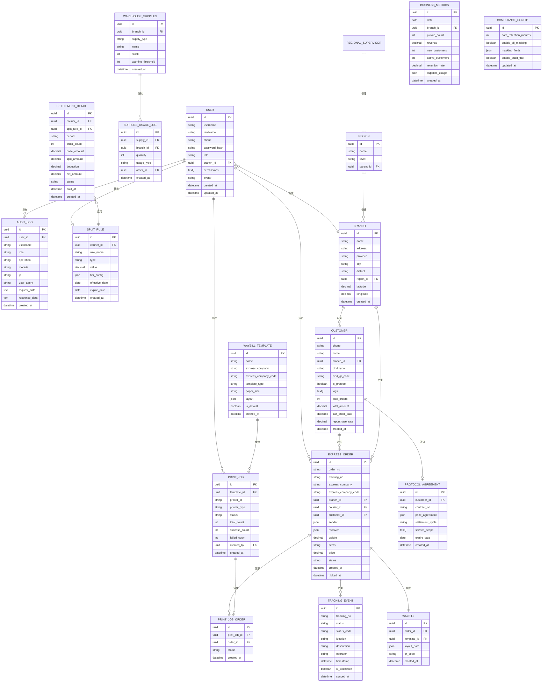

## 1. 架构设计

```mermaid
graph TD
    "客户端层" --> "Web前端 (React 18)"
    "客户端层" --> "移动端 H5"
    "Web前端 (React 18)" --> "API Gateway (Nginx)"
    "移动端 H5" --> "API Gateway (Nginx)"
    "API Gateway (Nginx)" --> "业务服务层"
    subgraph "业务服务层"
        "工作台服务" --> "核心业务逻辑"
        "面单打印服务" --> "核心业务逻辑"
        "客户关系服务" --> "核心业务逻辑"
        "录单服务" --> "核心业务逻辑"
        "物流轨迹服务" --> "核心业务逻辑"
        "经营分析服务" --> "核心业务逻辑"
        "分账对账服务" --> "核心业务逻辑"
        "权限与审计服务" --> "核心业务逻辑"
    end
    "核心业务逻辑" --> "数据访问层 (Prisma ORM)"
    "数据访问层 (Prisma ORM)" --> "数据库 (PostgreSQL)"
    "核心业务逻辑" --> "缓存层 (Redis)"
    "核心业务逻辑" --> "外部服务集成"
    subgraph "外部服务集成"
        "2100+快递公司 API"
        "云打印驱动服务 (PC/移动端)"
        "OCR 识别服务"
        "地图与热力图服务"
    end
    "操作日志" --> "审计数据存储"
```

## 2. 技术选型说明

- **前端框架**：React 18 + TypeScript + Vite 5，采用单页应用架构
- **UI 组件库**：使用 Tailwind CSS 3 自定义组件体系，配合 shadcn/ui 组件库
- **状态管理**：Zustand 用于全局状态，React Query 处理服务端状态
- **路由**：React Router 6
- **图表可视化**：ECharts 5 用于数据看板、图表、热力图
- **地图组件**：Leaflet 用于区域热力图展示
- **打印驱动**：浏览器 Web Print API + 移动端蓝牙打印 SDK
- **后端**：Node.js + Express 4（RESTful API）
- **ORM**：Prisma
- **数据库**：PostgreSQL 15（主存）+ Redis 7（缓存与会话）
- **认证**：JWT Token + RBAC 权限控制
- **OCR 集成**：预留 Tesseract.js 本地 OCR 能力 + 第三方 OCR API 接入
- **Mock 数据**：MSW + Faker.js 模拟后端接口与快递公司 API

## 3. 路由定义

| 路由路径 | 页面名称 | 访问权限 |
|----------|----------|----------|
| `/login` | 登录页 | 公开 |
| `/dashboard` | 工作台首页 | 快递员 / 网点管理员 / 区域主管 |
| `/print-center` | 面单云打印中心 | 快递员 / 网点管理员 |
| `/print-center/templates` | 面单模板管理 | 网点管理员 |
| `/customers` | 客户关系管理 | 快递员 / 网点管理员 |
| `/customers/bind` | 客户绑定 | 快递员 / 网点管理员 |
| `/customers/profiles` | 协议客户档案 | 网点管理员 |
| `/order-entry` | 智能录单 | 快递员 / 网点管理员 |
| `/order-entry/batch` | 批量下单 | 网点管理员 |
| `/order-entry/ocr` | OCR识别录单 | 快递员 / 网点管理员 |
| `/tracking` | 物流轨迹聚合 | 快递员 / 网点管理员 / 区域主管 |
| `/analytics` | 网点经营看板 | 网点管理员 / 区域主管 |
| `/analytics/trends` | 揽件量趋势 | 网点管理员 / 区域主管 |
| `/analytics/heatmap` | 区域热力 | 网点管理员 / 区域主管 |
| `/analytics/retention` | 客户留存率 | 网点管理员 / 区域主管 |
| `/analytics/supplies` | 面单耗材统计 | 网点管理员 / 区域主管 |
| `/finance` | 分账对账中心 | 网点管理员 |
| `/finance/rules` | 分账规则配置 | 网点管理员 |
| `/finance/reports` | 对账报表 | 网点管理员 |
| `/settings` | 系统设置 | 网点管理员 / 区域主管 |
| `/settings/permissions` | 角色权限管理 | 网点管理员 / 区域主管 |
| `/settings/audit-log` | 操作日志审计 | 区域主管 |
| `/settings/compliance` | 数据合规设置 | 区域主管 |

## 4. API 接口定义

### 4.1 类型定义

```typescript
// 通用响应结构
interface ApiResponse<T> {
  code: number;
  message: string;
  data: T;
  timestamp: number;
}

// 分页结构
interface PageData<T> {
  list: T[];
  total: number;
  page: number;
  pageSize: number;
}

// 用户角色
type UserRole = 'courier' | 'branch_admin' | 'regional_supervisor';

// 用户信息
interface User {
  id: string;
  username: string;
  realName: string;
  phone: string;
  role: UserRole;
  branchId: string;
  permissions: string[];
  avatar?: string;
}

// 快递信息
interface ExpressOrder {
  id: string;
  orderNo: string;
  trackingNo: string;
  expressCompany: string;
  expressCompanyCode: string;
  sender: {
    name: string;
    phone: string;
    address: string;
    province: string;
    city: string;
    district: string;
  };
  receiver: {
    name: string;
    phone: string;
    address: string;
    province: string;
    city: string;
    district: string;
  };
  weight: number;
  items: string;
  price: number;
  status: 'pending_pickup' | 'picked' | 'in_transit' | 'delivered' | 'exception';
  courierId: string;
  customerId?: string;
  createdAt: string;
  pickedAt?: string;
}

// 客户信息
interface Customer {
  id: string;
  phone: string;
  name: string;
  bindType: 'phone' | 'qr_code';
  bindQrCode: string;
  isProtocol: boolean;
  protocolInfo?: {
    contractNo: string;
    priceAgreement: Record<string, number>;
    settlementCycle: 'daily' | 'weekly' | 'monthly';
    serviceScope: string[];
    expireDate: string;
  };
  tags: string[];
  totalOrders: number;
  totalAmount: number;
  lastOrderDate: string;
  repurchaseRate: number;
  createdAt: string;
}

// 物流轨迹
interface TrackingEvent {
  id: string;
  trackingNo: string;
  status: string;
  statusCode: string;
  location: string;
  description: string;
  operator: string;
  timestamp: string;
  isException: boolean;
}

// 面单模板
interface WaybillTemplate {
  id: string;
  name: string;
  expressCompany: string;
  expressCompanyCode: string;
  templateType: 'standard' | 'custom';
  paperSize: '100x180' | '76x130' | 'custom';
  layout: Record<string, { x: number; y: number; width: number; height: number; fontSize: number }>;
  isDefault: boolean;
  createdAt: string;
}

// 打印任务
interface PrintJob {
  id: string;
  orderIds: string[];
  templateId: string;
  printerId: string;
  printerType: 'pc_browser' | 'mobile_bluetooth' | 'mobile_wifi';
  status: 'queued' | 'printing' | 'success' | 'failed';
  totalCount: number;
  successCount: number;
  failedCount: number;
  createdAt: string;
  createdBy: string;
}

// 操作日志
interface AuditLog {
  id: string;
  userId: string;
  username: string;
  role: UserRole;
  operation: string;
  module: string;
  ip: string;
  userAgent: string;
  requestData?: string;
  responseData?: string;
  createdAt: string;
}

// 经营统计数据
interface BusinessMetrics {
  date: string;
  pickupCount: number;
  revenue: number;
  newCustomers: number;
  activeCustomers: number;
  retentionRate: number;
  suppliesUsage: Record<string, number>;
}

// 分账规则
interface SplitRule {
  id: string;
  courierId: string;
  ruleName: string;
  type: 'fixed' | 'percentage' | 'tiered';
  value: number;
  tierConfig?: { min: number; max: number; rate: number }[];
  effectiveDate: string;
  expireDate?: string;
}

// 对账明细
interface SettlementDetail {
  id: string;
  period: string;
  courierId: string;
  orderCount: number;
  baseAmount: number;
  splitAmount: number;
  deduction?: number;
  netAmount: number;
  status: 'pending' | 'confirmed' | 'paid';
  paidAt?: string;
}
```

### 4.2 核心接口列表

| 接口方法 | 接口路径 | 功能描述 |
|----------|----------|----------|
| POST | `/api/auth/login` | 用户登录 |
| GET | `/api/auth/profile` | 获取当前用户信息 |
| GET | `/api/dashboard/summary` | 获取工作台概览数据 |
| GET | `/api/dashboard/tasks` | 获取待办任务列表 |
| GET | `/api/orders` | 获取订单列表（分页） |
| GET | `/api/orders/:id` | 获取订单详情 |
| POST | `/api/orders` | 创建订单 |
| POST | `/api/orders/batch` | 批量创建订单 |
| POST | `/api/orders/ocr` | OCR识别创建订单 |
| PUT | `/api/orders/:id/pickup` | 确认揽收 |
| GET | `/api/orders/:id/waybill` | 获取面单数据 |
| GET | `/api/waybill-templates` | 获取面单模板列表 |
| POST | `/api/waybill-templates` | 新增面单模板 |
| PUT | `/api/waybill-templates/:id` | 更新面单模板 |
| POST | `/api/print/jobs` | 创建打印任务 |
| GET | `/api/print/jobs` | 获取打印任务列表 |
| GET | `/api/print/jobs/:id` | 获取打印任务详情 |
| GET | `/api/customers` | 获取客户列表 |
| GET | `/api/customers/:id` | 获取客户详情 |
| POST | `/api/customers/bind` | 绑定客户（手机号/二维码） |
| GET | `/api/customers/:id/orders` | 获取客户历史订单 |
| GET | `/api/customers/:id/repurchase` | 获取客户复购数据 |
| GET | `/api/tracking/:trackingNo` | 查询物流轨迹 |
| POST | `/api/tracking/batch` | 批量查询物流轨迹 |
| GET | `/api/analytics/daily-trends` | 获取日揽件量趋势 |
| GET | `/api/analytics/heatmap` | 获取区域热力数据 |
| GET | `/api/analytics/retention` | 获取客户留存数据 |
| GET | `/api/analytics/supplies` | 获取面单耗材统计 |
| GET | `/api/finance/rules` | 获取分账规则列表 |
| POST | `/api/finance/rules` | 创建分账规则 |
| GET | `/api/finance/reports` | 获取对账报表 |
| GET | `/api/finance/settlements` | 获取结算明细 |
| GET | `/api/settings/permissions` | 获取角色权限配置 |
| PUT | `/api/settings/permissions/:role` | 更新角色权限配置 |
| GET | `/api/settings/audit-log` | 获取操作日志列表 |
| GET | `/api/settings/compliance/config` | 获取合规配置 |
| PUT | `/api/settings/compliance/config` | 更新合规配置 |

## 5. 后端服务架构图

```mermaid
graph TD
    "HTTP 请求" --> "路由层 (Express Routes)"
    "路由层 (Express Routes)" --> "中间件层"
    subgraph "中间件层"
        "JWT 认证中间件"
        "RBAC 权限校验中间件"
        "请求参数校验中间件"
        "操作日志审计中间件"
        "敏感数据脱敏中间件"
    end
    "中间件层" --> "控制器层 (Controllers)"
    "控制器层 (Controllers)" --> "服务层 (Services)"
    subgraph "服务层 (Services)"
        "DashboardService"
        "OrderService"
        "PrintService"
        "CustomerService"
        "TrackingService"
        "AnalyticsService"
        "FinanceService"
        "PermissionService"
        "AuditService"
        "ComplianceService"
    end
    "服务层 (Services)" --> "数据访问层 (Prisma Repositories)"
    "数据访问层 (Prisma Repositories)" --> "PostgreSQL 15"
    "服务层 (Services)" --> "缓存层 (Redis)"
    "服务层 (Services)" --> "外部服务适配器"
    subgraph "外部服务适配器"
        "ExpressAPIAdapter"
        "PrintDriverAdapter"
        "OCRAdapter"
        "MapAdapter"
    end
    "操作日志审计中间件" --> "审计日志表"
    "敏感数据脱敏中间件" --> "合规配置"
```

## 6. 数据模型

### 6.1 ER 图



### 6.2 DDL 初始化语句

```sql
-- 创建用户表
CREATE TABLE "user" (
    id UUID PRIMARY KEY DEFAULT gen_random_uuid(),
    username VARCHAR(50) UNIQUE NOT NULL,
    real_name VARCHAR(50) NOT NULL,
    phone VARCHAR(20) UNIQUE NOT NULL,
    password_hash VARCHAR(255) NOT NULL,
    role VARCHAR(20) NOT NULL CHECK (role IN ('courier', 'branch_admin', 'regional_supervisor')),
    branch_id UUID REFERENCES branch(id),
    permissions TEXT[] DEFAULT '{}',
    avatar VARCHAR(255),
    created_at TIMESTAMP WITH TIME ZONE DEFAULT CURRENT_TIMESTAMP,
    updated_at TIMESTAMP WITH TIME ZONE DEFAULT CURRENT_TIMESTAMP
);

-- 创建网点表
CREATE TABLE branch (
    id UUID PRIMARY KEY DEFAULT gen_random_uuid(),
    name VARCHAR(100) NOT NULL,
    address VARCHAR(255) NOT NULL,
    province VARCHAR(50) NOT NULL,
    city VARCHAR(50) NOT NULL,
    district VARCHAR(50) NOT NULL,
    region_id UUID REFERENCES region(id),
    latitude DECIMAL(10, 8),
    longitude DECIMAL(11, 8),
    created_at TIMESTAMP WITH TIME ZONE DEFAULT CURRENT_TIMESTAMP
);

-- 创建区域表
CREATE TABLE region (
    id UUID PRIMARY KEY DEFAULT gen_random_uuid(),
    name VARCHAR(100) NOT NULL,
    level VARCHAR(20) NOT NULL,
    parent_id UUID REFERENCES region(id)
);

-- 创建客户表
CREATE TABLE customer (
    id UUID PRIMARY KEY DEFAULT gen_random_uuid(),
    phone VARCHAR(20) NOT NULL,
    name VARCHAR(50),
    branch_id UUID REFERENCES branch(id) NOT NULL,
    bind_type VARCHAR(20) NOT NULL CHECK (bind_type IN ('phone', 'qr_code')),
    bind_qr_code VARCHAR(255),
    is_protocol BOOLEAN DEFAULT FALSE,
    tags TEXT[] DEFAULT '{}',
    total_orders INT DEFAULT 0,
    total_amount DECIMAL(12, 2) DEFAULT 0,
    last_order_date TIMESTAMP WITH TIME ZONE,
    repurchase_rate DECIMAL(5, 4) DEFAULT 0,
    created_at TIMESTAMP WITH TIME ZONE DEFAULT CURRENT_TIMESTAMP,
    UNIQUE(phone, branch_id)
);

-- 创建协议客户档案表
CREATE TABLE protocol_agreement (
    id UUID PRIMARY KEY DEFAULT gen_random_uuid(),
    customer_id UUID REFERENCES customer(id) NOT NULL,
    contract_no VARCHAR(50) UNIQUE NOT NULL,
    price_agreement JSONB NOT NULL,
    settlement_cycle VARCHAR(20) NOT NULL CHECK (settlement_cycle IN ('daily', 'weekly', 'monthly')),
    service_scope TEXT[] NOT NULL,
    expire_date DATE NOT NULL,
    created_at TIMESTAMP WITH TIME ZONE DEFAULT CURRENT_TIMESTAMP
);

-- 创建订单表
CREATE TABLE express_order (
    id UUID PRIMARY KEY DEFAULT gen_random_uuid(),
    order_no VARCHAR(32) UNIQUE NOT NULL,
    tracking_no VARCHAR(50) NOT NULL,
    express_company VARCHAR(50) NOT NULL,
    express_company_code VARCHAR(20) NOT NULL,
    branch_id UUID REFERENCES branch(id) NOT NULL,
    courier_id UUID REFERENCES "user"(id),
    customer_id UUID REFERENCES customer(id),
    sender JSONB NOT NULL,
    receiver JSONB NOT NULL,
    weight DECIMAL(8, 2),
    items VARCHAR(255),
    price DECIMAL(10, 2) NOT NULL,
    status VARCHAR(20) NOT NULL CHECK (status IN ('pending_pickup', 'picked', 'in_transit', 'delivered', 'exception')),
    created_at TIMESTAMP WITH TIME ZONE DEFAULT CURRENT_TIMESTAMP,
    picked_at TIMESTAMP WITH TIME ZONE
);

-- 创建面单表
CREATE TABLE waybill (
    id UUID PRIMARY KEY DEFAULT gen_random_uuid(),
    order_id UUID REFERENCES express_order(id) NOT NULL,
    template_id UUID REFERENCES waybill_template(id) NOT NULL,
    layout_data JSONB NOT NULL,
    qr_code VARCHAR(255),
    created_at TIMESTAMP WITH TIME ZONE DEFAULT CURRENT_TIMESTAMP
);

-- 创建面单模板表
CREATE TABLE waybill_template (
    id UUID PRIMARY KEY DEFAULT gen_random_uuid(),
    name VARCHAR(50) NOT NULL,
    express_company VARCHAR(50) NOT NULL,
    express_company_code VARCHAR(20) NOT NULL,
    template_type VARCHAR(20) NOT NULL CHECK (template_type IN ('standard', 'custom')),
    paper_size VARCHAR(20) NOT NULL,
    layout JSONB NOT NULL,
    is_default BOOLEAN DEFAULT FALSE,
    created_at TIMESTAMP WITH TIME ZONE DEFAULT CURRENT_TIMESTAMP
);

-- 创建打印任务表
CREATE TABLE print_job (
    id UUID PRIMARY KEY DEFAULT gen_random_uuid(),
    template_id UUID REFERENCES waybill_template(id) NOT NULL,
    printer_id VARCHAR(50) NOT NULL,
    printer_type VARCHAR(20) NOT NULL CHECK (printer_type IN ('pc_browser', 'mobile_bluetooth', 'mobile_wifi')),
    status VARCHAR(20) NOT NULL CHECK (status IN ('queued', 'printing', 'success', 'failed')),
    total_count INT NOT NULL,
    success_count INT DEFAULT 0,
    failed_count INT DEFAULT 0,
    created_by UUID REFERENCES "user"(id) NOT NULL,
    created_at TIMESTAMP WITH TIME ZONE DEFAULT CURRENT_TIMESTAMP
);

-- 创建打印任务订单关联表
CREATE TABLE print_job_order (
    id UUID PRIMARY KEY DEFAULT gen_random_uuid(),
    print_job_id UUID REFERENCES print_job(id) NOT NULL,
    order_id UUID REFERENCES express_order(id) NOT NULL,
    status VARCHAR(20) CHECK (status IN ('pending', 'success', 'failed')),
    created_at TIMESTAMP WITH TIME ZONE DEFAULT CURRENT_TIMESTAMP
);

-- 创建物流轨迹表
CREATE TABLE tracking_event (
    id UUID PRIMARY KEY DEFAULT gen_random_uuid(),
    tracking_no VARCHAR(50) NOT NULL,
    status VARCHAR(50) NOT NULL,
    status_code VARCHAR(20) NOT NULL,
    location VARCHAR(100),
    description TEXT NOT NULL,
    operator VARCHAR(50),
    timestamp TIMESTAMP WITH TIME ZONE NOT NULL,
    is_exception BOOLEAN DEFAULT FALSE,
    synced_at TIMESTAMP WITH TIME ZONE DEFAULT CURRENT_TIMESTAMP
);

CREATE INDEX idx_tracking_event_no ON tracking_event(tracking_no);

-- 创建经营指标表
CREATE TABLE business_metrics (
    id UUID PRIMARY KEY DEFAULT gen_random_uuid(),
    date DATE NOT NULL,
    branch_id UUID REFERENCES branch(id) NOT NULL,
    pickup_count INT DEFAULT 0,
    revenue DECIMAL(12, 2) DEFAULT 0,
    new_customers INT DEFAULT 0,
    active_customers INT DEFAULT 0,
    retention_rate DECIMAL(5, 4) DEFAULT 0,
    supplies_usage JSONB,
    created_at TIMESTAMP WITH TIME ZONE DEFAULT CURRENT_TIMESTAMP,
    UNIQUE(date, branch_id)
);

-- 创建分账规则表
CREATE TABLE split_rule (
    id UUID PRIMARY KEY DEFAULT gen_random_uuid(),
    courier_id UUID REFERENCES "user"(id) NOT NULL,
    rule_name VARCHAR(50) NOT NULL,
    type VARCHAR(20) NOT NULL CHECK (type IN ('fixed', 'percentage', 'tiered')),
    value DECIMAL(10, 2) NOT NULL,
    tier_config JSONB,
    effective_date DATE NOT NULL,
    expire_date DATE,
    created_at TIMESTAMP WITH TIME ZONE DEFAULT CURRENT_TIMESTAMP
);

-- 创建结算明细表
CREATE TABLE settlement_detail (
    id UUID PRIMARY KEY DEFAULT gen_random_uuid(),
    courier_id UUID REFERENCES "user"(id) NOT NULL,
    split_rule_id UUID REFERENCES split_rule(id) NOT NULL,
    period VARCHAR(20) NOT NULL,
    order_count INT NOT NULL,
    base_amount DECIMAL(12, 2) NOT NULL,
    split_amount DECIMAL(12, 2) NOT NULL,
    deduction DECIMAL(12, 2) DEFAULT 0,
    net_amount DECIMAL(12, 2) NOT NULL,
    status VARCHAR(20) NOT NULL CHECK (status IN ('pending', 'confirmed', 'paid')),
    paid_at TIMESTAMP WITH TIME ZONE,
    created_at TIMESTAMP WITH TIME ZONE DEFAULT CURRENT_TIMESTAMP
);

-- 创建库存耗材表
CREATE TABLE warehouse_supplies (
    id UUID PRIMARY KEY DEFAULT gen_random_uuid(),
    branch_id UUID REFERENCES branch(id) NOT NULL,
    supply_type VARCHAR(50) NOT NULL,
    name VARCHAR(50) NOT NULL,
    stock INT DEFAULT 0,
    warning_threshold INT DEFAULT 0,
    created_at TIMESTAMP WITH TIME ZONE DEFAULT CURRENT_TIMESTAMP
);

-- 创建耗材使用日志表
CREATE TABLE supplies_usage_log (
    id UUID PRIMARY KEY DEFAULT gen_random_uuid(),
    supply_id UUID REFERENCES warehouse_supplies(id) NOT NULL,
    branch_id UUID REFERENCES branch(id) NOT NULL,
    quantity INT NOT NULL,
    usage_type VARCHAR(20) NOT NULL,
    order_id UUID REFERENCES express_order(id),
    created_at TIMESTAMP WITH TIME ZONE DEFAULT CURRENT_TIMESTAMP
);

-- 创建审计日志表
CREATE TABLE audit_log (
    id UUID PRIMARY KEY DEFAULT gen_random_uuid(),
    user_id UUID REFERENCES "user"(id),
    username VARCHAR(50) NOT NULL,
    role VARCHAR(20) NOT NULL,
    operation VARCHAR(100) NOT NULL,
    module VARCHAR(50) NOT NULL,
    ip VARCHAR(45) NOT NULL,
    user_agent VARCHAR(500),
    request_data TEXT,
    response_data TEXT,
    created_at TIMESTAMP WITH TIME ZONE DEFAULT CURRENT_TIMESTAMP
);

CREATE INDEX idx_audit_log_user ON audit_log(user_id);
CREATE INDEX idx_audit_log_created ON audit_log(created_at);

-- 创建合规配置表
CREATE TABLE compliance_config (
    id UUID PRIMARY KEY DEFAULT gen_random_uuid(),
    data_retention_months INT DEFAULT 36,
    enable_pii_masking BOOLEAN DEFAULT TRUE,
    masking_fields JSONB DEFAULT '{"phone": true, "address": true, "name": false}',
    enable_audit_trail BOOLEAN DEFAULT TRUE,
    updated_at TIMESTAMP WITH TIME ZONE DEFAULT CURRENT_TIMESTAMP
);

-- 插入默认合规配置
INSERT INTO compliance_config DEFAULT VALUES;
```
