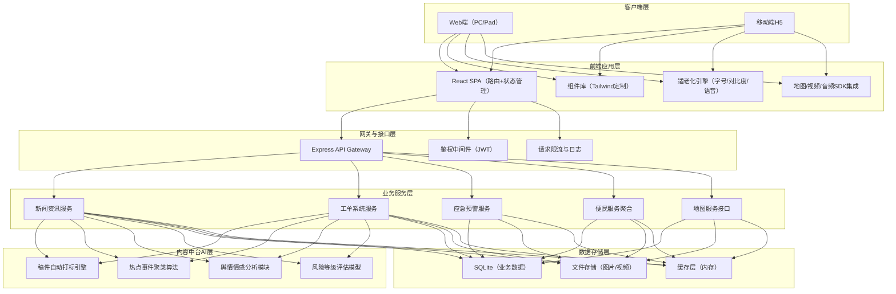
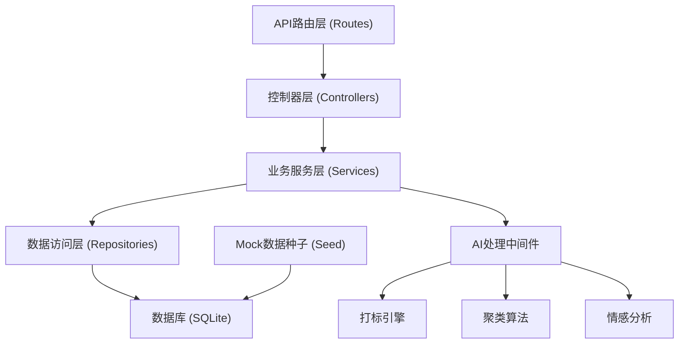
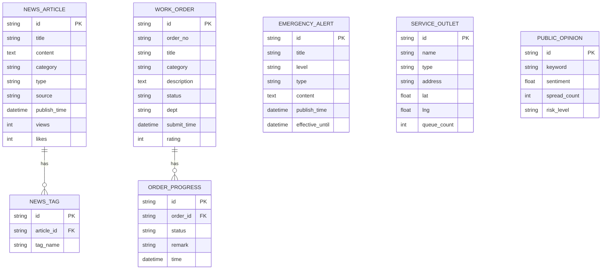

## 1. 架构设计



## 2. 技术说明

- **前端框架**：React 18 + TypeScript + Vite
- **UI框架**：TailwindCSS 3 + lucide-react 图标
- **状态管理**：Zustand
- **路由管理**：React Router DOM
- **后端服务**：Express 4 + TypeScript（ESM）
- **数据库**：SQLite（轻量级演示）
- **多媒体处理**：HTML5 Video/Audio API、浏览器语音识别（Web Speech API）
- **地图可视化**：Leaflet.js（开源地图库，无需密钥）

## 3. 路由定义

| 路由路径 | 页面用途 |
|----------|----------|
| `/` | 首页（综合入口） |
| `/news` | 新闻列表页 |
| `/news/:id` | 新闻详情页（图文/视频/直播） |
| `/workorder` | 12345工单列表 |
| `/workorder/submit` | 工单提交页 |
| `/workorder/:id` | 工单进度详情 |
| `/emergency` | 应急广播预警中心 |
| `/map` | 公共服务地图 |
| `/services` | 便民服务大厅 |
| `/services/:category` | 便民服务分类页 |
| `/admin/content` | 内容中台-稿件管理 |
| `/admin/analytics` | 内容中台-舆情分析 |
| `/elderly/settings` | 适老化设置页 |
| `/elderly/sos` | 紧急呼救配置页 |

## 4. API 接口定义

### 4.1 TypeScript 核心类型

```typescript
// 新闻稿件
interface NewsArticle {
  id: string;
  title: string;
  summary: string;
  content: string;
  coverImage?: string;
  category: 'policy' | 'livelihood' | 'culture' | 'general';
  type: 'article' | 'video' | 'live';
  videoUrl?: string;
  tags: string[];
  source: string;
  publishTime: string;
  views: number;
  likes: number;
}

// 工单
interface WorkOrder {
  id: string;
  orderNo: string;
  title: string;
  category: string;
  description: string;
  images?: string[];
  status: 'pending' | 'assigned' | 'processing' | 'completed';
  responsibleDept: string;
  submitTime: string;
  deadline: string;
  progress: WorkOrderProgress[];
  rating?: number;
}

interface WorkOrderProgress {
  time: string;
  status: string;
  operator: string;
  remark: string;
}

// 应急预警
interface EmergencyAlert {
  id: string;
  title: string;
  level: 'blue' | 'yellow' | 'orange' | 'red';
  type: 'typhoon' | 'rainstorm' | 'high_temp' | 'earthquake' | 'other';
  content: string;
  publishTime: string;
  effectiveTime: string;
  scope: string;
}

// 服务网点
interface ServiceOutlet {
  id: string;
  name: string;
  type: 'water' | 'electricity' | 'gas' | 'health';
  address: string;
  lat: number;
  lng: number;
  phone: string;
  openHours: string;
  queueCount: number;
  queueWaitTime: number;
}

// 舆情数据
interface PublicOpinion {
  id: string;
  keyword: string;
  sentimentScore: number; // -1 ~ 1
  spreadCount: number;
  riskLevel: 'low' | 'medium' | 'high' | 'critical';
  relatedArticles: string[];
  trend: { time: string; count: number }[];
}
```

### 4.2 接口列表

| 方法 | 路径 | 说明 |
|------|------|------|
| GET | `/api/news` | 获取新闻列表（支持分类/分页/搜索） |
| GET | `/api/news/:id` | 获取新闻详情 |
| POST | `/api/news/:id/like` | 点赞新闻 |
| GET | `/api/workorder` | 获取用户工单列表 |
| POST | `/api/workorder` | 提交新工单 |
| GET | `/api/workorder/:id` | 获取工单详情与进度 |
| POST | `/api/workorder/:id/rate` | 工单满意度评价 |
| GET | `/api/alerts` | 获取应急预警列表 |
| GET | `/api/alerts/active` | 获取当前生效预警 |
| GET | `/api/outlets` | 获取服务网点列表 |
| GET | `/api/outlets/:id/queue` | 获取网点实时排队数据 |
| GET | `/api/services` | 获取便民服务分类列表 |
| POST | `/api/sos/call` | 触发紧急呼救 |
| GET | `/api/admin/content/articles` | 内容中台-稿件列表 |
| POST | `/api/admin/content/tag` | 触发稿件自动打标 |
| GET | `/api/admin/analytics/clusters` | 获取热点事件聚类 |
| GET | `/api/admin/analytics/opinion` | 获取舆情分析数据 |

## 5. 服务端架构图



## 6. 数据模型

### 6.1 ER 图



### 6.2 初始化 DDL（SQLite 方言）

```sql
CREATE TABLE IF NOT EXISTS news_article (
  id TEXT PRIMARY KEY,
  title TEXT NOT NULL,
  summary TEXT,
  content TEXT NOT NULL,
  cover_image TEXT,
  category TEXT NOT NULL DEFAULT 'general',
  type TEXT NOT NULL DEFAULT 'article',
  video_url TEXT,
  source TEXT,
  publish_time TEXT NOT NULL,
  views INTEGER DEFAULT 0,
  likes INTEGER DEFAULT 0
);

CREATE TABLE IF NOT EXISTS news_tag (
  id TEXT PRIMARY KEY,
  article_id TEXT NOT NULL,
  tag_name TEXT NOT NULL,
  FOREIGN KEY (article_id) REFERENCES news_article(id)
);

CREATE TABLE IF NOT EXISTS work_order (
  id TEXT PRIMARY KEY,
  order_no TEXT UNIQUE NOT NULL,
  title TEXT NOT NULL,
  category TEXT NOT NULL,
  description TEXT NOT NULL,
  status TEXT NOT NULL DEFAULT 'pending',
  responsible_dept TEXT,
  submit_time TEXT NOT NULL,
  deadline TEXT,
  rating INTEGER
);

CREATE TABLE IF NOT EXISTS order_progress (
  id TEXT PRIMARY KEY,
  order_id TEXT NOT NULL,
  status TEXT NOT NULL,
  operator TEXT,
  remark TEXT,
  time TEXT NOT NULL,
  FOREIGN KEY (order_id) REFERENCES work_order(id)
);

CREATE TABLE IF NOT EXISTS emergency_alert (
  id TEXT PRIMARY KEY,
  title TEXT NOT NULL,
  level TEXT NOT NULL,
  type TEXT NOT NULL,
  content TEXT NOT NULL,
  publish_time TEXT NOT NULL,
  effective_time TEXT,
  scope TEXT
);

CREATE TABLE IF NOT EXISTS service_outlet (
  id TEXT PRIMARY KEY,
  name TEXT NOT NULL,
  type TEXT NOT NULL,
  address TEXT NOT NULL,
  lat REAL NOT NULL,
  lng REAL NOT NULL,
  phone TEXT,
  open_hours TEXT,
  queue_count INTEGER DEFAULT 0,
  queue_wait_time INTEGER DEFAULT 0
);

CREATE TABLE IF NOT EXISTS public_opinion (
  id TEXT PRIMARY KEY,
  keyword TEXT NOT NULL,
  sentiment_score REAL NOT NULL,
  spread_count INTEGER NOT NULL,
  risk_level TEXT NOT NULL
);
```
