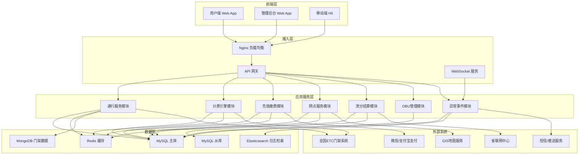
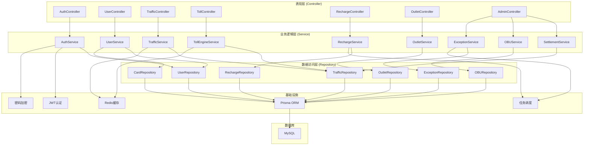
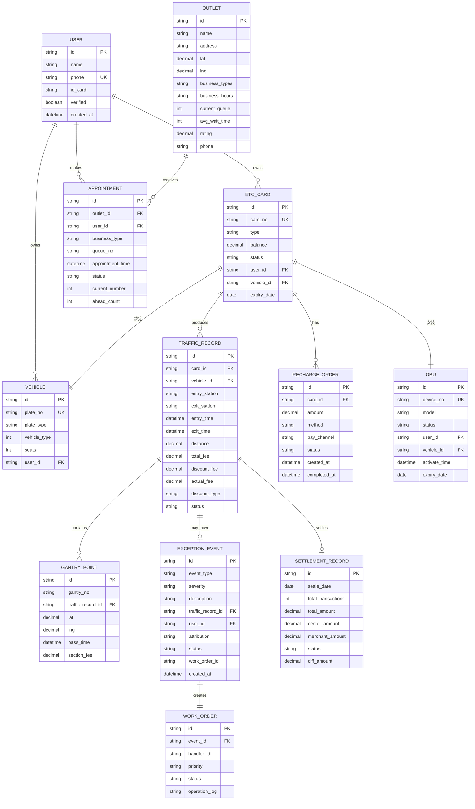

## 1. 架构设计



## 2. 技术栈说明

### 2.1 前端技术
- **框架**: React@18.2 + TypeScript@5
- **构建工具**: Vite@5
- **路由**: react-router-dom@6
- **状态管理**: zustand@4
- **UI框架**: TailwindCSS@3.4 + shadcn/ui
- **图表库**: recharts@2
- **地图**: Leaflet (开源GIS) + 模拟地图数据
- **图标**: lucide-react@0.3
- **HTTP客户端**: axios@1.6
- **动画**: framer-motion@11

### 2.2 后端技术
- **框架**: Express@4.18 + TypeScript@5
- **运行时**: Node.js@20
- **ORM**: Prisma@5
- **数据库**: MySQL@8.0
- **缓存**: Redis@7 (模拟实现)
- **认证**: JWT + bcrypt
- **API文档**: Swagger/OpenAPI

### 2.3 数据模型与Mock数据
- 数据库使用 SQLite (通过 Prisma 支持) 便于开发演示
- 核心业务数据使用 Mock 数据模拟真实场景
- 门架数据与路径数据使用预设的模拟数据集

## 3. 路由定义

### 3.1 用户端路由

| 路由 | 页面 | 说明 |
|------|------|------|
| / | 首页仪表盘 | 账户概览、快捷入口、通行统计 |
| /traffic | 通行记录 | ETC通行记录列表、路径详情 |
| /traffic/:id | 通行详情 | 单条通行记录的完整路径与费用明细 |
| /toll-calculator | 路费查询 | 起终点选择、路径计算、费用对比 |
| /recharge | 充值中心 | 充值方式选择、金额输入、支付流程 |
| /recharge/auto-pay | 代扣管理 | 微信/支付宝绑定、自动充值设置 |
| /outlets | 网点服务 | GIS地图、网点列表、筛选查询 |
| /outlets/:id | 网点详情 | 网点信息、排队情况、预约取号 |
| /profile | 个人中心 | 账户信息、车辆管理、安全设置 |
| /login | 登录页 | 粤通卡登录、实名认证 |

### 3.2 管理后台路由

| 路由 | 页面 | 说明 |
|------|------|------|
| /admin | 管理首页 | 数据概览、实时监控 |
| /admin/settlement | 清分结算 | 对账管理、结算报表 |
| /admin/obu | OBU管理 | 设备生命周期管理 |
| /admin/exception | 异常事件 | 工单列表、归因分析、处理进度 |
| /admin/users | 用户管理 | 用户列表、权限管理 |
| /admin/reports | 数据报表 | 多维度统计分析 |

### 3.3 API路由

| 路由 | 方法 | 说明 |
|------|------|------|
| /api/auth/login | POST | 用户登录 |
| /api/user/profile | GET | 获取用户信息 |
| /api/card/balance | GET | 获取粤通卡余额 |
| /api/traffic/records | GET | 获取通行记录列表 |
| /api/traffic/records/:id | GET | 获取通行记录详情 |
| /api/toll/calculate | POST | 计算路费 |
| /api/toll/routes | GET | 获取可选路径列表 |
| /api/recharge/methods | GET | 获取充值方式列表 |
| /api/recharge/create | POST | 创建充值订单 |
| /api/outlets | GET | 获取网点列表 |
| /api/outlets/:id/queue | GET | 获取网点排队情况 |
| /api/outlets/appointment | POST | 提交预约 |
| /api/admin/settlement | GET | 获取清分数据 |
| /api/admin/obu | GET | 获取OBU设备列表 |
| /api/admin/exceptions | GET | 获取异常事件列表 |
| /api/admin/workorder | POST | 创建/更新工单 |

## 4. API 类型定义

```typescript
// 用户与账户
interface User {
  id: string;
  name: string;
  phone: string;
  idCard: string;
  verified: boolean;
  createdAt: Date;
}

interface EtcCard {
  id: string;
  cardNo: string;
  type: '记账卡' | '储值卡';
  balance: number;
  status: '正常' | '挂失' | '冻结' | '过期';
  userId: string;
  vehicleId: string;
  expiryDate: Date;
}

interface Vehicle {
  id: string;
  plateNo: string;
  plateType: string;
  vehicleType: number; // 1-客车, 2-货车
  seats: number;
  userId: string;
}

// 通行记录
interface TrafficRecord {
  id: string;
  cardId: string;
  vehicleId: string;
  entryStation: string;
  exitStation: string;
  entryTime: Date;
  exitTime: Date;
  distance: number; // 公里
  gantryPoints: GantryPoint[];
  totalFee: number;
  discountFee: number;
  actualFee: number;
  discountType: '95折' | '85折' | '无折扣';
  status: '已完成' | '待扣费' | '异常';
}

interface GantryPoint {
  id: string;
  gantryNo: string;
  location: { lat: number; lng: number };
  passTime: Date;
  sectionFee: number;
}

// 路费计算
interface TollCalculateRequest {
  startStationId: string;
  endStationId: string;
  vehicleType: number;
  travelDate: Date;
}

interface RouteOption {
  id: string;
  name: string;
  distance: number;
  estimatedTime: number; // 分钟
  totalFee: number;
  discountFee: number;
  actualFee: number;
  isShortest: boolean;
  tollGates: number;
  description: string;
}

interface TollCalculateResponse {
  routes: RouteOption[];
  holidayInfo: {
    isFree: boolean;
    holidayName: string;
    freePeriod: string;
  } | null;
}

// 充值
interface RechargeMethod {
  id: string;
  name: string;
  type: 'nfc' | 'bluetooth' | 'online';
  description: string;
  icon: string;
  available: boolean;
}

interface RechargeOrder {
  id: string;
  cardId: string;
  amount: number;
  method: string;
  payChannel: 'wechat' | 'alipay' | 'bank';
  status: '待支付' | '支付中' | '已完成' | '已失败';
  createdAt: Date;
  completedAt: Date | null;
}

// 网点
interface Outlet {
  id: string;
  name: string;
  address: string;
  location: { lat: number; lng: number };
  businessTypes: ('新办' | '充值' | '故障处理' | '激活')[];
  businessHours: {
    weekday: string;
    weekend: string;
  };
  currentQueue: number;
  avgWaitTime: number; // 分钟
  rating: number;
  phone: string;
  distance?: number;
}

interface Appointment {
  id: string;
  outletId: string;
  userId: string;
  businessType: string;
  queueNo: string;
  appointmentTime: Date;
  status: '等待中' | '叫号中' | '已完成' | '已取消';
  currentNumber: number;
  aheadCount: number;
}

// 清分结算
interface SettlementRecord {
  id: string;
  settleDate: Date;
  totalTransactions: number;
  totalAmount: number;
  centerAmount: number;
  merchantAmount: number;
  status: '待对账' | '对账中' | '已完成' | '有差异';
  diffAmount: number;
}

// OBU设备
interface OBU {
  id: string;
  deviceNo: string;
  model: string;
  status: '库存' | '已激活' | '挂失' | '故障' | '已报废';
  userId: string | null;
  vehicleId: string | null;
  activateTime: Date | null;
  expiryDate: Date;
  lastCheckTime: Date | null;
}

// 异常事件
interface ExceptionEvent {
  id: string;
  eventType: '跟车干扰' | '标签失效' | '交易失败' | '路径异常' | '其他';
  severity: '低' | '中' | '高';
  description: string;
  trafficRecordId: string | null;
  userId: string | null;
  attribution: string;
  status: '待处理' | '处理中' | '已解决' | '已关闭';
  workOrderId: string | null;
  createdAt: Date;
  resolvedAt: Date | null;
}

interface WorkOrder {
  id: string;
  eventId: string;
  handlerId: string;
  priority: '紧急' | '高' | '中' | '低';
  status: '待分配' | '处理中' | '待复核' | '已完成';
  operationLog: {
    time: Date;
    operator: string;
    action: string;
  }[];
}
```

## 5. 后端服务架构



## 6. 数据模型

### 6.1 ER图



### 6.2 核心算法：差异化计费引擎

```typescript
/**
 * 差异化计费引擎
 * 支持95折/85折优惠、节假日免费政策、车型系数
 */
class TollEngine {
  // 基础费率表 (元/车·公里)
  private baseRates: Record<number, number> = {
    1: 0.45,  // 一类客车
    2: 0.675, // 二类客车
    3: 0.90,  // 三类客车
    4: 1.125, // 四类客车
  };

  // 折扣规则
  private discountRules = {
    '95折': 0.95, // 储值卡用户
    '85折': 0.85, // 货车通行优惠
    '无折扣': 1.0,
  };

  // 节假日配置 (简化版)
  private holidays: { name: string; start: Date; end: Date }[] = [
    { name: '春节', start: new Date('2026-02-16'), end: new Date('2026-02-23') },
    { name: '清明节', start: new Date('2026-04-04'), end: new Date('2026-04-07') },
    { name: '劳动节', start: new Date('2026-05-01'), end: new Date('2026-05-06') },
    { name: '国庆节', start: new Date('2026-10-01'), end: new Date('2026-10-08') },
  ];

  calculateToll(
    distance: number,
    vehicleType: number,
    cardType: '记账卡' | '储值卡',
    travelDate: Date
  ): TollResult {
    const result: TollResult = {
      baseFee: 0,
      discount: 1.0,
      discountFee: 0,
      actualFee: 0,
      isHolidayFree: false,
      holidayName: null,
    };

    // 检查节假日免费
    const holiday = this.checkHolidayFree(travelDate);
    if (holiday) {
      result.isHolidayFree = true;
      result.holidayName = holiday.name;
      result.baseFee = distance * this.baseRates[vehicleType] || 0;
      return result;
    }

    // 计算基础费用
    const baseRate = this.baseRates[vehicleType] || this.baseRates[1];
    result.baseFee = Math.round(distance * baseRate * 100) / 100;

    // 计算折扣
    let discount = 1.0;
    if (cardType === '储值卡') {
      discount = this.discountRules['95折'];
      result.discountType = '95折';
    }
    if (vehicleType >= 5) { // 货车优惠
      discount = this.discountRules['85折'];
      result.discountType = '85折';
    }
    result.discount = discount;
    result.discountFee = Math.round(result.baseFee * (1 - discount) * 100) / 100;
    result.actualFee = Math.round(result.baseFee * discount * 100) / 100;

    return result;
  }

  private checkHolidayFree(date: Date): { name: string } | null {
    for (const holiday of this.holidays) {
      if (date >= holiday.start && date <= holiday.end) {
        return { name: holiday.name };
      }
    }
    return null;
  }
}
```

### 6.3 核心算法：路径拟合

```typescript
/**
 * 门架数据路径拟合算法
 * 根据门架通行序列还原完整行驶路径
 */
class PathFitter {
  /**
   * 基于门架序列拟合路径
   * @param gantryPoints 门架通行点列表
   * @returns 拟合后的完整路径
   */
  fitPath(gantryPoints: GantryPoint[]): FittedPath {
    if (gantryPoints.length < 2) {
      return { points: gantryPoints.map(p => ({ lat: p.location.lat, lng: p.location.lng })), distance: 0 };
    }

    const sortedPoints = [...gantryPoints].sort((a, b) => 
      new Date(a.passTime).getTime() - new Date(b.passTime).getTime()
    );

    const points = sortedPoints.map(p => ({
      lat: p.location.lat,
      lng: p.location.lng,
    }));

    let totalDistance = 0;
    for (let i = 1; i < points.length; i++) {
      totalDistance += this.calculateDistance(points[i - 1], points[i]);
    }

    return {
      points,
      distance: Math.round(totalDistance * 100) / 100,
      segments: this.generateSegments(sortedPoints),
    };
  }

  /**
   * 计算两点间距离 (Haversine公式)
   */
  private calculateDistance(p1: { lat: number; lng: number }, p2: { lat: number; lng: number }): number {
    const R = 6371; // 地球半径(公里)
    const dLat = (p2.lat - p1.lat) * Math.PI / 180;
    const dLng = (p2.lng - p1.lng) * Math.PI / 180;
    const a = 
      Math.sin(dLat / 2) * Math.sin(dLat / 2) +
      Math.cos(p1.lat * Math.PI / 180) * Math.cos(p2.lat * Math.PI / 180) *
      Math.sin(dLng / 2) * Math.sin(dLng / 2);
    const c = 2 * Math.atan2(Math.sqrt(a), Math.sqrt(1 - a));
    return R * c;
  }
}
```
