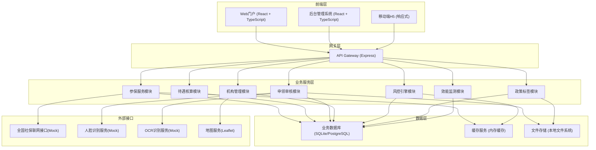
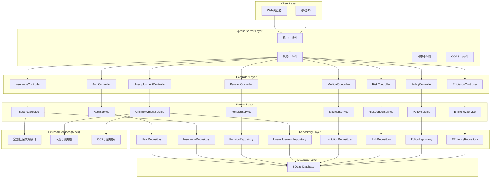

## 1. 架构设计



## 2. 技术描述

### 2.1 技术栈选型

| 层级 | 技术选型 | 版本 | 说明 |
|------|----------|------|------|
| 前端框架 | React | 18.x | 组件化开发，使用Hooks API |
| 前端语言 | TypeScript | 5.x | 类型安全，提升代码质量 |
| 构建工具 | Vite | 5.x | 快速构建，HMR热更新 |
| 样式框架 | Tailwind CSS | 3.x | 原子化CSS，快速开发 |
| 状态管理 | Zustand | 4.x | 轻量级状态管理 |
| 路由管理 | React Router | 6.x | 声明式路由 |
| UI组件库 | Radix UI | 1.x | 无障碍基础组件 |
| 图标库 | Lucide React | 0.x | 线性图标库 |
| 图表库 | Recharts | 2.x | React图表组件 |
| 地图库 | Leaflet | 1.x | 开源地图引擎 |
| 后端框架 | Express | 4.x | Node.js Web框架 |
| 后端语言 | TypeScript | 5.x | 前后端类型一致 |
| 数据库 | SQLite | 3.x | 轻量级关系型数据库（开发环境） |
| ORM | Prisma | 5.x | 类型安全的数据库访问 |
| HTTP客户端 | Axios | 1.x | HTTP请求库 |
| 动画库 | Framer Motion | 11.x | 流畅的交互动画 |

### 2.2 项目初始化方式

- 模板：`react-express-ts` (React + TypeScript + Express)
- 初始化命令：`npm init vite-init@latest -y . -- --template react-express-ts --force`
- 包管理器：npm

---

## 3. 路由定义

### 3.1 前端门户路由

| 路由路径 | 页面名称 | 权限要求 |
|----------|----------|----------|
| `/` | 首页 | 公开 |
| `/insurance/verify` | 个人参保状态核验 | 实名认证 |
| `/pension/calculator` | 养老金计发模拟器 | 公开 |
| `/unemployment/apply` | 失业补贴线上申领 | 实名认证 |
| `/medical/institutions` | 医保定点机构地图检索 | 公开 |
| `/personal` | 个人中心 | 实名认证 |
| `/login` | 登录页 | 公开 |

### 3.2 后台管理路由

| 路由路径 | 页面名称 | 权限要求 |
|----------|----------|----------|
| `/admin` | 管理后台首页 | 经办人员 |
| `/admin/risk-control` | 待遇发放风控引擎 | 省级/市级经办 |
| `/admin/risk-control/rules` | 风控规则配置 | 省级经办 |
| `/admin/policy-tags` | 政策文件智能标签 | 省级/市级经办 |
| `/admin/policy-tags/manage` | 标签体系管理 | 省级经办 |
| `/admin/efficiency` | 服务效能监测 | 省级/市级经办 |
| `/admin/efficiency/analysis` | 退件原因分析 | 省级/市级经办 |
| `/admin/institutions` | 定点机构管理 | 市级/县级经办 |
| `/admin/users` | 用户管理 | 省级经办 |

### 3.3 API路由

| 路由前缀 | 模块 |
|----------|------|
| `/api/auth` | 认证授权 |
| `/api/insurance` | 参保服务 |
| `/api/pension` | 养老待遇 |
| `/api/unemployment` | 失业补贴 |
| `/api/medical` | 医保机构 |
| `/api/risk-control` | 风控引擎 |
| `/api/policy` | 政策标签 |
| `/api/efficiency` | 效能监测 |
| `/api/admin` | 后台管理 |

---

## 4. API 定义

### 4.1 认证模块

```typescript
// 用户登录
interface LoginRequest {
  idCard: string;
  faceImage?: string;
  password?: string;
}

interface LoginResponse {
  token: string;
  userInfo: {
    id: string;
    name: string;
    idCard: string;
    userType: 'employee' | 'flexible' | 'resident' | 'admin_province' | 'admin_city' | 'admin_county' | 'institution';
    realNameVerified: boolean;
  };
}

// 人脸识别认证
interface FaceVerifyRequest {
  faceImage: string;
  idCard: string;
}

interface FaceVerifyResponse {
  success: boolean;
  confidence: number;
  verifyId: string;
}
```

### 4.2 参保服务模块

```typescript
// 参保状态查询
interface InsuranceStatusRequest {
  idCard: string;
  verifyId: string;
}

interface InsuranceStatusResponse {
  userId: string;
  userName: string;
  idCard: string;
  insuranceType: 'employee' | 'flexible' | 'resident';
  status: 'normal' | 'suspended' | 'terminated' | 'retired';
  pension: {
    insuredMonths: number;
    personalAccount: number;
    lastPaymentDate: string;
  };
  medical: {
    insuredMonths: number;
    personalAccount: number;
    lastPaymentDate: string;
  };
  unemployment: {
    insuredMonths: number;
    lastPaymentDate: string;
  };
  queryTime: string;
  source: 'national_network' | 'local_system';
}

// 缴费记录查询
interface PaymentRecordRequest {
  idCard: string;
  year?: number;
  insuranceType: 'pension' | 'medical' | 'unemployment';
  page: number;
  pageSize: number;
}

interface PaymentRecord {
  id: string;
  paymentDate: string;
  paymentBase: number;
  personalPayment: number;
  unitPayment: number;
  paymentMonth: string;
  status: 'normal' | 'supplementary' | 'refund';
}
```

### 4.3 养老金计发模块

```typescript
// 养老金测算
interface PensionCalculateRequest {
  gender: 'male' | 'female';
  birthDate: string;
  retirementDate: string;
  paymentYears: number;
  averagePaymentBase: number;
  personalAccount: number;
  localAverageWage: number;
  transitionYears?: number;
}

interface PensionCalculateResponse {
  basicPension: number;
  personalAccountPension: number;
  transitionPension: number;
  totalMonthlyPension: number;
  annualPension: number;
  calculationBasis: {
    averagePaymentIndex: number;
    paymentYears: number;
    localAverageWage: number;
    personalAccountAmount: number;
   计发月数: number;
  };
  suggestions: string[];
}
```

### 4.4 失业补贴申领模块

```typescript
// 银行卡OCR识别
interface BankCardOCRRequest {
  cardImage: string;
}

interface BankCardOCRResponse {
  cardNumber: string;
  bankName: string;
  cardType: string;
  holderName: string;
  confidence: number;
}

// 失业补贴申请
interface UnemploymentApplyRequest {
  idCard: string;
  faceVerifyId: string;
  bankCard: BankCardOCRResponse;
  unemploymentReason: string;
  unemploymentDate: string;
  materials: {
    type: string;
    name: string;
    provided: boolean;
  }[];
  commitment: {
    signed: boolean;
    signDate: string;
    content: string;
  };
  deficiencyMaterials: string[];
}

interface UnemploymentApplyResponse {
  applyId: string;
  status: 'pending' | 'approved' | 'rejected' | 'deficiency';
  subsidyAmount: number;
  subsidyMonths: number;
  expectedPaymentDate: string;
  deficiencyNotice?: string;
  supplementDeadline?: string;
}
```

### 4.5 医保机构模块

```typescript
// 定点机构查询
interface InstitutionQueryRequest {
  keyword?: string;
  level?: 'tertiary' | 'secondary' | 'primary' | 'clinic' | 'pharmacy';
  department?: string;
  medicine?: string;
  longitude?: number;
  latitude?: number;
  radius?: number;
  page: number;
  pageSize: number;
}

interface Institution {
  id: string;
  name: string;
  level: string;
  address: string;
  longitude: number;
  latitude: number;
  phone: string;
  departments: string[];
  medicines: string[];
  rating: number;
  workHours: string;
  distance?: number;
  isMedicalInsurance: boolean;
  type: 'hospital' | 'clinic' | 'pharmacy';
}
```

### 4.6 风控引擎模块

```typescript
// 风控规则
interface RiskControlRule {
  id: string;
  name: string;
  description: string;
  type: 'duplicate_receipt' | 'death_stop' | 'abnormal_payment' | 'suspicious_behavior';
  severity: 'low' | 'medium' | 'high' | 'critical';
  condition: string;
  action: 'warning' | 'intercept' | 'manual_review';
  enabled: boolean;
}

// 风控预警
interface RiskWarning {
  id: string;
  ruleId: string;
  ruleName: string;
  userId: string;
  userName: string;
  severity: string;
  description: string;
  amount?: number;
  status: 'pending' | 'processed' | 'ignored';
  createTime: string;
  handler?: string;
  handleTime?: string;
  handleResult?: string;
}

// 待遇发放校验
interface BenefitPaymentCheckRequest {
  userId: string;
  benefitType: 'pension' | 'unemployment' | 'medical';
  amount: number;
  paymentDate: string;
}

interface BenefitPaymentCheckResponse {
  passed: boolean;
  warnings: RiskWarning[];
  interceptReason?: string;
  suggestedAction: 'proceed' | 'intercept' | 'review';
}
```

### 4.7 政策标签模块

```typescript
// 政策标签
interface PolicyTag {
  id: string;
  name: string;
  category: '人群' | '业务' | '待遇' | '地区';
  parentId?: string;
  description: string;
}

// 政策文件
interface PolicyDocument {
  id: string;
  title: string;
  documentNumber: string;
  issueDate: string;
  issuingDepartment: string;
  content: string;
  tags: string[];
  applicableGroups: string[];
  effectiveDate: string;
  expiryDate?: string;
  status: 'effective' | 'invalid' | 'draft';
}

// 智能标签推荐
interface TagRecommendationRequest {
  content: string;
  title: string;
}

interface TagRecommendationResponse {
  tags: {
    tagId: string;
    tagName: string;
    confidence: number;
  }[];
  applicableGroups: string[];
}
```

### 4.8 效能监测模块

```typescript
// 服务效能统计
interface EfficiencyStatsRequest {
  startDate: string;
  endDate: string;
  dimension: 'channel' | 'business' | 'region' | 'time';
}

interface EfficiencyStats {
  totalApplications: number;
  avgProcessingTime: number;
  completionRate: number;
  rejectionRate: number;
  satisfactionRate: number;
  channelDistribution: {
    channel: string;
    count: number;
    avgTime: number;
  }[];
  businessDistribution: {
    business: string;
    count: number;
    avgTime: number;
  }[];
  trend: {
    date: string;
    applications: number;
    avgTime: number;
  }[];
}

// 退件原因分析
interface RejectionAnalysis {
  totalRejections: number;
  reasons: {
    reason: string;
    count: number;
    percentage: number;
  }[];
  suggestions: string[];
  relatedBusinesses: {
    business: string;
    rejectionCount: number;
  }[];
}
```

---

## 5. 服务器架构图



---

## 6. 数据模型

### 6.1 数据模型ER图

```mermaid
erDiagram
    USER ||--o{ INSURANCE_RECORD : has
    USER ||--o{ PAYMENT_RECORD : makes
    USER ||--o{ BENEFIT_APPLICATION : submits
    USER ||--o{ RISK_WARNING : triggers
    USER {
        string id PK
        string name
        string idCard UK
        string userType
        string gender
        date birthDate
        string phone
        string address
        boolean realNameVerified
        string faceImageUrl
        datetime createdAt
    }
    
    INSURANCE_RECORD {
        string id PK
        string userId FK
        string insuranceType
        string status
        integer insuredMonths
        decimal personalAccount
        date lastPaymentDate
        datetime createdAt
    }
    
    PAYMENT_RECORD {
        string id PK
        string userId FK
        string insuranceType
        string paymentMonth
        decimal paymentBase
        decimal personalPayment
        decimal unitPayment
        date paymentDate
        string status
    }
    
    BENEFIT_APPLICATION {
        string id PK
        string userId FK
        string applicationType
        string status
        decimal amount
        integer months
        string bankCardNumber
        string bankName
        string faceVerifyId
        text deficiencyMaterials
        boolean commitmentSigned
        date commitmentDate
        datetime createdAt
        datetime processedAt
        string processorId
    }
    
    MEDICAL_INSTITUTION ||--o{ INSTITUTION_DEPARTMENT : has
    MEDICAL_INSTITUTION ||--o{ INSTITUTION_MEDICINE : provides
    MEDICAL_INSTITUTION {
        string id PK
        string name
        string level
        string type
        string address
        decimal longitude
        decimal latitude
        string phone
        string workHours
        decimal rating
        boolean isMedicalInsurance
    }
    
    INSTITUTION_DEPARTMENT {
        string id PK
        string institutionId FK
        string name
        string description
    }
    
    INSTITUTION_MEDICINE {
        string id PK
        string institutionId FK
        string medicineName
        string specification
        boolean inCatalog
    }
    
    RISK_CONTROL_RULE {
        string id PK
        string name
        string type
        string severity
        text conditionExpr
        string action
        boolean enabled
        datetime createdAt
    }
    
    RISK_WARNING {
        string id PK
        string ruleId FK
        string userId FK
        string severity
        string description
        decimal amount
        string status
        datetime createdAt
        string handlerId
        datetime handledAt
        text handleResult
    }
    
    POLICY_DOCUMENT ||--o{ POLICY_TAG_REL : has
    POLICY_TAG ||--o{ POLICY_TAG_REL : belongs_to
    POLICY_DOCUMENT {
        string id PK
        string title
        string documentNumber
        date issueDate
        string issuingDepartment
        text content
        date effectiveDate
        date expiryDate
        string status
    }
    
    POLICY_TAG {
        string id PK
        string name
        string category
        string parentId FK
        string description
    }
    
    POLICY_TAG_REL {
        string id PK
        string policyId FK
        string tagId FK
    }
    
    SERVICE_LOG {
        string id PK
        string userId FK
        string channel
        string businessType
        string applicationId FK
        integer processingTime
        string status
        string rejectionReason
        integer satisfaction
        datetime createdAt
    }
```



### 6.2 DDL 语句

```sql
-- 用户表
CREATE TABLE user (
  id VARCHAR(36) PRIMARY KEY,
  name VARCHAR(50) NOT NULL,
  id_card VARCHAR(18) UNIQUE NOT NULL,
  user_type VARCHAR(20) NOT NULL,
  gender VARCHAR(10),
  birth_date DATE,
  phone VARCHAR(20),
  address TEXT,
  real_name_verified BOOLEAN DEFAULT FALSE,
  face_image_url VARCHAR(255),
  created_at DATETIME DEFAULT CURRENT_TIMESTAMP
);

-- 参保记录表
CREATE TABLE insurance_record (
  id VARCHAR(36) PRIMARY KEY,
  user_id VARCHAR(36) NOT NULL,
  insurance_type VARCHAR(20) NOT NULL,
  status VARCHAR(20) NOT NULL,
  insured_months INTEGER DEFAULT 0,
  personal_account DECIMAL(12,2) DEFAULT 0,
  last_payment_date DATE,
  created_at DATETIME DEFAULT CURRENT_TIMESTAMP,
  FOREIGN KEY (user_id) REFERENCES user(id)
);

-- 缴费记录表
CREATE TABLE payment_record (
  id VARCHAR(36) PRIMARY KEY,
  user_id VARCHAR(36) NOT NULL,
  insurance_type VARCHAR(20) NOT NULL,
  payment_month VARCHAR(6) NOT NULL,
  payment_base DECIMAL(12,2) NOT NULL,
  personal_payment DECIMAL(12,2) DEFAULT 0,
  unit_payment DECIMAL(12,2) DEFAULT 0,
  payment_date DATE,
  status VARCHAR(20) DEFAULT 'normal',
  FOREIGN KEY (user_id) REFERENCES user(id)
);

-- 待遇申请表
CREATE TABLE benefit_application (
  id VARCHAR(36) PRIMARY KEY,
  user_id VARCHAR(36) NOT NULL,
  application_type VARCHAR(20) NOT NULL,
  status VARCHAR(20) NOT NULL,
  amount DECIMAL(12,2) NOT NULL,
  months INTEGER,
  bank_card_number VARCHAR(30),
  bank_name VARCHAR(100),
  face_verify_id VARCHAR(50),
  deficiency_materials TEXT,
  commitment_signed BOOLEAN DEFAULT FALSE,
  commitment_date DATE,
  created_at DATETIME DEFAULT CURRENT_TIMESTAMP,
  processed_at DATETIME,
  processor_id VARCHAR(36),
  FOREIGN KEY (user_id) REFERENCES user(id)
);

-- 医保机构表
CREATE TABLE medical_institution (
  id VARCHAR(36) PRIMARY KEY,
  name VARCHAR(200) NOT NULL,
  level VARCHAR(20),
  type VARCHAR(20) NOT NULL,
  address TEXT,
  longitude DECIMAL(10,6),
  latitude DECIMAL(10,6),
  phone VARCHAR(20),
  work_hours VARCHAR(100),
  rating DECIMAL(2,1) DEFAULT 3.0,
  is_medical_insurance BOOLEAN DEFAULT TRUE
);

-- 机构科室表
CREATE TABLE institution_department (
  id VARCHAR(36) PRIMARY KEY,
  institution_id VARCHAR(36) NOT NULL,
  name VARCHAR(50) NOT NULL,
  description TEXT,
  FOREIGN KEY (institution_id) REFERENCES medical_institution(id)
);

-- 机构药品表
CREATE TABLE institution_medicine (
  id VARCHAR(36) PRIMARY KEY,
  institution_id VARCHAR(36) NOT NULL,
  medicine_name VARCHAR(100) NOT NULL,
  specification VARCHAR(100),
  in_catalog BOOLEAN DEFAULT TRUE,
  FOREIGN KEY (institution_id) REFERENCES medical_institution(id)
);

-- 风控规则表
CREATE TABLE risk_control_rule (
  id VARCHAR(36) PRIMARY KEY,
  name VARCHAR(100) NOT NULL,
  type VARCHAR(30) NOT NULL,
  severity VARCHAR(20) NOT NULL,
  condition_expr TEXT,
  action VARCHAR(20) NOT NULL,
  enabled BOOLEAN DEFAULT TRUE,
  created_at DATETIME DEFAULT CURRENT_TIMESTAMP
);

-- 风控预警表
CREATE TABLE risk_warning (
  id VARCHAR(36) PRIMARY KEY,
  rule_id VARCHAR(36) NOT NULL,
  user_id VARCHAR(36) NOT NULL,
  severity VARCHAR(20) NOT NULL,
  description TEXT,
  amount DECIMAL(12,2),
  status VARCHAR(20) DEFAULT 'pending',
  created_at DATETIME DEFAULT CURRENT_TIMESTAMP,
  handler_id VARCHAR(36),
  handled_at DATETIME,
  handle_result TEXT,
  FOREIGN KEY (rule_id) REFERENCES risk_control_rule(id),
  FOREIGN KEY (user_id) REFERENCES user(id)
);

-- 政策文件表
CREATE TABLE policy_document (
  id VARCHAR(36) PRIMARY KEY,
  title VARCHAR(500) NOT NULL,
  document_number VARCHAR(100),
  issue_date DATE,
  issuing_department VARCHAR(200),
  content TEXT,
  effective_date DATE,
  expiry_date DATE,
  status VARCHAR(20) DEFAULT 'draft'
);

-- 政策标签表
CREATE TABLE policy_tag (
  id VARCHAR(36) PRIMARY KEY,
  name VARCHAR(50) NOT NULL,
  category VARCHAR(20) NOT NULL,
  parent_id VARCHAR(36),
  description TEXT,
  FOREIGN KEY (parent_id) REFERENCES policy_tag(id)
);

-- 政策标签关联表
CREATE TABLE policy_tag_rel (
  id VARCHAR(36) PRIMARY KEY,
  policy_id VARCHAR(36) NOT NULL,
  tag_id VARCHAR(36) NOT NULL,
  FOREIGN KEY (policy_id) REFERENCES policy_document(id),
  FOREIGN KEY (tag_id) REFERENCES policy_tag(id)
);

-- 服务日志表
CREATE TABLE service_log (
  id VARCHAR(36) PRIMARY KEY,
  user_id VARCHAR(36),
  channel VARCHAR(20) NOT NULL,
  business_type VARCHAR(50) NOT NULL,
  application_id VARCHAR(36),
  processing_time INTEGER,
  status VARCHAR(20) NOT NULL,
  rejection_reason TEXT,
  satisfaction INTEGER,
  created_at DATETIME DEFAULT CURRENT_TIMESTAMP,
  FOREIGN KEY (user_id) REFERENCES user(id)
);

-- 索引
CREATE INDEX idx_insurance_user ON insurance_record(user_id);
CREATE INDEX idx_payment_user ON payment_record(user_id, insurance_type);
CREATE INDEX idx_application_user ON benefit_application(user_id, status);
CREATE INDEX idx_warning_user ON risk_warning(user_id, status);
CREATE INDEX idx_institution_location ON medical_institution(longitude, latitude);
CREATE INDEX idx_service_log_business ON service_log(business_type, created_at);
```

### 6.3 初始化Mock数据

```sql
-- 插入测试用户
INSERT INTO user (id, name, id_card, user_type, gender, birth_date, phone, real_name_verified) VALUES
('u001', '张三', '110101198001011234', 'employee', 'male', '1980-01-01', '13800138001', TRUE),
('u002', '李四', '110101198502022345', 'flexible', 'female', '1985-02-02', '13800138002', TRUE),
('u003', '王五', '110101197003033456', 'resident', 'male', '1970-03-03', '13800138003', TRUE),
('a001', '管理员', '110101199001010001', 'admin_province', 'male', '1990-01-01', '13900139001', TRUE),
('i001', '省立医院', '110101190001010001', 'institution', NULL, NULL, '010-12345678', TRUE);

-- 插入参保记录
INSERT INTO insurance_record (id, user_id, insurance_type, status, insured_months, personal_account, last_payment_date) VALUES
('ir001', 'u001', 'pension', 'normal', 240, 156000.00, '2026-05-01'),
('ir002', 'u001', 'medical', 'normal', 240, 48000.00, '2026-05-01'),
('ir003', 'u001', 'unemployment', 'normal', 180, 0, '2026-05-01'),
('ir004', 'u002', 'pension', 'normal', 120, 72000.00, '2026-05-01');

-- 插入缴费记录
INSERT INTO payment_record (id, user_id, insurance_type, payment_month, payment_base, personal_payment, unit_payment, payment_date) VALUES
('pr001', 'u001', 'pension', '202605', 8000, 640.00, 1600.00, '2026-05-15'),
('pr002', 'u001', 'medical', '202605', 8000, 160.00, 800.00, '2026-05-15'),
('pr003', 'u001', 'unemployment', '202605', 8000, 80.00, 80.00, '2026-05-15');

-- 插入医保机构
INSERT INTO medical_institution (id, name, level, type, address, longitude, latitude, phone, work_hours, rating, is_medical_insurance) VALUES
('mi001', 'XX省人民医院', 'tertiary', 'hospital', 'XX市XX区人民路1号', 116.3975, 39.9087, '010-88888888', '周一至周日 8:00-17:30', 4.8, TRUE),
('mi002', 'XX市第一人民医院', 'tertiary', 'hospital', 'XX市XX区健康路2号', 116.4075, 39.9187, '010-66666666', '周一至周日 8:00-17:30', 4.6, TRUE),
('mi003', 'XX区社区卫生服务中心', 'primary', 'clinic', 'XX市XX区幸福路3号', 116.4175, 39.9287, '010-55555555', '周一至周五 8:00-18:00', 4.2, TRUE),
('mi004', 'XX大药房', 'pharmacy', 'pharmacy', 'XX市XX区和平路4号', 116.3875, 39.8987, '010-44444444', '周一至周日 7:00-22:00', 4.5, TRUE);

-- 插入机构科室
INSERT INTO institution_department (id, institution_id, name, description) VALUES
('dep001', 'mi001', '心血管内科', '国家级重点科室，擅长冠心病、心律失常诊治'),
('dep002', 'mi001', '神经内科', '擅长脑血管疾病、帕金森病诊治'),
('dep003', 'mi001', '骨科', '擅长关节置换、脊柱外科'),
('dep004', 'mi002', '心血管内科', '市级重点科室');

-- 插入机构药品
INSERT INTO institution_medicine (id, institution_id, medicine_name, specification, in_catalog) VALUES
('med001', 'mi001', '阿司匹林肠溶片', '100mg*30片', TRUE),
('med002', 'mi001', '氨氯地平片', '5mg*14片', TRUE),
('med003', 'mi001', '阿托伐他汀钙片', '20mg*7片', TRUE),
('med004', 'mi004', '连花清瘟胶囊', '0.35g*24粒', TRUE);

-- 插入风控规则
INSERT INTO risk_control_rule (id, name, type, severity, condition_expr, action, enabled) VALUES
('rc001', '跨地区重复领取养老金', 'duplicate_receipt', 'critical', 'user.hasPensionInMultipleRegions()', 'intercept', TRUE),
('rc002', '已死亡人员待遇发放', 'death_stop', 'critical', 'user.isDeceased()', 'intercept', TRUE),
('rc003', '缴费基数异常波动', 'abnormal_payment', 'medium', 'paymentBaseChange > 50%', 'warning', TRUE),
('rc004', '同一账号多地登录', 'suspicious_behavior', 'high', 'multipleLoginLocations()', 'manual_review', TRUE);

-- 插入政策标签
INSERT INTO policy_tag (id, name, category, parent_id, description) VALUES
('pt001', '企业职工', '人群', NULL, '适用于企业在职职工'),
('pt002', '灵活就业人员', '人群', NULL, '适用于灵活就业参保人员'),
('pt003', '城乡居民', '人群', NULL, '适用于城乡居民参保人员'),
('pt004', '退休人员', '人群', NULL, '适用于已退休人员'),
('pt005', '养老保险', '业务', NULL, '养老保险相关业务'),
('pt006', '医疗保险', '业务', NULL, '医疗保险相关业务'),
('pt007', '失业保险', '业务', NULL, '失业保险相关业务'),
('pt008', '养老待遇', '待遇', NULL, '养老金发放相关待遇'),
('pt009', '医疗待遇', '待遇', NULL, '医疗报销相关待遇'),
('pt010', '失业待遇', '待遇', NULL, '失业补贴相关待遇');

-- 插入政策文件
INSERT INTO policy_document (id, title, document_number, issue_date, issuing_department, content, effective_date, status) VALUES
('pd001', '关于2026年调整退休人员基本养老金的通知', '人社部发〔2026〕1号', '2026-01-01', '人力资源社会保障部 财政部', '经党中央、国务院批准，从2026年1月1日起调整企业和机关事业单位退休人员基本养老金水平。', '2026-01-01', 'effective'),
('pd002', '关于进一步完善灵活就业人员养老保险政策的通知', '人社部发〔2026〕2号', '2026-02-01', '人力资源社会保障部', '为进一步完善灵活就业人员养老保险政策，现通知如下：...', '2026-03-01', 'effective');

-- 插入政策标签关联
INSERT INTO policy_tag_rel (id, policy_id, tag_id) VALUES
('ptr001', 'pd001', 'pt004'),
('ptr002', 'pd001', 'pt005'),
('ptr003', 'pd001', 'pt008'),
('ptr004', 'pd002', 'pt002'),
('ptr005', 'pd002', 'pt005');

-- 插入服务日志
INSERT INTO service_log (id, user_id, channel, business_type, processing_time, status, satisfaction, created_at) VALUES
('sl001', 'u001', 'web', 'insurance_verify', 5, 'completed', 5, '2026-06-01 09:30:00'),
('sl002', 'u002', 'mobile', 'pension_calculate', 3, 'completed', 4, '2026-06-02 10:15:00'),
('sl003', 'u003', 'web', 'unemployment_apply', 20, 'pending', NULL, '2026-06-03 14:20:00'),
('sl004', 'u001', 'web', 'institution_query', 2, 'completed', 5, '2026-06-04