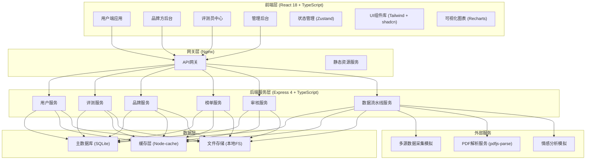
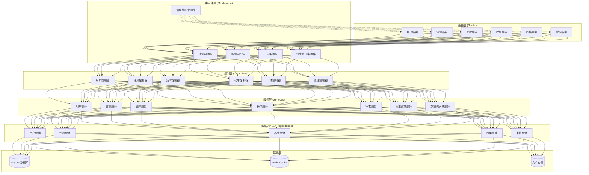
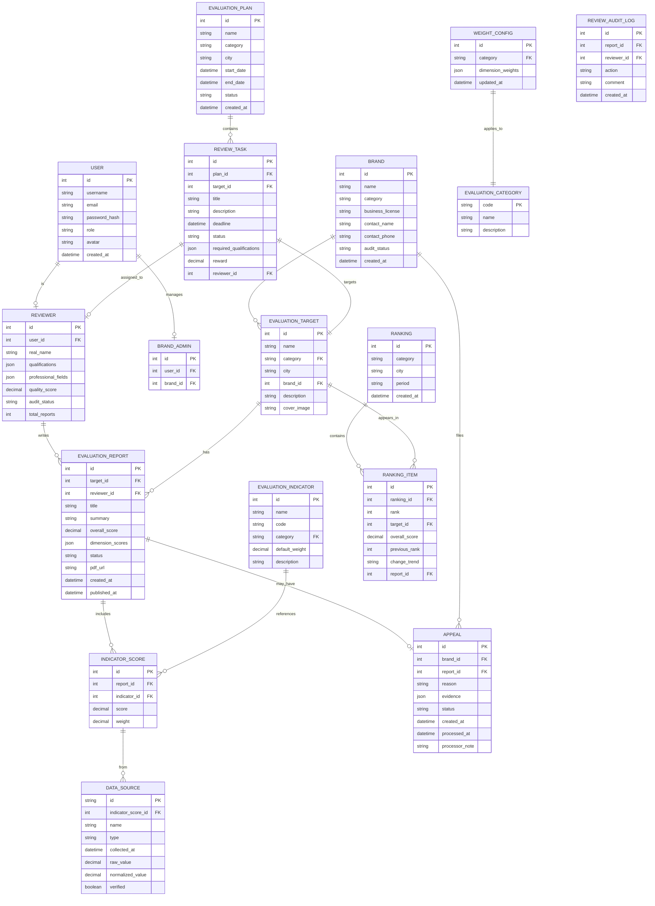

## 1. 架构设计



## 2. 技术说明

### 2.1 技术栈

| 层级 | 技术选型 | 版本 | 说明 |
|------|----------|------|------|
| 前端 | React | 18.2.0 | UI框架 |
| 前端 | TypeScript | 5.3.0 | 类型系统 |
| 前端 | Vite | 5.0.0 | 构建工具 |
| 前端 | Tailwind CSS | 3.4.0 | CSS框架 |
| 前端 | React Router | 6.20.0 | 路由管理 |
| 前端 | Zustand | 4.4.0 | 状态管理 |
| 前端 | Recharts | 2.10.0 | 图表可视化 |
| 前端 | Lucide React | 0.294.0 | 图标库 |
| 后端 | Express | 4.18.2 | Web框架 |
| 后端 | TypeScript | 5.3.0 | 类型系统 |
| 后端 | better-sqlite3 | 9.2.0 | SQLite驱动 |
| 后端 | node-cache | 5.1.2 | 内存缓存 |
| 后端 | pdf-parse | 1.1.1 | PDF解析 |
| 后端 | multer | 1.4.5 | 文件上传 |
| 数据库 | SQLite | 3.41.0 | 关系型数据库 |
| 构建 | ts-node | 10.9.2 | TypeScript运行时 |
| 代码规范 | ESLint | 8.54.0 | 代码检查 |
| 代码规范 | Prettier | 3.1.0 | 代码格式化 |

### 2.2 目录结构

```
may-89232/
├── .trae/documents/           # 项目文档
├── src/                       # 前端源码
│   ├── components/            # 通用组件
│   │   ├── ui/               # shadcn基础组件
│   │   ├── layout/           # 布局组件
│   │   └── charts/           # 图表组件
│   ├── pages/                 # 页面组件
│   │   ├── user/             # 用户端页面
│   │   ├── brand/            # 品牌方页面
│   │   ├── reviewer/         # 评测员页面
│   │   └── admin/            # 管理后台页面
│   ├── hooks/                 # 自定义Hooks
│   ├── store/                 # Zustand状态管理
│   ├── utils/                 # 工具函数
│   ├── types/                 # TypeScript类型定义
│   ├── api/                   # API请求封装
│   ├── App.tsx
│   └── main.tsx
├── api/                       # 后端源码
│   ├── src/
│   │   ├── controllers/      # 控制器
│   │   ├── services/         # 业务逻辑
│   │   ├── repositories/     # 数据访问
│   │   ├── middleware/       # 中间件
│   │   ├── routes/           # 路由定义
│   │   ├── utils/            # 工具函数
│   │   ├── types/            # 类型定义
│   │   ├── pipeline/         # 数据流水线
│   │   └── index.ts          # 入口文件
│   ├── data/
│   │   ├── database.db       # SQLite数据库
│   │   └── migrations/       # 数据库迁移
│   └── uploads/              # 文件上传目录
├── shared/                    # 前后端共享类型
├── migrations/                # 数据库迁移SQL
├── vite.config.ts
├── tailwind.config.js
├── tsconfig.json
└── package.json
```

## 3. 路由定义

### 3.1 前端路由

| 路由路径 | 页面 | 权限 |
|---------|------|------|
| `/` | 首页 | 公开 |
| `/rankings` | 榜单列表 | 公开 |
| `/rankings/:category` | 分类榜单 | 公开 |
| `/report/:id` | 报告详情 | 公开 |
| `/compare` | 竞品对比 | 公开 |
| `/search` | 搜索结果 | 公开 |
| `/login` | 登录页 | 公开 |
| `/register` | 注册页 | 公开 |
| `/brand/register` | 品牌入驻申请 | 公开 |
| `/reviewer/apply` | 评测员申请 | 公开 |
| `/brand/dashboard` | 品牌方后台首页 | 品牌方 |
| `/brand/reputation` | 舆情看板 | 品牌方 |
| `/brand/appeal` | 申诉通道 | 品牌方 |
| `/reviewer/dashboard` | 评测员中心首页 | 评测员 |
| `/reviewer/tasks` | 任务大厅 | 评测员 |
| `/reviewer/reports` | 我的报告 | 评测员 |
| `/reviewer/quality` | 质量评分 | 评测员 |
| `/admin/dashboard` | 管理后台首页 | 管理员 |
| `/admin/plans` | 评测计划排期 | 管理员 |
| `/admin/reviews` | 报告审核流 | 管理员 |
| `/admin/appeals` | 申诉处理 | 管理员 |
| `/admin/weights` | 权重配置 | 管理员 |

### 3.2 API路由

| 方法 | 路径 | 模块 | 说明 |
|------|------|------|------|
| GET | `/api/public/rankings` | 榜单服务 | 获取榜单列表 |
| GET | `/api/public/rankings/:category` | 榜单服务 | 获取分类榜单 |
| GET | `/api/public/report/:id` | 评测服务 | 获取报告详情 |
| GET | `/api/public/report/:id/trace` | 评测服务 | 获取数据溯源信息 |
| POST | `/api/public/compare` | 榜单服务 | 竞品对比 |
| GET | `/api/public/search` | 搜索服务 | 搜索 |
| POST | `/api/auth/login` | 用户服务 | 登录 |
| POST | `/api/auth/register` | 用户服务 | 注册 |
| POST | `/api/brand/register` | 品牌服务 | 品牌入驻申请 |
| GET | `/api/brand/dashboard` | 品牌服务 | 品牌方数据概览 |
| GET | `/api/brand/reputation` | 品牌服务 | 舆情数据 |
| POST | `/api/brand/appeal` | 申诉服务 | 发起申诉 |
| GET | `/api/reviewer/tasks` | 评测服务 | 可接任务列表 |
| POST | `/api/reviewer/tasks/:id/apply` | 评测服务 | 报名任务 |
| POST | `/api/reviewer/report` | 评测服务 | 提交报告 |
| GET | `/api/reviewer/quality` | 评测服务 | 质量评分 |
| GET | `/api/admin/plans` | 评测服务 | 评测计划列表 |
| POST | `/api/admin/plans` | 评测服务 | 创建评测计划 |
| GET | `/api/admin/reviews` | 审核服务 | 待审核报告列表 |
| POST | `/api/admin/reviews/:id/approve` | 审核服务 | 通过审核 |
| POST | `/api/admin/reviews/:id/reject` | 审核服务 | 拒绝审核 |
| GET | `/api/admin/appeals` | 申诉服务 | 申诉列表 |
| POST | `/api/admin/appeals/:id/process` | 申诉服务 | 处理申诉 |
| GET | `/api/admin/weights` | 权重服务 | 获取权重配置 |
| PUT | `/api/admin/weights` | 权重服务 | 更新权重配置 |

## 4. API类型定义

```typescript
// shared/types/index.ts

export interface User {
  id: number;
  username: string;
  email: string;
  role: 'user' | 'reviewer' | 'brand' | 'admin';
  avatar?: string;
  createdAt: string;
}

export interface Reviewer extends User {
  realName: string;
  qualifications: string[];
  professionalFields: string[];
  qualityScore: number;
  auditStatus: 'pending' | 'approved' | 'rejected';
  totalReports: number;
}

export interface Brand {
  id: number;
  name: string;
  category: string;
  businessLicense: string;
  contactName: string;
  contactPhone: string;
  auditStatus: 'pending' | 'approved' | 'rejected';
  createdAt: string;
}

export interface EvaluationTarget {
  id: number;
  name: string;
  category: 'consumer' | 'education' | 'medical' | 'travel';
  city: string;
  brandId?: number;
  description: string;
  coverImage?: string;
}

export interface EvaluationIndicator {
  id: number;
  name: string;
  code: string;
  weight: number;
  category: string;
  description: string;
}

export interface DataSource {
  id: string;
  name: string;
  type: 'ecommerce' | 'government' | 'complaint' | 'review' | 'sampling';
  collectedAt: string;
  rawValue: number;
  normalizedValue: number;
  verified: boolean;
}

export interface EvaluationReport {
  id: number;
  targetId: number;
  reviewerId: number;
  title: string;
  summary: string;
  overallScore: number;
  dimensionScores: {
    dimension: string;
    score: number;
    weight: number;
  }[];
  indicatorScores: {
    indicatorId: number;
    score: number;
    dataSources: DataSource[];
  }[];
  status: 'draft' | 'submitted' | 'reviewing' | 'cross_validating' | 'approved' | 'rejected' | 'published';
  pdfUrl?: string;
  createdAt: string;
  publishedAt?: string;
}

export interface Ranking {
  id: number;
  category: string;
  city: string;
  period: string;
  items: RankingItem[];
  createdAt: string;
}

export interface RankingItem {
  rank: number;
  targetId: number;
  targetName: string;
  overallScore: number;
  previousRank?: number;
  changeTrend: 'up' | 'down' | 'stable';
  reportId: number;
}

export interface ReviewTask {
  id: number;
  planId: number;
  targetId: number;
  title: string;
  description: string;
  deadline: string;
  status: 'open' | 'assigned' | 'completed';
  requiredQualifications: string[];
  reward: number;
}

export interface Appeal {
  id: number;
  brandId: number;
  reportId: number;
  reason: string;
  evidence: string[];
  status: 'pending' | 'processing' | 'upheld' | 'rejected';
  createdAt: string;
  processedAt?: string;
  processorNote?: string;
}

export interface WeightConfig {
  category: string;
  dimensions: {
    name: string;
    weight: number;
    indicators: {
      code: string;
      weight: number;
    }[];
  }[];
}

// API请求响应类型
export interface ApiResponse<T> {
  code: number;
  message: string;
  data: T;
}

export interface PaginationParams {
  page: number;
  pageSize: number;
}

export interface PaginationResult<T> {
  items: T[];
  total: number;
  page: number;
  pageSize: number;
  totalPages: number;
}
```

## 5. 服务端架构图



## 6. 数据模型

### 6.1 ER图



### 6.2 数据库DDL

```sql
-- 用户表
CREATE TABLE IF NOT EXISTS users (
    id INTEGER PRIMARY KEY AUTOINCREMENT,
    username VARCHAR(50) UNIQUE NOT NULL,
    email VARCHAR(100) UNIQUE NOT NULL,
    password_hash VARCHAR(255) NOT NULL,
    role VARCHAR(20) NOT NULL DEFAULT 'user',
    avatar VARCHAR(255),
    created_at DATETIME DEFAULT CURRENT_TIMESTAMP
);

-- 评测员表
CREATE TABLE IF NOT EXISTS reviewers (
    id INTEGER PRIMARY KEY AUTOINCREMENT,
    user_id INTEGER UNIQUE NOT NULL,
    real_name VARCHAR(50) NOT NULL,
    qualifications TEXT,
    professional_fields TEXT,
    quality_score DECIMAL(3, 2) DEFAULT 100.00,
    audit_status VARCHAR(20) DEFAULT 'pending',
    total_reports INTEGER DEFAULT 0,
    FOREIGN KEY (user_id) REFERENCES users(id)
);

-- 品牌表
CREATE TABLE IF NOT EXISTS brands (
    id INTEGER PRIMARY KEY AUTOINCREMENT,
    name VARCHAR(100) NOT NULL,
    category VARCHAR(50) NOT NULL,
    business_license VARCHAR(100),
    contact_name VARCHAR(50),
    contact_phone VARCHAR(20),
    audit_status VARCHAR(20) DEFAULT 'pending',
    created_at DATETIME DEFAULT CURRENT_TIMESTAMP
);

-- 品牌管理员表
CREATE TABLE IF NOT EXISTS brand_admins (
    id INTEGER PRIMARY KEY AUTOINCREMENT,
    user_id INTEGER NOT NULL,
    brand_id INTEGER NOT NULL,
    FOREIGN KEY (user_id) REFERENCES users(id),
    FOREIGN KEY (brand_id) REFERENCES brands(id)
);

-- 评测分类表
CREATE TABLE IF NOT EXISTS evaluation_categories (
    code VARCHAR(50) PRIMARY KEY,
    name VARCHAR(50) NOT NULL,
    description TEXT
);

-- 评测指标表
CREATE TABLE IF NOT EXISTS evaluation_indicators (
    id INTEGER PRIMARY KEY AUTOINCREMENT,
    name VARCHAR(100) NOT NULL,
    code VARCHAR(50) UNIQUE NOT NULL,
    category VARCHAR(50) NOT NULL,
    default_weight DECIMAL(5, 4) NOT NULL,
    description TEXT,
    FOREIGN KEY (category) REFERENCES evaluation_categories(code)
);

-- 评测对象表
CREATE TABLE IF NOT EXISTS evaluation_targets (
    id INTEGER PRIMARY KEY AUTOINCREMENT,
    name VARCHAR(100) NOT NULL,
    category VARCHAR(50) NOT NULL,
    city VARCHAR(50) NOT NULL,
    brand_id INTEGER,
    description TEXT,
    cover_image VARCHAR(255),
    FOREIGN KEY (category) REFERENCES evaluation_categories(code),
    FOREIGN KEY (brand_id) REFERENCES brands(id)
);

-- 评测计划表
CREATE TABLE IF NOT EXISTS evaluation_plans (
    id INTEGER PRIMARY KEY AUTOINCREMENT,
    name VARCHAR(100) NOT NULL,
    category VARCHAR(50) NOT NULL,
    city VARCHAR(50) NOT NULL,
    start_date DATETIME NOT NULL,
    end_date DATETIME NOT NULL,
    status VARCHAR(20) DEFAULT 'draft',
    created_at DATETIME DEFAULT CURRENT_TIMESTAMP
);

-- 评测任务表
CREATE TABLE IF NOT EXISTS review_tasks (
    id INTEGER PRIMARY KEY AUTOINCREMENT,
    plan_id INTEGER NOT NULL,
    target_id INTEGER NOT NULL,
    title VARCHAR(100) NOT NULL,
    description TEXT,
    deadline DATETIME NOT NULL,
    status VARCHAR(20) DEFAULT 'open',
    required_qualifications TEXT,
    reward DECIMAL(10, 2) DEFAULT 0,
    reviewer_id INTEGER,
    FOREIGN KEY (plan_id) REFERENCES evaluation_plans(id),
    FOREIGN KEY (target_id) REFERENCES evaluation_targets(id),
    FOREIGN KEY (reviewer_id) REFERENCES reviewers(id)
);

-- 评测报告表
CREATE TABLE IF NOT EXISTS evaluation_reports (
    id INTEGER PRIMARY KEY AUTOINCREMENT,
    target_id INTEGER NOT NULL,
    reviewer_id INTEGER NOT NULL,
    title VARCHAR(200) NOT NULL,
    summary TEXT,
    overall_score DECIMAL(5, 2),
    dimension_scores TEXT,
    status VARCHAR(30) DEFAULT 'draft',
    pdf_url VARCHAR(255),
    created_at DATETIME DEFAULT CURRENT_TIMESTAMP,
    published_at DATETIME,
    FOREIGN KEY (target_id) REFERENCES evaluation_targets(id),
    FOREIGN KEY (reviewer_id) REFERENCES reviewers(id)
);

-- 指标得分表
CREATE TABLE IF NOT EXISTS indicator_scores (
    id INTEGER PRIMARY KEY AUTOINCREMENT,
    report_id INTEGER NOT NULL,
    indicator_id INTEGER NOT NULL,
    score DECIMAL(5, 2) NOT NULL,
    weight DECIMAL(5, 4) NOT NULL,
    FOREIGN KEY (report_id) REFERENCES evaluation_reports(id),
    FOREIGN KEY (indicator_id) REFERENCES evaluation_indicators(id)
);

-- 数据源表
CREATE TABLE IF NOT EXISTS data_sources (
    id VARCHAR(50) PRIMARY KEY,
    indicator_score_id INTEGER NOT NULL,
    name VARCHAR(100) NOT NULL,
    type VARCHAR(20) NOT NULL,
    collected_at DATETIME NOT NULL,
    raw_value DECIMAL(10, 2) NOT NULL,
    normalized_value DECIMAL(5, 2) NOT NULL,
    verified BOOLEAN DEFAULT 0,
    FOREIGN KEY (indicator_score_id) REFERENCES indicator_scores(id)
);

-- 申诉表
CREATE TABLE IF NOT EXISTS appeals (
    id INTEGER PRIMARY KEY AUTOINCREMENT,
    brand_id INTEGER NOT NULL,
    report_id INTEGER NOT NULL,
    reason TEXT NOT NULL,
    evidence TEXT,
    status VARCHAR(20) DEFAULT 'pending',
    created_at DATETIME DEFAULT CURRENT_TIMESTAMP,
    processed_at DATETIME,
    processor_note TEXT,
    FOREIGN KEY (brand_id) REFERENCES brands(id),
    FOREIGN KEY (report_id) REFERENCES evaluation_reports(id)
);

-- 榜单表
CREATE TABLE IF NOT EXISTS rankings (
    id INTEGER PRIMARY KEY AUTOINCREMENT,
    category VARCHAR(50) NOT NULL,
    city VARCHAR(50) NOT NULL,
    period VARCHAR(20) NOT NULL,
    created_at DATETIME DEFAULT CURRENT_TIMESTAMP
);

-- 榜单项目表
CREATE TABLE IF NOT EXISTS ranking_items (
    id INTEGER PRIMARY KEY AUTOINCREMENT,
    ranking_id INTEGER NOT NULL,
    rank INTEGER NOT NULL,
    target_id INTEGER NOT NULL,
    overall_score DECIMAL(5, 2) NOT NULL,
    previous_rank INTEGER,
    change_trend VARCHAR(10) DEFAULT 'stable',
    report_id INTEGER NOT NULL,
    FOREIGN KEY (ranking_id) REFERENCES rankings(id),
    FOREIGN KEY (target_id) REFERENCES evaluation_targets(id),
    FOREIGN KEY (report_id) REFERENCES evaluation_reports(id)
);

-- 权重配置表
CREATE TABLE IF NOT EXISTS weight_configs (
    id INTEGER PRIMARY KEY AUTOINCREMENT,
    category VARCHAR(50) UNIQUE NOT NULL,
    dimension_weights TEXT NOT NULL,
    updated_at DATETIME DEFAULT CURRENT_TIMESTAMP,
    FOREIGN KEY (category) REFERENCES evaluation_categories(code)
);

-- 审核日志表
CREATE TABLE IF NOT EXISTS review_audit_logs (
    id INTEGER PRIMARY KEY AUTOINCREMENT,
    report_id INTEGER NOT NULL,
    admin_id INTEGER NOT NULL,
    action VARCHAR(20) NOT NULL,
    comment TEXT,
    created_at DATETIME DEFAULT CURRENT_TIMESTAMP,
    FOREIGN KEY (report_id) REFERENCES evaluation_reports(id),
    FOREIGN KEY (admin_id) REFERENCES users(id)
);

-- 创建索引
CREATE INDEX IF NOT EXISTS idx_targets_category_city ON evaluation_targets(category, city);
CREATE INDEX IF NOT EXISTS idx_reports_target_status ON evaluation_reports(target_id, status);
CREATE INDEX IF NOT EXISTS idx_rankings_category_city_period ON rankings(category, city, period);
CREATE INDEX IF NOT EXISTS idx_tasks_status_deadline ON review_tasks(status, deadline);
CREATE INDEX IF NOT EXISTS idx_appeals_status ON appeals(status);
```

### 6.3 初始化数据

```sql
-- 初始化评测分类
INSERT INTO evaluation_categories (code, name, description) VALUES
('consumer', '消费品', '食品、饮料、日用品等消费产品'),
('education', '教育机构', '培训机构、学校、在线教育平台'),
('medical', '医美服务', '医疗美容机构、整形医院'),
('travel', '旅游景点', '景区、酒店、旅行社');

-- 初始化评测指标
INSERT INTO evaluation_indicators (name, code, category, default_weight, description) VALUES
-- 消费品
('产品质量', 'consumer_quality', 'consumer', 0.30, '产品品质、材质、做工'),
('性价比', 'consumer_value', 'consumer', 0.25, '价格与价值的匹配度'),
('品牌口碑', 'consumer_reputation', 'consumer', 0.20, '消费者评价与品牌形象'),
('售后服务', 'consumer_service', 'consumer', 0.15, '退换货、客服响应'),
('合规性', 'consumer_compliance', 'consumer', 0.10, '质量认证、标准符合性'),
-- 教育机构
('师资力量', 'edu_teachers', 'education', 0.30, '教师资质、教学经验'),
('教学质量', 'edu_quality', 'education', 0.25, '课程设计、教学效果'),
('学员满意度', 'edu_satisfaction', 'education', 0.20, '学员评价、续费率'),
('办学资质', 'edu_license', 'education', 0.15, '办学许可证、合规性'),
('性价比', 'edu_value', 'education', 0.10, '学费与价值匹配'),
-- 医美服务
('资质合规性', 'med_license', 'medical', 0.35, '医疗许可证、医师资质'),
('医疗安全', 'med_safety', 'medical', 0.30, '事故率、并发症记录'),
('服务质量', 'med_service', 'medical', 0.15, '术前咨询、术后护理'),
('效果满意度', 'med_result', 'medical', 0.15, '术后效果评价'),
('价格透明度', 'med_price', 'medical', 0.05, '定价公开、无隐形消费'),
-- 旅游景点
('景区品质', 'travel_quality', 'travel', 0.30, '景观质量、设施完善度'),
('服务水平', 'travel_service', 'travel', 0.25, '导游服务、客服响应'),
('游客体验', 'travel_experience', 'travel', 0.20, '游玩体验、排队情况'),
('性价比', 'travel_value', 'travel', 0.15, '门票价格合理性'),
('交通便利性', 'travel_transport', 'travel', 0.10, '交通可达性、停车设施');

-- 初始化权重配置
INSERT INTO weight_configs (category, dimension_weights) VALUES
('consumer', '{"dimensions":[{"name":"产品品质","weight":0.30,"indicators":[{"code":"consumer_quality","weight":1.0}]},{"name":"性价比","weight":0.25,"indicators":[{"code":"consumer_value","weight":1.0}]},{"name":"口碑服务","weight":0.35,"indicators":[{"code":"consumer_reputation","weight":0.57},{"code":"consumer_service","weight":0.43}]},{"name":"合规性","weight":0.10,"indicators":[{"code":"consumer_compliance","weight":1.0}]}'),
('education', '{"dimensions":[{"name":"教学实力","weight":0.55,"indicators":[{"code":"edu_teachers","weight":0.55},{"code":"edu_quality","weight":0.45}]},{"name":"学员口碑","weight":0.20,"indicators":[{"code":"edu_satisfaction","weight":1.0}]},{"name":"合规资质","weight":0.15,"indicators":[{"code":"edu_license","weight":1.0}]},{"name":"性价比","weight":0.10,"indicators":[{"code":"edu_value","weight":1.0}]}'),
('medical', '{"dimensions":[{"name":"资质安全","weight":0.65,"indicators":[{"code":"med_license","weight":0.54},{"code":"med_safety","weight":0.46}]},{"name":"服务效果","weight":0.30,"indicators":[{"code":"med_service","weight":0.50},{"code":"med_result","weight":0.50}]},{"name":"价格透明","weight":0.05,"indicators":[{"code":"med_price","weight":1.0}]}'),
('travel', '{"dimensions":[{"name":"景区品质","weight":0.30,"indicators":[{"code":"travel_quality","weight":1.0}]},{"name":"服务体验","weight":0.45,"indicators":[{"code":"travel_service","weight":0.56},{"code":"travel_experience","weight":0.44}]},{"name":"性价比","weight":0.15,"indicators":[{"code":"travel_value","weight":1.0}]},{"name":"交通便利","weight":0.10,"indicators":[{"code":"travel_transport","weight":1.0}]}');

-- 初始化测试用户
INSERT INTO users (username, email, password_hash, role) VALUES
('admin', 'admin@example.com', '$2b$10$...', 'admin'),
('reviewer1', 'reviewer1@example.com', '$2b$10$...', 'reviewer'),
('reviewer2', 'reviewer2@example.com', '$2b$10$...', 'reviewer'),
('brand1', 'brand1@example.com', '$2b$10$...', 'brand'),
('user1', 'user1@example.com', '$2b$10$...', 'user');

-- 初始化测试评测员
INSERT INTO reviewers (user_id, real_name, qualifications, professional_fields, quality_score, audit_status, total_reports) VALUES
(2, '张三', '["食品检测工程师","营养学硕士"]', '["consumer","education"]', 95.5, 'approved', 28),
(3, '李四', '["旅游规划师","景区评定员"]', '["travel","consumer"]', 92.0, 'approved', 35);

-- 初始化测试品牌
INSERT INTO brands (name, category, business_license, contact_name, contact_phone, audit_status) VALUES
('美好食品有限公司', 'consumer', '91110000MA001ABC12', '王经理', '13800138001', 'approved'),
('精英教育集团', 'education', '91110000MA002DEF34', '李主任', '13800138002', 'approved');
```
