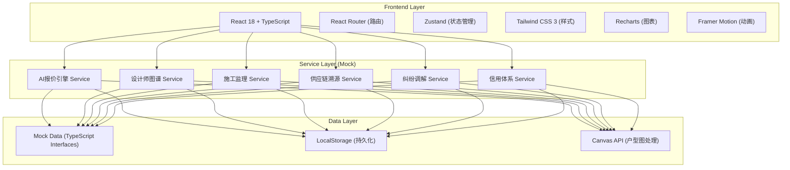
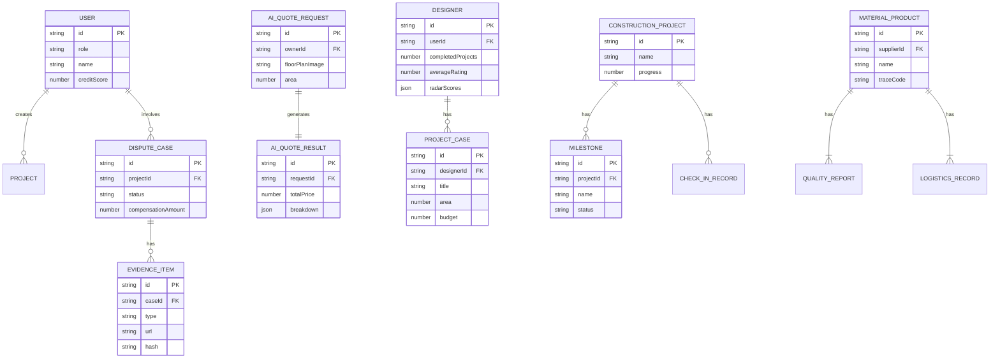

## 1. Architecture Design



## 2. Technology Description

- **Frontend**: React@18.2.0 + TypeScript@5.3.0 + Vite@5.0.0
- **State Management**: Zustand@4.4.0（轻量、无 boilerplate）
- **Routing**: React Router DOM@6.20.0
- **Styling**: Tailwind CSS@3.3.0 + PostCSS
- **Charts**: Recharts@2.10.0（雷达图、饼图、折线图）
- **Animation**: Framer Motion@10.16.0
- **Icons**: Lucide React@0.294.0
- **Date Handling**: date-fns@2.30.0
- **Backend**: 无后端，使用 Mock 数据 + TypeScript 类型定义
- **Initialization**: vite 官方脚手架 `npm create vite@latest`

## 3. Route Definitions

| Route | Purpose |
|-------|---------|
| `/dashboard` | 首页总览 - 数据仪表盘 |
| `/ai-quote` | AI报价中心 - 户型图上传+智能报价 |
| `/designers` | 设计师图谱 - 能力雷达图+智能匹配 |
| `/construction` | 施工监理 - 进度看板+打卡中心 |
| `/supply-chain` | 供应链溯源 - 商品溯源+物流轨迹 |
| `/dispute` | 纠纷调解 - 案件管理+赔付引擎 |
| `/credit` | 信用中心 - 信用画像+评价记录 |

## 4. Data Model (TypeScript Interfaces)

```typescript
// 核心实体类型定义

interface User {
  id: string;
  role: 'owner' | 'designer' | 'contractor' | 'supplier' | 'admin';
  name: string;
  avatar: string;
  phone: string;
  creditScore: number;
  creditLevel: 'S' | 'A' | 'B' | 'C' | 'D';
}

interface AIQuoteRequest {
  id: string;
  ownerId: string;
  floorPlanImage: string;
  area: number;
  rooms: number;
  style: 'modern' | 'european' | 'chinese' | 'minimalist' | 'industrial';
  materialPreference: 'budget' | 'mid-range' | 'premium' | 'luxury';
  createdAt: Date;
}

interface AIQuoteResult {
  id: string;
  requestId: string;
  totalPrice: number;
  breakdown: {
    labor: number;
    auxiliaryMaterials: number;
    mainMaterials: number;
    managementFee: number;
    designFee: number;
  };
  itemizedQuotes: QuoteItem[];
  generatedAt: Date;
}

interface QuoteItem {
  category: string;
  name: string;
  unit: string;
  quantity: number;
  unitPrice: number;
  totalPrice: number;
}

interface Designer {
  id: string;
  userId: string;
  name: string;
  avatar: string;
  specializations: string[];
  completedProjects: number;
  averageRating: number;
  complaintRate: number;
  yearsExperience: number;
  radarScores: {
    designAbility: number;
    communication: number;
    costControl: number;
    scheduleAdherence: number;
    afterSales: number;
  };
  portfolio: ProjectCase[];
}

interface ProjectCase {
  id: string;
  title: string;
  images: string[];
  area: number;
  budget: number;
  style: string;
  ownerRating: number;
}

interface ConstructionProject {
  id: string;
  name: string;
  address: string;
  ownerId: string;
  designerId: string;
  contractorId: string;
  totalBudget: number;
  startDate: Date;
  estimatedEndDate: Date;
  progress: number;
  milestones: Milestone[];
  checkIns: CheckInRecord[];
}

interface Milestone {
  id: string;
  name: string;
  order: number;
  plannedDate: Date;
  actualDate?: Date;
  status: 'pending' | 'in-progress' | 'completed' | 'delayed';
  photos: string[];
  videos: string[];
}

interface CheckInRecord {
  id: string;
  milestoneId: string;
  contractorId: string;
  timestamp: Date;
  location: { lat: number; lng: number };
  photos: string[];
  notes: string;
}

interface MaterialProduct {
  id: string;
  supplierId: string;
  name: string;
  brand: string;
  category: string;
  price: number;
  traceCode: string;
  brandAuthorization: AuthorizationDoc;
  qualityReports: QualityReport[];
  logistics: LogisticsRecord[];
}

interface AuthorizationDoc {
  id: string;
  issuer: string;
  validFrom: Date;
  validTo: Date;
  certificateUrl: string;
  verified: boolean;
}

interface QualityReport {
  id: string;
  batchNumber: string;
  testDate: Date;
  testItems: { name: string; result: string; standard: string }[];
  reportUrl: string;
}

interface LogisticsRecord {
  id: string;
  timestamp: Date;
  location: string;
  status: string;
  operator: string;
}

interface DisputeCase {
  id: string;
  projectId: string;
  plaintiffId: string;
  defendantId: string;
  type: string;
  description: string;
  status: 'submitted' | 'evidence-collecting' | 'evaluating' | 'mediating' | 'resolved' | 'closed';
  evidenceChain: EvidenceItem[];
  thirdPartyEvaluator?: string;
  compensationAmount?: number;
  ruling?: string;
  createdAt: Date;
}

interface EvidenceItem {
  id: string;
  type: 'contract' | 'photo' | 'video' | 'chat' | 'invoice' | 'other';
  title: string;
  url: string;
  uploaderId: string;
  uploadedAt: Date;
  hash: string;
}

interface CompensationRule {
  id: string;
  name: string;
  description: string;
  condition: string;
  calculationFormula: string;
  maxAmount: number;
}
```

## 5. Data Model ER Diagram



## 6. Project Structure

```
src/
├── assets/              # 静态资源
├── components/          # 通用组件
│   ├── layout/          # 布局组件 (Sidebar, Header, Card)
│   ├── charts/          # 图表组件 (RadarChart, PieChart, LineChart)
│   └── ui/              # UI组件 (Button, Badge, Progress, Timeline)
├── pages/               # 页面组件
│   ├── Dashboard.tsx
│   ├── AIQuote.tsx
│   ├── Designers.tsx
│   ├── Construction.tsx
│   ├── SupplyChain.tsx
│   ├── Dispute.tsx
│   └── CreditCenter.tsx
├── store/               # 状态管理
│   └── useAppStore.ts
├── services/            # 业务逻辑层
│   ├── quoteService.ts
│   ├── designerService.ts
│   ├── constructionService.ts
│   ├── supplyChainService.ts
│   └── disputeService.ts
├── types/               # TypeScript类型定义
│   └── index.ts
├── data/                # Mock数据
│   ├── mockUsers.ts
│   ├── mockQuotes.ts
│   ├── mockDesigners.ts
│   ├── mockProjects.ts
│   ├── mockProducts.ts
│   └── mockDisputes.ts
├── utils/               # 工具函数
│   ├── formatters.ts
│   └── creditCalculator.ts
├── App.tsx
├── main.tsx
└── index.css
```
