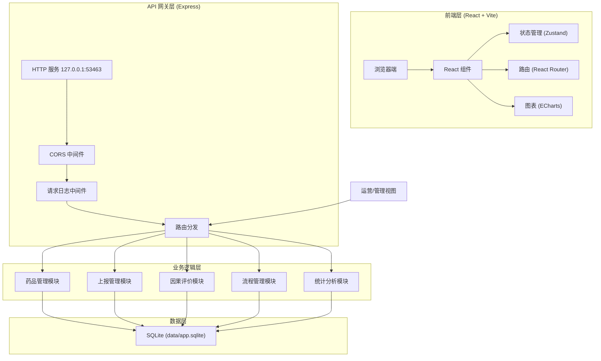
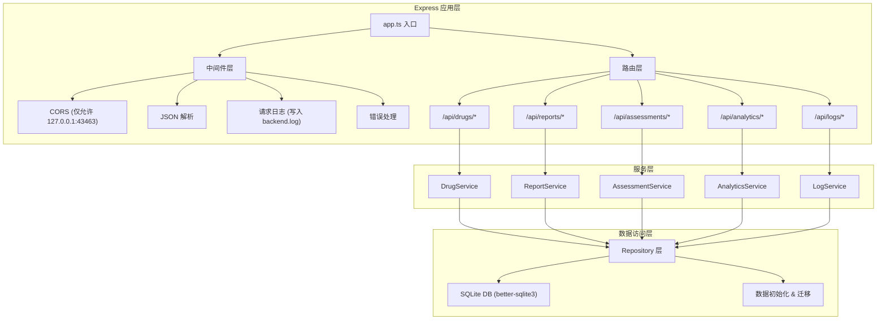
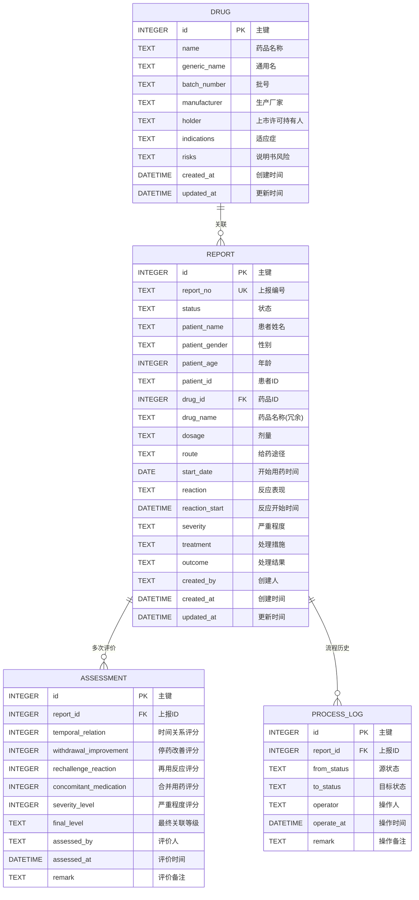

## 1. 架构设计



## 2. 技术描述

- **前端**：React@18 + TypeScript + Vite@5 + TailwindCSS@3 + Zustand + React Router@6 + ECharts@5 + Lucide React
- **后端**：Express@4 + TypeScript + better-sqlite3 + CORS
- **数据库**：SQLite（文件存储于 data/app.sqlite，无外部依赖）
- **端口配置**：
  - 前端端口：43463（40000 + 3463）
  - 后端端口：53463（50000 + 3463）
  - 备用槽位：41000/51000、42000/52000... + 3463
- **进程隔离**：仅绑定 127.0.0.1，启动前检查端口占用，归属不明则切换备用端口
- **无外部依赖**：不使用 MySQL、PostgreSQL、Redis、消息队列或对象存储，全链路本地 SQLite 即可打通

## 3. 路由定义

| 路由 | 页面 | 用途 |
|------|------|------|
| / | Dashboard | 首页仪表盘，统计概览 |
| /drugs | DrugList | 药品库列表 |
| /drugs/:id | DrugDetail | 药品详情 |
| /drugs/new | DrugForm | 新增药品 |
| /reports | ReportList | 上报列表 |
| /reports/new | ReportForm | 新建上报表单（四步） |
| /reports/:id | ReportDetail | 上报详情 + 流程操作 |
| /reports/:id/assessment | AssessmentForm | 因果评价 |
| /analytics | Analytics | 分析报表 |
| /admin | AdminView | 运营管理视图 |

## 4. API 定义

### TypeScript 类型定义
```typescript
// 药品
interface Drug {
  id: number;
  name: string;
  genericName: string;
  batchNumber: string;
  manufacturer: string;
  holder: string;
  indications: string;
  risks: string;
  createdAt: string;
  updatedAt: string;
}

// 上报
interface Report {
  id: number;
  reportNo: string;
  status: 'draft' | 'submitted' | 'reviewing' | 'returned' | 'reported' | 'receipt' | 'archived';
  patientName: string;
  patientGender: 'male' | 'female';
  patientAge: number;
  patientId: string;
  drugId: number;
  drugName: string;
  dosage: string;
  route: string;
  startDate: string;
  reaction: string;
  reactionStart: string;
  severity: 'mild' | 'moderate' | 'severe' | 'life-threatening' | 'fatal';
  treatment: string;
  outcome: string;
  createdBy: string;
  createdAt: string;
  updatedAt: string;
}

// 因果评价
interface Assessment {
  id: number;
  reportId: number;
  temporalRelation: number;
  withdrawalImprovement: number;
  rechallengeReaction: number;
  concomitantMedication: number;
  severityLevel: number;
  finalLevel: 'definite' | 'probable' | 'possible' | 'unlikely';
  assessedBy: string;
  assessedAt: string;
  remark: string;
}

// 流程日志
interface ProcessLog {
  id: number;
  reportId: number;
  fromStatus: string;
  toStatus: string;
  operator: string;
  operateAt: string;
  remark: string;
}
```

### API 接口
| 方法 | 路径 | 说明 |
|------|------|------|
| GET | /api/health | 健康检查 |
| GET | /api/drugs | 药品列表（分页、搜索） |
| GET | /api/drugs/:id | 药品详情 |
| POST | /api/drugs | 新增药品 |
| PUT | /api/drugs/:id | 更新药品 |
| DELETE | /api/drugs/:id | 删除药品 |
| GET | /api/reports | 上报列表（筛选、分页） |
| GET | /api/reports/:id | 上报详情 |
| POST | /api/reports | 创建上报 |
| PUT | /api/reports/:id | 更新上报 |
| POST | /api/reports/:id/submit | 提交初报 |
| POST | /api/reports/:id/review | 质控复核 |
| POST | /api/reports/:id/return | 退回补充 |
| POST | /api/reports/:id/report | 正式上报 |
| POST | /api/reports/:id/receipt | 监管回执 |
| POST | /api/assessments | 提交因果评价 |
| GET | /api/assessments/report/:reportId | 获取上报的评价记录 |
| GET | /api/analytics/drug-stats | 药品维度统计 |
| GET | /api/analytics/reaction-stats | 反应类型统计 |
| GET | /api/analytics/severity-stats | 严重程度统计 |
| GET | /api/analytics/timeline | 上报时效趋势 |
| GET | /api/analytics/duplicates | 重复病例识别 |
| GET | /api/logs/report/:reportId | 流程日志 |

## 5. 服务器架构



## 6. 数据模型

### 6.1 ER 图



### 6.2 DDL 语句

```sql
-- 药品库
CREATE TABLE IF NOT EXISTS drugs (
  id INTEGER PRIMARY KEY AUTOINCREMENT,
  name TEXT NOT NULL,
  generic_name TEXT,
  batch_number TEXT NOT NULL,
  manufacturer TEXT NOT NULL,
  holder TEXT,
  indications TEXT,
  risks TEXT,
  created_at DATETIME DEFAULT CURRENT_TIMESTAMP,
  updated_at DATETIME DEFAULT CURRENT_TIMESTAMP
);

CREATE INDEX IF NOT EXISTS idx_drugs_name ON drugs(name);
CREATE INDEX IF NOT EXISTS idx_drugs_batch ON drugs(batch_number);

-- 上报表
CREATE TABLE IF NOT EXISTS reports (
  id INTEGER PRIMARY KEY AUTOINCREMENT,
  report_no TEXT UNIQUE NOT NULL,
  status TEXT NOT NULL DEFAULT 'draft',
  patient_name TEXT NOT NULL,
  patient_gender TEXT,
  patient_age INTEGER,
  patient_id TEXT,
  drug_id INTEGER,
  drug_name TEXT,
  dosage TEXT,
  route TEXT,
  start_date TEXT,
  reaction TEXT,
  reaction_start TEXT,
  severity TEXT,
  treatment TEXT,
  outcome TEXT,
  created_by TEXT NOT NULL,
  created_at DATETIME DEFAULT CURRENT_TIMESTAMP,
  updated_at DATETIME DEFAULT CURRENT_TIMESTAMP,
  FOREIGN KEY (drug_id) REFERENCES drugs(id)
);

CREATE INDEX IF NOT EXISTS idx_reports_status ON reports(status);
CREATE INDEX IF NOT EXISTS idx_reports_drug ON reports(drug_id);
CREATE INDEX IF NOT EXISTS idx_reports_created ON reports(created_at);

-- 因果评价表
CREATE TABLE IF NOT EXISTS assessments (
  id INTEGER PRIMARY KEY AUTOINCREMENT,
  report_id INTEGER NOT NULL,
  temporal_relation INTEGER NOT NULL,
  withdrawal_improvement INTEGER NOT NULL,
  rechallenge_reaction INTEGER NOT NULL,
  concomitant_medication INTEGER NOT NULL,
  severity_level INTEGER NOT NULL,
  final_level TEXT NOT NULL,
  assessed_by TEXT NOT NULL,
  assessed_at DATETIME DEFAULT CURRENT_TIMESTAMP,
  remark TEXT,
  FOREIGN KEY (report_id) REFERENCES reports(id)
);

CREATE INDEX IF NOT EXISTS idx_assessments_report ON assessments(report_id);

-- 流程日志表
CREATE TABLE IF NOT EXISTS process_logs (
  id INTEGER PRIMARY KEY AUTOINCREMENT,
  report_id INTEGER NOT NULL,
  from_status TEXT,
  to_status TEXT NOT NULL,
  operator TEXT NOT NULL,
  operate_at DATETIME DEFAULT CURRENT_TIMESTAMP,
  remark TEXT,
  FOREIGN KEY (report_id) REFERENCES reports(id)
);

CREATE INDEX IF NOT EXISTS idx_logs_report ON process_logs(report_id);

-- 初始化测试数据
INSERT INTO drugs (name, generic_name, batch_number, manufacturer, holder, indications, risks) VALUES
('阿莫西林胶囊', '阿莫西林', '20240101', '华北制药股份有限公司', '华北制药', '敏感菌所致感染', '过敏反应、胃肠道反应'),
('布洛芬缓释胶囊', '布洛芬', '20240201', '中美天津史克制药有限公司', '葛兰素史克', '解热镇痛', '胃肠道刺激、肝肾功能影响'),
('头孢呋辛酯片', '头孢呋辛酯', '20240301', '广州白云山医药集团', '白云山制药', '敏感菌感染', '过敏、血象异常'),
('奥美拉唑肠溶胶囊', '奥美拉唑', '20240401', '阿斯利康制药有限公司', '阿斯利康', '胃溃疡、反流性食管炎', '头痛、腹泻、肝酶升高');
```
