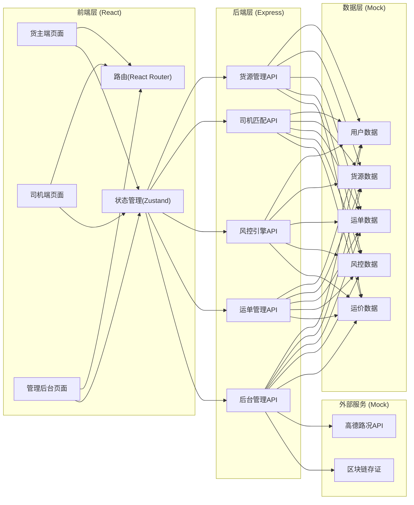
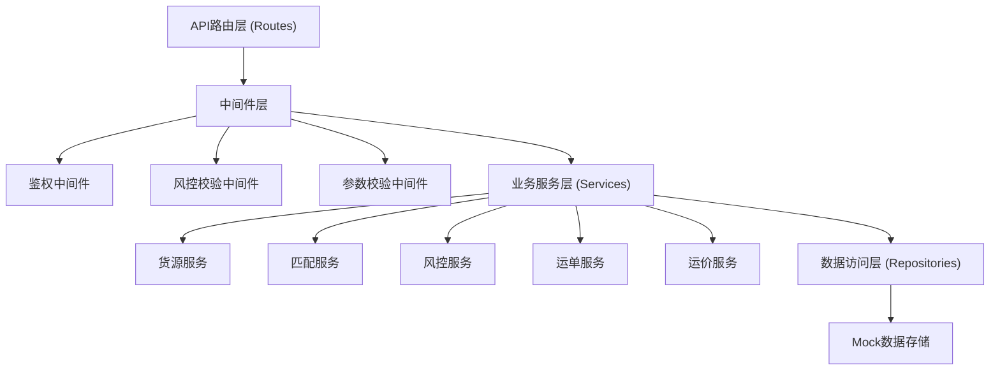
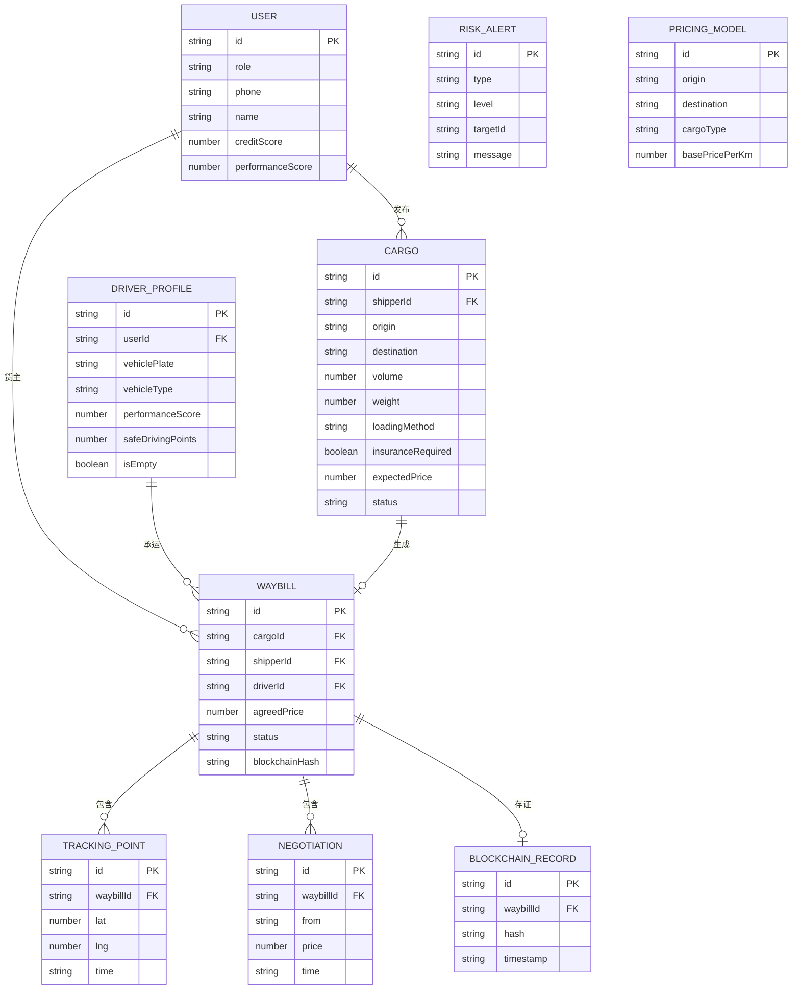

## 1. 架构设计



## 2. 技术描述

- **前端**: React@18 + TypeScript + React Router DOM@6 + Zustand + TailwindCSS@3 + Lucide React
- **初始化工具**: Vite (react-express-ts模板)
- **后端**: Express@4 + TypeScript (ESM)
- **数据存储**: 内存Mock数据 + 文件持久化
- **图标库**: lucide-react

## 3. 路由定义

| 路由路径 | 页面用途 | 角色权限 |
|----------|----------|----------|
| /login | 登录页面（角色切换） | 公开 |
| /shipper/dashboard | 货主工作台 | 货主 |
| /shipper/cargo/publish | 发布货源 | 货主 |
| /shipper/cargo/list | 货源列表 | 货主 |
| /shipper/cargo/:id/match | 智能匹配司机 | 货主 |
| /shipper/waybill/:id/track | 在途追踪 | 货主 |
| /shipper/credit | 信用中心 | 货主 |
| /driver/dashboard | 司机工作台 | 司机 |
| /driver/empty-report | 空车上报 | 司机 |
| /driver/cargo-hall | 货源大厅 | 司机 |
| /driver/negotiation/:id | 议价中心 | 司机 |
| /driver/points-mall | 积分商城 | 司机 |
| /admin/dashboard | 运营数据看板 | 管理员 |
| /admin/pricing-model | 专线价格指导模型 | 管理员 |
| /admin/risk-monitor | 风控监控大屏 | 管理员 |
| /admin/driver-growth | 司机成长体系 | 管理员 |
| /admin/traffic-control | 交通管制推送 | 管理员 |

## 4. API定义

### 4.1 TypeScript类型定义

```typescript
// 用户相关
interface User {
  id: string;
  role: 'shipper' | 'driver' | 'admin';
  phone: string;
  name: string;
  avatar?: string;
  creditScore: number;
  performanceScore: number;
  createdAt: string;
}

// 货源相关
interface Cargo {
  id: string;
  shipperId: string;
  title: string;
  origin: string;
  destination: string;
  distance: number;
  volume: number;       // 立方米 (必填)
  weight: number;       // 吨 (必填)
  cargoType: string;
  loadingMethod: 'manual' | 'forklift' | 'crane' | 'conveyor';  // 装卸方式 (必填)
  insuranceRequired: boolean;   // 保险要求 (必填)
  insuranceAmount?: number;
  expectedPrice: number;
  referencePrice: number;
  status: 'draft' | 'published' | 'matched' | 'shipping' | 'completed' | 'cancelled';
  requiredVehicleTypes: string[];
  requiredQualifications: string[];
  publishedAt: string;
  images?: string[];
}

// 司机相关
interface DriverProfile {
  id: string;
  userId: string;
  vehiclePlate: string;
  vehicleType: string;    // 车型
  vehicleCapacity: number;  // 载重吨
  vehicleVolume: number;    // 容积方
  qualifications: string[];  // 承运资质
  performanceScore: number;  // 履约分
  totalOrders: number;
  isEmpty: boolean;        // 是否空车
  currentLocation: { lat: number; lng: number; address: string };
  frequentRoutes: Array<{ origin: string; destination: string; count: number }>;
  safeDrivingPoints: number;  // 安全驾驶积分
  level: number;
}

// 运单相关
interface Waybill {
  id: string;
  cargoId: string;
  shipperId: string;
  driverId: string;
  agreedPrice: number;
  status: 'pending' | 'loading' | 'shipping' | 'unloading' | 'completed' | 'disputed';
  negotiationHistory: Array<{ from: string; price: number; time: string; message?: string }>;
  blockchainHash?: string;
  trackingPoints: Array<{ lat: number; lng: number; time: string; speed?: number }>;
  estimatedArrival?: string;
  actualArrival?: string;
  createdAt: string;
}

// 风控相关
interface RiskAlert {
  id: string;
  type: 'credit' | 'track' | 'price' | 'qualification';
  level: 'low' | 'medium' | 'high' | 'critical';
  targetId: string;
  targetType: 'shipper' | 'driver' | 'waybill';
  message: string;
  isRead: boolean;
  createdAt: string;
}

// 运价模型
interface PricingModel {
  id: string;
  route: { origin: string; destination: string };
  cargoType: string;
  season: 'spring' | 'summer' | 'autumn' | 'winter';
  basePricePerKm: number;
  basePricePerTon: number;
  surgeFactor: number;
  updatedAt: string;
}
```

### 4.2 接口列表

| 方法 | 路径 | 说明 |
|------|------|------|
| POST | /api/auth/login | 登录 |
| GET | /api/user/profile | 获取当前用户信息 |
| POST | /api/cargo | 发布货源 |
| GET | /api/cargo | 获取货源列表（支持筛选） |
| GET | /api/cargo/:id | 获取货源详情 |
| GET | /api/cargo/:id/match-drivers | 智能匹配司机 |
| POST | /api/driver/report-empty | 司机空车上报 |
| GET | /api/driver/recommend-cargos | 获取推荐货源（常跑线路） |
| GET | /api/driver/nearby-cargos | 获取附近货源 |
| POST | /api/negotiation/:cargoId/offer | 发起议价 |
| GET | /api/negotiation/:cargoId | 获取议价历史 |
| POST | /api/waybill | 创建运单 |
| GET | /api/waybill/:id | 获取运单详情 |
| POST | /api/waybill/:id/track | 上报轨迹点 |
| GET | /api/risk/alerts | 获取风控告警 |
| POST | /api/risk/evaluate-credit | 评估货主信用分 |
| GET | /api/admin/pricing-model | 获取运价模型列表 |
| PUT | /api/admin/pricing-model/:id | 更新运价模型 |
| GET | /api/admin/risk-overview | 风控总览数据 |
| GET | /api/admin/driver-growth | 司机成长体系配置 |
| GET | /api/traffic/controls | 获取交通管制信息 |

## 5. 服务端架构图



## 6. 数据模型

### 6.1 ER图



### 6.2 项目结构

```
may-89153/
├── api/                          # 后端代码
│   ├── src/
│   │   ├── routes/               # API路由
│   │   ├── middleware/           # 中间件
│   │   ├── services/             # 业务服务
│   │   ├── repositories/         # 数据访问
│   │   ├── data/                 # Mock数据
│   │   └── index.ts              # 入口
├── shared/                       # 共享类型
│   └── types.ts
├── src/                          # 前端代码
│   ├── pages/                    # 页面组件
│   │   ├── login/
│   │   ├── shipper/
│   │   ├── driver/
│   │   └── admin/
│   ├── components/               # 通用组件
│   ├── hooks/                    # 自定义Hooks
│   ├── store/                    # Zustand状态
│   ├── utils/                    # 工具函数
│   ├── api/                      # API调用封装
│   └── App.tsx
├── .trae/documents/              # 文档
├── vite.config.ts
├── tailwind.config.js
├── tsconfig.json
└── package.json
```
