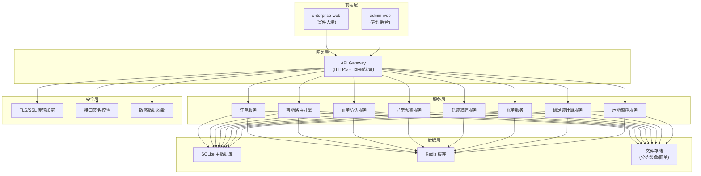
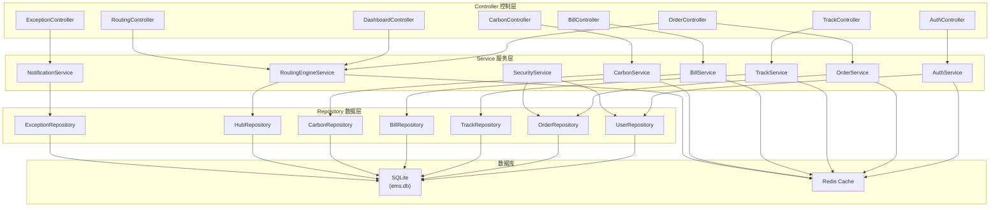
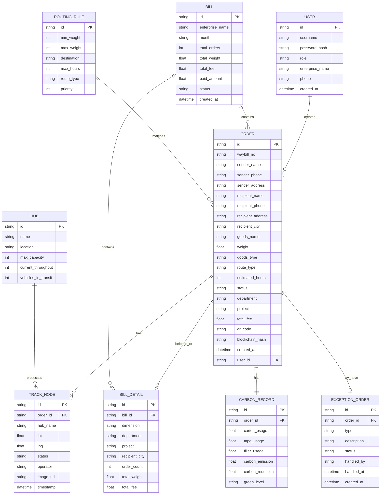

## 1. 架构设计



## 2. 技术描述

### 2.1 前端技术栈
- **框架**: React@18.2 + TypeScript@5
- **构建工具**: Vite@5
- **UI 组件库**: Ant Design@5
- **路由**: React Router@6
- **状态管理**: Zustand
- **HTTP 客户端**: Axios
- **3D 地图**: three.js + @react-three/fiber + @react-three/drei
- **图表**: ECharts@5
- **Excel 处理**: xlsx
- **日期处理**: dayjs
- **图标**: @ant-design/icons

### 2.2 后端技术栈
- **框架**: Express@4
- **语言**: TypeScript@5
- **数据库**: SQLite3 (现有 ems.db)
- **缓存**: Redis
- **认证**: JWT
- **API 文档**: Swagger/OpenAPI
- **加密**: crypto-js (符合邮政业安全规范)

### 2.3 安全规范
- 全链路 HTTPS/TLS 1.3 加密传输
- 接口请求签名校验（HMAC-SHA256）
- 敏感数据加密存储（手机号、地址等）
- 访问频率限制
- SQL 注入防护
- XSS/CSRF 防护

## 3. 路由定义

### 3.1 enterprise-web (寄件人端)
| 路由 | 页面 | 用途 |
|------|------|------|
| / | Dashboard | 首页工作台 |
| /orders | Orders | 订单列表 |
| /orders/create | OrderCreate | 多场景下单 |
| /orders/:id/track | TrackDetail | 3D轨迹追踪 |
| /bills | Bills | 月结账单列表 |
| /bills/:id | BillDetail | 账单详情 |
| /carbon | CarbonFootprint | 碳足迹统计 |

### 3.2 admin-web (管理后台)
| 路由 | 页面 | 用途 |
|------|------|------|
| / | Dashboard | 运能看板 |
| /exceptions | ExceptionCenter | 异常预警中枢 |
| /routing | RoutingConfig | 智能路由配置 |
| /waybill | WaybillSecurity | 面单防伪管理 |
| /hubs | HubMonitor | 分拣中心监控 |

## 4. API 定义

### 4.1 TypeScript 类型定义

```typescript
// 订单类型
interface Order {
  id: string;
  waybillNo: string;
  sender: {
    name: string;
    phone: string;
    address: string;
  };
  recipient: {
    name: string;
    phone: string;
    address: string;
    city: string;
  };
  goods: {
    name: string;
    weight: number;
    type: 'normal' | 'cold' | 'fragile';
  };
  routing: {
    routeType: 'air' | 'land' | 'cold';
    estimatedTime: number;
    hubs: string[];
  };
  status: 'pending' | 'collected' | 'sorting' | 'transit' | 'delivering' | 'signed' | 'exception';
  department?: string;
  project?: string;
  totalFee: number;
  createdAt: string;
  qrCode: string;
  blockchainHash: string;
}

// 轨迹节点
interface TrackNode {
  id: string;
  orderId: string;
  hubName: string;
  location: { lat: number; lng: number };
  status: string;
  timestamp: string;
  operator: string;
  imageUrl?: string;
}

// 账单
interface Bill {
  id: string;
  enterpriseName: string;
  month: string;
  totalOrders: number;
  totalWeight: number;
  totalFee: number;
  paidAmount: number;
  status: 'draft' | 'confirmed' | 'paid' | 'overdue';
  details: BillDetail[];
  orders: Order[];
}

interface BillDetail {
  id: string;
  dimension: 'department' | 'project' | 'recipient_city';
  department?: string;
  project?: string;
  recipientCity?: string;
  orderCount: number;
  totalWeight: number;
  totalFee: number;
}

// 碳足迹
interface CarbonRecord {
  id: string;
  orderId: string;
  packaging: {
    carton: number;
    tape: number;
    filler: number;
  };
  carbonEmission: number;
  carbonReduction: number;
  greenLevel: 'A' | 'B' | 'C';
}

// 运能数据
interface HubCapacity {
  hubId: string;
  hubName: string;
  throughput: number;
  maxCapacity: number;
  vehiclesInTransit: number;
  exceptionCount: number;
  warningLevel: 'normal' | 'warning' | 'danger';
}

// 异常件
interface ExceptionOrder {
  id: string;
  orderId: string;
  waybillNo: string;
  type: 'delay' | 'damage' | 'lost' | 'address_error';
  description: string;
  status: 'pending' | 'processing' | 'resolved';
  createdAt: string;
  handledBy?: string;
  handledAt?: string;
}
```

### 4.2 接口列表

| 方法 | 路径 | 描述 | 鉴权 |
|------|------|------|------|
| POST | `/api/auth/login` | 登录获取 token | 否 |
| POST | `/api/orders` | 创建订单 | 是 |
| POST | `/api/orders/batch` | 批量导入订单 | 是 |
| GET | `/api/orders` | 订单列表 | 是 |
| GET | `/api/orders/:id` | 订单详情 | 是 |
| GET | `/api/orders/:id/track` | 轨迹详情 | 是 |
| POST | `/api/orders/:id/print` | 打印面单 | 是 |
| GET | `/api/bills` | 账单列表 | 是 |
| GET | `/api/bills/:id` | 账单详情 | 是 |
| POST | `/api/bills/generate` | 生成账单 | 是 |
| GET | `/api/bills/:id/export` | 导出账单 | 是 |
| GET | `/api/carbon` | 碳足迹统计 | 是 |
| GET | `/api/dashboard/capacity` | 运能看板数据 | 是 |
| GET | `/api/exceptions` | 异常件列表 | 是 |
| POST | `/api/exceptions/:id/handle` | 处理异常件 | 是 |
| GET | `/api/routing/config` | 路由配置 | 是 |
| POST | `/api/routing/match` | 智能路由匹配 | 是 |

## 5. 服务端架构图



## 6. 数据模型

### 6.1 ER 图



### 6.2 DDL 语句

```sql
-- 用户表
CREATE TABLE IF NOT EXISTS users (
  id TEXT PRIMARY KEY,
  username TEXT UNIQUE NOT NULL,
  password_hash TEXT NOT NULL,
  role TEXT NOT NULL CHECK(role IN ('sender', 'courier', 'sorter', 'recipient', 'admin')),
  enterprise_name TEXT,
  phone TEXT NOT NULL,
  created_at DATETIME DEFAULT CURRENT_TIMESTAMP
);

-- 订单表
CREATE TABLE IF NOT EXISTS orders (
  id TEXT PRIMARY KEY,
  waybill_no TEXT UNIQUE NOT NULL,
  sender_name TEXT NOT NULL,
  sender_phone TEXT NOT NULL,
  sender_address TEXT NOT NULL,
  recipient_name TEXT NOT NULL,
  recipient_phone TEXT NOT NULL,
  recipient_address TEXT NOT NULL,
  recipient_city TEXT NOT NULL,
  goods_name TEXT NOT NULL,
  weight REAL NOT NULL,
  goods_type TEXT NOT NULL CHECK(goods_type IN ('normal', 'cold', 'fragile')),
  route_type TEXT CHECK(route_type IN ('air', 'land', 'cold')),
  estimated_hours INTEGER,
  status TEXT NOT NULL DEFAULT 'pending',
  department TEXT,
  project TEXT,
  total_fee REAL NOT NULL DEFAULT 0,
  qr_code TEXT,
  blockchain_hash TEXT,
  created_at DATETIME DEFAULT CURRENT_TIMESTAMP,
  user_id TEXT NOT NULL,
  bill_id TEXT,
  FOREIGN KEY(user_id) REFERENCES users(id),
  FOREIGN KEY(bill_id) REFERENCES bills(id)
);

-- 轨迹节点表
CREATE TABLE IF NOT EXISTS track_nodes (
  id TEXT PRIMARY KEY,
  order_id TEXT NOT NULL,
  hub_name TEXT NOT NULL,
  lat REAL NOT NULL,
  lng REAL NOT NULL,
  status TEXT NOT NULL,
  operator TEXT,
  image_url TEXT,
  timestamp DATETIME DEFAULT CURRENT_TIMESTAMP,
  FOREIGN KEY(order_id) REFERENCES orders(id)
);

-- 账单表
CREATE TABLE IF NOT EXISTS bills (
  id TEXT PRIMARY KEY,
  enterprise_name TEXT NOT NULL,
  month TEXT NOT NULL,
  total_orders INTEGER NOT NULL DEFAULT 0,
  total_weight REAL NOT NULL DEFAULT 0,
  total_fee REAL NOT NULL DEFAULT 0,
  paid_amount REAL NOT NULL DEFAULT 0,
  status TEXT NOT NULL DEFAULT 'draft' CHECK(status IN ('draft', 'confirmed', 'paid', 'overdue')),
  created_at DATETIME DEFAULT CURRENT_TIMESTAMP
);

-- 账单明细表
CREATE TABLE IF NOT EXISTS bill_details (
  id TEXT PRIMARY KEY,
  bill_id TEXT NOT NULL,
  dimension TEXT NOT NULL CHECK(dimension IN ('department', 'project', 'recipient_city')),
  department TEXT,
  project TEXT,
  recipient_city TEXT,
  order_count INTEGER NOT NULL,
  total_weight REAL NOT NULL,
  total_fee REAL NOT NULL,
  FOREIGN KEY(bill_id) REFERENCES bills(id)
);

-- 碳足迹表
CREATE TABLE IF NOT EXISTS carbon_records (
  id TEXT PRIMARY KEY,
  order_id TEXT NOT NULL UNIQUE,
  carton_usage REAL NOT NULL DEFAULT 0,
  tape_usage REAL NOT NULL DEFAULT 0,
  filler_usage REAL NOT NULL DEFAULT 0,
  carbon_emission REAL NOT NULL,
  carbon_reduction REAL NOT NULL,
  green_level TEXT NOT NULL CHECK(green_level IN ('A', 'B', 'C')),
  FOREIGN KEY(order_id) REFERENCES orders(id)
);

-- 分拣中心表
CREATE TABLE IF NOT EXISTS hubs (
  id TEXT PRIMARY KEY,
  name TEXT NOT NULL,
  location TEXT NOT NULL,
  max_capacity INTEGER NOT NULL,
  current_throughput INTEGER NOT NULL DEFAULT 0,
  vehicles_in_transit INTEGER NOT NULL DEFAULT 0,
  lat REAL NOT NULL,
  lng REAL NOT NULL
);

-- 异常件表
CREATE TABLE IF NOT EXISTS exception_orders (
  id TEXT PRIMARY KEY,
  order_id TEXT NOT NULL UNIQUE,
  type TEXT NOT NULL CHECK(type IN ('delay', 'damage', 'lost', 'address_error')),
  description TEXT,
  status TEXT NOT NULL DEFAULT 'pending' CHECK(status IN ('pending', 'processing', 'resolved')),
  handled_by TEXT,
  handled_at DATETIME,
  created_at DATETIME DEFAULT CURRENT_TIMESTAMP,
  FOREIGN KEY(order_id) REFERENCES orders(id)
);

-- 路由规则表
CREATE TABLE IF NOT EXISTS routing_rules (
  id TEXT PRIMARY KEY,
  min_weight INTEGER NOT NULL DEFAULT 0,
  max_weight INTEGER NOT NULL,
  destination TEXT,
  max_hours INTEGER,
  route_type TEXT NOT NULL CHECK(route_type IN ('air', 'land', 'cold')),
  priority INTEGER NOT NULL DEFAULT 1
);

-- 索引
CREATE INDEX IF NOT EXISTS idx_orders_user_id ON orders(user_id);
CREATE INDEX IF NOT EXISTS idx_orders_status ON orders(status);
CREATE INDEX IF NOT EXISTS idx_orders_waybill_no ON orders(waybill_no);
CREATE INDEX IF NOT EXISTS idx_orders_created_at ON orders(created_at);
CREATE INDEX IF NOT EXISTS idx_track_nodes_order_id ON track_nodes(order_id);
CREATE INDEX IF NOT EXISTS idx_bills_month ON bills(month);
CREATE INDEX IF NOT EXISTS idx_exception_orders_status ON exception_orders(status);
```
