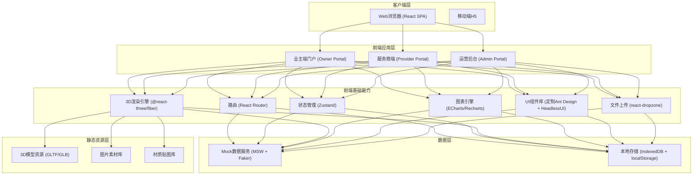

## 1. 架构设计



---

## 2. 技术说明

### 2.1 核心技术栈

| 类别 | 选型 | 版本 | 说明 |
|------|------|------|------|
| 前端框架 | React | 18.x | 函数式组件 + Hooks |
| 构建工具 | Vite | 5.x | HMR + 快速构建 + Rollup打包 |
| 语言 | TypeScript | 5.x | 类型安全，严格模式 |
| 样式 | TailwindCSS | 3.x | 原子化CSS + 自定义主题 |
| CSS-in-JS | @emotion/react | 11.x | 动态样式 + 主题变量 |
| 3D渲染 | three | 0.160.x | WebGL底层引擎 |
| 3D React封装 | @react-three/fiber | 8.x | React声明式Three.js |
| 3D辅助库 | @react-three/drei | 9.x | 常用3D组件集合 |
| 3D后期处理 | @react-three/postprocessing | 2.x | SSAO/Bloom/Vignette |
| 状态管理 | zustand | 4.x | 轻量store，分模块 |
| 路由 | react-router-dom | 6.x | 嵌套路由 + 懒加载 |
| 图表 | recharts | 2.x | 趋势图、柱状图、饼图 |
| 甘特图 | @jiaminghi/data-view | 1.x / 自定义 | 项目进度甘特图 |
| UI基础 | antd | 5.x | 表格、表单、弹窗等复杂组件 |
| 无样式组件 | @headlessui/react | 1.x | 可访问性基础组件 |
| 图标 | lucide-react | 0.294.x | 现代化线性图标 |
| 动画 | framer-motion | 10.x | 页面转场 + 微交互 |
| 拖拽 | react-dnd | 16.x | 家具拖拽、任务拖拽 |
| 上传 | react-dropzone | 14.x | 户型图/证照拖拽上传 |
| 表单 | react-hook-form | 7.x | 高性能表单 + zod校验 |
| 校验 | zod | 3.x | Schema校验 + 类型推导 |
| Mock | msw | 2.x | Service Worker API Mock |
| Mock数据 | @faker-js/faker | 8.x | 真实感模拟数据生成 |
| 工具函数 | lodash-es | 4.x | 按需加载工具方法 |
| 日期 | dayjs | 1.x | 轻量日期处理 |

### 2.2 初始化方式

使用 `npm create vite@latest` 初始化 React + TypeScript 项目，再集成 TailwindCSS 3 和上述依赖。后端使用 Mock (MSW) 模拟，不搭建真实后端。

---

## 3. 路由定义

### 3.1 业主端路由 `/owner/*`

| 路由路径 | 页面组件 | 用途 |
|----------|----------|------|
| `/` | `HomePage` | 平台首页（全角色入口聚合） |
| `/owner` | `OwnerDashboard` | 业主个人中心首页 |
| `/owner/3d-generator` | `DGeneratorPage` | 3D效果图生成器（核心） |
| `/owner/calculator` | `CalculatorPage` | 装修计算器 |
| `/owner/inspiration` | `InspirationLibrary` | 风格灵感库瀑布流 |
| `/owner/inspiration/search` | `ImageSearchPage` | 以图搜图 |
| `/owner/inspiration/:id` | `InspirationDetail` | 灵感详情+色彩提取 |
| `/owner/materials` | `MaterialLibrary` | 材质库浏览 |
| `/owner/companies` | `CompanyListPage` | 装修公司列表 |
| `/owner/companies/:id` | `CompanyDetailPage` | 公司详情+量房预约 |
| `/owner/appointments` | `AppointmentList` | 我的预约列表 |
| `/owner/compare` | `ComparisonBoard` | 方案比价看板 |
| `/owner/knowledge/process` | `ProcessLibrary` | 施工工艺库 |
| `/owner/knowledge/process/:id` | `ProcessDetail` | 工艺详情 |
| `/owner/knowledge/pitfalls` | `PitfallGuide` | 避坑指南 |
| `/owner/community` | `CommunityHome` | 问答社区首页 |
| `/owner/community/questions/:id` | `QuestionDetail` | 问题详情页 |
| `/owner/progress/:projectId` | `ProgressTracker` | 我的装修进度 |
| `/owner/profile` | `OwnerProfile` | 个人资料与收藏 |

### 3.2 服务商端路由 `/provider/*`

| 路由路径 | 页面组件 | 用途 |
|----------|----------|------|
| `/provider` | `ProviderWorkspace` | 服务商工作台 |
| `/provider/audit` | `QualificationAudit` | 准入审核+资质上传 |
| `/provider/appointments` | `AppointmentSchedule` | 量房预约调度 |
| `/provider/plans` | `PlanManagement` | 装修方案管理 |
| `/provider/plans/create` | `PlanCreator` | 创建新方案 |
| `/provider/sites` | `SiteManagement` | 工地/进度管理 |
| `/provider/sites/:id/log` | `SiteDailyLog` | 施工日志上传 |
| `/provider/profile` | `CompanyProfile` | 公司信息维护 |

### 3.3 运营后台路由 `/admin/*`

| 路由路径 | 页面组件 | 用途 |
|----------|----------|------|
| `/admin` | `AdminDashboard` | 运营数据总览 |
| `/admin/company-audit` | `CompanyAuditQueue` | 装修公司审核队列 |
| `/admin/gantt` | `ProjectGantt` | 全局进度甘特图 |
| `/admin/supply-chain` | `SupplyChainAPI` | 供应链对接配置 |
| `/admin/materials` | `MaterialSKUAdmin` | 建材SKU管理 |
| `/admin/disputes` | `DisputeList` | 纠纷工单列表 |
| `/admin/disputes/:id` | `DisputeDetail` | 纠纷调解详情 |

---

## 4. API定义（Mock层接口规范）

### 4.1 TypeScript核心类型定义

```typescript
// 用户与角色
type UserRole = 'owner' | 'provider' | 'designer' | 'expert' | 'admin';

interface User {
  id: string;
  role: UserRole;
  phone: string;
  nickname: string;
  avatar?: string;
  createdAt: string;
}

// 装修公司
interface DecorationCompany {
  id: string;
  name: string;
  logo?: string;
  qualificationLevel: 'level1' | 'level2' | 'level3';
  licenseNumber: string;
  establishedYear: number;
  caseCount: number;
  averageRating: number;
  reviewCount: number;
  city: string;
  serviceScope: string[];
  tags: string[];
  auditStatus: 'pending' | 'approved' | 'rejected';
  qualificationDocs: QualificationDoc[];
  historicalProjects: HistoricalProject[];
  inspectionReports: InspectionReport[];
}

interface QualificationDoc {
  id: string;
  type: 'business_license' | 'qualification_cert' | 'safety_permit' | 'other';
  imageUrl: string;
  ocrResult?: Record<string, string>;
  verifiedAt?: string;
}

// 3D效果图方案
interface DesignPlan3D {
  id: string;
  name: string;
  ownerId: string;
  floorPlanUrl?: string;
  rooms: RoomConfig[];
  style: DesignStyle;
  budgetTier: 'economy' | 'quality' | 'luxury';
  totalBudget: number;
  furnitureItems: FurnitureItem[];
  createdAt: string;
}

interface RoomConfig {
  id: string;
  type: 'living' | 'bedroom' | 'kitchen' | 'bathroom' | 'balcony' | 'dining';
  name: string;
  width: number;
  length: number;
  height: number;
  walls: WallConfig[];
}

interface WallConfig {
  id: string;
  position: 'north' | 'south' | 'east' | 'west';
  width: number;
  openings: Opening[];
}

interface Opening {
  type: 'door' | 'window';
  width: number;
  height: number;
  offsetFromLeft: number;
}

type DesignStyle = 'modern' | 'nordic' | 'chinese' | 'luxury' | 'industrial' | 'japanese' | 'mediterranean';

interface FurnitureItem {
  id: string;
  category: 'sofa' | 'bed' | 'table' | 'chair' | 'cabinet' | 'tv' | 'lamp' | 'decoration';
  modelUrl: string;
  position: [number, number, number];
  rotation: [number, number, number];
  scale: [number, number, number];
  materialId?: string;
}

// 装修报价
interface QuoteItem {
  category: 'main_material' | 'aux_material' | 'labor' | 'design' | 'management';
  subCategory: string;
  name: string;
  unit: string;
  quantity: number;
  unitPrice: number;
  brand?: string;
  spec?: string;
  remark?: string;
}

interface DecorationQuote {
  id: string;
  planName: string;
  city: string;
  area: number;
  houseType: string;
  craftLevel: 'basic' | 'standard' | 'premium';
  tier: 'economy' | 'quality' | 'luxury';
  items: QuoteItem[];
  totalPrice: number;
  mainMaterialTotal: number;
  auxMaterialTotal: number;
  laborTotal: number;
  designTotal: number;
  managementTotal: number;
  generatedAt: string;
}

// 量房预约
interface MeasurementAppointment {
  id: string;
  ownerId: string;
  companyId: string;
  address: string;
  contactName: string;
  contactPhone: string;
  scheduledTime: string;
  status: 'pending' | 'accepted' | 'in_progress' | 'completed' | 'cancelled';
  remark?: string;
  record?: MeasurementRecord;
}

interface MeasurementRecord {
  area: number;
  rooms: RoomConfig[];
  photos: string[];
  notes: string;
  measuredBy: string;
  measuredAt: string;
}

// 方案比价
interface ComparisonPlan {
  id: string;
  companyId: string;
  companyName: string;
  planName: string;
  totalPrice: number;
  constructionPeriod: number; // days
  materials: MaterialItem[];
  warrantyTerms: WarrantyTerm[];
  highlights: string[];
}

interface MaterialItem {
  name: string;
  brand: string;
  spec: string;
  quantity: number;
  unitPrice: number;
}

interface WarrantyTerm {
  item: string;
  durationMonths: number;
  description: string;
}

// 施工工艺
interface ConstructionProcess {
  id: string;
  stage: 'water_electric' | 'masonry' | 'carpentry' | 'painting' | 'installation';
  name: string;
  standardRefs: StandardRef[];
  steps: ProcessStep[];
  images: string[];
  videoUrl?: string;
  commonProblems: string[];
}

interface StandardRef {
  type: 'GB' | 'HB' | 'JGJ';
  code: string;
  article: string;
  content: string;
}

interface ProcessStep {
  order: number;
  title: string;
  description: string;
  keyPoints: string[];
  imageUrl?: string;
}

// 避坑指南
interface PitfallGuide {
  id: string;
  stage: 'water_electric' | 'masonry' | 'carpentry' | 'painting' | 'installation' | 'contract';
  title: string;
  riskLevel: 'low' | 'medium' | 'high';
  description: string;
  symptoms: string[];
  solutions: string[];
  relatedProcessIds: string[];
  views: number;
}

// 问答社区
interface CommunityQuestion {
  id: string;
  ownerId: string;
  ownerName: string;
  clusterTag: string;
  title: string;
  content: string;
  images?: string[];
  stageTag?: string;
  answers: CommunityAnswer[];
  voteCount: number;
  viewCount: number;
  createdAt: string;
}

interface CommunityAnswer {
  id: string;
  authorId: string;
  authorName: string;
  isExpert: boolean;
  isCertified: boolean;
  content: string;
  voteCount: number;
  comments: Comment[];
  createdAt: string;
}

interface Comment {
  id: string;
  authorId: string;
  authorName: string;
  content: string;
  createdAt: string;
}

// 项目进度与甘特图
interface Project {
  id: string;
  name: string;
  ownerId: string;
  companyId: string;
  address: string;
  startDate: string;
  endDate: string;
  actualStartDate?: string;
  actualEndDate?: string;
  status: 'planning' | 'in_progress' | 'delayed' | 'completed';
  tasks: ProjectTask[];
}

interface ProjectTask {
  id: string;
  name: string;
  parentId?: string;
  startOffset: number; // days from project start
  duration: number; // days
  actualStartOffset?: number;
  actualDuration?: number;
  status: 'not_started' | 'in_progress' | 'completed' | 'delayed';
  assignee: string;
  milestone?: boolean;
}

// 供应链与建材SKU
interface MaterialSKU {
  id: string;
  skuCode: string;
  name: string;
  category: string;
  subCategory: string;
  brand: string;
  spec: string;
  unit: string;
  price: number;
  stock: number;
  supplierId: string;
  imageUrl?: string;
  materialCategory: 'floor' | 'wall' | 'tile' | 'cabinet' | 'door' | 'bath' | 'lamp' | 'other';
  applicableStyle: DesignStyle[];
}

interface SupplierAPIConfig {
  id: string;
  supplierName: string;
  apiEndpoint: string;
  apiKey: string;
  syncInterval: number;
  lastSyncAt?: string;
}

// 纠纷调解
interface DisputeCase {
  id: string;
  caseNumber: string;
  projectId: string;
  ownerId: string;
  companyId: string;
  title: string;
  category: 'quality' | 'schedule' | 'price' | 'material' | 'service' | 'other';
  status: 'new' | 'responding' | 'mediating' | 'arbitrating' | 'closed';
  ownerStatement: Statement;
  companyStatement: Statement;
  evidences: Evidence[];
  mediationLogs: MediationLog[];
  arbitrationResult?: ArbitrationResult;
  createdAt: string;
}

interface Statement {
  content: string;
  images: string[];
  submittedAt: string;
}

interface Evidence {
  id: string;
  submittedBy: 'owner' | 'company' | 'mediator';
  type: 'image' | 'document' | 'contract' | 'video';
  url: string;
  description: string;
  uploadedAt: string;
}

interface MediationLog {
  id: string;
  mediatorId: string;
  mediatorName: string;
  action: 'note' | 'proposal' | 'meeting' | 'escalate';
  content: string;
  createdAt: string;
}

interface ArbitrationResult {
  expertIds: string[];
  conclusion: string;
  decision: string;
  issuedAt: string;
  accepted: boolean;
}

// 风格灵感
interface InspirationItem {
  id: string;
  title: string;
  imageUrl: string;
  style: DesignStyle;
  roomType: string;
  colorPalette: ColorPalette;
  materialIds: string[];
  tags: string[];
  designerName?: string;
  likes: number;
  views: number;
}

interface ColorPalette {
  primary: string;
  secondary: string;
  accent: string;
  neutrals: string[];
}
```

### 4.2 Mock接口列表

| 接口路径 | Method | 功能 |
|----------|--------|------|
| `/api/auth/login` | POST | 登录（多角色） |
| `/api/owner/3d-plan` | POST | 创建3D方案 |
| `/api/owner/3d-plan/:id` | GET/PUT | 获取/更新3D方案 |
| `/api/owner/3d-plan/recognize` | POST | 上传户型图AI识别墙体 |
| `/api/owner/3d-plan/furniture-suggest` | POST | 根据风格推荐家具 |
| `/api/owner/quote/calculate` | POST | 动态计算装修报价 |
| `/api/owner/quote/tiers` | GET | 获取三档报价对比 |
| `/api/owner/companies` | GET | 装修公司列表（筛选） |
| `/api/owner/companies/:id` | GET | 公司详情（含资质案例） |
| `/api/owner/appointments` | GET/POST | 量房预约列表/创建 |
| `/api/owner/compare-plans` | GET | 获取比价看板方案 |
| `/api/owner/inspiration` | GET | 灵感列表（分页+筛选） |
| `/api/owner/inspiration/search-by-image` | POST | 以图搜图 |
| `/api/owner/inspiration/:id/extract-colors` | POST | 色彩方案提取 |
| `/api/owner/materials` | GET | 材质库列表 |
| `/api/knowledge/processes` | GET | 施工工艺列表 |
| `/api/knowledge/processes/:id` | GET | 工艺详情（含国标） |
| `/api/knowledge/pitfalls` | GET | 避坑指南列表 |
| `/api/community/questions` | GET/POST | 问题列表/发布 |
| `/api/community/questions/:id` | GET | 问题详情 |
| `/api/community/questions/:id/answers` | POST | 提交回答 |
| `/api/community/vote` | POST | 投票 |
| `/api/provider/workspace/stats` | GET | 工作台数据概览 |
| `/api/provider/qualification` | GET/PUT | 获取/提交资质审核 |
| `/api/provider/qualification/ocr` | POST | OCR识别资质证照 |
| `/api/provider/appointments` | GET | 量房预约调度列表 |
| `/api/provider/appointments/:id/accept` | POST | 接单量房 |
| `/api/provider/plans` | GET/POST | 方案列表/创建 |
| `/api/provider/sites/:id/logs` | GET/POST | 施工日志 |
| `/api/admin/company-audit/queue` | GET | 待审核公司队列 |
| `/api/admin/company-audit/:id/review` | POST | 审核通过/驳回 |
| `/api/admin/projects/gantt` | GET | 甘特图数据 |
| `/api/admin/projects/tasks` | PUT | 更新甘特图任务（拖拽） |
| `/api/admin/supply-chain/config` | GET/PUT | 供应链API配置 |
| `/api/admin/material-skus` | GET/POST/PUT | 建材SKU管理 |
| `/api/admin/disputes` | GET | 纠纷工单列表 |
| `/api/admin/disputes/:id` | GET | 纠纷详情 |
| `/api/admin/disputes/:id/mediate` | POST | 调解记录写入 |
| `/api/admin/disputes/:id/arbitrate` | POST | 专家仲裁 |

---

## 5. 数据模型（Mock层持久化）

```mermaid
erDiagram
    USER ||--o{ DESIGN_PLAN_3D : creates
    USER ||--o{ DECORATION_QUOTE : generates
    USER ||--o{ MEASUREMENT_APPOINTMENT : books
    USER ||--o{ COMMUNITY_QUESTION : asks
    USER ||--o{ COMMUNITY_ANSWER : answers
    DECORATION_COMPANY ||--o{ QUALIFICATION_DOC : has
    DECORATION_COMPANY ||--o{ HISTORICAL_PROJECT : has
    DECORATION_COMPANY ||--o{ INSPECTION_REPORT : submits
    DECORATION_COMPANY ||--o{ MEASUREMENT_APPOINTMENT : receives
    DECORATION_COMPANY ||--o{ COMPARISON_PLAN : provides
    DECORATION_COMPANY ||--o{ DISPUTE_CASE : involved
    DESIGN_PLAN_3D ||--|{ ROOM_CONFIG : contains
    DESIGN_PLAN_3D ||--|{ FURNITURE_ITEM : contains
    ROOM_CONFIG ||--|{ WALL_CONFIG : has
    WALL_CONFIG ||--|{ OPENING : has
    DECORATION_QUOTE ||--|{ QUOTE_ITEM : breaks_down
    MEASUREMENT_APPOINTMENT ||--|| MEASUREMENT_RECORD : produces
    COMPARISON_PLAN ||--|{ MATERIAL_ITEM : lists
    COMPARISON_PLAN ||--|{ WARRANTY_TERM : includes
    CONSTRUCTION_PROCESS ||--|{ STANDARD_REF : references
    CONSTRUCTION_PROCESS ||--|{ PROCESS_STEP : breaks_down
    COMMUNITY_QUESTION ||--|{ COMMUNITY_ANSWER : has
    COMMUNITY_ANSWER ||--|{ COMMENT : has
    PROJECT ||--|{ PROJECT_TASK : schedules
    MATERIAL_SKU }o--|| SUPPLIER_API_CONFIG : from
    DISPUTE_CASE ||--|{ EVIDENCE : attaches
    DISPUTE_CASE ||--|{ MEDIATION_LOG : records
    DISPUTE_CASE ||--o| ARBITRATION_RESULT : resolves
    INSPIRATION_ITEM ||--|| COLOR_PALETTE : extracts
    INSPIRATION_ITEM }o--o{ MATERIAL_SKU : links
```



### 5.2 Mock数据种子

MSW启动时自动注入：
- **用户**：1个业主、2家装修公司、3个专家、1个管理员
- **资质证照**：每家公司3类证照（营业执照/资质证/安全证）含OCR模拟结果
- **3D方案**：3个示例方案（现代/北欧/中式）各含4-6个房间配置
- **报价数据**：3个城市 × 3种面积 × 3档工艺 = 27套基准报价
- **装修公司**：8家入驻公司（2家待审核），含案例与评分
- **量房预约**：6条示例预约，覆盖各状态
- **施工工艺**：5大阶段 × 每阶段4-6个工艺 = 约25条，含GB国标条文引用
- **避坑指南**：30条覆盖各阶段与风险等级
- **社区问答**：20个问题 + 每个问题2-5个回答（含专家认证标识）
- **项目甘特图**：5个项目 + 每项目15-25个任务节点
- **建材SKU**：200个覆盖8大类，关联3家供应商API配置
- **纠纷工单**：4条覆盖各状态（新建/调解中/仲裁中/已结案）
- **灵感库**：60张含色彩提取结果与材质关联的灵感卡片
