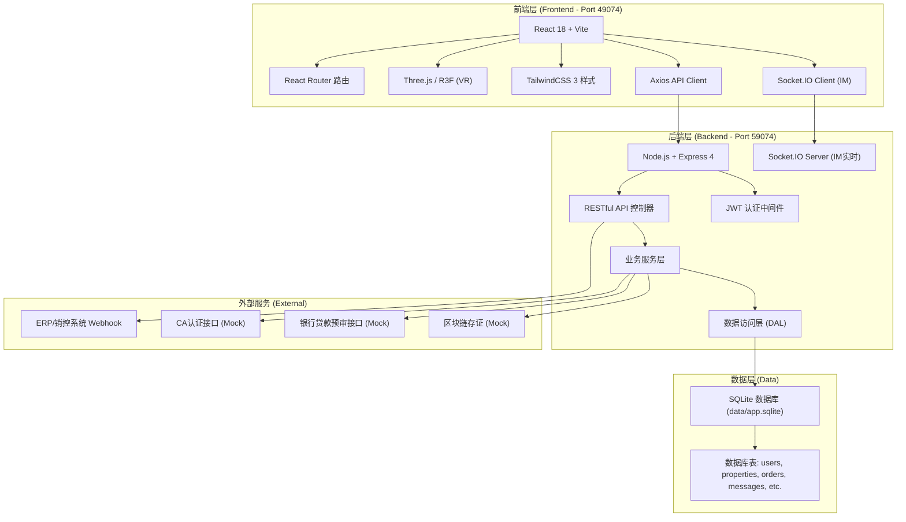
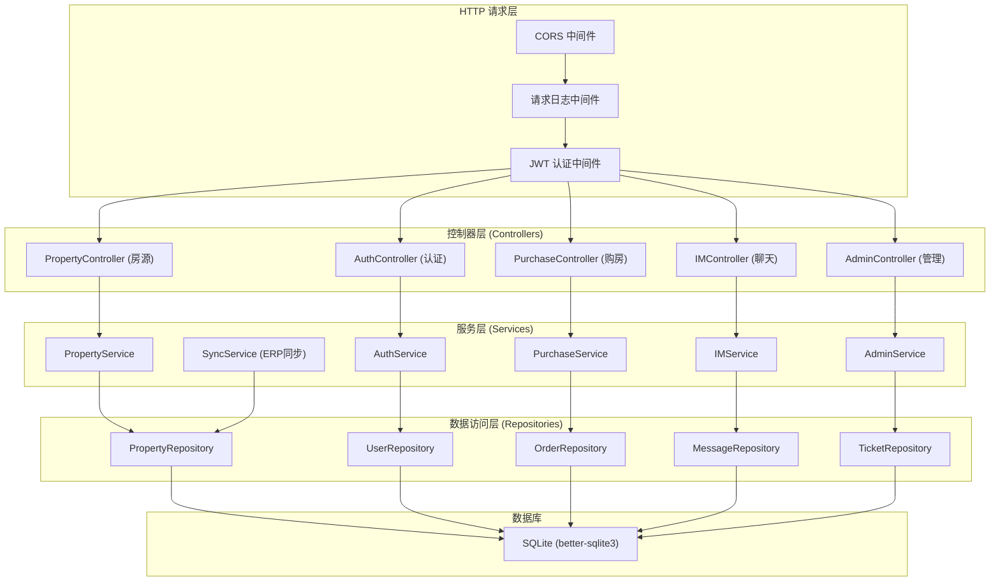
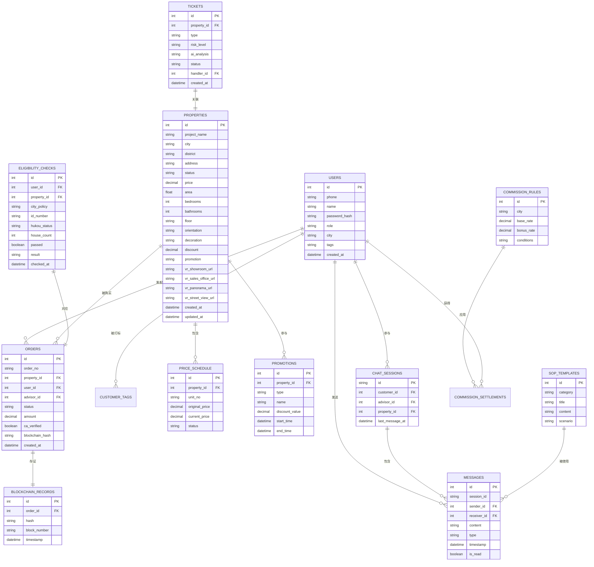

## 1. 架构设计



## 2. 技术描述

- **前端**: React@18.2 + react-router-dom@6 + tailwindcss@3.4 + vite@5.2
- **初始化工具**: npm create vite@latest
- **后端**: Node.js + Express@4.19 + better-sqlite3@11 + socket.io@4.7
- **数据库**: SQLite (data/app.sqlite)，使用 better-sqlite3 同步驱动
- **3D/VR**: three@0.165 + @react-three/fiber@8.16 + @react-three/drei@9.108
- **认证**: jsonwebtoken@9.0 + bcryptjs@2.4
- **图表**: recharts@2.12 (管理后台数据看板)
- **实时通信**: socket.io@4.7 (IM系统)

## 3. 路由定义

| 路由路径 | 页面名称 | 权限要求 |
|---------|----------|----------|
| / | 房源大厅首页 | 公开 |
| /properties | 房源列表页 | 公开 |
| /properties/:id | 房源详情页 | 公开 |
| /vr/:id | VR浏览页 | 公开/登录 |
| /im | IM咨询中心 | 登录用户 |
| /purchase/flow/:propertyId | 购房流程页 | 登录用户 |
| /purchase/eligibility | 限购资格核验 | 登录用户 |
| /purchase/subscribe | 电子认购 | 登录用户 |
| /purchase/sign | 线上签约 | 登录用户 |
| /purchase/loan | 贷款预审 | 登录用户 |
| /admin | 管理后台首页 | 管理员 |
| /admin/properties | 楼盘配置 | 管理员 |
| /admin/dashboard | 销售看板 | 管理员 |
| /admin/tickets | 工单处理 | 管理员 |
| /admin/commission | 分佣管理 | 管理员 |
| /login | 登录页 | 公开 |
| /register | 注册页 | 公开 |

## 4. API 定义

```typescript
// 通用响应结构
interface ApiResponse<T> {
  code: number;
  message: string;
  data: T;
}

// 房源相关
interface Property {
  id: number;
  projectName: string;
  city: string;
  district: string;
  address: string;
  status: 'available' | 'locked' | 'sold' | 'offline';
  price: number;
  area: number;
  bedrooms: number;
  bathrooms: number;
  floor: string;
  orientation: string;
  decoration: string;
  discount: number;
  promotion: string;
  vrShowroomUrl: string;
  vrSalesOfficeUrl: string;
  vrPanoramaUrl: string;
  vrStreetViewUrl: string;
  createdAt: string;
  updatedAt: string;
}

// 用户相关
interface User {
  id: number;
  phone: string;
  name: string;
  role: 'customer' | 'agent' | 'advisor' | 'admin';
  city: string;
  tags: string[];
  createdAt: string;
}

// IM消息
interface ChatMessage {
  id: number;
  sessionId: string;
  senderId: number;
  receiverId: number;
  content: string;
  type: 'text' | 'image' | 'file' | 'sop';
  timestamp: string;
  isRead: boolean;
}

// 购房订单
interface PurchaseOrder {
  id: number;
  orderNo: string;
  propertyId: number;
  userId: number;
  advisorId: number;
  status: 'eligibility_pending' | 'eligibility_pass' | 'subscribed' | 'signed' | 'fund_supervised' | 'loan_pending' | 'completed';
  amount: number;
  caVerified: boolean;
  blockchainHash: string;
  createdAt: string;
}

// API Endpoints
// GET    /api/health                           健康检查
// GET    /api/properties                       房源列表
// GET    /api/properties/:id                   房源详情
// GET    /api/properties/:id/price             一房一价表
// POST   /api/auth/login                       登录
// POST   /api/auth/register                    注册
// GET    /api/user/profile                     用户信息
// POST   /api/purchase/eligibility-check       限购资格核验
// POST   /api/purchase/subscribe               发起电子认购
// POST   /api/purchase/sign                    线上签约
// POST   /api/purchase/loan-preapproval        贷款预审
// GET    /api/admin/dashboard/stats            销售看板数据
// GET    /api/admin/tickets                    工单列表
// POST   /api/admin/tickets/:id/process        处理工单
// GET    /api/im/sessions                      会话列表
// GET    /api/im/messages/:sessionId           消息列表
// POST   /api/im/send                          发送消息
// GET    /api/im/sop-templates                 SOP话术库
```

## 5. 服务器架构图



## 6. 数据模型

### 6.1 数据模型定义



### 6.2 数据定义语言 (DDL)

```sql
-- 用户表
CREATE TABLE IF NOT EXISTS users (
    id INTEGER PRIMARY KEY AUTOINCREMENT,
    phone VARCHAR(20) UNIQUE NOT NULL,
    name VARCHAR(50),
    password_hash VARCHAR(255) NOT NULL,
    role VARCHAR(20) NOT NULL DEFAULT 'customer',
    city VARCHAR(50),
    tags TEXT,
    created_at DATETIME DEFAULT CURRENT_TIMESTAMP
);

-- 房源表
CREATE TABLE IF NOT EXISTS properties (
    id INTEGER PRIMARY KEY AUTOINCREMENT,
    project_name VARCHAR(100) NOT NULL,
    city VARCHAR(50) NOT NULL,
    district VARCHAR(50) NOT NULL,
    address VARCHAR(255) NOT NULL,
    status VARCHAR(20) NOT NULL DEFAULT 'available',
    price DECIMAL(15,2) NOT NULL,
    area FLOAT NOT NULL,
    bedrooms INTEGER NOT NULL,
    bathrooms INTEGER NOT NULL,
    floor VARCHAR(20),
    orientation VARCHAR(20),
    decoration VARCHAR(50),
    discount DECIMAL(5,2) DEFAULT 100,
    promotion TEXT,
    vr_showroom_url TEXT,
    vr_sales_office_url TEXT,
    vr_panorama_url TEXT,
    vr_street_view_url TEXT,
    created_at DATETIME DEFAULT CURRENT_TIMESTAMP,
    updated_at DATETIME DEFAULT CURRENT_TIMESTAMP
);

-- 一房一价表
CREATE TABLE IF NOT EXISTS price_schedule (
    id INTEGER PRIMARY KEY AUTOINCREMENT,
    property_id INTEGER NOT NULL,
    unit_no VARCHAR(20) NOT NULL,
    original_price DECIMAL(15,2) NOT NULL,
    current_price DECIMAL(15,2) NOT NULL,
    status VARCHAR(20) DEFAULT 'available',
    FOREIGN KEY (property_id) REFERENCES properties(id)
);

-- 订单表
CREATE TABLE IF NOT EXISTS orders (
    id INTEGER PRIMARY KEY AUTOINCREMENT,
    order_no VARCHAR(50) UNIQUE NOT NULL,
    property_id INTEGER NOT NULL,
    user_id INTEGER NOT NULL,
    advisor_id INTEGER,
    status VARCHAR(30) NOT NULL DEFAULT 'eligibility_pending',
    amount DECIMAL(15,2) NOT NULL,
    ca_verified BOOLEAN DEFAULT 0,
    blockchain_hash VARCHAR(255),
    created_at DATETIME DEFAULT CURRENT_TIMESTAMP,
    FOREIGN KEY (property_id) REFERENCES properties(id),
    FOREIGN KEY (user_id) REFERENCES users(id)
);

-- 聊天会话表
CREATE TABLE IF NOT EXISTS chat_sessions (
    id VARCHAR(50) PRIMARY KEY,
    customer_id INTEGER NOT NULL,
    advisor_id INTEGER NOT NULL,
    property_id INTEGER,
    last_message_at DATETIME DEFAULT CURRENT_TIMESTAMP,
    FOREIGN KEY (customer_id) REFERENCES users(id),
    FOREIGN KEY (advisor_id) REFERENCES users(id)
);

-- 消息表
CREATE TABLE IF NOT EXISTS messages (
    id INTEGER PRIMARY KEY AUTOINCREMENT,
    session_id VARCHAR(50) NOT NULL,
    sender_id INTEGER NOT NULL,
    receiver_id INTEGER NOT NULL,
    content TEXT NOT NULL,
    type VARCHAR(20) DEFAULT 'text',
    timestamp DATETIME DEFAULT CURRENT_TIMESTAMP,
    is_read BOOLEAN DEFAULT 0,
    FOREIGN KEY (session_id) REFERENCES chat_sessions(id)
);

-- SOP话术表
CREATE TABLE IF NOT EXISTS sop_templates (
    id INTEGER PRIMARY KEY AUTOINCREMENT,
    category VARCHAR(50) NOT NULL,
    title VARCHAR(100) NOT NULL,
    content TEXT NOT NULL,
    scenario VARCHAR(50)
);

-- 工单打
CREATE TABLE IF NOT EXISTS tickets (
    id INTEGER PRIMARY KEY AUTOINCREMENT,
    property_id INTEGER NOT NULL,
    type VARCHAR(50) NOT NULL,
    risk_level VARCHAR(20),
    ai_analysis TEXT,
    status VARCHAR(20) DEFAULT 'pending',
    handler_id INTEGER,
    created_at DATETIME DEFAULT CURRENT_TIMESTAMP,
    FOREIGN KEY (property_id) REFERENCES properties(id)
);

-- 分佣规则表
CREATE TABLE IF NOT EXISTS commission_rules (
    id INTEGER PRIMARY KEY AUTOINCREMENT,
    city VARCHAR(50) NOT NULL,
    base_rate DECIMAL(5,4) NOT NULL,
    bonus_rate DECIMAL(5,4) DEFAULT 0,
    conditions TEXT
);

-- 区块链存证表
CREATE TABLE IF NOT EXISTS blockchain_records (
    id INTEGER PRIMARY KEY AUTOINCREMENT,
    order_id INTEGER NOT NULL,
    hash VARCHAR(255) NOT NULL,
    block_number VARCHAR(50),
    timestamp DATETIME DEFAULT CURRENT_TIMESTAMP,
    FOREIGN KEY (order_id) REFERENCES orders(id)
);

-- 资格核验表
CREATE TABLE IF NOT EXISTS eligibility_checks (
    id INTEGER PRIMARY KEY AUTOINCREMENT,
    user_id INTEGER NOT NULL,
    property_id INTEGER NOT NULL,
    city_policy TEXT,
    id_number VARCHAR(50),
    hukou_status VARCHAR(50),
    house_count INTEGER DEFAULT 0,
    passed BOOLEAN,
    result TEXT,
    checked_at DATETIME DEFAULT CURRENT_TIMESTAMP,
    FOREIGN KEY (user_id) REFERENCES users(id),
    FOREIGN KEY (property_id) REFERENCES properties(id)
);

-- 优惠活动表
CREATE TABLE IF NOT EXISTS promotions (
    id INTEGER PRIMARY KEY AUTOINCREMENT,
    property_id INTEGER,
    type VARCHAR(50) NOT NULL,
    name VARCHAR(100) NOT NULL,
    discount_value DECIMAL(15,2) NOT NULL,
    start_time DATETIME,
    end_time DATETIME,
    FOREIGN KEY (property_id) REFERENCES properties(id)
);

-- 索引
CREATE INDEX IF NOT EXISTS idx_properties_city ON properties(city);
CREATE INDEX IF NOT EXISTS idx_properties_status ON properties(status);
CREATE INDEX IF NOT EXISTS idx_orders_user ON orders(user_id);
CREATE INDEX IF NOT EXISTS idx_orders_status ON orders(status);
CREATE INDEX IF NOT EXISTS idx_messages_session ON messages(session_id);
CREATE INDEX IF NOT EXISTS idx_tickets_status ON tickets(status);
```
