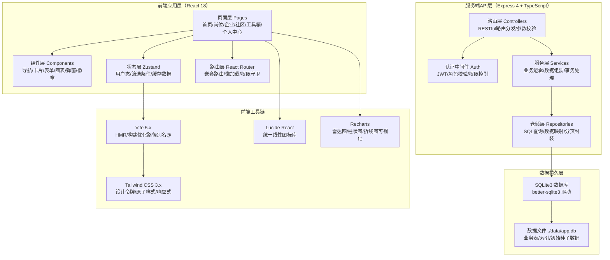
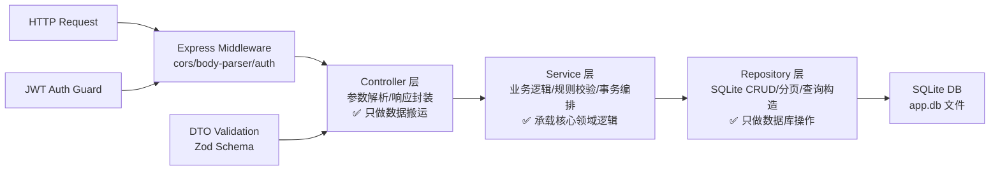
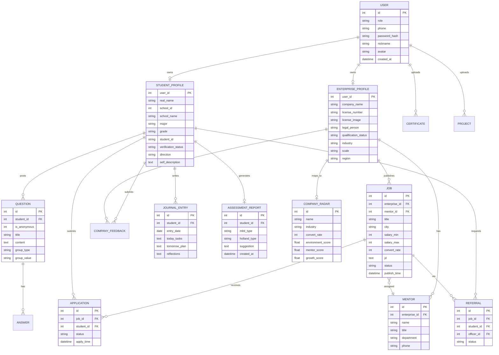

## 1. 架构设计

整体采用 **React + Express + SQLite** 的全栈轻量架构。前端负责UI交互与数据可视化，后端提供RESTful API与业务逻辑，SQLite存储全部业务数据，Mock数据初始化满足前端演示需要。



## 2. 技术说明

| 类别 | 选型 | 理由 |
|------|------|------|
| 前端框架 | React 18 + TypeScript | 组件化开发、类型安全、生态成熟 |
| 构建工具 | Vite 5.x | 极速冷启动、HMR流畅、原生ESM支持 |
| 样式方案 | Tailwind CSS 3.4.x | 原子化样式、设计令牌一致性、零配置 |
| 路由管理 | React Router Dom 6.x | 嵌套路由、守卫、数据加载API |
| 状态管理 | Zustand 4.x | 极简API、轻量、中间件支持、与React配合自然 |
| UI图标 | Lucide React 0.400.x | 统一线性风格、按需打包、TS类型友好 |
| 数据可视化 | Recharts 2.x | 原生React封装、雷达图/柱图/饼图丰富、可定制性强 |
| HTTP客户端 | Axios 1.x | 拦截器、请求取消、TS类型、文件上传支持 |
| 后端框架 | Express 4.x + TypeScript | 轻量灵活、中间件丰富、TS生态成熟 |
| 数据库 | SQLite3 + better-sqlite3 | 零部署、单文件便携、同步API高性能、MVP首选 |
| 认证方案 | JWT (jsonwebtoken) | 无状态、可携带角色信息、前后端分离友好 |
| 密码加密 | bcryptjs | 密码安全哈希、无需本地编译 |
| 文件处理 | multer | 图片/PDF上传、本地存储、MIME校验 |
| 数据校验 | zod 3.x | TS优先、运行时校验、错误信息友好 |

**初始化工具：** `vite-init` 脚手架，模板选择 `react-express-ts`（React前端+Express后端+TypeScript全栈）

## 3. 路由定义

### 3.1 前端路由（React Router）

| 路由路径 | 页面组件 | 权限 | 说明 |
|----------|----------|------|------|
| `/` | HomePage | 公开 | 首页信息聚合入口 |
| `/jobs` | JobListPage | 公开 | 实习岗位广场列表 |
| `/jobs/:id` | JobDetailPage | 登录 | 岗位详情+投递 |
| `/company/:id` | CompanyDetailPage | 公开 | 公司雷达详情页 |
| `/radar` | RadarPage | 公开 | 公司雷达列表搜索 |
| `/community` | CommunityPage | 登录 | 萌新互助社区广场 |
| `/community/:id` | QuestionDetailPage | 登录 | 问答详情页 |
| `/referral` | ReferralPage | 登录（学生） | 内推中心列表 |
| `/referral/:id` | ReferralDetailPage | 登录（学生） | 内推详情+进度 |
| `/tools` | ToolsHomePage | 登录 | 工具箱首页入口 |
| `/tools/resume` | ResumeToolPage | 登录 | AI简历优化 |
| `/tools/journal` | JournalToolPage | 登录 | 实习日志打卡 |
| `/tools/assessment` | AssessmentPage | 登录 | 职业性格测评 |
| `/student/profile` | StudentProfilePage | 登录（学生） | 实习档案+学籍验证 |
| `/enterprise/dashboard` | EnterpriseDashboard | 登录（企业） | 企业中心工作台 |
| `/enterprise/publish` | JobPublishPage | 登录（企业） | 岗位发布编辑 |
| `/enterprise/qualification` | QualificationPage | 登录（企业） | 资质认证+带教人 |
| `/me` | MePage | 登录 | 个人中心总览 |
| `/me/applications` | ApplicationsPage | 登录 | 投递记录时间轴 |
| `/login` | LoginPage | 公开 | 登录+角色选择 |
| `/register` | RegisterPage | 公开 | 注册+引导流程 |
| `/403` | ForbiddenPage | 公开 | 权限不足页 |
| `*` | NotFoundPage | 公开 | 404页 |

### 3.2 后端API路由（Express）

| 方法 | 路径 | 所属模块 | 说明 |
|------|------|----------|------|
| POST | `/api/auth/login` | auth | 登录签发JWT |
| POST | `/api/auth/register` | auth | 用户注册（含角色） |
| POST | `/api/auth/student/verify` | student | 学籍验证提交 |
| GET | `/api/student/profile` | student | 获取学生档案 |
| PUT | `/api/student/profile` | student | 更新实习档案 |
| POST | `/api/student/certificates` | student | 上传技能证书 |
| POST | `/api/student/projects` | student | 新增实训项目 |
| POST | `/api/enterprise/qualification` | enterprise | 营业执照上传+审核 |
| GET | `/api/enterprise/dashboard` | enterprise | 企业工作台统计 |
| POST | `/api/enterprise/mentors` | enterprise | 新增岗位带教人 |
| GET | `/api/jobs` | jobs | 岗位列表+筛选 |
| GET | `/api/jobs/:id` | jobs | 岗位详情+资质 |
| POST | `/api/jobs` | jobs（企业） | 发布岗位 |
| POST | `/api/jobs/:id/apply` | jobs（学生） | 投递申请 |
| POST | `/api/jobs/:id/refer` | jobs（学生） | 申请内推 |
| GET | `/api/applications` | applications | 投递记录（学生） |
| GET | `/api/applications/:id/progress` | applications | 进度节点详情 |
| GET | `/api/referrals` | referral | 内推列表+分配状态 |
| GET | `/api/referrals/:id/timeline` | referral | 内推进度时间轴 |
| GET | `/api/companies` | companies | 公司雷达列表 |
| GET | `/api/companies/:id` | companies | 公司详情+评分 |
| POST | `/api/companies/:id/feedback` | companies | 学生匿名评价 |
| GET | `/api/community/questions` | community | 问答列表+分群 |
| POST | `/api/community/questions` | community | 发布提问 |
| POST | `/api/community/questions/:id/answers` | community | 学长回答 |
| POST | `/api/tools/resume/optimize` | tools | AI简历优化Mock接口 |
| GET | `/api/tools/journal` | tools | 实习日志列表 |
| POST | `/api/tools/journal` | tools | 日志打卡提交 |
| POST | `/api/tools/assessment/submit` | tools | 测评提交+报告生成 |
| GET | `/api/tools/assessment/:id/report` | tools | 获取测评报告 |
| GET | `/api/upload/:filename` | upload | 静态文件访问 |

## 4. API数据类型定义

```typescript
// 共享类型定义（前端/后端通用）
export interface User {
  id: number;
  role: 'student' | 'enterprise' | 'officer' | 'admin';
  phone: string;
  nickname?: string;
  avatar?: string;
  createdAt: string;
}

export interface StudentProfile {
  userId: number;
  realName: string;
  schoolId: number;
  schoolName: string;
  major: string;
  educationLevel: 'junior_college' | 'vocational';
  grade: string;
  studentId: string;
  verificationStatus: 'pending' | 'verified' | 'rejected';
  direction: string;
  certificates: Certificate[];
  projects: Project[];
  selfDescription: string;
}

export interface EnterpriseProfile {
  userId: number;
  companyName: string;
  licenseNumber: string;
  licenseImage: string;
  legalPerson: string;
  qualificationStatus: 'pending' | 'verified' | 'rejected';
  industry: string;
  scale: string;
  region: string;
  mentors: Mentor[];
  agreementTemplate?: string;
}

export interface Mentor {
  id: number;
  enterpriseId: number;
  name: string;
  title: string;
  department: string;
  phone: string;
  avatar?: string;
}

export interface Job {
  id: number;
  enterpriseId: number;
  title: string;
  department: string;
  city: string;
  salaryMin: number;
  salaryMax: number;
  period: string;
  convertRate: number;
  workType: 'onsite' | 'hybrid' | 'remote';
  jd: string;
  benefits: string[];
  mentorId: number;
  agreementTemplateId: number;
  status: 'recruiting' | 'closed' | 'paused';
  publishTime: string;
}

export interface Question {
  id: number;
  studentId: number;
  isAnonymous: boolean;
  title: string;
  content: string;
  tags: string[];
  groupType: 'school' | 'major' | 'city';
  groupValue: string;
  viewCount: number;
  answerCount: number;
  createdAt: string;
}

export interface Answer {
  id: number;
  questionId: number;
  seniorId: number;
  seniorName: string;
  seniorVerify: string;
  content: string;
  isAdopted: boolean;
  likeCount: number;
  createdAt: string;
}

export interface CompanyRadar {
  id: number;
  name: string;
  industry: string;
  avgSalaryMin: number;
  avgSalaryMax: number;
  convertRate: number;
  environmentScore: number;
  mentorScore: number;
  workloadScore: number;
  growthScore: number;
  feedbackCount: number;
}

export interface JournalEntry {
  id: number;
  studentId: number;
  date: string;
  todayTasks: string;
  tomorrowPlan: string;
  reflections: string;
  mood: 'great' | 'good' | 'normal' | 'hard';
}

export interface AssessmentReport {
  id: number;
  studentId: number;
  mbtiType: string;
  mbtiDescription: string;
  hollandType: string;
  hollandScores: Record<string, number>;
  matchedJobs: string[];
  suggestions: string;
  createdAt: string;
}
```

## 5. 服务端分层架构



**分层职责：**
- **Controller**：`/api/controllers/*`，1个领域对应1个controller，接收请求、参数校验、调用service、返回JSON
- **Service**：`/api/services/*`，纯业务逻辑，可组合调用多个repository，事务边界在此层
- **Repository**：`/api/repositories/*`，better-sqlite3同步操作封装，按表划分，纯SQL查询

## 6. 数据模型

### 6.1 ER关系图



### 6.2 DDL 与种子数据

```sql
-- 用户表
CREATE TABLE IF NOT EXISTS users (
  id INTEGER PRIMARY KEY AUTOINCREMENT,
  role TEXT NOT NULL CHECK(role IN ('student','enterprise','officer','admin')),
  phone TEXT UNIQUE NOT NULL,
  password_hash TEXT NOT NULL,
  nickname TEXT,
  avatar TEXT,
  created_at DATETIME DEFAULT CURRENT_TIMESTAMP
);
CREATE INDEX IF NOT EXISTS idx_users_role ON users(role);

-- 学生档案
CREATE TABLE IF NOT EXISTS student_profiles (
  user_id INTEGER PRIMARY KEY REFERENCES users(id),
  real_name TEXT NOT NULL,
  school_id INTEGER,
  school_name TEXT NOT NULL,
  major TEXT NOT NULL,
  grade TEXT NOT NULL,
  student_id TEXT,
  verification_status TEXT DEFAULT 'pending' CHECK(verification_status IN ('pending','verified','rejected')),
  direction TEXT,
  self_description TEXT
);

-- 企业档案
CREATE TABLE IF NOT EXISTS enterprise_profiles (
  user_id INTEGER PRIMARY KEY REFERENCES users(id),
  company_name TEXT NOT NULL,
  license_number TEXT,
  license_image TEXT,
  legal_person TEXT,
  qualification_status TEXT DEFAULT 'pending' CHECK(qualification_status IN ('pending','verified','rejected')),
  industry TEXT,
  scale TEXT,
  region TEXT
);

-- 岗位带教人
CREATE TABLE IF NOT EXISTS mentors (
  id INTEGER PRIMARY KEY AUTOINCREMENT,
  enterprise_id INTEGER NOT NULL REFERENCES enterprise_profiles(user_id),
  name TEXT NOT NULL,
  title TEXT NOT NULL,
  department TEXT,
  phone TEXT
);

-- 实习岗位
CREATE TABLE IF NOT EXISTS jobs (
  id INTEGER PRIMARY KEY AUTOINCREMENT,
  enterprise_id INTEGER NOT NULL REFERENCES enterprise_profiles(user_id),
  mentor_id INTEGER REFERENCES mentors(id),
  title TEXT NOT NULL,
  department TEXT,
  city TEXT,
  salary_min INTEGER,
  salary_max INTEGER,
  period TEXT,
  convert_rate INTEGER DEFAULT 0,
  work_type TEXT DEFAULT 'onsite',
  jd TEXT,
  benefits TEXT,
  agreement_template_id INTEGER,
  status TEXT DEFAULT 'recruiting',
  publish_time DATETIME DEFAULT CURRENT_TIMESTAMP
);
CREATE INDEX IF NOT EXISTS idx_jobs_city ON jobs(city);
CREATE INDEX IF NOT EXISTS idx_jobs_enterprise ON jobs(enterprise_id);

-- 投递申请
CREATE TABLE IF NOT EXISTS applications (
  id INTEGER PRIMARY KEY AUTOINCREMENT,
  job_id INTEGER NOT NULL REFERENCES jobs(id),
  student_id INTEGER NOT NULL REFERENCES student_profiles(user_id),
  status TEXT DEFAULT 'pending',
  progress_note TEXT,
  apply_time DATETIME DEFAULT CURRENT_TIMESTAMP
);

-- 内推记录
CREATE TABLE IF NOT EXISTS referrals (
  id INTEGER PRIMARY KEY AUTOINCREMENT,
  job_id INTEGER NOT NULL REFERENCES jobs(id),
  student_id INTEGER NOT NULL REFERENCES student_profiles(user_id),
  officer_id INTEGER,
  status TEXT DEFAULT 'pending',
  step INTEGER DEFAULT 0,
  created_at DATETIME DEFAULT CURRENT_TIMESTAMP
);

-- 社区问答
CREATE TABLE IF NOT EXISTS questions (
  id INTEGER PRIMARY KEY AUTOINCREMENT,
  student_id INTEGER NOT NULL REFERENCES student_profiles(user_id),
  is_anonymous INTEGER DEFAULT 0,
  title TEXT NOT NULL,
  content TEXT,
  tags TEXT,
  group_type TEXT DEFAULT 'major',
  group_value TEXT,
  view_count INTEGER DEFAULT 0,
  answer_count INTEGER DEFAULT 0,
  created_at DATETIME DEFAULT CURRENT_TIMESTAMP
);

-- 回答
CREATE TABLE IF NOT EXISTS answers (
  id INTEGER PRIMARY KEY AUTOINCREMENT,
  question_id INTEGER NOT NULL REFERENCES questions(id),
  senior_id INTEGER NOT NULL REFERENCES users(id),
  senior_verify TEXT,
  content TEXT,
  is_adopted INTEGER DEFAULT 0,
  like_count INTEGER DEFAULT 0,
  created_at DATETIME DEFAULT CURRENT_TIMESTAMP
);

-- 公司雷达
CREATE TABLE IF NOT EXISTS company_radars (
  id INTEGER PRIMARY KEY AUTOINCREMENT,
  enterprise_id INTEGER UNIQUE REFERENCES enterprise_profiles(user_id),
  name TEXT NOT NULL,
  industry TEXT,
  avg_salary_min INTEGER,
  avg_salary_max INTEGER,
  convert_rate INTEGER DEFAULT 0,
  environment_score REAL DEFAULT 3.0,
  mentor_score REAL DEFAULT 3.0,
  workload_score REAL DEFAULT 3.0,
  growth_score REAL DEFAULT 3.0,
  feedback_count INTEGER DEFAULT 0
);

-- 实习日志
CREATE TABLE IF NOT EXISTS journal_entries (
  id INTEGER PRIMARY KEY AUTOINCREMENT,
  student_id INTEGER NOT NULL REFERENCES student_profiles(user_id),
  entry_date DATE NOT NULL,
  today_tasks TEXT,
  tomorrow_plan TEXT,
  reflections TEXT,
  mood TEXT DEFAULT 'normal',
  UNIQUE(student_id, entry_date)
);

-- 职业测评报告
CREATE TABLE IF NOT EXISTS assessment_reports (
  id INTEGER PRIMARY KEY AUTOINCREMENT,
  student_id INTEGER NOT NULL REFERENCES student_profiles(user_id),
  mbti_type TEXT,
  mbti_description TEXT,
  holland_type TEXT,
  holland_scores TEXT,
  matched_jobs TEXT,
  suggestions TEXT,
  created_at DATETIME DEFAULT CURRENT_TIMESTAMP
);

-- 种子数据
INSERT OR IGNORE INTO users (id, role, phone, password_hash, nickname) VALUES
(1, 'admin', '13800000000', '$2a$10$Xl0yhvzLIaJCDdKBS0Lld.ksK7c2ZOLYo05JtBCWc8MlGk2n6XjOW', '平台管理员'),
(2, 'student', '13900000001', '$2a$10$Xl0yhvzLIaJCDdKBS0Lld.ksK7c2ZOLYo05JtBCWc8MlGk2n6XjOW', '张小橙'),
(3, 'enterprise', '13900000002', '$2a$10$Xl0yhvzLIaJCDdKBS0Lld.ksK7c2ZOLYo05JtBCWc8MlGk2n6XjOW', 'HR李小姐');
```
