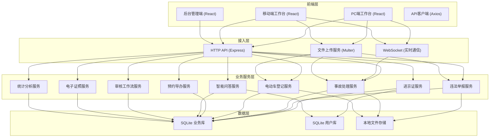
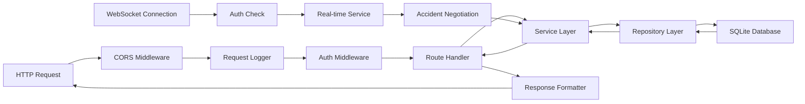

## 1. 总体架构设计



## 2. 技术选型说明

| 层级 | 技术栈 | 版本 | 选型理由 |
|------|--------|------|----------|
| 前端框架 | React | 18.x | 组件化开发，生态成熟，支持PC/移动端复用 |
| 前端构建 | Vite | 5.x | 极速热更新，开发体验好，严格端口配置支持 |
| 前端语言 | TypeScript | 5.x | 类型安全，减少运行时错误 |
| 前端路由 | React Router | 6.x | 声明式路由，支持嵌套路由与懒加载 |
| 状态管理 | Zustand | 4.x | 轻量高效，API简洁，避免Redux复杂度 |
| UI组件库 | Ant Design | 5.x | 企业级组件，PC端成熟稳定 |
| 移动端UI | Ant Design Mobile | 5.x | 移动端专用组件，适配触屏操作 |
| HTTP客户端 | Axios | 1.x | 拦截器支持，统一错误处理 |
| 后端框架 | Express | 4.x | 轻量灵活，中间件生态丰富 |
| 后端语言 | TypeScript | 5.x | 前后端语言统一，类型共享 |
| 数据库 | SQLite | 3.x | 零配置，文件存储，快速打通业务链路 |
| ORM | better-sqlite3 | 11.x | 同步API，性能优异，类型支持好 |
| 文件上传 | Multer | 1.4.x | Express生态标准上传中间件 |
| WebSocket | ws | 8.x | 轻量高性能，支持事故处理实时通信 |
| 密码加密 | bcryptjs | 2.4.x | 密码安全存储 |
| 认证鉴权 | jsonwebtoken | 9.x | 无状态认证，支持多端 |
| 日期处理 | dayjs | 1.11.x | 轻量，API友好，国际化支持 |
| 图表 | ECharts | 5.x | 功能强大，支持统计看板可视化 |

## 3. 端口配置

- **项目目录**: may-89011
- **tail4**: 9011 (目录名后四位补零)
- **前端端口**: 49011 (40000 + 9011)
- **后端端口**: 59011 (50000 + 9011)
- **备用槽位1**: 前端59011 / 后端69011 (实际：41000+9011=50011 / 51000+9011=60011)
- **备用槽位2**: 前端52011 / 后端62011
- **监听地址**: 127.0.0.1 (仅本地访问)

## 4. 目录结构

```
may-89011/
├── .env                          # 环境变量配置（端口等）
├── frontend.log                  # 前端日志
├── backend.log                   # 后端日志
├── data/
│   └── app.sqlite                # SQLite数据库文件
├── uploads/                      # 上传文件存储
│   ├── evidence/                 # 违法举报证据
│   ├── accident/                 # 事故现场材料
│   └── vehicle/                  # 车辆登记材料
├── frontend/                     # 前端项目
│   ├── package.json
│   ├── vite.config.ts
│   ├── tsconfig.json
│   ├── index.html
│   └── src/
│       ├── main.tsx
│       ├── App.tsx
│       ├── router/
│       ├── store/
│       ├── api/
│       ├── components/
│       ├── pages/
│       │   ├── dashboard/        # 工作台首页
│       │   ├── permit/           # 进京证模块
│       │   ├── violation/        # 违法举报模块
│       │   ├── accident/         # 事故处理模块
│       │   ├── ebike/            # 电动车登记模块
│       │   ├── appointment/      # 预约导办模块
│       │   ├── chatbot/          # 智能问答模块
│       │   └── admin/            # 后台管理模块
│       ├── hooks/
│       ├── utils/
│       └── styles/
└── backend/                      # 后端项目
    ├── package.json
    ├── tsconfig.json
    └── src/
        ├── server.ts             # 服务入口
        ├── app.ts                # Express应用
        ├── config/
        │   ├── env.ts            # 环境配置
        │   └── database.ts       # 数据库配置
        ├── middleware/
        │   ├── auth.ts           # 认证中间件
        │   └── cors.ts           # CORS配置
        ├── routes/
        │   ├── auth.ts           # 认证接口
        │   ├── permit.ts         # 进京证接口
        │   ├── violation.ts      # 违法举报接口
        │   ├── accident.ts       # 事故处理接口
        │   ├── ebike.ts          # 电动车登记接口
        │   ├── appointment.ts    # 预约导办接口
        │   ├── chatbot.ts        # 智能问答接口
        │   ├── workflow.ts       # 审核工作流接口
        │   ├── certificate.ts    # 电子证照接口
        │   └── stats.ts          # 统计分析接口
        ├── services/             # 业务逻辑层
        ├── repositories/         # 数据访问层
        ├── models/               # 数据模型
        ├── types/                # 类型定义
        └── utils/
```

## 5. 前端路由定义

| 路由路径 | 页面名称 | 权限要求 |
|---------|---------|----------|
| / | 工作台首页 | 已登录用户 |
| /login | 登录页 | 公开 |
| /permit | 进京证列表 | 已登录 |
| /permit/apply | 进京证申请 | 已登录 |
| /permit/:id | 进京证详情 | 已登录 |
| /violation | 违法举报列表 | 已登录 |
| /violation/report | 违法举报提交 | 已登录 |
| /violation/:id | 举报详情 | 已登录 |
| /accident | 事故列表 | 已登录 |
| /accident/:id | 事故处理 | 已登录 |
| /ebike | 电动车登记列表 | 已登录 |
| /ebike/register | 电动车登记 | 已登录 |
| /appointment | 预约服务 | 已登录 |
| /chatbot | 智能问答 | 已登录 |
| /admin | 管理后台首页 | 管理员 |
| /admin/workflow | 审核工作台 | 审核员/管理员 |
| /admin/certificate | 证照签发 | 管理员 |
| /admin/monitor | 预警看板 | 管理员 |
| /admin/stats | 效能统计 | 管理员 |

## 6. API接口定义

### 6.1 通用响应结构

```typescript
interface ApiResponse<T = any> {
  code: number;           // 0: 成功, 其他: 错误码
  message: string;        // 提示信息
  data: T;                // 业务数据
  timestamp: number;      // 响应时间戳
}

interface PagedResponse<T> {
  list: T[];
  total: number;
  page: number;
  pageSize: number;
}
```

### 6.2 核心接口列表

| 接口路径 | 方法 | 模块 | 描述 |
|---------|------|------|------|
| /api/health | GET | 系统 | 健康检查 |
| /api/auth/login | POST | 认证 | 用户登录 |
| /api/auth/userinfo | GET | 认证 | 获取当前用户信息 |
| /api/permit | GET | 进京证 | 获取进京证列表 |
| /api/permit | POST | 进京证 | 提交进京证申请 |
| /api/permit/:id | GET | 进京证 | 获取进京证详情 |
| /api/permit/:id/renew | POST | 进京证 | 续期申请 |
| /api/permit/:id/verify | GET | 进京证 | 核验二维码 |
| /api/violation | GET | 违法举报 | 获取举报列表 |
| /api/violation | POST | 违法举报 | 提交违法举报 |
| /api/violation/:id | GET | 违法举报 | 获取举报详情 |
| /api/accident | GET | 事故处理 | 获取事故列表 |
| /api/accident | POST | 事故处理 | 创建事故记录 |
| /api/accident/:id/negotiate | WS | 事故处理 | 三方协商WebSocket |
| /api/accident/:id/liability | POST | 事故处理 | 生成责任认定书 |
| /api/ebike | GET | 电动车登记 | 获取登记列表 |
| /api/ebike | POST | 电动车登记 | 提交登记申请 |
| /api/ebike/:id/license | GET | 电动车登记 | 获取电子行驶证 |
| /api/appointment/windows | GET | 预约导办 | 获取窗口列表 |
| /api/appointment/slots | GET | 预约导办 | 获取可预约时段 |
| /api/appointment | POST | 预约导办 | 提交预约 |
| /api/appointment/queue | GET | 预约导办 | 获取叫号状态 |
| /api/chatbot/ask | POST | 智能问答 | 提问 |
| /api/chatbot/query-archive | POST | 智能问答 | 档案查询 |
| /api/workflow/todos | GET | 工作流 | 获取待办审核 |
| /api/workflow/:id/audit | POST | 工作流 | 审核操作 |
| /api/certificate/issue | POST | 证照中心 | 签发电子证照 |
| /api/certificate/verify | POST | 证照中心 | 证照验真 |
| /api/stats/monthly | GET | 统计 | 月度服务统计 |
| /api/stats/efficiency | GET | 统计 | 办理时效分析 |
| /api/monitor/abnormal | GET | 监控 | 异常订单列表 |
| /api/upload | POST | 通用 | 文件上传 |

## 7. 后端服务架构



## 8. 数据模型

### 8.1 ER图

```mermaid
erDiagram
    USER ||--o{ PERMIT_APPLICATION : "申请"
    USER ||--o{ VIOLATION_REPORT : "举报"
    USER ||--o{ ACCIDENT_RECORD : "参与"
    USER ||--o{ EBIKE_REGISTRATION : "登记"
    USER ||--o{ APPOINTMENT : "预约"
    USER ||--o{ WORKFLOW_TASK : "处理"
    USER ||--o{ CERTIFICATE : "持有"
    
    PERMIT_APPLICATION ||--|| WORKFLOW_TASK : "触发"
    VIOLATION_REPORT ||--|| WORKFLOW_TASK : "触发"
    EBIKE_REGISTRATION ||--|| WORKFLOW_TASK : "触发"
    ACCIDENT_RECORD ||--|| CERTIFICATE : "生成"
    PERMIT_APPLICATION ||--|| CERTIFICATE : "生成"
    EBIKE_REGISTRATION ||--|| CERTIFICATE : "生成"
    
    APPOINTMENT ||--|| SERVICE_WINDOW : "使用"
    SERVICE_WINDOW ||--o{ SCHEDULE : "有"
    
    WORKFLOW_TASK ||--o{ AUDIT_RECORD : "包含"
    WORKFLOW_TASK ||--o{ ABNORMAL_ALERT : "触发"

    USER {
        integer id PK
        string id_card_no "身份证号"
        string real_name "真实姓名"
        string phone "手机号"
        string password_hash "密码哈希"
        string role "角色: user/auditor/admin"
        datetime created_at
        datetime updated_at
    }

    PERMIT_APPLICATION {
        integer id PK
        integer user_id FK
        string plate_number "车牌号"
        string vehicle_type "车辆类型"
        date start_date "进京开始日期"
        date end_date "进京结束日期"
        string route "进京路线"
        string status "状态: pending/approved/rejected/expired"
        text reject_reason "驳回原因"
        datetime created_at
        datetime updated_at
    }

    VIOLATION_REPORT {
        integer id PK
        integer user_id FK
        string violation_type "违法类型"
        decimal latitude "纬度"
        decimal longitude "经度"
        string location "位置描述"
        datetime violation_time "违法时间"
        text description "违法描述"
        string evidence_hash "证据哈希"
        string status "状态: pending/valid/invalid"
        datetime created_at
    }

    ACCIDENT_RECORD {
        integer id PK
        string case_no "案件编号"
        datetime accident_time "事故时间"
        string location "事故地点"
        string party_a_id "甲方用户ID"
        string party_b_id "乙方用户ID"
        string office_id "交警ID"
        string liability "责任划分"
        string status "协商中/已认定/已完成"
        datetime created_at
    }

    EBIKE_REGISTRATION {
        integer id PK
        integer user_id FK
        string frame_number "车架号"
        string motor_number "电机号"
        string brand "品牌"
        string model "型号"
        string color "颜色"
        string purchase_date "购买日期"
        string status "待审核/已通过/已驳回"
        datetime created_at
    }

    APPOINTMENT {
        integer id PK
        integer user_id FK
        integer window_id FK
        date appointment_date "预约日期"
        string time_slot "预约时段"
        string business_type "业务类型"
        string queue_number "叫号"
        string status "已预约/已取消/已完成"
        integer rating "评分"
        text comment "评价"
        datetime created_at
    }

    SERVICE_WINDOW {
        integer id PK
        string name "窗口名称"
        string address "地址"
        string district "所属区县"
        string business_types "支持业务类型"
    }

    SCHEDULE {
        integer id PK
        integer window_id FK
        date date "排班日期"
        string time_slots "时段配置JSON"
        integer capacity "每时段容量"
    }

    WORKFLOW_TASK {
        integer id PK
        string business_type "业务类型"
        integer business_id "业务ID"
        string current_stage "当前阶段"
        string status "待处理/处理中/已完成/已驳回"
        integer current_auditor_id "当前审核员"
        datetime created_at
        datetime updated_at
    }

    AUDIT_RECORD {
        integer id PK
        integer task_id FK
        integer auditor_id "审核员ID"
        string action "操作: submit/approve/reject"
        text opinion "审核意见"
        string signature "电子签章"
        datetime created_at
    }

    CERTIFICATE {
        integer id PK
        integer user_id FK
        string cert_type "证照类型"
        string cert_number "证照编号"
        string content "证照内容JSON"
        string signature "签发签章"
        date valid_from "有效期起"
        date valid_to "有效期止"
        string status "有效/已失效/已注销"
        datetime issued_at "签发时间"
    }

    ABNORMAL_ALERT {
        integer id PK
        integer task_id FK
        string alert_type "预警类型"
        string level "严重级别"
        string description "描述"
        string status "待处理/处理中/已忽略"
        datetime created_at
    }

    CHATBOT_SESSION {
        integer id PK
        integer user_id FK
        string session_id "会话ID"
        text history "对话历史JSON"
        datetime created_at
        datetime updated_at
    }

    DRIVER_ARCHIVE {
        integer id PK
        string id_card_no "身份证号"
        string license_number "驾驶证号"
        string license_type "准驾车型"
        date issue_date "初次领证日期"
        integer score "当前记分"
        string status "状态"
    }

    VEHICLE_ARCHIVE {
        integer id PK
        string plate_number "车牌号"
        string id_card_no "所有人身份证"
        string vehicle_type "车辆类型"
        string frame_number "车架号"
        date register_date "注册日期"
        string inspection_status "检验状态"
    }

    EBIKE_ARCHIVE {
        integer id PK
        string plate_number "号牌号码"
        string id_card_no "所有人身份证"
        string frame_number "车架号"
        date register_date "登记日期"
        string status "状态"
    }

    MONTHLY_STATS {
        integer id PK
        string month "统计月份"
        integer permit_count "进京证办理量"
        integer violation_count "违法举报量"
        integer accident_count "事故处理量"
        integer ebike_count "电动车登记量"
        integer appointment_count "预约量"
        decimal avg_process_time "平均办理时长"
        decimal satisfaction_rate "满意度"
    }
```



### 8.2 DDL语句

```sql
-- 用户表
CREATE TABLE IF NOT EXISTS users (
    id INTEGER PRIMARY KEY AUTOINCREMENT,
    id_card_no TEXT UNIQUE NOT NULL,
    real_name TEXT NOT NULL,
    phone TEXT UNIQUE NOT NULL,
    password_hash TEXT NOT NULL,
    role TEXT NOT NULL DEFAULT 'user',
    created_at DATETIME DEFAULT CURRENT_TIMESTAMP,
    updated_at DATETIME DEFAULT CURRENT_TIMESTAMP
);

-- 进京证申请表
CREATE TABLE IF NOT EXISTS permit_applications (
    id INTEGER PRIMARY KEY AUTOINCREMENT,
    user_id INTEGER NOT NULL,
    plate_number TEXT NOT NULL,
    vehicle_type TEXT NOT NULL,
    start_date DATE NOT NULL,
    end_date DATE NOT NULL,
    route TEXT NOT NULL,
    status TEXT NOT NULL DEFAULT 'pending',
    reject_reason TEXT,
    created_at DATETIME DEFAULT CURRENT_TIMESTAMP,
    updated_at DATETIME DEFAULT CURRENT_TIMESTAMP,
    FOREIGN KEY (user_id) REFERENCES users(id)
);

-- 违法举报表
CREATE TABLE IF NOT EXISTS violation_reports (
    id INTEGER PRIMARY KEY AUTOINCREMENT,
    user_id INTEGER NOT NULL,
    violation_type TEXT NOT NULL,
    latitude REAL,
    longitude REAL,
    location TEXT,
    violation_time DATETIME NOT NULL,
    description TEXT,
    evidence_hash TEXT,
    status TEXT NOT NULL DEFAULT 'pending',
    created_at DATETIME DEFAULT CURRENT_TIMESTAMP,
    FOREIGN KEY (user_id) REFERENCES users(id)
);

-- 事故记录表
CREATE TABLE IF NOT EXISTS accident_records (
    id INTEGER PRIMARY KEY AUTOINCREMENT,
    case_no TEXT UNIQUE NOT NULL,
    accident_time DATETIME NOT NULL,
    location TEXT NOT NULL,
    party_a_id INTEGER,
    party_b_id INTEGER,
    officer_id INTEGER,
    liability TEXT,
    status TEXT NOT NULL DEFAULT 'negotiating',
    created_at DATETIME DEFAULT CURRENT_TIMESTAMP,
    FOREIGN KEY (party_a_id) REFERENCES users(id),
    FOREIGN KEY (party_b_id) REFERENCES users(id),
    FOREIGN KEY (officer_id) REFERENCES users(id)
);

-- 电动车登记表
CREATE TABLE IF NOT EXISTS ebike_registrations (
    id INTEGER PRIMARY KEY AUTOINCREMENT,
    user_id INTEGER NOT NULL,
    frame_number TEXT UNIQUE NOT NULL,
    motor_number TEXT NOT NULL,
    brand TEXT NOT NULL,
    model TEXT NOT NULL,
    color TEXT NOT NULL,
    purchase_date DATE NOT NULL,
    status TEXT NOT NULL DEFAULT 'pending',
    created_at DATETIME DEFAULT CURRENT_TIMESTAMP,
    FOREIGN KEY (user_id) REFERENCES users(id)
);

-- 预约表
CREATE TABLE IF NOT EXISTS appointments (
    id INTEGER PRIMARY KEY AUTOINCREMENT,
    user_id INTEGER NOT NULL,
    window_id INTEGER NOT NULL,
    appointment_date DATE NOT NULL,
    time_slot TEXT NOT NULL,
    business_type TEXT NOT NULL,
    queue_number TEXT,
    status TEXT NOT NULL DEFAULT 'booked',
    rating INTEGER,
    comment TEXT,
    created_at DATETIME DEFAULT CURRENT_TIMESTAMP,
    FOREIGN KEY (user_id) REFERENCES users(id),
    FOREIGN KEY (window_id) REFERENCES service_windows(id)
);

-- 服务窗口表
CREATE TABLE IF NOT EXISTS service_windows (
    id INTEGER PRIMARY KEY AUTOINCREMENT,
    name TEXT NOT NULL,
    address TEXT NOT NULL,
    district TEXT NOT NULL,
    business_types TEXT NOT NULL
);

-- 排班表
CREATE TABLE IF NOT EXISTS schedules (
    id INTEGER PRIMARY KEY AUTOINCREMENT,
    window_id INTEGER NOT NULL,
    date DATE NOT NULL,
    time_slots TEXT NOT NULL,
    capacity INTEGER NOT NULL DEFAULT 10,
    FOREIGN KEY (window_id) REFERENCES service_windows(id)
);

-- 工作流任务表
CREATE TABLE IF NOT EXISTS workflow_tasks (
    id INTEGER PRIMARY KEY AUTOINCREMENT,
    business_type TEXT NOT NULL,
    business_id INTEGER NOT NULL,
    current_stage TEXT NOT NULL,
    status TEXT NOT NULL DEFAULT 'pending',
    current_auditor_id INTEGER,
    created_at DATETIME DEFAULT CURRENT_TIMESTAMP,
    updated_at DATETIME DEFAULT CURRENT_TIMESTAMP
);

-- 审核记录表
CREATE TABLE IF NOT EXISTS audit_records (
    id INTEGER PRIMARY KEY AUTOINCREMENT,
    task_id INTEGER NOT NULL,
    auditor_id INTEGER NOT NULL,
    action TEXT NOT NULL,
    opinion TEXT,
    signature TEXT,
    created_at DATETIME DEFAULT CURRENT_TIMESTAMP,
    FOREIGN KEY (task_id) REFERENCES workflow_tasks(id)
);

-- 电子证照表
CREATE TABLE IF NOT EXISTS certificates (
    id INTEGER PRIMARY KEY AUTOINCREMENT,
    user_id INTEGER NOT NULL,
    cert_type TEXT NOT NULL,
    cert_number TEXT UNIQUE NOT NULL,
    content TEXT NOT NULL,
    signature TEXT,
    valid_from DATE NOT NULL,
    valid_to DATE NOT NULL,
    status TEXT NOT NULL DEFAULT 'active',
    issued_at DATETIME DEFAULT CURRENT_TIMESTAMP,
    FOREIGN KEY (user_id) REFERENCES users(id)
);

-- 异常预警表
CREATE TABLE IF NOT EXISTS abnormal_alerts (
    id INTEGER PRIMARY KEY AUTOINCREMENT,
    task_id INTEGER,
    alert_type TEXT NOT NULL,
    level TEXT NOT NULL,
    description TEXT NOT NULL,
    status TEXT NOT NULL DEFAULT 'pending',
    created_at DATETIME DEFAULT CURRENT_TIMESTAMP
);

-- 智能问答会话表
CREATE TABLE IF NOT EXISTS chatbot_sessions (
    id INTEGER PRIMARY KEY AUTOINCREMENT,
    user_id INTEGER NOT NULL,
    session_id TEXT UNIQUE NOT NULL,
    history TEXT,
    created_at DATETIME DEFAULT CURRENT_TIMESTAMP,
    updated_at DATETIME DEFAULT CURRENT_TIMESTAMP
);

-- 驾驶证档案表
CREATE TABLE IF NOT EXISTS driver_archives (
    id INTEGER PRIMARY KEY AUTOINCREMENT,
    id_card_no TEXT UNIQUE NOT NULL,
    license_number TEXT UNIQUE NOT NULL,
    license_type TEXT NOT NULL,
    issue_date DATE NOT NULL,
    score INTEGER NOT NULL DEFAULT 0,
    status TEXT NOT NULL DEFAULT 'normal'
);

-- 机动车档案表
CREATE TABLE IF NOT EXISTS vehicle_archives (
    id INTEGER PRIMARY KEY AUTOINCREMENT,
    plate_number TEXT UNIQUE NOT NULL,
    id_card_no TEXT NOT NULL,
    vehicle_type TEXT NOT NULL,
    frame_number TEXT UNIQUE NOT NULL,
    register_date DATE NOT NULL,
    inspection_status TEXT NOT NULL DEFAULT 'valid'
);

-- 电动车档案表
CREATE TABLE IF NOT EXISTS ebike_archives (
    id INTEGER PRIMARY KEY AUTOINCREMENT,
    plate_number TEXT UNIQUE NOT NULL,
    id_card_no TEXT NOT NULL,
    frame_number TEXT UNIQUE NOT NULL,
    register_date DATE NOT NULL,
    status TEXT NOT NULL DEFAULT 'normal'
);

-- 月度统计表
CREATE TABLE IF NOT EXISTS monthly_stats (
    id INTEGER PRIMARY KEY AUTOINCREMENT,
    month TEXT UNIQUE NOT NULL,
    permit_count INTEGER DEFAULT 0,
    violation_count INTEGER DEFAULT 0,
    accident_count INTEGER DEFAULT 0,
    ebike_count INTEGER DEFAULT 0,
    appointment_count INTEGER DEFAULT 0,
    avg_process_time REAL DEFAULT 0,
    satisfaction_rate REAL DEFAULT 0
);

-- 索引
CREATE INDEX IF NOT EXISTS idx_permit_user ON permit_applications(user_id);
CREATE INDEX IF NOT EXISTS idx_permit_status ON permit_applications(status);
CREATE INDEX IF NOT EXISTS idx_violation_user ON violation_reports(user_id);
CREATE INDEX IF NOT EXISTS idx_violation_status ON violation_reports(status);
CREATE INDEX IF NOT EXISTS idx_accident_party ON accident_records(party_a_id, party_b_id);
CREATE INDEX IF NOT EXISTS idx_ebike_user ON ebike_registrations(user_id);
CREATE INDEX IF NOT EXISTS idx_appointment_user ON appointments(user_id);
CREATE INDEX IF NOT EXISTS idx_appointment_window ON appointments(window_id, appointment_date);
CREATE INDEX IF NOT EXISTS idx_workflow_business ON workflow_tasks(business_type, business_id);
CREATE INDEX IF NOT EXISTS idx_workflow_auditor ON workflow_tasks(current_auditor_id, status);
CREATE INDEX IF NOT EXISTS idx_cert_user ON certificates(user_id);
CREATE INDEX IF NOT EXISTS idx_alert_status ON abnormal_alerts(status);
```

## 9. 核心技术约束

### 9.1 端口约束
- 严格使用 49011 (前端) / 59011 (后端)
- Vite 配置 `strictPort: true`
- 后端显式监听 `127.0.0.1:59011`
- 启动前检查端口占用，占用则使用备用槽位并写回 `.env`

### 9.2 进程隔离
- 只能终止当前项目目录下的进程
- 终止前必须确认 `cwd` 和 `command` 归属
- 禁止使用全局 kill 命令

### 9.3 数据落库
- 所有核心业务操作必须写入 SQLite
- 操作日志、审核记录、电子签章必须留痕
- 文件上传必须存储到本地 `uploads/` 目录并记录元数据

### 9.4 热更新配置
- 前端：Vite HMR，修改页面/样式/逻辑不重启
- 后端：使用 `ts-node-dev` 或 `nodemon` 监听 `src/` 目录变化热重载
- 仅修改 `.env`、启动脚本、依赖时才重启

### 9.5 启动稳定性校验
- 后台启动后等待 5 秒
- `lsof` 确认端口监听
- `ps` 确认进程状态非 `T`/`Z`
- `curl` 确认前端首页返回 200
- `curl` 确认后端健康接口返回正常
