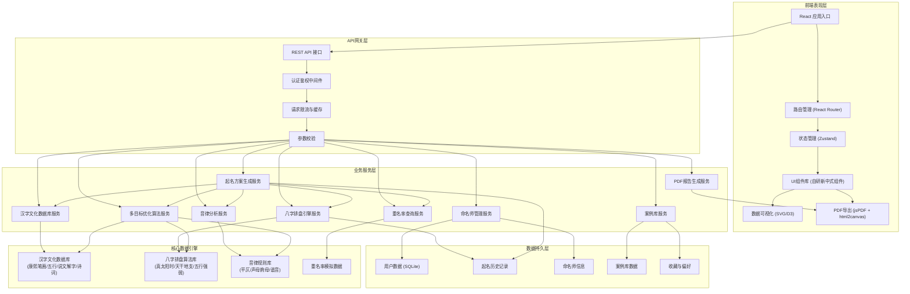
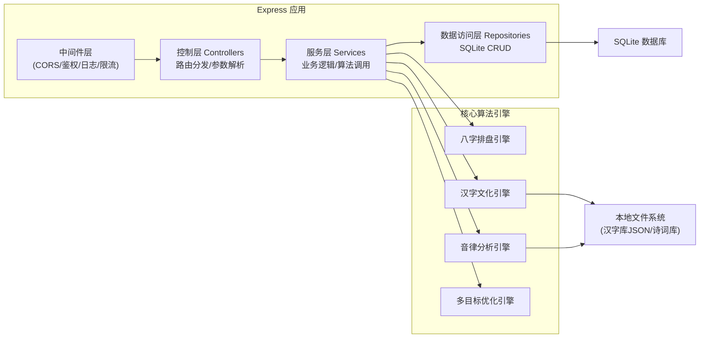
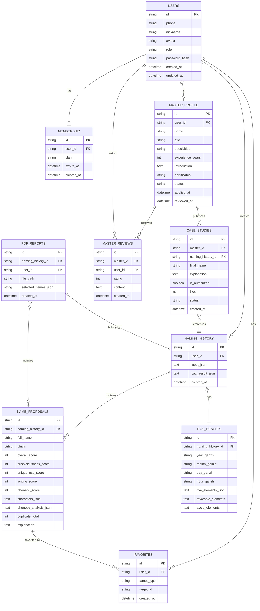

## 1. 架构设计



## 2. 技术说明

- **前端**：React@18 + TypeScript + Vite@5 + TailwindCSS@3 + Zustand@4
- **初始化工具**：Vite React TypeScript 模板
- **后端**：Express@4 + TypeScript
- **数据库**：SQLite3（通过 better-sqlite3 驱动，零配置便于本地运行）
- **核心算法**：自研八字排盘算法、汉字文化匹配引擎、音律分析规则引擎、NSGA-II多目标优化算法变体
- **PDF生成**：jsPDF + html2canvas（前端导出）+ Puppeteer（服务端高质量导出）
- **数据可视化**：原生 SVG + 少量 D3.js 辅助计算
- **HTTP客户端**：Axios
- **Mock策略**：所有外部服务（重名率查询、公安户籍接口）均内置模拟数据，确保项目可独立运行

## 3. 路由定义

| 路由 | 页面/用途 | 权限 |
|------|-----------|------|
| `/` | 首页 - 品牌展示、功能入口 | 公开 |
| `/naming/wizard` | 智能起名向导 | 公开（保存需登录） |
| `/naming/results` | 名字方案列表 | 需登录 |
| `/name/:id` | 名字详情页 | 需登录 |
| `/cases` | 案例库列表 | 公开 |
| `/cases/:id` | 案例详情页 | 公开（完整内容需登录） |
| `/masters` | 命名师广场 | 公开 |
| `/masters/:id` | 命名师个人主页 | 公开 |
| `/user/history` | 用户起名历史 | 需登录 |
| `/user/favorites` | 我的收藏 | 需登录 |
| `/user/membership` | 会员中心 | 需登录 |
| `/user/settings` | 资料设置 | 需登录 |
| `/report/:id` | PDF报告预览页 | 需登录 |
| `/admin/login` | 后台登录页 | 管理员 |
| `/admin/dashboard` | 数据看板 | 管理员 |
| `/admin/users` | 用户管理 | 管理员 |
| `/admin/masters` | 命名师审核/管理 | 管理员 |
| `/admin/cases` | 案例审核 | 管理员 |
| `/admin/settings` | 系统配置 | 管理员 |

## 4. API 接口定义

### 4.1 TypeScript 类型定义

```typescript
// 用户相关
interface User {
  id: string;
  phone: string;
  nickname: string;
  avatar?: string;
  role: 'user' | 'member' | 'master' | 'admin';
  membershipExpireAt?: string;
  createdAt: string;
}

// 起名输入参数
interface NamingInput {
  birthDateTime: string;
  isLunarCalendar: boolean;
  birthPlace: { province: string; city: string; longitude: number; latitude: number };
  surname: string;
  secondSurname?: string;
  generationCharacter?: string;
  gender: 'male' | 'female' | 'neutral';
  fiveElementsPreference: {
    metal: number;
    wood: number;
    water: number;
    fire: number;
    earth: number;
  };
  forbiddenCharacters: string[];
  style: ('classic' | 'modern' | 'poetic' | 'grand' | 'scholarly' | 'agile')[];
  nameLength: 'single' | 'double' | 'both';
}

// 八字排盘结果
interface BaZiResult {
  yearGanZhi: string;
  monthGanZhi: string;
  dayGanZhi: string;
  hourGanZhi: string;
  yearNaYin: string;
  monthNaYin: string;
  dayNaYin: string;
  hourNaYin: string;
  fiveElementsScore: { metal: number; wood: number; water: number; fire: number; earth: number };
  dayMaster: string;
  dayMasterStrength: 'strong' | 'weak' | 'balanced';
  favorableElements: string[];
  avoidElements: string[];
  trueSolarTime: string;
}

// 汉字文化信息
interface CharacterInfo {
  char: string;
  pinyin: string[];
  tone: number[];
  kangxiStrokes: number;
  simplifiedStrokes: number;
  wuXing: 'metal' | 'wood' | 'water' | 'fire' | 'earth';
  shuoWen: string;
  radical: string;
  meanings: string[];
  poetryReferences: PoetryReference[];
  famousNames: string[];
}

// 诗词典故
interface PoetryReference {
  title: string;
  author: string;
  dynasty: string;
  sentence: string;
  translation: string;
  source: string;
}

// 音律分析结果
interface PhoneticAnalysis {
  tones: number[];
  tonePattern: string;
  isHarmonious: boolean;
  initials: string[];
  finals: string[];
  hasBadHomophone: boolean;
  badHomophoneNotes: string[];
  overallScore: number;
}

// 名字评分
interface NameScore {
  overall: number;
  auspiciousness: number;
  uniqueness: number;
  writingEase: number;
  phoneticHarmony: number;
}

// 名字方案
interface NameProposal {
  id: string;
  fullName: string;
  pinyin: string;
  characters: CharacterInfo[];
  meaning: string;
  score: NameScore;
  fiveElementsMatch: number;
  fiveElementsNote: string;
  phoneticAnalysis: PhoneticAnalysis;
  duplicateRate: { total: number; province: number; ageDistribution: Record<string, number> };
  poetryReferences: PoetryReference[];
  tags: string[];
}

// 命名师
interface Master {
  id: string;
  name: string;
  avatar: string;
  title: string;
  specialties: string[];
  experience: number;
  introduction: string;
  certificates: string[];
  caseCount: number;
  rating: number;
  reviewCount: number;
  status: 'pending' | 'approved' | 'rejected' | 'disabled';
}

// 案例
interface CaseStudy {
  id: string;
  name: string;
  babyInfo: { gender: string; birthDate: string };
  inputSummary: string;
  baziSummary: string;
  alternatives: string[];
  finalName: string;
  explanation: string;
  masterId?: string;
  masterName?: string;
  isAuthorized: boolean;
  likes: number;
  createdAt: string;
}

// API 响应基础结构
interface ApiResponse<T> {
  code: number;
  message: string;
  data: T;
}

interface PaginatedResponse<T> {
  items: T[];
  total: number;
  page: number;
  pageSize: number;
}
```

### 4.2 核心API列表

| 方法 | 路径 | 说明 | 请求体 | 响应 |
|------|------|------|--------|------|
| POST | `/api/auth/login` | 用户登录 | `{ phone, code }` | `{ token, user }` |
| POST | `/api/auth/admin-login` | 管理员登录 | `{ username, password }` | `{ token, user }` |
| POST | `/api/naming/analyze-bazi` | 八字排盘分析 | `NamingInput` | `BaZiResult` |
| POST | `/api/naming/generate` | 生成名字方案 | `NamingInput` | `{ proposals: NameProposal[], bazi: BaZiResult }` |
| GET | `/api/naming/results/:id` | 获取起名结果详情 | - | `{ input, bazi, proposals }` |
| GET | `/api/character/:char` | 获取单字文化信息 | - | `CharacterInfo` |
| GET | `/api/name/:id` | 获取名字完整分析 | - | `NameProposal` |
| GET | `/api/name/duplicate-rate/:name` | 查询重名率 | - | `{ total, province, ageDistribution }` |
| GET | `/api/cases` | 获取案例列表 | query: `page, pageSize, filters` | `PaginatedResponse<CaseStudy>` |
| GET | `/api/cases/:id` | 获取案例详情 | - | `CaseStudy` |
| POST | `/api/cases/:id/authorize` | 授权案例公开 | `{ userId }` | `{ success }` |
| GET | `/api/masters` | 获取命名师列表 | query: `page, pageSize, filters` | `PaginatedResponse<Master>` |
| GET | `/api/masters/:id` | 获取命名师详情 | - | `Master` |
| POST | `/api/masters/apply` | 命名师入驻申请 | `{ name, title, specialties, ... }` | `{ id, status }` |
| GET | `/api/user/history` | 用户起名历史 | query: `page, pageSize` | `PaginatedResponse` |
| GET | `/api/user/favorites` | 用户收藏列表 | - | `{ names: NameProposal[], cases: CaseStudy[] }` |
| POST | `/api/user/favorites/name/:id` | 收藏/取消收藏名字 | `{ action: 'add' / 'remove' }` | `{ success }` |
| POST | `/api/report/generate/:namingId` | 生成PDF报告 | `{ selectedNames: string[] }` | `{ reportId, pdfUrl }` |
| GET | `/api/report/download/:id` | 下载PDF报告 | - | PDF文件流 |
| GET | `/api/admin/stats` | 后台统计数据 | - | `{ userCount, namingCount, masterCount, revenue }` |
| GET | `/api/admin/users` | 用户列表 | query: `page, pageSize` | `PaginatedResponse<User>` |
| GET | `/api/admin/masters/pending` | 待审核命名师列表 | - | `Master[]` |
| POST | `/api/admin/masters/:id/review` | 审核命名师 | `{ action: 'approve' / 'reject', note }` | `{ success }` |
| GET | `/api/admin/cases/pending` | 待审核案例 | - | `CaseStudy[]` |
| POST | `/api/admin/cases/:id/review` | 审核案例 | `{ action: 'publish' / 'reject' }` | `{ success }` |

## 5. 后端服务架构图



## 6. 数据模型

### 6.1 ER图



### 6.2 DDL 语句（SQLite）

```sql
-- 用户表
CREATE TABLE users (
    id TEXT PRIMARY KEY,
    phone TEXT UNIQUE NOT NULL,
    nickname TEXT NOT NULL,
    avatar TEXT,
    role TEXT NOT NULL DEFAULT 'user',
    password_hash TEXT,
    created_at TEXT NOT NULL DEFAULT (datetime('now')),
    updated_at TEXT NOT NULL DEFAULT (datetime('now'))
);

CREATE INDEX idx_users_phone ON users(phone);

-- 会员表
CREATE TABLE memberships (
    id TEXT PRIMARY KEY,
    user_id TEXT NOT NULL REFERENCES users(id),
    plan TEXT NOT NULL,
    expire_at TEXT NOT NULL,
    created_at TEXT NOT NULL DEFAULT (datetime('now'))
);

CREATE INDEX idx_memberships_user ON memberships(user_id);

-- 命名师资料表
CREATE TABLE master_profiles (
    id TEXT PRIMARY KEY,
    user_id TEXT NOT NULL UNIQUE REFERENCES users(id),
    name TEXT NOT NULL,
    title TEXT,
    specialties TEXT,
    experience_years INTEGER DEFAULT 0,
    introduction TEXT,
    certificates TEXT,
    status TEXT NOT NULL DEFAULT 'pending',
    applied_at TEXT NOT NULL DEFAULT (datetime('now')),
    reviewed_at TEXT
);

CREATE INDEX idx_masters_status ON master_profiles(status);

-- 起名历史表
CREATE TABLE naming_histories (
    id TEXT PRIMARY KEY,
    user_id TEXT REFERENCES users(id),
    input_json TEXT NOT NULL,
    bazi_result_json TEXT,
    created_at TEXT NOT NULL DEFAULT (datetime('now'))
);

CREATE INDEX idx_naming_history_user ON naming_histories(user_id);

-- 名字方案表
CREATE TABLE name_proposals (
    id TEXT PRIMARY KEY,
    naming_history_id TEXT NOT NULL REFERENCES naming_histories(id),
    full_name TEXT NOT NULL,
    pinyin TEXT NOT NULL,
    overall_score INTEGER NOT NULL,
    auspiciousness_score INTEGER NOT NULL,
    uniqueness_score INTEGER NOT NULL,
    writing_score INTEGER NOT NULL,
    phonetic_score INTEGER NOT NULL,
    characters_json TEXT NOT NULL,
    phonetic_analysis_json TEXT NOT NULL,
    duplicate_total INTEGER DEFAULT 0,
    explanation TEXT
);

CREATE INDEX idx_proposals_history ON name_proposals(naming_history_id);
CREATE INDEX idx_proposals_name ON name_proposals(full_name);

-- 收藏表
CREATE TABLE favorites (
    id TEXT PRIMARY KEY,
    user_id TEXT NOT NULL REFERENCES users(id),
    target_type TEXT NOT NULL,
    target_id TEXT NOT NULL,
    created_at TEXT NOT NULL DEFAULT (datetime('now')),
    UNIQUE(user_id, target_type, target_id)
);

CREATE INDEX idx_favorites_user ON favorites(user_id);

-- 案例表
CREATE TABLE case_studies (
    id TEXT PRIMARY KEY,
    master_id TEXT REFERENCES master_profiles(id),
    naming_history_id TEXT REFERENCES naming_histories(id),
    final_name TEXT NOT NULL,
    explanation TEXT,
    is_authorized INTEGER NOT NULL DEFAULT 0,
    likes INTEGER NOT NULL DEFAULT 0,
    status TEXT NOT NULL DEFAULT 'pending',
    created_at TEXT NOT NULL DEFAULT (datetime('now'))
);

CREATE INDEX idx_cases_status ON case_studies(status);
CREATE INDEX idx_cases_master ON case_studies(master_id);

-- 命名师评价表
CREATE TABLE master_reviews (
    id TEXT PRIMARY KEY,
    master_id TEXT NOT NULL REFERENCES master_profiles(id),
    user_id TEXT NOT NULL REFERENCES users(id),
    rating INTEGER NOT NULL,
    content TEXT,
    created_at TEXT NOT NULL DEFAULT (datetime('now'))
);

CREATE INDEX idx_reviews_master ON master_reviews(master_id);

-- PDF报告表
CREATE TABLE pdf_reports (
    id TEXT PRIMARY KEY,
    naming_history_id TEXT REFERENCES naming_histories(id),
    user_id TEXT NOT NULL REFERENCES users(id),
    file_path TEXT NOT NULL,
    selected_names_json TEXT,
    created_at TEXT NOT NULL DEFAULT (datetime('now'))
);

CREATE INDEX idx_reports_user ON pdf_reports(user_id);
```

### 6.3 初始种子数据

```sql
-- 初始管理员账号 (密码: admin123)
INSERT INTO users (id, phone, nickname, role, password_hash)
VALUES ('admin-001', 'admin', '系统管理员', 'admin', '$2b$10$hash_for_admin123');

-- 示例命名师
INSERT INTO users (id, phone, nickname, role) VALUES
('master-001', '13800000001', '墨名轩主人', 'master'),
('master-002', '13800000002', '易理先生', 'master');

INSERT INTO master_profiles (id, user_id, name, title, specialties, experience_years, introduction, status) VALUES
('mp-001', 'master-001', '李明远', '资深命名师', '["国学经典","诗词典故","五行补益"]', 15, '从事传统文化研究与命名工作十五年，师从国学泰斗，擅长从诗经楚辞中撷取佳名。', 'approved'),
('mp-002', 'master-002', '王守正', '首席命名顾问', '["八字命理","音律美学","家族字辈"]', 20, '幼承庭训，博览经史，对姓名学有独到见解，已为三千余家庭提供专业命名服务。', 'approved');

-- 示例案例
INSERT INTO case_studies (id, master_id, final_name, explanation, is_authorized, likes, status) VALUES
('case-001', 'mp-001', '李墨涵', '墨者，笔墨丹青，含文韬武略之气；涵者，包容涵养，有海纳百川之度。五行属水土，补益日主。', 1, 128, 'published'),
('case-002', 'mp-002', '王思齐', '取自《论语》"见贤思齐焉"，寓意见贤思齐、不断进德修业。五行属金土，与命局相合。', 1, 256, 'published');
```
