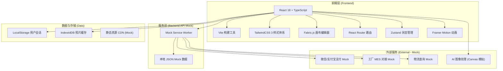
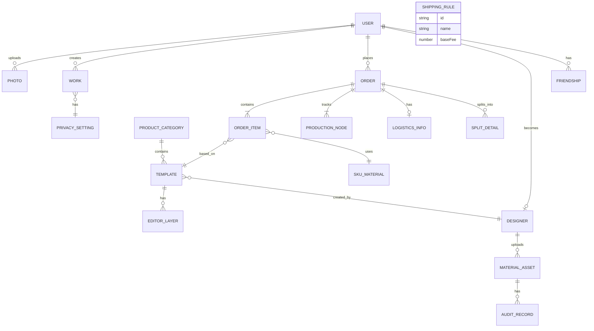

## 1. 架构设计



## 2. 技术选型说明

- **前端框架**: React 18 + TypeScript — 类型安全、生态成熟、适合复杂编辑器交互
- **构建工具**: Vite 5 — 极速 HMR、原生 ESM、构建产物体积小
- **样式方案**: TailwindCSS 3 + PostCSS — 原子化CSS、设计令牌统一、响应式便捷
- **画布编辑器**: Fabric.js 6 — 支持图层、蒙版、裁剪、文字编辑，完全契合在线定制需求
- **路由管理**: React Router v6 — 嵌套路由、懒加载、路由守卫
- **状态管理**: Zustand — 轻量、无 Provider 嵌套、编辑器状态持久化友好
- **动画库**: Framer Motion — 声明式动画、手势交互、与 React 深度集成
- **数据模拟**: Mock Service Worker (MSW) — 拦截真实请求、无需改业务代码、生产可无缝切真实API
- **图标方案**: Lucide React + 自定义 SVG 图标组件

## 3. 路由定义

| 路由路径 | 页面名称 | 说明 |
|----------|----------|------|
| `/` | 首页 | 产品展示、热门模板、作品瀑布流 |
| `/ai-enhance` | AI照片处理页 | 上传照片、AI增强、对比预览 |
| `/products` | 产品分类页 | 12类产品列表、筛选排序 |
| `/products/:categoryId` | 产品详情页 | 单一产品介绍、模板入口 |
| `/templates/:productId` | 模板选择页 | 200+模板网格、场景筛选 |
| `/editor/:templateId` | 在线编辑器 | 画布编辑、图层、素材、文字、蒙版 |
| `/cart` | 购物车页 | 商品列表、材质选择、数量调整 |
| `/checkout` | 结算页 | 地址、运费、支付方式、分账明细 |
| `/orders` | 订单列表页 | 全部订单、状态筛选 |
| `/orders/:orderId` | 订单追踪页 | 生产时间轴、物流轨迹 |
| `/user` | 用户中心 | 个人信息、设置入口 |
| `/user/photos` | 我的照片 | 相册管理、时间线视图 |
| `/user/works` | 我的作品 | 作品列表、隐私设置 |
| `/user/favorites` | 我的收藏 | 收藏的模板和作品 |
| `/community` | 作品社区 | 公开作品瀑布流、点赞评论 |
| `/admin` | 后台首页 | 数据看板、统计概览 |
| `/admin/sku` | SKU材质库 | 材质增删改查、库存预警 |
| `/admin/shipping` | 运费规则 | 区域配置、运费公式 |
| `/admin/audit` | 版权审核 | 素材审核流、设计师审核 |
| `/admin/finance` | 财务对账 | 分账报表、发票管理 |

## 4. 核心类型定义

```typescript
// 用户相关
interface User {
  id: string;
  nickname: string;
  avatar: string;
  phone?: string;
  role: 'normal' | 'enterprise' | 'designer' | 'admin' | 'factory';
  enterpriseInfo?: {
    companyName: string;
    taxNo: string;
    creditCode: string;
  };
  createdAt: string;
}

// 照片与AI处理
interface Photo {
  id: string;
  url: string;
  originalUrl: string;
  thumbnailUrl: string;
  width: number;
  height: number;
  size: number;
  format: 'JPG' | 'PNG' | 'HEIC';
  aiEnhanced: boolean;
  aiParams: {
    qualityEnhance: boolean;
    qualityLevel: number;
    skinCorrection: boolean;
    skinLevel: number;
    backgroundBlur: boolean;
    blurLevel: number;
  };
  privacy: 'public' | 'private' | 'friends';
  visibleFriendIds: string[];
  uploadedAt: string;
}

// 产品与模板
interface ProductCategory {
  id: string;
  name: string;
  icon: string;
  description: string;
  priceRange: [number, number];
  monthlySales: number;
  tags: string[];
}

interface Template {
  id: string;
  productId: string;
  name: string;
  thumbnailUrl: string;
  previewUrls: string[];
  category: 'minimal' | 'vintage' | 'cute' | 'business';
  sceneTags: string[];
  designerId: string;
  designerName: string;
  isFree: boolean;
  price: number;
  usageCount: number;
  canvasWidth: number;
  canvasHeight: number;
  layers: EditorLayer[];
  createdAt: string;
}

// 编辑器图层
type EditorLayerType = 'image' | 'text' | 'shape' | 'mask' | 'sticker' | 'background';

interface EditorLayer {
  id: string;
  type: EditorLayerType;
  name: string;
  visible: boolean;
  locked: boolean;
  order: number;
  x: number;
  y: number;
  width: number;
  height: number;
  rotation: number;
  opacity: number;
  imageData?: {
    src: string;
    cropX: number;
    cropY: number;
    cropWidth: number;
    cropHeight: number;
    maskType?: 'circle' | 'heart' | 'polygon' | 'custom';
    maskPath?: string;
    filters: {
      brightness: number;
      contrast: number;
      saturate: number;
      grayscale: number;
      sepia: number;
    };
  };
  textData?: {
    content: string;
    fontFamily: string;
    fontSize: number;
    fontWeight: number;
    color: string;
    letterSpacing: number;
    lineHeight: number;
    textAlign: 'left' | 'center' | 'right';
    strokeColor?: string;
    strokeWidth?: number;
    shadowColor?: string;
    shadowBlur?: number;
  };
  shapeData?: {
    shapeType: 'rect' | 'circle' | 'line' | 'polygon';
    fill: string;
    stroke: string;
    strokeWidth: number;
    radius?: number;
    points?: number[];
  };
}

// SKU与材质
interface SKUMaterial {
  id: string;
  code: string;
  name: string;
  category: 'photo_paper' | 'frame' | 'binding' | 'other';
  specification: string;
  costPrice: number;
  salePrice: number;
  supplier: string;
  stock: number;
  stockWarningThreshold: number;
  description: string;
  sampleImage: string;
}

// 购物车与订单
interface CartItem {
  id: string;
  templateId: string;
  templateName: string;
  templateThumbnail: string;
  productId: string;
  productName: string;
  materialId: string;
  materialName: string;
  quantity: number;
  unitPrice: number;
  editorSnapshot: EditorLayer[];
  renderedPreview: string;
}

interface Order {
  id: string;
  orderNo: string;
  userId: string;
  items: OrderItem[];
  totalAmount: number;
  shippingFee: number;
  discountAmount: number;
  payableAmount: number;
  paymentMethod: 'wechat' | 'alipay' | 'bank_transfer' | 'monthly_settlement';
  splitDetails: {
    platformFee: number;
    designerRoyalty: number;
    factoryCost: number;
  };
  shippingAddress: {
    name: string;
    phone: string;
    province: string;
    city: string;
    district: string;
    detail: string;
  };
  status: 'pending_payment' | 'paid' | 'in_production' | 'shipped' | 'delivered' | 'cancelled';
  productionNodes: ProductionNode[];
  logisticsInfo?: LogisticsInfo;
  createdAt: string;
  paidAt?: string;
  deliveredAt?: string;
}

interface OrderItem {
  id: string;
  templateId: string;
  templateName: string;
  materialId: string;
  materialName: string;
  quantity: number;
  unitPrice: number;
  subtotal: number;
  renderedImage: string;
  productionFileUrl: string;
}

interface ProductionNode {
  id: string;
  nodeKey: 'order_confirmed' | 'ai_precheck' | 'film_developing' | 'color_calibration' | 'binding' | 'qc' | 'outbound' | 'shipping' | 'delivered';
  nodeName: string;
  status: 'pending' | 'processing' | 'completed' | 'failed';
  timestamp?: string;
  operator?: string;
  remark?: string;
}

interface LogisticsInfo {
  company: string;
  trackingNo: string;
  status: string;
  estimatedDelivery: string;
  courierName?: string;
  courierPhone?: string;
  tracks: {
    time: string;
    location: string;
    description: string;
    lat?: number;
    lng?: number;
  }[];
}

// 设计师与素材版权
interface Designer {
  id: string;
  userId: string;
  realName: string;
  portfolioUrl: string;
  auditStatus: 'pending' | 'approved' | 'rejected';
  auditRemark?: string;
  royaltyRate: number;
  settledAmount: number;
  pendingAmount: number;
  appliedAt: string;
  auditedAt?: string;
}

interface MaterialAsset {
  id: string;
  designerId: string;
  type: 'background' | 'sticker' | 'border' | 'font' | 'template';
  name: string;
  previewUrl: string;
  fileUrl: string;
  tags: string[];
  isFree: boolean;
  price: number;
  copyrightProof: string[];
  auditStatus: 'pending' | 'primary_pass' | 'final_pass' | 'rejected';
  auditHistory: {
    auditorId: string;
    auditorName: string;
    stage: 'primary' | 'final';
    result: 'pass' | 'reject';
    remark?: string;
    timestamp: string;
  }[];
  usageCount: number;
  uploadedAt: string;
}

// 运费规则
interface ShippingRule {
  id: string;
  name: string;
  regions: {
    province: string;
    cities?: string[];
  }[];
  baseFee: number;
  perKgFee: number;
  freeShippingThreshold: number;
  priority: number;
  enabled: boolean;
}
```

## 5. 前端分层架构

```mermaid
flowchart TB
    subgraph "页面层 (Pages)"
        P1["首页 HomePage"]
        P2["AI处理页 AIEnhancePage"]
        P3["产品/模板页 ProductPages"]
        P4["编辑器 EditorPage"]
        P5["购物车/结算 CartPages"]
        P6["订单追踪 OrderPages"]
        P7["用户中心 UserPages"]
        P8["后台管理 AdminPages"]
    end

    subgraph "业务组件层 (Business Components)"
        BC1["PhotoUploader 照片上传器"]
        BC2["AISwitchPanel AI开关面板"]
        BC3["CompareViewer 对比预览"]
        BC4["TemplateGrid 模板网格"]
        BC5["EditorCanvas 编辑画布"]
        BC6["LayerPanel 图层面板"]
        BC7["MaterialLibrary 素材库"]
        BC8["TextEditor 文字编辑器"]
        BC9["MaskCropper 蒙版裁剪"]
        BC10["ProductionTimeline 生产时间轴"]
        BC11["LogisticsMap 物流地图"]
        BC12["SplitAccountCard 分账卡片"]
    end

    subgraph "通用组件层 (UI Components)"
        UC1["Button 按钮"]
        UC2["Card 卡片"]
        UC3["Modal 弹窗"]
        UC4["Slider 滑块"]
        UC5["Switch 开关"]
        UC6["Tabs 标签页"]
        UC7["Dropdown 下拉"]
        UC8["Pagination 分页"]
        UC9["Form 表单组件集"]
        UC10["DataTable 数据表格"]
    end

    subgraph "Hooks 层 (Custom Hooks)"
        H1["usePhotoUpload 上传管理"]
        H2["useAIEnhance AI处理"]
        H3["useEditor 编辑器状态"]
        H4["useCart 购物车"]
        H5["useOrder 订单管理"]
        H6["usePayment 支付流程"]
    end

    subgraph "Store 层 (Zustand)"
        S1["userStore 用户会话"]
        S2["photoStore 照片数据"]
        S3["editorStore 编辑器状态"]
        S4["cartStore 购物车"]
        S5["orderStore 订单数据"]
    end

    subgraph "Service 层 (API Services)"
        SV1["authService 认证"]
        SV2["photoService 照片"]
        SV3["productService 产品/模板"]
        SV4["orderService 订单"]
        SV5["paymentService 支付"]
        SV6["adminService 后台"]
    end

    P1 --> BC1
    P1 --> BC3
    P2 --> BC1
    P2 --> BC2
    P2 --> BC3
    P3 --> BC4
    P4 --> BC5
    P4 --> BC6
    P4 --> BC7
    P4 --> BC8
    P4 --> BC9
    P6 --> BC10
    P6 --> BC11
    P5 --> BC12

    BC1 --> UC1
    BC2 --> UC2
    BC2 --> UC5
    BC2 --> UC4
    BC3 --> UC2
    BC4 --> UC2
    BC4 --> UC8
    BC5 --> D1["Fabric.js"]
    BC6 --> UC2
    BC7 --> UC6
    BC7 --> UC2
    BC8 --> UC9
    BC9 --> D1
    BC10 --> UC2
    BC11 --> UC2
    BC12 --> UC2

    P1 --> H1
    P2 --> H1
    P2 --> H2
    P4 --> H3
    P5 --> H4
    P5 --> H5
    P5 --> H6

    H1 --> S2
    H2 --> S2
    H3 --> S3
    H4 --> S4
    H5 --> S5
    H6 --> S5

    S1 --> SV1
    S2 --> SV2
    S3 --> SV3
    S4 --> SV4
    S5 --> SV4
    S5 --> SV5
```



## 6. 数据模型与存储

### 6.1 数据模型 ER 图



### 6.2 Mock 数据结构（本地 JSON）

```
src/mock/
├── data/
│   ├── users.json          // 用户数据
│   ├── photos.json         // 照片与AI处理数据
│   ├── products.json       // 12类产品数据
│   ├── templates.json      // 模板数据（200+模板缩略信息）
│   ├── materials.json      // SKU材质库
│   ├── carts.json          // 购物车数据
│   ├── orders.json         // 订单与生产节点
│   ├── logistics.json      // 物流轨迹
│   ├── designers.json      // 设计师信息
│   ├── assets.json         // 素材版权
│   ├── shipping.json       // 运费规则
│   └── community.json      // 社区作品
├── handlers/
│   ├── auth.ts
│   ├── photo.ts
│   ├── product.ts
│   ├── order.ts
│   ├── payment.ts
│   └── admin.ts
└── browser.ts              // MSW 入口
```
