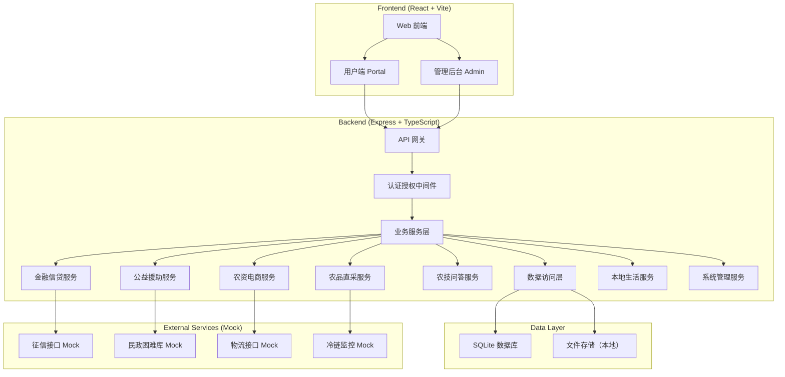
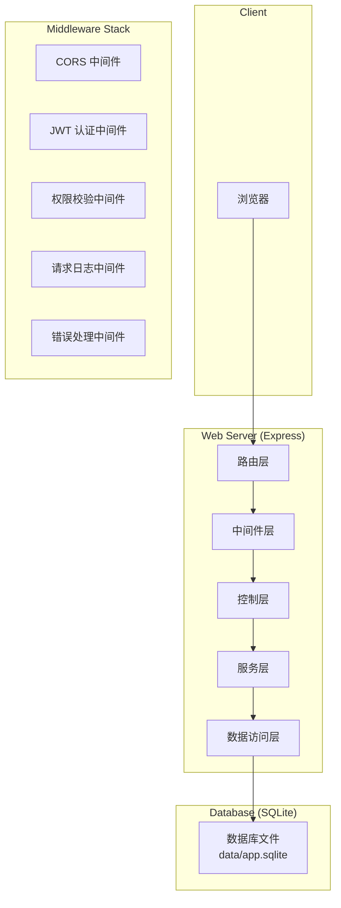
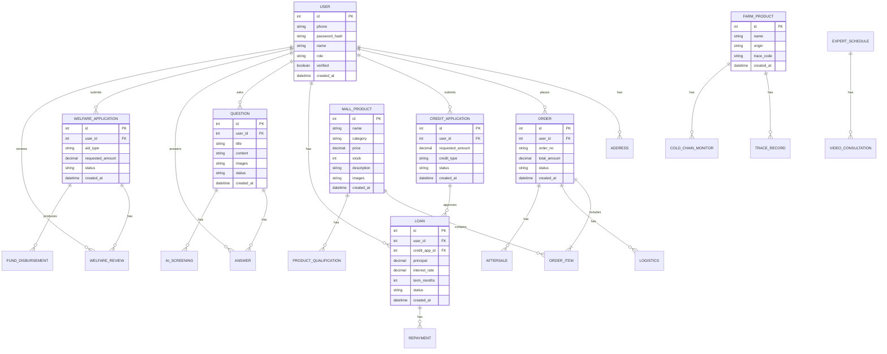

## 1. 架构设计



## 2. 技术描述

### 2.1 前端技术栈

- **框架**: React 18 + TypeScript 5
- **构建工具**: Vite 5
- **路由**: React Router v6
- **状态管理**: Zustand
- **UI 组件库**: Ant Design 5
- **样式**: TailwindCSS 3
- **图表**: ECharts 5
- **HTTP 客户端**: Axios
- **表单**: React Hook Form
- **视频**: React Player
- **地图**: 暂用模拟数据

### 2.2 后端技术栈

- **框架**: Express 4 + TypeScript 5
- **数据库**: SQLite 3 (文件存储: data/app.sqlite)
- **ORM**: TypeORM 0.3
- **认证**: JWT (jsonwebtoken)
- **密码加密**: bcryptjs
- **文件上传**: Multer
- **API 文档**: Swagger UI Express
- **日志**: Winston
- **验证**: class-validator + class-transformer

### 2.3 项目结构

```
may-89085/
├── frontend/
│   ├── src/
│   │   ├── api/          # API 接口
│   │   ├── components/   # 公共组件
│   │   ├── layouts/      # 布局组件
│   │   ├── pages/        # 页面组件
│   │   ├── router/       # 路由配置
│   │   ├── store/        # 状态管理
│   │   ├── types/        # TypeScript 类型
│   │   ├── utils/        # 工具函数
│   │   └── main.tsx      # 入口文件
│   ├── package.json
│   ├── tsconfig.json
│   └── vite.config.ts
├── backend/
│   ├── src/
│   │   ├── config/       # 配置文件
│   │   ├── controllers/  # 控制器
│   │   ├── entities/     # 数据实体
│   │   ├── middleware/   # 中间件
│   │   ├── routes/       # 路由
│   │   ├── services/     # 业务服务
│   │   ├── types/        # TypeScript 类型
│   │   ├── utils/        # 工具函数
│   │   └── index.ts      # 入口文件
│   ├── package.json
│   ├── tsconfig.json
│   └── ormconfig.ts
├── data/
│   └── app.sqlite        # SQLite 数据库
├── .env
├── manage.sh
└── .gitignore
```

## 3. 路由定义

### 3.1 前端路由

| 路由 | 页面 | 权限角色 |
|------|------|----------|
| `/login` | 登录页 | 公开 |
| `/register` | 注册页 | 公开 |
| `/` | 首页（根据角色跳转） | 已登录 |
| `/portal` | 用户端首页 | 所有角色 |
| `/portal/mall` | 农资商城 | 农户/农企 |
| `/portal/mall/:id` | 农资商品详情 | 农户/农企 |
| `/portal/mall/orders` | 农资订单列表 | 农户/农企 |
| `/portal/mall/orders/:id` | 农资订单详情 | 农户/农企 |
| `/portal/finance` | 中和金服首页 | 农户/农企/金融机构 |
| `/portal/finance/express` | 极速贷申请 | 农户/农企 |
| `/portal/finance/revolving` | 随心取申请 | 农户/农企 |
| `/portal/finance/installment` | 用呗分期申请 | 农户/农企 |
| `/portal/finance/manage` | 信贷管理 | 金融机构 |
| `/portal/products` | 农品直采首页 | 所有角色 |
| `/portal/products/pre-sale` | B2C 预售 | 农户/农企/消费者 |
| `/portal/products/bulk` | B2B 集采 | 农企 |
| `/portal/products/trace/:id` | 溯源查询 | 所有角色 |
| `/portal/tech` | 农技首页 | 所有角色 |
| `/portal/tech/ask` | 图文问诊 | 农户/农企 |
| `/portal/tech/video` | 视频问诊 | 农户/农企/专家 |
| `/portal/tech/schedule` | 专家排班 | 专家 |
| `/portal/tech/knowledge` | 知识库 | 所有角色 |
| `/portal/welfare` | 公益援助首页 | 所有角色 |
| `/portal/welfare/apply` | 公益申报 | 农户 |
| `/portal/welfare/review` | 公益审核 | 政务员 |
| `/portal/life` | 本地生活 | 所有角色 |
| `/admin` | 管理后台首页 | 管理员 |
| `/admin/users` | 用户管理 | 管理员 |
| `/admin/products` | 商品管理 | 管理员 |
| `/admin/orders` | 订单管理 | 管理员 |
| `/admin/finance` | 信贷管理 | 管理员 |
| `/admin/statistics` | 数据统计 | 管理员 |

### 3.2 后端 API 路由前缀

| 前缀 | 模块 |
|------|------|
| `/api/auth` | 认证授权 |
| `/api/users` | 用户管理 |
| `/api/mall/products` | 农资商品 |
| `/api/mall/orders` | 农资订单 |
| `/api/mall/aftersale` | 售后管理 |
| `/api/finance/credit` | 授信管理 |
| `/api/finance/loans` | 贷款管理 |
| `/api/products/farm` | 农品管理 |
| `/api/tech/questions` | 农技问答 |
| `/api/tech/experts` | 专家管理 |
| `/api/tech/knowledge` | 知识库 |
| `/api/welfare/applications` | 公益申报 |
| `/api/welfare/review` | 公益审核 |
| `/api/admin` | 管理后台 |

## 4. API 定义

### 4.1 认证接口

```typescript
// POST /api/auth/login
interface LoginRequest {
  phone: string;
  password: string;
  role: UserRole;
}

interface LoginResponse {
  token: string;
  user: UserInfo;
}

// POST /api/auth/register
interface RegisterRequest {
  phone: string;
  password: string;
  role: UserRole;
  name: string;
  idCard?: string;
  companyName?: string;
}

// GET /api/auth/me
interface UserInfo {
  id: number;
  phone: string;
  name: string;
  role: UserRole;
  avatar?: string;
  verified: boolean;
  createdAt: string;
}

type UserRole = 'farmer' | 'enterprise' | 'expert' | 'financial' | 'government';
```

### 4.2 通用响应结构

```typescript
interface ApiResponse<T> {
  code: number;
  message: string;
  data: T;
}

interface PaginationResponse<T> {
  list: T[];
  total: number;
  page: number;
  pageSize: number;
}
```

## 5. 服务器架构图



## 6. 数据模型

### 6.1 ER 图



### 6.2 DDL 语句

```sql
-- 用户表
CREATE TABLE users (
    id INTEGER PRIMARY KEY AUTOINCREMENT,
    phone VARCHAR(20) UNIQUE NOT NULL,
    password_hash VARCHAR(255) NOT NULL,
    name VARCHAR(100) NOT NULL,
    role VARCHAR(20) NOT NULL,
    avatar VARCHAR(255),
    id_card VARCHAR(18),
    company_name VARCHAR(200),
    verified BOOLEAN DEFAULT 0,
    created_at DATETIME DEFAULT CURRENT_TIMESTAMP,
    updated_at DATETIME DEFAULT CURRENT_TIMESTAMP
);

-- 用户地址表
CREATE TABLE addresses (
    id INTEGER PRIMARY KEY AUTOINCREMENT,
    user_id INTEGER NOT NULL,
    province VARCHAR(50),
    city VARCHAR(50),
    district VARCHAR(50),
    detail VARCHAR(200),
    contact_name VARCHAR(50),
    contact_phone VARCHAR(20),
    is_default BOOLEAN DEFAULT 0,
    created_at DATETIME DEFAULT CURRENT_TIMESTAMP,
    FOREIGN KEY (user_id) REFERENCES users(id)
);

-- 农资商品表
CREATE TABLE mall_products (
    id INTEGER PRIMARY KEY AUTOINCREMENT,
    name VARCHAR(200) NOT NULL,
    category VARCHAR(50) NOT NULL,
    price DECIMAL(10,2) NOT NULL,
    original_price DECIMAL(10,2),
    stock INTEGER DEFAULT 0,
    description TEXT,
    images TEXT,
    specs TEXT,
    status VARCHAR(20) DEFAULT 'active',
    created_at DATETIME DEFAULT CURRENT_TIMESTAMP
);

-- 商品资质表
CREATE TABLE product_qualifications (
    id INTEGER PRIMARY KEY AUTOINCREMENT,
    product_id INTEGER NOT NULL,
    type VARCHAR(50) NOT NULL,
    certificate_no VARCHAR(100),
    certificate_file VARCHAR(255),
    expire_date DATE,
    verified BOOLEAN DEFAULT 0,
    created_at DATETIME DEFAULT CURRENT_TIMESTAMP,
    FOREIGN KEY (product_id) REFERENCES mall_products(id)
);

-- 订单表
CREATE TABLE orders (
    id INTEGER PRIMARY KEY AUTOINCREMENT,
    user_id INTEGER NOT NULL,
    order_no VARCHAR(32) UNIQUE NOT NULL,
    total_amount DECIMAL(10,2) NOT NULL,
    status VARCHAR(20) NOT NULL,
    address_id INTEGER,
    remark TEXT,
    created_at DATETIME DEFAULT CURRENT_TIMESTAMP,
    FOREIGN KEY (user_id) REFERENCES users(id)
);

-- 订单明细表
CREATE TABLE order_items (
    id INTEGER PRIMARY KEY AUTOINCREMENT,
    order_id INTEGER NOT NULL,
    product_id INTEGER NOT NULL,
    quantity INTEGER NOT NULL,
    unit_price DECIMAL(10,2) NOT NULL,
    created_at DATETIME DEFAULT CURRENT_TIMESTAMP,
    FOREIGN KEY (order_id) REFERENCES orders(id),
    FOREIGN KEY (product_id) REFERENCES mall_products(id)
);

-- 物流表
CREATE TABLE logistics (
    id INTEGER PRIMARY KEY AUTOINCREMENT,
    order_id INTEGER NOT NULL,
    company VARCHAR(50),
    tracking_no VARCHAR(50),
    status VARCHAR(20),
    tracking_info TEXT,
    created_at DATETIME DEFAULT CURRENT_TIMESTAMP,
    FOREIGN KEY (order_id) REFERENCES orders(id)
);

-- 售后表
CREATE TABLE aftersales (
    id INTEGER PRIMARY KEY AUTOINCREMENT,
    order_id INTEGER NOT NULL,
    type VARCHAR(20) NOT NULL,
    reason TEXT,
    images TEXT,
    status VARCHAR(20),
    refund_amount DECIMAL(10,2),
    created_at DATETIME DEFAULT CURRENT_TIMESTAMP,
    FOREIGN KEY (order_id) REFERENCES orders(id)
);

-- 授信申请表
CREATE TABLE credit_applications (
    id INTEGER PRIMARY KEY AUTOINCREMENT,
    user_id INTEGER NOT NULL,
    requested_amount DECIMAL(12,2) NOT NULL,
    purpose TEXT,
    planting_area DECIMAL(10,2),
    order_flow DECIMAL(12,2),
    warehouse_receipt DECIMAL(12,2),
    credit_score INTEGER,
    approved_amount DECIMAL(12,2),
    status VARCHAR(20),
    created_at DATETIME DEFAULT CURRENT_TIMESTAMP,
    FOREIGN KEY (user_id) REFERENCES users(id)
);

-- 贷款表
CREATE TABLE loans (
    id INTEGER PRIMARY KEY AUTOINCREMENT,
    user_id INTEGER NOT NULL,
    credit_app_id INTEGER,
    loan_type VARCHAR(20) NOT NULL,
    principal DECIMAL(12,2) NOT NULL,
    interest_rate DECIMAL(5,2) NOT NULL,
    term_months INTEGER NOT NULL,
    status VARCHAR(20),
    disbursed_at DATETIME,
    created_at DATETIME DEFAULT CURRENT_TIMESTAMP,
    FOREIGN KEY (user_id) REFERENCES users(id),
    FOREIGN KEY (credit_app_id) REFERENCES credit_applications(id)
);

-- 还款表
CREATE TABLE repayments (
    id INTEGER PRIMARY KEY AUTOINCREMENT,
    loan_id INTEGER NOT NULL,
    period INTEGER NOT NULL,
    principal_amount DECIMAL(12,2) NOT NULL,
    interest_amount DECIMAL(12,2) NOT NULL,
    status VARCHAR(20),
    paid_at DATETIME,
    created_at DATETIME DEFAULT CURRENT_TIMESTAMP,
    FOREIGN KEY (loan_id) REFERENCES loans(id)
);

-- 农品表
CREATE TABLE farm_products (
    id INTEGER PRIMARY KEY AUTOINCREMENT,
    name VARCHAR(200) NOT NULL,
    category VARCHAR(50),
    origin VARCHAR(100),
    trace_code VARCHAR(50) UNIQUE,
    price DECIMAL(10,2),
    stock INTEGER DEFAULT 0,
    description TEXT,
    images TEXT,
    sale_type VARCHAR(20),
    created_at DATETIME DEFAULT CURRENT_TIMESTAMP
);

-- 溯源记录表
CREATE TABLE trace_records (
    id INTEGER PRIMARY KEY AUTOINCREMENT,
    product_id INTEGER NOT NULL,
    stage VARCHAR(50),
    location VARCHAR(100),
    operator VARCHAR(50),
    operation TEXT,
    temperature DECIMAL(5,2),
    humidity DECIMAL(5,2),
    record_time DATETIME,
    created_at DATETIME DEFAULT CURRENT_TIMESTAMP,
    FOREIGN KEY (product_id) REFERENCES farm_products(id)
);

-- 冷链监控表
CREATE TABLE cold_chain_monitors (
    id INTEGER PRIMARY KEY AUTOINCREMENT,
    product_id INTEGER NOT NULL,
    temperature DECIMAL(5,2),
    humidity DECIMAL(5,2),
    location VARCHAR(100),
    monitor_time DATETIME,
    created_at DATETIME DEFAULT CURRENT_TIMESTAMP,
    FOREIGN KEY (product_id) REFERENCES farm_products(id)
);

-- 农技问题表
CREATE TABLE questions (
    id INTEGER PRIMARY KEY AUTOINCREMENT,
    user_id INTEGER NOT NULL,
    title VARCHAR(200) NOT NULL,
    content TEXT,
    images TEXT,
    category VARCHAR(50),
    status VARCHAR(20),
    expert_id INTEGER,
    created_at DATETIME DEFAULT CURRENT_TIMESTAMP,
    FOREIGN KEY (user_id) REFERENCES users(id)
);

-- AI 初筛表
CREATE TABLE ai_screenings (
    id INTEGER PRIMARY KEY AUTOINCREMENT,
    question_id INTEGER NOT NULL,
    suspected_disease VARCHAR(100),
    confidence DECIMAL(5,2),
    suggestions TEXT,
    created_at DATETIME DEFAULT CURRENT_TIMESTAMP,
    FOREIGN KEY (question_id) REFERENCES questions(id)
);

-- 专家回复表
CREATE TABLE answers (
    id INTEGER PRIMARY KEY AUTOINCREMENT,
    question_id INTEGER NOT NULL,
    expert_id INTEGER NOT NULL,
    content TEXT,
    images TEXT,
    created_at DATETIME DEFAULT CURRENT_TIMESTAMP,
    FOREIGN KEY (question_id) REFERENCES questions(id),
    FOREIGN KEY (expert_id) REFERENCES users(id)
);

-- 专家排班表
CREATE TABLE expert_schedules (
    id INTEGER PRIMARY KEY AUTOINCREMENT,
    expert_id INTEGER NOT NULL,
    date DATE NOT NULL,
    time_slots TEXT,
    available BOOLEAN DEFAULT 1,
    created_at DATETIME DEFAULT CURRENT_TIMESTAMP,
    FOREIGN KEY (expert_id) REFERENCES users(id)
);

-- 视频问诊表
CREATE TABLE video_consultations (
    id INTEGER PRIMARY KEY AUTOINCREMENT,
    user_id INTEGER NOT NULL,
    expert_id INTEGER NOT NULL,
    schedule_id INTEGER,
    start_time DATETIME,
    end_time DATETIME,
    status VARCHAR(20),
    created_at DATETIME DEFAULT CURRENT_TIMESTAMP,
    FOREIGN KEY (user_id) REFERENCES users(id),
    FOREIGN KEY (expert_id) REFERENCES users(id),
    FOREIGN KEY (schedule_id) REFERENCES expert_schedules(id)
);

-- 知识库表
CREATE TABLE knowledge_articles (
    id INTEGER PRIMARY KEY AUTOINCREMENT,
    title VARCHAR(200) NOT NULL,
    category VARCHAR(50),
    content TEXT,
    images TEXT,
    video_url VARCHAR(255),
    author_id INTEGER,
    view_count INTEGER DEFAULT 0,
    created_at DATETIME DEFAULT CURRENT_TIMESTAMP,
    FOREIGN KEY (author_id) REFERENCES users(id)
);

-- 公益申请表
CREATE TABLE welfare_applications (
    id INTEGER PRIMARY KEY AUTOINCREMENT,
    user_id INTEGER NOT NULL,
    aid_type VARCHAR(50) NOT NULL,
    requested_amount DECIMAL(12,2),
    description TEXT,
    proof_files TEXT,
    status VARCHAR(20),
    village_review_by INTEGER,
    village_review_comment TEXT,
    county_review_by INTEGER,
    county_review_comment TEXT,
    final_amount DECIMAL(12,2),
    created_at DATETIME DEFAULT CURRENT_TIMESTAMP,
    FOREIGN KEY (user_id) REFERENCES users(id)
);

-- 资金发放表
CREATE TABLE fund_disbursements (
    id INTEGER PRIMARY KEY AUTOINCREMENT,
    application_id INTEGER NOT NULL,
    amount DECIMAL(12,2) NOT NULL,
    payee_name VARCHAR(100),
    bank_account VARCHAR(50),
    disbursed_at DATETIME,
    status VARCHAR(20),
    created_at DATETIME DEFAULT CURRENT_TIMESTAMP,
    FOREIGN KEY (application_id) REFERENCES welfare_applications(id)
);

-- 操作日志表
CREATE TABLE operation_logs (
    id INTEGER PRIMARY KEY AUTOINCREMENT,
    user_id INTEGER,
    module VARCHAR(50),
    action VARCHAR(50),
    target_id INTEGER,
    ip_address VARCHAR(50),
    created_at DATETIME DEFAULT CURRENT_TIMESTAMP
);

-- 创建索引
CREATE INDEX idx_users_phone ON users(phone);
CREATE INDEX idx_users_role ON users(role);
CREATE INDEX idx_orders_user_id ON orders(user_id);
CREATE INDEX idx_orders_status ON orders(status);
CREATE INDEX idx_loans_user_id ON loans(user_id);
CREATE INDEX idx_questions_user_id ON questions(user_id);
CREATE INDEX idx_welfare_applications_user_id ON welfare_applications(user_id);
```

## 7. 开发阶段规划

| 阶段 | 模块 | 优先级 | 预估工作量 |
|------|------|--------|-----------|
| Phase 1 | 项目初始化 + 用户认证 + 管理后台框架 | 高 | - |
| Phase 2 | 农资电商模块 | 高 | - |
| Phase 3 | 中和金服信贷模块 | 高 | - |
| Phase 4 | 农品直采模块 | 中 | - |
| Phase 5 | 农技问答模块 | 中 | - |
| Phase 6 | 公益援助模块 | 中 | - |
| Phase 7 | 本地生活模块 | 低 | - |
| Phase 8 | 系统联调与验收 | 高 | - |
