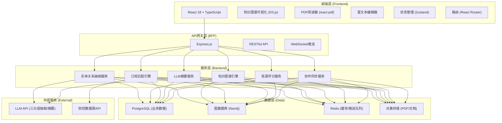
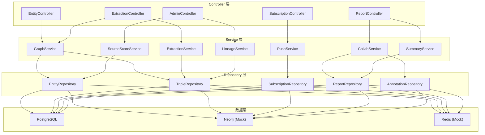
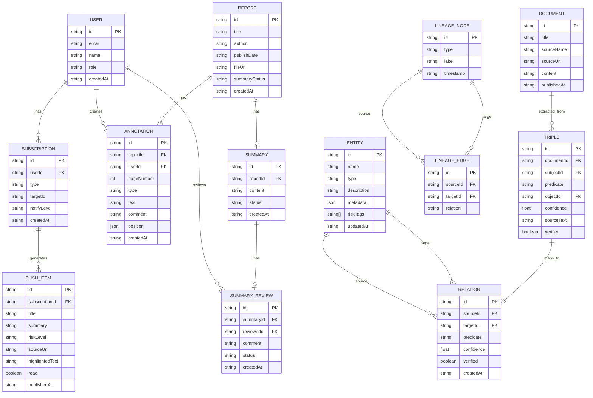

## 1. 架构设计



## 2. 技术选型说明

- **前端框架**：React 18 + TypeScript + Vite
  - 选择理由：组件化开发、类型安全、构建速度快、生态完善
- **样式方案**：Tailwind CSS 3 + CSS Variables
  - 选择理由：原子化CSS、快速原型、设计系统一致性
- **状态管理**：Zustand
  - 选择理由：轻量级、API简洁、避免Redux boilerplate
- **知识图谱可视化**：D3.js (force-simulation)
  - 选择理由：高度定制化、力导向布局灵活、性能可控
- **PDF渲染**：react-pdf
  - 选择理由：React原生支持、客户端渲染、标注能力扩展
- **后端框架**：Express.js + TypeScript (ESM)
  - 选择理由：轻量灵活、与前端技术栈统一、中间件生态丰富
- **数据存储**：
  - PostgreSQL：业务数据（用户、订阅、研报元数据）
  - Neo4j：图结构数据（实体、关系、三元组）
  - Redis：缓存、推送队列、实时协作状态
  - Mock Data：演示阶段使用内存数据模拟

## 3. 路由定义

| 路由路径 | 页面名称 | 说明 |
|---------|---------|-----|
| `/` | 知识图谱主页 | 力导向图展示、搜索、热点排行 |
| `/entity/:id` | 实体详情页 | 实体画像、关联图谱、时间线 |
| `/extraction` | 信息抽取中心 | 文本上传、三元组抽取与校验 |
| `/subscriptions` | 订阅推送中心 | 订阅管理、推送列表 |
| `/workspace` | 分析师协作空间 | 研报库列表 |
| `/workspace/:reportId` | 研报协作页 | PDF阅读、标注、摘要生成 |
| `/admin/lineage` | 数据血缘追溯 | 三元组溯源可视化 |
| `/admin/sources` | 信源评分管理 | 信源可信度评分与配置 |
| `/admin/summaries` | 摘要审核队列 | LLM摘要人工复核 |

## 4. API 接口定义

### 4.1 实体与知识图谱

```typescript
interface Entity {
  id: string;
  name: string;
  type: 'company' | 'person' | 'institution' | 'concept' | 'industry';
  description?: string;
  metadata?: Record<string, any>;
  riskTags?: string[];
  updatedAt: string;
}

interface Relation {
  id: string;
  sourceId: string;
  targetId: string;
  predicate: string;
  confidence: number;
  sourceDocId?: string;
  sourceText?: string;
  verified: boolean;
  createdAt: string;
}

interface Triple {
  subject: Entity;
  predicate: string;
  object: Entity;
  confidence: number;
  sourceText: string;
  verified: boolean;
}

// GET /api/entities/search?q=xxx
interface SearchEntityResponse {
  entities: Entity[];
  total: number;
}

// GET /api/graph/neighbors?entityId=xxx&depth=2
interface GraphNeighborsResponse {
  nodes: Entity[];
  links: Relation[];
}
```

### 4.2 信息抽取

```typescript
// POST /api/extraction/upload
// multipart/form-data: file + text
interface ExtractionResponse {
  taskId: string;
  triples: Triple[];
  processingTime: number;
}

// POST /api/extraction/:taskId/verify
interface VerifyTripleRequest {
  tripleId: string;
  action: 'approve' | 'reject' | 'revise';
  revisedSubject?: string;
  revisedPredicate?: string;
  revisedObject?: string;
}
```

### 4.3 订阅推送

```typescript
interface Subscription {
  id: string;
  type: 'entity' | 'concept' | 'event';
  targetId: string;
  targetName: string;
  notifyLevel: 'all' | 'important' | 'risk';
  createdAt: string;
}

interface PushItem {
  id: string;
  subscriptionId: string;
  title: string;
  summary: string;
  riskLevel: 'low' | 'medium' | 'high';
  sourceUrl: string;
  sourceName: string;
  highlightedText: string;
  relatedEntities: string[];
  publishedAt: string;
  read: boolean;
}

// GET /api/subscriptions
// POST /api/subscriptions
// DELETE /api/subscriptions/:id
// GET /api/pushes?unreadOnly=true
// POST /api/pushes/:id/read
```

### 4.4 研报协作

```typescript
interface Report {
  id: string;
  title: string;
  author: string;
  publishDate: string;
  industry?: string;
  fileUrl: string;
  pageCount: number;
  collaborators: string[];
  summary?: string;
  summaryStatus: 'pending' | 'generating' | 'reviewing' | 'finalized';
  createdAt: string;
}

interface Annotation {
  id: string;
  reportId: string;
  pageNumber: number;
  type: 'highlight' | 'underline' | 'comment';
  color?: string;
  text?: string;
  comment?: string;
  annotatorId: string;
  annotatorName: string;
  position: { x: number; y: number; width: number; height: number };
  createdAt: string;
}

// GET /api/reports
// GET /api/reports/:id
// GET /api/reports/:id/annotations
// POST /api/reports/:id/annotations
// POST /api/reports/:id/summary/generate
// POST /api/reports/:id/summary/review
```

### 4.5 后台管理

```typescript
interface LineageNode {
  id: string;
  type: 'triple' | 'document' | 'source' | 'extraction_task';
  label: string;
  timestamp: string;
}

interface LineageEdge {
  sourceId: string;
  targetId: string;
  relation: string;
}

interface SourceScore {
  sourceId: string;
  sourceName: string;
  dimensions: {
    authority: number;
    timeliness: number;
    accuracy: number;
    completeness: number;
  };
  overall: number;
  history: { date: string; score: number }[];
}

interface SummaryReview {
  id: string;
  reportId: string;
  reportTitle: string;
  originalText: string;
  generatedSummary: string;
  reviewerComment?: string;
  status: 'pending' | 'approved' | 'revised';
  createdAt: string;
}

// GET /api/admin/lineage?tripleId=xxx
// GET /api/admin/sources/scores
// GET /api/admin/summaries/review-queue
```

## 5. 服务端架构



## 6. 数据模型

### 6.1 ER 图



### 6.2 初始化 Mock 数据策略

由于演示阶段不使用真实数据库，采用以下策略：
- 使用内存数据存储（Map/Array）模拟 PostgreSQL
- 知识图谱节点和关系使用 JS 对象图结构模拟 Neo4j
- 预置 50+ 实体（上市公司、高管、机构）、100+ 关系三元组
- 预置 10+ 研报元数据、20+ 标注示例、推送数据
- 所有数据通过 `src/mock/` 目录下的模块统一管理，提供 seed 函数初始化
